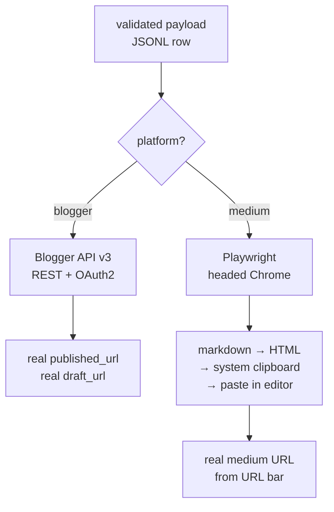

# Publisher Adapters Rewrite (P0-1)

## Problem Frame

现有的 `opencli-plugin/{medium,blogger}/create-post.ts` 适配器实际是「伪发布」：

- TS 源码顶部是 Python docstring，**编译不过**（`opencli-plugin/medium/create-post.ts:1`）
- 用 `browser.click("0")` 元素索引盲点点击，**Medium DOM 一变就失效**（`medium/create-post.ts:115`）
- 把 markdown 逐行 keystroke 写入 WYSIWYG 编辑器，**markdown 语法全部以纯文本出现**（`medium/create-post.ts:127-133`）
- 用本地 SHA256 拼出来的 `https://medium.com/p/{id}` 当作返回的 draft URL —— **不是 Medium 真实返回的 URL**（`medium/create-post.ts:180`）

业务影响：当前 pipeline 跑通是因为 OpenCLI 那一层「假装成功」并伪造返回值，实际发布平台后台一篇都没有。

## Architecture

两个平台走不同通道：

| 维度 | Blogger | Medium |
|---|---|---|
| 通道 | 官方 API v3 | Playwright 浏览器自动化 |
| 鉴权 | OAuth2 token | 复用 Chrome user-data-dir |
| 并发 | 支持 | 顺序 + 随机 sleep |
| 失败模式 | rate-limit / token 过期 | selector 漂移 / CAPTCHA |
| 真 URL 来源 | API 响应 | 编辑器 URL bar |

## Requirements

**Blogger 适配器（API 路线）**
- R1. 用 Blogger API v3 (REST + OAuth2) 完全替换 `opencli-plugin/blogger/create-post.ts` 的浏览器调用
- R2. 支持 `--mode draft|publish`，与现有 CLI 标志对齐
- R3. 单次 OAuth2 授权后 token 持久化到 `~/.config/backlink-publisher/blogger-token.json`，过期自动 refresh
- R4. 用户在全局配置文件 `~/.config/backlink-publisher/config.toml` 里维护 `main_domain → blog_id` 映射；适配器按 seed 的 `main_domain` 查表得到 `blog_id`，缺映射时报错（exit 3）
- R5. 返回真实 `published_url` / `draft_url`，不再生造

**Medium 适配器（Playwright 路线）**
- R6. 用 Playwright 重写 `opencli-plugin/medium/create-post.ts`，通过 `user-data-dir` 复用已登录的 Chrome profile
- R7. Markdown 在本地 render 成 HTML（`markdown-it`），写入系统剪贴板，再在 Medium 编辑器中触发 paste；标题、链接、加粗、headings、tags 全部保留样式
- R8. 用稳定的 CSS selector / role selector 定位 「标题区」「正文区」「Tags 输入」「Publish/Draft 按钮」
- R9. 发布完成后从 `page.url()` 抓取真实 Medium 草稿/已发布 URL
- R10. 每篇之间随机 sleep 60-300 秒（极保守，默认值），通过环境变量 `MEDIUM_THROTTLE_MIN` / `MEDIUM_THROTTLE_MAX` 可覆盖，避免反垃圾触发

**架构与兼容**
- R11. 删除 OpenCLI 浏览器自动化整体依赖，README 同步更新
- R12. `publish-backlinks` CLI 接口、输入输出 JSONL schema **完全不变**，只换底层 adapter（plan/validate 链路零改动）
- R13. 错误码语义保持：3 = 依赖错误（Playwright 未装/Blogger 凭证缺失）、4 = 外部服务错误（API rate limit / 登录失效 / CAPTCHA）

**可观测性**
- R14. 每次发布前后在 stderr 输出结构化 JSON 日志：adapter、platform、id、阶段（open/fill/save/done）、耗时
- R15. Medium 失败时自动保存 Playwright screenshot 到 `~/.cache/backlink-publisher/screenshots/{id}-{timestamp}.png`，stderr 打印路径

## Success Criteria

- 跑 5 条 Blogger seed → 5 条都在真实 Blogger 后台出现；返回的 `published_url` HTTP 访问 200
- 跑 5 条 Medium seed → Medium drafts 列表里看到 5 篇格式正确（标题、加粗、超链接、tags、headings 都渲染）
- 重启工具后 Blogger 不需要重新 OAuth；Medium 不需要重新登录
- `--dry-run` 仍能输出命令计划而不真发布
- 任一现有 pytest 测试不退化（plan / validate 路径不被影响）

## Scope Boundaries

- ❌ 不实现 LLM 内容重写（属 P0-2，单独立项）
- ❌ 不新增 Blogger/Medium 之外的平台
- ❌ 不重构 `webui.py`（属 P2-1）
- ❌ 不实现发布历史持久化数据库（属 P1-2）
- ❌ 不实现并发发布（顺序 + throttle 即可）
- ❌ 不修复 P1 三连 bug（extra_urls 多语言 / mode B-C 路径 / webui.py 依赖）—— 单独的小修复 PR

## Key Decisions

- **Blogger 走 API，Medium 必须保留浏览器自动化但换 Playwright**。Why: 前者有官方 API，后者新账号拿不到 API token；统一技术栈是次优目标。
- **删除 OpenCLI 整体依赖**。Why: 你的代码里 OpenCLI 只用了 `browser.{open,click,type,keys,state,close,screenshot}` 几个原语，Playwright 完全可直接表达，留着只会让两套工具并行存在。
- **用剪贴板粘贴 HTML 而不是 keystroke 模拟**。Why: Medium 编辑器接收 paste 事件时会保留 HTML 样式（这是 Medium 用户从 Google Docs 复制粘贴的常规路径），逐键打字会把 markdown 当文本字面值。
- **CLI 接口零改动**。Why: 让上游 plan/validate、webui.py、用户脚本完全无感知。
- **blog_id 通过全局配置文件映射**。Why: seed 文件保持纯净，多 blog 用户加一行 TOML 即可；命令行参数和 seed-per-row 都会让批量场景体验变差。
- **Medium 节流默认 60-300s（极保守）**。Why: 用户判断 backlink 账号是长期资产，宁可慢也要保账号。

## Dependencies / Assumptions

- 假设：用户机器能装 Chromium（Playwright `npx playwright install chromium` 一次性）
- 假设：用户有 Google 账号且能开 Blogger API（免费层 daily quota 远超本工具用量）
- 假设：seed 里 `main_domain` 是用户拥有的网站，**Blogger 是 backlink 的发布媒介**而非 backlink 指向的目标
- 假设：Node.js ≥ 21 仍是底线（Playwright 要求 ≥ 18，OK）

## Outstanding Questions

### Deferred to Planning

- [Affects R7][Technical] Playwright 剪贴板权限在 headed 模式默认可用，headless 需 `--enable-clipboard` flag，是否一律走 headed 更稳？plan 阶段确认。
- [Affects R6][Technical] 默认 Chrome `user-data-dir` 路径在 macOS/Linux/Windows 三平台不同，需要明确 fallback 与覆盖机制。
- [Affects R3][Needs research] Google OAuth refresh token 在长期空闲（6 个月+）后会失效，需要确认是否要走 PKCE flow 或在 token 失效时给出清晰的重新授权提示。

## Next Steps

→ `/ce:plan` for structured implementation planning
