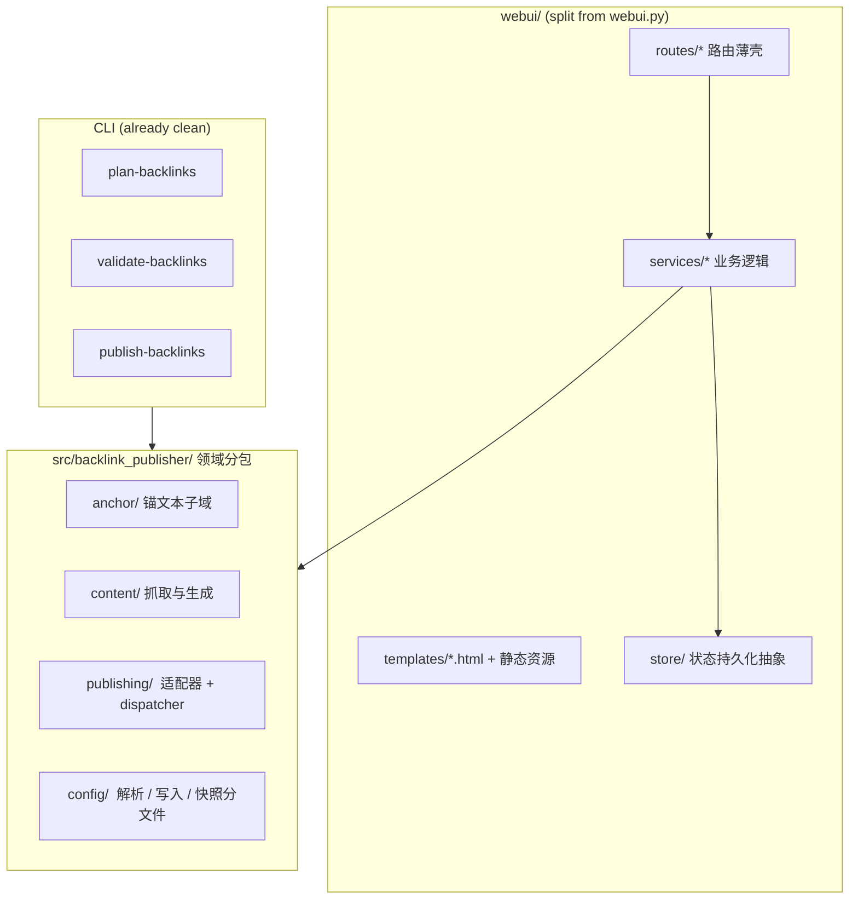

# 架构与代码健康度优化分析报告

> 输出：诊断 + 分阶段重构路线图（P0/P1/P2）。仅聚焦架构健康度，发布成功率 / SEO 效力 / 运营效率属于平行议题，本文不涉及。

## Problem Frame

`backlink-publisher` 已经是一个有 51 个测试文件、8 份 brainstorm 文档、~13k 行 Python 的成熟项目，CLI 流水线 (`plan → validate → publish`) 抽象干净。但 **WebUI 与配置层在最近半年快速吸纳功能**（站点管理、定时草稿、OAuth、历史、profile、调度恢复），出现了三处明显的结构压力：

1. `webui.py` 单文件 4904 行 / 208KB，**其中 56.5% 是 5 块内联 HTML 字符串模板**，路由、HTML、持久化、OAuth、调度互相耦合。
2. `config.py` 单文件 1567 行 / 39 个顶层函数与类，混合了 TOML 解析、原子写、快照历史、权限警告、4 套 token 读写、7+ 个 section 解析器。
3. `src/backlink_publisher/` 是 **30+ 个扁平模块** 的平铺布局，`anchor_*`（5 个）、`content_*`、`work_*`、`markdown_utils`、`url_utils` 等领域概念没有归类，新增模块没有归处。

这些点目前 **没有阻塞任何功能**，但每一处都在持续提高新功能的边际成本：单个文件改动牵动太多并发关注点、HTML 修改无法走前端工具链、配置项扩展容易把 `config.py` 顶到 2000 行。这份报告目的是把这些热点量化、分级、并给出可执行的重构序列。

## 系统现状（量化）

| 热点 | 体积 | 关注点数 | 风险类型 | 严重度 |
|---|---|---|---|---|
| `webui.py` | 4904 行 / 208KB | ≥7 (路由 / 内联HTML / 文件持久化 / OAuth / APScheduler / 表单校验 / URL 规整化) | 修改放大、HTML 无 lint / 无组件化 / 无 i18n 抽离 | **P0** |
| `config.py` | 1567 行 / 39 defs | ≥6 (读 / 写 / 快照 / 权限警告 / token×4 / section 解析器×7) | 配置项扩展每次都加这一处，回归面大 | **P1** |
| `src/backlink_publisher/` 扁平 | 30+ 模块 | 5 个 `anchor_*` + 3 个 `work_*`/`content_*` + 一堆 utils 同级 | 新模块没归处，import 噪音大 | **P1** |
| Medium 适配器 3 路径 | api / brave / browser | dispatch 在 `adapters/__init__.py` 内联 if 链 | 增加平台 / 新降级路径需要改 dispatcher，无 registry | **P2** |
| 文件型状态持久化 | 4 个 JSON 文件 + `threading.Lock` | history / drafts / profiles / schedule | 并发只靠单进程锁，跨进程 / 重启恢复脆弱 | **P2** |

> 量化说明：HTML 占比通过扫描 `webui.py` 的三引号块得出 (117,790 / 208,414 字节)；模块数为 `src/backlink_publisher/` 顶层 `.py` 文件数（含 utils，不含 `cli/` 与 `adapters/`）。

## 目标架构（概念，非实现）



## Requirements

> 使用稳定 ID（R1…），后续 `/ce:plan` 与代码评审都可引用。

**WebUI 拆解（P0）**

- R1. `webui.py` 拆为包：`webui/app.py`（Flask app 工厂 + scheduler 启动）、`webui/routes/<area>.py`（按区域分组的路由薄壳）、`webui/services/<area>.py`（业务逻辑）、`webui/store/`（状态持久化）。单文件目标 ≤ 500 行。
- R2. 5 块内联 HTML（≈117KB）抽出为 Jinja2 模板文件，置于 `webui/templates/`；保留现有 UI 行为与端点契约不变（同 URL、同表单字段名、同 redirect 行为）。
- R3. 文件型状态（`publish-history.json` / `campaign-profiles.json` / `draft-queue.json` / `schedule-settings.json`）统一到一个 `JsonStore` 抽象（原子写 + 单进程锁 + 简单 schema 校验），路由层不再直接 `_load_*` / `_save_*`。
- R4. 路由分组下限：按现有 16 个 `/ce:*` 命名空间 + 站点 / 设置 / 历史 / 草稿 4 个区域，至少拆成 5 个 `routes/*.py` 模块。

**配置层瘦身（P1）**

- R5. `config.py` 按职责拆为子包：`config/loader.py`（TOML 读 + 解析器调度）、`config/parsers/<section>.py`（每个 section 一个解析器：`anchor`, `target`, `llm`, `three_url`, `alarm`）、`config/writer.py`（原子写 + 快照 + 权限警告）、`config/tokens.py`（Blogger / Medium token 读写）。
- R6. `Config` dataclass 保留为顶层 stable API，导出位置不变（`from backlink_publisher.config import Config, load_config`），确保 CLI 与现有测试 import path 不破。
- R7. 至少 1 个回归测试覆盖：旧 TOML → 拆分后 loader → 同一份 `Config` dict 等价（防止解析行为漂移）。

**领域分包（P1）**

- R8. 将 30+ 平铺模块按领域归类，目标四个子包：`anchor/`（合并 5 个 `anchor_*` 模块）、`content/`（`content_fetch` / `work_scraper` / `work_themed_generator`）、`linkcheck/`（`linkcheck` / `language_check` / `verify_publish`）、`publishing/`（容纳 `adapters/` 与 dispatcher）。
- R9. 公共 utils（`url_utils`, `markdown_utils`, `jsonl`, `io_utils`, `logger`, `errors`）下沉到 `_util/` 或 `core/`，与领域分开。
- R10. 顶层 `__init__.py` 维护旧 import path 的兼容 re-export，至少保留一个 deprecation 周期，避免外部脚本 / 双击启动器立刻断。

**适配器与状态（P2，可后置）**

- R11. 引入 `Publisher` ABC + 平台 → 适配器链的 registry（字典或装饰器），把 `adapters/__init__.py:publish()` 中的 `if blogger / elif medium` 链替换为表驱动；新增平台只改 registry。
- R12. 文件型状态保留 JSON 作为存储后端，但 `JsonStore` 抽象预留 SQLite 实现位（不必现在实现），未来跨进程 / 历史检索需求来时切换无需改业务层。

## User Flow（重构后开发动线，非用户动线）

```text
新增一个 WebUI 页面（重构后）
  │
  ├─ 1. webui/templates/<area>.html        ← 改模板
  ├─ 2. webui/routes/<area>.py             ← 加 @bp.route，调 service
  ├─ 3. webui/services/<area>.py           ← 业务逻辑，调 domain + store
  └─ 4. tests/webui/test_<area>.py         ← 路由级集成测试

对比现状：所有四件事都要在 webui.py 同一个 4904 行文件里改。
```

## Success Criteria

- S1. `webui.py` 拆分完成后，**单文件 ≤ 500 行**；内联 HTML 字节占比 ≤ 5%。
- S2. `config.py` 拆分完成后，**单文件 ≤ 400 行**；现有测试 0 修改 / 0 跳过通过。
- S3. 领域分包完成后，`src/backlink_publisher/` 顶层 `.py` ≤ 6 个（仅 `__init__.py` + 4 个领域包入口 + 1 个 `_util` 入口）。
- S4. 51 个现有测试全部通过；不引入新的快照测试 / 不放宽现有断言。
- S5. WebUI 行为回归测试：现有 39 个路由对相同输入返回相同 status code 与相同 redirect 目标（端点契约不变）。
- S6. `pip install -e .` + 双击 `启动 WebUI.command` + CLI 三件套 `plan-backlinks | validate-backlinks | publish-backlinks` 路径全部仍可用。

## Scope Boundaries

- **不变动 CLI 命令行接口**：`plan-backlinks` / `validate-backlinks` / `publish-backlinks` / `report-anchors` / `footprint` 行为与参数完全不变。
- **不引入前端构建工具链**：拆 HTML 用 Jinja2 即可，不上 Vite / Webpack / React，避免双击启动复杂化。
- **不切换存储引擎**：JSON 文件持久化形态保留；只做抽象层与原子写收敛，**不**引入 SQLite 实际实现。
- **不改 Medium 三路径回退策略**：API → Brave → Playwright 的回退顺序是产品决策（Token 已弃用 + Cloudflare 拦截 + 跨平台），仅做 dispatcher 表驱动重构。
- **不动锚文本算法**：`anchor_*` 模块只归类不改实现，避免回归 SEO 效果。
- **不增加运行时依赖**：本次只做结构调整，不引入新的 PyPI 包（Jinja2 已是 Flask 传递依赖）。
- **不改 OAuth 流程与 token 文件格式**：现有 Blogger OAuth / Medium token 读写格式保留兼容。

## Key Decisions

- **D1. P0 只做 webui.py 拆解，不动 config.py**：两处都拆会让 PR 过大且回归面叠加；webui 重构本身已有较大端点回归面，先做完再轮到 config。
- **D2. 模板用 Jinja2 而非组件化前端**：与"不引入构建工具链"约束一致，且 Flask 原生支持，无新增依赖；当 UI 真的需要交互复杂度时再单独立项。
- **D3. `JsonStore` 抽象现在做，SQLite 实现暂不做**：抽象成本低（4 处 `_load/_save` 已经长得一样），现在做避免重构两次；实际换存储留到出现明确并发 / 检索需求时。
- **D4. 顶层 import path 用 re-export 保留**：避免破坏 `webui.py`、`scripts/*`、双击启动器、外部使用方；deprecation 通过 `__getattr__` 钩子 + 警告标记，旧 path 至少保留到 v0.3 之后一个版本。
- **D5. 适配器 registry 放 P2**：现有 dispatcher 行为正确 + Medium 三路径有强业务理由，重构收益对比风险偏低，放到加新平台时再做。

## Dependencies / Assumptions

- 假设当前 51 个测试基本能反映真实回归面（已观察到测试覆盖了 adapter、config、anchor、linkcheck、checkpoint 等所有关键模块）；如果有 UI 端到端测试缺口，拆分前需要补 1-2 个 smoke 测试覆盖站点表单 + 草稿调度 + 发布触发。
- 假设运行环境仍为单用户 / 单进程本地优先（README 强调 local-first、默认 bind 127.0.0.1）；如果未来要多用户 / 多进程，`JsonStore` 抽象需要换成 SQLite 而不仅是文件锁。

## Outstanding Questions

### Resolve Before Planning

（空 — 所有产品级决策已在 D1–D5 闭合）

### Deferred to Planning

- [Affects R1, R3][Technical] 拆分 PR 切片粒度：是按 `routes/` 一次性拆完，还是按"先抽 services 层再分文件"分两步？规划阶段决定。
- [Affects R5][Technical] `config.py` 内的 `_preserve_unknown_sections` 与 snapshot 历史逻辑是否值得独立成 `config/snapshot.py` 子模块，还是合在 `writer.py`？拆分阶段根据行数判断。
- [Affects R8, R10][Needs research] `tests/` 当前 51 个文件的 import path 中，有多少直接 `from backlink_publisher.<flat_module>` 引用？决定 re-export 兼容层的覆盖面，规划阶段 grep 一次即可。
- [Affects R5][Technical] config 拆分后是否引入 pydantic / dataclasses-json 做 schema 验证？倾向"不引入"以满足无新依赖约束，但可在 plan 阶段权衡。
- [Affects R11][Needs research] 适配器 ABC 应导出哪些方法（仅 `publish`，还是 `publish` + `verify_setup` + `supports_mode`）？等真正要加新平台时再定。

## Next Steps

→ `/ce:plan docs/brainstorms/2026-05-18-architecture-health-refactor-requirements.md` 进入实施规划，从 R1–R4 (P0 WebUI 拆解) 开始切片。
