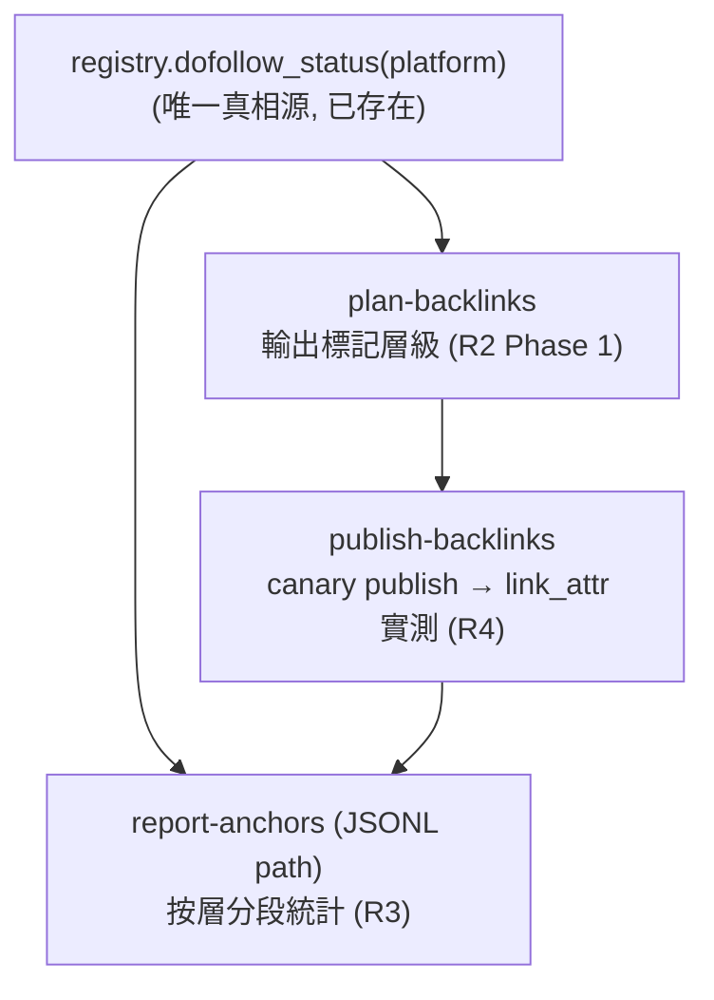

# Dofollow 分層貫穿 + 6 平台擴充

## Problem Frame

操作者要串接 6 個新分發平台（livejournal / bloglovin / txt.fyi / teletype.in / justpaste.it / jkforum），並先做架構優化再批量加平台。

現況盤點（已 grep 確認）：

- **加平台的管道已經不需要優化**：extension-readiness 路徑（Plan 2026-05-18-009）之後一行 `register(...)` 即可讓 CLI / schema / throttle / tier matrix 全部動態生效，不改任何 `cli/*.py` 或 `schema.py`（`test_r9_extension_readiness.py` 鎖死）。
- **真正缺的是分層**：`dofollow` 信號目前**只活在 publishing 層**（`registry._DOFOLLOW_BY_PLATFORM` + `dofollow_status()`），完全沒有流進 planning/quota（`cli/plan_backlinks`、`anchor/`）和 reporting（`cli/report_anchors`、`cli/footprint`）。操作者要的「dofollow / nofollow-signal 兩層管理」是真正的跨層架構工作。
- **缺兩種發布原型**：現有 `instant_web.py` 走 Chrome/CDP 驅動匿名表單（telegra.ph、write.as/new）；這 6 個裡的匿名 paste 站若**不需要 JS 挑戰**，更輕量的「純 HTTP 表單 POST」原型即可覆蓋（不起 Chrome）；論壇登入發帖則是現有 recipe 沒覆蓋的新地形。兩者是否成立取決於 Resolve Before Building 的探測結果。

決策（已拍板）：**架構先行 + dofollow 先行、nofollow 待證的混合建置**。先做 dofollow 分層架構（R1-R4，讓信號貫穿 plan→publish→report）；平台建置按價值排序——**先建有價值的**（livejournal API + 通過反爬探測且 R4 實測有引流的平台），**零價值匿名群（txt.fyi / justpaste.it / bloglovin）暫不建，待 Resolve Before Building 探測 + R4 實測數據出來後逐個決定**。分層語彙在 dofollow / nofollow-signal 之外，**nofollow-signal 桶內再標 referral/DA 粗等級（high/low）**，使有引流價值的 nofollow（devto 類）與零價值 nofollow（txt.fyi 類）在報表可區分。

> **why**：本工具唯一存在理由是 dofollow link equity（歷史上 nofollow 平台 9 分鐘被 revert）。混合策略既尊重「全都要」的覆蓋意圖，又把建置成本花在證據之後——零價值平台不預付 R5 原型 + 維護成本，而是等探測/實測證明它有引流或 DA 價值才建。

## 平台 → 原型 → 層級 對照

| 平台 | 類型 | 認證 | 對應原型 | dofollow 預判（待實測） |
|---|---|---|---|---|
| **livejournal.com** | 老牌博客 | 帳號（XML-RPC API） | API adapter | 正文鏈接**可能 dofollow** |
| **txt.fyi** | 極簡匿名發文 | 無 | 純 HTTP 表單 POST（新原型，待探測） | 大概率 nofollow-signal |
| **justpaste.it** | 匿名長文 | 無（可選帳號） | 純 HTTP 表單 POST（新原型，待探測） | 大概率 nofollow-signal |
| **teletype.in** | Telegram 系發布 | 匿名/帳號 | 純 HTTP 表單 POST 或 API（待探測） | 不確定 |
| **bloglovin.com** | 博客聚合目錄 | 帳號認領 | API 或 browser recipe（待定） | 幾乎肯定 nofollow-signal |
| **jkforum.net** | 台灣論壇 | 帳號登入+可能驗證碼 | 論壇登入 recipe（新原型） | 多為 nofollow，視版面 |

## Dofollow 信號貫穿路徑

## Requirements

**A. Dofollow 分層架構（cross-cutting，先做）**

- R1. 把 registry 的 dofollow 層級暴露成 planning 與 reporting 可消費的一級信號。真相源維持 `registry.dofollow_status()`（不另存第二份），本需求是「向外接線」而非「重新存儲」。層級對外語彙：`dofollow` / `nofollow-signal`（`"uncertain"` 在報表中歸入 `nofollow-signal` 並標記待實測），**`nofollow-signal` 再帶一個 `referral_value` 粗等級（high/low）**區分有 DA/引流價值（devto/notion/mastodon）與零價值（txt.fyi 類）。接線點：JSONL row 已帶頂層 `platform` 欄位（`plan_backlinks/_payload.py`），`report-anchors` 的 JSONL path 可 `platform → dofollow_status()` join，無需動 storage。
  - **注意**：`referral_value` 是 dofollow 之外的**第 2 個 capability 維度**——按 Plan 2026-05-20-009 自己的規則，第 2 個 capability 欄位正是觸發「parallel-dict → `RegistryEntry` dataclass 遷移」的條件。planning 須決定：續用第二個 parallel-dict（`_REFERRAL_VALUE_BY_PLATFORM`）還是遷 dataclass。此與 Scope Boundaries 原「不遷 dataclass」一條直接互動。
- R2. **（Phase 1，本批交付）** `plan-backlinks` 在輸出中**標記**每個分配單元的層級（dofollow / nofollow-signal），不改變現有分配——這是 observability，不改變實際發布行為。**（Phase 2，Deferred）** 按層配額策略（dofollow 佔比下限 / nofollow-signal 上限旋鈕）形態與預設交由 planning，非本批架構交付。
- R3. **報表分層的可達範圍按路徑區分**：
  - `report-anchors` **JSONL path** — 可按層分段（每層 URL 數 / anchor 數 / 佔比），並在 `nofollow-signal` 段下按 `referral_value` high/low 細分，靠 `row["platform"] → dofollow_status()` + referral_value join，無 storage 改動。**本批交付。**
  - `report-anchors` **--from-profile / alarm path** — `ProfileEntry` 不帶 `platform` 欄位，按層分段需 additive-field 遷移（schema-version bump，舊 profile 冷啟）；與 R1「不另存」張力。**本批標記為待定，預設排除**，planning 決定是否值得遷移。
  - `footprint` — `analyze_corpus(html_payloads: list[str])` 的輸入契約是扁平 HTML 字串列表，無 platform 維度；按層分段需改輸入為 `list[tuple[platform, html]]` + `FootprintReport` 加 tier 軸，是**真實架構改動非報表微調**。**本批標記為待定，預設排除**（footprint 的職責是跨 payload 字節指紋聚類，與 dofollow 分層正交）。
- R4. **Dofollow 兩階段實測迴路（非單純 pre-flight）**：`link_attr_verifier.verify_link_attributes(url)` 需要一個**已發布的活頁 URL** 才能審計 `rel=nofollow`，故首次註冊無法「先測後註冊」。流程改為：①以 `dofollow="uncertain"` + ≥80 字暫定 rationale 註冊（自動歸 nofollow-signal）；②發 1 篇 canary 文章取得活頁 URL；③對該 URL 跑 `verify_link_attributes()`；④以實測證據在後續 amend `register(dofollow=...)`。「實測背書」指**上線後 N 篇內**完成，而非註冊前。

**B. 新發布原型（架構底座，先做；R5 受 Resolve Before Building 探測門控）**

- R5. 「純 HTTP 表單 POST」共用底座——無登入、不起 Chrome/CDP：用 `backlink_publisher.http` GET 取表單頁、解析 CSRF/hidden 欄位、`backlink_publisher.http` POST 提交（`retry.retry_transient_call` 包重試）、解析返回 URL、回 `AdapterResult`；post body 的 HTML 由 `content_negotiation.extract_publish_html` 產生（它只渲染 markdown，不做網路 I/O）。與 `instant_web.py`（Chrome/CDP 路徑）明確區分：需要 JS/複雜互動走 CDP，純表單走本底座。
  - **反爬前提**：匿名 paste 站最可能藏在 Cloudflare/Turnstile/JS 挑戰後（無帳號門檻 = 高濫用 = 高防護），而純 HTTP 路徑**無任何反爬能力**（本 repo 反爬只在 medium_brave / chrome_session 等 CDP 路徑）。任一目標若 gate 在挑戰後，該平台**不適用本底座**，須改走 CDP 或按 R13 reject。
  - 「共用底座」先以去重三個確定平台的重試/協商/返回解析 helper 為目標；「加第 4 平台 config 級」降為**觀察性 non-goal**，待三平台 CSRF/欄位/返回解析差異實測收斂後再追認，不作交付承諾。
- R6. 「論壇登入發帖」browser recipe 原型——在現有 `BrowserPublishDispatcher.for_channel` / `RECIPES` 機制上擴一個論壇型 recipe：持久化登入、選版面/發主題的導航、以及新失敗模式（登入牆、驗證碼）的明確降級。**安全強制項**：recipe 必須定義 `cookie_host_filter` 將持久化 cookie 限定在 jkforum.net hosts（鏡像 `_velog_cookie_host_filter`），storage-state 經既有 bind 持久化路徑寫 `0o600`；無 host filter 的 recipe 一律拒收（沿用 `chrome_backend.py` 安全控制）。

**C. 平台 adapter（架構就緒後批量加；各平台受 Resolve Before Building 探測門控）**

- R7. **livejournal.com** — API adapter（XML-RPC，帳號憑證）。最可能 dofollow，作為驗證整條分層管線的端到端樣本，允許與 R1/R3 接線工作**交錯推進**（作為架構的活體驗證樣本，不要求 R1-R3 全凍結後才開工）。**憑證安全強制項**：username/password（或 XML-RPC challenge-response 衍生 secret）只經 `persistence/safe_write.atomic_write` 寫 `0o600`，禁手寫 file I/O；若支援 challenge-response，優先只存衍生材料而非明文密碼。
- R8. **txt.fyi / justpaste.it / teletype.in** — **混合策略下這群是「待證後建」**：先過 Resolve Before Building 反爬探測 + R4 實測 dofollow / referral_value；只有實測證明有 dofollow 或有引流價值（referral_value=high）者才建 adapter，零價值者按 R13 reject 不預付成本。通過者共用 R5 純 HTTP 底座；teletype.in 若有可用 API 則走 API，否則同表單路徑。
- R9. **jkforum.net** — 走 R6 論壇登入 recipe；憑證綁定複用既有 bind-channel 流程。驗證碼若阻斷自動化，降級為操作者輔助綁定並記錄限制（見 Scope Boundaries）。**注意風險不止驗證碼**：論壇外鏈的 ToS 合規、版主刪帖後鏈接存活率、IP ban 對共用 egress 的連帶、以及對 footprint 的污染（見 Outstanding Questions）。
- R10. **bloglovin.com** — 原型（API vs browser recipe）與「是否仍接受新貼文」交由 planning 探測後定案。**憑證安全強制項**：無論哪種原型，帳號憑證必須複用既有安全持久化路徑（browser recipe 走 bind storage-state + cookie_host_filter；API 走 `safe_write.atomic_write` `0o600` token 檔），此約束不隨原型未定而 drop。

**D. 治理、安全與兼容（沿用既有機制，不新建）**

- R11. 6 個 adapter 全經 extension-readiness 路徑：新平台只靠一行 `register(...)` 即讓 argparse `choices` 與 `schema.supported_platforms()` 動態納入（`test_r9_extension_readiness.py` 驗的是這個動態委派行為）。落地驗收用 `git diff --stat src/backlink_publisher/cli/ src/backlink_publisher/schema.py` 為空作為旁證（注意：git diff 是旁證，真正的 gate 是動態委派測試，未來檔案搬動仍須以測試為準）。
- R12. 新 dofollow 平台 adapter 讀同一個 `payload.seo.canonical_url` opt-in 欄位（沿用 `[[2026-05-21-canonical-contract-and-platform-expansion-requirements]]` 的 SEO 契約）；未帶不輸出任何 canonical 痕跡。**對匿名三平台**：canonical 是最強的跨站關聯鍵，是否對匿名平台輸出 canonical 需權衡 SEO 價值 vs 去匿名化風險（見 R14 / Outstanding Questions）。
- R13. **價值 gate（混合策略，已拍板為「待證後建」）**：零價值匿名群在 Resolve Before Building 探測 + R4 實測前**不建 adapter**。實測為 `dofollow` 或 `nofollow-signal(referral_value=high)` → 建；實測為 `nofollow + referral_value=low`（既無 DA 也無引流）→ 回報操作者做去留，預設不建並登入 `_REJECTED_PLATFORMS`，需操作者主動 override 才建。成本花在證據之後，不在之前。
- R14. **匿名發布 footprint / 去匿名化 gate**（新增，security P1）：同一批 money URL 跨多個匿名站重複發布是教科書級指紋向量（本 repo 為此維護 `footprint` CLI + monolith-budget gate）。要求：①匿名平台 planned output 在發布前過 `footprint` 的集中度檢查（共用 money-URL cluster key），同 URL 跨 N 個匿名域時告警；②匿名重複發布須做 per-platform anchor/內容變化 + 隨機排程（複用既有 throttle/jitter env 旋鈕），不得字節相同；③明確記錄是否對匿名平台**抑制 canonical**（R12）。
- R15. **Threat Model（plan-level）**：本批一次引入本項目最高敏感度的 surface，明列 top-3 + 緩解：①最可能——新憑證/session at-rest 洩漏（livejournal 密碼、jkforum session、bloglovin） → `0o600` + `atomic_write` + `cookie_host_filter`（R6/R7/R10）；②最高衝擊——同 money URL 跨匿名站聚類導致操作者去匿名化 → footprint gating + anchor/排程變化（R14）；③最隱蔽——XML-RPC fault 字串 / 論壇登入回應把密碼回顯進 log → 確認 `_util/logger.py` scrubber 覆蓋這些路徑，secret 只經結構化 `extra` dict 傳遞，不進 f-string log message。

## Success Criteria

- dofollow 層級出現在 `report-anchors` JSONL path 輸出，且 `plan-backlinks` 輸出標記層級（Phase 1 observability；Phase 2 配額策略可選、不在本批）。
- 6 個平台各自落在三態之一：**live 發布** / **明確 nofollow-signal 上線（帶 rationale）** / **明確 rejected（帶實測證據）**——沒有「猜測 dofollow」的灰色狀態。**early-reject 是達標終態而非失敗**：若平台在 Resolve Before Building 探測或 R4 實測即被判零價值並 reject，不要求其交付 R5 底座或 adapter，亦視為成功。
- 每個平台的 `dofollow=` 取值在**上線後 N 篇內**有一條 `link_attr_verifier` 活頁實測背書（R4 兩階段迴路），而非預判。
- 通過反爬探測的匿名平台共用一個 R5 底座（去重重試/協商/返回解析）。
- 新憑證/session 全部 `0o600` + `atomic_write`；論壇 recipe 帶 `cookie_host_filter`；匿名平台過 R14 footprint gate。
- 全程不改 `cli/*.py` 與 `schema.py`，`test_r9_extension_readiness.py` 維持綠燈。

## Scope Boundaries

- **不**為各平台建獨立分析儀表板——分層只到「報表分段（JSONL path）+ 配額標記」為止。
- **不**通用解任意驗證碼（jkforum）——若驗證碼阻斷自動化，降級為操作者輔助綁定並記錄限制，不投入 captcha-solving。
- ~~**不**把 dofollow 存儲遷移成 `RegistryEntry` dataclass~~ — **此邊界已被 referral_value 決策觸發**：referral_value 即第 2 個 capability 欄位，planning 須在「再加一個 parallel-dict」vs「遷 `RegistryEntry` dataclass」之間取捨（見 R1 注意）。傾向：先續 parallel-dict（最小改動），第 3 個 capability 才遷 dataclass。
- `report-anchors --from-profile/alarm path` 與 `footprint` 的按層分段**預設排除**本批（需 storage/輸入契約改動），planning 決定是否值得。
- 「加第 4 個匿名平台 config 級」是觀察性 non-goal，不是交付承諾。
- nofollow + 無 DA + 無引流的匿名平台可被 reject，即便「全都要」——價值底線優先於數量。

## Key Decisions

- **混合建置：dofollow 先行，nofollow 待證**（已拍板）：架構（R1-R4）先做；平台按價值排序——livejournal（dofollow keystone）+ 通過反爬且實測有引流的平台先建，零價值匿名群（txt.fyi/justpaste.it/bloglovin）待探測+實測證據再逐個決定，不預付原型成本。
- **三層分類軸**（已拍板）：`dofollow` / `nofollow-signal(referral_value=high)` / `nofollow-signal(referral_value=low)`，使有引流的 nofollow 與零價值 nofollow 在報表與去留決策中可區分。
- **先架構**：dofollow 信號貫穿（R1/R3 JSONL path）+ R5/R6 原型底座先落地；R7 livejournal 作為活體驗證樣本可與架構交錯。
- **dofollow 層級以實測定案，不以預判定案**：複用 `link_attr_verifier` 兩階段迴路，沿用現有 `register(dofollow=, rationale=)` 門禁，不新建治理機制。
- **真相源唯一**：層級信號繼續以 `registry.dofollow_status()`（+ referral_value）為唯一源，planning/reporting 只讀不存。
- **R2 本批只交付 observability**：標記層級不改分配；配額旋鈕 Phase 2 deferred。

## Dependencies / Assumptions

- 假設 livejournal 仍開放 XML-RPC API 且接受新帳號（**升為 Resolve Before Building go/no-go gate**——它是唯一 dofollow keystone）。
- 假設 bloglovin 仍接受新貼文/認領（可能已半退役，**Resolve Before Building 探測**）。
- 假設 jkforum 發帖在登入後可自動化且鏈接能存活（驗證碼 + ToS + 存活率為風險，**Resolve Before Building 探測**）。
- 假設匿名三平台接受無 JS 挑戰的 raw POST（**Resolve Before Building 用 curl 探測**——決定 R5 純 HTTP 前提是否成立）。
- 沿用既有 bind-channel 憑證持久化、`backlink_publisher.http`、`content_negotiation`、`retry`、`link_attr_verifier`、`footprint`、`safe_write.atomic_write` 基礎設施，不重寫。

## Outstanding Questions

### Resolve Before Planning
- （已拍板：混合建置 dofollow 先行 + nofollow 待證；三層分類軸含 referral_value。無阻塞 brainstorm→plan 交接的項。）

### Resolve Before Building（planning 第一個任務，go/no-go gate）
- [Affects R7][Needs research] livejournal XML-RPC 是否仍活、接受新帳號、正文鏈接是否 dofollow（30 分鐘探測：註冊 + 1 篇 test post + `verify_link_attributes`）。它死則唯一 dofollow keystone 消失，須重估分層架構是否仍值得。
- [Affects R5/R8][Needs research] txt.fyi / justpaste.it / teletype.in 各自 raw unauthenticated POST 今天是否成功（無 Cloudflare/Turnstile/JS 挑戰）——決定 R5 純 HTTP 前提。
- [Affects R10][Needs research] bloglovin 是否仍接受新貼文/認領、是否已退役、archetype。
- [Affects R9][Needs research] jkforum 外鏈 ToS、版主刪帖後鏈接存活率（發 1 鏈觀察 7 天）、IP ban 對共用 egress 的連帶——存活率而非驗證碼可能才是真正的 viability gate。

### Deferred to Planning
- [Affects R2][Technical] Phase 2 分層配額策略的具體旋鈕形態（config 欄位 vs CLI flag）及預設值。
- [Affects R5][Technical] 匿名表單底座的抽象邊界——哪些步驟共用、哪些 per-platform（CSRF token、欄位名、返回 URL 解析差異）。
- [Affects R12/R14][User decision] 是否對匿名三平台抑制 `canonical_url` 以避免遞交跨站關聯鍵（SEO 價值 vs 去匿名化風險）。
- [Affects R4][Technical] `verify_link_attributes` 對 JS 渲染平台（teletype.in 偏 SPA）可能 `total_anchors=0` 誤判為 dofollow——是否需 headless 渲染後再測。

## Next Steps
→ `/ce:plan` for structured implementation planning
