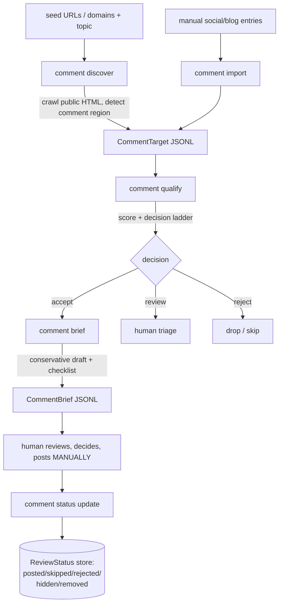

# Comment Outreach Queue

## Problem Frame

The existing tool publishes backlinks to owned / semi-owned platforms. That is a
single, relatively high-footprint surface. Operators want a **lower-risk outreach
layer**: legitimate comment-based participation on already-indexed public pages
(blogs, forums, Medium-like articles) plus manually-entered social threads.

The realistic SEO objective is **not** direct PageRank transfer — it is referral
traffic, brand mention, co-citation, entity association, community discovery, and
relationship building. The hard constraint is that this must **never** become a
comment-spam engine: it finds and qualifies opportunities and drafts conservative
suggestions, but a human always decides and posts.

This module is isolated behind a new `comment` CLI namespace and a
`comment_outreach` package. It must not touch or reuse the publishing adapters,
and must not break existing publish flows.

## User Flow

## Requirements

**Discovery & Import**
- R1. Provide `comment discover`: given operator-supplied seed URLs plus a topic,
  fetch **each operator-supplied exact URL** (no link-following / no walking the
  site) and detect whether a usable comment region exists (e.g. WordPress comments,
  Disqus, native comment forms, forum reply), emitting `CommentTarget` records with
  `comment_open` set when detectable. The reusable asset is the **SSRF primitive**
  (private-IP block, redirects-disabled, body cap) in `content/_preflight_fetch.py`
  / `content/_http.py` — **not** the existing public fetch functions, which return
  only metadata/booleans and discard the body. R1 needs a new body-returning fetch
  helper that delegates SSRF/host/body-cap checks to those primitives and returns
  the (capped) HTML for region detection. Fetch failures (SSRF-block / non-200 /
  timeout / oversized body) emit the target with `comment_open = null` and bias the
  decision ladder toward `review`/`reject` (never silent `accept`). It must **not**
  do SERP/search-engine discovery of new pages and must **not** fetch login-only or
  social content.
- R2. Provide `comment import --input targets.jsonl --output queue.jsonl`: ingest
  externally-provided `CommentTarget` records (this is the only entry path for
  social platforms `x`/`facebook`/`linkedin`/`reddit`, which are never crawled).
  Every imported record is validated against the R3 schema **and** the same URL
  rules applied to fetched targets (well-formed, scheme-checked, host sanity,
  `platform` enum); malformed or disallowed records are logged to stderr with a
  reason and skipped, so no import can smuggle an unvalidated URL downstream to
  qualify or the R12 handoff.
- R3. Model the `CommentTarget` entity with the fields in the source spec
  (`id`, `source_url`, `platform` enum, `topic`, `target_url`, optional
  `anchor_text`, `page_title`, `thread_summary`, `indexed`, `comment_open`,
  `link_allowed`, `domain_rank_signal` 0-100, `discovered_by`, `discovered_at`,
  `notes`). `comment_open` (and `indexed` / `link_allowed`) are **tri-state**:
  `null` = unknown, `true`/`false` = detected. Crawled targets set `discovered_by`
  accordingly; social targets carry high platform-risk and typically leave
  `comment_open` null for human judgement. The `QualificationResult`,
  `CommentBrief`, and `ReviewStatus` entities use the field sets from the same
  source spec (modelled analogously to `CommentTarget`).

**Qualification & Scoring**
- R4. Provide `comment qualify`: score each target 0-100 across the signal set
  (`relevance_score`, `authority_score`, `compliance_score`, `anchor_risk_score`,
  `platform_risk_score`) plus the boolean signals (`indexed`, `comment_open`,
  `link_allowed`), and emit a `QualificationResult` with a `decision`
  (`accept` / `review` / `reject`) and `action` (`manual_comment_brief` / `skip`),
  a human-readable `reasons` array, and resolved `link_policy` / `anchor_policy`.
  The five sub-signals are **indicative**, not pinned — planning determines the
  minimum signal set that actually moves a decision (see Deferred to Planning).
- R5. The decision ladder must be conservative by default: social platforms and
  unknown/closed comment availability bias toward `review` or `reject`, never a
  silent `accept`. (Exact weights/thresholds deferred to planning.)

**Brief Generation**
- R6. Provide `comment brief`: for `accept` targets, generate a `CommentBrief`
  whose `suggested_comment` is produced by the existing LLM provider
  (`[llm.anchor_provider]`) from `page_title` / `thread_summary`, with a
  deterministic template fallback when the LLM is unavailable. `page_title` /
  `thread_summary` are scraped from attacker-controllable third-party pages and
  must be treated as **untrusted data, not instructions**: wrap them in a delimited
  data block, cap length, and enforce the R7 guardrails as a **post-LLM validator**
  that rejects/repairs output regardless of what the prompt produced. Prompt
  injection from crawled pages is an explicit threat the guardrail layer must
  withstand, and the fallback template must satisfy the same R7 guardrails.
- R7. The suggested comment must be conservative by construction: respond to the
  actual article/thread context, avoid generic praise, avoid repeated exact-match
  anchor text, avoid keyword stuffing, use **at most one** link, allow brand
  mention **without** a link, explicitly mark when **no** link should be used, and
  require human review before posting.
- R8. Each `CommentBrief` carries `suggested_anchor_policy`, `suggested_link_policy`,
  a `human_checklist`, and an explicit `prohibited_actions` list (so the safety
  boundary travels with every draft).

**Review Tracking**
- R9. Provide `comment status`: track each target's `ReviewStatus`
  (`pending` / `approved` / `rejected` / `posted` / `skipped` / `hidden` /
  `removed`) with optional `reviewer`, `comment_url`, `final_comment_text`,
  `result_notes`, `updated_at`. Status is set **manually by the operator** after
  they post — the tool never infers "posted" from any automated action.
  `decision` (R4) is the *qualification gate*; `ReviewStatus` is *post-human
  tracking*: `accept`/`review` targets enter the queue as `pending`, `reject`
  targets are not queued. `reviewer` and `final_comment_text` are operator-
  sensitive — see R11 for storage handling.

**Isolation & Safety**
- R10. Everything lives under a single `comment` console_script
  (`backlink_publisher.cli.comment:main`) using argparse subparsers
  (mirroring `footprint.py` / `phase0_seal.py`), with `discover` / `import` /
  `qualify` / `brief` / `status` as subcommands chaining via stdin/stdout JSONL
  (stdout = data, stderr = diagnostics, exit 0 on success). It must not import or
  reuse the publishing **adapter registry** or any publish-flow adapter, and must
  not alter existing publish/validate flows. *Carve-out:* the standalone LLM
  provider (`publishing.adapters.llm_anchor_provider`, not in the registry) may be
  imported for R6 — planning should consider relocating it to a neutral module so
  the isolation boundary is clean.
- R11. Reuse existing conventions: `_util/errors.py` error classes + exit codes,
  `_util/logger.py` diagnostics, `persistence/safe_write.atomic_write` (0o600) for
  any persisted state, and `BACKLINK_PUBLISHER_CONFIG_DIR` for config/state paths.
  The `ReviewStatus` store (whichever mechanism) must enforce `0o600` — **including
  a SQLite db file if chosen, not just JSONL** — live under
  `BACKLINK_PUBLISHER_CONFIG_DIR`, classify `reviewer` / `final_comment_text` as
  operator-sensitive, and define a deletion path for `removed`/`rejected` entries.

**Assisted Handoff (design captured; built in follow-up)**
- R12. *(Follow-up, not this round.)* A WebUI "Comment Outreach Queue" section will
  render the queue, support `ReviewStatus` transitions, and offer a one-click
  **assisted-navigation handoff**: open the target in the operator's already
  logged-in real Chrome profile (existing `chrome_backend`), navigate toward the
  comment region, and pre-fill / copy the reviewed draft — but the **human** does
  the final review and clicks submit. RPA performs navigation + prefill only.

## Success Criteria
- An operator can go from a list of seed URLs → a qualified queue → conservative
  per-target briefs **without writing code**, using only `comment` CLI verbs.
- **Zero** automated comment posting exists anywhere in the module; every brief
  ends at a human decision gate and carries its `prohibited_actions`.
- Running the full `comment` pipeline never touches `events.db` publish events,
  the adapter registry, or any existing publish/validate behavior (provable by the
  existing isolation tests staying green).
- Social-platform targets only ever enter via `comment import`; no crawl path
  fetches social or login-only content.
- **Outcome proxy** (so criteria can't all pass while the SEO goal fails): on a
  sample of N real targets, a human judges the generated brief postable as-is
  without rewriting, and the queue can record comment survival/removal via the
  `hidden` / `removed` `ReviewStatus` states.

## Scope Boundaries (deliberate non-goals)
- No automatic comment publishing, no automated login, no browser automation that
  *posts* (only navigation + prefill in the deferred handoff).
- No account rotation, proxy rotation, CAPTCHA solving, anti-bot/rate-limit/
  moderation bypass, or fingerprint spoofing — and the module must not be designed
  in a way that *depends* on any of these to function.
- No SERP / search-engine discovery of new pages; discovery is seed-driven only.
- No scraping of private or login-only platform data; social platforms are
  import-only.
- No bulk/spam comment generation, fake engagement, automated likes/shares, mass
  DMs, or exact-match anchor spam.
- No reuse of the publishing adapters for social comment publishing.
- WebUI section + assisted-navigation handoff are **out of scope for this round**
  (captured as R12 for the next round).

## Key Decisions
- **Discovery = seed-crawl + comment-region detection on public web only.** Reuses
  the proven SSRF-safe fetch path; avoids SERP ToS exposure and login walls.
- **Social = manual import only.** Crawling X/FB/LinkedIn/Reddit hits login walls
  and ToS prohibitions; importing keeps them in the queue without risky fetching.
- **RPA, if ever added, is navigation + prefill only — never auto-post.** Auto
  social posting was evaluated and rejected: it inverts the module's low-risk value
  proposition, risks brand-tied account bans (esp. LinkedIn), forces a reactive
  anti-bot arms race that requires the explicit non-goals to sustain, and produces
  an SEO footprint that harms the stated objectives.
- **Briefs are LLM-generated with hard guardrails + template fallback.** Context-
  aware drafts need an LLM; reuse `[llm.anchor_provider]` rather than add a new dep.
- **CLI-first delivery.** Stand up the engine + safety boundary as a JSONL pipeline;
  WebUI queue + handoff button are an explicit follow-up.

## Dependencies / Assumptions
- The SSRF **primitives** (private-IP block, redirects-disabled, body cap) in
  `content/_preflight_fetch.py` / `content/_http.py` are reusable, but R1 still
  needs a new body-returning wrapper over them (the public fetch functions discard
  the HTML body). Scheme policy (https-only vs allow http) is a planning decision.
- The existing LLM provider config (`[llm.anchor_provider]`) is reachable for R6.
- `ReviewStatus` is mutable across runs, so it needs a small persistent store.
  Single-operator, low write volume, no concurrency → **default to
  JSONL-with-atomic-rewrite** (already mandated by R11); use SQLite only if a
  concrete need (query volume, concurrent writers) is shown, avoiding the
  documented `events.db` WAL-read complexity.

## Outstanding Questions

### Resolve Before Planning
*(none — product scope, safety boundary, and delivery shape are resolved.)*

### Deferred to Planning
- [Affects R5][Technical] Concrete scoring weights and the accept/review/reject
  thresholds, including how `compliance_score` / `platform_risk_score` are derived.
- [Affects R1][Needs research] Comment-region detection heuristics — reliable
  signatures for WordPress comments, Disqus, native forms, and common forum reply
  affordances on public HTML. Note many comment regions are JS-lazy-loaded and
  invisible to a non-JS fetch; gate the `discover` verb on a detection-accuracy
  spike before committing its full scope.
- [Affects R3/R4][Needs research] Where do `domain_rank_signal` / `authority_score`
  / `link_allowed` / `compliance_score` actually come from, given SERP and ToS
  parsing are both out of scope? Operator-entered, heuristic, or an unlisted
  third-party API — and confirm crawled-but-unknown gets the same review/reject
  bias as social/unknown.
- [Affects R1][Technical] Whether `discover` should honor `robots.txt` and apply
  per-host rate limiting/crawl-delay (the reused primitives do neither), or whether
  fetching only operator-supplied exact URLs makes this moot.
- [Affects R12][Design] R12 handoff: **clipboard-copy only (no driven navigation in
  the logged-in profile)** vs driven-navigation with host-allowlist + no-auto-submit
  guards. Driving a brand-tied logged-in profile is itself detectable automation, so
  the navigation/prefill-vs-post safety boundary needs justification or tightening.
- [Affects R4/R6][Design] Whether to **collapse `qualify` + `brief`** into one verb
  (they always run back-to-back; the split doubles entity/schema/test surface) or
  keep them separable. `discover`/`import`/`status` stay separate.
- [Affects R9][Product] Guard against the human gate degrading into bulk
  rubber-stamping (per-domain/day brief caps, or a divergence flag when
  `final_comment_text` closely matches a recent brief) — the manual-status guarantee
  bounds the *tool*, not operator discipline.
- [Affects Problem Frame][Product/Needs validation] The "lower-risk than publish
  flow" premise and the value of seed-only discovery are **asserted, not validated**.
  Confirm operators can source seeds acceptably (the hard "find opportunities" step
  stays manual), and define what "risk" means per axis (account ban / ToS / footprint)
  before over-investing in the engine.
- [Affects R9][Technical] Persistent `ReviewStatus` store mechanism and how it
  stays isolated from `events.db` and the existing JSONL artifacts.
- [Affects R6/R7][Technical] LLM prompt design and the deterministic guardrail
  layer that enforces "≤1 link / no exact-match / no-link flag" on generated text.

## Next Steps
→ `/ce:plan` for structured implementation planning
