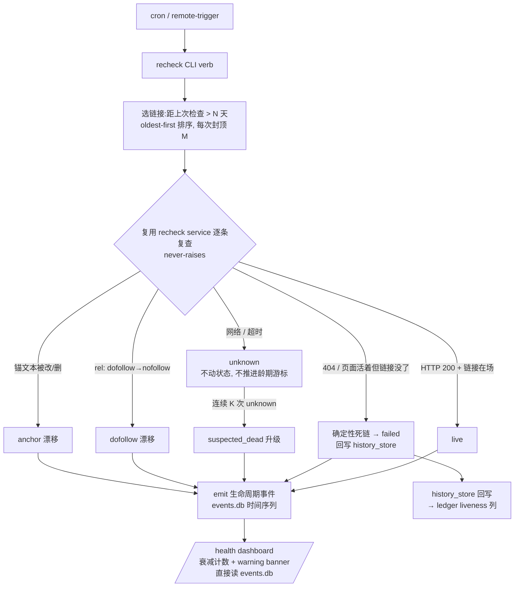

# 外链生命周期闭环:发布后定期再验证(存活 + 可跟随)

> **范围名实对齐(document-review 修正)**:本版只验证链接**存活性与可跟随性**
> (live / followable),**不**测真正的 SEO 价值(是否被索引、是否传递权重)。索引检测需
> 外部依赖(GSC / `site:` 抓取),显式延后到后续版本。下文不再用"SEO 价值"这一名不副实的框架。

## Problem Frame

过去三周的迭代几乎全投在**内部状态一致性**(双存储漂移、saga 契约、dedup ratchet、reconciler)。
但有个更上层的问题没人盯:**发布出去的外链事后还活着、还可跟随吗?**

**现状(已读码核实,修正初稿的错误前提)**:闭环**已部分存在**,不是全新的。
`webui_app/services/recheck.py`(Plan 2026-05-19-006 U5)已能重抓 article_urls、重跑
`verify_published`、把 `verified_at`/`verify_error` 回写 `history_store`,并据此 downgrade/upgrade
publish 状态;`equity_ledger.py` 已有 per-target recheck POST。**真正缺的是三块**:

1. **自动调度** —— 现有 recheck 靠 WebUI 手动触发,没有 cron 驱动的批量周期复查。
2. **纵向衰减历史** —— 复查结果不进 events.db,看不出某链接"何时从 live 变 dead"的时间序列。
3. **Operator 可见性** —— dashboard 没有衰减计数/告警,operator 不主动点 recheck 就什么都看不到。

**两条关键数据流事实(初稿弄反了,本版据此设计)**:
- ledger 的 **liveness 列来自 `history_store`**(`verified_at`/`verify_error`),**不是 events.db**。
  要让 ledger liveness 反映现状,必须走现有 service 的 `history_store` 回写,而非往 events.db 写 kind。
- ledger 的 **dofollow 列来自 registry 静态推导**,**没有 per-link rel 字段**。活页 rel 重分类结果
  无 ledger 列可落 —— 因此本版 dofollow/锚文本漂移只进 **events.db 时间序列 + dashboard 横幅**,
  不刷新 ledger 列。
- ledger 的 `stale` 是 **构建时按龄期算**(`verified` 超过 `stale_days`),与复查无关、不是复查驱动的
  过渡态。本版不把复查结果映射成 stale;复查 verdict 用 `live` / `unknown` / `failed`(确定性死链)。

## Requirements

**[复查引擎 —— 复用既有 service]**

- R1. 新增复查 CLI verb(如 `recheck-backlinks`):**复用 `webui_app/services/recheck.py` 的复查能力**
  (`recheck_one`@70 / `recheck_many`@142,已核实存在),不重造 liveness 逻辑,提供 cron 安全、
  非交互的批量入口。读取待复查链接、逐条复查、发出生命周期事件。**显式以现有 service 为单一复查实现**,
  避免两个 writer 对状态语义打架。**注意**:该 service 当前返回 mutation 经 `history_store.update_item`
  回写(见 `history_api.py:154/169`);plan-007 U3 要把这条回写改道到 events.db kind(见 R6/D7)。
- R2. **龄期选择 + 限速 + oldest-first**:只复查"距上次检查 > N 天"的链接,按**最老优先**排序,
  每次封顶 M 条。N/M 用合理默认值内置(暂不外暴配置,scope-guardian P3);plan 阶段须给出
  corpus 规模 × N × cron 频率 × M 的覆盖关系,保证语料增长时最老链接不被饿死。
- R3. **三类信号**(用户已确认三者全要;均零外部依赖):
  - Liveness —— URL 仍返回 200、页面仍在场(复用 `verify.py` / service 现有路径)。**载重信号**。
  - Dofollow 漂移 —— 活页 rel 被改成 nofollow(复用 `link_attr_verifier`)。**仅落 events.db + dashboard**,
    不刷新 ledger 列。须标注此信号为 *contract-drift 提示而非保证*(平台可能对 verifier UA 做 cloaking,
    见 link_attr_verifier 自身文档),dashboard 文案据此措辞,避免误报当实锤。
  - 链接/锚文本被删改 —— 目标链接不再出现,或锚文本被改。baseline 来源:目标链接由 `target_url`、
    原锚文本由 articles 行 `anchors_json` 提供(events `publish.confirmed` floor 只保证 `live_url`,
    锚文本不在事件载荷里),plan 阶段定 join 路径。**仅落 events.db + dashboard**。
- R4. **never-raises 批处理 + 死链/抖动区分**:单条失败不中断整批。语义收紧:
  - 明确 404 / 页面活着但目标链接消失 → `failed`(确定性死链),**允许回写 history_store / downgrade**。
  - 网络 / 超时 / 反爬拦截 → `unknown`,**不动 publish 状态、不推进 R2 的龄期游标**(守 D5)。

**[状态回写与衰减历史]**

- R5. 新增 events.db 生命周期 event kind,记录每次复查结果,形成纵向衰减时间序列。新 kind 进 `KINDS`
  白名单 + 定义 required-field floor(满足 R8a CI gate)。**events.db 是时间序列 sink,不是 ledger 列的刷新源。**
- R6. **确定性死链回写(改:经 events.db,非 history_store)**:复查结果通过 plan-007 U3 的
  events.db 生命周期 kind(`publish.verified` / `publish.verify_failed`)发出,由 projector 更新
  `articles` 列;ledger/读路径从 events.db 投影读取 liveness。**不再直接回写 history_store**
  ——迁移计划 plan-007(active)将 history_store 降级为 no-op shim(U6),直接回写会与之冲突。
  **收紧 downgrade 语义**:只有确定性死链(R4 的 `failed`)才 downgrade;`unknown` 绝不 downgrade。
  **新增升级守护**:同一链接**连续 K 次 unknown(跨 D 天)→ 标记 `suspected_dead`**,防止持续
  不可达的真死链永远停在 unknown、从不浮现(对抗 adversarial 指出的永久假阴性)。
- R7. **复查不触发发布动作**:复查绝不重发、不补偿、不创建新内容。状态回写仅限 R6 的 liveness
  downgrade / suspected_dead 标记;不做任何 publish 侧写动作。

**[Operator 可见性与行动闭环]**

- R8. dashboard `/health` 展示衰减计数(failed / suspected_dead / dofollow 漂移 / anchor 漂移),
  任一 > 0 时显示 warning banner(复用 readtime U5 banner 模式);衰减计数**直接读 events.db**
  (不经 ledger 列);无数据时显示 0 而非报错。
- R9. CLI 复查结束向 stderr 输出 summary(检查 X 条 / live Y / unknown Z / failed+suspected_dead+drift W),
  cron 友好。
- R10. **行动闭环说明(product 要求)**:文档须写明 observability 之后的人工动作回路——
  谁看 `/health` 横幅、什么 cadence 看、看到衰减后做什么手动补救——使"看得见"不被误当成"已解决"。
  自动补救仍是非目标(D3),但人工回路要显式定义,否则死链被检测到却无人行动 = 零回收价值。

**[CLI 契约 —— 2026-05-29 brainstorm 补充]**

- R11. **选取模型(两者皆有)**:默认读 events.db `articles` 表(配 `--since` / `--host` /
  `--run-id` / `--limit` 过滤,与 R2 龄期选择一致);**有 stdin JSONL 时改读 stdin**(live_url 列表
  或上游生成器子命令产出),保 Unix-pipe 本色。两条输入路径走同一复查核心。
- R12. **网络门控与默认行为**:网络经显式 `--probe` 开启(对齐 validate 阶段 opt-in-network 边界,
  复查引擎不进纯 plan/validate kernel)。**不带 `--probe` = 干跑清单预览**:零网络列出"将要复查哪些"
  (live_url / host / 发布龄期 / 条数 / 按平台聚合),操作者先看范围再加 `--probe`。
- R13. **退出码语义**:默认 **exit 0**(纯诊断,判定走 JSONL/stderr summary,对齐项目 advisory
  network diagnostic 惯例);`--fail-on-dead` 让 cron 可选拿非零退出告警。**`--fail-on-dead` 触发集
  = host_gone + link_stripped(确定性死链)**;`dofollow_lost` 属退化非死亡、`probe_error` 属不确定,
  默认不触发(如需另立 `--fail-on-degraded`,plan 阶段定)。
- R14. **5 类判定集**(均有现成原语支撑):`alive` / `host_gone`(非 200 或 fetch 报错) /
  `link_stripped`(200 但目标链接缺失) / `dofollow_lost`(200 + 目标在场但 rel=nofollow,复用
  `link_attr_verifier`) / `probe_error`(超时、无效 URL)。映射到 R4 的 failed/unknown:
  host_gone+link_stripped → `failed`;probe_error → `unknown`;dofollow_lost 仅落 events.db(R3,不改 R4 状态)。

## Success Criteria

- **operator 端**:跑一次复查后,dashboard 显示衰减计数;**确定性死链**的 ledger liveness 列经
  history_store 回写反映现状(`unknown` 不改列,符合 D5)。
- **闭环端**:同一链接多次复查在 events.db 留下时间序列,能看出何时 live→failed / dofollow→nofollow;
  连续 unknown 的真死链最终经 R6 升级为 suspected_dead 而非永久隐身。
- **可度量基线(product 要求)**:plan / 首轮上线须给出一个基线——当前/估计的死链率或可疑死链条数——
  及一个判定阈值(如"N 天内浮现 ≥X% 的死链"),否则上线后无法判断闭环是否真有产出、衰减量是否值当。
- **回归端**:复查 never-raises(抖动不报错、不误判 failed);footprint test 全绿;不引入新存储后端、
  不引入新外部依赖;只读路径与现有 service 单一化,无双 writer 冲突。

## Scope Boundaries (Non-Goals)

- **索引状态检测**(是否被 Google 索引 / 是否传递权重)—— 延后。需 GSC API 或 `site:` 抓取
  (脆弱、踩 ToS)。**这是真正的"SEO 价值"维度,本版明确不覆盖,框架不再以此命名。**
- **自动重发 / 替换链接** —— observability + 状态如实回写,但不自动补偿。
- **衰减处理队列**(comment-outreach 风格可操作队列)—— 本版不引入。
- **新存储后端 / 新 ledger 列** —— 复用 events.db(时间序列)+ history_store(liveness 回写)。
  dofollow/anchor 漂移不新增 ledger 列,只活在 events.db。
- **第二套复查实现** —— 单一化到现有 service,不建并行 rechecker。
- **把复查结果映射成 ledger 的 `stale`** —— `stale` 保持原有"按龄期算"语义,与复查正交。
- **N/M 外部可配置** —— v1 用内置默认,真有第二 cron profile 再外暴。
- **新 publisher adapter**;**固定里程碑调度(T+1/7/30)**(本版用龄期扫描)。

## Key Decisions

- **D1 — 零外部依赖优先**:三信号都从公开活页 HTTP 判定。索引(唯一需外部依赖、也是真正 SEO 价值的信号)显式延后。
- **D2 — 龄期扫描 + 限速 + oldest-first,而非里程碑调度**:无状态、cron 友好;oldest-first 防 backlog 饿死。
- **D3 — observability + 如实回写,但不自动补偿**:自动补救/队列范围更大风险更高,等衰减数据积累后再评估;
  人工行动回路(R10)须先定义。
- **D4 — 复用既有 service,events.db 仅作时间序列**(取代初稿"events 刷新 ledger 列"的错误数据流):
  liveness 列由 history_store 回写驱动;dofollow/anchor 漂移只进 events.db + dashboard。
- **D5 — 区分 unknown vs failed + 升级守护**:抖动→unknown 不降级、不推进龄期游标;确定性死链→failed 回写;
  连续 K 次 unknown→suspected_dead,既不误降级也不永久假阴性。
- **D6 — 名实对齐**:本版只声称验证"存活 + 可跟随",不声称验证"SEO 价值"。
- **D7 — 复查写 events.db 是 plan-007 的计划内单元,非抢跑(2026-05-29 调和)**:迁移计划 plan-007
  (R10 #1,active)的 **U3 = "Recheck liveness write → new event kinds → EventStore"**,kind 为
  `publish.verified` / `publish.verify_failed`,projector 更新 `articles` 列。故复查的状态回写**目标是
  events.db,不是 history_store**(D4 已对,R6 据此改正)。**排序依赖**:本复查 CLI 依赖 plan-007 的
  U1(schema v4 新 kind)+ U3 先落地,应排在其后或与之协同——非并行于其前。
  (此决策推翻了 round11-ideation #1 的"stdout-only、不写 events.db"重切前提:那个前提基于对 plan-007
  的不完整认识;事实是写 events.db recheck kind 才是被批准的 sink。)

## Dependencies / Assumptions

- **已核实**:`webui_app/services/recheck.py` 提供 `recheck_one/recheck_many`,回写 history_store
  并有 downgrade/upgrade 路径(本版收紧其 downgrade 语义)。`verify_published` 做 200 + 标题 + 链接在场
  (无锚文本 diff,需新增)。`link_attr_verifier` 做 rel 重分类(对 cloaking 有自承的局限)。
- **已核实**:ledger liveness 源自 history_store;dofollow 源自 registry 静态表;`stale` 按龄期算。
- **已核实**:`publish.confirmed` floor = `{live_url}`;锚文本在 articles 行 `anchors_json`。
- **假设**:cadence 由 remote-trigger routine / cron 驱动,与现有运维模式一致。
- **依赖(2026-05-29 调和补)**:**plan-007(history_store→events.db 迁移,active)的 U1 + U3** 是本版
  前置——U1 提供 schema v4 的复查 event kind,U3 提供复查写 events.db 路径。本版排在其后或协同推进。
- **已核实**:`webui_app/services/recheck.py`(`recheck_one`/`recheck_many`)存在;当前经
  `history_store.update_item` 回写,plan-007 U3 改道 events.db kind。

## Outstanding Questions

### Resolve Before Planning

（空 —— 架构岔路与状态回写语义已在本 brainstorm 内决定:复用 service + events 时间序列;确定性死链 downgrade + 跳闸守护。）

### Deferred to Planning

- [Affects R1][Technical] CLI 复用 `recheck.py` 的 `recheck_one`/`recheck_many` 时,确认 plan-007 U3
  已把其回写从 `history_store.update_item`(`history_api.py:154/169`)改道到 events.db kind,避免双 writer。
- [Affects R6/R13][Technical] `suspected_dead` 用 events.db 标记 + dashboard 推导(history_store 已转
  no-op,不再新增其状态值)。K / D 阈值取多少?plan 阶段定。
- [Affects R5][Technical] 生命周期 kind 用单 kind 带 `verdict` 字段,还是 `link.rechecked` + `link.decayed` 两个?
  floor 含哪些字段(链接、verdict、reason)?
- [Affects R3][Technical] 锚文本 diff 的 baseline join 路径:`target_url` + articles `anchors_json` 如何取;
  历史早期行若无 `anchors_json`,anchor 漂移如何降级处理(跳过 vs 标 unknown)。
- [Affects R3][Needs research] `link_attr_verifier` 对任意活页(可能 cloaking / 客户端渲染 / 反爬)重分类 rel
  的误报率;dashboard 是否需要"漂移待人工确认"而非直接告警。
- [Affects R8][Technical] dashboard 衰减计数从 events.db 查询:复用 reconciler 的 quarantine_log 只读模式,
  还是新投影?优先复用 health route 现有只读查询惯例。
- [Affects R2][Technical] 龄期游标来源:history `verified_at` 会被复查覆盖,需确认 unknown 结果不推进游标
  (或用独立 `last_attempt_at` vs `verified_at`),否则抖动会重置龄期、掩盖持续不可达的链接。
- [Affects R2][Needs research] corpus 规模 × N × cron 频率 × M 的覆盖关系;首轮全部到期时的 cold-start backlog
  消化策略。

## Next Steps

→ `/ce:plan` for structured implementation planning
