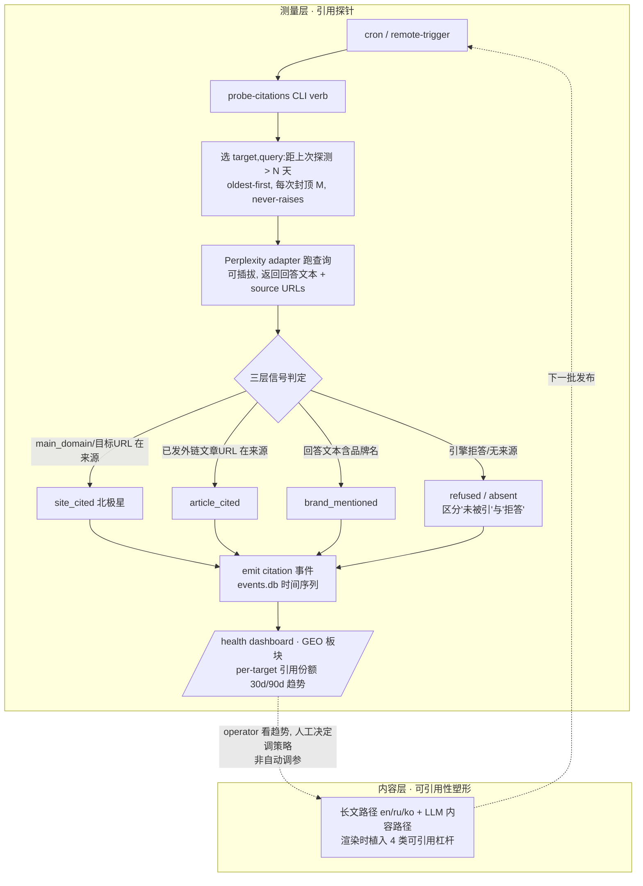

# GEO/AI 引用闭环:让外链产出可被 LLM 引用,并周期性测量"目标站被引用"

> **机制定位**:产品当前 100% 为"经典 PageRank 反链"优化,完全没有衡量/优化"是否被 AI 搜索引用"。
> 2026 年 AI 搜索(ChatGPT/Perplexity/Gemini + Google AI Overviews)已占英文信息类查询约 12–18%,
> 且"品牌提及与 AI 可见性的相关性是反链的 3 倍"。本机制补上这块当前架构完全捕获不到的新价值。

## Problem Frame

谁受影响 / 什么在变 / 为什么重要:

- **现状**:发布流水线(plan→validate→publish)+ 锚文本安全分布 + liveness 复查 + equity ledger
  都只服务于"经典反链"。**没有任何一处衡量"目标站在 AI 回答里被不被引用"**,也没有让生成内容
  "更容易被 LLM 引用"的塑形。
- **行业位移**:AI 搜索成为新分发面;被 AI 回答引用 ≈ 新的"排名第一"。经典反链仍有用(它正向贡献
  GEO 引用概率),但**不可观测、不可优化的 AI 引用价值正在白白流失**。
- **架构契合**:测量层与现有 `webui_app/services/recheck.py`(注入式 `verify_fn` + `RecheckSummary`)
  和 events.db 时间序列**完全同构**——周期性跑查询、解析来源、回写事件,跟 liveness recheck 是同一套
  骨架。这让本机制是"复用既有模式"而非"另起炉灶"。

完整闭环(本版范围:测量 + 内容塑形两半都做):

## Requirements

**[测量层 — 引用探针]**

- R1. 新增 cron 安全、非交互的引用探针 CLI verb(如 `probe-citations`)。**复用 recheck 的注入式架构**
  (类比 `recheck.py` 的 `verify_fn`,提供可注入 `probe_fn` 便于测试不出网)。v1 **仅实现 Perplexity
  adapter**,但探针引擎做成**可插拔**(沿用 `register("x", XAdapter)` 模式),后续加 Gemini/ChatGPT
  零架构改动。
- R2. 引擎 adapter 契约:输入一个查询 → 输出结构化结果(回答文本 + source URLs 列表 + 原始响应留痕)。
  Perplexity 走 OpenAI 兼容端点,**复用现有 `[llm.*]` config + `BACKLINK_LLM_API_KEY` env 模式**,
  新增 `[geo.probe_provider]` 块(`base_url` / `model` / `timeout_s`,`base_url` 必须 `https://`)。
- R3. **查询来源**:每个 target 的探针查询从现有 `seed_keywords` / `topic` / target 配置**自动派生**一组
  小查询;operator 可在 config **显式覆盖** per-target 查询列表(类比 `anchor_keywords` pool 的配置形态)。
- R4. **龄期选择 + 限速 + oldest-first**:只探"距上次探测 > N 天"的 `(target, query)`,最老优先,每次
  封顶 M 条。N/M 内置合理默认(暂不外暴,scope-guardian);plan 阶段须给出
  `targets × queries × cadence × M` 的覆盖关系,保证语料增长时最老条目不被饿死。

**[测量层 — 信号分层与判定]**

- R5. 每次探测对照**三层信号**判定(全部记录,北极星 = 第一层):

  | 信号层 | 判定 | 数据来源 | 角色 |
  |---|---|---|---|
  | **site_cited**(北极星) | `main_domain` / 目标 URL 出现在 source URLs | target 配置 | 头号 KPI |
  | **article_cited** | 某条已发布外链文章 URL 出现在 source URLs | 已发 `article_urls`(events `publish.confirmed` floor / `history_store`) | 直接归因"我发的这篇" |
  | **brand_mentioned** | 回答文本出现品牌/实体名(纯文本,不要求 URL) | target 配置新增 brand/entity 别名列表 | 最丰富信号(3x 发现) |

  并额外区分 **refused / absent**:引擎拒答或无来源,与"页面存在但未被引用"是不同状态(见 D7 风险)。

- R6. **非确定性处理**:Perplexity 同查询多次结果不同 → 判定**不能是单次二元"是/否"**。度量改为滚动窗口的
  **引用份额(citation share)**——某 target 在最近 W 次探测中被引用的比例;单次未命中不算证据。
  每查询重复探测次数、窗口 W plan 阶段定。

**[测量层 — 事件与可见性]**

- R7. 探测结果进 **events.db 时间序列**(新增 citation 生命周期事件 kind,如 `citation.observed`,载荷含
  engine / query / verdict 层 / 命中的 URLs / 时间戳)。**沿用 lifecycle-closed-loop 的 events 时间序列
  模式**,使"某 target 何时开始/停止被引用"可见。**不刷新 equity ledger 列**(ledger 无引用列,沿用
  lifecycle 文档对 dofollow 漂移的处理:只进 events.db + dashboard)。
- R8. health dashboard 新增 **GEO 板块**:per-target 引用份额(滚动 30d/90d)趋势、三层信号计数、哪些
  query 命中/未命中、refused 比例。dashboard 直接读 events.db(与现有衰减板块同构)。

**[内容层 — 可引用性塑形]**

- R9. **长文路径(en/ru/ko + LLM 内容路径)**渲染时植入四类可引用杠杆(均为正文文本层、可共存):
  ① 可引用统计/数据点;② FAQ/直接问答块(与查询同构,answer engine 可直接抽取);③ 自包含断言 +
  实体清晰(每段有能独立成立、明确点名品牌/站点的事实句);④ 时效信号(显式日期 / "截至 2026 年")。
- R10. **统计杠杆防造假**:统计/数据点**必须挂真实数据源**;无可靠数据源时**降级**为不带数字的断言,并
  emit `WARN`(防"为可引用性而造假"踩 Google scaled-content-abuse / 薄内容 / 虚假信息红线 —— 与机制 B
  风险联动)。
- R11. **分路径适用**:zh-CN 150–200 字 LLM-free 调度路径**豁免厚塑形**(格式太小),仅应用**零成本**的
  时效信号 + 实体清晰;长文 / LLM 路径应用全部四杠杆。**明确写入**避免 planner 误推到短文路径。

**[闭环语义与 operator 主权]**

- R12. 闭环是 **operator 驱动,非自动调参**(沿用 `anchor_alarm` 的 "detection not prevention, operator
  is the deciding agent" 立场):测量层只呈现"引用份额趋势 + 哪些 query/article 命中",由 operator 决定
  是否调整内容策略;**发布路径不自动消费引用信号**。
- R13. **闭环连接点**:dashboard/报告把"某 target 引用份额 + 已发 K 篇"并置呈现,让 operator 判断"塑形是否
  起效",但**不做因果断言**(见 R14)。

**[诚实化与防滥用护栏]**

- R14. **归因诚实**:target 站被引用受大量站外因素影响,本闭环测的是**可见性相关性,非"我发的外链导致被
  引用"的因果**。dashboard/报告文案据此措辞(类比 lifecycle 文档把 dofollow 漂移标为"contract-drift
  提示而非保证"),避免把相关当因果。
- R15. **成本可见**:Perplexity API 按量计费;每次 probe run 输出本次消耗查询数 / 估算成本;封顶 M 防失控;
  `--dry-run` 只打印查询计划不出网(沿用 publish 的 `--dry-run` 契约)。
- R16. **退出码契约**:探针 verb 遵守现有 0–6 退出码契约;引用份额跌破阈值时的告警语义(是否复用
  `exit 6` 的 alarm 语义、还是新告警码)plan 阶段定。

## Success Criteria

- 对任一配置了 brand/queries 的 target,能跑出"最近 W 次探测中被引用份额"的数字,并随时间形成 events.db
  时间序列;dashboard 不跑命令也能看到 per-target 趋势 + 三层信号计数 + refused 比例。
- 长文路径产出的文章确实带可引用结构(统计 / FAQ / 自包含断言 / 显式日期),且**统计杠杆无真实数据源时正确
  降级 + WARN**(不造假)。
- 全流程 **cron 安全、非交互、never-raises**;`--dry-run` 不出网;成本封顶生效。
- 文案审查通过:**不对"被引用"做因果断言**;明确区分"未被引用"与"引擎拒答"。

## Scope Boundaries

- ❌ v1 不做 Gemini / ChatGPT 引擎(adapter 接口预留,后续版本)。
- ❌ 不做自动调参 / 自动改内容策略(operator 驱动)。
- ❌ 不做 schema/JSON-LD 注入(Medium/Blogger 剥离自定义结构化数据,无效)。
- ❌ 不做 AI-bot(GPTBot/PerplexityBot)服务器日志分析(发布在第三方平台拿不到日志;目标站日志是另立项)。
- ❌ 不改 zh-CN LLM-free 短文调度核心(仅加零成本塑形,见 R11)。
- ❌ 不把"被 AI 引用"回写 equity ledger 列(ledger 无此列;只进 events.db + dashboard)。

## Key Decisions

- **D1**:北极星 = `site_cited`(目标站被引用),三层信号全记录。
- **D2**:v1 单引擎 Perplexity,引擎可插拔(沿用 adapter/registry 模式)。
- **D3**:完整闭环(测量 + 塑形);塑形仅长文 / LLM 路径,短文路径仅零成本杠杆。
- **D4**:operator 驱动,不自动调参(沿用 `anchor_alarm` 立场)。
- **D5**:度量 = 滚动窗口引用份额,非单次二元判定(应对 Perplexity 非确定性)。
- **D6**:只测相关、不断因果(沿用 guardrail-honesty 主题)。
- **D7**:成人内容目标站的拒答风险显式建模 —— 区分 refused vs not-cited,先测拒答率再决定是否纳入闭环。

## Dependencies / Assumptions

- **复用**:`recheck.py` 注入式架构 + events.db 时间序列 + health dashboard + `[llm.*]` config/env 模式。
- **新增依赖**:Perplexity API key(`[geo.probe_provider]` + 复用 `BACKLINK_LLM_API_KEY` 或新 env)。
- **假设**:operator 能提供 / 产品能派生每 target 的查询集与品牌别名列表。
- **⚠️ 重大价值风险(成人内容)**:实际主力目标站含成人内容(51acgs 漫画、xhssex 等)。主流 AI 引擎
  (Perplexity)很可能**拒答或永不引用成人内容站** → 对这几个站 GEO 引用闭环可能**结构性零命中**。
  与 README 已记的"成人站点在主流 LLM provider 上拒绝率高"同源。**镜像现有
  `scripts/llm_rejection_spike.py` 模式先测拒答/可引用率**,据此决定是否把这类 target 排除出 GEO 闭环
  (或闭环价值主要落在非成人 target 上)。

## Outstanding Questions

### Resolve Before Planning
- (无阻断性问题 —— 范围/北极星/引擎/塑形杠杆四个大叉已定)

### Deferred to Planning
- [Affects R7][Technical] 具体 event kind 命名 + reducer/projector 接线(沿用 `events/kinds.py` 现有契约)。
- [Affects R2][Technical] Perplexity API 响应解析(source URLs 字段路径)+ OpenAI 兼容端点细节。
- [Affects R3][Technical] 查询自动派生算法(从 `seed_keywords`/`topic` 生成自然查询)。
- [Affects R5][Technical] `article_cited` 的 join 路径(已发 `article_urls` ← events `publish.confirmed` / `history_store`)。
- [Affects R6][Needs research] Perplexity 非确定性的统计处理:每查询重复 probe 次数、滚动窗口 W、份额阈值。
- [Affects R5/D7][Needs research] 成人内容目标站在 Perplexity 的拒答率/可引用率(镜像 `llm_rejection_spike.py`),决定是否排除。
- [Affects R15][Technical] 成本估算模型 + 默认 M/N。
- [Affects R16][Technical] 引用份额阈值与退出码(复用 `exit 6` alarm / 新告警语义)。

## Next Steps
→ `/ce:plan` for structured implementation planning(无 resolve-before-planning 阻断项)
