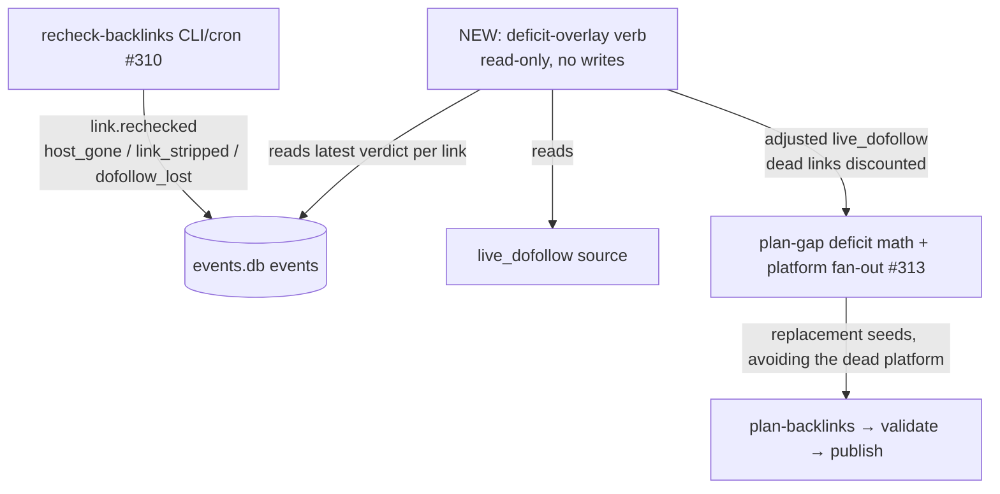

# Recheck-verdict → Re-plan Closed Loop (interim deficit-overlay; ledger writeback / R6 deferred)

## Problem Frame

The recheck **survival loop** (#310) and the **deficit-driven re-plan** verb `plan-gap` (#313) are
wired in parallel but never in series. `recheck-backlinks` (CLI/cron) writes authoritative
`link.rechecked` events with deterministic verdicts (`host_gone` / `link_stripped` / `dofollow_lost`)
and *displays* them via `derive_decay_counts`, but `plan-gap`'s deficit is computed from the
equity-ledger's `live_dofollow`, whose liveness is publish-time-clock only
(`ledger/aggregate.py:_link_liveness`) and never reads `link.rechecked`. So a cron-detected dead link
still counts as `live_dofollow`; `gap/engine.py` `deficit = max(0, desired − live_dofollow)` subtracts
the falsely-live link; `plan-gap` emits **zero** replacement seeds. The operator's cron loop *sees* the
death, *shows* the death, and cannot *act* on it — only the manual WebUI `recheck_one` drives
re-planning. This is the project's signature false-success class at the integration layer: **a dead
link still counts as live equity, so the deficit reads 0 and no replacement is planned.**

### Approach decision (and why it pivoted)

The "proper" fix (R6 in the runbook) is to write recheck verdicts into the equity-ledger's liveness via
plan-007's `articles` columns + projector. A document-review of that approach found it is **not** the
thin rider it first appeared: it carries two P0 correctness gaps — (a) representing a dead link as
ledger-`failed` triggers `plan-gap`'s default failed-target *suppression* (zero seeds), and (b) two
writers (cron `link.rechecked` vs WebUI `publish.verified`) move the same `articles` column under
"latest-ts-wins", so a later `publish.verified` silently revives a dead link — and it is gated behind
plan-007 U5 (downstream of the risky U4 migration).

**This document specifies the interim path instead:** a read-only **deficit-overlay** that closes the
re-plan loop now, sidesteps both P0s, and has no plan-007 dependency. The ledger writeback (R6-proper)
remains the eventual consolidation and is recorded as a deferred follow-up below.

### Information flow

The overlay presents a dead link as a **reduced `live_dofollow` count**, never as a `failed` target —
so `plan-gap`'s failed-suppression never fires, and there is no shared `articles` column to be revived
by a later `publish.verified`. Both P0s are dissolved by construction.

## Requirements

**Overlay liveness semantics**
- R1. The overlay reads the **latest** `link.rechecked` verdict per link (keyed on canonical
  `live_url`, with `article_id` as a fast path) and treats `host_gone` / `link_stripped` as dead →
  the link is **discounted from its target's `live_dofollow`** count.
- R2. A `dofollow_lost` verdict discounts the link from the **dofollow** portion of the count (live but
  non-dofollow). *(In this approach R2 is cheap, not a separate feature: the overlay reads the verdict
  directly from `link.rechecked` and does not depend on the ledger's static-manifest dofollow
  classification or any new `articles` column.)*
- R3. `probe_error` is ignored (no discount; the link is re-probed). `alive` confirms the link live.
- R4. Recency wins: the latest verdict per link governs (ordered by event append order / `ts_utc`); an
  `alive` newer than a prior dead verdict restores the link to the count.

**Re-plan integration**
- R5. The adjusted `live_dofollow` feeds `plan-gap`'s **existing** deficit math
  (`deficit = max(0, desired − adjusted_live_dofollow)`) and platform fan-out — replacements fan to
  remaining dofollow platforms, **avoiding the dead platform**, reusing #313's intelligence unchanged.
- R6. The overlay is **read-only and pure**: it mutates nothing (not events.db, dedup.db, the ledger,
  history_store, or `canary-health.json`). It composes in the pipeline as a diagnostic/transform that
  produces the deficit `plan-gap` acts on — no new write path, no schema change, no projector change.

**Acceptance**
- R7. Positive-assertion test: given a deterministic-dead `link.rechecked` verdict newer than the
  link's last live signal, the overlay's adjusted deficit for that target increases by one, and the
  re-plan produces a replacement seed for that target **on default flags (no `--include-failed`)**. A
  no-op overlay is theater.
- R8. Recency test: a later `alive` verdict restores the link (deficit returns to baseline); the
  overlay is deterministic given the same event set (re-running converges).

## Success Criteria
- After a cron `recheck-backlinks` sweep flags a backlink `host_gone`/`link_stripped`, running the
  overlay → `plan-gap` → `plan-backlinks` produces a replacement seed for that target — **with no
  manual WebUI click and no `--include-failed` flag**.
- A `dofollow_lost` link stops counting toward a target's dofollow coverage in the overlay's deficit.
- The operator's re-plan loop no longer requires hand-clicking WebUI recheck per dead link; the
  cron-detected death drives the next batch. *(The equity-ledger's own liveness column stays
  publish-time-clock until R6-proper lands — the runbook's dual-source note is updated to point at the
  overlay for re-planning, not removed.)*

## Scope Boundaries
- **Ledger liveness writeback (R6-proper)** — DEFERRED, not done here. The overlay does not change the
  equity-ledger's stored liveness, the projector, or any schema. Recorded as the eventual consolidation
  (retire the overlay once plan-007's ledger natively consumes recheck verdicts).
- **Replacement provenance / `decay_origin`** (which dead link a replacement replaces) — OUT
  (Round-12 fast-follow B4; the deficit re-count works without it).
- **`suspected_dead` derivation** (K-consecutive `probe_error`) — OUT (separate runbook fast-follow #2,
  own trigger; a different problem from deterministic-dead).
- **Recheck coverage-deficit warning** (`M·(N/P) ≥ C`) — OUT (independent monitoring concern).
- **Remediation / ack / snooze queue** — OUT (explicit origin non-goal).
- **`liveness_source` operator dimension** — OUT of this interim path (it was a ledger-display feature;
  belongs with R6-proper).
- No change to the `recheck-backlinks` verdict taxonomy/probe; no change to `plan-gap`'s fan-out logic;
  no auto-publish (the operator still gates `plan → validate → publish`).

## Key Decisions
- **Interim deficit-overlay over the plan-007 ledger-writeback rider:** deliver the closed loop now and
  sidestep two P0 correctness gaps (failed-target suppression; cross-kind `publish.verified` revival)
  plus the deep plan-007 U5 dependency. The overlay is **throwaway by design** — retired when
  R6-proper lands. The cost (rework later) is accepted for time-to-trust now.
- **Deficit overlay, not direct 1:1 seeds:** reuse `plan-gap`'s platform fan-out (#313) so replacements
  avoid the dead platform and respect the desired per-target count, rather than re-publishing to the
  platform that just died.
- **Represent dead as a discounted count, never as `failed`:** this is what dissolves the P0
  suppression interaction — `plan-gap` sees a normal deficit, not a suppressed failed target.
- **Single-observation demotion is acceptable here:** because the overlay feeds a *reviewable*
  `plan → validate → publish` (not auto-publish), a transient `host_gone` (e.g. a 5xx/anti-bot blip)
  yields at most one reviewable extra seed, not an auto-wasted publish. Revisit if the loop is ever
  cron-auto-published.

## Dependencies / Assumptions
- Reuses existing `link.rechecked` events (#310) + `plan-gap` (#313) + the existing `live_dofollow`
  read source. **No plan-007 dependency** (that is the deferred R6-proper path).
- `article_id` may be `NULL` on stdin-sourced rechecks, so the overlay keys on canonical `live_url`
  (with `article_id` fast path) to avoid silently dropping those verdicts.
- Assumes `plan-gap` can consume an externally-supplied adjusted `live_dofollow` / dead-link set
  (exact seam is a planning question — a new verb vs a `plan-gap` overlay flag).

## Outstanding Questions

### Deferred to Planning
- [Affects R5][Technical] Exact seam: a standalone overlay verb that emits `plan-gap`-compatible input,
  vs a `plan-gap --dead-overlay <feed>` flag, vs the overlay wrapping `plan-gap`. Pick the one that
  reuses `plan-gap`'s fan-out with the least coupling.
- [Affects R1/R4][Technical] Latest-verdict-per-link resolution: order by events `rowid` (append order)
  as primary key, `ts_utc` advisory, since recheck writers mix naive-local and tz-aware UTC.
- [Affects R1][Technical] Overlay keying on canonical `live_url` with `article_id` fast path; confirm
  `link.rechecked` → target_url mapping for the discount (join via `articles.live_url` / the recheck
  selection's existing 1:1).
- [Affects R6][Needs research] Whether the overlay should also surface the adjusted `live_dofollow` to
  the `equity-ledger` *display* (read-only) so the operator sees the discounted count, or strictly feed
  `plan-gap`. (Display-only read is still no-writeback.)

## Next Steps
→ `/ce:plan` for structured implementation planning. No blocking questions remain (approach + mechanism
resolved; the remaining items are implementation seams for planning). The plan should also record
R6-proper (ledger writeback via plan-007) as the follow-up that retires this overlay.
