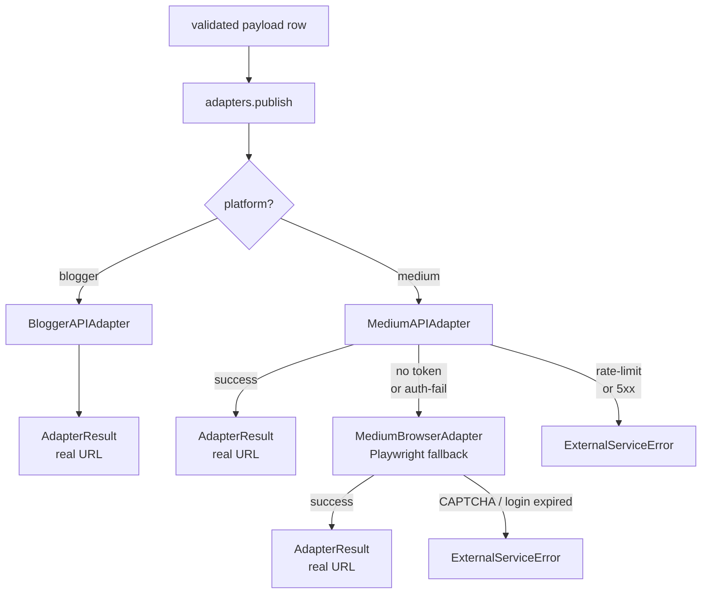
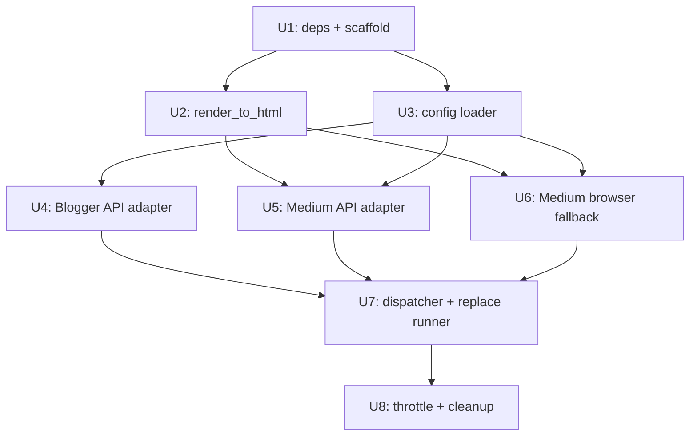

# feat: Rewrite publisher adapters as Python (API-first, browser-fallback)

## Overview

Replace the broken OpenCLI-based TypeScript adapters with native Python adapters.
Both platforms publish via official APIs as the primary path. Browser automation
via Playwright is retained **only as a fallback** for Medium when the user has no
valid Integration Token. After this lands, the project is a pure Python codebase
with no Node.js / OpenCLI / TypeScript runtime dependencies.

## Problem Frame

Carried from origin doc:

- `opencli-plugin/{medium,blogger}/create-post.ts` are TS files with Python
  docstrings, so they don't compile (`opencli-plugin/medium/create-post.ts:1`).
- They use index-based clicks (`browser.click("0")`) that don't reliably hit the
  Medium editor (`medium/create-post.ts:115`).
- Markdown is typed line-by-line into a WYSIWYG editor, so all markdown syntax
  appears as literal text (`medium/create-post.ts:127-133`).
- Returned `draft_url` is a SHA256-fabricated URL, not the real Medium URL
  (`medium/create-post.ts:180`).
- Net effect: publishes appear to succeed but nothing lands on the platform.

(see origin: `docs/brainstorms/2026-05-11-publisher-adapters-rewrite-requirements.md`)

## Requirements Trace

From origin doc; each unit below cites which Rs it advances.

- R1 — Blogger via API v3 (REST + OAuth2), replace TS file entirely
- R2 — Support `--mode draft|publish` for both platforms
- R3 — OAuth token persisted to `~/.config/backlink-publisher/blogger-token.json`,
  auto-refresh on expiry
- R4 — `blog_id` resolved via `~/.config/backlink-publisher/config.toml`
  `main_domain → blog_id` map; missing map → exit 3
- R5 — Return real `published_url` / `draft_url`, not fabricated
- R6 — Medium: Playwright reuses a persistent Chrome `user-data-dir` to preserve
  login (browser path is **fallback** under the new API-first constraint)
- R7 — Medium content rendered as HTML in the body (whether API or browser);
  preserve headings, links, bold, tags
- R8 — Browser fallback uses stable CSS / role selectors, not index clicks
- R9 — Browser fallback reads true Medium URL from `page.url()`
- R10 — Medium throttle 60-300 s random between posts; `MEDIUM_THROTTLE_MIN` /
  `MEDIUM_THROTTLE_MAX` env override
- R11 — Delete OpenCLI dependency, update README
- R12 — `publish-backlinks` CLI flags + JSONL schema unchanged; plan / validate /
  webui untouched
- R13 — Exit codes preserved: 3 = dependency error, 4 = external service error
- R14 — Structured JSON stderr logs: adapter, platform, id, phase, elapsed_ms
- R15 — Browser fallback failures save screenshot to
  `~/.cache/backlink-publisher/screenshots/{id}-{ts}.png`, path printed to stderr

## Scope Boundaries

- ❌ No LLM content rewriting (P0-2, separate plan)
- ❌ No new platforms beyond Blogger/Medium
- ❌ No `webui.py` refactor
- ❌ No publish-history persistence DB
- ❌ No concurrent publishing
- ❌ No fixes for P1 bugs (extra_urls multilingual, mode B/C URL paths,
  webui.py missing deps)
- ❌ No changes to `plan-backlinks` / `validate-backlinks` semantics

## Context & Research

### Relevant Code and Patterns

- `src/backlink_publisher/opencli_runner.py` — the runner this plan replaces.
  Pattern to mirror: takes payload dict, returns `{status, output, command}`
  dict, raises `DependencyError` / `ExternalServiceError`. The new adapter
  dispatcher follows the same return contract so `publish_backlinks.py:181-243`
  doesn't change.
- `src/backlink_publisher/cli/publish_backlinks.py:123-243` — call site. Loops
  rows, calls runner, sorts success / failure. Touches: replace `opencli_command`
  import with adapter dispatcher; add throttle sleep between rows; the
  surrounding logic stays.
- `src/backlink_publisher/errors.py` — existing error class hierarchy
  (`DependencyError`, `ExternalServiceError`, `InternalError`,
  `InputValidationError`). All new adapter code raises these, not new exceptions.
- `src/backlink_publisher/logger.py` — `opencli_logger`, `publish_logger`. Reuse
  `opencli_logger` (rename allowed but not required; "adapter_logger" alias
  acceptable). Already does structured JSON stderr.
- `src/backlink_publisher/markdown_utils.py` — has `validate_markdown_convertible`
  and `slugify`. Add `render_to_html` here instead of new module.
- `src/backlink_publisher/schema.py` — `validate_publish_payload`,
  `SUPPORTED_PLATFORMS`. No change needed; new adapters consume same payload.
- `pyproject.toml` — currently has `dependencies = []`. Plan adds required
  runtime deps. Existing optional `[dev]` group already has `pytest`,
  `pytest-mock`, `requests`.
- `tests/test_publish_backlinks.py` — uses `pytest-mock` to stub `opencli_command`.
  Pattern: monkeypatch the runner. New unit tests mirror this by stubbing the
  individual adapter classes.

### Institutional Learnings

None applicable — no `docs/solutions/` directory exists in this project.

### External References

- Blogger API v3 — `POST /blogs/{blogId}/posts` with `?isDraft=true` for
  drafts, omitting flag for live. OAuth2 scope:
  `https://www.googleapis.com/auth/blogger`. Refresh tokens stable as long as
  the user does not revoke; PKCE installed-app flow recommended.
- Medium API v1 — `POST /v1/users/{userId}/posts`. Body supports
  `contentFormat: "html"` so we can submit the rendered HTML directly. Returns
  `id` and `url` (real Medium URL). Auth: `Authorization: Bearer <token>`.
  Token must be obtained at `medium.com/me/settings/security` → Integration
  Tokens (older accounts; not all accounts can issue new tokens, which is the
  reason the fallback exists).
- Playwright Python — `chromium.launch_persistent_context(user_data_dir=...)`
  preserves cookies. Clipboard write supported via
  `context.grant_permissions(["clipboard-read", "clipboard-write"])` plus
  `page.evaluate("navigator.clipboard.writeText(html)")`. Medium's editor
  accepts pasted HTML and preserves formatting (this is the same code path as a
  Google Docs copy-paste — well-trodden).
- `markdown-it-py` — CommonMark + GFM table/strikethrough support, returns
  HTML string. Stable, pure-Python, no compiled deps.

## Key Technical Decisions

- **Adapters in Python, not TypeScript** — origin doc said "rewrite the TS
  files", but once OpenCLI is removed the TS reason vanishes. Python adapters
  collapse to one language, one dep tree, one test framework, and remove the
  Node.js runtime requirement entirely. (User decision, confirmed during
  planning.)

- **API-first, browser fallback** — refines the origin doc's "Playwright as
  primary Medium path". New rule: every adapter must attempt API first; browser
  automation runs only when API is unavailable or fails with a non-retryable
  auth error. (User decision, added during planning.)

- **Three adapters, one dispatcher** — `BloggerAPIAdapter` (only path for
  blogger), `MediumAPIAdapter` (primary), `MediumBrowserAdapter` (fallback).
  Dispatcher in `adapters/__init__.py` exposes a single `publish(payload, mode,
  config) -> AdapterResult` function. Why: keeps fallback chaining logic in one
  place; individual adapters stay stateless and testable.

- **Reuse existing error hierarchy** — no new exception types. `DependencyError`
  for missing config / token / Playwright binary; `ExternalServiceError` for
  HTTP 4xx/5xx, rate limits, CAPTCHA, login expiry. Exit codes 3/4 preserved.

- **Markdown → HTML happens once, in `markdown_utils.render_to_html`** —
  shared between Medium API (sends as `contentFormat: html`) and Medium browser
  fallback (pastes into editor). Blogger API also takes HTML in `content` field.
  Why: single source of truth for the markdown→HTML transformation; avoids
  divergence between API and browser paths.

- **Throttle lives in `publish_backlinks.py`, not in adapters** — sleep is
  between rows, not inside the adapter. Why: a single Medium API call doesn't
  need 60-300 s sleep; only the *between-posts* cadence does. Throttle reads
  `MEDIUM_THROTTLE_MIN` / `MEDIUM_THROTTLE_MAX` env vars; defaults 60 / 300.
  Skipped when `--dry-run`, when there are zero or one rows, and on the row
  immediately following a fallback browser failure (no point throttling after a
  failure).

- **OAuth flow uses `google-auth-oauthlib.InstalledAppFlow`** — opens a
  localhost callback in the user's default browser, single-use. Token cached
  at `~/.config/backlink-publisher/blogger-token.json` with mode 0600. Refresh
  handled inside `Credentials.refresh()` automatically.

- **No new CLI flags** — all new behavior is config-file-driven or
  env-var-driven, preserving R12 (CLI surface unchanged). The one possible
  exception, `--config`, is **deferred** unless a test scenario forces it
  during implementation.

## Open Questions

### Resolved During Planning

- Q: TS or Python for adapters? → Python (key decision above).
- Q: One adapter or two for Medium? → Two adapters + a dispatcher; API
  primary, browser fallback.
- Q: Where does markdown→HTML rendering live? → In `markdown_utils.py`
  alongside existing `validate_markdown_convertible`.
- Q: Where does throttle live? → In `publish_backlinks.py`, between rows.

### Deferred to Implementation

- Q: Does Playwright Python's persistent context handle Medium's
  `__cf_bm` Cloudflare cookie correctly across restarts? Likely yes (it's a
  normal cookie) but verify on first end-to-end run. Falls into U6 verification.
- Q: Exact CSS selector for the Medium editor's title region vs. body region.
  Medium changes selectors occasionally — implementer should derive these
  empirically during U6 and pin them in a `_selectors.py` constants module so
  future drift is a single-file fix.
- Q: Medium API rate-limit shape (RPS / daily quota). Medium docs are vague.
  Implementer should record actual observed limits in a `# rate-limits` comment
  during U5.
- Q: Whether `tomllib` (Python 3.11 stdlib) is enough or whether `tomli-w` is
  needed for *writing* config defaults during a `--init` flow. `--init` is not
  in scope for this plan; deferred until needed.
- Q: Should the Blogger OAuth client_id/secret be bundled (Google permits this
  for desktop apps) or expected from user-provided env vars? Lean toward
  bundled in `config.toml` example with a note that the user can override.
  Final call during U3.

## High-Level Technical Design

> *This illustrates the intended approach and is directional guidance for review, not implementation specification. The implementing agent should treat it as context, not code to reproduce.*

### Dispatch flow



### Adapter contract (pseudo-shape)

```
AdapterResult:
    status: "drafted" | "published" | "failed"
    draft_url: str | ""
    published_url: str | ""
    error: str | None
    adapter: str   # e.g. "medium-api", "medium-browser", "blogger-api"

Adapter.publish(payload: dict, mode: "draft"|"publish", config: Config) -> AdapterResult
    raises DependencyError | ExternalServiceError
```

### Config shape (`~/.config/backlink-publisher/config.toml`)

```
[blogger]
"https://my-target-site.com" = "1234567890"
"https://other-site.org"     = "9876543210"

[blogger.oauth]
client_id     = "..."
client_secret = "..."

[medium]
# optional; if missing, browser fallback runs
integration_token = "..."

[medium.browser]
# optional; defaults to ~/.config/backlink-publisher/chrome-profile-default/
user_data_dir = "/path/to/chrome/profile"
```

## Implementation Units



---

- [ ] **U1: Add runtime dependencies and adapters package scaffold**

**Goal:** Establish the Python package skeleton for the new adapters and pin
required deps.

**Requirements:** Foundation for R1, R5, R6, R7, R11

**Dependencies:** None

**Files:**
- Modify: `pyproject.toml`
- Create: `src/backlink_publisher/adapters/__init__.py`
- Create: `src/backlink_publisher/adapters/base.py`
- Test: `tests/test_adapter_base.py`

**Approach:**
- Add to `[project] dependencies`: `markdown-it-py`, `google-api-python-client`,
  `google-auth-oauthlib`, `google-auth-httplib2`, `playwright`, `requests`,
  `tomli; python_version<'3.11'` (the project pins ≥3.11 so this guard is a
  safety net only).
- Add to `[project.optional-dependencies] dev`: `pytest-asyncio` (for Playwright
  async tests).
- Create `adapters/base.py` defining a typed `AdapterResult` dataclass and an
  `Adapter` protocol (`publish(payload, mode, config) -> AdapterResult`).
- `adapters/__init__.py` stays empty in this unit; populated in U7.

**Patterns to follow:**
- Existing module layout under `src/backlink_publisher/`.
- Dataclass style: `from dataclasses import dataclass`, no Pydantic.

**Test scenarios:**
- Happy path: `AdapterResult` instantiates with all fields and serialises to
  dict matching the existing publish output keys (`id`, `platform`, `status`,
  `draft_url`, `published_url`, `error`, `adapter`).
- Edge case: `AdapterResult` with `status="failed"` allows empty URL strings
  and a non-`None` `error`.
- Test expectation for Protocol: structural-only; no runtime assertion needed
  beyond a `typing.get_type_hints` smoke test.

**Verification:**
- `pip install -e .` succeeds in a clean venv.
- `python -c "from backlink_publisher.adapters.base import AdapterResult"`
  resolves without ImportError.

---

- [ ] **U2: Markdown → HTML rendering**

**Goal:** Add a single `render_to_html` function used by all Medium paths and
the Blogger adapter.

**Requirements:** R7

**Dependencies:** U1 (for `markdown-it-py` dependency)

**Files:**
- Modify: `src/backlink_publisher/markdown_utils.py`
- Test: `tests/test_markdown_render.py`

**Approach:**
- Add `render_to_html(md: str) -> str` using `markdown-it-py` with
  `MarkdownIt("commonmark").enable(["table", "strikethrough"])`.
- Preserve link targets (no `nofollow` injection — these are *backlinks*, the
  whole point is `dofollow`).
- The function is pure: input string, output string, no I/O.

**Patterns to follow:**
- Adjacent function `validate_markdown_convertible` in the same file.

**Test scenarios:**
- Happy path: `# Title\n\nBody` → contains `<h1>Title</h1>` and `<p>Body</p>`.
- Happy path: `[anchor](https://example.com)` →
  `<a href="https://example.com">anchor</a>` (no `rel="nofollow"`).
- Happy path: `**bold**` → `<strong>bold</strong>`.
- Edge case: empty string → empty string (no crash).
- Edge case: input with already-embedded raw HTML → output preserves it
  (markdown-it default).
- Edge case: input with Chinese / Russian characters → output is valid UTF-8.

**Verification:**
- Tests pass.
- `render_to_html(payload["content_markdown"])` for a fixture seed produces
  HTML whose substring includes `payload["main_domain"]` (the backlink
  survives rendering).

---

- [ ] **U3: Config + token storage loader**

**Goal:** Centralised access to user config (`config.toml`) and OAuth token
file. Provides clear errors when config is missing.

**Requirements:** R3, R4

**Dependencies:** U1

**Files:**
- Create: `src/backlink_publisher/config.py`
- Test: `tests/test_config.py`

**Approach:**
- `Config` dataclass with: `blogger_oauth: BloggerOAuthConfig | None`,
  `blogger_blog_ids: dict[str, str]`, `medium_integration_token: str | None`,
  `medium_user_data_dir: Path | None`.
- `load_config(path: Path | None = None) -> Config` reads
  `~/.config/backlink-publisher/config.toml` via `tomllib` (stdlib in 3.11).
  Missing file → `Config` with all `None` / empty fields (not an error;
  individual adapters report missing pieces).
- `resolve_blog_id(config, main_domain) -> str` raises `DependencyError` with
  message naming the missing main_domain when not mapped.
- `load_blogger_token(path) -> dict | None` and `save_blogger_token(path,
  data) -> None`. File mode 0600 on save.
- Resolve `~/.config/backlink-publisher/` portably (`pathlib.Path.home() /
  ".config"` on Unix; on Windows, `%APPDATA%/backlink-publisher/`).

**Patterns to follow:**
- `src/backlink_publisher/errors.py` for `DependencyError`.
- `src/backlink_publisher/jsonl.py` for stdlib-only style.

**Test scenarios:**
- Happy path: TOML with `[blogger]` table + `[blogger.oauth]` parses into the
  expected `Config` shape.
- Happy path: missing file → empty `Config`, no error raised.
- Happy path: `resolve_blog_id(config, "https://known.com")` returns the mapped
  ID.
- Error path: `resolve_blog_id` with unmapped domain raises `DependencyError`
  whose message contains the domain string.
- Edge case: TOML key with trailing slash (`"https://x.com/"`) and lookup
  without trailing slash both resolve (or document one canonical form and
  reject the other — implementer's call).
- Edge case: `save_blogger_token` writes file with mode 0600.
- Error path: corrupt TOML → `DependencyError` with the underlying parse error
  message.

**Verification:**
- Tests pass with `tmp_path` fixtures for both config file and token file.

---

- [ ] **U4: Blogger API adapter**

**Goal:** Publish to Blogger via Blogger API v3 with full OAuth2 install-app
flow.

**Requirements:** R1, R2, R3, R4, R5, R13, R14

**Dependencies:** U1, U3

**Files:**
- Create: `src/backlink_publisher/adapters/blogger_api.py`
- Test: `tests/test_adapter_blogger_api.py`

**Approach:**
- `BloggerAPIAdapter` class.
- Auth: lazy-init `Credentials`. If saved token exists and is valid → use it.
  If expired and refresh-token present → refresh. If no token → run
  `InstalledAppFlow.run_local_server(port=0)` (one-time interactive). Save back
  via `save_blogger_token`.
- Build service: `googleapiclient.discovery.build("blogger", "v3",
  credentials=creds)`.
- Publish call:
  `service.posts().insert(blogId=blog_id, isDraft=(mode=="draft"),
  body={"title": payload["title"], "content": render_to_html(payload["content_markdown"]),
  "labels": payload["tags"][:20]}).execute()`.
- Returned `url` is the real Blogger URL. Set both `draft_url` and
  `published_url` from it depending on mode.
- Translate `googleapiclient.errors.HttpError` 4xx → `ExternalServiceError`,
  5xx → `ExternalServiceError` (retry handled at caller layer for 5xx).
- Translate missing `blog_id` mapping → `DependencyError` via U3.
- Structured stderr log at `phase=auth`, `phase=publish`, `phase=done` with
  `elapsed_ms`.

**Patterns to follow:**
- Existing `opencli_runner.py` error-mapping style.
- Existing `logger.py` structured emission.

**Test scenarios:**
- Happy path: mocked Blogger discovery + insert returns
  `{"url": "https://realblog.blogspot.com/2026/05/post.html", "id": "123"}`;
  adapter returns `AdapterResult(status="drafted", draft_url=that_url, …)`.
- Happy path: `mode="publish"` sets `published_url` and clears `draft_url`.
- Error path: missing `blog_id` for `main_domain` → `DependencyError` raised;
  message names the unmapped domain.
- Error path: `HttpError(status=401)` → `ExternalServiceError("authentication
  failed; re-run with --reauth")` (or equivalent guidance).
- Error path: `HttpError(status=429)` → `ExternalServiceError("rate-limited")`.
- Error path: `HttpError(status=500)` → `ExternalServiceError` (caller retries).
- Edge case: payload with > 20 tags → only first 20 sent (Blogger limit).
- Integration scenario: full happy-path adapter call writes a structured JSON
  log to stderr containing the phase markers and `elapsed_ms`.

**Verification:**
- Unit tests pass against a mocked `googleapiclient`.
- Manual end-to-end (out of scope for plan-time verification): a real OAuth
  flow against a sandbox Blogger account produces a draft visible in the
  Blogger dashboard with HTML rendering intact.

---

- [ ] **U5: Medium API adapter (primary Medium path)**

**Goal:** Publish to Medium via the official `api.medium.com/v1/users/{userId}/
posts` endpoint when an Integration Token is available.

**Requirements:** R1 (per origin extension), R2, R5, R7, R13, R14

**Dependencies:** U1, U2, U3

**Files:**
- Create: `src/backlink_publisher/adapters/medium_api.py`
- Test: `tests/test_adapter_medium_api.py`

**Approach:**
- `MediumAPIAdapter` class.
- Detect token absence: if `config.medium_integration_token is None`, raise
  `DependencyError("medium integration token not configured")` so the
  dispatcher can fall through to the browser adapter.
- One-time user_id lookup: `GET /v1/me` with bearer token; cache in adapter
  instance (not on disk — short-lived).
- Publish: `POST /v1/users/{userId}/posts` with JSON body
  `{"title", "contentFormat": "html", "content": render_to_html(md),
  "tags": payload["tags"][:5], "publishStatus": "draft" | "public",
  "canonicalUrl": payload["seo"]["canonical_url"]}`.
- Response `data.url` is the real Medium URL.
- HTTP via `requests`; timeout 30 s.
- 401 → `ExternalServiceError("medium token invalid")` (dispatcher does NOT
  fall through to browser on this — it's a config problem, not a missing
  integration).
- 429 / 5xx → `ExternalServiceError` (dispatcher does NOT fall through; rate
  limits will hit browser path too).
- Structured stderr log: `phase=lookup`, `phase=publish`, `phase=done`,
  `elapsed_ms`.

**Patterns to follow:**
- `requests`-based HTTP style used elsewhere in webui.py.
- Error-mapping style from `opencli_runner.py`.

**Test scenarios:**
- Happy path: mocked `POST /posts` returns `{"data": {"url": "https://medium.com/@user/title-abc123", "id": "abc123"}}`;
  adapter returns `AdapterResult(status="drafted", draft_url=that_url, adapter="medium-api")`.
- Happy path: `mode="publish"` sends `"publishStatus": "public"` and the
  returned URL is mapped to `published_url`.
- Error path: token missing → `DependencyError`; the dispatcher (U7) will
  catch this specific type and fall through.
- Error path: 401 → `ExternalServiceError`, no fallthrough (caller treats as
  fatal config issue).
- Error path: 429 → `ExternalServiceError`, no fallthrough.
- Error path: network timeout → `ExternalServiceError`, no fallthrough.
- Edge case: payload with > 5 tags → only first 5 sent (Medium API limit).
- Edge case: `canonical_url` empty → omitted from body, not sent as empty
  string.
- Integration scenario: HTML body sent on the wire is the actual output of
  `render_to_html(payload["content_markdown"])` — verified by intercepting the
  mock request body.

**Verification:**
- Unit tests pass against mocked HTTP.
- Manual end-to-end (deferred): a real token + real account creates a draft
  with formatted title, links, and tags visible in Medium's draft dashboard.

---

- [ ] **U6: Medium browser fallback adapter (Playwright)**

**Goal:** When Medium API is unavailable, fall back to browser automation via
Playwright. Reuse a persistent Chrome profile to keep the user logged in.

**Requirements:** R6, R7, R8, R9, R13, R14, R15

**Dependencies:** U1, U2, U3

**Files:**
- Create: `src/backlink_publisher/adapters/medium_browser.py`
- Create: `src/backlink_publisher/adapters/_medium_selectors.py`
- Test: `tests/test_adapter_medium_browser.py`

**Approach:**
- `MediumBrowserAdapter` class. Lazy-imports `playwright.sync_api` so projects
  not using the fallback don't pay the import cost.
- `_medium_selectors.py` holds CSS/role selectors as named constants so selector
  drift becomes a one-file fix.
- Flow:
  1. Launch persistent context:
     `playwright.chromium.launch_persistent_context(user_data_dir, headless=False)`.
     Headless mode is **not used** — Medium detects headless aggressively, and
     clipboard permissions are simpler in headed mode.
  2. `context.grant_permissions(["clipboard-read", "clipboard-write"], origin="https://medium.com")`.
  3. Open `https://medium.com/new-story`.
  4. If redirected to login → raise `ExternalServiceError("medium login
     expired; re-login in this Chrome profile and retry")`.
  5. Render markdown → HTML via `render_to_html`.
  6. Write HTML to clipboard via `page.evaluate("navigator.clipboard.writeText(html)", arg=html)`.
  7. Focus title region (`_medium_selectors.TITLE`), type `payload["title"]`.
  8. Focus body region (`_medium_selectors.BODY`), trigger paste
     (`page.keyboard.press("Control+V")` on Linux/Windows,
     `"Meta+V"` on macOS — detect via `platform.system()`).
  9. Tags: open the publish menu (`_medium_selectors.PUBLISH_MENU`), add up to
     5 tags via `_medium_selectors.TAGS_INPUT`.
  10. Click Draft button (`_medium_selectors.SAVE_DRAFT`) or Publish button
      (`_medium_selectors.PUBLISH_BUTTON`).
  11. Wait for URL to change away from `/new-story`; read `page.url()` —
      that's the real Medium URL.
  12. Close context. Return `AdapterResult`.
- On any exception: save `page.screenshot(path=...)` to
  `~/.cache/backlink-publisher/screenshots/{id}-{ts}.png`, log path to stderr,
  raise `ExternalServiceError`.
- CAPTCHA detection: if `page.locator("iframe[src*='captcha']").count() > 0`
  during step 4, raise immediately with explicit CAPTCHA message.

**Patterns to follow:**
- Existing logger structured-JSON style.
- Existing error class hierarchy.

**Test scenarios:**
- Happy path: a stubbed `BrowserContext` / `Page` (via `pytest-mock`) walks
  through title-fill, paste, publish steps; final `page.url` mock returns
  `https://medium.com/@user/example-draft-xyz`; adapter returns
  `AdapterResult(status="drafted", adapter="medium-browser", draft_url=that_url)`.
- Happy path: `mode="publish"` clicks `PUBLISH_BUTTON` instead of
  `SAVE_DRAFT`.
- Error path: redirect to `/m/signin` → `ExternalServiceError` mentioning
  "login expired"; screenshot saved.
- Error path: CAPTCHA iframe present → `ExternalServiceError` mentioning
  CAPTCHA; screenshot saved.
- Error path: Playwright binary not installed → `DependencyError` with the
  install command in the message (`playwright install chromium`).
- Edge case: `user_data_dir` does not exist → adapter creates it (Playwright
  default behavior — Medium login is then required interactively on first run).
- Edge case: clipboard permission denied (e.g., grant_permissions silently
  failed) → falls back to keyboard-typing the HTML literally? **No** — raise
  `ExternalServiceError("clipboard permission denied")` rather than degrade
  silently (the user wants real publishes, not garbage).
- Integration scenario: rendered HTML written to clipboard matches
  `render_to_html(payload["content_markdown"])` exactly — verified by
  intercepting the `page.evaluate` argument.

**Verification:**
- Unit tests pass against a mocked Playwright API surface.
- Manual end-to-end (deferred): with a logged-in profile, publishing a sample
  payload produces a Medium draft visible in `medium.com/me/stories/drafts`
  with formatted title, links, bold text, and 5 tags.

---

- [ ] **U7: Adapter dispatcher (API-first + fallback) and call-site replacement**

**Goal:** Wire the three adapters together with the API-first + fallback policy,
and replace `opencli_runner.opencli_command` calls in `publish_backlinks.py`.

**Requirements:** R5, R11, R12, R13

**Dependencies:** U4, U5, U6

**Files:**
- Modify: `src/backlink_publisher/adapters/__init__.py`
- Modify: `src/backlink_publisher/cli/publish_backlinks.py`
- Delete: `src/backlink_publisher/opencli_runner.py`
- Test: `tests/test_adapter_dispatcher.py`
- Modify: `tests/test_publish_backlinks.py`

**Approach:**
- `adapters/__init__.py` exposes `publish(payload, mode, config) -> AdapterResult`
  and `verify_adapter_setup(platform, config) -> None`.
- Dispatch table:
  - `blogger` → `BloggerAPIAdapter` (no fallback).
  - `medium` → `MediumAPIAdapter` first. On `DependencyError` (i.e., missing
    token), fall through to `MediumBrowserAdapter`. On `ExternalServiceError`,
    do **not** fall through (a 401 or 429 is meaningful and the user must fix
    it).
- `verify_adapter_setup` replaces `verify_opencli_setup`:
  - `blogger` → check Blogger OAuth config present.
  - `medium` → check at least one of (Integration Token configured) OR
    (`playwright` import resolves AND `user_data_dir` exists or can be created).
- `publish_backlinks.py` change: imports update from
  `from ..opencli_runner import opencli_command, verify_opencli_setup`
  to `from ..adapters import publish, verify_adapter_setup`. Loop body becomes
  `result = publish(row, mode=mode, config=config)`. `--opencli-profile` flag
  is kept as a no-op or rerouted to `config.medium.browser.user_data_dir`
  override (decided in U7 — see deferred Q).
- Delete `opencli_runner.py` entirely.
- `tests/test_publish_backlinks.py`: replace stubs of `opencli_command` with
  stubs of `adapters.publish`. Keep all existing test cases passing.

**Patterns to follow:**
- Existing dispatch-by-platform shape used implicitly in the current
  `publish_backlinks.py` (the `if platform == "linkedin"` block); now formalised
  in one place.

**Test scenarios:**
- Happy path: `publish(payload_blogger, …)` calls `BloggerAPIAdapter` and
  returns its result.
- Happy path: `publish(payload_medium, …)` with API token configured calls
  `MediumAPIAdapter` and returns its result.
- Fallback: `publish(payload_medium, …)` with NO API token configured calls
  `MediumAPIAdapter`, sees `DependencyError`, then calls
  `MediumBrowserAdapter` and returns its result.
- No-fallback: `publish(payload_medium, …)` with API token but mocked 401 →
  `ExternalServiceError` propagates; browser adapter NOT invoked.
- Error path: `publish(payload_linkedin, …)` → existing validate layer
  rejects (no change); confirm regression test still passes.
- Edge case: `--dry-run` path: `publish()` returns a sentinel `AdapterResult`
  with `_dry_run=True` and a synthesized command string for stdout logging
  (mirror current `opencli_command(dry_run=True)` behavior).
- Integration scenario: full `publish-backlinks` CLI invocation against a
  fixture JSONL with one blogger + one medium row, all adapters fully mocked,
  exits 0 and writes the expected JSONL to stdout.

**Verification:**
- All existing `test_publish_backlinks.py` cases pass after migration.
- New dispatcher tests pass.
- `opencli_runner.py` is gone; `git grep opencli_command` returns 0 hits in
  `src/`.

---

- [ ] **U8: Throttle, README, OpenCLI plugin removal, dependency cleanup**

**Goal:** Add inter-row Medium throttle, delete `opencli-plugin/` entirely,
update README to reflect the new architecture and removed Node.js dependency.

**Requirements:** R10, R11

**Dependencies:** U7

**Files:**
- Modify: `src/backlink_publisher/cli/publish_backlinks.py`
- Delete: `opencli-plugin/` (entire directory tree)
- Modify: `README.md`
- Modify: `pyproject.toml` (remove any TS-tooling references if present;
  currently none, so this is a confirm-no-op step)
- Modify: `test-pipeline.sh` (check for OpenCLI references and update)
- Test: `tests/test_throttle.py`

**Approach:**
- Throttle: in `publish_backlinks.py`, after each successful Medium row
  (`result.adapter` in `{"medium-api", "medium-browser"}`) and before the
  next row, sleep `random.uniform(min, max)` where `min=int(os.environ.get("MEDIUM_THROTTLE_MIN", "60"))`,
  `max=int(os.environ.get("MEDIUM_THROTTLE_MAX", "300"))`. Skip on `--dry-run`.
  Skip if this is the last row. Skip if the next row's effective platform is
  `blogger` (no need to throttle Medium-rate behavior for a Blogger publish).
- README rewrite:
  - Remove "Node.js >= 21" row from prerequisites.
  - Remove "OpenCLI Setup" section entirely.
  - Replace it with "First-Run Setup": (1) `pip install -e .`, (2) `playwright
    install chromium` (only if planning to use Medium browser fallback),
    (3) `cp config.example.toml ~/.config/backlink-publisher/config.toml` and
    edit Blogger OAuth client + blog_id map.
  - Update "Project Structure" section to remove `opencli-plugin/`.
  - Update "OpenCLI Adapters" section title and content to "Publisher
    Adapters" with the new API-first + fallback explanation.
  - Update Troubleshooting table to drop OpenCLI rows and add Blogger OAuth
    + Medium token rows.
- Create `config.example.toml` at project root showing all keys.

**Patterns to follow:**
- Existing README markdown style.

**Test scenarios:**
- Happy path: throttle sleeps an amount in `[60, 300]` between two medium
  rows (mock `time.sleep` to assert the bounds).
- Happy path: env override `MEDIUM_THROTTLE_MIN=10 MEDIUM_THROTTLE_MAX=15`
  produces a sleep in `[10, 15]`.
- Edge case: single-row input → no sleep called.
- Edge case: `--dry-run` → no sleep called regardless of platform.
- Edge case: row N is medium-success, row N+1 is blogger → no sleep called.
- Edge case: row N is medium-failure → no sleep called (already documented
  in Key Decisions).
- Test expectation for README / file deletion: none — pure docs / cleanup.
  (Verified via `git status` showing `opencli-plugin/` deleted and README
  diff.)

**Verification:**
- Throttle tests pass.
- `git ls-files opencli-plugin/` returns empty (the dir is gone).
- Fresh checkout + `pip install -e .` + `pytest` passes without Node.js
  installed.
- README has no remaining mention of OpenCLI, Node.js, or `npm install`.

---

## System-Wide Impact

- **Interaction graph:** `plan-backlinks` and `validate-backlinks` untouched.
  `publish-backlinks` CLI flags + stdout JSONL shape unchanged. `webui.py`
  shells out to `publish-backlinks` via subprocess — no observable change.
- **Error propagation:** New adapters raise existing `DependencyError` /
  `ExternalServiceError` types; existing `publish_backlinks.py` exit-code logic
  (3 vs 4) reused as-is.
- **State lifecycle risks:** Persistent Chrome profile under
  `~/.config/backlink-publisher/chrome-profile-default/` accumulates cookies and
  cache over time. First publish requires interactive login; subsequent runs
  reuse session. If the profile gets corrupted, deleting the directory recovers
  cleanly. OAuth token file mode 0600 prevents other users on the same machine
  from reading it.
- **API surface parity:** No CLI breaking change. No JSONL schema change.
  Existing webui.py routes (`/ce:publish`, `/ce:publish-real`) require zero
  modification beyond the user installing new deps via `pip install -e .`.
- **Integration coverage:** Three cross-layer scenarios warrant integration
  tests:
  - End-to-end mocked: stdin → plan → validate → publish (Blogger path) → exit 0.
  - End-to-end mocked: stdin → plan → validate → publish (Medium API path) → exit 0.
  - End-to-end mocked: stdin → plan → validate → publish (Medium API fails with
    `DependencyError` → falls to browser path) → exit 0.
- **Unchanged invariants:**
  - JSONL output schema of `publish-backlinks` (`id`, `platform`, `status`,
    `draft_url`, `published_url`, `created_at`, `adapter`, `error`).
  - Exit code contract (0/1/2/3/4/5).
  - stdout = JSONL only, stderr = diagnostics only.
  - `linkedin` rejection in validate + publish stages.

## Risks & Dependencies

| Risk | Likelihood | Impact | Mitigation |
|---|---|---|---|
| Medium selector drift breaks browser fallback within weeks | High | Med | `_medium_selectors.py` constants module; failures save screenshot; browser path is fallback, not primary |
| Medium API doesn't issue new Integration Tokens for new accounts; some users stuck on browser path forever | High | Med | Browser fallback is first-class, not a one-off escape hatch; documented in README |
| Blogger OAuth refresh token revoked after 6+ months idle | Med | Low | Token refresh failure → `ExternalServiceError` with clear "re-run OAuth flow" message |
| Playwright Chromium download (~150 MB) on first install surprises user | Med | Low | README "First-Run Setup" calls out `playwright install chromium` explicitly + makes it optional (only needed for Medium browser fallback) |
| CAPTCHA on Medium browser path is unrecoverable in headless automation | Low (with headed mode + 60-300s throttle) | High | Detect CAPTCHA iframe; raise clear error; user solves manually + retries |
| Tests for Playwright require asyncio + browser binary in CI, slowing CI | Med | Low | Use mocked Playwright surface for unit tests; reserve real-browser tests for an opt-in `@pytest.mark.slow` group not run by default |
| Removing `opencli-plugin/` deletes work-in-progress someone might have | Low | Low | The TS files don't compile; nothing of value is lost. Note in commit message |

## Documentation / Operational Notes

- README updated in U8 — primary user-facing doc.
- Add `config.example.toml` at project root in U8.
- No CI / deployment changes required.
- No metrics / monitoring hookup (out of scope; would be P1-2 history DB).
- One-time user action required after upgrade: copy `config.example.toml` to
  `~/.config/backlink-publisher/config.toml`, fill in Blogger OAuth + blog_id
  map; optionally run `playwright install chromium` if Medium browser fallback
  may be needed.

## Sources & References

- **Origin document:** [`docs/brainstorms/2026-05-11-publisher-adapters-rewrite-requirements.md`](../brainstorms/2026-05-11-publisher-adapters-rewrite-requirements.md)
- Related code: `src/backlink_publisher/opencli_runner.py`,
  `src/backlink_publisher/cli/publish_backlinks.py`,
  `src/backlink_publisher/markdown_utils.py`,
  `opencli-plugin/medium/create-post.ts` (to be deleted),
  `opencli-plugin/blogger/create-post.ts` (to be deleted)
- External docs:
  - Blogger API v3: `https://developers.google.com/blogger/docs/3.0/reference`
  - Medium API v1: `https://github.com/Medium/medium-api-docs`
  - Playwright Python: `https://playwright.dev/python/docs/api/class-browsertype#browser-type-launch-persistent-context`
  - markdown-it-py: `https://markdown-it-py.readthedocs.io/`
