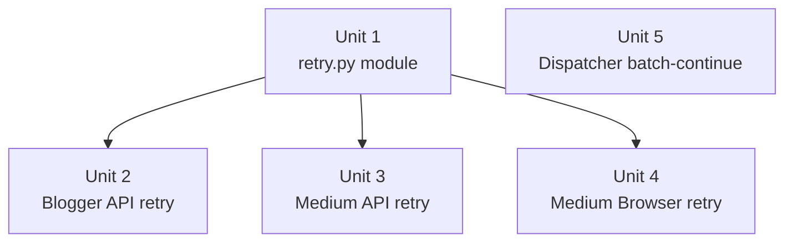

# feat: Adapter Retry with Exponential Backoff

## Overview

Adds exponential backoff retry to all three adapter publish paths (Blogger API, Medium API, Medium Browser) and changes the pipeline dispatcher to log-and-continue on `ExternalServiceError` instead of exiting the process. Together these two changes allow a batch of articles to survive transient failures without losing all remaining work.

## Problem Frame

Currently, any `ExternalServiceError` from an adapter — including recoverable transient errors such as HTTP 429, 5xx, or connection timeouts — calls `emit_error()` in `publish_backlinks.py`, which raises `SystemExit(4)` and kills the entire batch. Retry logic at the adapter level is useless without also fixing this exit path.

(see origin: `docs/brainstorms/2026-05-12-adapter-retry-backoff-requirements.md`)

## Requirements Trace

- R1. Three total attempts (1 initial + 2 retries) per adapter call.
- R2. Backoff before retry 1: 2s; before retry 2: 4s; each ± 15% jitter.
- R3a. Structured retry progress to stderr — status code, adapter name, attempt count, wait duration only. No response bodies or credentials.
- R4. Retryable: HTTP 429, HTTP 5xx, `ConnectionError`, `ReadTimeout`, Playwright `TimeoutError`.
- R5. Non-retryable: HTTP 401, 403, 422, `DependencyError`, CAPTCHA/2FA.
- R6. On exhaustion, last caught exception wraps as `ExternalServiceError`; no HTTP response headers or body propagated.
- R9. Retry constants defined as named constants in `retry.py`, not inline per adapter.
- R12. Dispatcher `ExternalServiceError` catch replaced with log-and-continue (like existing `except Exception` path).

## Scope Boundaries

- No retry at the plan → validate → publish CLI pipeline level.
- No user-configurable retry parameters in V1.
- No retry for CAPTCHA, 2FA, or login expiry on Playwright. These already raise `ExternalServiceError` inside the adapter; the retry helper does not catch `ExternalServiceError`.
- HTTP 5xx retry assumes the API did not partially commit. Verify against Blogger API v3 and Medium API docs before shipping.
- Medium throttle (60–300s between articles) is unchanged.
- `--dry-run` mode is unchanged (no live network calls).

## Context & Research

### Relevant Code and Patterns

- **Retry call site pattern** — inside each adapter's `try` block before `ExternalServiceError` is raised; helpers are called as `retry_transient_call(lambda: actual_call(), is_retryable=..., ...)`. Pattern avoids re-converting already-wrapped exceptions.
- **Blogger API call site** — `blogger_api.py`: `service.posts().insert(blogId=..., isDraft=..., body=...).execute()` — the retryable target. Errors are `HttpError` from `googleapiclient.errors`.
- **Medium API call sites** — `medium_api.py` lines 54–71 (GET /me via `requests.get`) and lines 91–113 (POST /posts via `requests.post`). Retryable: `requests.Timeout`, `requests.ConnectionError`, and response status 429 or 5xx.
- **Medium Browser call site** — `medium_browser.py` lines 72–178: the entire `with sync_playwright() as pw:` block. Retryable: `playwright.sync_api.TimeoutError`. `ExternalServiceError` raised for CAPTCHA/login (lines 89–101) propagates past retry naturally — retry helper does not catch it.
- **Dispatcher catch block to replace** — `publish_backlinks.py` lines 198–203: `except ExternalServiceError as exc: emit_error(str(exc), exit_code=4)`. Mirror the existing `except Exception` block (lines 204–221) which appends a failure record and `continue`s.
- **Test mock pattern** — network calls patched at the module where the name is bound: `"backlink_publisher.adapters.blogger_api._build_credentials"`, `"backlink_publisher.adapters.medium_api.requests.get"`, etc.
- **`time.sleep` mock target** — `"backlink_publisher.adapters.retry.time.sleep"` (module-qualified, per `test_throttle.py` convention).
- **Retry side-effect pattern** — `side_effect=[exception1, exception2, success_mock]` list on the mock to simulate first-attempt failure, retry, then success.
- **No existing retry utility** — `adapters/` has no retry infrastructure; this is net-new.

### Institutional Learnings

- `docs/solutions/ui-bugs/webui-blocking-subprocess-and-missing-progress-feedback-2026-05-12.md`: Established pattern for blocking calls > 5s. Loading overlay fires client-side before the request; cumulative retry waits (up to ~7s) are within tolerance.
- Same doc confirms `ExternalServiceError` should propagate explicitly, not be swallowed.

## Key Technical Decisions

- **`adapters/retry.py` shared helper, called inside adapter try blocks (not a decorator)**: A decorator on `publish()` would see `ExternalServiceError` (already wrapped) and could not distinguish retryable status codes. Each adapter's internal try block has access to raw exceptions — `HttpError`, `requests.RequestException`, `playwright.sync_api.TimeoutError` — before they become `ExternalServiceError`. This is the earliest and cleanest classification point. (see origin: Key Decisions)
- **`is_retryable` predicate per call site**: Each invocation of `retry_transient_call` passes its own predicate because exception types and retryability rules differ between Blogger (`HttpError`), Medium API (`requests.Timeout` / HTTP 429/5xx), and Playwright (`TimeoutError`). A global exception list would conflate unrelated error types.
- **CAPTCHA non-retryability requires a DOM probe in `is_retryable`**: `medium_browser.py` checks for CAPTCHA at lines 97–101, but `page.goto()` can time out before that check runs on a slow or bot-blocked connection. The `is_retryable` predicate for Unit 4 must include a DOM probe: on catching `TimeoutError`, check for the CAPTCHA iframe selector; if present, return False to prevent re-entry into a CAPTCHA-locked session. `ExternalServiceError` itself is never caught by `retry_transient_call`, so explicit CAPTCHA/login-expiry paths in `_run_browser_publish` remain non-retryable without a new exception type.
- **Medium API user_id not re-fetched on POST retry**: GET /me is retried separately from POST /posts. `user_id` is stored in a local variable after /me succeeds; POST /posts retry uses the cached value. This avoids redundant /me calls on POST failures.
- **Medium Browser: fresh Playwright context on each attempt**: On Playwright retry, `context.close()` is called before re-entering `with sync_playwright()`. Avoids Chrome profile lock conflicts. Retry wraps a callable that encapsulates the full `sync_playwright` lifecycle.
- **Dispatcher change is required**: Adapter retry alone is insufficient. `emit_error()` in `publish_backlinks.py` line 200 calls `SystemExit(4)`, ending the batch. Replacing it with log-and-continue (mirroring the existing `except Exception` path) allows remaining articles to be processed after a single article exhausts all retries.

## Open Questions

### Resolved During Planning

- **Where to add retry logic** — Inside each adapter's try block, in a shared `adapters/retry.py` helper. Option (c) — dispatcher wrapper — is not viable since the dispatcher only sees `ExternalServiceError` after it has been raised. (see origin: Outstanding Questions → Deferred to Planning)
- **CAPTCHA typing required?** — No. `medium_browser.py` raises `ExternalServiceError` for CAPTCHA before any network timeout. The retry helper's non-catch of `ExternalServiceError` handles this naturally. (see origin: Outstanding Questions → Deferred to Planning)
- **Web UI loading overlay** — Not in scope for this plan. The stderr message from R3a satisfies the terminal user. Web UI already shows a loading overlay from the browser's form submit handler; the overlay stays active until the server responds. No IPC is needed.
- **5xx idempotency** — Stated as an explicit assumption in the requirements (Scope Boundaries). Planner defers final verification of each platform's API behaviour to the implementing engineer. If verification fails, remove HTTP 5xx from `RETRYABLE_HTTP_STATUSES` in `retry.py`.

### Deferred to Implementation

- **Exact Playwright exception class to catch**: Verify whether `playwright.sync_api.TimeoutError` is the correct type (or `playwright.async_api.Error`). Check the Playwright Python docs or import path during implementation.
- **Whether `me_resp` 429 needs its own retry**: The current `medium_api.py` /me error path catches `requests.RequestException` generically but does not check the HTTP response status code. Implementation should confirm whether /me can return 429 in practice and whether retrying it is safe (the /me call is read-only and idempotent).

## High-Level Technical Design

> *This illustrates the intended approach and is directional guidance for review, not implementation specification. The implementing agent should treat it as context, not code to reproduce.*

```
retry_transient_call(fn, *, is_retryable, max_attempts, backoff_base, jitter):
  for attempt in 1..max_attempts:
    try:
      return fn()                           ← raw API call
    except Exception as exc:
      # ExternalServiceError / DependencyError are never retryable — is_retryable must return
      # False for them, so the bare `raise` below fires immediately, preserving their type.
      if NOT is_retryable(exc):
        raise                               ← bare raise, preserves exception type exactly
      if attempt == max_attempts:
        raise                               ← exhausted; caller's except block converts to ESE
      wait = 2^attempt × uniform(0.85, 1.15)
      print stderr: "retrying (attempt N/3): <exc_type> — waiting Xs"
      sleep(wait)
```

Call sites in adapters:
```
BloggerAPIAdapter.publish():
  result = retry_transient_call(
    lambda: service.posts().insert(...).execute(),
    is_retryable=lambda exc: isinstance(exc, HttpError)
                             and exc.resp.status in RETRYABLE_HTTP_STATUSES,
    ...
  )

MediumAPIAdapter.publish():
  me_resp = retry_transient_call(
    lambda: _get_me_or_raise(),  # raises _TransientHTTPError on 429/5xx, returns resp otherwise
    is_retryable=lambda exc: isinstance(exc, (Timeout, ConnectionError, _TransientHTTPError)),
    ...
  )
  # ... validate me_resp.status_code (401 check, not retried) ...
  post_resp = retry_transient_call(
    lambda: requests.post("/posts", ...),
    is_retryable=lambda exc: (
      isinstance(exc, (Timeout, ConnectionError)) OR
      (isinstance(exc, _TransientHTTPError) and exc.status in RETRYABLE_HTTP_STATUSES)
    ),
    ...
  )

MediumBrowserAdapter.publish():
  def _run_browser_flow():
    with sync_playwright() as pw:
      ...full publish flow...
  retry_transient_call(
    _run_browser_flow,
    is_retryable=lambda exc: isinstance(exc, PlaywrightTimeoutError),
    ...
  )
```

Dispatcher change in `publish_backlinks.py`:
```
BEFORE:  except ExternalServiceError as exc: emit_error(...) → SystemExit
AFTER:   except ExternalServiceError as exc:
           outputs.append({..., "error": f"service error: {exc}"})
           fail_count += 1
           publish_logger.error(f"publish failed: {exc}", ...)
           continue
```

## Implementation Units



Unit 5 is independent and can be implemented in parallel with Unit 1.

---

- [ ] **Unit 1: Retry infrastructure module**

**Goal:** Create `src/backlink_publisher/adapters/retry.py` with the shared retry helper and constants.

**Requirements:** R1, R2, R3a, R4, R5, R6, R9

**Dependencies:** None

**Files:**
- Create: `src/backlink_publisher/adapters/retry.py`
- Create: `tests/test_adapter_retry.py`

**Approach:**
- Define module-level constants: `MAX_ATTEMPTS = 3`, `BACKOFF_BASE = 2`, `JITTER_FACTOR = 0.15`, `RETRYABLE_HTTP_STATUSES = frozenset({429, 500, 502, 503, 504})`.
- `retry_transient_call(fn, *, is_retryable, max_attempts=MAX_ATTEMPTS, backoff_base=BACKOFF_BASE, jitter=JITTER_FACTOR)` — calls `fn()`, catches `Exception` broadly, checks `is_retryable(exc)`, applies `backoff_base^attempt * uniform(1-jitter, 1+jitter)` wait, emits stderr JSON-compatible line, retries. Rationale for broad `except Exception`: `fn()` is always a raw API call (pre-`ExternalServiceError` conversion) so `ExternalServiceError` and `DependencyError` will never be raised from inside `fn()` itself.
- **Re-raise contract**: When `is_retryable(exc)` returns False **or** retries are exhausted, use bare `raise` (not `raise exc from exc`) to preserve the original exception type, message, and traceback unchanged. This is required because `publish_backlinks.py` dispatches on type: `DependencyError` → exit 3, `ExternalServiceError` → exit 4.
- **`ExternalServiceError` / `DependencyError` passthrough**: `is_retryable` must return False for these types. Since they will never be raised by `fn()` (raw API calls), this is a belt-and-suspenders guard — but it must be explicitly documented in `retry.py` to prevent accidental regression.
- On retry exhaustion, raises the last caught exception directly — caller's adapter `except` block converts it to `ExternalServiceError`. When constructing `ExternalServiceError` from a caught exception, use `raise ExternalServiceError(sanitized_message) from None` to suppress the cause chain and prevent response body or headers from appearing in tracebacks or monitoring tools (R6 / security requirement).
- Stderr format: `{"level": "WARN", "msg": "retrying (attempt N/3): <exc_type> — waiting Xs", "adapter": "..."}` — HTTP status code, adapter name (passed as kwarg), attempt count, wait duration. No response body, headers, or credentials.

**Patterns to follow:**
- `time.sleep` import pattern: `import time` then `time.sleep(wait)` — matches `test_throttle.py` mock target `"backlink_publisher.adapters.retry.time.sleep"`.
- `json_log` helper pattern: see `blogger_api.py` `json_log(**kwargs)` for stderr emission style.

**Test scenarios:**
- Happy path: `fn()` succeeds on first call — `retry_transient_call` returns the result, `time.sleep` never called
- Retry + recovery: `fn()` raises retryable exception on attempt 1, succeeds on attempt 2 — `time.sleep` called once with value between 1.7s and 2.3s (2s ± 15%), function returns result
- Retry + exhaustion: `fn()` raises retryable exception all 3 times — `time.sleep` called twice (before attempt 2 and 3), last exception is re-raised unchanged
- Non-retryable exception: `fn()` raises non-retryable exception — exception propagates immediately, `time.sleep` never called, `is_retryable` called once
- DependencyError passthrough: `fn()` raises `DependencyError` — propagates immediately without entering retry loop (even if `is_retryable` would return True)
- Stderr content: on retry, emitted message includes attempt count and wait duration; does not include exception message that would contain API responses or credentials
- Edge case: `max_attempts=1` — no retries, single call, exception propagates on first failure

**Verification:**
- `pytest tests/test_adapter_retry.py` passes.
- `time.sleep` is only called during retry (not on first success, not on non-retryable failure).
- `DependencyError` and `ExternalServiceError` propagate without being caught.

---

- [ ] **Unit 2: Blogger API adapter retry**

**Goal:** Wrap the `service.posts().insert().execute()` call in Blogger adapter with `retry_transient_call`, retrying on `HttpError` with status in `RETRYABLE_HTTP_STATUSES`.

**Requirements:** R1, R2, R3a, R4, R5, R6

**Dependencies:** Unit 1

**Files:**
- Modify: `src/backlink_publisher/adapters/blogger_api.py`
- Modify: `tests/test_adapter_blogger_api.py`

**Approach:**
- Import `retry_transient_call` and `RETRYABLE_HTTP_STATUSES` from `.retry`.
- Wrap the `service.posts().insert(blogId=..., isDraft=..., body=...).execute()` call inside `retry_transient_call(lambda: ..., is_retryable=lambda exc: isinstance(exc, HttpError) and exc.resp.status in RETRYABLE_HTTP_STATUSES, adapter="blogger-api")`.
- The existing `except Exception` block that converts `HttpError` → `ExternalServiceError` remains unchanged — on retry exhaustion, the last `HttpError` propagates to it.
- 401/403 `HttpError`s are immediately non-retryable since `is_retryable` returns False for those statuses; they pass through to the existing conversion block on attempt 1.

**Patterns to follow:**
- `test_adapter_blogger_api.py`: patch `"backlink_publisher.adapters.blogger_api._build_credentials"` and `"googleapiclient.discovery.build"`. Use `side_effect` list for retry simulation.
- Mock `"backlink_publisher.adapters.retry.time.sleep"` to assert sleep is called with the expected backoff value.

**Test scenarios:**
- Happy path: insert succeeds on first attempt — URL returned, retry module `time.sleep` not called
- 429 retry + recovery: insert raises `HttpError(429)` then succeeds — draft/published URL returned, sleep called once
- 5xx retry + recovery: insert raises `HttpError(503)` then succeeds — result returned
- 3-attempt 429 exhaustion: insert raises `HttpError(429)` three times — `ExternalServiceError` raised with "rate-limited" in message
- 401 non-retryable: insert raises `HttpError(401)` — `ExternalServiceError` raised immediately, sleep not called
- Error path: `import_error` on google client — `DependencyError` propagates (existing test, verify still passes)
- Integration: after retry exhaustion, `ExternalServiceError` reaches `publish_backlinks.py` dispatcher (tested in Unit 5)

**Verification:**
- Existing `test_adapter_blogger_api.py` tests still pass unchanged.
- New retry scenarios pass.
- `HttpError(401)` and `HttpError(403)` trigger immediate failure, no sleep.

---

- [ ] **Unit 3: Medium API adapter retry**

**Goal:** Wrap `/me` and `/posts` calls in Medium API adapter with `retry_transient_call`. `/me` retries on connection errors; `/posts` retries on connection errors and 429/5xx responses.

**Requirements:** R1, R2, R3a, R4, R5, R6

**Dependencies:** Unit 1

**Files:**
- Modify: `src/backlink_publisher/adapters/medium_api.py`
- Modify: `tests/test_adapter_medium_api.py`

**Approach:**
- Import `retry_transient_call` and `RETRYABLE_HTTP_STATUSES` from `.retry`.
- `/me` call: also wrap `requests.get(...)` in `retry_transient_call` with the same `is_retryable` predicate as `/posts` (connection errors + 429/5xx). `/me` is a read-only, idempotent lookup — retrying it is safe. This removes the asymmetry where a transient 429 on `/me` would abort while the same status on `/posts` would retry.
- `/posts` call: HTTP response status cannot be checked by `is_retryable` directly (which only receives exceptions). The callable passed to `retry_transient_call` for `/posts` must itself inspect the response status and raise a local sentinel exception `_TransientHTTPError(status_code)` when the status is in `RETRYABLE_HTTP_STATUSES`. The `is_retryable` predicate then catches this sentinel. `_TransientHTTPError` is a module-private class in `medium_api.py`, not exported, and does **not** extend `ExternalServiceError` (to avoid being caught by the retry guard).
- **Critical**: On retry exhaustion, `_TransientHTTPError` propagates out of `retry_transient_call`. The outer try/except in `publish()` must add an explicit handler **after** `except requests.RequestException`: `except _TransientHTTPError as exc: raise ExternalServiceError(f"Medium /posts HTTP {exc.status_code} after retries") from exc`. Without this, `_TransientHTTPError` escapes to the bare `except Exception` in `publish_backlinks.py` and is misclassified as an unexpected error.
- Alternative considered: add `http_status` to `ExternalServiceError` and retry in dispatcher. Rejected — breaks error contract and requires dispatcher to re-invoke adapters (see Key Technical Decisions).
- `user_id` is captured after `/me` succeeds — not re-fetched on `/posts` retry.
- 401 from `/me` or `/posts` is non-retryable; convert to `ExternalServiceError` immediately (existing behaviour unchanged).

**Patterns to follow:**
- `test_adapter_medium_api.py`: patch `"backlink_publisher.adapters.medium_api.requests.get"` and `"backlink_publisher.adapters.medium_api.requests.post"`. Use `side_effect=[exc, success_mock]` for retry simulation.

**Test scenarios:**
- Happy path: /me OK, /posts OK first try — URL returned, no sleep
- /posts 429 retry + recovery: /posts returns 429 then 200 — URL returned, sleep called once
- /posts 503 retry + recovery: /posts returns 503 then 200 — URL returned
- /posts exhaustion: /posts returns 429 three times — `ExternalServiceError("rate-limited")` raised
- /me 429 retry + recovery: /me returns 429 then 200 — user_id resolved, /posts succeeds
- /me connection error retry: `requests.Timeout` on /me, then /me OK, /posts OK — success
- /posts connection error retry: `requests.ConnectionError` on /posts, then success
- /me 401 immediate fail: /me returns 401 — `ExternalServiceError("token invalid")` immediately, no retry
- /posts 401 immediate fail: /posts returns 401 — no retry
- `DependencyError` passthrough: no token — `DependencyError` propagates before any HTTP call

**Verification:**
- Existing `test_adapter_medium_api.py` tests still pass.
- New retry scenarios pass.
- `user_id` from /me is not refetched when /posts retries.

---

- [ ] **Unit 4: Medium Browser adapter retry**

**Goal:** Wrap the Playwright publish flow in Medium Browser adapter with `retry_transient_call`, retrying on `playwright.sync_api.TimeoutError`. Each retry runs a fresh browser context.

**Requirements:** R1, R2, R3a, R4, R5, R7, R8

**Dependencies:** Unit 1

**Files:**
- Modify: `src/backlink_publisher/adapters/medium_browser.py`
- Modify: `tests/test_adapter_medium_browser.py`

**Approach:**
- Extract the body of `publish()` from the `with sync_playwright()` block into a private helper `_run_browser_publish(payload, mode, config, ...)` → `AdapterResult`.
- Each call to `_run_browser_publish` opens its own `sync_playwright()` context. **Context lifecycle guarantee**: wrap the entire `sync_playwright()` block in `try/finally` inside `_run_browser_publish` — `context.close()` must execute on all exit paths (success, `ExternalServiceError`, and any other exception). Do not rely on the context manager's `__exit__` alone; Playwright persistent contexts hold OS-level Chrome processes that do not self-clean on unhandled exceptions in nested async loops. Preserve all existing `context.close()` calls from `medium_browser.py`.
- Wrap `_run_browser_publish(...)` in `retry_transient_call`. `is_retryable` catches `playwright.sync_api.TimeoutError` (verify exact class name during implementation).
- **CAPTCHA timing race mitigation**: `page.goto()` can time out before the CAPTCHA check at lines 97–101 runs. In `is_retryable`, when a `TimeoutError` is caught, perform a fast DOM probe for the CAPTCHA iframe selector. If the selector is present → return False (non-retryable; let CAPTCHA `ExternalServiceError` fire on the next attempt naturally). If the probe itself raises (page not loaded) → return True and retry normally.
- `ExternalServiceError` raised inside `_run_browser_publish` (CAPTCHA, login expiry) propagates past `retry_transient_call` unchanged since it is not caught — non-retryable behaviour is preserved without any new exception types.
- Screenshots on failure: `_save_screenshot` remains in the `except ExternalServiceError` and `except Exception` paths inside `_run_browser_publish`. Screenshot files must be created with permissions `0600` (owner-read/write only). Screenshot path must not appear in the retry stderr progress message (R3a security constraint).

**Patterns to follow:**
- Existing `medium_browser.py` `with sync_playwright()` context manager structure.
- `test_adapter_medium_browser.py` patching pattern for `sync_playwright`.

**Test scenarios:**
- Happy path: Playwright flow succeeds first attempt — `AdapterResult` returned, no retry
- TimeoutError retry + recovery: flow raises `TimeoutError` on attempt 1, succeeds on attempt 2 — result returned, sleep called
- TimeoutError exhaustion: `TimeoutError` all 3 times — `ExternalServiceError("Medium browser automation failed: ...")` raised
- CAPTCHA non-retry: flow raises `ExternalServiceError` for CAPTCHA on attempt 1 — propagates immediately, sleep not called
- Login expiry non-retry: `ExternalServiceError("Medium login expired")` raised on attempt 1 — propagates immediately
- DependencyError passthrough: `sync_playwright is None` — `DependencyError` propagates before retry loop
- Browser context teardown: on retry, a new `sync_playwright()` context is created; old context is confirmed closed before retry (no leaked Chrome process)
- CAPTCHA timing race: `TimeoutError` on `page.goto()` when CAPTCHA iframe is present in DOM — `is_retryable` returns False, sleep not called
- `TimeoutError` on `page.goto()` with no CAPTCHA in DOM — `is_retryable` returns True, retry proceeds

**Verification:**
- Existing `test_adapter_medium_browser.py` tests pass.
- CAPTCHA path does not trigger sleep regardless of when `TimeoutError` fires.
- Each retry invocation uses an independent Playwright context.
- No Chrome processes survive a failed attempt in the test environment.

---

- [ ] **Unit 5: Pipeline dispatcher batch-continue on ExternalServiceError**

**Goal:** Replace `emit_error()` on `ExternalServiceError` in `publish_backlinks.py` with log-and-continue, so a single article's exhausted retries do not abort remaining batch items.

**Requirements:** R12, Problem Frame

**Dependencies:** Independent (can be implemented alongside Unit 1)

**Files:**
- Modify: `src/backlink_publisher/cli/publish_backlinks.py`
- Modify: `tests/test_publish_backlinks.py`

**Approach:**
- In `publish_backlinks.py` lines 198–203, replace:
  ```
  except ExternalServiceError as exc:
      emit_error(str(exc), exit_code=4)
  ```
  with a block mirroring the existing `except Exception` path (lines 204–221): append a failed output record to `outputs`, increment `fail_count`, call `publish_logger.error(...)`, then `continue`.
- The failed record shape should match the existing `except Exception` block output, with `"error": f"service error: {exc}"` or similar.
- `DependencyError` catch remains unchanged (`emit_error(exit_code=3)`) — DependencyError is a config/setup failure for the whole platform, not a single-article transient issue.

**Patterns to follow:**
- Mirror the existing `except Exception` block exactly: same dict keys (`id`, `platform`, `status`, `title`, `draft_url`, `published_url`, `created_at`, `adapter`, `error`), same `fail_count += 1`, same `publish_logger.error(...)` pattern.
- `test_throttle.py` / `test_publish_backlinks.py` for patching `adapter_publish`.

**Test scenarios:**
- Happy path: all rows succeed — `outputs` contains successes, `fail_count == 0`
- Single `ExternalServiceError` mid-batch: row 2 of 3 raises `ExternalServiceError` — rows 1 and 3 are processed, row 2 in `outputs` with `status="failed"`, process exits with code 4 (from end-of-batch failure path), not code 0
- Multiple `ExternalServiceError` rows: rows 1 and 3 fail — row 2 succeeds, written to stdout, process exits 4
- `DependencyError` still aborts: row raises `DependencyError` — process exits 3 immediately (existing behaviour preserved)
- `ExternalServiceError` on last row: previous rows succeed and are written to stdout; last row failure recorded
- Integration: after Unit 2/3/4 adapter retry exhaustion, the failing article appends to `outputs` and next article proceeds

**Verification:**
- A batch run where one article raises `ExternalServiceError` does not exit the process mid-batch.
- `DependencyError` still exits immediately.
- Existing `test_publish_backlinks.py` tests pass.
- `fail_count` increments correctly and final exit code reflects failures.

---

## System-Wide Impact

- **Interaction graph**: `publish_backlinks.py` → `adapters/__init__.py:publish()` → each adapter's `publish()`. Retry is internal to each adapter's call site. The `adapters/__init__.py` Medium fallback chain (`DependencyError` → browser) is unaffected — `ExternalServiceError` still does not fall through to the browser adapter.
- **Error propagation**: `DependencyError` exits immediately at the dispatcher (unchanged). `ExternalServiceError` now records-and-continues. Raw adapter exceptions (`HttpError`, `requests.*`, Playwright) remain internal to adapters, converted to `ExternalServiceError` on retry exhaustion.
- **State lifecycle risks**: Retry of Blogger POST or Medium /posts POST carries duplicate-publish risk if the platform committed before returning 5xx. Explicitly documented as assumption in scope; implementation should verify each platform's idempotency guarantee.
- **API surface parity**: `publish_backlinks.py` JSONL output schema is unchanged. Failed articles gain an `"error"` field already present in the schema. No stdout contract change.
- **Integration coverage**: The dispatcher batch-continue (Unit 5) and adapter-level retry (Units 2-4) must be tested together: a scenario where adapter retry exhausts and the batch continues. This requires patching `adapter_publish` to raise `ExternalServiceError` for one row and succeed for another.
- **Unchanged invariants**: `--dry-run` output, throttle behaviour, `DependencyError` semantics, `ExternalServiceError` as the public adapter boundary type, `AdapterResult` schema.

## Risks & Dependencies

| Risk | Mitigation |
|------|------------|
| **[BLOCKING PRE-CONDITION]** Blogger or Medium POST commits server-side before returning 5xx — retry creates duplicate article | Verify Blogger API v3 and Medium API /posts idempotency against official docs **before** shipping HTTP 5xx retry. If either is non-idempotent, remove 5xx from `RETRYABLE_HTTP_STATUSES` and keep only 429 + connection errors. This verification is required before merge — not a post-ship follow-up. |
| HTTP 429 responses carry `Retry-After` header; fixed exponential backoff may retry before server-mandated window | In `retry_transient_call`, parse `Retry-After` from the response when available (pass response as optional context). Use `max(computed_wait, retry_after_seconds)` for 429. If parsing is out of scope for V1, document it as a known limitation. |
| Playwright `TimeoutError` import path wrong | Verify exact class name during Unit 4 implementation; add an import guard |
| Medium Browser Chrome profile lock between retry attempts | `try/finally` in `_run_browser_publish` guarantees context.close() before retry (Unit 4). If OS doesn't release lock fast enough, add `time.sleep(1)` before each retry attempt |
| Test suite slow due to real `time.sleep` | Mock `"backlink_publisher.adapters.retry.time.sleep"` — established pattern from `test_throttle.py` |
| ExternalServiceError dispatcher change breaks callers who rely on exit code 4 | Audit all CI scripts before merge (see Documentation / Operational Notes). `DependencyError` exit code 3 unchanged. |

## Documentation / Operational Notes

- **Exit code 4 semantic change**: Before this change, exit code 4 meant "aborted at the first `ExternalServiceError`." After this change, it means "batch completed; one or more articles failed." Any CI script, cron job, or monitoring rule that branches on exit code 4 as an "abort and alert" signal must be audited. Consider adding exit code 5 for "partial failures" to distinguish from a hard abort if backward compatibility is required. Until audited, treat this change as a breaking change for automated callers.
- **Exit code 3 unchanged**: `DependencyError` still calls `emit_error(exit_code=3)` immediately — config/setup failures still abort the entire run.
- Retry progress messages appear on stderr; no change to stdout JSONL format.
- `docs/solutions/` and CI configs should be updated after release to document the new exit code 4 semantics.

## Sources & References

- **Origin document:** [docs/brainstorms/2026-05-12-adapter-retry-backoff-requirements.md](docs/brainstorms/2026-05-12-adapter-retry-backoff-requirements.md)
- Related code: `src/backlink_publisher/adapters/blogger_api.py`, `medium_api.py`, `medium_browser.py`, `cli/publish_backlinks.py` lines 191–221
- Related plan: `docs/plans/2026-05-11-001-feat-publisher-adapters-rewrite-plan.md` (adapter architecture context)
- Test patterns: `tests/test_adapter_blogger_api.py`, `tests/test_adapter_medium_api.py`, `tests/test_throttle.py`
