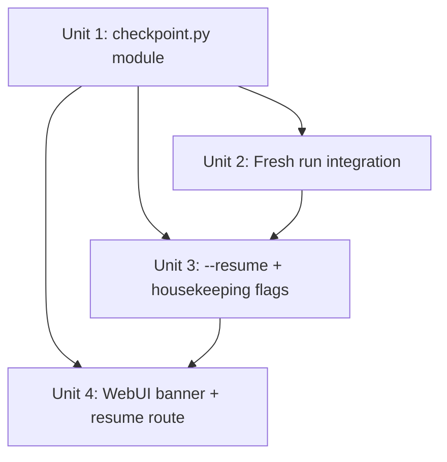

# feat: Checkpoint & Resume for Batch Pipeline

## Overview

Add crash-safe per-run checkpoint files to `publish-backlinks` so that a process killed mid-batch (crash, OOM, Ctrl+C) can be resumed without re-publishing already-completed articles. Prerequisite for #5 Bulk Input — without checkpointing, a 50-URL batch crashing at item 13 produces up to 12 duplicate live posts on Blogger and loses all remaining generation cost.

## Problem Frame

`publish-backlinks` collects all results in a list and flushes to stdout only at the end. If killed mid-batch, no state persists. The next run re-processes everything from scratch. Blogger has no server-side dedup; duplicate posts go live silently. (see origin: docs/brainstorms/2026-05-13-checkpoint-resume-requirements.md)

## Requirements Trace

- R1. On start, generate run_id and write checkpoint with all items as `pending` (after pre-flight)
- R2. After each successful publish, atomically update item to `done` with `published_url, adapter, completed_at`
- R3. After each failed publish, atomically update item to `failed` with `error, error_class`
- R4. Checkpoint file persists after completion for audit
- R5. run_id emitted to stderr on start
- R6. `--resume <run_id>`: skip `done` items, re-process `failed`+`pending`
- R7. Resume output = union of previously-done + newly-published, in original input order
- R8. On resume, apply minimum throttle: skip sleep if elapsed since last Medium `completed_at` > 300s
- R9. After resume where all items are done, mark checkpoint `complete` (written AFTER stdout flush)
- R10. `--list-runs`: print incomplete runs with counts
- R11. `--cleanup <run_id>` / `--cleanup-all`
- R12–R14. WebUI banner + resume route

## Scope Boundaries

- Only `publish-backlinks` is checkpointed; `plan-backlinks` and `validate-backlinks` are stateless
- `--dry-run` does not create or read checkpoints
- `--resume` ignores stdin — payload comes from checkpoint `item.payload` field
- Checkpoint file format is internal; no schema versioning in v1
- WebUI resume is synchronous with loading overlay; no APScheduler async path for v1
- Config drift between original run and resume is not detected — if `config.toml` changes (e.g., `blog_id` updated) after the original run, resume posts may target a different blog. Known limitation; document in README.

## Context & Research

### Relevant Code and Patterns

- **Atomic write**: `webui.py` `_save_draft_queue()` — `tmp = path.with_name(path.name + '.tmp')` → `write_text(...)` → `tmp.replace(final_path)`. Follow this exactly.
- **CLI argparse**: `publish_backlinks.py` — `main(argv)` pattern; `argparse.ArgumentParser` defined inline; `--input/-i` with `FileType("r")`; `--log-level` called immediately after `parse_args`. New flags added before `args = parser.parse_args(argv)`.
- **Per-row error handling**: `publish_backlinks.py` lines 201–218 — `ExternalServiceError` caught, appended to outputs, `fail_count += 1`, `continue`. The checkpoint per-row update mirrors this pattern.
- **run_pipe**: `webui.py` line 3354 — `subprocess.run(cmd, input=stdin, capture_output=True, text=True)`, **raises Exception on any non-zero returncode**. Resume route must capture stdout before inspecting returncode.
- **Cache dir**: `config.py` `_cache_dir()` returns path, does NOT create directories. Caller must `mkdir(parents=True, exist_ok=True)` before first write.
- **Test harness**: `test_publish_backlinks.py` `_run_publish(argv, stdin)` — replaces sys.stdio with StringIO, calls `main(argv)`, catches SystemExit. Follow this for all new publish tests.
- **Mock paths**: `@patch("backlink_publisher.cli.publish_backlinks.adapter_publish")` and `@patch("backlink_publisher.cli.publish_backlinks.time.sleep")` for Medium throttle tests. For `_cache_dir` in checkpoint tests: `@patch("backlink_publisher.checkpoint._cache_dir", return_value=tmp_path / "cache")` — patch the checkpoint module's reference, not `config._cache_dir`, since the import is at module top.
- **Logging**: `PipelineLogger.warn()` (not `.warning()`). stdout is exclusively JSONL; all diagnostics go to stderr.
- **datetime**: `datetime.now(timezone.utc)` (not `utcnow()` which is deprecated).
- **History shape**: `webui.py` `_append_history` — checkpoint is separate from `publish-history.json`.

### Institutional Learnings

- **5xx items must not be auto-retried**: `feedback_api-idempotency-lesson.md` — a 5xx response may mean the post was committed server-side before the error. Store `error_class` in the checkpoint (`"http_5xx"` vs `"transient"`) so `--resume` can warn the user instead of blindly re-submitting.
- **Full-file rewrite on each update**: `feedback_config-save-overwrite-pattern.md` — the atomic write pattern always rewrites the full JSON. Always round-trip: `load_checkpoint() → mutate item in memory → write_full_checkpoint_atomic()`. Add a round-trip test from day one.
- **Mock time.sleep** for any multi-row Medium tests: `ci-test-isolation-failures` — throttle sleep hangs CI without mocking.
- **Module-level imports for mockability**: `feedback_python-mock-datetime-patterns.md` — import `_cache_dir` at module level in `checkpoint.py` to keep mock paths predictable.
- **Loading overlay required for blocking subprocess**: `webui-blocking-subprocess` — any resume call with multiple Medium articles may take 50+ minutes. The Resume button route must show the loading overlay with an estimated time message.

## Key Technical Decisions

- **Separate `checkpoint.py` module**: All checkpoint logic (create, update, load, list, cleanup) lives in `src/backlink_publisher/checkpoint.py`. This keeps `publish_backlinks.py` focused on orchestration and makes the checkpoint logic independently testable. (see origin: checkpoint file format is internal)

- **Pre-flight before checkpoint creation**: `validate_publish_payload` + `verify_adapter_setup` runs BEFORE R1. This prevents zombie checkpoints when inputs are invalid — `--list-runs` and the WebUI banner only see truly-started runs. The original code order was validate → checkpoint, but correct order is validate → pre-flight → checkpoint → loop.

- **Checkpoint schema**: JSON root `{run_id, started_at, platform, mode, status: null|"complete", items: [...]}`. Per-item: `{id, status, title, platform, adapter?, published_url?, error?, error_class?, completed_at?, payload}` where `payload` is the full publish-ready row (the post-validate JSONL row). This makes `--resume` possible without re-running `plan-backlinks` or `validate-backlinks`. (see origin: R6 scope boundary)

- **error_class field**: Store `"http_5xx"` vs `"transient"` vs `"dependency"` vs `"unexpected"` in each failed item. `--resume` emits a warning on `http_5xx` items ("post may already be live — verify before resuming") but still re-processes them per product decision. This gives the user informed choice.

- **--resume stdin bypass**: When `args.resume` is set, short-circuit entirely before `read_jsonl(args.input)`. Rows come from `[item["payload"] for item in checkpoint["items"]]`. Empty/absent stdin is safe.

- **Union output ordering**: Emit items in original checkpoint array order regardless of which run completed them. Done items emit their stored `to_publish_output` data as-is. Newly-completed items use the current `ts`. This preserves input order without requiring timestamp rewriting.

- **R9 write order**: `write_jsonl(all_done_outputs)` → `sys.stdout.flush()` → `mark_checkpoint_complete()`. If killed between flush and mark, the banner reappears but a re-`--resume` safely re-emits all done items (no-op per success criteria).

- **R8 throttle on resume**: "last Medium completed_at" = last item by original array index whose `status == "done"` and `adapter in {"medium-api", "medium-browser"}`. Elapsed = `datetime.now(timezone.utc) - last_medium_completed_at`. If no prior Medium done item, apply full throttle interval.

- **WebUI banner: most recent incomplete run**: When multiple incomplete runs exist, banner shows the most recent by `started_at`. `--list-runs` shows all.

- **WebUI run_pipe fix for exit-4**: The existing `run_pipe` helper raises on any non-zero returncode. The Resume route must NOT use `run_pipe` unchanged. Instead, call `subprocess.run` directly and parse stdout regardless of returncode — exit-4 means partial failure (some items still failed), but stdout contains the union of done items. Show both the partial results and an error summary.

- **run_id format**: `YYYYMMDDTHHMMSS-<8hex>` using `os.urandom(4).hex()`. 8-hex gives 1/2^32 collision probability, virtually eliminating the risk noted in the requirements doc.

## Open Questions

### Resolved During Planning

- **payload type in checkpoint**: publish-ready (post-validate) rows — not raw seed URLs. Confirmed by scope boundary "does not re-run plan-backlinks or validate-backlinks."
- **R13 stdin contract**: `--resume` completely ignores stdin. `run_pipe` passes `""` as stdin; CLI detects `args.resume` and skips `read_jsonl` entirely.
- **pre-flight before or after R1**: Before. Prevents zombie checkpoints on validation failures.
- **concurrent access**: Single-user CLI; file locking not implemented in v1. Document as known limitation.
- **--cleanup-all scope**: Deletes all checkpoints with `status: "complete"` (current design). Future: add `--cleanup-older-than N` for time-based expiry.
- **R9 no-op path**: If `--resume` is called and all items are already done at load time (0 items to process), still mark checkpoint complete and emit full output. Covered by amended R9.

### Deferred to Implementation

- **APFS fsync after rename**: On macOS APFS, `Path.replace()` is POSIX-atomic but not guaranteed durable without fsyncing the parent directory. Evaluate latency cost during implementation; add optional `os.fsync(dir_fd)` behind a flag if latency is acceptable.
- **Windows tempfile behavior**: `NamedTemporaryFile` + `Path.replace()` may fail on Windows if source is still open. Verify during implementation; may need `delete=False` + explicit `close()` before `replace()`.
- **error_class detection**: Determine which exception types / HTTP status codes map to each error class during implementation, matching existing `ExternalServiceError` exception hierarchy.

## High-Level Technical Design

> *This illustrates the intended approach and is directional guidance for review, not implementation specification. The implementing agent should treat it as context, not code to reproduce.*

```
publish-backlinks (fresh run)
─────────────────────────────
stdin/file → validate_all_rows() → verify_adapter_setup() → create_checkpoint(run_id, rows)
→ emit run_id to stderr
→ for each row:
     publish() → update_checkpoint_item(id, "done"|"failed", {...})
     write result to outputs[]
→ write_jsonl(successful) → stdout.flush() → [no mark_complete for fresh runs]
→ exit(0) if all success, exit(4) if any failed


publish-backlinks --resume <run_id>
─────────────────────────────────────
load_checkpoint(run_id) → [validate all items still valid? no, trust stored payload]
→ verify_adapter_setup(platforms_in_checkpoint)
→ if all items done: emit union output → stdout.flush() → mark_complete → exit(0)
→ else: apply R8 throttle setup
→ for each pending/failed item:
     publish(item.payload) → update_checkpoint_item(id, "done"|"failed", {...})
     write result to outputs[]
→ build union: [item.to_publish_output for item in done_items] (original order)
→ write_jsonl(all_done_union) → stdout.flush()
→ if all items done: mark_complete(run_id)
→ exit(0) if all done, exit(4) if any still failed


WebUI banner
────────────
page load → scan_incomplete_runs() → most recent → inject has_incomplete_run into template
Resume click → POST /checkpoint/resume?run_id=X
→ subprocess.run(['publish-backlinks', '--resume', run_id], input='', ...)
→ parse stdout regardless of returncode
→ exit(0): show results, append history
→ exit(4): show partial results + error summary, append history
→ banner re-evaluated on next page load via checkpoint scan
```

## Implementation Units



---

- [ ] **Unit 1: checkpoint.py — data model and atomic I/O**

**Goal:** Create a standalone module with all checkpoint logic: create, load, update item status, mark complete, list incomplete runs, and delete by run_id.

**Requirements:** R1 (create), R2 (done update), R3 (failed update), R4 (persist), R9 (mark complete), R10 (list), R11 (cleanup)

**Dependencies:** None (uses only stdlib + `config._cache_dir`)

**Files:**
- Create: `src/backlink_publisher/checkpoint.py`
- Test: `tests/test_checkpoint.py`

**Approach:**
- `_checkpoint_dir()`: returns `_cache_dir() / "checkpoints"` — does NOT create directory
- `_run_id()`: `datetime.now(timezone.utc).strftime("%Y%m%dT%H%M%S") + "-" + os.urandom(4).hex()`
- `create_checkpoint(rows, platform, mode)`: creates `checkpoints/` directory with mode `0o700` (rwx------) if needed, writes full JSON with `chmod 0600` on the file itself (consistent with `save_blogger_token` pattern — checkpoint contains article content + target URLs), returns `(run_id, path)`
- `load_checkpoint(run_id)`: reads JSON, raises `FileNotFoundError` with clear message if missing
- `update_item(run_id, item_id, status, **fields)`: load → mutate → atomic write (`.tmp` sibling + `Path.replace()`)
- `mark_complete(run_id)`: load → set root `status = "complete"` → atomic write
- `list_incomplete()`: glob `checkpoints/*.json` (skip `*.tmp` orphans from interrupted writes), read each, return list of runs where any item is `pending|failed` and root status is not `complete`; sort by `started_at` descending
- `delete(run_id)`: unlink checkpoint file; raises clear error if not found
- `delete_complete()`: unlink all checkpoints where root `status == "complete"`
- Checkpoint item schema: `{id, status, title, platform, adapter, published_url, error, error_class, completed_at, payload}`
- Checkpoint root schema: `{run_id, started_at, platform, mode, status: null|"complete", items: [...]}`
- Import `_cache_dir` at **module top** (not inside functions) for mockable patch path

**Patterns to follow:**
- Atomic write: `webui.py` `_save_draft_queue()` — `tmp = path.with_name(path.name + '.tmp')` → `write_text(json.dumps(..., ensure_ascii=False, indent=2), encoding='utf-8')` → `tmp.replace(path)`
- Directory creation: `config.py` `save_blogger_token()` — `path.parent.mkdir(parents=True, exist_ok=True)`

**Test scenarios:**
- Happy path: `create_checkpoint(rows, ...)` writes file with all items `pending`, correct run_id format `YYYYMMDDTHHMMSS-<8hex>`
- Happy path: `update_item(run_id, id, "done", published_url="...", completed_at="...")` → load checkpoint → that item is `done`, all other items unchanged (round-trip integrity test)
- Happy path: `update_item(run_id, id, "failed", error="svc error", error_class="http_5xx")` → item is `failed`, error fields set
- Happy path: `mark_complete(run_id)` → root `status == "complete"`
- Happy path: `list_incomplete()` returns only runs with pending/failed items; completed runs excluded
- Happy path: `delete_complete()` removes only `status: "complete"` files, leaves incomplete ones
- Edge case: `load_checkpoint("nonexistent-id")` raises `FileNotFoundError` with run_id in message
- Edge case: `list_incomplete()` on empty checkpoints directory returns `[]`
- Edge case: `list_incomplete()` skips any `.tmp` sibling files present from interrupted writes
- Edge case: `create_checkpoint` sets file permissions to `0o600` — other users cannot read
- Edge case: `update_item` called twice on same item → second mutation applied, first mutation not present (no stale state)
- Edge case: run_id format matches regex `^\d{8}T\d{6}-[0-9a-f]{8}$`
- Integration: create → update first item done → update second item failed → load → assert first done, second failed, third pending
- Integration: create → mark_complete → list_incomplete() returns [] (complete run not listed)

**Verification:**
- All checkpoint functions pass pytest in `tests/test_checkpoint.py` using `tmp_path` fixture for isolation
- Round-trip test passes: no fields dropped on update
- `chmod 0600` applied to each created checkpoint file

---

- [ ] **Unit 2: publish_backlinks.py — fresh run checkpoint integration (R1–R5)**

**Goal:** Instrument the fresh publish run to create a checkpoint before processing, atomically update item status after each publish, and emit run_id to stderr. Pre-flight order fixed to prevent zombie checkpoints.

**Requirements:** R1, R2, R3, R4, R5

**Dependencies:** Unit 1

**Files:**
- Modify: `src/backlink_publisher/cli/publish_backlinks.py`
- Test: `tests/test_publish_backlinks.py` (extend existing)

**Approach:**
- **Pre-flight reorder**: move `validate_publish_payload` loop and `verify_adapter_setup` block to run BEFORE `create_checkpoint(rows, ...)`. Exit codes 2 and 3 remain unchanged. No checkpoint is written on pre-flight failures.
- **Checkpoint creation**: after pre-flight passes, call `checkpoint.create_checkpoint(rows, platform, mode)` → get `(run_id, path)`. `rows` at this point are the validated publish-ready payloads already in memory.
- **Emit run_id**: `print(f"publish-backlinks: run_id={run_id}", file=sys.stderr)` immediately after creation.
- **Per-row success (after `result = adapter_publish(...)` and `outputs.append(...)`)**:
  - Call `checkpoint.update_item(run_id, row.get("id"), "done", published_url=result.published_url, adapter=result.adapter, completed_at=datetime.now(timezone.utc).isoformat())`
- **Per-row failure (in ExternalServiceError and bare Exception catch blocks)**:
  - Detect error class: `"http_5xx"` if the exception message contains an HTTP 5xx pattern, else `"transient"` for connection errors, else `"unexpected"`
  - Call `checkpoint.update_item(run_id, row.get("id"), "failed", error=str(exc), error_class=error_class)`
- **Do NOT mark checkpoint complete at end of fresh run** — R9 only applies after `--resume`.
- **dry-run guard**: wrap all checkpoint calls with `if not args.dry_run`.
- **Checkpoint failure guard**: if `create_checkpoint` raises (disk full, permission denied), emit `[WARN] checkpoint not created — this run cannot be resumed: <reason>` to stderr, set `run_id = None`. All subsequent `update_item` calls must check `if run_id is not None` before executing, ensuring a failed checkpoint creation silently degrades rather than leaving partially-recorded state or crashing. A failed `update_item` mid-run should similarly log a warning and flip `run_id = None` to disable further updates.
- Stdout output path (write_jsonl) and exit code (0 or 4) unchanged.

**Patterns to follow:**
- Per-row error handling pattern: `publish_backlinks.py` lines 201–218 (existing ExternalServiceError block)
- stderr output: `publish_logger.info(...)` or `print(..., file=sys.stderr)` — never stdout

**Test scenarios:**
- Happy path: 2-row batch, both succeed → checkpoint file exists with both items `done`, run_id emitted to stderr, stdout contains 2 JSONL rows
- Happy path: checkpoint written AFTER validate/pre-flight — if `validate_publish_payload` fails (row with missing fields), no checkpoint file created
- Error path: first row fails with ExternalServiceError → first item `failed` in checkpoint, second item `done`, stdout has 1 row, exit(4)
- Error path: `verify_adapter_setup` fails (DependencyError) → exit(3), no checkpoint file created
- Edge case: `--dry-run` flag → no checkpoint file created, stdout output identical to current behavior
- Edge case: `create_checkpoint` raises `OSError` (patched) → publish run still completes, stdout produced, exits 0 or 4 (no uncaught exception)
- Integration: run main with 3 rows using mocked `adapter_publish` that returns success for first two and raises on third → checkpoint has 2 done, 1 failed

**Verification:**
- All existing `test_publish_backlinks.py` tests continue to pass (no regression)
- New tests pass with `tmp_path`-backed `_cache_dir` mock via `@patch("backlink_publisher.checkpoint._cache_dir")`
- Exit codes are unchanged from current behavior

---

- [ ] **Unit 3: publish_backlinks.py — --resume, --list-runs, --cleanup flags (R6–R11)**

**Goal:** Add `--resume <run_id>`, `--list-runs`, `--cleanup <run_id>`, and `--cleanup-all` flags. `--resume` loads the checkpoint, skips done items, processes failed+pending items, and emits the union output in original input order.

**Requirements:** R6, R7, R8, R9, R10, R11

**Dependencies:** Units 1 and 2 (for the shared argparse function and checkpoint module)

**Files:**
- Modify: `src/backlink_publisher/cli/publish_backlinks.py`
- Test: `tests/test_publish_backlinks.py` (extend), or `tests/test_publish_backlinks_resume.py` (new file)

**Approach:**

*Argparse additions* (in `main()` before `parse_args`):
- `--resume RUN_ID`: resume from checkpoint
- `--list-runs`: print incomplete runs and exit
- `--cleanup RUN_ID`: delete specific checkpoint and exit
- `--cleanup-all`: delete all complete checkpoints and exit

*Mutual exclusion check* (manual, after `parse_args`): if more than one of `--resume`, `--list-runs`, `--cleanup`, `--cleanup-all` is set, emit error and exit(2).

*`--list-runs` path*:
- Call `checkpoint.list_incomplete()`, format as human-readable table to stdout, exit(0). No JSONL output.

*`--cleanup` / `--cleanup-all` path*:
- Call `checkpoint.delete(run_id)` or `checkpoint.delete_complete()`, print confirmation to stdout, exit(0).

*`--resume` path* (short-circuit before `read_jsonl`):
1. Load checkpoint: `ckpt = checkpoint.load_checkpoint(args.resume)` — exit(2) with clear message if not found
2. Run `verify_adapter_setup` for platforms in checkpoint (same pre-flight as fresh run)
3. Filter: `to_process = [item for item in ckpt["items"] if item["status"] in ("pending", "failed")]`
4. Warn on `http_5xx` items: `print(f"WARNING: item {id} failed with HTTP 5xx — post may already be live on {platform}. Verify before resuming.", file=sys.stderr)`
5. If no items to process (all done): build union output → write_jsonl → stdout.flush() → mark_complete → exit(0)
6. **R8 throttle setup**: find last Medium done item by original array position → compute `elapsed = datetime.now(tz) - last_medium_completed_at_parsed`. Store as `resume_last_medium_ts` for use in throttle check.
7. **Process loop**: for each `to_process` item, rebuild `row` from `item["payload"]`, run existing publish logic (adapter_publish, error handling). Throttle: before first Medium item, apply sleep only if `elapsed < 300` (using `resume_last_medium_ts`; fall back to full throttle if no prior Medium done).
8. After loop: build union — `all_outputs = [item_to_publish_output(item) for item in ckpt["items"]]` in original array order
9. write_jsonl(all_outputs) → sys.stdout.flush()
10. If all items now done: mark_complete(run_id)
11. exit(0) if no failures, exit(4) if any item still failed

*`item_to_publish_output(checkpoint_item)`*: helper function that converts a checkpoint item into the same dict shape as `result.to_publish_output(row, ts)`. Done items use stored data; this function is only called for done items in the union. **Field mapping**: checkpoint uses `completed_at`; output shape requires `created_at` — map explicitly: `{"id": ..., "platform": ..., "status": ..., "title": ..., "draft_url": ..., "published_url": ..., "created_at": item["completed_at"], "adapter": ..., "error": None}`. All 9 required fields must be present.

**Patterns to follow:**
- Throttle logic: `publish_backlinks.py` lines 128–138 (existing Medium throttle block) — mirror this pattern for resume throttle
- Exit code conventions: unchanged

**Test scenarios:**
- Happy path: `--resume <id>` with 3-row checkpoint (1 done, 1 failed, 1 pending) → skips done, processes failed+pending, emits 3-row union in original order, exit(0) if all pass
- Happy path: `--resume` all-done checkpoint → emits union of 3 done rows, marks complete, exit(0), no adapter calls made
- Happy path: `--list-runs` with 2 incomplete runs → stdout shows both runs with counts, exit(0)
- Happy path: `--cleanup <run_id>` → checkpoint file deleted, exit(0)
- Happy path: `--cleanup-all` → only complete checkpoints deleted, incomplete ones remain
- Error path: `--resume nonexistent-id` → exit(2) with message "checkpoint not found: nonexistent-id"
- Error path: resume with 1 item still failing → exit(4), stdout contains all done items (union) including previously-done
- Edge case: resume where first-to-process item is Medium and last Medium done was 200s ago → sleep is applied
- Edge case: resume where last Medium done was 400s ago → no sleep applied
- Edge case: resume where checkpoint has only Blogger done items and first pending item is Medium → full throttle applied (no prior Medium done fallback)
- Edge case: `http_5xx` failed item → warning on stderr AND `adapter_publish` still called (item not skipped)
- Edge case: `--resume` with empty stdin `""` passed → completes successfully without reading stdin, exit(0)
- Edge case: `--resume X --list-runs` together → exit(2), mutual exclusion error
- Edge case: `--cleanup nonexistent-id` → exit(2) with clear message
- Edge case: `--cleanup-all` when no complete checkpoints exist → exit(0), no error
- Edge case: union output with non-sequential completion order (items 0 and 2 done from prior run, item 1 newly done in resume) → output order is [item 0, item 1, item 2] matching original input order
- Edge case: `item_to_publish_output` produces all 9 required fields (`id, platform, status, title, draft_url, published_url, created_at, adapter, error`)
- Error path: resume with 1 item still failing → exit(4), **stdout is non-empty** (contains union of done items)
- Error path: `verify_adapter_setup` raises `DependencyError` on resume → exit(3), no adapter calls, checkpoint unchanged
- Integration: Unit 2 fresh run (3 items, raise on item 2) → `--resume` skips items 0+1, processes item 2 → `checkpoint.list_incomplete()` returns `[]` → WebUI banner absent
- Integration: create checkpoint via Unit 2's main(), kill mid-batch by raising after item 2, then `--resume` → confirms items 1+2 are skipped, item 3 reprocessed

**Verification:**
- `--list-runs` output is human-readable, exit(0)
- Union output is valid JSONL matching fresh-run format
- `--resume` on fully-done checkpoint is a safe no-op (no adapter calls, exit 0, full output)
- `time.sleep` must be mocked in all test scenarios that process Medium items (scenarios: throttle applied, throttle skipped, no-prior-Medium fallback)

---

- [ ] **Unit 4: webui.py — banner + resume route (R12–R14, P0 fix)**

**Goal:** Show a dismissible banner on page load when an incomplete run exists. Add a Resume button that calls `publish-backlinks --resume <run_id>` and displays results. Fix the P0 issue: WebUI must parse stdout even when exit code is 4 (partial failure resume).

**Requirements:** R12, R13, R14; resolves P0 (run_pipe raises on exit-4)

**Dependencies:** Units 1 and 3 (checkpoint module + --resume flag must exist)

**Files:**
- Modify: `webui.py`
- Test: `tests/test_webui_checkpoint.py` (new) or extend existing webui tests

**Approach:**

*Banner data function* `_load_incomplete_run()`:
- Call `checkpoint.list_incomplete()` (returns list sorted by `started_at` desc)
- Return the most recent entry (index 0), or `None` if empty
- Called in `_render(template, **kwargs)` alongside `_load_history()` — inject as `incomplete_run=_load_incomplete_run()` into all template renders

*Template banner* (in the HTML template, above the main form):
- Conditionally render a Bootstrap `alert-warning` dismissible div when `incomplete_run` is set
- Text: `"Unfinished run from [incomplete_run.started_at] — N articles pending/failed. [Resume]"`
- Resume button: `POST /checkpoint/resume` with `run_id` as form field
- Dismiss button: `POST /checkpoint/dismiss` with `run_id` (calls `checkpoint.delete(run_id)`)

*New route `/checkpoint/resume`* (POST):
- Extract `run_id` from form
- Build cmd: `['publish-backlinks', '--resume', run_id]`
- Use `subprocess.run(cmd, input='', capture_output=True, text=True, cwd=...)` directly — **NOT** the existing `run_pipe` helper (which throws on exit-4)
- Parse `result.stdout` regardless of `result.returncode` using `_parse_publish_results(result.stdout)`
- If `result.returncode == 0`: append to history as `status: "published"`
- If `result.returncode == 4`: append to history as `status: "failed_partial"` with `stderr_summary` field; show both results and error summary
- If `result.returncode == 2` or `3`: show error message, do not append to history
- Apply the loading overlay with message `"恢复发布中… (可能需要数分钟)"` — add `/checkpoint/resume` to the routes that trigger the loading spinner in the frontend JS

*New route `/checkpoint/dismiss`* (POST):
- Call `checkpoint.delete(run_id)`, redirect to `/`

*Performance guard for banner scan*: `_load_incomplete_run()` reads only the first glob match's JSON. If the glob returns more than 20 files, read only the 20 most-recently-modified to bound page-load time.

**Patterns to follow:**
- Loading overlay: existing `/ce:publish` route JS handling — add `/checkpoint/resume` to the `MSGS` map in webui's loading overlay JS
- History append: existing `_append_history(item)` pattern

**Test scenarios:**
- Happy path: `_load_incomplete_run()` returns most recent incomplete run when checkpoints exist
- Happy path: `_load_incomplete_run()` returns `None` when no incomplete runs
- Happy path: resume route with exit(0) → history entry created, results shown
- Error path: resume route with exit(4) partial failure → stdout parsed, partial results shown alongside error summary
- Error path: resume route with exit(2) (bad run_id) → error message shown, no history entry
- Integration: page load with incomplete checkpoint → banner renders; after successful resume → banner absent on next load
- Integration: `run_pipe` is NOT called during resume route — assert only `subprocess.run` is invoked (guards against future refactor routing through `run_pipe` and breaking exit-4 handling)
- Edge case: `_load_incomplete_run()` with 21 checkpoint files → only 20 most-recently-modified are read; no full-directory scan

**Verification:**
- Banner appears within one page load of an incomplete run existing
- Resume button triggers `--resume` subprocess, not a fresh batch
- Partial success (exit-4) shows results rather than only an error
- Loading overlay shown during resume execution

---

## System-Wide Impact

- **Interaction graph:** `publish_backlinks.py` main() gains 4 new code paths (`--resume`, `--list-runs`, `--cleanup`, `--cleanup-all`). webui.py gains 2 new routes. `checkpoint.py` is a new module with no cross-cutting dependencies.
- **Error propagation:** Checkpoint failures (disk full, permission denied on `~/.cache/`) should NOT abort the publish run — log to stderr and continue without checkpointing. This avoids checkpoint infrastructure silently blocking core functionality.
- **State lifecycle risks:** If `--resume` is called while the original run is still in progress, two processes write to the same checkpoint file. `Path.replace()` is atomic but the second reader may see a stale snapshot and re-publish an in-flight item. Document as a known single-user limitation; do not add file locking in v1.
- **API surface parity:** `--dry-run` must explicitly skip all checkpoint operations. The `--list-runs`, `--cleanup`, `--cleanup-all` paths produce human-readable output to stdout (not JSONL) — downstream pipelines should not pipe these commands.
- **Integration coverage:** The critical cross-layer flow is: `publish_backlinks.main()` writes checkpoint → process killed → `--resume` re-reads checkpoint → WebUI resume button triggers `--resume` → WebUI parses union stdout. An integration test spanning Units 2+3 (kill simulation via exception injection after item 2) is required.
- **Unchanged invariants:** Stdout remains exclusively JSONL. Exit codes 0/2/3/4/5 are unchanged for the fresh run path. `publish-history.json` remains the persistent audit log; checkpoints are transient state.

## Risks & Dependencies

| Risk | Mitigation |
|------|------------|
| Checkpoint write failure (disk full, permissions) logs but does not abort publish | `run_id = None` guard pattern (Unit 2 approach) — all subsequent `update_item` calls are skipped when `run_id is None`; user sees `[WARN] checkpoint not created` on stderr and can re-run normally |
| Checkpoint write amplification at large batch sizes | 50-article batch with 256 KB payloads ≈ 12.8 MB checkpoint file; 50 full rewrites = 640 MB disk writes. Acceptable for v1 target batch size (≤50 articles); note this in README. |
| http_5xx item re-published as duplicate on `--resume` | `error_class: "http_5xx"` warning emitted to stderr; user must verify. Adapter retry (PR #1) already exhausted retries before marking failed. |
| run_id collision (1/2^32 probability) | Second process overwrites first checkpoint. Document as known limitation; accept for single-user CLI. |
| Checkpoint dir accumulation with no auto-expiry | `--cleanup-all` removes complete checkpoints; incomplete ones require `--cleanup <run_id>`. Future: add `--cleanup-older-than N`. |
| WebUI resume blocking for 50+ minutes (10 Medium articles) | Loading overlay shown; no server-side timeout changes needed for v1. Flask dev server default is no timeout. |

## Documentation / Operational Notes

- Update `README.md` with `publish-backlinks --list-runs`, `--cleanup`, `--resume <run_id>` examples
- Checkpoint files live at `~/.cache/backlink-publisher/checkpoints/<run_id>.json`
- `publish-history.json` remains the post-run audit log; checkpoints are mid-run state

## Sources & References

- **Origin document:** [docs/brainstorms/2026-05-13-checkpoint-resume-requirements.md](docs/brainstorms/2026-05-13-checkpoint-resume-requirements.md)
- Related code: `src/backlink_publisher/cli/publish_backlinks.py` — main CLI
- Related code: `webui.py` lines 2420–2453 (`_parse_publish_results`, `_append_history`), lines 3354–3365 (`run_pipe`)
- Related code: `webui.py` `_save_draft_queue()` — atomic write pattern to follow
- Related code: `src/backlink_publisher/config.py` lines 38–43 (`_cache_dir`)
- Related PRs: PR #1 (adapter retry), PR #4 (OAuth preflight) — both already merged
