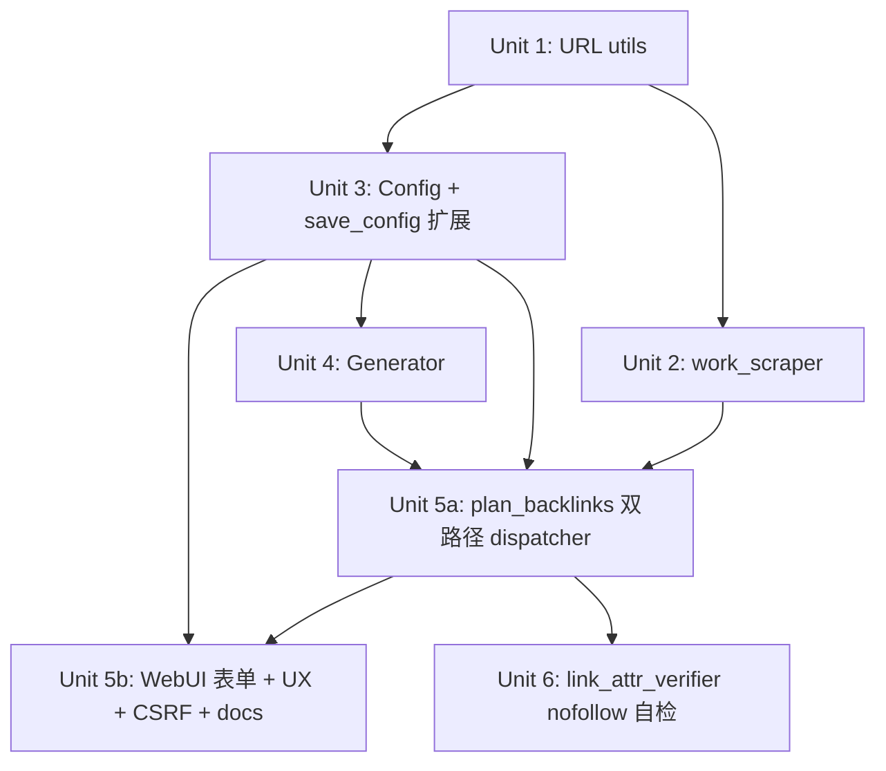

# 三连结作品主题外链（Work-Themed Backlinks）

## Overview

新增 WebUI 表单 + 配套 pipeline 分支：用户输入 3 个 URL（主域名 / 列表页 / 作品页），系统抓取作品页 HTML（title/meta/H1）作为主题信号，生成每篇恰好 3 条外链的短文，3 条链接分别指向 3 个 URL 且**位置在文中随机排布**，统一渲染为 raw HTML `<a target="_blank" rel="noopener">`。anchor 类型由 URL 位置定型（主域→branded、列表→partial/exact、作品→title 模板）。

**双路径 dispatcher**：`[targets."<domain>"]` 三连结配置 → 走新 work-themed；`[sites."<domain>"]` 旧配置 → **保活** 走 legacy zh-CN short-form；都没有 → long-form。**不**强制下线 `_scheduler_enabled_for`，老用户「品牌/分类/topic」场景持续可用。Plan 的 v1.1+ 阶段再评估是否删除 legacy。

## Problem Frame

现有 zh-CN 短文路径围绕「per-site 多 url_categories（home/hot/animate/category/topic）+ 每 cell 预置 anchor_pools」生成 2-3 条链接的短文，叙事偏「站点综合介绍」、配置入口重、运营需要预先维护 20 个 (url_category × anchor_type) 单元格的 anchor pool。

实际投放场景中，运营更想为某个具体作品做主题导流；文章应围绕作品本身，链接同时把读者引向作品页（最终落点）、列表页（同类发现）、主域名（品牌承接）。新形态把输入压缩到「3 个 URL + 可选作品清单」，生成形态固定化，删掉 scheduler 复杂度。（see origin: `docs/brainstorms/2026-05-13-work-themed-backlinks-requirements.md`）

## Requirements Trace

### 输入 & 配置（R1-R4）
- **R1-R4**：WebUI 三字段表单 / config.toml 双轨；URL 校验（https + 主域根路径）；`work_urls` 留空时从 `list_url` 抓取。

### 主题抓取（R5-R6）
- **R5-R6**：HTTP GET 抓 `<title>` → `<meta description>` → `<h1>` 抽取主题；失败跳过单个 URL，不中断整批。

### 链接结构 & HTML 输出（R7-R9、R16）
- **R7-R9**：每篇 3 条外链固定；raw HTML `<a target="_blank" rel="noopener">`；**3 个 anchor 在正文中的出现位置随机化**（不固定主域首/作品末），降低跨文章结构指纹。
- **R16**：raw `<a>` 在 markdown-it 中作为 HTML block 原样透传，与现有 `link_attr_verifier` 期望（`target="_blank"` + `rel` 含 `noopener`）一致；**verifier 同步扩展**：检测 `nofollow` 未被发布平台（特别是 Medium）注入。

### Anchor 选择（R10-R13）
- **R10-R13**：主域走 `branded` pool、列表走 `partial+exact` pool、作品用抓取 title + 模板；通用安全校验沿用 `_passes_filters` 思路但作品 anchor 使用放宽变体。

### SEO 分布（R14-R15）
- **R14-R15**：URL 位置定型，移除 sliding-window scheduler 与 20-cell pool sizing 校验。

### 双路径共存（R17）
- **R17**：旧 `[sites."<domain>"].url_categories|anchor_pools` 块**保活**运行——`_scheduler_enabled_for` 不强制 False，老用户场景持续工作。仅启动时 emit INFO 提示「该 schema 处于 maintenance 模式，建议未来迁移到 work-themed」。是否真删除留给后续 release 数据驱动决定。

## Scope Boundaries

- **不**删除 legacy zh-CN short-form 路径的运行时调用——`_scheduler_enabled_for` 保留原判断逻辑。Unit 6 **不** mark skip 旧 scheduler 测试套件（test_anchor_scheduler.py / test_anchor_profile.py / test_config_example_pool.py / test_plan_backlinks_zh_scheduler.py / test_short_article_renderer.py / test_validate_zh_short_payload.py 全部继续 live）。
- **不**引入运行时 LLM 抽取作品主题（保持 LLM-free 立场）。
- **不**做正文 LLM 改写——本计划只换「输入形态 + 链接结构 + anchor 来源」，正文模板沿用现有短文模板风格（必要时新增 2-3 个固定模板，不引入 LLM）。
- **不**实现 robots.txt 解析（运营自有的目标站点；失败即跳过）。
- **不**进 MVP 的 scrape cache 层（推后到 v1.1，看实际重复抓取痛点决定）。
- **不**变更现有 long-form en/ru 路径。
- **不**实现多进程并发锁——`anchor_profile` 也只有进程内 `threading.Lock`；约束 WebUI 与 CLI 不应同 domain 并发；多进程兜底锁（fcntl.flock）作为未来工作。

## Context & Research

### Relevant Code and Patterns

- **WebUI（Flask 单体）**：`webui.py` 3945 行单文件，模板内嵌为 `HTML`（line 39）与 `SETTINGS_HTML`（line 1564）。现有抓取助手 `fetch_url_metadata` (line 2289) 与 `fetch_full_tdk` (line 2332) 已用 `requests.get(timeout=10/15, verify=False)` + BeautifulSoup 抽取 `og:title`/`<title>`/meta description——可直接复用并补 H1 抽取。
- **Pipeline 入口**：`src/backlink_publisher/cli/plan_backlinks.py` dispatcher 在 line 980-988；zh-CN short-form 入口 `_plan_zh_short_row` (line 654-839)；`_scheduler_enabled_for` (line 522-529) 是「走旧路径」判定点——新逻辑应在该判定之前优先识别「三连结」配置形态。
- **Anchor 文字渲染**：`markdown_utils._format_anchor_html` (line 234-249) 已经产出 `<a target="_blank" rel="noopener noreferrer" href="...">{anchor}</a>`——新形态可直接复用，仅需要求 `rel` 参数化（去 `noreferrer` 保留 `noopener`）。
- **Markdown-it 行为**：`markdown_utils.render_to_html` 对 raw HTML 块原样透传（已被 zh-CN short-form 路径在生产中验证）。
- **Config TOML 解析**：`config.py` 使用 stdlib `tomllib`，每 section 一个 `_parse_*` 容错解析器（malformed entry 仅 `_log.warning` 不 raise）。`get_anchor_keywords` (line 523-542) 已经做 scheme/trailing-slash 容错——新 `get_three_url_config` 应遵循同样模式。
- **`save_config` 风险（重要）**：`config.py:572-660` 全文重写式 save；仅显式 round-trip `[blogger][blogger.oauth][medium][targets]`，其他 section 被**静默丢弃**。新增 `[targets."<domain>"].main_url|list_url|work_urls|*_pool|work_anchor_templates` 字段必须扩展 save_config 写入器并加 round-trip 测试。
- **Anchor 安全校验**：`anchor_resolver._passes_filters` (line 137-158) 要求 2-8 char + ≥50% CJK + 非 FORBIDDEN + 无 unsafe char——CJK gate 对动态作品 title anchor 过严，需要新建 `_passes_work_anchor_filter` 放宽变体（保留 unsafe char 拒绝、扩大长度上限到 30、移除 CJK 比例要求）。
- **Retry 工具**：`adapters/retry.py:retry_transient_call` 已有指数退避；新 scraper 仅需复用（注意仅重试连接错误 + 429，**不重试 5xx**——institutional learning `feedback_api-idempotency-lesson.md`）。
- **`anchor_profile` dedup**：`anchor_profile.py` 维护 sliding window `recent_texts`——新流程仍需要去重作品 anchor（避免连续 3 篇同 title），可复用其 `recent_texts` 检查 + record API。
- **MSGS 加载覆层**：`webui.py` 现有 `MSGS` 路由→中文加载提示映射，长耗时操作（抓取列表页）需要新增条目避免 UI 卡死无反馈。

### Institutional Learnings

- `docs/solutions/...config-save-overwrite-pattern.md` 等价于 memory `feedback_config-save-overwrite-pattern.md`：save_config 静默吞 section——任何新 config 字段都要补 round-trip 测试。
- `feedback_api-idempotency-lesson.md`：HTTP 抓取**不要**对 5xx 重试，仅 429 / 连接错误重试。
- `feedback_test-autouse-verify-mock.md`：任何新增 HTTP 调用都要在所有相关测试文件加 autouse fixture mock；否则全测试 timeout。
- `feedback_python-mock-datetime-patterns.md`：mock 路径用「调用方模块」（如 `backlink_publisher.work_scraper.requests.get`），`PipelineLogger.warn`（非 `.warning`），`datetime.now(timezone.utc)` 替代 `utcnow()`。
- `feedback_jinja2-banner-text-collision.md`：WebUI 表单测试断言用 `action="/路由"` 或 hidden input name，不要直接断言中文 label。
- `feedback_macos-adapter-test-isolation.md`：本计划不动 Medium 适配器，但任何引入的 `time.sleep` 都要 mock（如 scraper 节流）。
- `feedback_cereview-finds-latent-bugs.md`：HTML 抓取 + raw HTML 注入 + 用户输入三联——合并前预算 `/ce:review` autofix 一轮，重点审 XML/HTML entity escaping。

### External References

未引入外部研究——本地模式与制度学习已覆盖所有关键决策（HTTP scraping、Flask form、BeautifulSoup、Jinja2 表单、markdown-it、config TOML 模式皆为既有 pattern）。

## Key Technical Decisions

- **双路径 dispatcher 并存**：targets.x 三连结 → work-themed 新路径；sites.x → legacy zh-CN short-form 走原 scheduler；都没 → long-form。`_scheduler_enabled_for` 不动。理由：「替换」属于工程师便利，「保活」保护既有「品牌/分类/topic」运营场景；删除决策推迟到实际使用数据出来。
- **作品页主题来源 = HTML 抓取（title/meta/h1）**：抽到 `src/backlink_publisher/work_scraper.py`。复用 `adapters/retry.py:retry_transient_call`，**只重试连接错误 + 429**（不重试 5xx，institutional learning）。
- **HTTP 抓取安全基线**：默认 `verify=True`；DNS resolve 后过滤私有/loopback/metadata IP（10/8、172.16/12、192.168/16、169.254/16、127/8、::1、fc00::/7、fe80::/10）；max-bytes 上限 2MB（Content-Length 预检 + 累计 streaming 计数）；自定义 UA。per-target opt-in 字段 `insecure_tls = true` 允许对运营信任的破证书站放行（默认关闭）。**不**沿用 webui helper 的 `verify=False`——那里是 dev preview，这里是 CLI 生产路径。
- **list 页作品 URL 提取**：sitemap.xml 优先（`list_url` 主机的 `/sitemap.xml`、`/sitemap_index.xml` 尝试）；失败 fallback 到 list_url HTML BeautifulSoup `<a href>` 抓取 + 同 host + **反向 path 过滤**（排除 path 命中 `/tag/`、`/category/`、`/page/`、`/author/`、`/about`、`/contact`、`/search`、`/feed`、`#`、`mailto:` 等明显非作品页面的链接，正则集合通过 config override）。harvested URL 截断到 `max_candidates=50` 上限再交给 count 截断。
- **链接位置随机化**：每篇 3 条 anchor 在正文段落中的出现顺序由 seed 哈希排列（不再总是「主域首段、作品末段」），降低跨文章结构指纹。
- **`rel="noopener"`（dofollow）+ Medium nofollow 自检**：anchor 渲染保持 dofollow（与现有 `markdown_utils.py:37-40`、PR #2026-05-12-007 R6 一致）；**同时扩展** `link_attr_verifier` 增加「nofollow 未被注入」断言，让运营能尽早发现 Medium 平台自带 nofollow 化导致权重传递为 0 的问题。
- **作品 anchor 走「title + 模板」+ 放宽过滤器（字符表显式枚举）**：新 `_passes_work_anchor_filter` 接受 unescape 文本，长度 2-30、禁字符显式枚举：(a) `_UNSAFE_IN_ANCHOR` 既有正则；(b) C0/C1 控制字符 (`\x00-\x1F`、`\x7F-\x9F`)；(c) 零宽字符 (`U+200B`-`U+200D`、`U+FEFF`)；(d) bidi 控制 (`U+202A`-`U+202E`、`U+2066`-`U+2069`)；(e) fullwidth ASCII (`U+FF00`-`U+FFEF`) 中的 `< > & " '`；(f) FORBIDDEN_ANCHOR_TEXTS。HTML-escape 由调用方在 `_format_anchor_html` 前显式做。
- **三连结配置挂在 `[targets."<domain>"]`**：扩展 schema，但**严肃对待 save_config 现实**——`save_config` 当前**仅** round-trip `anchor_keywords`，其他 `[targets.*]` 字段同样会被静默丢弃。Unit 3 必须 (i) 扩展 `save_config` 签名加 `target_three_url` kwarg，(ii) audit 所有 caller（webui.py:3216/3651/3661/3692/3780/3785/3834/3859）使其不丢字段，(iii) round-trip 断言所有新字段在 `save→load→save→load` 后保留，(iv) 同时验证 `[blogger.oauth]` 在新路由调用后仍存活（防 credential 丢失）。
- **scrape cache 推后到 v1.1**：MVP **不**实现 JSONL 缓存层、TTL、锁文件。`fetch_work_metadata` 仅作为纯函数封装 HTTP + 解析。10 URL × 10s = 100s/run 手动场景可接受。
- **scraper 失败语义二分（重命名 fail-open → fail-continue）**：
  - **fail-continue（per URL）**：work_url 单次抓取的网络/解析异常 → `plan_logger.warn(...)` + 该 URL 跳过 + 整批续跑。
  - **fail-abort（list_url 整批）**：list_url 的网络/解析**异常** → raise `ExternalServiceError` exit 4。
  - **fail-empty（list_url HTTP 200 但 0 个候选）**：HTTP 200 抓回 0 个合规候选 → `plan_logger.warn(...)` + 空返回（不抛错）。运营可在 WebUI 看到「0 articles generated」结果页。
- **作品 anchor dedup 调用方现实化**：`anchor_profile.is_recent_text(...)` **不存在**。改为 `recent = anchor_profile.recent_texts(load_profile(domain), n=20); if anchor_text in recent: ...` 调用方做 membership check。`record_article` 也要构造 `ProfileEntry`（用占位 `anchor_type='work'`、`url_category='work_themed'` 等新枚举值），不是单纯传字符串。
- **WebUI 安全立场**：启动断言 bind 仅 loopback（127.0.0.1 / ::1），非 loopback 必须设环境变量 `BACKLINK_PUBLISHER_ALLOW_NETWORK=1` 显式 opt-in。所有 mutating POST 路由（`/sites/save-three-url`、`/sites/run`）加 CSRF token（Flask `secrets.token_urlsafe` + session 校验，零外部依赖）。
- **list_url 与 work_urls 不强制同域**：仅 main_url 强制 https + 根路径，list/work URL 仅强制 https；都同时受 SSRF IP 过滤保护。
- **count 入口单一化**：删除 `[targets.*].batch_size` 配置字段；count 仅来自 WebUI 表单或 CLI 参数（默认 10）。避免双重 source-of-truth。

## Open Questions

### Resolved During Planning

- **HTTP 客户端**：复用 `requests` + `adapters/retry.py`（不引入 `httpx`）。
- **列表页作品 URL 提取**：sitemap.xml 优先（试 `/sitemap.xml` 与 `/sitemap_index.xml`），失败 fallback 到 list 页 HTML `<a href>` 抓取 + 同 host + 反向 path 过滤（明确排除集合见 Key Technical Decisions）。
- **dispatcher 形态**：双路径保留（targets.x → work-themed；sites.x → legacy；都没 → long-form），不强制下线 legacy。
- **`<a target=_blank>` 在 publish 链路保留性**：现有 `link_attr_verifier` 已断言 Blogger 端 `target="_blank"` + `rel` 含 `noopener` 留存；Unit 4 同步扩展 verifier 加「nofollow 未被注入」断言。
- **三连结字段挂载位置**：扩展 `[targets."<domain>"]` table，并显式扩展 `save_config` 签名 + audit 所有现有 caller。
- **list/exact 混合比率默认值**：partial 70% / exact 30%（可在 `[anchor.proportions.work_themed]` override）。
- **批量数量入口**：仅 WebUI 表单字段 `count`（默认 10）/ CLI 参数；**删除** config `batch_size` 重复字段。
- **scrape cache**：MVP 不做，推后 v1.1。
- **scraper 失败语义**：三态 fail-continue / fail-abort / fail-empty（见 Key Technical Decisions）。
- **anchor_profile dedup API**：调用方 `recent_texts(profile, n) → list`，本地做 membership check；`record_article` 构造 `ProfileEntry` 占位字段。
- **HTTP 安全基线**：verify=True 默认 + IP 过滤 + max-bytes 2MB；per-target `insecure_tls=true` opt-in。
- **WebUI bind 与 CSRF**：loopback-only 默认 + CSRF token；非 loopback 必须 env opt-in。

### Deferred to Implementation

- 作品 anchor 模板的最终默认集合（候选：`{title}`、`{title} 详情`、`{title} 推荐`、`{title} 介绍`）——实现时按 dedup 命中率调优。
- scrape_cache.jsonl 跨进程并发锁策略——`anchor_profile.py` 自身也只有进程内 `threading.Lock`，本计划同步约束「WebUI 与 CLI batch 不并发」；若未来需要多进程并发，新增 fcntl.flock sidecar 锁文件（与 `anchor_profile.py:13-16` 标注的兜底路径一致）。
- `_passes_work_anchor_filter` 长度上限具体值（30? 40? 由实际抓到的 title 分布决定）。
- WebUI `/sites/scrape-preview` 是否需要（作为「填完作品 URL 前先看一眼 title」UX）——可在 MVP 后补。
- 旧 `[sites.*]` parser 何时彻底删除——下个 release 时确定。
- 若 list 页抓到的作品 URL 数远超 `count`，是否轮询轮换 vs 单批次完成——首版按 `count` 截断；多批次轮换 follow-up。

## High-Level Technical Design

> *This illustrates the intended approach and is directional guidance for review, not implementation specification. The implementing agent should treat it as context, not code to reproduce.*

```
                       WebUI 表单                  config.toml
                        │                              │
                        ▼                              ▼
            ┌──────────────────────────────────────────────┐
            │  three_url_config: {main_url, list_url,      │
            │   work_urls?, branded_pool, partial_pool,    │
            │   exact_pool, work_anchor_templates, count}  │
            └──────────────────────────┬───────────────────┘
                                       │
                                       ▼
            ┌──────────────────────────────────────────────┐
            │  work_scraper                                 │
            │   ├─ if work_urls empty:                      │
            │   │    fetch_work_urls_from_list(list_url)    │
            │   │  (cache 命中跳过)                          │
            │   └─ for each work_url:                       │
            │        fetch_work_metadata(url)               │
            │        -> {title, description, h1}            │
            └──────────────────────────┬───────────────────┘
                                       │
                                       ▼
            ┌──────────────────────────────────────────────┐
            │  work_themed_generator (per work_url):        │
            │   pick_anchors():                             │
            │     main_anchor   ← branded_pool             │
            │     list_anchor   ← partial∪exact (70/30)    │
            │     work_anchor   ← template(scraped_title)  │
            │       └─ _passes_work_anchor_filter() 过滤   │
            │   render_article(three anchors):              │
            │     -> content_markdown (含 raw <a>)          │
            └──────────────────────────┬───────────────────┘
                                       │
                                       ▼
                            existing plan→validate→publish
                            (link_attr_verifier 保护 target/_blank)
```

### Dependency Graph



## Implementation Units

- [x] **Unit 1: URL utility module** ✅ shipped 2026-05-13 (commit c64ad4e)

**Goal:** 提供共享 URL 校验工具，给 form / config parser / scraper 共用。

**Requirements:** R2（URL 格式校验）

**Dependencies:** None

**Files:**
- Create: `src/backlink_publisher/url_utils.py`
- Test: `tests/test_url_utils.py`

**Approach:**
- 暴露 `validate_main_domain_url(url) -> str | None`（必须 https://、必须 host-root + 单一尾斜杠；返回 normalized 或 error message）。
- 暴露 `validate_https_url(url) -> str | None`（仅 https，不限制路径；用于 list_url 与 work_url）。
- 暴露 `is_same_host(a, b) -> bool`、`absolutize(base, href) -> str`、`strip_fragment_query(url) -> str` 工具，供 scraper 与 generator 复用。
- 不引入第三方依赖（用 stdlib `urllib.parse`）。

**Patterns to follow:**
- `config.py:_normalize_domain_key` (line 490-492) 的 scheme/slash 规范化习惯。

**Test scenarios:**
- Happy path: `https://site.com/` → returned normalized；`https://site.com` → 自动补尾斜杠返回。
- Edge case: `http://...` 被拒、`https://site.com/path/` 在 main_url 上下文被拒、空字符串/None 被拒。
- Error path: 含 fragment/query 的 main_url 被拒。
- Happy path: `absolutize("https://site.com/list", "/work/1")` → `https://site.com/work/1`。
- Edge case: `is_same_host` 在 www-prefix / 大小写 / 不同端口情形的预期行为（首版：忽略 www、忽略大小写、严格端口）。

**Verification:**
- 所有新 unit/feature 工作中 URL 处理仅通过此模块，没有散落的 `re.match(r"^https?://", ...)` 新增。

---

- [x] **Unit 2: Work-page scraper module (无 cache, 安全基线)** ✅ shipped 2026-05-13

**Goal:** 提供 work_url 元数据抓取 + list 页作品 URL 提取（sitemap 优先），带 fail-continue/fail-abort/fail-empty 三态语义与 SSRF/TLS 安全防护。

**Requirements:** R3（list 页 fallback）、R5、R6（HTML 抓取 title/meta/H1；fail-continue per URL 不中断批次）

**Dependencies:** Unit 1

**Files:**
- Create: `src/backlink_publisher/work_scraper.py`
- Test: `tests/test_work_scraper.py`

**Approach:**
- `fetch_work_metadata(url, *, timeout=10) -> WorkMetadata | None`：纯函数，无 cache 层。HTTP GET + BeautifulSoup 抽取 `<title>` / `<meta name="description">` / 首个 `<h1>`，独立字段返回，strip + 长度截断（title ≤ 200、desc ≤ 500、h1 ≤ 200）。
- `fetch_work_urls_from_list(list_url, *, main_url, max_candidates=50, timeout=15) -> list[str]`：
  - 先试 sitemap：GET `<list_url.host>/sitemap.xml` 与 `/sitemap_index.xml`（嵌套 sitemap-index 递归一层）；成功 → 用 `xml.etree.ElementTree`（stdlib，避免 lxml 依赖）解析 `<loc>` → 同 host 过滤 → max_candidates 截断。
  - sitemap 失败 → fallback：抓 list_url HTML，BeautifulSoup `<a href>` 全收，绝对化、同 host 过滤、反向 path 过滤（默认排除集合：`/tag/`、`/category/`、`/page/`、`/author/`、`/about`、`/contact`、`/search`、`/feed`、含 `#` fragment、含 `mailto:` scheme），去重，去掉主域根路径与 list_url 自己；max_candidates 截断。
  - 排除集合通过 config `[targets."<domain>"].list_path_blocklist` 可覆盖（默认值在 config.example.toml 注释中给出）。
- **HTTP 安全 wrapper `_safe_get(url, *, timeout, insecure_tls=False)`**（模块内私有）：
  1. URL 校验（Unit 1）。
  2. DNS resolve（`socket.getaddrinfo`）→ 检查解析到的 IP 是否落在私有/loopback/metadata 段（`ipaddress` stdlib，`is_private`、`is_loopback`、`is_link_local` 任一为 True 即拒）；拒 → raise `InputValidationError("URL resolves to disallowed IP range")`。
  3. `requests.get(url, timeout=timeout, verify=not insecure_tls, stream=True, headers={"User-Agent": "backlink-publisher-scraper/<version>"})`。
  4. 预检 `Content-Length` header 若 > 2MB → abort（don't read body）；streaming 累计 byte 计数 > 2MB → abort + warn。
  5. `response.encoding = response.apparent_encoding` 兜底 CJK。
- HTTP 调用包在 `adapters/retry.py:retry_transient_call`：**仅重试连接错误 + 429，不重试 5xx**。
- 失败语义（三态命名）：
  - **fail-continue**：`fetch_work_metadata` 单 URL 网络/解析异常 → `plan_logger.warn(...)` + 返回 None。
  - **fail-abort**：`fetch_work_urls_from_list` 的网络/解析**异常** → raise `ExternalServiceError` exit 4。
  - **fail-empty**：`fetch_work_urls_from_list` HTTP 200 但 0 个候选（sitemap 空 / list 页无 `<a>`/全被过滤） → `plan_logger.warn(...)` + 返回空列表（不抛错），调用方做空结果 UX 处理。

**Execution note:** test-first（在动 webui 之前固化抓取行为契约）。

**Patterns to follow:**
- `webui.py:fetch_url_metadata` (line 2289-2330)、`webui.py:fetch_full_tdk` (line 2332-2399) 的解析顺序（但**不**继承 `verify=False`）。
- `adapters/retry.py:retry_transient_call` 的 retry 包装。
- `logger.py:plan_logger.warn(...)` 调用风格。
- Python stdlib `ipaddress` + `socket.getaddrinfo` 的 SSRF 防护写法。

**Test scenarios:**
- Happy path: mock HTML 含 `<title>X</title><meta name="description" content="Y"><h1>Z</h1>` → `WorkMetadata(title="X", description="Y", h1="Z")`。
- Edge case: 只有 `<title>` 没有 meta/H1 → 返回 title 填充 + description/h1 None。
- Edge case: 完全无 title/meta/h1 → 返回 None（视为弱信号失败）。
- Edge case: CJK 页面 `apparent_encoding=gbk` 时 title 正确解码。
- Error path: requests.get 抛 `ConnectionError` → retry 2 次后返回 None + warn 一次（fail-continue）。
- Error path: 5xx 响应 → **不重试**，立刻 None + warn。
- Error path: 429 响应 → retry（验证 sleep mock 被调用）。
- **Security path: URL 解析到 `127.0.0.1` / `169.254.169.254` / `10.0.0.5` / `::1` 等 → raise `InputValidationError`，未发起 HTTP**（断言 mock 未被调）。
- **Security path: response body 累计超 2MB → abort + warn，不返回内容**。
- **Security path: Content-Length header > 2MB → 早 abort**（不 stream）。
- Happy path: sitemap.xml mock 返回 5 个 `<loc>` 同 host URL → fetch_work_urls_from_list 返回 5 个。
- Happy path: sitemap_index.xml → 嵌套 sitemap → 收集所有 URL。
- Edge case: sitemap.xml 404 → fallback HTML scraping 触发。
- Edge case: list 页 HTML 含 nav/footer 链接命中反向 path 过滤集合 → 这些 URL 不出现在返回中。
- Edge case: list_url 抓回 HTTP 200 但 0 个候选 → **fail-empty**：返回 `[]` + warn（不抛）。
- Error path: list_url 网络异常 → **fail-abort**：抛 `ExternalServiceError`。
- Edge case: max_candidates=50 截断在返回列表上生效。
- Integration: 所有 `time.sleep` 在 retry 路径上 mock（macOS / CI isolation）。
- Edge case: `insecure_tls=True` opt-in 时 verify=False 生效（per-target 配置传入）。

**Verification:**
- 模块仅暴露 `fetch_work_metadata` 与 `fetch_work_urls_from_list`；`_safe_get` private。
- 任何 5xx 响应均不重试；任何私有 IP 解析均阻断 HTTP；任何 >2MB 响应均 abort。

---

- [x] **Unit 3: Config schema for three-URL targets + save_config 扩展 + caller audit** ✅ shipped 2026-05-13

**Goal:** 扩展 `[targets."<domain>"]` schema 接收三连结输入与 anchor pool；**严肃修补 `save_config` 静默丢字段风险**——扩展签名、审计所有现有 caller、加 round-trip + 老 section 留存断言。

**Requirements:** R1（WebUI/Config 表达力对等）、R4（config.toml 可选）、R10-R13（pool 字段）、R17（双路径共存）

**Dependencies:** Unit 1

**Files:**
- Modify: `src/backlink_publisher/config.py`（新增 `_parse_target_three_url`、扩展 `Config` dataclass、**重要：扩展 `save_config` 签名加 `target_three_url` kwarg + 序列化新字段 + audit caller**）
- Modify: `webui.py`（所有现有 `save_config(...)` caller 调用点检查不丢字段——webui.py:3216 / 3651 / 3661 / 3692 / 3780 / 3785 / 3834 / 3859）
- Modify: `config.example.toml`（旧 `[sites.*]` 标注「maintenance mode」**保活**而非删除；新增「Work-Themed Backlinks」示例区块）
- Test: `tests/test_config_three_url.py`（新建）

**Approach:**
- `Config` 新增字段 `target_three_url: dict[str, ThreeUrlConfig]`，其中 `ThreeUrlConfig` 含 `main_url: str`, `list_url: str`, `work_urls: list[str]`, `branded_pool: list[str]`, `partial_pool: list[str]`, `exact_pool: list[str]`, `work_anchor_templates: list[str]`, `list_path_blocklist: list[str] | None`, `insecure_tls: bool = False`。**移除 `batch_size`**——count 单一来源。
- 必填 vs 可选：必填 `main_url`、`list_url`、`branded_pool`、`partial_pool`、`exact_pool`；可选 `work_urls=[]`、`work_anchor_templates=DEFAULT_WORK_TEMPLATES`、`list_path_blocklist=None`（用默认集合）、`insecure_tls=False`。
- `DEFAULT_WORK_TEMPLATES = ["{title}", "{title} 详情", "{title} 推荐", "{title} 介绍"]`（在 config.py 顶部模块常量，文档化、可被 config override）。
- `_parse_target_three_url` 容错解析（同既有 `_parse_*` 风格：malformed entry → `_log.warning` + skip）。所有 URL 走 Unit 1 校验。所有 pool 字符串 trim + 去空 + 长度上限。
- `[sites.*]` 旧 schema 解析逻辑**保持不变**——仍 round-trip parse、仍可被 dispatcher 走 legacy 路径。仅启动时若同 domain 同时存在新+旧 schema → emit `_log.info("[sites.\"%s\"] is in maintenance mode; consider migrating to [targets.\"%s\"] three-URL form")`。**不**强制下线、**不** WARN（避免老用户 alarm）。
- 配套 accessor：`get_three_url_config(main_url) -> ThreeUrlConfig | None`，scheme/slash 容错（同 `get_anchor_keywords` 写法）。
- **`save_config` 必须扩展**（这是关键 P0 修补）：
  1. 签名加 `target_three_url: dict | None = None` kwarg，三态语义（None=preserve from disk、{}=clear、dict=overwrite）。
  2. 写入逻辑加 `[targets."<domain>"]` 内新字段序列化（如已有 anchor_keywords 则合并块；纯三连结 target 则新建块）。
  3. **Audit pass**：所有 8 个现有 caller 加 `target_three_url=None` 显式传参（防止 caller 漏传导致字段被擦），并加注释链回此 plan。
  4. 写入策略：load 现 TOML 文件 → 内存 merge → 临时文件 write → fsync → `os.rename` 原子替换（防中途崩溃损坏 config）。
- `config.example.toml`：保留旧 `[sites.*]` 区块（注释中标「maintenance mode；新项目用下方 work-themed」），在前面新增完整 work-themed 示例。

**Patterns to follow:**
- `config.py:_parse_target_anchor_keywords` (line 231-263)、`_parse_target_anchor_pools_v2` (line 302-352) 容错风格。
- `config.py:get_anchor_keywords` (line 523-542) scheme/slash 容错查找。
- `config.py:save_config` 三态语义（None/{}/{...}）。
- `tests/test_config_v2_pools.py:380-390` round-trip 测试模板。

**Test scenarios:**
- Happy path: `[targets."https://site.com/"] main_url="..." list_url="..." work_urls=[...] branded_pool=[...]` 完整解析 → `ThreeUrlConfig` 字段齐全。
- Happy path: 仅必填字段，可选用默认 → `work_anchor_templates` 等于 `DEFAULT_WORK_TEMPLATES`、`insecure_tls=False`。
- Edge case: URL 不带尾斜杠的主域 → 解析时归一化；查找时同时命中带/不带尾斜杠 key。
- Edge case: `work_urls` 缺省 → 字段为 `[]`，不报错（运行时由 scraper sitemap/fallback）。
- Error path: 空 `branded_pool` → entry skip + WARN（target 不可用，启动时一次性 log）。
- Error path: `main_url` 不是 https → entry skip + WARN。
- Error path: `[targets."x"]` 缺 `list_url` → entry skip + WARN。
- Happy path: detect `[sites."x"]` 与 `[targets."x"]` 共存 → 解析返回新 schema + emit `_log.info`（maintenance mode 提示，不是 WARN）。
- **Critical: save_config round-trip**：保存 target_three_url 后立即 load → 所有字段精确复原；再 save → 再 load → 仍精确复原（4 步循环）。
- **Critical: save_config preserves [blogger.oauth]**：先 load 一个含 [blogger.oauth] 的 config → 调用 `save_config(target_three_url={...})` → 重新 load → [blogger.oauth] 仍在（防 credential 丢失回归）。
- **Critical: save_config preserves [sites.x]**：先 load 含 [sites.x] → save → load → [sites.x] 仍在（保活验证）。
- Integration: `save_config(target_three_url=None)` preserves existing；`={}` clears all；`={...}` overwrites。
- Integration: atomic write — 模拟 write 中途 raise → 原文件未被破坏。
- Edge case: 同 domain key 但 scheme 不同（http/https）→ 仅 https 入 target_three_url；http variant 被拒。

**Verification:**
- 所有现有 webui.py save_config caller 都 audit 过并显式传 `target_three_url=None`。
- save_config round-trip 测试 + [blogger.oauth] 留存测试 + [sites.x] 留存测试均通过。

> Note: An earlier draft of this unit duplicated the Patterns/Test scenarios/Verification fields below with a contradictory "emit WARN/deprecated" stance on the legacy `[sites.x]` coexistence. The duplicate has been removed; the authoritative semantics above are INFO-level "maintenance mode" (no WARN, no migration pressure).

---

- [x] **Unit 4: Work-themed article generator** ✅ shipped 2026-05-14

**Goal:** 给定一个 work_url + scraped metadata + target 配置，产出含三条 raw HTML `<a>` 的 `content_markdown` payload。

**Requirements:** R7-R13（链接结构、anchor 选择、HTML 输出）、R16（markdown-it 透传兼容）

**Dependencies:** Unit 3

**Files:**
- Create: `src/backlink_publisher/work_themed_generator.py`
- Modify: `src/backlink_publisher/markdown_utils.py`（`_format_anchor_html` 接受 `rel=` 参数化；或新增 `_format_anchor_html_v2` 不改老 caller）
- Modify: `src/backlink_publisher/anchor_resolver.py`（新增 `_passes_work_anchor_filter` 放宽变体；不动 `_passes_filters`）
- Test: `tests/test_work_themed_generator.py`
- Test: 扩展 `tests/test_markdown_render.py`（rel 参数化覆盖）

**Approach:**
- `select_anchors(three_url_cfg, scraped_meta, *, seed, recent_texts: list[str]) -> Anchors` 返回 `{main_anchor, list_anchor, work_anchor}`：
  - main：从 `branded_pool` 按 seed 偏移确定性挑一项（沿用 `select_anchor_keywords` 风格）。
  - list：按 `partial 70% / exact 30%` 概率（确定性 seed 切分）从 partial∪exact 挑一项。
  - work：每个 template 套用 scraped title → 候选集合 → 经 `_passes_work_anchor_filter` 过滤 → 顺序选 **不在 `recent_texts` 中** 的第一项；若全 fail/全命中 dedup → fallback 用 branded_pool 第一项 + WARN。dedup 判定由调用方传入 `recent_texts`，本函数纯函数，便于测试。
- **链接位置随机化**：`render_work_themed_article` 用 seed 的 `int.from_bytes(...) % 6` 决定 3 个 anchor 在 3 段中的排列（共 6 种 permutation），避免「主域首段、作品末段」的固定指纹。
- `render_work_themed_article(target_cfg, work_url, anchors, *, seed) -> dict`：生成 150-200 char 短文，3 段，按 perm 插入 anchor。raw HTML `<a target="_blank" rel="noopener" href="...">{anchor}</a>`。模板沿用 `markdown_utils._zh_body_*` 风格但围绕「作品主题」叙事（可用 scraped description / h1 当填充语料）。返回 `{content_markdown, title, url, ...}` 与现有 short-form payload 同 shape。
- **`_passes_work_anchor_filter(text)` 字符黑名单显式枚举**：
  1. 长度 2 ≤ len(text) ≤ 30；
  2. 不命中 `_UNSAFE_IN_ANCHOR`（既有正则）；
  3. 不含 C0/C1 控制字符 `\x00-\x1F` `\x7F-\x9F`；
  4. 不含零宽字符 `U+200B-200D` `U+FEFF`；
  5. 不含 bidi 控制 `U+202A-202E` `U+2066-2069`；
  6. 不含 fullwidth ASCII `< > & " '` (`U+FF1C`, `U+FF1E`, `U+FF06`, `U+FF02`, `U+FF07`)；
  7. 不在 `FORBIDDEN_ANCHOR_TEXTS`；
  8. **不**强制 CJK 比例（与 `_passes_filters` 唯一关键区别）。
  HTML-escape 由调用方在 `_format_anchor_html` 前显式做（filter 接收 raw 文本，保留可读性）。
- `_format_anchor_html(text, url, *, rel="noopener noreferrer")` 改造：rel 参数化、默认值保留旧行为；本 generator 显式传 `rel="noopener"`（dofollow 约定）。
- 输出 `content_markdown` 内 anchor text 经 `html.escape(quote=True)`，href URL 走现有 escape。
- dedup 现实化：调用方在 Unit 5a 通过 `recent = anchor_profile.recent_texts(load_profile(domain), n=20)` 拿列表后传入。**不**调用不存在的 `is_recent_text`。生成完成后 Unit 5a 调 `anchor_profile.record_article(domain, [ProfileEntry(anchor_type="work", url_category="work_themed", text=work_anchor, ts=now_iso())])`（构造 `ProfileEntry` 占位字段）。

**Patterns to follow:**
- `markdown_utils._format_anchor_html` (line 234-249) HTML 转义。
- `markdown_utils.render_zh_short_article` (line 170-231) 模板与拼接结构。
- `anchor_resolver._passes_filters` (line 137-158) 作为对照（不修改，保持 legacy 路径可用）。
- `anchor_keyword.select_anchor_keywords` 的 deterministic seed-offset 选择。
- `anchor_profile.recent_texts(profile, n) -> list` + `record_article(domain, list[ProfileEntry])` 真实签名。

**Test scenarios:**
- Happy path: 完整 target_cfg + scraped_meta(title=X, description=Y) → 输出含 3 个 `<a target="_blank" rel="noopener">`。
- Happy path: 同 seed + 相同 `recent_texts` → 输出确定性一致；不同 seed → anchor 在 3 段位置 perm 不同（6 种排列覆盖）。
- **XSS edge case**: scraped title `<script>alert(1)</script>` → anchor 文字 escape 为 `&lt;script&gt;alert(1)&lt;/script&gt;`；raw `<script>` 不出现。
- Edge case: scraped title 含 `&` `"` `'` → escape 为 `&amp;` `&quot;` `&#x27;`。
- **Filter 字符黑名单逐项断言**：C0 `\x00`/`\x1F`、零宽 `U+200B`/`U+FEFF`、bidi `U+202E`、fullwidth `＜＞` 全拒；单字 `X` 长度<2 拒、31 字超长拒、FORBIDDEN `点击这里` 拒；纯 ASCII `Hot Anime Recommendation` 通过（CJK 不强制）。
- Edge case: scraped title 为空字符串 → fallback branded_pool 第一项 + WARN。
- Edge case: 所有 template 应用后全部被 `_passes_work_anchor_filter` 拒绝 → fallback 到 branded_pool + WARN。
- Edge case: `branded_pool` 也空 → raise `InputValidationError`（target 配置不可用）。
- Edge case: 所有 candidate 命中传入的 `recent_texts` → fallback + WARN（不死循环）。
- Error path: scraped title 含 `` 等 control char → filter 拒，进入 fallback。
- Integration: 同一 domain 连续 3 次 generate 同 work_url → anchor_profile.recent_texts 去重生效，三次 work_anchor 应不同 template。
- Integration: 输出 `content_markdown` 走 `render_to_html` → 最终 HTML 含三个完整 `<a target="_blank" rel="noopener" href="...">`（markdown-it 不破坏 raw HTML）。
- Edge case: `_format_anchor_html(text, url)` 不传 rel → 默认 `"noopener noreferrer"`，老 caller 行为不变。
- Integration: 100 个不同 seed → 6 种 anchor 位置 perm 都被生成过（链接位置随机化生效）。

**Verification:**
- 输出 payload 经 `render_to_html` 后通过 `link_attr_verifier` 的 `target="_blank"` + `rel` 含 `noopener` + **`rel` 不含 `nofollow`** 三段检查。
- 单元测试覆盖 XSS-via-title 与全部枚举的 unicode 攻击字符。

---

- [x] **Unit 5a: Pipeline integration in plan_backlinks（双路径 dispatcher）** ✅ shipped 2026-05-14

**Goal:** 在 `plan_backlinks` CLI 加 work-themed 分支；与 legacy zh-CN short-form + long-form 并存；`_scheduler_enabled_for` 保留原逻辑。

**Requirements:** R3（work_urls 空则抓 list）、R6（fail-continue per work URL）、R7（每 work URL 一篇）、R17（双路径共存）、整体 e2e

**Dependencies:** Unit 2, Unit 3, Unit 4

**Files:**
- Modify: `src/backlink_publisher/cli/plan_backlinks.py`（新增 `_plan_work_themed_row` 分支；dispatcher 顶部加新分支判定）
- Test: `tests/test_plan_backlinks_work_themed.py`（新建，含 autouse mock fixture）
- **不**修改 `tests/test_plan_backlinks_zh_scheduler.py`、`tests/test_anchor_scheduler.py`、`tests/test_anchor_profile.py`、`tests/test_config_example_pool.py`、`tests/test_short_article_renderer.py`、`tests/test_validate_zh_short_payload.py`——legacy 路径保活，相关测试套件继续 live 跑。

**Approach:**
- **三路径 dispatcher**（顶部优先级判定）：
  1. `target_three_url[main_domain]` 存在 → 走 `_plan_work_themed_row`（新）；
  2. 否则 `_scheduler_enabled_for(main_domain)` True（即 sites.x + anchor_pools.v2 仍配置） → 走原 `_plan_zh_short_row`（legacy 保活）；
  3. 否则走 long-form。
  **`_scheduler_enabled_for` 不改写**——legacy 用户场景持续工作。
- `_plan_work_themed_row(target_cfg, seed_row, count) -> Iterator[payload]`：
  1. 若 `target_cfg.work_urls` 空 → `work_scraper.fetch_work_urls_from_list(...)`：
     - **fail-abort**：网络异常 → emit_error exit 4。
     - **fail-empty**：HTTP 200 但 0 候选 → log warn + 空 yield（不抛错；UI 显示 0 articles）。
  2. 截断到 `count`（来自 CLI/WebUI 参数，默认 10；**不**读 config.batch_size）。
  3. 加载 anchor_profile：`profile = anchor_profile.load_profile(main_domain)`；`recent = anchor_profile.recent_texts(profile, n=20)`。
  4. for each work_url:
     - `work_scraper.fetch_work_metadata(work_url, insecure_tls=target_cfg.insecure_tls)` → None（fail-continue） → log warn + skip。
     - `select_anchors(target_cfg, scraped_meta, seed=..., recent_texts=recent)` + `render_work_themed_article(...)`。
     - `anchor_profile.record_article(main_domain, [ProfileEntry(anchor_type="work", url_category="work_themed", text=work_anchor, ts=now_iso(), url=work_url)])`（真实签名；构造 ProfileEntry 占位字段）。
     - 把当前 work_anchor append 到 `recent`（in-memory），下次循环已包含。
     - yield payload。
- 整批结束 emit 汇总：`plan_logger.info("work-themed run summary", extra={generated, skipped, fail_continue_count, fail_empty_flag})`。

**Execution note:** test-first（在动 webui 前先固化 CLI 契约）。

**Patterns to follow:**
- `plan_backlinks.py` 现有 dispatcher 结构 (line 974-1001)。
- `_plan_zh_short_row` 的 payload 字段集（保持 downstream `validate-backlinks` 不需要改）。
- `plan_logger.warn(...)` 调用风格。

**Test scenarios:**
- Happy path: target_three_url 完整 + work_urls 非空 → 生成 `count` 篇 payload，每篇 3 条 anchor 都 href 正确。
- Edge case: work_urls 空 + sitemap 抓回 5 个 URL + count=3 → 3 篇（截断）。
- Edge case: work_urls 空 + sitemap 失败 + HTML scrape 抓回 5 + count=3 → 3 篇（fallback 链路生效）。
- **Edge case (fail-empty)**: work_urls 空 + sitemap 失败 + HTML 抓回 0 个候选 → 整批空 + warn（**不**抛错；UI 后续显示 0 articles 状态）。
- **Error path (fail-abort)**: list_url 网络异常 → `emit_error(..., exit_code=4)` 被调用。
- Edge case (fail-continue): 5 个 work_url 中 2 个 metadata 失败 → 输出 3 篇 + warn 计 2。
- Happy path: 同 seed + 干净 profile 重跑生成结果幂等。
- Integration: payload 经 `validate-backlinks` CLI 仍能通过（content_markdown 形态兼容）。
- **Integration (三路径 dispatcher)**: 同 domain 下分别配 `[sites.x]` only / `[targets.x] 三连结` only / 都没 → 分别走 zh-short legacy / work-themed / long-form。共存（都有）时优先 work-themed + 一次 INFO 日志。
- **Integration (legacy 路径保活验证)**: 已有 `tests/test_plan_backlinks_zh_scheduler.py` 全套仍 pass（不动这套测试）。
- Integration (anchor_profile 真实签名): `record_article` 被以正确 `list[ProfileEntry]` 形式调用；mock 断言 entry 字段含 `anchor_type='work'`、`url_category='work_themed'`、`text=work_anchor`。
- Autouse fixture: `requests.get` + `socket.getaddrinfo` + `time.sleep` 全 mock。

**Verification:**
- 整套 plan/validate/publish 链路 e2e（mock Blogger 适配器）跑通三连结 target 单篇。
- 完整测试套件 `pytest -q` 0 failure，旧 scheduler 测试 0 skip（保活验证）。

---

- [x] **Unit 5b: WebUI form + 路由 + UX 状态 + CSRF + docs/example.toml** ✅ shipped 2026-05-14

**Goal:** WebUI 三连结表单 + scrape-preview + partial-failure 结果表 + save 确认 + 字段级验证错误；CSRF token + loopback-only bind 启动断言；同包含 README + config.example.toml 文档更新。

**Requirements:** R1（WebUI 主入口）、R2（URL 表单校验）、R4（config.toml 同等表达）

**Dependencies:** Unit 3, Unit 5a

**Files:**
- Modify: `webui.py`（HTML 模板加面板；新增 `/sites/save-three-url`、`/sites/run`、`/sites/scrape-preview`、CSRF 中间件、bind 断言；扩展 `MSGS`）
- Modify: `README.md`（新增「Work-Themed Backlinks 使用指南」+ 双路径说明 + dofollow/Medium nofollow 自检说明）
- Modify: `config.example.toml`（新增完整 work-themed 示例区块；旧 sites 区块改注「maintenance mode」保留）
- Test: `tests/test_webui_three_url.py`（新建）

**Approach:**
- **HTML 模板新面板**「Work-Themed Backlinks」（分组排版，非平铺）：
  - **Group 1 URLs**：main_url input（提示「品牌权重承接 → branded anchor」）、list_url input（提示「同类作品发现源 → partial/exact anchor」）、work_urls textarea（提示「留空时从 list_url sitemap.xml 自动发现」，subordinated 视觉处理）。
  - **Group 2 Anchor Pools**：branded_pool textarea（注「随机抽一项」）、partial_pool + exact_pool 并排 textarea（注「partial 70% / exact 30%」）、work_anchor_templates textarea（注「`{title}` 占位符 + 作品 title 模板生成」 + Preview 链接到 scrape-preview）。
  - **Group 3 Generation Params**：count input（默认 10）、insecure_tls 复选框（默认未选，附「仅信任目标站 TLS 故障时启用」警告文字）、Save & Run / Save Only 两按钮。
  - 每 input 有 `<label for=...>`、错误时通过 `aria-describedby` 关联 inline `.field-error` 文字（不只 flash banner）。
- **新路由**：
  - `GET /sites/scrape-preview?url=...`：用 Unit 2 的 `fetch_work_metadata` 抓单条 → JSON 返回 `{title, description, h1, status}`。AJAX 调，前端在 work_anchor_templates textarea 上方渲染「示例：'<template> 应用到 '<title>' → '<rendered>'」预览。
  - `POST /sites/save-three-url`：校验 CSRF token → 解析 form → Unit 1 校验 → `save_config(target_three_url={...}, target_anchor_keywords=None, ...)` （显式传 None 防止其他字段被擦）→ flash success "已保存" → redirect `/` 带 `?saved=<domain>` query 让前端 toast 显示「✓ 已保存」（不仅 silent redirect）。失败 → flash error + 字段级 error map + 重渲染表单保留所有用户输入。
  - `POST /sites/run`：校验 CSRF → 读 config → `run_pipe('plan-backlinks', ...)` 串 validate + publish；返回 streaming response 或 redirect 到结果页 `/sites/run/<run_id>/result`。
  - **`/sites/run/<run_id>/result` 结果页**：partial-failure 结果表，列出 work_url + status (success/scrape_failed/filter_failed)，每行可点链接到 plan_logger.warn 详情。fail-empty 状态显示「0 articles generated — list_url 抓回 0 候选，请检查 list_url 是否正确」并直接给「重新填表单」按钮。
- **CSRF**：在 webui.py 顶部 init `secrets.token_urlsafe(32)` 存 session；每个 mutating POST 路由读取 `request.form["csrf_token"]` 校验；模板里所有 `<form>` 注入 hidden `csrf_token` input。
- **Bind 断言**：webui.py 启动时检查 `bind` arg；若非 `127.0.0.1` / `::1` / `localhost` 且 `BACKLINK_PUBLISHER_ALLOW_NETWORK=1` env 未设 → 立即 raise + 友好 error。
- **MSGS 加条目**：`/sites/save-three-url` → "保存站点配置中…"；`/sites/run` → "抓取作品元数据并生成外链中…"；`/sites/scrape-preview` → "预览作品页元数据中…"。
- **测试断言纪律**：用 `action="/sites/save-three-url"` 或 hidden input name 定位，**不**断言中文 label（feedback_jinja2-banner-text-collision.md）。
- **README**：新增「Work-Themed Backlinks 使用指南」章节，列：表单字段含义、config.toml 等价示例、`rel="noopener"` dofollow 说明 + Medium nofollow 自检解释、双路径 dispatcher 说明（不强制迁移）。
- **config.example.toml**：保留 line 99-149 旧 sites 区块（注「maintenance mode；新项目直接看下方 work-themed 区块」）；新增完整 work-themed 示例（含 DEFAULT_WORK_TEMPLATES、SSRF/insecure_tls 说明、list_path_blocklist 示例）。

**Patterns to follow:**
- `webui.py:/ce:plan` (line 2736-2797) form 解析模式。
- `webui.py:/settings/save-target-keywords` (line 3179) save_config 调用模式。
- `webui.py:/ce:batch` (line 3241) run_pipe 串联模式。
- `webui.py:MSGS` 加载覆层条目格式。

**Test scenarios:**
- Happy path: POST `/sites/save-three-url` with valid form + CSRF → 200 + config.toml 含新 `[targets."<domain>"]` 字段；GET `/?saved=<domain>` 渲染 toast。
- **CSRF**: POST 不带 / 错的 csrf_token → 403 + 不写 config。
- **Bind 断言**: webui 启动时 bind 非 loopback 且无 env opt-in → 立即抛错（subprocess assertion）。
- Edge case: main_url 非 https → 422 + 字段级 `.field-error` 渲染（aria-describedby 关联）+ 表单其他字段保留输入。
- Edge case: work_urls 多行（含空行、tab、前后空格、`\r\n`）→ 解析正确去空。
- **scrape-preview**: GET `/sites/scrape-preview?url=...` mock fetch_work_metadata → JSON 返回 `{title, description, h1}`；前端模拟 render template 预览。
- **partial-failure 结果页**: mock `/sites/run` 输出 5 个 work_url 中 2 个 scrape_failed → 结果页显示 status 列每行清晰；总结行「3/5 成功」。
- **fail-empty 结果页**: 0 候选 → 显示「未发现作品，请检查 list_url」+ 表单返回按钮。
- Integration: save 后立刻 GET `/` → form 字段被预填（read from config）。
- Integration: save 后 POST `/sites/run` → `run_pipe` 被调用、seed JSONL 含 main_url + list_url + work_urls。
- Edge case: 旧 `[sites.x]` 与新 `[targets.x]` 共存 → WebUI 同时渲染两个面板，新面板 highlighted「Active」标签，旧面板顶部 INFO 文字「Maintenance mode — 继续使用 OK，未来可迁移」（不是阻塞 banner）。
- Autouse fixture: `subprocess.Popen` / `run_pipe` / `requests.get` 全 mock。

**Verification:**
- 手动浏览器测试：填表单 → Preview → 看到 scraped title → Save → toast → Run → 结果页含 partial-failure 表。
- README 章节存在；config.example.toml 含 work-themed 区块与 maintenance mode 旧区块。

---

- [x] **Unit 6: link_attr_verifier nofollow 自检扩展** ✅ shipped 2026-05-14

**Goal:** 扩展 `link_attr_verifier` post-publish 检查，新增「`rel` 不含 `nofollow`」断言；防止 Medium 等平台静默注入 nofollow 导致 dofollow 链权重传递为 0 而无感知。

**Requirements:** R8/R16（dofollow 约定全链路保留）

**Dependencies:** Unit 5a（pipeline 已能产出含 work-themed payload 的发布）

**Files:**
- Modify: `src/backlink_publisher/adapters/link_attr_verifier.py`（新增 `_check_no_nofollow` 断言）
- Modify: `tests/test_link_attr_verifier.py`（增 nofollow 注入场景）

**Approach:**
- `link_attr_verifier.verify_published(...)` 当前断言：(a) `target="_blank"` 存在；(b) `rel` 含 `noopener`。**新增** (c) `rel` 不含 `nofollow`。
- 若 (c) 失败：返回 `VerificationResult(ok=False, reason="平台注入 nofollow，dofollow 权重传递无效，请检查发布适配器或目标平台行为")`，由 `publish_backlinks` 决定是否阻断（建议 warn-but-continue：记录指标，下一篇继续发布；运营从 verification 报告里看到趋势）。
- 触发文档化在 README「Medium 自检」段落。

**Patterns to follow:**
- `link_attr_verifier` 现有 `target="_blank"` + `noopener` 断言代码风格。
- `VerificationResult` 现有 ok/reason 二元返回。

**Test scenarios:**
- Happy path: HTML 含 `<a target="_blank" rel="noopener" href="...">` → `ok=True`。
- Failing path (Medium 模拟): HTML 含 `<a target="_blank" rel="nofollow noopener" href="...">` → `ok=False, reason 含 'nofollow'`。
- Edge case: HTML 含 `rel="sponsored noopener"`（不是 nofollow） → `ok=True`（仅 nofollow 触发）。
- Edge case: 多个 `<a>` 中只有一个含 nofollow → `ok=False`（任一失败即整体失败）。
- Backward compat: 现有 verifier 测试用例（target/rel/noopener）全部仍 pass。

**Verification:**
- 完整测试套件 0 failure。
- 跑一遍 Medium API 发布 mock fixture，确认新断言被触发并报告。

## System-Wide Impact

- **Interaction graph**：
  - **新增**：`work_scraper` 模块、`work_themed_generator` 模块、`url_utils` 模块、`/sites/save-three-url`、`/sites/run`、`/sites/scrape-preview`、`/sites/run/<id>/result` 路由。
  - **三路径 dispatcher**：targets.x → work-themed（新）；sites.x + v2 pool → 原 zh-short scheduler；都没 → long-form。**所有原路径保活**，`anchor_scheduler.schedule()`、`anchor_resolver.resolve_anchor()`、`_scheduler_enabled_for` 在 legacy 分支上正常被调用。
  - **复用**：`markdown_utils._format_anchor_html`（rel 参数化）、`markdown_utils.render_to_html`（idempotent）、`anchor_profile.recent_texts/record_article`（**真实签名**，构造 ProfileEntry）、`adapters/retry.retry_transient_call`、`adapters/*`（publish 端零改动）、`link_attr_verifier`（**扩展 nofollow 自检**）。
- **Error propagation**：
  - fail-continue（单 work_url）= WARN + skip；
  - fail-abort（list_url 网络/解析异常）= `ExternalServiceError` exit 4；
  - fail-empty（list_url HTTP 200 + 0 候选）= WARN + 空返回（WebUI 0-article 状态页）；
  - anchor 全 fallback = WARN + branded_pool 兜底；
  - `branded_pool` 空 = `InputValidationError` exit 2；
  - SSRF 命中（私有/loopback/metadata IP）= `InputValidationError` 阻断 HTTP；
  - max-bytes 超限 = warn + abort 该 URL（fail-continue）；
  - CSRF 失败 = 403；bind 非 loopback 无 opt-in = 启动 raise。
- **State lifecycle risks**：
  - **save_config 静默吞 section 风险**——本计划严肃修补：(a) 扩展 save_config 签名加 `target_three_url` kwarg；(b) audit 全 8 个现有 caller（webui.py:3216 / 3651 / 3661 / 3692 / 3780 / 3785 / 3834 / 3859）显式传 None；(c) 原子写入（tmp + fsync + os.rename）；(d) round-trip 断言含「`[blogger.oauth]` 留存」与「`[sites.*]` 留存」两项保护性测试。
  - 并发跑同 main_domain 的 batch → 本版本不实现多进程锁，文档化 WebUI 与 CLI 不应并发同 domain；未来可加 fcntl.flock sidecar（与 anchor_profile 一致）。
  - scrape 无缓存层（推后 v1.1）→ 状态简单，无 TTL/锁面积。
- **API surface parity**：
  - WebUI 与 config.toml 双入口需要表达力对等——Unit 5b 的 `/sites/save-three-url` 与 config TOML 字段一一对应是契约。
  - CLI 现有 4 个 entry point 不新增、不改 stdin/stdout 契约；新功能仅改 plan-backlinks 内部分支。
  - **Verifier 兼容**：`link_attr_verifier` 新增的 nofollow 断言对所有发布路径（含 long-form、legacy zh-short）生效——目的是 Medium 自检，不会破坏现有验证（既有用例 rel 都不含 nofollow）。
- **Integration coverage**：
  - e2e 测试 1：work-themed 路径 seed JSONL → plan-backlinks → validate-backlinks → publish-backlinks (mock Blogger) → link_attr_verifier mock 通过 (nofollow 不存在)。
  - e2e 测试 2：legacy zh-short 路径仍 pass（保活验证）。
  - e2e 测试 3：长 form 路径仍 pass。
  - WebUI 表单 → save_config → CLI 重读 → run 一篇 article 的 manual smoke + `[blogger.oauth]` 保留性 fix-test。
- **Unchanged invariants**：
  - long-form en/ru/zh-CN-no-v2 路径完全不变。
  - **legacy zh-CN short-form 路径完全不变**（保活），原 scheduler / anchor_profile / anchor_resolver 测试套件全部 live。
  - markdown-it `link_open` rule 与 `render_to_html` 行为不变。
  - publish pipeline 适配器（Blogger / Medium API/Brave/Browser）零改动；新形态 payload 与 short-form payload 同 shape。
  - 默认 `_format_anchor_html(text, url)` 行为不变（默认 rel="noopener noreferrer"）；新 generator 显式传 `rel="noopener"`。

## Risks & Dependencies

| Risk | Mitigation |
|------|------------|
| **save_config 静默吞 [targets.*] 新字段（含 [blogger.oauth] credential 丢失回归风险）** | Unit 3 扩展 save_config 签名加 `target_three_url` kwarg；audit 全 8 个现有 caller 显式传 None；原子写入；round-trip 断言包含 `[blogger.oauth]` 与 `[sites.*]` 留存测试；ce:review 必跑。 |
| **SSRF / 用户填入私有 IP / metadata endpoint** | DNS resolve 后 `ipaddress.is_private/is_loopback/is_link_local` 过滤；命中 → `InputValidationError` 阻断 HTTP；per-target `insecure_tls=true` opt-in 才放宽 TLS。 |
| **scraped title XSS via 生成的 HTML** | `_passes_work_anchor_filter` 显式枚举禁字符表（C0/C1、零宽、bidi、fullwidth `<>&"'`、`_UNSAFE_IN_ANCHOR`、FORBIDDEN）；`html.escape(quote=True)` 在 `_format_anchor_html` 前调；ce:review autofix 重点审。 |
| **list 页抓取垃圾（nav/footer/分类页混入）** | sitemap.xml 优先，更可靠；HTML fallback 加反向 path 过滤集合默认值（/tag/、/category/、/page/、/author/、/about、/contact、/search、/feed）；max_candidates=50 截断；config override。 |
| **每篇恰好 3 链 + 固定位置 → SEO 指纹** | anchor 在 3 段中的位置 seed-based 随机化（6 种 permutation 覆盖）；接受「链数固定」是 R7 的边界，未来若数据显示问题再放宽。 |
| **Medium 平台静默注入 nofollow → dofollow 实际失效无感知** | Unit 6 扩展 `link_attr_verifier` 加「rel 不含 nofollow」断言；publish 失败 → verification 报告记录，运营尽早发现。 |
| **作品页抓取超时拖慢批次** | 10s timeout、仅重试连接错误+429（不重试 5xx）、单 URL fail-continue 跳过；UA 标识；max-bytes 2MB 防大响应。 |
| **legacy 路径保活与新路径并存导致 dispatcher 复杂度** | dispatcher 加 priority 逻辑 + 单元测试覆盖三种 config 组合；同 domain 共存时 INFO 日志而非 WARN；README 文档化语义。 |
| **大量 work_urls 时 anchor_profile recent_texts 去重窗口耗尽** | sliding window 固定大小（不会爆）；全命中 fallback + WARN 而非死循环。 |
| **新增 HTTP 调用导致全套相关测试 timeout** | 所有 `tests/test_*work*` 加 autouse fixture mock `requests.get` + `socket.getaddrinfo`；`time.sleep` 全 mock（macOS / CI isolation）。 |
| **WebUI 表单 + JS overlay 文字与模板 banner 冲突导致测试假阳性** | 测试断言用 `action="/sites/save-three-url"` 或 hidden input name，禁断言中文 label（feedback_jinja2-banner-text-collision.md）。 |
| **WebUI 非 loopback bind 被 LAN 直接发起 mutating POST** | 启动时 bind 校验 + 默认拒绝；CSRF token 强制；非 loopback 必须 env opt-in。 |
| **用户对 nofollow 决策反悔（未来想加）** | rel 参数化已就位，未来如需加 nofollow 只需改 generator 默认参数；plan 留有扩展点。 |

## Documentation / Operational Notes

- README 新增「Work-Themed Backlinks 使用指南」章节（不替换 legacy「zh-CN Short-Form Anchor Profile Scheduler」章节，保留为 maintenance mode 文档）；新章节包含表单字段说明、config.toml 等价示例、双路径 dispatcher 说明、`rel="noopener"` dofollow 解释、Medium nofollow 自检解释、SSRF 防护说明。
- `config.example.toml` 顶部增加「Work-Themed Backlinks (主推)」与「Legacy [sites.*] (Maintenance Mode)」两块明确分区。
- MVP 不引入 scrape cache 文件（推后 v1.1）。
- 无 schema migration script——legacy 路径保活，无需迁移。
- `/ce:review` autofix 必跑一轮（费用预算 ~600K tokens 已知）；重点检查 XML/HTML escaping、URL 校验绕过、SSRF IP filter 完整性、`save_config` 字段覆盖完整性、CSRF 实现正确性。
- WebUI 部署文档明确：bind 默认 loopback；非 loopback 部署需 reverse proxy + 外层 auth + `BACKLINK_PUBLISHER_ALLOW_NETWORK=1` env opt-in。

## Sources & References

- **Origin document**：`docs/brainstorms/2026-05-13-work-themed-backlinks-requirements.md`
- Related code:
  - `webui.py:fetch_url_metadata` (line 2289)、`fetch_full_tdk` (line 2332)
  - `src/backlink_publisher/cli/plan_backlinks.py:_scheduler_enabled_for` (line 522)、dispatcher (line 974)、`_plan_zh_short_row` (line 654)
  - `src/backlink_publisher/markdown_utils.py:_format_anchor_html` (line 234)、`render_to_html` (line 34)、`link_open` hook (line 19)
  - `src/backlink_publisher/anchor_resolver.py:_passes_filters` (line 137)
  - `src/backlink_publisher/anchor_profile.py:recent_texts` / `record_article` / `load_profile`（真实签名）
  - `src/backlink_publisher/config.py:save_config` (line 572)、`_parse_target_anchor_keywords` (line 231)
  - `src/backlink_publisher/adapters/retry.py:retry_transient_call`
  - `src/backlink_publisher/adapters/link_attr_verifier.py`
- Related plans/learnings:
  - `docs/plans/2026-05-12-007-feat-anchor-text-seo-and-blank-target-plan.md`（dofollow 约定来源）
  - `docs/plans/2026-05-13-001-feat-anchor-text-followups-plan.md`（scheme-tolerant lookup、WebUI per-target panel pattern）
  - User memory `feedback_config-save-overwrite-pattern.md`、`feedback_api-idempotency-lesson.md`、`feedback_test-autouse-verify-mock.md`、`feedback_jinja2-banner-text-collision.md`、`feedback_python-mock-datetime-patterns.md`、`feedback_cereview-finds-latent-bugs.md`、`feedback_macos-adapter-test-isolation.md`、`feedback_force-push-hook-workaround.md`
- External docs: 未引入。
