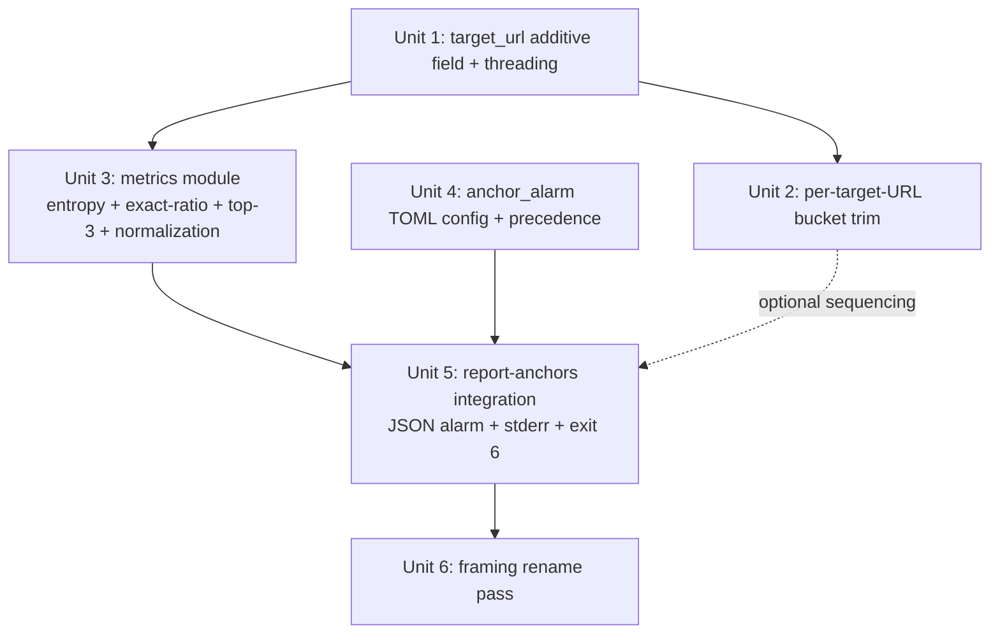

# feat: Anchor distribution visibility on `report-anchors`

## Overview

Extend `report-anchors --from-profile` with three deterministic distributional metrics (Shannon entropy, exact-match ratio, top-3 concentration) computed over absolute 30d / 90d time windows, per **target URL** (not per `main_domain`). Add operator-tunable thresholds via a new `[anchor_alarm]` TOML section. Emit a structured `alarm` block in the JSON report, a human-readable stderr line per breaching target, and exit code **6** when any target breaches in the 90d window.

This plan executes the requirements doc with material adjustments forced by code-archaeology done during document-review:

- **No `_PROFILE_SCHEMA_VERSION` bump.** `anchor_profile.py:139` returns an empty `ProfileState` on version mismatch — a bump would silently erase all production anchor history. We add `target_url` as a tolerant additive field instead.
- **`target_url` threading is real work, not a one-line add.** `_build_profile_entries` (`plan_backlinks.py:569`) drops URL info from its `sec_records` tuple; both the degrade path (`plan_backlinks.py:849`) and the work-themed inline construction (`plan_backlinks.py:953`) build `ProfileEntry` without URL. Plan threads URLs through all three sites.
- **`_MAX_ENTRIES = 100` global cap cannot hold 90 days of multi-target data.** Replace with per-target-URL buckets each capped at 100, so per-target retention is independent.
- **Exit code 6, not 2.** `plan_backlinks.py:1246`, `validate_backlinks.py:227`, `publish_backlinks.py:542` all use `SystemExit(2)` for generic errors. Exit 2 would collide and be swallowed by `|| true` wrappers.
- **Per-target sample floor lowered to 20, not 50.** Asymmetric cost — false-positive triggers a 5-minute anchor review, suppressed true-positive triggers a Penguin penalty.
- **Framing renamed.** "Penguin defense alarm" overstated the report-only mechanism. The feature is "anchor distribution visibility" — the operator is the deciding agent. Surfaced through copy throughout.

## Problem Frame

`report-anchors` today counts anchor *types* (branded / partial / exact / lsi) per `main_domain` (`anchor_profile.py:240-247`) but never measures *distributional shape over time*. Penguin-era anchor over-optimization — over-indexing on exact-match phrases pointing at a destination URL — is the classic Google manual-action trigger for backlink networks, and operates **per destination URL**, not per domain. The project today is structurally blind to that distributional view: an operator could ship 30 articles where 80% of anchors to one money URL are the same exact-match phrase and the existing report would show "30 articles, well-distributed across 4 types".

This plan adds visibility — not a publish-time gate. The operator runs `report-anchors` and acts. See origin requirements doc for the explicit decision to keep this report-only and to rename the feature accordingly.

## Requirements Trace

- R1. Compute three rolling-window metrics per target URL: Shannon entropy of anchor-text distribution, exact-match ratio, top-3 concentration. (see origin: `2026-05-14-anchor-entropy-alarm-requirements.md`)
- R2. Use absolute 30d and 90d time windows gated on `ProfileEntry.ts`; surface both windows.
- R3. Sample-floor gating: `_ALARM_SAMPLE_MIN_PER_TARGET = 20` controls breach emission, stderr warnings, JSON `breaches` entries, and the exit-code path. Metrics still compute and display below the floor.
- R4. Anchor-text normalization: `casefold()` + collapse internal whitespace (`re.sub(r"\s+", " ", ...)`) + ASCII-punctuation strip + `strip()` before all distribution math.
- R5. Aggregate per target URL by adding `target_url: str = ""` to `ProfileEntry`. **No** `_PROFILE_SCHEMA_VERSION` bump. Populate from the actual link URL at entry-construction time.
- R6. Pre-bump entries (`target_url == ""`) form a virtual "domain-rollup" bucket; the report labels each row's granularity (`url` vs `domain-rollup`).
- R7. No migration script. Tolerant additive read via `.get("target_url", "")` in `load_profile`.
- R8. Hardcoded default thresholds: `_ENTROPY_FLOOR = 1.5`, `_EXACT_RATIO_CEILING = 0.10`, `_TOP3_CONCENTRATION_CEILING = 0.25`.
- R9. TOML override `[anchor_alarm]` section. Precedence: per-target-URL > per-`main_domain` > global > R8 hardcoded.
- R10. JSON output gains an `alarm` key per target: `{ metrics: {30d, 90d}, breaches: [...], sample_size, granularity, window_basis }`.
- R11. Stderr emits one human-readable line per breaching target.
- R12. Exit code **3** (not 2) when any 90d breach exists. Exit 0 otherwise. Code 1 reserved for existing error paths; code 2 belongs to sibling CLIs.
- R13. `report-anchors --from-profile` is the only entry point. Publish path is untouched.

## Scope Boundaries

- No `webui.py` retrofit. If any UI emerges later, it must be a sibling page (origin scope decision).
- No publish-time gate. Velocity Governor and anchor-profile scheduler stay authoritative for publish-flow decisions.
- No runtime LLM. All math is deterministic.
- No new sidecar storage location — extends existing `ProfileState` JSON only.
- No retroactive `target_url` backfill for pre-bump entries. They stay in the domain-rollup bucket forever.
- No alarm dispatch beyond stdout / stderr / exit code. No email / webhook / Slack — defer to future event-log integration.
- The dual-schema legacy `anchor_keywords` vs new pool coexistence stays as-is. This feature reads `ProfileEntry` only; the planning surface for the dual schema is not affected.
- JSONL-stdin path of `report-anchors` (the multi-domain aggregate path at `report_anchors.py:_build_report`) is **out of scope** for v1 — that path lacks `anchor_type` data and cannot compute exact-ratio. Only `--from-profile` gets the alarm. **Operator-facing surprise mitigation**: when the JSONL-stdin path is invoked, emit a one-line stderr hint: `"NOTE: anchor distribution alarm requires --from-profile <domain>; this stdin-aggregate path does not compute distributional metrics."` This prevents an operator from running `cat payloads.jsonl | bp report-anchors`, seeing exit 0, and falsely concluding "no breaches" — they actually ran the path that's structurally blind. Implementation: add the stderr line at the entry of the stdin branch in `report_anchors.py`'s `main`.

## Context & Research

### Relevant Code and Patterns

- `src/backlink_publisher/anchor_profile.py` — `ProfileEntry` dataclass (line 68), `ProfileState` (line 87), `load_profile` (line 112), `record_article` (line 183), `_MAX_ENTRIES = 100` (line 43), `_PROFILE_SCHEMA_VERSION = 1` (line 40). The tolerant load pattern is already in use for missing `degraded` field via `.get()` — same shape applies to `target_url`.
- `src/backlink_publisher/cli/report_anchors.py` — current main flow returns `None` (implicit exit 0); `--from-profile` branch at the bottom is the integration point. `_DEGRADATION_ALARM_PCT = 10.0` is the existing precedent for a hardcoded threshold constant.
- `src/backlink_publisher/cli/plan_backlinks.py` — three URL-aware sites that need threading: `_build_profile_entries` signature (line 569), degrade path (line 849), work-themed path (line 953). `home_url` / `sec_url` / `work_url` are all in-scope locals at their respective sites.
- `src/backlink_publisher/config.py:28` — `ANCHOR_TYPES: tuple[str, ...]`; the new `[anchor_alarm]` section follows the existing pattern of TOML section + module-level constants.
- `src/backlink_publisher/anchor_profile.py:270` — `recent_degradation_rate` is the closest existing analytic helper; the new metrics live alongside it as pure functions over `ProfileState`.

### Institutional Learnings

- `docs/solutions/logic-errors/language-matches-always-true-no-op-gate-2026-05-14.md` — example-based tests passed 999 times while the gate was tautological. Tests for the new gate primitives in this plan must include **negative-shape assertions**: "known-breach fixture → non-empty `breaches` list", not just shape checks.
- `docs/solutions/test-failures/ci-test-isolation-failures-medium-brave-sleep-timeout-2026-05-13.md` — mock every fallback branch in tests; no `time.sleep` in batch tests. Not directly applicable here (no sleeps, no fallbacks), but the autouse HTTP-mock fixture convention (`feedback_test-autouse-verify-mock.md`) does apply — new tests must use it.
- `feedback_config-save-overwrite-pattern.md` — `save_config` silently overwrites unknown sections. We're adding a new `[anchor_alarm]` section; planning is aware that until `save_config` is fixed separately (Round-3 ideation #1), edits to `[anchor_alarm]` survive the same risks as other config sections. This plan does NOT depend on `save_config` correctness for runtime reads.
- `feedback_no-runtime-llm.md` — hard constraint. All math here is deterministic; no LLM in the runtime path.
- `feedback_floating-point-tiebreak.md` — entropy / ratio math will produce ties; use `round(x, 4)` when comparing against thresholds to avoid float-drift flapping.
- `feedback_test-locks-in-bug.md` — negative assertions can lock in bugs; tests should also include positive negative-shape ("the gate DOES alarm on the known-bad fixture") not only "the gate doesn't alarm on the known-good fixture".

### External References

External research skipped: codebase has strong local patterns for every layer this plan touches (TOML config parsing, JSONL stdout, dataclass-based persistence, stderr warnings, autouse-mocked tests). Penguin / SpamBrain anchor-distribution thresholds are domain-folklore — accepting that the initial defaults (R8) are uncalibrated and will be tuned operator-side after first production run.

## Key Technical Decisions

- **No schema version bump.** Adding `target_url: str = ""` as a tolerant additive field via `.get("target_url", "")` in `load_profile` preserves history. A bump would invoke the version-mismatch branch at `anchor_profile.py:139` and return an empty `ProfileState` for every existing profile — silent data loss. Tradeoff: schema-version hygiene is weakened, but the existing schema already evolves additively (`degraded` was added the same way per code history).
- **Per-link target_url semantics (not per-article).** One article producing main + N secondary entries creates main+N `ProfileEntry` rows with each row's `target_url` set to the actual destination of that specific link. This aligns with Penguin's per-destination evaluation. Article count is recoverable via grouping on `ts`.
- **`_MAX_ENTRIES = 100` becomes per-target-URL with article-integrity preservation.** Rename to `_MAX_ENTRIES_PER_TARGET = 100`. Trim is per-bucket inside `record_article` BUT must preserve article integrity for `anchor_scheduler.py`'s `_group_into_articles` consumer — trim at article-group granularity (group entries by `ts` first, then trim whole articles, then bucket per-target for reporting). Pre-bump entries (`target_url == ""`) form one virtual bucket. Memory footprint is bounded by `100 × distinct target_urls per domain`, which for solo-operator scale (1-3 money URLs per domain) is comparable to today. See Unit 2 Approach for the load-bearing constraint.
- **Exit code 6 for alarm.** Sibling CLIs already occupy codes 2-5: `plan_backlinks.py:1246` / `validate_backlinks.py:227` / `publish_backlinks.py:542` use 2 for generic errors; `plan_backlinks.py:898` and `publish_backlinks.py:369,796,807` use 4; `publish_backlinks.py:168,298,555,688` use 3 (DependencyError); `publish_backlinks.py:364,799` use 5. Exit code **6** is the lowest unused integer across all sibling CLIs (verified by grep). Operators wrapping multiple CLIs in a single dispatcher can map exit 6 unambiguously to "anchor alarm".
- **Per-target sample floor of 20, not 50.** `_RELIABLE_SAMPLE_MIN = 50` was domain-level. At per-URL granularity, solo-operator throughput rarely accumulates 50 entries per money URL — exactly the Problem Frame scenario (30 articles) would be silently suppressed. Asymmetric costs (false-positive: 5-min review; false-negative: Penguin penalty) justify the lower floor.
- **Normalization beyond case-fold.** Add internal-whitespace collapse + ASCII-punctuation strip + `strip()` after `casefold()`. Stops short of stemming or diacritic folding (NFKC) — those merge legitimate brand variants. Cheap wins that bring us closer to realistic SpamBrain normalization without overreach.
- **Top-3 stays a breach trigger but excludes branded anchors.** Branded-anchor dominance is healthy and would otherwise alarm every well-optimized home page target. Compute top-3 concentration over non-branded entries only; if total non-branded < 5 in window, skip top-3 evaluation (degraded signal).
- **30d window stays as informational, does not drive exit code.** Only 90d breaches set exit 6. 30d metrics surface acceleration signal but never alarm — answers the spec-flow question about orphan window behavior.
- **JSONL-stdin path out of scope.** That path lacks `anchor_type` and cannot compute exact-ratio. Adding alarm to it would require restructuring the `links[]` array to carry anchor metadata — material scope expansion.

## Open Questions

### Resolved During Planning

- Schema bump → resolved: do not bump; tolerant additive read.
- target_url threading scope → resolved: 3 call sites, per-link semantics, signature change to `_build_profile_entries` to accept `main_target_url` + `sec_records` becomes `list[tuple[url_category, anchor_type, anchor_text, target_url]]`.
- Exit code → resolved: 3.
- `_MAX_ENTRIES` collision with 90d → resolved: per-target buckets.
- Sample floor → resolved: 20.
- 30d window orphan question → resolved: informational only, no breach trigger.
- Top-3 vs branded dominance → resolved: exclude branded from top-3 computation.
- JSONL-stdin path scope → resolved: out of v1 scope.

### Deferred to Implementation

- Exact JSON field naming under the new `alarm` key (camelCase vs snake_case): pick on first PR by inspecting existing `--from-profile` JSON output and matching its casing.
- Whether to add a new helper module `src/backlink_publisher/anchor_metrics.py` or extend `anchor_profile.py` with the metrics functions: decide based on file-length tolerance once implemented (anchor_profile.py is currently 330 lines; an additional ~120 lines is borderline).
- TOML override key syntax for URLs (URLs as TOML keys need quoting): pick between (a) `[anchor_alarm.overrides]` with a list of `{match: "url", entropy_floor: …}` or (b) `[[anchor_alarm.override]]` array-of-tables, by inspecting existing config patterns for the closest precedent.
- Whether stderr warning includes a remediation hint or just the breach fact: pick on first dogfood run.
- Default-threshold sanity-check spike (recommended): one-off dump of per-target_url exact-match ratios from the operator's current `ProfileState` to validate that defaults aren't constantly tripping. This is a 30-minute task to run **before** merging the PR but does not block planning. Surfaced as Deferred because it's an execution-time validation, not a planning decision.

## Implementation Units

---

- [ ] **Unit 1: Add `target_url` to `ProfileEntry` (additive, no version bump) and thread through three call sites**

**Goal:** Make per-target-URL granularity possible without erasing history.

**Requirements:** R5, R6, R7

**Dependencies:** None.

**Files:**
- Modify: `src/backlink_publisher/anchor_profile.py` (add field; tolerant read in `load_profile`)
- Modify: `src/backlink_publisher/cli/plan_backlinks.py` (`_build_profile_entries` signature + happy path + degrade path + work-themed path)
- Test: `tests/test_anchor_profile_target_url.py` (new)
- Test: `tests/test_plan_backlinks_target_url_threading.py` (new, or extend existing plan-backlinks tests)

**Approach:**
- `ProfileEntry` gains `target_url: str = ""` as the last field (preserves call-site compatibility for any unaware constructor; `dataclass` default keeps unit-test fixtures untouched).
- `_PROFILE_SCHEMA_VERSION` stays at 1.
- In `load_profile` entry-construction loop, populate `target_url=str(item.get("target_url", ""))`. Old profiles round-trip cleanly.
- `_build_profile_entries` signature becomes `_build_profile_entries(decision, main_anchor, main_target_url, sec_records, *, degraded)` where `sec_records` is now `list[tuple[url_category, anchor_type, anchor_text, target_url]]`. Each entry's `target_url` is populated from the corresponding link URL.
- Happy-path caller in `plan_backlinks.py` passes `home_url` as main_target_url; each sec_record's URL comes from the existing local scope. Degrade path passes `home_url` as both main and the single secondary's target. Work-themed inline construction at `plan_backlinks.py:953` adds `target_url=work_url` to the inline `ProfileEntry(...)`.

**Execution note:** Test-first. The schema-bump trap is documented in `feedback_test-locks-in-bug.md` territory — write the "old profile loads without losing entries" test before changing `load_profile`.

**Patterns to follow:**
- The existing `degraded: bool = False` additive field on `ProfileEntry` (line 84) — same shape (dataclass default, populated via `.get()` in load).
- The existing `_build_profile_entries` shape and its three call sites (one happy, one degrade at `:849`, one work-themed at `:953`) — preserve atomic behavior, just extend signatures.

**Test scenarios:**
- Happy path — `load_profile` reads a v1 profile with no `target_url` field → all entries load with `target_url == ""`. Verify entry count matches input.
- Happy path — new `ProfileEntry` constructed with explicit `target_url="https://example.com/page"` round-trips through `record_article` → `load_profile` → asdict and the field is preserved.
- Edge case — entry dict with `target_url: null` (JSON null) loads as `""`, not raises.
- Edge case — entry dict with `target_url: 123` (wrong type) loads as `"123"` via `str()` coercion (matches existing pattern for `ts`).
- Integration — `_build_profile_entries` for the happy zh-short path generates 1 main + N secondary entries with `target_url` set per link; assert main's target_url == home_url and each secondary's target_url == the link URL passed in.
- Integration — degrade path generates the expected entries with `target_url=home_url` for both main and secondary; `degraded=True` preserved.
- Integration — work-themed path generates 1 main entry with `target_url=work_url` and `url_category="work_themed"`; field is written and reads back.
- Negative-shape — a pre-bump profile JSON on disk (manually constructed in test fixture with version=1, entries lacking `target_url`) loads successfully and reports `target_url == ""` for all entries. Confirms no data loss.

**Verification:**
- Existing anchor-profile tests still pass (no regression).
- New test asserting "load old-shape profile → all entries survive" passes.
- `record_article` round-trip preserves the new field.

---

- [ ] **Unit 2: Per-target-URL bucket trim (replace global `_MAX_ENTRIES` cap)**

**Goal:** Keep ~100 entries *per target_url* so 90d windows actually contain 90 days of multi-target data.

**Requirements:** R2 (enables 90d windows actually containing 90d data)

**Dependencies:** Unit 1 (needs the `target_url` field).

**Files:**
- Modify: `src/backlink_publisher/anchor_profile.py` (rename `_MAX_ENTRIES` → `_MAX_ENTRIES_PER_TARGET`; rewrite trim inside `record_article`)
- Test: `tests/test_anchor_profile_per_target_trim.py` (new, or extend existing)

**Approach:**
- Group `merged` entries by `target_url` after appending new entries. For each bucket, keep the latest `_MAX_ENTRIES_PER_TARGET` entries.
- **Tie-break for identical `ts`** (work-themed batch path at `plan_backlinks.py:953` and rapid happy-path calls under microsecond clock resolution can produce ties): use composite sort key `(ts, original_index_in_merged_list)`. This is deterministic and preserves the relative order in which entries were appended to `merged`.
- Concatenate buckets back into a single `entries` list, sorted by the same `(ts, original_index)` ascending (preserves the existing on-disk ordering convention).
- `target_url == ""` bucket counts as one bucket (the domain-rollup bucket). Pre-bump entries continue to be trimmed as a single bucket, which preserves today's behavior for sites that haven't yet generated new entries.
- **Article-integrity constraint (load-bearing for publish path).** `anchor_scheduler.py:39,140` consumes `ProfileState.entries` via `recent_secondary_count_split` → `_group_into_articles` (`anchor_profile.py:283`), which walks entries sequentially and uses each `main` entry as an article boundary, attributing subsequent `secondary` entries to the preceding `main`. The naive per-target trim would evict a `main` from one bucket while leaving its orphaned `secondary` entries in other buckets — silently breaking the scheduler's article reconstruction. **Therefore the trim MUST preserve article integrity**: when a per-bucket trim would evict an entry that participates in an article whose other entries still survive in different buckets, either (a) evict the entire article (all `main` + `secondary` entries sharing the same `ts`) atomically, or (b) keep the orphaned `main` alongside the over-cap entries. Implementation picks (a) for simplicity: group merged entries by `ts` (article key) BEFORE bucketing, trim article-groups (not individual entries), then re-flatten and bucket by `target_url` for reporting. Per-target counts may exceed the literal cap by a few entries when an article straddles multiple buckets; this is acceptable.

**Patterns to follow:**
- The existing single-line `merged = merged[-_MAX_ENTRIES:]` trim — replace with the bucketed equivalent in-place.
- The existing lock-protected read-modify-write pattern at `record_article` — do not change locking, only the trim semantics.

**Test scenarios:**
- Happy path — write 50 entries each to 3 distinct target_urls (150 total), then write 60 more to target_url A → A's bucket trims to 100 latest; B and C retain 50 each; total entries = 100+50+50 = 200.
- Edge case — pre-bump-only state (all entries have target_url=""): trim behaves identically to today's global `_MAX_ENTRIES` cap. Confirms backwards compat.
- Edge case — single target_url with 200 entries → trims to 100 latest.
- Edge case — bucket exactly at `_MAX_ENTRIES_PER_TARGET` → next write rolls oldest out, newest in.
- Integration — `record_article` called repeatedly with mixed target_url values produces a profile JSON where every `target_url` value has ≤ 100 entries.
- Edge case — entries with same `ts` (collision in fast tests using `now_iso()` and in work-themed batch construction): trim uses the `(ts, original_index)` composite key, so order is deterministic and the most-recently-appended entry survives at the cap boundary.
- **Article-integrity scenario** — fixture: 50 articles each producing 1 main + 2 secondary entries to 3 different target_urls, all with distinct article-level `ts` timestamps. Run `_group_into_articles(state.entries)` from `anchor_profile.py:283` after `record_article`. Assert: every article boundary detected by the scheduler has its main + secondaries intact (no orphaned secondaries; no missing main). This is the load-bearing test that protects the publish path's `recent_secondary_count_split` contract.
- **Article-integrity at cap** — fixture: write 30 articles each producing 1 main + 2 secondaries to a single target_url (90 total entries), then write 15 more articles (45 more entries). After trim, the per-target_url count may be slightly over `_MAX_ENTRIES_PER_TARGET = 100` because article integrity wins over the literal cap. Assert: `_group_into_articles(state.entries)` produces a sequence of articles each with main + complete secondaries — no orphans.

**Verification:**
- Existing `test_anchor_profile*` tests pass with the rename (`_MAX_ENTRIES` → `_MAX_ENTRIES_PER_TARGET`).
- A profile populated across N target_urls retains ≤ 100 entries per URL after rollover.

---

- [ ] **Unit 3: Metrics module — entropy, exact-ratio, top-3 with normalization**

**Goal:** Pure deterministic functions producing R1's three metrics from a `ProfileState` slice, with R4 normalization applied to anchor text.

**Requirements:** R1, R2, R3, R4

**Dependencies:** Unit 1 (reads `target_url`).

**Files:**
- Create: `src/backlink_publisher/anchor_metrics.py` (new module; ~150 LOC)
- Test: `tests/test_anchor_metrics.py` (new)

**Approach:**
- Module-level normalization helper: `_normalize(text: str) -> str` does `casefold` → strip ASCII punctuation (`re.sub(r"[!\"#$%&'()*+,\-./:;<=>?@[\\\]^_\`{|}~]", " ", ...)`) → collapse whitespace (`re.sub(r"\s+", " ", ...)`) → `strip()`.
- Window helper: `_window(entries, days, now=None)` returns the subset where `ts >= now - days` parsed via `datetime.fromisoformat`. `now` defaults to `datetime.now(timezone.utc)` — must be injectable for tests.
- Per-target group: `group_by_target_url(state: ProfileState) -> dict[str, list[ProfileEntry]]`. Empty-string bucket labeled `"domain-rollup"` in the public-facing output but kept as `""` internally.
- Metrics functions (all take a `list[ProfileEntry]`):
  - `shannon_entropy(entries) -> float` — base-2 entropy over `Counter` of `_normalize(e.anchor_text)`. Round to 4 decimals.
  - `exact_match_ratio(entries) -> float` — fraction where `anchor_type == "exact"`. Normalization is irrelevant here (uses `anchor_type` field). Round to 4.
  - `top_n_concentration(entries, n=3, exclude_branded=True) -> float` — sum of top-N normalized-anchor frequencies / total non-branded count. Returns 0.0 (and the function caller sees `None` from a wrapper when input has < 5 non-branded entries — degraded signal).
- Per-target metric struct: `compute_target_metrics(target_url, entries, *, now, sample_floor) -> dict` returning `{target_url, granularity, sample_size, window_30d: {entropy, exact_ratio, top3_excl_branded}, window_90d: {...}}`. `granularity = "domain-rollup"` if `target_url == ""` else `"url"`.

**Execution note:** Test-first. The 999-tautological-tests lesson applies — every metric needs a negative-shape assertion: known-breach fixture → metric crosses threshold.

**Patterns to follow:**
- Pure-function style of existing `recent_type_counts` / `recent_degradation_rate` in `anchor_profile.py:237-282` — no I/O, no logging, take `ProfileState`-or-slice, return primitive.
- Floating-point tie-break lesson — use `round(value, 4)` at every boundary so comparisons against thresholds are stable.

**Test scenarios:**
- Happy path — uniform distribution of 4 distinct anchors → entropy = 2.0 exactly.
- Happy path — all-same anchor → entropy = 0.0.
- Happy path — 10 entries, 6 exact-match → exact_ratio = 0.6.
- Happy path — 10 non-branded entries with top-3 occurring [4, 3, 2] times → top3 = 0.9.
- Edge case — `_normalize` collapses `"iPhone Repair!"`, `"iphone repair"`, `"iPhone  repair"` to the same bucket. Verify entropy counts these as 1 distinct anchor.
- Edge case — empty entries list → all metrics return 0.0 or sentinel; never raise.
- Edge case — `now` injection — entries spanning 120 days with `now` fixed → 30d window contains correct subset, 90d window contains correct subset.
- Edge case — entries with all `anchor_type == "branded"` → top-3 returns `None` or 0.0 with degraded signal (sample < 5 non-branded).
- Negative-shape — fixture: one target_url with 80% exact-match anchors over 90d → exact_match_ratio > 0.10 (would breach default threshold). Confirms gate is not tautological.
- Negative-shape — fixture: one target_url with 1.0 entropy over 90d → entropy < 1.5 (would breach default threshold).
- Edge case — float tie-break: synthesize entries producing entropy of exactly 1.5000004 → `round(_, 4) = 1.5000` and does NOT cross threshold (uses `<` not `<=`).
- Integration — `group_by_target_url` partitions a ProfileState with mixed populated and empty `target_url` correctly; the empty bucket is keyed as `""`.

**Verification:**
- All metric functions are pure (no logging, no I/O).
- Negative-shape tests confirm thresholds would actually fire on known-bad fixtures.
- 100% branch coverage on `_normalize` and on the window-injection path.

---

- [ ] **Unit 4: `[anchor_alarm]` TOML config section + precedence resolver**

**Goal:** Operator-tunable thresholds via TOML, with deterministic precedence resolution.

**Requirements:** R8, R9

**Dependencies:** None (parallel with Units 1-3).

**Files:**
- Modify: `src/backlink_publisher/config.py` (add `[anchor_alarm]` parser; add `AnchorAlarmConfig` dataclass; add resolver helper)
- Test: `tests/test_config_anchor_alarm.py` (new)
- Modify: `config.example.toml` (document the new section with all override layers)

**Approach:**
- New dataclass `AnchorAlarmConfig` with: `entropy_floor: float = 1.5`, `exact_ratio_ceiling: float = 0.10`, `top3_concentration_ceiling: float = 0.25`, plus `overrides: list[AnchorAlarmOverride]` where each override has `{match: str, scope: Literal["url", "domain"], <any threshold field>}`.
- TOML shape (Deferred to Implementation for final exact syntax — picking between dotted-table and array-of-tables once we see what `_parse_anchor_proportions` did):
  - Default proposal: `[[anchor_alarm.override]]` array-of-tables with `match = "https://…"` or `"example.com"`, `scope = "url"` or `"domain"`, and optional threshold fields. Unspecified threshold fields fall through to the parent layer.
- Resolver `resolve_thresholds(cfg, target_url, main_domain) -> AnchorAlarmConfig` — applies precedence per-target: per-URL match > per-domain match > globals from `[anchor_alarm]` > R8 hardcoded constants in `anchor_metrics.py`. Returns a single `AnchorAlarmConfig` instance with the final values to use.

**Patterns to follow:**
- The existing `_parse_anchor_proportions` (`config.py:561`) for TOML schema validation with structured logging on malformed input.
- The existing dataclass + `load_config` integration pattern at `config.py:129` (Config dataclass) and `config.py:209` (load_config).

**Test scenarios:**
- Happy path — config with no `[anchor_alarm]` section → defaults from `anchor_metrics.py` constants returned for every target.
- Happy path — global override `[anchor_alarm] entropy_floor = 1.8` → all targets get 1.8 unless further overridden.
- Happy path — per-domain override matching `example.com` → only targets on that domain get the override.
- Happy path — per-URL override matching exact URL → only that specific target gets the override.
- Precedence — config has all four layers; per-URL override wins for matching URL; per-domain wins for same-domain other-URL; global wins for unrelated domain; default wins when no global set.
- Partial override — per-URL specifies only `entropy_floor`; the other two fields fall through to per-domain or global.
- Edge case — invalid threshold values in TOML (negative, NaN, > 1.0 for ratio fields) → logged as warning, replaced with default. Never raises.
- Edge case — malformed `[anchor_alarm]` (e.g., `overrides = "not-a-list"`) → logged, empty overrides list used, defaults applied.

**Verification:**
- `load_config()` returns a `Config` instance carrying an `anchor_alarm: AnchorAlarmConfig` field.
- `resolve_thresholds` deterministically returns the same merged config for the same inputs.

---

- [ ] **Unit 5: `report-anchors --from-profile` integration — JSON alarm block + stderr + exit code 6**

**Goal:** Wire metrics + config into the report; emit through three channels per R10/R11/R12.

**Requirements:** R10, R11, R12, R3 (sample floor gating), R13 (only entry point)

**Dependencies:** Units 1, 2, 3, 4.

**Files:**
- Modify: `src/backlink_publisher/cli/report_anchors.py` (extend `--from-profile` branch; add alarm computation + emission)
- Test: `tests/test_report_anchors_alarm.py` (new)
- Modify: `tests/test_report_anchors.py` (existing — verify backwards-compat: no alarm key when no breaches, exit 0 behavior preserved)

**Approach:**
- After `_build_profile_report(profile, cfg.anchor_proportions)`, compute alarm per target:
  - `group_by_target_url(profile)` → dict
  - For each bucket: `compute_target_metrics(...)` then resolve thresholds via Unit 4's resolver
  - Compute metrics for **both** the 30d and 90d windows. Detect breaches only in the 90d window (and only when 90d sample_size ≥ `_ALARM_SAMPLE_MIN_PER_TARGET = 20`); 30d metrics are surfaced in JSON for operator visibility but never trigger a breach entry, stderr line, or non-zero exit code.
  - Build a `target_alarm` dict per target: `{target_url, granularity, sample_size_30d, sample_size_90d, metrics: {30d: {...}, 90d: {...}}, breaches: [list of breach codes like "entropy_floor", "exact_ratio_ceiling", "top3_concentration_ceiling"], thresholds_applied: {...}}`.
- Aggregate into a top-level `alarm` key on the JSON output: `alarm: { <target_url>: target_alarm_dict, ... }`.
- For markdown output (non-`--json`), append a concise "Distribution Alarm" subsection after the existing tables. List only targets with non-empty `breaches`.
- Stderr emission: for each breaching target, `print(f"WARN [anchor_alarm] {target_url}: breached {breach_names} in 90d (entropy={…}, exact_ratio={…}, top3={…}; sample={…})", file=sys.stderr)`.
- Exit code: if any target's 90d breaches list is non-empty AND sample ≥ floor, `raise SystemExit(6)`. Otherwise return None (implicit exit 0).
- Existing `_DEGRADATION_ALARM_PCT` / `_RELIABLE_SAMPLE_MIN` warnings stay as today on stdout. Exit code 6 is new; exit 0 preserved for clean runs.

**Patterns to follow:**
- The existing markdown/JSON dual-output pattern in `report_anchors.py` — keep both surfaces aligned.
- The existing stderr warning pattern (`print(f"WARN: …", file=sys.stderr)`) at the JSONL-stdin path.
- `SystemExit(2)` raise pattern from sibling CLIs — same shape with `(3)` here.

**Test scenarios:**
- Happy path — `--from-profile` with no breaches → exit code 0; stdout JSON has `alarm.{<url>}.breaches = []` for each target; stderr empty.
- Happy path — fixture profile with one breaching 90d target (synthesized 25 exact-match anchors out of 30 entries in last 90d) → exit code 6; stderr has one WARN line; JSON `alarm.{<url>}.breaches` contains `"exact_ratio_ceiling"`.
- Happy path — multiple targets, some breaching some not → exit code 6 (any-breach gate); JSON `alarm` has entries for all targets, breach lists vary.
- Happy path — `--from-profile --json` produces machine-readable JSON; `--from-profile` without `--json` produces markdown with the new Distribution Alarm subsection (only when breaches exist).
- Sample floor — fixture with 15 entries for one target (below floor of 20), 80% exact-match → metrics computed and shown, `breaches = []`, exit 0.
- 30d-only signal — fixture where 30d has breach but 90d does not → metrics surface both windows, no entry in 90d breaches, exit 0.
- Domain-rollup row — fixture with all entries pre-bump (target_url == "") → JSON shows one entry with `granularity: "domain-rollup"` and target_url == "" (or labeled key). No crash.
- Mixed granularity — fixture with some pre-bump entries and some new-shape entries → JSON shows both a "domain-rollup" entry and per-URL entries; each correctly labeled.
- Override precedence — config has global entropy_floor=1.0 (very loose); fixture would breach defaults but not the loose threshold → no breach, exit 0. Confirms thresholds wire through.
- TOML override per-target — config has per-URL override entropy_floor=2.5 (very strict) for one URL; fixture entropy=2.0 for that URL → breach. Other URLs unaffected.
- Backwards compat — existing tests for `--from-profile` markdown/JSON pass without modification beyond accepting the new optional `alarm` key.
- Integration — running with empty stdin via existing JSONL-stdin path (not `--from-profile`) → unchanged behavior, no alarm logic invoked.

**Verification:**
- `bp report-anchors --from-profile <domain> --json` outputs valid JSON with the new `alarm` key.
- Exit 3 fires on breach; exit 0 on clean; exit 1 still reserved for argparse / IO errors.
- Existing JSONL-stdin path untouched.

---

- [ ] **Unit 6: Framing rename pass — Penguin defense → anchor distribution visibility**

**Goal:** Align user-facing copy with the report-only mechanism the feature actually implements. Reduces "alarm got ignored, Penguin landed" failure mode flagged by product-lens review.

**Requirements:** Origin doc — framing fidelity per document-review finding C.

**Dependencies:** Unit 5 (final help text + JSON keys are settled).

**Files:**
- Modify: `src/backlink_publisher/cli/report_anchors.py` (argparse help text for the new flag/section; any docstrings)
- Modify: `README.md` (search for "anchor entropy alarm" / "Penguin" and reframe)
- Modify: `docs/brainstorms/2026-05-14-anchor-entropy-alarm-requirements.md` (add session-log entry noting the rename happened during planning; do NOT rewrite Problem Frame retroactively — origin doc stays as-shipped)

**Approach:**
- Replace "alarm" in operator-facing surfaces with "distribution check" or "distribution warning" where it's a verb/feature name; keep the word "alarm" in internal code paths (`alarm` JSON key, `_anchor_alarm` config section) for stability.
- Reframe in any prose: not "defends against Penguin manual actions" but "surfaces anchor over-optimization patterns so the operator can adjust before they accumulate".
- Add a one-paragraph "How to act on a warning" section in README explaining: warning = pause publishing to that target, rotate anchor strategy, run again after N more articles. Operator-as-deciding-agent loop made explicit.

**Test scenarios:**
- Test expectation: none — pure copy change; no behavioral test required. (Argparse `--help` smoke check is implicitly covered by Unit 5's integration test.)

**Verification:**
- Grep for "Penguin defense" / "Penguin alarm" → zero hits in operator-facing files.
- README "anchor distribution visibility" section reads coherently; "how to act" guidance is present.

---

## System-Wide Impact

- **Interaction graph:** `anchor_profile.py` (data model + load/write) → `plan_backlinks.py` (3 call sites threading URL) → `report_anchors.py` (read-only consumer of new field). The publish-path code in `plan_backlinks.py` is touched only at the three URL-threading sites; behavior is unchanged elsewhere. **`anchor_scheduler.py:39,140` is an INDIRECT consumer** of `ProfileState` via `recent_secondary_count_split` → `_group_into_articles` — Unit 2's article-integrity trim constraint protects this consumer. Webui untouched.
- **Error propagation:** `record_article` continues to log-and-swallow on write failures (advisory state contract preserved). Metrics functions are pure; any exception there bubbles up to `report-anchors` and exits via argparse's existing path (exit 1). Exit code 6 is reserved for "alarm fired"; never collides with errors.
- **State lifecycle risks:** Per-target bucket trim (Unit 2) replaces a single-line global trim. Risk: bucket explosion if operator targets hundreds of URLs per domain. Mitigation: monitor profile-file size in dogfooding; if it exceeds reasonable bounds (e.g., 1 MB), introduce a `_MAX_TARGETS_PER_PROFILE` cap in a follow-up PR. Solo-operator scale (1-3 targets per domain) makes this unlikely in v1.
- **API surface parity:** `report-anchors` is the only changed CLI surface. Sibling CLIs (`plan-backlinks`, `validate-backlinks`, `publish-backlinks`) unaffected. JSON consumers of `--from-profile --json` see an additive `alarm` key — backwards-compatible if they ignore unknown keys.
- **Integration coverage:** Test fixtures must include at least one cross-layer scenario in each of Unit 1, Unit 2, Unit 5 (end-to-end profile → metrics → report flow), since mock-only tests cannot catch the trim-interaction-with-load-and-record bug class.
- **Unchanged invariants:**
  - `_PROFILE_SCHEMA_VERSION` stays at 1 — no profile migration.
  - `_RELIABLE_SAMPLE_MIN = 50` and `_DEGRADATION_ALARM_PCT = 10.0` stay as they are; the new `_ALARM_SAMPLE_MIN_PER_TARGET = 20` is an additional, narrower floor.
  - Publish-path side-effects on `ProfileState` unchanged: `record_article` still log-and-swallows on write failures.
  - Velocity Governor and anchor profile scheduler are not consulted by the new alarm; they retain authority over publish-flow decisions.
  - Legacy `anchor_keywords` schema is not read by this feature; dual-schema coexistence is preserved.

## Risks & Dependencies

| Risk | Mitigation |
|------|------------|
| Defaults (entropy<1.5, exact>10%, top3>25%) are uncalibrated and may fire constantly or never on real data | Run the deferred 30-min spike before merging: dump per-target_url metrics from operator's current profile. Adjust defaults or commit to TOML override for first run. The TOML override path means re-tuning never requires a code change. |
| `_MAX_ENTRIES_PER_TARGET = 100` is also a guess; sites publishing aggressively to one URL could exhaust 100 entries within 90d and lose data | Per-target buckets at 100 entries each cover ~100 articles at 2-3 entries/article = ~30-50 articles per target. For solo-operator scale this is months of data per target. If a target accumulates faster, the cap is operator-tunable in a follow-up; current default does not block 90d math for realistic publishing cadence. |
| `target_url` field added without version bump means a future reader using strict-mode dataclass parsing could fail on the new field shape | Mitigated by using `.get()` everywhere on entry dicts; documented in `anchor_profile.py` comment near the field definition. Same hazard exists for the existing `degraded` field — no regressions introduced. |
| Exit code 6 collides with a tool we don't control (some CI wrapper, IDE integration, etc.) | Lower-impact than exit 2 (project-internal collision). Tested: documented in README; operator opt-out is `--no-alarm-exit` flag in a follow-up if needed (not in v1 scope). |
| `casefold + whitespace-collapse + punct-strip` is not actually what Google's SpamBrain does | Documented limitation. Section in README: "this is a conservative lower-bound approximation, not a SpamBrain emulator". Operator-as-deciding-agent framing already acknowledges this. |
| Stderr warnings get banner-blindness-ignored in cron logs, defeating the purpose | Exit code 6 provides the second channel (cron monitors typically alert on non-zero); README guidance recommends an explicit `report-anchors --from-profile <domain> || echo "ALARM"` pattern. Future integration with Round-2 Event Log survivor will add structured surface. |
| Test fixtures for negative-shape (known-breach) cases may themselves drift if Penguin folklore changes | Fixtures are anchored to mathematical thresholds, not folklore — "80% exact-match" or "all-same-anchor" are tautological breach cases for any reasonable threshold. Lower folklore-sensitivity. |

## Documentation / Operational Notes

- README: new section "Anchor Distribution Visibility" with:
  - what the three metrics mean in plain language
  - how to act on a warning (operator-as-deciding-agent loop)
  - how to override thresholds via TOML
  - explicit caveat: report-only, not a Penguin emulator
- `config.example.toml`: new `[anchor_alarm]` section with defaults commented, plus one example `[[anchor_alarm.override]]` block to illustrate per-domain tuning.
- CHANGELOG entry: "Added per-target-URL anchor distribution metrics to `report-anchors --from-profile`. New exit code 6 indicates a 90d breach. Profile schema version unchanged; `target_url` field is additive."
- No migration script. No DB changes. No deploy choreography.
- Dogfood checklist (operator-side, post-merge):
  1. Run `bp report-anchors --from-profile <domain> --json` on current profile; capture baseline metrics.
  2. Inspect baseline vs defaults; tune `[anchor_alarm]` in `config.toml` if needed.
  3. Add `bp report-anchors --from-profile <domain>` (no flag) to weekly cron with `|| /usr/bin/notify-send "Anchor alarm: $domain"` to surface exit 6.

## Sources & References

- **Origin document:** [docs/brainstorms/2026-05-14-anchor-entropy-alarm-requirements.md](docs/brainstorms/2026-05-14-anchor-entropy-alarm-requirements.md)
- **Round-3 ideation:** [docs/ideation/2026-05-14-round3-fresh-pass-ideation.md](docs/ideation/2026-05-14-round3-fresh-pass-ideation.md) (idea #2)
- **Code references (verified during planning):**
  - `src/backlink_publisher/anchor_profile.py:40-46` — version + cap constants
  - `src/backlink_publisher/anchor_profile.py:68-89` — `ProfileEntry`/`ProfileState`
  - `src/backlink_publisher/anchor_profile.py:112-165` — `load_profile` tolerant-read pattern
  - `src/backlink_publisher/anchor_profile.py:183-225` — `record_article` lock + trim
  - `src/backlink_publisher/anchor_profile.py:237-282` — existing pure analytic helpers
  - `src/backlink_publisher/cli/plan_backlinks.py:569-605` — `_build_profile_entries`
  - `src/backlink_publisher/cli/plan_backlinks.py:849-857` — degrade path inline construction
  - `src/backlink_publisher/cli/plan_backlinks.py:953-963` — work-themed inline construction
  - `src/backlink_publisher/cli/report_anchors.py` end-of-file `main` — `--from-profile` branch entry point; no `sys.exit` calls in current main flow
  - `src/backlink_publisher/cli/plan_backlinks.py:1246`, `validate_backlinks.py:227`, `publish_backlinks.py:542` — `SystemExit(2)`; `plan_backlinks.py:898` + `publish_backlinks.py:369,796,807` — exit 4; `publish_backlinks.py:168,298,555,688` — exit 3 (DependencyError); `publish_backlinks.py:364,799,807` — exit 5. Verifies the full exit-code namespace; **exit 6 is the lowest free integer**.
  - `src/backlink_publisher/config.py:129` — `Config` dataclass; `:209` — `load_config`; `:561` — `_parse_anchor_proportions` TOML parsing pattern
- **Institutional learnings:** `feedback_test-locks-in-bug.md`, `feedback_no-runtime-llm.md`, `feedback_floating-point-tiebreak.md`, `feedback_config-save-overwrite-pattern.md`
- **Document-review findings consolidated:** 2 P0 (data destruction risk, target_url path), 4 P1 (framing, exit code, MAX_ENTRIES, sample floor) — each resolved in Key Technical Decisions section above with code-grounded fix.
- **Second-pass document-review (2026-05-14) auto-fixes applied to this plan:** exit code corrected 3 → 6 (feasibility F2: exit 3 occupied by `publish_backlinks.py` DependencyError); `config.py:889` citation corrected to `:129`+`:209` (feasibility F5); Unit 5 breach-detection wording disambiguated to "compute both, breach-gate on 90d only" (coherence F2); Unit 2 strengthened with article-integrity constraint to prevent silent corruption of `anchor_scheduler`'s `_group_into_articles` consumer (feasibility F1) and explicit `(ts, original_index)` composite tie-break (adversarial F2); JSONL-stdin operator-surprise mitigation added — stderr hint when the alarm-blind path is invoked (adversarial F6).
