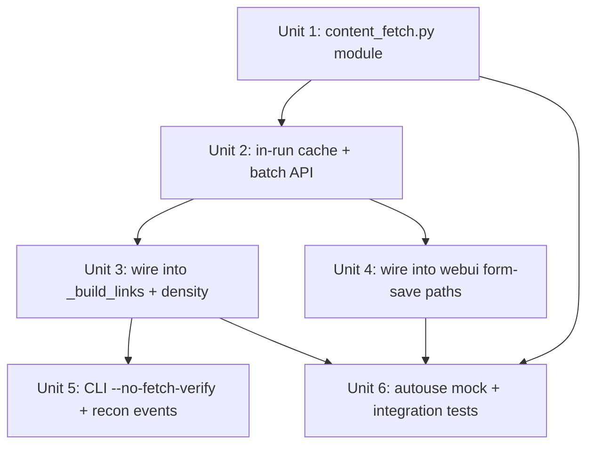

# URL Content-Fetch Gate — block links with no real content from being emitted

## Overview

PR #19 stopped one specific class of synthesized URL (the hardcoded `/categories` / `/detail` suffixes in `_build_links`'s B/C modes) by sourcing them from the `[sites."<main>".url_categories]` config table. But the broader principle — "every URL emitted into a backlink article must point to real, parseable content" — is still unenforced. Any user-provided `extra_urls`, the operator's own `main_url` / `target_url`, the configured category/detail URLs, even the supporting links (Wikipedia, MDN, …) can in principle 404, soft-404, return empty bodies, or serve an interstitial that has no `<title>`.

This plan introduces a **plan-time content gate**: before any URL enters an article's `links` array or `content_markdown`, it must pass an HTTP fetch and parse-out a non-empty `<title>` (or `og:title`). URLs that fail the gate are **dropped from the article** (not soft-flagged), and `plan_logger.recon` records the drop so the operator sees what happened. Per the user's scope decision, **every** link goes through the gate — main_domain, target, extra_urls, mode-specific (B/C), and supporting — with a single in-run cache so duplicate URLs hit one HTTP call per plan invocation.

The existing publish-time reachability gate (PR #16 R8/R9) stays as a defense-in-depth backstop for URLs that pass the content gate at plan time but become unreachable between plan and publish. The new gate is upstream of it.

## Problem Frame

Three classes of failure that this gate catches:

1. **Hallucinated suffixes** (already partially fixed by PR #19): `main + "/categories"` synthesized at plan time, never verified. The R8/R9 publish-time check eventually rejected the row — but the row had already burned plan time, written a checkpoint, and consumed a publish slot. The content gate catches this at plan time, before the row enters the pipeline.
2. **Operator-supplied stale URLs**: a user pastes `https://example.com/old-blog-post` into `extra_urls` or `target_url`. The page existed when they bookmarked it, but is now 404 / redirected to a landing page. Today the URL silently makes it into the article; the operator's backlink lands as a broken link on Blogger / Medium and contributes zero SEO value (potentially negative — Google's link graph penalizes broken-link clusters).
3. **Soft empty pages**: a URL returns HTTP 200 but the body is an SPA shell, a CAPTCHA challenge, or a Cloudflare interstitial with no `<title>`. The publish-time check would also pass (HEAD/GET returns 200). Only fetching and parsing `<title>` catches it.

This isn't a security problem and isn't a publish-pipeline problem — it's a **plan-quality** problem. The bar this plan enforces: "an article we are about to publish must not contain any link to a URL we couldn't get real HTML content from."

## Requirements Trace

- R1. Every URL that `_build_links` is about to append to the `links` array passes an HTTP fetch + parse check; failures cause the link to be **omitted entirely** (not weakened to `required: false`, not retained with a warning).
- R2. The check uses a real GET (not HEAD-only), parses the response body as HTML, and requires a non-empty `<title>` element OR a non-empty `og:title` meta tag. HTTP 200 alone is insufficient.
- R3. The check applies to **every** link source: main_domain, target_url, extra_urls (user-provided), B/C mode category/detail URLs (from config), and supporting links (Wikipedia/MDN/SO/GitHub/HN). No allowlist exemption — supporting links can break too.
- R4. Within a single plan-backlinks invocation, the same URL is fetched at most once (in-run cache, process-scope memoization). A batch of 10 rows that all reference the same `main_domain` triggers one HTTP call for that URL, not ten.
- R5. Fetches run concurrently with a bounded worker pool (per-plan batch ≤ 5 parallel) so the worst-case plan time stays roughly bounded by the slowest single fetch plus its retry budget, not by sequential summation.
- R6. `plan_logger.recon` emits `link_dropped_no_content` (one event per dropped URL) with the URL, reason, and the kind / origin (`main_domain` / `target` / `extra` / `category` / `detail` / `supporting`). Operator sees every drop in the always-on log stream.
- R7. CLI escape hatch `--no-fetch-verify` on `plan-backlinks` bypasses the gate for dev / staging / replay use, with a `fetch_verify_disabled` warning event emitted once per invocation.
- R8. WebUI form-save paths (`/sites/save-three-url`, `/ce:plan`) gate user-pasted URLs (main_url, list_url, work_urls, extra_urls) at form submit and surface field-level errors when a URL fails. Operators don't get a confusing "your config saved but no row ever publishes" delay.
- R9. The publish-time R8/R9 gate stays exactly as-is. The new content gate is upstream defense; the existing reachability check is downstream backstop.
- R10. The `_build_link_density_paragraph` link-count math accounts for the new gate — when a synthesized or extra link gets dropped, the density compensation paragraph fires so the article still meets the 6+ target-site-link quota.

## Scope Boundaries

- **Not in scope:** introducing a new fetcher binary or daemon. The plan reuses request-based GET (same shape as `webui.fetch_full_tdk` / `work_scraper.fetch_work_metadata`).
- **Not in scope:** soft-404 detection beyond "empty title". Sites that return HTTP 200 with a "Page Not Found" page that still has a populated `<title>` will pass — the title-non-empty rule is a floor, not a ceiling. Catching titled soft-404s is a future enhancement, deferred.
- **Not in scope:** moving validate-time linkcheck or publish-time R8/R9. Both remain as defense-in-depth. The new gate is additive.
- **Not in scope:** persistent caching across plan invocations. The cache is process-scope, in-memory. A repeated `plan-backlinks` invocation re-fetches every URL.
- **Not in scope:** per-domain allowlist for "stable" links. Per the user's scope decision, supporting links also gate; no exemption.
- **Not in scope:** retroactive sweep of existing checkpoints. Rows already in `~/.cache/backlink-publisher/checkpoints/` with bad links continue to be handled by R8/R9 at resume time.
- **Not in scope:** content-quality scoring (e.g., minimum word count, language match). The gate is "real HTML page with a title", not "high-quality content".
- **Not in scope:** the zh-CN short-form path (`_plan_zh_short_row`) and the work-themed path (`_plan_work_themed_row`) — these dispatchers are out of scope for this plan unless they share `_build_links`. (Spot-check during implementation: if they go through `_build_links`, gate applies; if they synthesize their own link sets, deferred to a follow-up plan).

## Context & Research

### Relevant Code and Patterns

- `src/backlink_publisher/linkcheck.py` — existing `check_url(url) → (ok, error)`. HEAD-then-GET, HTTP 200/301/302 ACCEPTABLE_CODES, lax TLS, 10s timeout, 2 retries. **Reachability only — no body parse.** New module is its content-gate sibling.
- `src/backlink_publisher/work_scraper.py:135 _safe_get` + `:232 fetch_work_metadata` — full GET with SSRF defense (`_block_if_private`), size limit (`_ResponseTooLarge`), bs4 parse, title extraction (`_extract_title`). Closest existing pattern to mirror; do not import directly (cross-concern) but follow the safe-GET shape.
- `webui.py:2302 fetch_url_metadata` + `:2345 fetch_full_tdk` — quick `requests.get` + bs4 title/description extraction. Loose (no SSRF, `verify=False`). Used by `/ce:plan` flow today. Should converge to a single canonical helper rather than coexist with the new module long-term, but convergence is out of scope.
- `src/backlink_publisher/cli/plan_backlinks.py:152 _build_links` — gate insertion point. Wire pre-flight check around every `links.append(...)`.
- `src/backlink_publisher/cli/plan_backlinks.py:285 _build_link_density_paragraph` — already takes `site_url_categories` post-PR-#19; same threading pattern for content-gate state (so density math knows when links were dropped).
- `src/backlink_publisher/cli/publish_backlinks.py:57 _check_row_reachability` + `:608 if not args.dry_run and not args.skip_publish_time_check` — the publish-time R8/R9 gate. Stays unchanged; content gate runs earlier.
- `tests/conftest.py` — autouse mock layer for HTTP-touching tests (per `feedback_test-autouse-verify-mock.md`). New module must be added to the autouse mock list before tests pass.
- `tests/test_gate_properties.py` — pattern for structural-property tests (hypothesis + deterministic seed). Useful for new gate's "structural-tautology guard" if any.

### Institutional Learnings

- `feedback_plan-time-url-hallucination.md` (2026-05-14, just added) — the direct parent learning. Synthesised URLs must be verified or configured. This plan generalises the rule to "every URL must be verified, not just synthesized ones".
- `feedback_api-idempotency-lesson.md` — HTTP retries on 5xx are unsafe for non-GET; here we only GET so retry is safe, but still bound MAX_RETRIES=2.
- `feedback_test-autouse-verify-mock.md` — any new HTTP-touching module must be added to `tests/conftest.py` autouse mock or pytest-socket will fail the whole suite. R7 + new test fixtures depend on this.
- `feedback_recon-level-for-always-on-signals.md` — R6's `link_dropped_no_content` is exactly the operator-always-visible-event shape; use `plan_logger.recon`, not `info`/`warn`.
- `feedback_hypothesis-dev-dep-ci-trap.md` — if the new module pulls in any dep not in `pyproject.toml`, clean-venv smoke before push. bs4 is already runtime dep, requests too — likely no new dep.
- `feedback_no-runtime-llm.md` — the content gate must be deterministic / LLM-free. HTML parse + title extraction is the bar.
- `docs/solutions/test-failures/ci-test-isolation-failures-medium-brave-sleep-timeout-2026-05-13.md` — mock every HTTP path including fallthroughs. New module's tests follow this.

### External References

None warranted. The pattern (HTTP GET + bs4 parse + title check) is repo-internal and already established 3× in the codebase.

## Key Technical Decisions

- **New canonical module `src/backlink_publisher/content_fetch.py`** for the content-gate fetcher rather than extending `linkcheck.py`. Rationale: `linkcheck.py` is documented as "URL reachability checker"; conflating reachability with content verification muddies the contract. Future converge of `webui.fetch_full_tdk` / `fetch_url_metadata` / `work_scraper.fetch_work_metadata` to this module is plausible but out of scope.
- **GET-only, no HEAD-first**. Rationale: HEAD doesn't return a body; content-verify requires the body. The 1× overhead vs HEAD is bounded by the same connection / retry budget. The publish-time gate continues to use HEAD-first because reachability is its only concern.
- **HTTP 200 + non-empty `<title>` OR `og:title`** is the pass criterion. Rationale: catches 404, 5xx, empty SPA shells, CAPTCHA interstitials, Cloudflare challenge pages (which lack a meaningful title). Won't catch every soft-404 (titled "Page Not Found"), but that's an acceptable floor — title-empty alone is high-precision.
- **30s total budget per URL** (10s HEAD-fallback timeout * 2 retries * 1.5 backoff overhead) — same as existing check_url order of magnitude. Rationale: keep plan-time bounded; operators with truly slow target sites can use `--no-fetch-verify`.
- **Process-scope in-run cache**, dict-backed, no expiry. Rationale: batch CSV plan invocations may reference same main_domain across 100 rows; cache turns 100 fetches into 1 fetch. No persistence — every fresh invocation re-fetches because the world changes between invocations.
- **Concurrent fetching via ThreadPoolExecutor, max_workers=5**, same shape as `linkcheck.check_urls`. Rationale: parallelism caps tail latency; 5 is enough to overlap typical 6-8-link articles without overwhelming target sites or hitting Brave instance limits.
- **Drop, don't downgrade**. URLs failing the gate are removed from the article entirely, not retained with `required: false`. Rationale: a `required: false` broken link still publishes; the entire point of the gate is "real content or it doesn't go in." `feedback_plan-time-url-hallucination.md` rule.
- **Escape hatch is opt-in, not opt-out**. `--no-fetch-verify` flag (default off, gate on). Rationale: safest default. Mirrors `--no-validate-url-check` shape.
- **Supporting links also gate**. Per user's explicit scope decision. Rationale: Wikipedia/MDN/SO are stable but the gate is cheap (5-link concurrent fetch + cache), and a future supporting link could be added that's stale.

## Open Questions

### Resolved During Planning

- **Use HEAD or GET?** GET. HEAD can't verify body content.
- **What's the title criterion — exact match? Length floor?** Non-empty after `.strip()`. No length floor (some legitimate sites have terse 4-char titles).
- **Cache scope: per-row, per-invocation, or per-process?** Per-invocation (process-scope memoization). Sufficient given typical workflow.
- **Drop or downgrade failing links?** Drop, per user's scope decision and `feedback_plan-time-url-hallucination.md`.
- **Should supporting links be exempt?** No — user chose strict mode.

### Deferred to Implementation

- **Exact behavior when the gate is bypassed via `--no-fetch-verify` and a downstream URL 404s at publish time.** Falls to existing R8/R9. Document in CHANGELOG.
- **Whether to factor `webui.fetch_full_tdk` and `webui.fetch_url_metadata` into the new module as a convergence cleanup.** Tracked as deferred — risk that converging during this plan expands scope beyond the gate.
- **Soft-404-with-title detection** (e.g., title literally "Page Not Found" / "404" / "Error"). A heuristic blocklist could fire on those, but false-positive risk on legitimate error / about pages exists. Defer to a follow-up if R6 recon logs show common soft-404 patterns.
- **Per-URL retry budget tuning**. Initial: 2 retries with 1s linear backoff (same as `_check_url_with_retry`). Tune if production logs show retry-exhaust failures cluster on specific slow CDNs.

## High-Level Technical Design

> *This illustrates the intended approach and is directional guidance for review, not implementation specification. The implementing agent should treat it as context, not code to reproduce.*

```
plan-backlinks invocation
       │
       ▼
   _generate_payload(row, config)
       │
       ▼                                       ┌──────────────────────────┐
   _build_links(...)         ───────────────►  │  content_fetch.gate()    │
       │                                       │   in-run cache?          │
       │  for each candidate (url, kind):      │   ├── hit → reuse        │
       │     ok = gate.check(url)              │   └── miss → GET+parse   │
       │     if ok: links.append({...})        │            │             │
       │     else:                             │            ▼             │
       │       plan_logger.recon(              │     200 + title? ─yes→ ✓ │
       │         "link_dropped_no_content",    │            │             │
       │         url=..., kind=..., reason=...)│           no             │
       │                                       │            ▼             │
       │                                       │     ✗ (with reason)      │
       │                                       └──────────────────────────┘
       ▼
   _build_link_density_paragraph(...)
       │  knows how many links were dropped → may compensate
       ▼
   payload['links'] + payload['content_markdown']

webui POST /sites/save-three-url
       │
       ▼
   for each user-pasted URL (main, list, work_urls, extras):
     ok = gate.check(url)
     if not ok: errors[field] = f"<URL> 无有效内容（HTTP NNN / no title）"
   if errors: 422 re-render
```

Gate function shape (directional):

```
def gate(url: str) -> (ok: bool, reason: str | None, title: str | None):
    # 1. cache hit → return cached
    # 2. GET url with 10s timeout, 2 retries, lax TLS
    # 3. status_code != 200 → (False, f"HTTP {status}", None)
    # 4. parse body with bs4 → find <title> or <meta og:title>
    # 5. title empty/missing → (False, "no_title", None)
    # 6. cache (url → result) → return (True, None, title)
```

## Implementation Units



- [ ] **Unit 1: New module `content_fetch.py` with `verify_url_has_content`**

**Goal:** A single canonical function that takes a URL and returns `(ok, reason, title)`, using GET + bs4 title extraction, with retry + timeout + lax-TLS contract aligned to existing `linkcheck.py` defaults.

**Requirements:** R1, R2

**Dependencies:** None.

**Files:**
- Create: `src/backlink_publisher/content_fetch.py`
- Test: `tests/test_content_fetch.py`

**Approach:**
- Mirror `linkcheck._check_url_once` HTTP shape but use `Request(method="GET")`. Apply same `_SSL_CTX` lax-TLS pattern.
- Use `bs4.BeautifulSoup(body, "html.parser")` to parse the response. First look for `<meta property="og:title" content="...">`, then `<title>...</title>`. Strip + check non-empty.
- Bound body read to 1 MB (typical HTML page + buffer). Reject longer responses with `reason="body_too_large"` — protects against accidental binary downloads.
- Return shape: `(ok: bool, reason: str | None, title: str | None)`. On success, title carries the extracted string (useful for downstream consumers / metadata enrichment).
- Reason values: `"http_200_no_title"`, `"http_4xx"` / `"http_5xx"` with code, `"network_error"`, `"body_too_large"`, `"parse_error"`, `"invalid_url"`, `"timeout"`.
- 2 retries with 1s linear backoff, same as `_check_url_with_retry`. Only retry on transient (timeout / 5xx / network), not on 4xx or content-empty.
- Module-level constants: `FETCH_TIMEOUT = 10`, `MAX_RETRIES = 2`, `MAX_BODY_BYTES = 1_000_000`, `USER_AGENT = "backlink-publisher/0.1 content-fetch"`.

**Patterns to follow:**
- `linkcheck.py` retry / SSL context structure.
- `webui.fetch_full_tdk` title extraction order (og:title first, then `<title>`).
- `work_scraper._safe_get` size-bound pattern (for `MAX_BODY_BYTES` enforcement).

**Test scenarios:**
- Happy path: stub `urlopen` returning `200` + HTML `<title>Real Page</title>` → `(True, None, "Real Page")`.
- Happy path: `og:title` present and `<title>` empty → returns og:title value.
- Edge case: HTML body with only `<title></title>` → `(False, "http_200_no_title", None)`.
- Edge case: HTML body with `<title>   </title>` (whitespace) → `(False, "http_200_no_title", None)`.
- Edge case: 200 OK with body that has NO `<title>` and NO `og:title` → `(False, "http_200_no_title", None)`.
- Edge case: 200 OK with body > 1 MB → `(False, "body_too_large", None)`.
- Error path: 404 → `(False, "http_404", None)`, no retry.
- Error path: 500 → `(False, "http_5xx", None)` after 2 retries.
- Error path: network timeout → `(False, "timeout", None)` after 2 retries.
- Error path: `socket.gaierror` (DNS fail) → `(False, "network_error", None)` after retries.
- Edge case: invalid URL ("not-a-url", "ftp://x.com") → `(False, "invalid_url", None)`, no HTTP attempt.
- Edge case: HTML body with malformed markup (unclosed tags) → bs4 parses leniently; if title still extractable, ok.
- Integration: 301 redirect to a 200 with title → ok (follows redirects; urlopen handles by default).
- Integration: 301 redirect to 404 → `(False, "http_404", None)`.

**Verification:**
- `pytest tests/test_content_fetch.py -q` green with all scenarios.
- Module importable: `python -c "from backlink_publisher.content_fetch import verify_url_has_content; print('ok')"`.

---

- [ ] **Unit 2: In-run cache + batch API**

**Goal:** A process-scope cache so the same URL is fetched once per `plan-backlinks` invocation, plus a `verify_urls_batch(urls) -> dict[url, (ok, reason, title)]` API that fetches concurrently.

**Requirements:** R4, R5

**Dependencies:** Unit 1.

**Files:**
- Modify: `src/backlink_publisher/content_fetch.py` (add cache + batch API)
- Test: `tests/test_content_fetch.py` (extend)

**Approach:**
- Module-level `_CACHE: dict[str, tuple[bool, str | None, str | None]] = {}`. Read-then-write on each `verify_url_has_content` call (cache lookup → if hit, return cached; if miss, fetch and cache the result).
- `verify_urls_batch(urls: list[str], max_workers: int = 5) -> dict[str, tuple[bool, str | None, str | None]]`: dedupe input, submit cache-miss URLs to `ThreadPoolExecutor`, return merged dict.
- Cache holds **both successes and failures** — a 404'd URL doesn't get retried within the same invocation. Operator can `--no-fetch-verify` to bypass entirely.
- Provide `reset_cache()` for tests to clear state between runs. Tests must call this in their fixtures.
- Concurrency: `max_workers=5` default; callers can override but the gate itself does not expose this knob to CLI.
- No persistence layer — the cache is process-scope, in-memory dict. A new process starts with an empty cache.

**Patterns to follow:**
- `linkcheck.check_urls` ThreadPoolExecutor + `as_completed` pattern, modified for cache lookup.
- `tests/conftest.py` autouse fixture pattern for `reset_cache()`.

**Test scenarios:**
- Happy path: `verify_url_has_content("https://x.com")` twice → second call hits cache (assert `urlopen` called once via mock).
- Happy path: `verify_urls_batch(["https://x.com", "https://y.com"])` → both fetched concurrently; result dict has both keys.
- Happy path: `verify_urls_batch(["https://x.com", "https://x.com", "https://x.com"])` (duplicates) → one fetch, dict has one entry; result correctly returned to all three positions if caller maps.
- Edge case: empty list → empty dict, no fetches.
- Edge case: same URL in batch + sequential call afterwards → cache hit on second call.
- Edge case: cache holds a failure result → re-querying same URL returns same failure without re-fetch.
- Error path: one URL in batch fails, others succeed → result dict reflects mixed outcomes; failed URL doesn't poison the batch.
- Integration: `reset_cache()` between two batch calls → second batch re-fetches everything.

**Verification:**
- All scenarios green.
- Manual smoke: `python -c "from backlink_publisher.content_fetch import verify_urls_batch, reset_cache; reset_cache(); print(verify_urls_batch(['https://example.com', 'https://example.com']))"` shows one network attempt (via debug-level log).

---

- [ ] **Unit 3: Wire into `_build_links` + density paragraph compensation**

**Goal:** Every link `_build_links` would append now passes through `verify_url_has_content` first; failures drop the link and emit a recon event. `_build_link_density_paragraph` knows how many links were dropped per kind so its 6+ density math stays correct.

**Requirements:** R1, R3, R6, R10

**Dependencies:** Unit 2.

**Files:**
- Modify: `src/backlink_publisher/cli/plan_backlinks.py`
  - `_build_links`: pre-flight every candidate URL via `verify_url_has_content`; drop + recon on fail.
  - `_build_link_density_paragraph`: accept a `dropped_kinds: set[str]` (or count) parameter; deduct from `base` when links were dropped post-construction.
  - `_generate_payload`: thread `dropped_kinds` between `_build_links` and `_build_link_density_paragraph`.
- Test: `tests/test_plan_backlinks.py` (new content-gate scenarios).

**Approach:**
- Inside `_build_links`, replace each `links.append({...})` with `if _verify(url): links.append({...}) else: dropped.add(kind)`.
- Use `verify_urls_batch(all_candidate_urls)` once per `_build_links` invocation to overlap fetches — collect candidates first, batch-fetch, then iterate and conditionally append. This keeps plan time bounded.
- Density paragraph already takes `site_url_categories` post-PR-#19. Add `dropped_kinds` to its signature. The base count math subtracts confirmed-dropped contributions.
- `plan_logger.recon("link_dropped_no_content", url=..., kind=..., reason=...)` on each drop. One event per URL, not per row.
- `_build_links` returns the links list unchanged in shape (still a list of dicts); the only behavioral change is fewer entries.
- Bypass path: if `--no-fetch-verify` is set (passed via a context arg or a module-level flag set by `main()`), skip the gate and append all candidates. Recon event `fetch_verify_disabled` fires once per invocation in `main()`.

**Patterns to follow:**
- PR #19's threading of `site_url_categories` through `_build_links` + `_build_link_density_paragraph`.
- `feedback_recon-level-for-always-on-signals.md` for recon-vs-info choice.

**Test scenarios:**
- Happy path: all URLs gate-pass → `links` unchanged from current behavior.
- Happy path: `main_domain` URL fails the gate → row's links still has `target_url`, extras, supporting; recon log shows `link_dropped_no_content kind=main_domain`.
  - Note: this is operator-actionable. If their own main URL fails the gate, the article shouldn't publish — payload may need to be marked unpublishable. Decide in implementation whether to also fail the whole row (likely yes).
- Edge case: 1 supporting link fails → `_build_links` returns 5 supporting + 1 main, 6 total; density paragraph fires to add target-site density.
- Edge case: B-mode category URL fails gate (config provided URL but it's stale) → recon `link_dropped_no_content kind=category`; density paragraph compensates.
- Edge case: 2 extra_urls provided, one fails the gate → kept: 1; recon shows the failure.
- Integration: full row with main + target + 2 extras + B-mode category + 5 supporting (10 candidates); 2 fail (one extra, one supporting) → links contains 8; density paragraph fires; `content_markdown` has the right link count.
- Error path: `--no-fetch-verify` set → no gate runs; `fetch_verify_disabled` recon fires once at start of `main()`; all candidate URLs append unconditionally.
- Regression: `test_plan_no_synthesized_categories_url_without_config` (from PR #19) still green.
- Regression: `test_target_site_link_density[...]` family still green for all params.

**Verification:**
- All scenarios green in autouse-mocked test suite.
- Manual smoke: run the failing-checkpoint seed shape from PR #19 (`{"target_url": "https://51acgs.com/", ...}`) through plan-backlinks; observe `link_dropped_no_content` recon events on any stale supporting / config URL.

---

- [ ] **Unit 4: WebUI form-save gate**

**Goal:** `/sites/save-three-url` and `/ce:plan` POST handlers run user-pasted URLs through the content gate; failures return 422 with field-level errors pointing the operator at the bad URL.

**Requirements:** R8

**Dependencies:** Unit 2.

**Files:**
- Modify: `webui.py`
  - `sites_save_three_url` (`webui.py:4264`): gate `main_url`, `list_url`, each `work_urls` entry, each `extra_urls` entry (if present).
  - `ce_plan` (`webui.py:2749`): gate each URL collected from `url_*` form fields before placing in session config.
- Test: `tests/test_webui_three_url.py` + a new test file for `/ce:plan` if not already covered.

**Approach:**
- After existing field validation (HTTPS / host-root / etc.), call `verify_url_has_content(url)` for each URL field. On failure, set `errors[field_name] = f"<URL> 无可访问内容: {reason}"` (mirror existing error pattern at `webui.py:4284`).
- Multiple URLs in one field (e.g., `work_urls` textarea): gate each, return field-level error with the list of failing URLs.
- For `work_urls` and `extra_urls` which may have many entries, batch them via `verify_urls_batch` for parallelism.
- Same `--no-fetch-verify` escape hatch concept does not apply at webui layer — webui is operator-facing and the gate is the whole point. But: provide a `BACKLINK_NO_FETCH_VERIFY=1` env var that bypasses for dev / local-only testing, surfaced as a console warning on every form submit when active.
- Performance: `main_url + list_url + 5 work_urls + 2 extras = 9 URLs` worst case → batch fetched in ~10-15s. Form submit feels slow but acceptable.

**Patterns to follow:**
- Existing `errors[field]` pattern in `sites_save_three_url` (PR #9).
- `_check_csrf_or_abort` precedes URL validation — gate runs after that.

**Test scenarios:**
- Happy path: all URLs pass gate → save succeeds → 302 redirect.
- Error path: `main_url` fails gate → 422 + form re-rendered with `errors['main_url'] = ...`.
- Error path: 2 of 5 `work_urls` fail → 422 + `errors['work_urls']` lists the 2 failing URLs.
- Edge case: `BACKLINK_NO_FETCH_VERIFY=1` set → gate skipped, save succeeds, console warning emitted.
- Edge case: form re-rendered with user input intact (per existing PR #9 contract) — gate failures don't lose what the user typed.
- Integration: `/ce:plan` flow with a single URL that fails gate → render the form with `error="<URL> 无可访问内容: ..."`.

**Verification:**
- Test suite green.
- Manual smoke: in browser, paste `https://this-domain-does-not-exist-9999.com/` into the `/sites` main_url field; submit; observe 422 + error message.

---

- [ ] **Unit 5: CLI flag `--no-fetch-verify` + recon events**

**Goal:** `plan-backlinks --no-fetch-verify` bypasses the content gate entirely with a single one-time `fetch_verify_disabled` recon event.

**Requirements:** R7

**Dependencies:** Unit 3.

**Files:**
- Modify: `src/backlink_publisher/cli/plan_backlinks.py` (`main()` argparse + flag plumbing).
- Test: `tests/test_plan_backlinks.py` (new test for the flag).

**Approach:**
- Add `parser.add_argument("--no-fetch-verify", action="store_true", default=False)` near the existing `--from-csv` / `--default-platform` group.
- In `main()`, after parsing args: if `args.no_fetch_verify`, set a module-level flag (`_FETCH_VERIFY_ENABLED = False`) before invoking the dispatch loop. Emit `plan_logger.recon("fetch_verify_disabled", reason="cli_flag")` once.
- `_build_links` reads the module-level flag (or accepts it as a parameter) and skips gate calls when disabled.
- Document the flag in the CLI help text: "Skip plan-time URL content gate (default: enabled). Each row's URLs are normally fetched and required to return HTTP 200 with a non-empty title."

**Patterns to follow:**
- Existing `--no-check-urls` flag on `validate-backlinks` for deprecation-alias / opt-out style.
- `feedback_recon-level-for-always-on-signals.md` recon emission for "operator should always see this is happening".

**Test scenarios:**
- Happy path: invoking with `--no-fetch-verify` skips all gate calls (assert via mock that `verify_url_has_content` is never called).
- Happy path: invoking without flag (default) hits the gate normally.
- Edge case: `--no-fetch-verify` combined with `--from-csv` works as expected.
- Edge case: `fetch_verify_disabled` recon emitted exactly once even when batch has 100 rows.

**Verification:**
- Test suite green.
- `python -m backlink_publisher.cli.plan_backlinks --help | grep no-fetch-verify` shows the flag description.

---

- [ ] **Unit 6: Autouse mock + integration tests + clean-venv smoke**

**Goal:** `tests/conftest.py` autouses the content_fetch mock (per `feedback_test-autouse-verify-mock.md`); a new integration test exercises the full plan→gate→links path; clean-venv smoke confirms no missing deps.

**Requirements:** R1–R10 (verification umbrella)

**Dependencies:** Units 1, 2, 3.

**Files:**
- Modify: `tests/conftest.py` (add autouse fixture mocking `backlink_publisher.content_fetch.verify_url_has_content` + `verify_urls_batch` to return `(True, None, "mock title")` by default).
- Modify: `tests/test_content_fetch.py` (opt-out of autouse for unit tests that want real fetcher logic — pass an `autouse_disabled` marker).
- Test: end-to-end test in `tests/test_plan_backlinks.py` that constructs a seed → plan → asserts gate was called for each link → asserts payload links list is correctly filtered.

**Approach:**
- Autouse fixture: `@pytest.fixture(autouse=True)` returns mock `verify_url_has_content` to `(True, None, "mock title")` and `verify_urls_batch` to `{url: (True, None, "mock title") for url in urls}`. Tests can override the mock per-test to inject failures.
- A marker (`@pytest.mark.real_fetch`) lets unit tests in `test_content_fetch.py` opt out and exercise the real HTTP path (with `pytest-socket` net allowed via `@pytest.mark.allow_socket`).
- Integration test seeds plan-backlinks → verifies that the `main_domain` URL was fetched once, the supporting URLs were fetched concurrently, and the resulting payload's links match expectation.
- Clean-venv smoke: `python3.11 -m venv --clear /tmp/bp-smoke-venv && source /tmp/bp-smoke-venv/bin/activate && pip install -e '.[dev]' && pytest -q --timeout=30` green. No new deps expected (bs4 + requests already runtime).

**Patterns to follow:**
- `tests/conftest.py` existing autouse mock pattern from PR #16.
- `feedback_hypothesis-dev-dep-ci-trap.md` clean-venv smoke pre-merge.

**Test scenarios:**
- Integration: end-to-end with all URLs passing gate (default mock) → existing test_plan_all_url_modes parametrize still green.
- Integration: end-to-end with main_domain URL mocked to fail → payload has fewer links + recon log captured.
- Integration: `--no-fetch-verify` → mock never called.
- Regression: full `pytest -q` suite green (1194+ tests + new content-gate tests).
- Smoke: clean-venv install + collect + run all tests, no new dep failures.

**Verification:**
- Full test suite green on clean venv.
- `pytest tests/test_content_fetch.py -m real_fetch` (with `pytest-socket --allow-socket`) runs the real HTTP tests against a known fixture URL (httpbin.org/html or similar) and passes.

## System-Wide Impact

- **Interaction graph:** Gate runs in `_build_links` (plan-backlinks) and `/sites/save-three-url` + `/ce:plan` (webui). Downstream: validate-backlinks unaffected; publish-backlinks R8/R9 unaffected. Upstream: no caller change beyond plumbing the gate result + (optional) `--no-fetch-verify` flag.
- **Error propagation:** Gate failures are explicit drops (with recon log), not exceptions. If `main_domain` itself fails the gate, the row may need to abort entirely (decide in Unit 3 impl); supporting / extra failures only thin the article.
- **State lifecycle risks:** In-run cache is module-level and could leak state across pytest sessions if not reset; Unit 2 provides `reset_cache()` and Unit 6 autouses it via fixture.
- **API surface parity:** `plan-backlinks` adds `--no-fetch-verify`. Existing `--no-check-urls` (on `validate-backlinks`) is unchanged; the two flags govern different checks at different stages.
- **Integration coverage:** Unit 6's end-to-end test exercises plan→gate→links→density paragraph chain; Unit 3's regression suite verifies PR #19's tests still hold.
- **Unchanged invariants:** `linkcheck.check_url` contract (HEAD reachability only) unchanged. `verify_publish.py` and `link_attr_verifier.py` semantics unchanged. `ThreeUrlConfig` schema unchanged. publish-backlinks R8/R9 gate unchanged.
- **Performance impact:** Plan-time adds 1 batch fetch per row (~5–15s overhead depending on URL count and remote latency). The cache + concurrency keep batch CSV invocations (e.g., 100 rows pointing at the same main_domain) bounded — they're essentially one fetch + 99 cache hits.

## Risks & Dependencies

| Risk | Mitigation |
|------|------------|
| Plan-time HTTP makes plan-backlinks fragile on slow / flaky networks. Operator workflow blocked when a single URL takes 30s. | Bounded retry budget (2 retries, 1s linear backoff) + concurrent fetch (max_workers=5) caps tail latency. `--no-fetch-verify` escape hatch for known-slow targets. plan_logger.recon `fetch_slow` event optional follow-up to surface tail-latency offenders. |
| Soft-404 sites that return HTTP 200 with a populated "Page Not Found" title pass the gate. | Documented as out of scope in Scope Boundaries. Follow-up plan can add a title-content blocklist (`"page not found"`, `"404"`, `"error"`) when recon log surfaces real cases. |
| Aggressive supporting-link fetching (Wikipedia/MDN) triggers rate limits or 429. | Use stable User-Agent (`backlink-publisher/0.1 content-fetch`), respect HTTP 429 by retrying with backoff (2 retries). In-run cache means at most 1 fetch per supporting URL per invocation. If operators see persistent 429s, follow-up adds a "trusted supporting allowlist" that bypasses the gate (revisits user's strict-mode decision). |
| Cache cross-contamination between pytest sessions (false greens / reds). | Unit 6's autouse fixture calls `reset_cache()` before every test. Pytest forks/parallelism: if `pytest-xdist` is added later, per-worker state isolation is needed. |
| Module-level mutable cache offends functional-purity reviewers. | Documented as in-run memoization; could later be refactored to a context-managed cache passed explicitly. Out of scope for v1. |
| User submits a deliberately misconfigured URL to test the gate; recon log spam. | Single recon event per URL per invocation (cache deduplicates). Log volume bounded. |
| `--no-fetch-verify` bypass on plan-time + R8/R9 also off → reintroduces the PR #19-era bug. | Document the dependency in the flag's help text. R8/R9 is on by default; both must be explicitly disabled for the failure mode to recur. |
| New module pulls a transitive dep not in `pyproject.toml`. | bs4 + requests both already runtime deps. Verify with clean-venv smoke in Unit 6 before merge. |
| Existing tests that don't expect HTTP at plan-time break en masse. | Unit 6's autouse fixture mocks the gate to always-pass by default, so existing tests pass unchanged unless they specifically opt into testing the gate. |

## Documentation / Operational Notes

- **Per-unit PR descriptions:** each PR references this plan's path and the unit number.
- **CHANGELOG (downstream):** "BREAKING: plan-backlinks now fetches every emitted URL and drops those without HTTP 200 + non-empty `<title>`. Use `--no-fetch-verify` to bypass for dev/test. webui `/sites` and `/ce:plan` form save validates URLs the same way."
- **Operator-facing recon events to add to runbook:**
  - `link_dropped_no_content` — every drop, includes URL + kind + reason. Healthy: 0–2 per article. Action threshold: if > 25% of submitted URLs fail, operator's plan/config is stale, not a code bug.
  - `fetch_verify_disabled` — bypass activated. Should be rare in prod.
- **Performance baseline:** record plan-backlinks runtime before/after on a representative 10-row batch in the PR landing notes; track in `docs/perf-notes/` if a perf trend dir exists.
- **Memory:** add `feedback_content-fetch-gate.md` (or extend `feedback_plan-time-url-hallucination.md`) post-land to capture the new institutional rule "any URL emitted into an article must pass content-fetch verification."

## Sources & References

- **Origin user feedback:** 2026-05-14 in-session "不允许发出没有实际内容的url外链 需要先透过fetch.py去检查后才能添入外链文章内", scoped via AskUserQuestion to strict mode (all link kinds + HTTP 200 + non-empty title).
- **Direct parent fix:** PR #19 (commit `368d80d`) — same bug class for synthesized `/categories`/`/detail` links; generalised here to all URLs.
- **Related plans:**
  - `docs/plans/2026-05-14-001-feat-mandatory-linkcheck-lang-gate-plan.md` (publish-time R8/R9 gate — defense-in-depth backstop).
  - `docs/plans/2026-05-14-006-feat-sites-form-minimal-input-plan.md` (form simplification — interacts with Unit 4's form-save gate; sequencing TBD).
- **Repo references:**
  - `src/backlink_publisher/linkcheck.py` (existing reachability check — sibling pattern).
  - `src/backlink_publisher/work_scraper.py:135 _safe_get` (SSRF-safe GET shape).
  - `webui.py:2302 fetch_url_metadata` + `:2345 fetch_full_tdk` (existing webui-side fetchers).
  - `src/backlink_publisher/cli/plan_backlinks.py:152 _build_links` + `:285 _build_link_density_paragraph` (gate insertion point).
- **Memory:**
  - `feedback_plan-time-url-hallucination.md` (the direct parent rule).
  - `feedback_test-autouse-verify-mock.md` (Unit 6's mock strategy).
  - `feedback_recon-level-for-always-on-signals.md` (R6's recon event style).
  - `feedback_hypothesis-dev-dep-ci-trap.md` (Unit 6's clean-venv smoke step).
