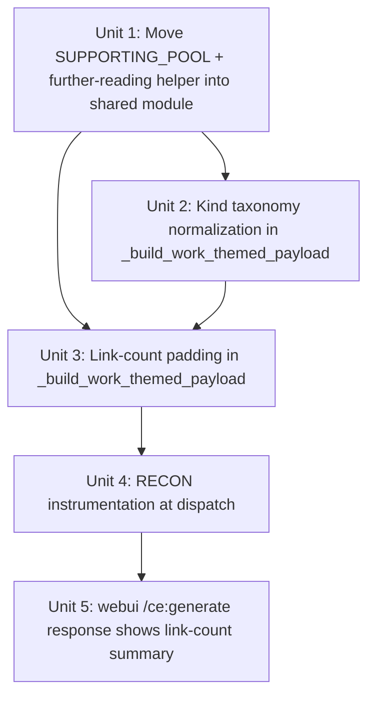

# fix: work-themed dispatch branch must emit 6-8 links

## Overview

`plan-backlinks` dispatches each row through one of three branches. The **work-themed branch** (triggered when `get_three_url_config(config, main_domain) is not None`, i.e. operator configured the target via the three-URL form / `target_upgraded_to_threeurl` path) emits a fixed **3-link payload** from `work_themed_generator.render_work_themed_article`. Downstream `schema.py:143` rejects any row whose link count is outside `[6, 8]`. Operator-visible error in webui: `请检查链接数量是否在 6-8 个之间`.

Make the work-themed branch satisfy the same 6-8 invariant the long-form branch satisfies via `_build_links` + `_build_link_density_paragraph` — without redesigning the work-themed body template (3 narrative paragraphs around 3 path-specific anchors), and without breaking the existing schema kind taxonomy.

## Problem Frame

Operator publishes a target via the three-URL config (homepage form / anchor-keywords path). Each generated article ends up with `links: [main_domain, list, work]` — exactly 3. `validate-backlinks` rejects every row. The webui displays the 6-8 error message and the operator cannot ship.

Compounding issue: the work-themed branch's emitted `kind` values include `"list"` and `"work"` which do not exist in `schema.LINK_KINDS = {main_domain, target, supporting, extra, category, detail}`. The schema validator does not enforce kind membership today (it only counts), but the divergence will surface as soon as any future consumer reads `kind`.

The long-form branch (`_generate_payload` → `_build_links`) already pads up to 8 candidates with 5 hardcoded supporting URLs (Wikipedia/MDN/Stack Overflow/GitHub/HN) and reaches the 6-8 range reliably. The fix is to bring the work-themed branch into the same invariant — by extension of pattern, not by reimplementation.

## Requirements Trace

- R1. Every payload emitted by `_plan_work_themed_row` must have `len(payload["links"]) ∈ [6, 8]` (satisfies `schema.py:143`).
- R2. The 3 path-specific anchors (`cfg.main_url`, `cfg.list_url`, `work_url`) remain in the link set with their anchor text intact (work-themed SEO value preserved).
- R3. The rendered `content_markdown` body MUST contain the URL strings of every link in `links[]` as plain text or markdown — so existing `verify_publish` / link-presence checks pass downstream.
- R4. The `kind` value on every emitted link MUST be a member of `schema.LINK_KINDS` (no `"list"` / `"work"` slipping through).
- R5. The webui `/ce:generate` response surfaces the link count + breakdown ("M 主要 / K 辅助") to the operator before they hit publish — closes the rejection feedback loop.
- R6. RECON-level log emits the link count + branch identity at dispatch time, so operators can see in real time which branch fired and whether it cleared the 6-8 invariant.

## Scope Boundaries

- **Out:** redesigning `work_themed_generator`'s 3-paragraph body template. The path-specific anchor placement stays as-is.
- **Out:** per-locale supporting URL pools (zh-CN / ru / en pools). Plan reuses the existing English supporting pool from `_build_links`. Per-locale pools are a future P2 enhancement once V1 stabilizes the link count.
- **Out:** changing the 6-8 range to be operator-configurable. Hard-coded at `schema.py:143` matches the user's stated preference; configurability is YAGNI.
- **Out:** reachability gate for the supporting URLs in the work-themed path. The 5 hardcoded URLs all pass `content_fetch.verify_urls_batch()` post-PR-#34 (verified live). If a future supporting URL is added that doesn't pass, scope a follow-up to add the gate then.
- **Out:** the zh-CN short branch (`_plan_zh_short_row`) — separate dispatch path with its own link assembly. The same root cause may apply but verification is deferred to a sibling plan.
- **Out:** mutating `published.jsonl` schema or `validate-backlinks` 6-8 check. They stay exactly as today.

## Context & Research

### Relevant Code and Patterns

- **`src/backlink_publisher/cli/plan_backlinks.py:_dispatch_row()`** (~line 1248-1286): three-path dispatch. Work-themed branch returns at line 1275 without falling through to `_generate_payload`. This is where the bug originates.
- **`src/backlink_publisher/cli/plan_backlinks.py:_build_work_themed_payload()`** (~line 1187-1245): wraps `work_themed_generator.render_work_themed_article` output into the standard payload schema. Currently passes `links: rendered["links"]` unmodified.
- **`src/backlink_publisher/work_themed_generator.py:render_work_themed_article()`** (~line 184-233): emits exactly 3 links with kinds `main_domain`, `list`, `work`.
- **`src/backlink_publisher/cli/plan_backlinks.py:_build_link_density_paragraph()`** (~line 408+): existing pattern — when `_build_links` count falls short, this helper appends a "Further reading" paragraph containing the missing URLs. Reuse pattern for work-themed.
- **`src/backlink_publisher/cli/plan_backlinks.py:_build_links()` supporting list** (~line 354-360): the 5 hardcoded supporting URLs and their anchors. Single source of truth — reuse, don't duplicate.
- **`src/backlink_publisher/schema.py:LINK_KINDS`** (line 48): the canonical taxonomy. Work-themed currently violates it silently.
- **`src/backlink_publisher/schema.py:141-144`**: the 6-8 count gate.
- **`webui.py:/ce:generate`** route (~line 3011-3110): currently displays `plans_list` rendered as JSONL preview; no link-count summary.
- **`webui.py:3119`**: the user-facing error message `"验证失败，请检查链接数量是否在 6-8 个之间"` — the symptom operators see.

### Institutional Learnings

- `docs/solutions/best-practices/recon-log-level-for-always-on-signals-2026-05-15.md`: RECON level bypasses `--log-level` and is the right channel for "operator must see" events. Use `log.recon('link_count_at_plan', ...)` per branch.
- `docs/solutions/best-practices/standalone-page-vs-retrofit-webui-2026-05-15.md`: webui.py is 4904 lines; banner-count addition is additive (~30 lines), not retrofit. Acceptable.
- `docs/solutions/best-practices/stream-to-needed-tag-not-cap-then-reject-2026-05-15.md`: anti-pattern when defensive gates fire on real, well-formed inputs. The 6-8 schema gate doing the rejecting here IS the right gate — the bug is upstream (work-themed undercounts), not the gate itself.
- `docs/plans/2026-05-12-004-fix-target-link-density-minimum-six-plan.md`: prior plan that addressed the **target-site density** (A+B+C ≥ 6 hyperlinks pointing to main_domain/target). Separate concern: that plan ensured ≥6 links **to the target**; this plan ensures `len(links[]) ∈ [6, 8]` **total**. Both invariants must hold.
- `docs/plans/2026-05-13-005-feat-three-url-config-plan.md` (if exists) / `2026-05-13-anchor-profile-scheduler-requirements.md`: defines the three-URL config that triggers the work-themed branch.
- The five hardcoded supporting URLs (Wikipedia, MDN, Stack Overflow, GitHub, Hacker News) are tech-centric. They pass reachability for any topic but are topically irrelevant to non-tech blogs. Documented limitation; per-locale pools deferred.

### External References

Skipped — codebase grounding is complete. The dispatch branch divergence is a local bug + a local pattern reuse.

## Key Technical Decisions

| Decision | Rationale |
|---|---|
| **Pad work-themed payload to 7 links via the existing supporting pool** (target = midpoint of 6-8, leaves 1-slot headroom on both sides) | Reuses `_build_links`'s 5-URL supporting list as a module-level constant moved into a shared helper. No new pool, no per-locale complexity, no API change to `work_themed_generator`. Padding count = `7 - len(rendered_links)` = 4 supporting URLs per article. |
| **Inject supporting URLs both into `links[]` AND into a "Further reading" appendix paragraph in `content_markdown`** | Mirrors `_build_link_density_paragraph` precedent. R3 requires URLs to appear in body text so `verify_publish`'s link-presence check passes downstream. |
| **Map work-themed's `"list"` / `"work"` to `category` / `target` in the existing `LINK_KINDS` taxonomy** | Minimum-impact compatibility fix. No schema change, no LINK_KINDS expansion, no downstream readers to teach. `main_url → main_domain`, `list_url → category`, `work_url → target`. The user-facing distinction "主要 / 辅助" derives from kind at display time, not from schema. |
| **User-facing "主要 vs 辅助" classification is display-only, NOT a schema field** | `main = {main_domain, target}`; `auxiliary = {supporting, extra, category, detail}`. Pure presentation concern. webui computes the split inline. No schema migration. |
| **RECON instrumentation in `_dispatch_row` emits one event per branch entry** | `log.recon('link_count_at_plan', branch=<work_themed|zh_short|long_form>, count=N, target=<main_domain>)`. Bypasses `--log-level` so operators see it in cron logs. Per `recon-log-level-for-always-on-signals`. |
| **webui surfaces link count + main/auxiliary breakdown in `/ce:generate` response** | Adds a banner-style summary line above the existing plans-list preview: `"📊 X 个链接 (M 主要 + K 辅助)"`. Catches mismatches before publish. ~30 lines of additive template change, no retrofit of the form god-file. |
| **Hard-code 6-8 range (no operator config)** | Matches user's stated preference. Schema-level gate stays. Per-site configurability is YAGNI until at least one operator asks. |
| **Pad to exactly 7, not "to whatever ≥ 6"** | Deterministic count is friendlier to soak-test assertions and operator expectations. 7 sits in the middle of [6, 8] so a future small drop (e.g., one supporting URL fails reachability gate when added) stays in-range. |

## Open Questions

### Resolved During Planning

- **Where does the 3-link cap originate?** `work_themed_generator.render_work_themed_article` hardcodes the 3-element list at line 228-232. Confirmed by inline read. (No work_themed_generator API change needed — padding happens in `_build_work_themed_payload`.)
- **Is the 6-8 rule configurable?** No — hard-coded at `schema.py:143`. Plan preserves that.
- **Should padding apply to the zh-CN short branch too?** Out of V1 scope; same fix shape applies but verification is a sibling plan. Document the divergence.
- **Are the 5 hardcoded supporting URLs reachable?** Verified live post-PR-#34 — all pass the streaming `_read_html_head_window` gate.
- **What `kind` values should `list_url` / `work_url` map to?** `category` and `target` respectively — closest semantic match to existing taxonomy. `main_url` → `main_domain` (already correct).

### Deferred to Implementation

- **Exact phrasing of the "Further reading" appendix paragraph in each language (en/zh-CN/ru)** — mirror the existing `_build_link_density_paragraph` per-language templates. Pick natural phrasing during implementation.
- **Whether to deduplicate when an operator's `extra_urls` overlaps with the 5 hardcoded supporting URLs** — unlikely in practice; if it happens, dedupe by URL string. Implementer decides if this needs explicit handling vs natural set behavior.
- **webui badge styling** — match the existing pending/failed badge CSS in the resume banner. Implementer reads `webui.py:730` for the precedent.

## High-Level Technical Design

> *This illustrates the intended approach and is directional guidance for review, not implementation specification. The implementing agent should treat it as context, not code to reproduce.*

### Dispatch + padding flow (work-themed branch)

```
_dispatch_row(row, ...)
  ├─ three_url_cfg = get_three_url_config(config, main_domain)
  ├─ if three_url_cfg is not None:
  │     for payload in _plan_work_themed_row(row, three_url_cfg, count=N):
  │       └─ payload = _build_work_themed_payload(...)
  │            ├─ rendered = render_work_themed_article(...)   # returns 3 links
  │            ├─ links = _normalize_kinds(rendered["links"])  # NEW: list→category, work→target
  │            ├─ pad_count = TARGET_LINK_COUNT - len(links)   # NEW: 7 - 3 = 4
  │            ├─ if pad_count > 0:
  │            │   supporting = SUPPORTING_POOL[:pad_count]    # NEW
  │            │   links.extend({url, anchor, kind="supporting"} for ...)
  │            │   content_markdown += "\n\n" + _build_further_reading_paragraph(supporting, language)  # NEW
  │            ├─ log.recon('link_count_at_plan', branch='work_themed', count=len(links), target=main_domain)  # NEW
  │            └─ return payload with links of length 7
  │     yield each payload
```

### Link kind taxonomy (display-time main/auxiliary split)

| `kind` (schema) | Display group | Source |
|---|---|---|
| `main_domain` | 主要 | always present in work-themed and long-form |
| `target` | 主要 | from work-themed `work_url`, or row's `target_url` in long-form |
| `category` | 辅助 | from work-themed `list_url`, or `url_categories[main_domain].category` in long-form B/C modes |
| `detail` | 辅助 | from `url_categories[main_domain].detail` in long-form C mode |
| `extra` | 辅助 | from `row.extra_urls[:2]` in long-form |
| `supporting` | 辅助 | from the 5-URL hardcoded pool, used for padding in both branches |

## Implementation Units



- [ ] **Unit 1: Extract shared supporting pool + further-reading paragraph helper into a shared module**

**Goal:** Both long-form `_build_links` and work-themed `_build_work_themed_payload` need access to the same 5-URL supporting list + the same "Further reading" paragraph builder. Today the list is inlined inside `_build_links` (`plan_backlinks.py:354-360`) and the paragraph helper is `_build_link_density_paragraph` (line 408+). Extract both into a module-private shared section at the top of `plan_backlinks.py` (or a sibling `link_padding.py` if the implementer prefers) so neither branch duplicates.

**Requirements:** R1, R3 (prerequisites; this unit doesn't enforce the count itself).

**Dependencies:** None — pure refactor.

**Files:**
- Modify: `src/backlink_publisher/cli/plan_backlinks.py` (consolidate the 5-URL pool + further-reading helper into a clearly-marked module-level section; long-form's `_build_links` calls into the shared pool)
- Test: `tests/test_plan_backlinks_supporting_pool.py` (new)

**Approach:**
- Define `_SUPPORTING_POOL: tuple[tuple[str, str], ...]` at module level, with the 5 (url, anchor) pairs currently duplicated/inlined.
- Define `_build_further_reading_paragraph(supporting: list[dict], language: str) -> str` — wraps the supporting links in a natural-prose appendix in en/zh-CN/ru. Lift the existing per-language phrasing from `_build_link_density_paragraph` where it overlaps; reuse, don't reword.
- Update `_build_links` to consume `_SUPPORTING_POOL` (replaces the inline list at line 354-360). Behavioral diff: zero — same URLs in same order.
- Constants for plan-wide padding target: `_TARGET_LINK_COUNT = 7` (midpoint of [6, 8], leaves 1-slot headroom both sides).

**Patterns to follow:**
- `_build_link_density_paragraph` per-language template style (en/zh-CN/ru).
- Module-level CONSTANT_NAME convention used throughout `plan_backlinks.py`.

**Test scenarios:**
- Happy path: `_SUPPORTING_POOL` exposes 5 (url, anchor) tuples; identities match the pre-refactor inlined list exactly.
- Happy path: `_build_further_reading_paragraph(<3-link list>, 'en')` returns a paragraph containing all 3 URLs in markdown link syntax `[anchor](url)`.
- Happy path: same for `'zh-CN'` and `'ru'` — language-correct prose.
- Edge case: `_build_further_reading_paragraph([], 'en')` returns empty string (no paragraph for zero links).
- Regression: `_build_links` output for a long-form row is bytewise identical to pre-refactor (capture a baseline payload, diff after refactor).

**Verification:**
- `_build_links` long-form behavior unchanged.
- Pool + helper now importable from a single source within the module.

- [ ] **Unit 2: Normalize work-themed link kinds to schema.LINK_KINDS**

**Goal:** Map work-themed's emitted `"list"` / `"work"` kinds to `category` / `target` (schema-valid) before they leave the payload builder. Closes the silent schema-invariant violation (R4).

**Requirements:** R4.

**Dependencies:** Unit 1 (uses shared module structure).

**Files:**
- Modify: `src/backlink_publisher/cli/plan_backlinks.py` (`_build_work_themed_payload`)
- Test: `tests/test_plan_backlinks_work_themed_kinds.py` (new)

**Approach:**
- Add a private `_KIND_REMAP_WORK_THEMED = {"list": "category", "work": "target", "main_domain": "main_domain"}` at module level.
- In `_build_work_themed_payload`, before returning, walk `rendered["links"]` and substitute `link["kind"] = _KIND_REMAP_WORK_THEMED.get(link["kind"], link["kind"])`. Preserves unknown kinds (defensive).
- Do NOT modify `work_themed_generator.render_work_themed_article` itself. The remap lives in the payload-builder boundary, keeping `work_themed_generator` a pure formatter.
- Add an assertion (or unit test) that every emitted `kind` is in `schema.LINK_KINDS` — fails loudly during dev if the taxonomy drifts again.

**Patterns to follow:**
- Defensive remap dict pattern (similar precedents in `config.py` for url_mode resolution).
- Schema gate enforcement at adapter boundary (mirrors `validate-backlinks` approach).

**Test scenarios:**
- Happy path: payload from work-themed contains links with kinds `{main_domain, category, target}` (not `{main_domain, list, work}`).
- Happy path: every link's `kind` is in `schema.LINK_KINDS`.
- Edge case: an unrecognized incoming kind (e.g., a future `work_themed_generator` addition) is preserved as-is and surfaces in the schema-membership assertion.
- Edge case: remap is idempotent — applying it twice produces the same result.
- Regression: payload's `content_markdown` is unchanged (kind remap is metadata-only).

**Verification:**
- Schema.LINK_KINDS membership holds for every link in work-themed payloads.
- Downstream consumers (validate-backlinks, publish-backlinks) see kinds they recognize.

- [ ] **Unit 3: Pad work-themed payload to 7 links + append "Further reading" paragraph**

**Goal:** Bring work-themed payload link count from 3 → 7 (within the schema's [6, 8] gate), preserving the 3 path-specific anchors and adding 4 supporting URLs both to `links[]` and to the rendered body via the shared helper.

**Requirements:** R1, R2, R3.

**Dependencies:** Unit 1 (shared pool + paragraph helper), Unit 2 (kinds normalized first so the supporting padding doesn't fight a downstream remap).

**Files:**
- Modify: `src/backlink_publisher/cli/plan_backlinks.py` (`_build_work_themed_payload`)
- Test: `tests/test_plan_backlinks_work_themed_padding.py` (new)
- Test: `tests/test_plan_backlinks.py` (extend with an end-to-end work-themed integration assertion)

**Approach:**
- Inside `_build_work_themed_payload`, after kind normalization (Unit 2): compute `pad_count = _TARGET_LINK_COUNT - len(links)`.
- If `pad_count > 0`, take `_SUPPORTING_POOL[:pad_count]`, build `{url, anchor, kind: "supporting"}` records, extend `links[]`.
- Call `_build_further_reading_paragraph(supporting_added, language)` and append the result to `rendered["content_markdown"]`. The body must contain the URL strings of every added link in markdown anchor syntax `[anchor](url)` (R3 — `verify_publish` looks for URL substrings in body).
- Never exceed `_TARGET_LINK_COUNT`. Never drop a path-specific link.
- Idempotency edge: if `len(links) > _TARGET_LINK_COUNT` already (impossible today but defensive), do not trim — let `schema.py:143` handle the > 8 case at validate-time.

**Patterns to follow:**
- `_build_links` supporting-padding pattern at lines 351-369 (the long-form precedent).
- `_build_link_density_paragraph` injection pattern (line 408+) — same shape of "append paragraph to body when count is short."

**Test scenarios:**
- Happy path: a work-themed payload with `rendered_links_count = 3` ends up with `len(payload["links"]) == 7`.
- Happy path: the 3 original anchors (`main_url`, `list_url`, `work_url`) are preserved in `links[]`.
- Happy path: 4 new supporting links appear with `kind == "supporting"` and URLs from `_SUPPORTING_POOL[:4]`.
- Happy path: `payload["content_markdown"]` contains all 4 supporting URLs as markdown anchors `[anchor](url)`.
- Happy path: `payload["content_markdown"]` length grows by a "Further reading" paragraph (en/zh-CN/ru depending on row.language).
- Edge case: `rendered_links_count == 7` already (hypothetical future work_themed_generator change) — no padding applied, no body change, payload returned unmodified.
- Edge case: `_SUPPORTING_POOL` shorter than `pad_count` (impossible with current pool of 5, but defensive) — append whatever is available, then the row reaches validate-backlinks and gets rejected loudly with the existing 6-8 message.
- Integration: a work-themed row → `_build_work_themed_payload` → JSON-roundtrip → `validate-backlinks --no-check-urls` → row passes the 6-8 gate.
- Integration: a work-themed row goes through the full pipeline (plan → validate → publish dry-run) and `published.jsonl` output shows `len(links) == 7` with the expected kinds.

**Verification:**
- Every work-themed payload has 7 links.
- `validate-backlinks` accepts work-themed rows that previously rejected.
- Body contains the URL strings of all 7 links (so `verify_publish`'s link-presence check passes when the post lands).

- [ ] **Unit 4: RECON instrumentation at `_dispatch_row`**

**Goal:** Make link-count + branch identity an always-on RECON signal so operators see in real time which branch fired and what count the article got — closing the diagnostic-feedback loop the user explicitly asked for (R6).

**Requirements:** R6.

**Dependencies:** Unit 3 (recon emits the post-padded count).

**Files:**
- Modify: `src/backlink_publisher/cli/plan_backlinks.py` (`_dispatch_row` + payload-yielding sites in each branch)
- Test: `tests/test_plan_backlinks_recon.py` (new — uses a recon-capture fixture in the existing test conftest pattern)

**Approach:**
- At each yield point in `_dispatch_row` (work-themed branch yields N payloads; zh-short and long-form yield 1 each), emit:
  - `log.recon("link_count_at_plan", branch=<work_themed|zh_short|long_form>, count=len(payload["links"]), main_domain=<row.main_domain>, kinds=<sorted list of unique kinds>)`.
- The event name `link_count_at_plan` is greppable; the `branch` field is the diagnostic primary key.
- Do NOT modify `recon` itself or the log format; just call it consistently across branches.

**Patterns to follow:**
- Existing RECON callsites in `plan_backlinks.py` (search for `log.recon(`) — match argument style + naming convention.
- `recon-log-level-for-always-on-signals-2026-05-15.md` solutions entry — what makes an event RECON-worthy (operator must always see it).

**Test scenarios:**
- Happy path: a work-themed row yields a payload AND emits exactly one `link_count_at_plan` recon event with `branch="work_themed"`, `count=7`.
- Happy path: a long-form row yields a payload AND emits one recon event with `branch="long_form"`, `count` matching the post-padding `_build_links` output.
- Happy path: a zh-CN short row emits `branch="zh_short"` with whatever count that branch produces (out of scope to fix here, but the recon makes it observable).
- Edge case: a work-themed branch that yields 3 payloads (3 work_urls) emits 3 recon events.
- Edge case: a row that fails `_ContentGateRowFailure` in long-form does NOT emit `link_count_at_plan` (only successful yields).

**Verification:**
- `log.recon` callsites at each `_dispatch_row` branch's yield point.
- Recon output visible in stderr/cron mail regardless of `--log-level`.

- [ ] **Unit 5: webui `/ce:generate` response surfaces link-count + main/auxiliary breakdown**

**Goal:** Operator sees "📊 X 个链接 (M 主要 + K 辅助)" in the webui generate-step response, before they hit publish. Closes the user-feedback loop so a mismatch surfaces in the UI, not as a downstream validate-backlinks rejection (R5).

**Requirements:** R5.

**Dependencies:** Unit 3 (so the count is in-range; surfacing pre-padded count would mislead).

**Files:**
- Modify: `webui.py` (`/ce:generate` route handler ~line 3011-3110; the HTML template constant for the plans-preview block)
- Test: `tests/test_webui_link_count_summary.py` (new — mirror existing webui test pattern)

**Approach:**
- After `plans_list = [json.loads(line) for line in plans.split("\n") if line]`, compute per-plan: `link_count = len(plan["links"])`, `main_count = sum(1 for l in plan["links"] if l["kind"] in {"main_domain", "target"})`, `aux_count = link_count - main_count`.
- Pass `plan_summaries: list[dict]` into the template context (alongside existing `plans_list`).
- Template addition: a `<div class="link-summary-banner">` above the existing plans-list preview, listing per-plan summaries: `"文章 1: 📊 7 个链接 (2 主要 + 5 辅助)"`. Style mirrors the existing resume banner badge CSS in `webui.py:730`.
- No new route, no new template file. ~30 lines additive to the existing template constant — banner-count style per `standalone-page-vs-retrofit-webui-2026-05-15` solutions entry.

**Patterns to follow:**
- Existing resume banner rendering at `webui.py:730` (badge style + inline computation).
- The `_render(HTML, ...)` invocation pattern at `webui.py:/ce:generate` route's return statement — extend with the new context key.

**Test scenarios:**
- Happy path: GET `/ce:generate` response after a 7-link plan shows `📊 7 个链接 (2 主要 + 5 辅助)` (or equivalent — exact UI string set during impl).
- Happy path: a multi-row generate (3 plans from work-themed branch) shows 3 separate per-plan summaries.
- Edge case: a plan with 0 links (impossible after Unit 3 but defensive) shows `0 个链接 (0 主要 + 0 辅助)` without crashing.
- Edge case: the existing validation-error display (line 3119 `请检查链接数量是否在 6-8 个之间`) still fires if a plan somehow falls outside the range — the new summary doesn't suppress it.
- Edge case: zh-CN UI vs en UI — the banner string respects the operator's `target_language` or webui locale (or just hard-codes 中文 per current webui convention).

**Verification:**
- Banner appears above the plans-preview after a successful generate.
- Counts match the actual payload `links[]` content.
- No regression in the existing plans-preview layout.

## System-Wide Impact

- **Interaction graph:** `_dispatch_row` (work-themed branch) → `_build_work_themed_payload` (Units 2 + 3) → payload → `validate-backlinks` (schema.py:143 gate, unchanged) → `publish-backlinks` (adapter, unchanged) → `verify_publish` (URL-presence check in body, unchanged but now satisfied by R3's body-injection). `_dispatch_row` (every branch) → `log.recon` (Unit 4). `webui.py:/ce:generate` → response template (Unit 5).
- **Error propagation:** unchanged. `validate-backlinks` still rejects rows outside [6, 8]; with Unit 3 in place, work-themed rows no longer trigger that rejection. Existing `_ContentGateRowFailure` path (long-form only) is untouched.
- **State lifecycle risks:** none. Plan-time only — no checkpoint schema, no published.jsonl schema, no state persistence changes.
- **API surface parity:** `work_themed_generator.render_work_themed_article`'s return shape is unchanged. `_build_work_themed_payload`'s OUTPUT shape gains a longer `links[]` (3 → 7) and longer `content_markdown` (with appended paragraph) — both within the existing field types. Downstream consumers (validate, publish, webui display) accept the larger payloads without code change.
- **Integration coverage:** Unit 3's integration scenario (full pipeline plan → validate → publish dry-run) is the cross-layer assurance. Unit 5's webui test exercises the CLI → webui template rendering path. Unit 4's recon assertion is captured via the existing test fixture for log events.
- **Unchanged invariants:**
  - `schema.LINK_KINDS` membership set: unchanged. Work-themed remap (Unit 2) brings the branch back into compliance, but the set itself does not grow.
  - `schema.py:141-144` 6-8 range: unchanged.
  - `work_themed_generator.render_work_themed_article` body template: unchanged (3-paragraph + 3-anchor narrative preserved).
  - `_build_links` long-form behavior: unchanged (Unit 1 is a no-diff refactor).
  - `published.jsonl` stdout output format: gains longer body + more link records, but no new fields.
  - zh-CN short branch (`_plan_zh_short_row`): unchanged. Same root cause may affect it — verification deferred to a sibling plan.

## Risks & Dependencies

| Risk | Mitigation |
|------|------------|
| Supporting URLs are tech-centric (Wikipedia/MDN/Stack Overflow/GitHub/HN); for a non-tech target the appended "Further reading" paragraph reads as topically random | Documented V1 limitation; Unit 5's webui banner surfaces the actual URLs so operators can spot mismatch. Per-locale / per-topic pools are a P2 follow-up. |
| Body length grows by a paragraph + 4 markdown anchor lines | ~200-400 bytes added per article. Negligible against Medium/Blogger body limits. `verify_publish`'s body fetch (post-PR-#34 streaming) handles it. |
| zh-CN short branch still emits 3 links and remains broken after V1 | Documented as out-of-scope. Same fix shape can be replayed in a sibling plan once V1 stabilizes. Until then, zh-CN short operators see the same `请检查链接数量是否在 6-8 个之间` error. |
| Operator already configured `extra_urls` overlapping the supporting pool (e.g., `extra_urls=[stackoverflow.com]`) → duplicate URL in `links[]` | Implementation should dedupe by URL string at the end of `_build_work_themed_payload`. Listed in Deferred to Implementation. |
| RECON event volume — 1 event per yielded payload × N work_urls per row × M rows per run | Bounded by batch size (already cron-budget-aware). Recon goes to stderr, not a remote sink; volume is operator-local. Acceptable. |
| Test fixtures use synthetic data (`example.com` etc); pre-existing checkpoints in `~/.cache` contain test data that gets surfaced if the operator inspects | Pre-existing condition; out of this plan's scope. The 1657 stale checkpoints in `~/.cache` are noted in the Blogger 5xx plan's threat model. |

## Documentation / Operational Notes

- After Unit 5 ships, update `README.md` operator-runbook section: "the webui now shows link counts before publish; if you see < 6, you've hit a known limitation in the zh-CN short branch (separate plan)."
- Companion `docs/solutions/` entry: "Alternate dispatch branches must satisfy schema invariants the long-form path enforces" — sanitized lesson capturing this category of bug (taxonomy: `best-practices/`). Defer to a follow-up PR after PR #33 lessons-kit merges, per origin/AGENTS.md dual-track convention.
- This plan stacks behind PR #33 (lessons-kit) and PR #34 (content_fetch stream) and the in-flight Blogger 5xx plan (`2026-05-15-002`). It does NOT depend on the Blogger 5xx changes — different module. Recommended branch: `fix/work-themed-link-count` cut from `main` once PR #33 and PR #34 merge.
- After Unit 4 (RECON), operators can monitor cron output for `link_count_at_plan` events. Suggested grep: `journalctl ... | jq 'select(.msg == "link_count_at_plan" and .count < 6)'` (if structured JSON logs are wired to journald downstream).

## Sources & References

- Related code: `src/backlink_publisher/cli/plan_backlinks.py` (`_dispatch_row`, `_build_work_themed_payload`, `_build_links`, `_build_link_density_paragraph`); `src/backlink_publisher/work_themed_generator.py:render_work_themed_article`; `src/backlink_publisher/schema.py:48` (LINK_KINDS), `:141-144` (6-8 gate); `webui.py:/ce:generate` (~3011-3110).
- Related plan: [docs/plans/2026-05-12-004-fix-target-link-density-minimum-six-plan.md](../plans/2026-05-12-004-fix-target-link-density-minimum-six-plan.md) — prior plan that addressed target-site density (A+B+C ≥ 6). Complementary, not overlapping.
- Related plan: [docs/plans/2026-05-15-002-feat-blogger-5xx-recovery-via-sentinel-plan.md](../plans/2026-05-15-002-feat-blogger-5xx-recovery-via-sentinel-plan.md) — current Blogger work; same operator-RECON discipline, no code-overlap.
- Institutional learnings: `docs/solutions/best-practices/recon-log-level-for-always-on-signals-2026-05-15.md`, `docs/solutions/best-practices/standalone-page-vs-retrofit-webui-2026-05-15.md`, `docs/solutions/best-practices/stream-to-needed-tag-not-cap-then-reject-2026-05-15.md`.
