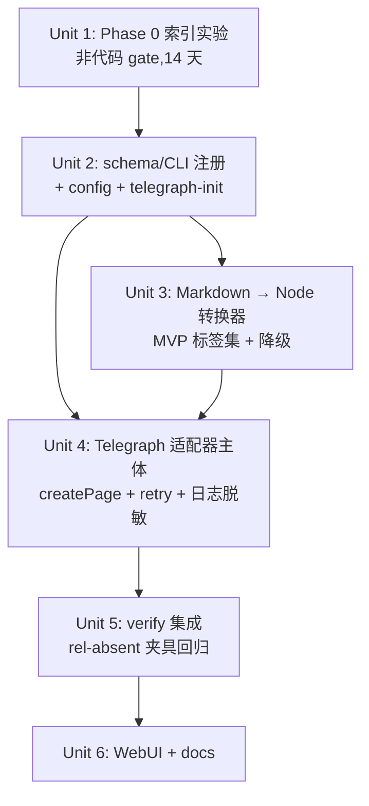

# feat: Telegraph 适配器(REST + Markdown→Node 转换器,含 Phase 0 索引前置门)

## Overview

把 `telegra.ph` 作为新发布平台接入项目矩阵:官方 REST API,本地 `access_token`,Markdown→Telegraph Node 树转换(MVP 标签集),复用现有 `verify_publish` + `link_attr_verifier` 后置校验链。先以 Phase 0 手工索引实验作为前置门(14 天等待),达标后才进入代码实现。

接入完成后,运营者可用 `--platform telegraph` 跑通 `publish-backlinks` → `verify` 闭环,与 `blogger` / `medium` 平台同框使用。

**两个独立成功时间窗,不要混为一谈**:
- **Phase 0 gate(14 天)**:`≥7/10 页面被 Google 索引` 且 `10/10 页面外链保持 rel 缺省 / dofollow`(整数门槛,见 Unit 1)
- **上线后 30 天**:`≥70% 页面被索引` 且 `≥50% 在目标站 GSC 作为 referring URL 出现` 且 `100% 抽样保持 dofollow`(见 Documentation 段的 day-30 retro 报告)

## Problem Frame

现有平台仅 `blogger` 与 `medium`,扩量需新增低摩擦发布渠道。`telegra.ph` 官方 REST API 稳定、零审核,2026-05-15 单页实测外链 `rel=null`(dofollow) + `target=_blank`,具备 backlink 价值。但"dofollow 持续性"与"被 Google 索引"两项关键假设建立在 N=1 样本上 —— Phase 0 前置门把这两项升级为可证伪实验,达标后才进入工程实现。

(see origin: `docs/brainstorms/2026-05-15-telegraph-adapter-requirements.md`)

## Requirements Trace

- **R1** — `SUPPORTED_PLATFORMS` 加 `"telegraph"`;CLI / schema 识别该 platform 值 → Unit 2
- **R2** — `AdapterResult` 字段语义对齐(`status` ∈ `{published, failed}`、`draft_url=""`、`platform="telegraph"`、`adapter="telegraph-api"`) → Unit 4
- **R3** — 经过 `verify_publish` + `link_attr_verifier` 后置校验,失败 `status="failed"` → Unit 5
- **R4** — 通过 `createPage` 发布,鉴权用本地 token → Unit 4
- **R5a** — MVP 标签集 `a/p/h3/ul/ol/li/b/em/strong/br`;未支持标签降级为 `p` 包裹纯文本,记录降级条数 → Unit 3
- **R6** — `telegraph-init` 子命令调 `createAccount` 并持久化 token(0600) → Unit 2
- **R7** — 4xx/5xx 沿用 `retry.py` 现策略(仅重试 429,5xx fail-fast) → Unit 4
- **R12** — 行为继承,见 System-Wide Impact"Unchanged invariants"段(checkpoint 跳过已发布 row 是 publish_backlinks 主流程现行行为,本 plan 无代码修改)
- **R14** — 凭证缺失/失效错误信息含具体修复命令(`Run: telegraph-init`) → Unit 2、Unit 4
- **R15** — WebUI 平台下拉新增 `telegraph` 选项(数据源 `SUPPORTED_PLATFORMS`,无 in-webui 登录) → Unit 6
- **R17** — 日志脱敏 `access_token` → Unit 4
- **Success Criteria** — Phase 0 索引率 ≥70%、30 天 dofollow 100% 保持 → Unit 1(Phase 0 gate)
- **Success Criteria(辅助)** — `--platform telegraph` 跑通 plan→publish→verify;p95 <3s — Unit 4 / Unit 5

## Scope Boundaries

- **不做** R5b 扩展标签集(`i/u/s/blockquote/code/pre/hr/img/figure/figcaption`)—— 仅 V1 上线 4 周后根据降级日志命中率评估
- **不做** Telegraph 多账号/多 `short_name` 切换
- **不做** `editPage` 自动覆盖(重跑跳过已发布行)
- **不做** in-webui 登录面板
- **不做** checkpoint 内容 hash 感知(另开 brainstorm)
- **不做** 凭证旋转/keychain 集成 —— 沿用 0600 plaintext JSON,与 Blogger OAuth 平齐
- **5xx fail-fast** —— 不引入新重试逻辑
- **不做** 异步/并发发布优化 —— 单条同步,与现有平台一致

## Context & Research

### Relevant Code and Patterns

- **`src/backlink_publisher/adapters/base.py`** —— `AdapterResult` 数据类(`status` / `platform` / `adapter` / `draft_url` / `published_url` / `error` / `_provider_meta`);所有适配器统一返回结构
- **`src/backlink_publisher/adapters/blogger_api.py`** —— 最近模板:REST + 本地 token + `retry_transient_call` 包装 + `DependencyError` 错误信息含修复命令。Telegraph 适配器结构与之高度同构(差异只在认证机制与请求形态)
- **`src/backlink_publisher/adapters/retry.py`** —— `RETRYABLE_HTTP_STATUSES = frozenset({429})`;`retry_transient_call(callable, ...)` 包装重试栈;不修改
- **`src/backlink_publisher/verify_publish.py`** —— 发布后获取 published_url 的 HTML 校验 target 链接存在;通过即 `published`,否则保留 `_unverified` 后缀(planning 已对齐:Telegraph 沿用此约定)
- **`src/backlink_publisher/adapters/link_attr_verifier.py`** —— `verify_link_attributes(url)` 返回 `{verification, total_anchors, blank_anchors, nofollow_anchors, nofollow_detected, ...}`。**已确认 rel 缺省不触发 nofollow 警报(`_REL_VALUE_RE` 只在 `rel="..."` 含 "nofollow" 时匹配)**,Telegraph 无需扩展
- **`src/backlink_publisher/markdown_utils.py`** —— `render_to_html(md)` 已提供 md→html 输出(基于 markdown-it,启用 `table`、`strikethrough`)。Telegraph 转换器复用此函数,后接 html→Node 树转换器 + 标签白名单过滤
- **`src/backlink_publisher/config.py`** —— `Config` 数据类、`blogger_token_path` 属性、`load_blogger_token` / `save_blogger_token`;Telegraph 完全对齐此模式
- **`src/backlink_publisher/schema.py:26`** —— `SUPPORTED_PLATFORMS = {"blogger", "medium"}`;新增 `"telegraph"`
- **`src/backlink_publisher/cli/publish_backlinks.py`** —— `--platform` choices 列表(L387、L539);CLI dispatch 表;`_MEDIUM_ADAPTERS` 等平台特定常量按需扩展
- **`src/backlink_publisher/cli/plan_backlinks.py`** —— `--platform` choices(L1487-1489)
- **`src/backlink_publisher/errors.py`** —— `DependencyError`(凭证/依赖缺失) vs `ExternalServiceError`(平台返回错)
- **`webui.py`** —— 平台选择数据源:planning 阶段确认其从 `SUPPORTED_PLATFORMS` 读取还是硬编码;若硬编码则改为统一数据源
- **`fixtures/`** —— 现有夹具集中存放;Telegraph 转换器测试夹具按此约定放置

### Institutional Learnings

- **`docs/solutions/`** 中 `feedback_api-idempotency-lesson` 相关条目(已在 2026-05-15 publish-idempotency brainstorm 中引用):**5xx 不重试**因服务端可能已 commit。Telegraph `createPage` 无客户端幂等键,沿用 fail-fast。
- **现有 `medium-browser` 适配器**经验:外部 API/UI 易变,先做端到端最小调用;Telegraph 端到端已在调研阶段完成(已验证 createAccount + createPage + 实测 rel)。
- **`AGENTS.md`(项目根)**:lessons 双轨制(私有 memory + 公开 `docs/solutions/`);本 plan 实施期间产生的非平凡 lesson 由 operator 在收尾时手工 `/ce:compound` 走一遍。

### External References

- **Telegraph API**(`https://telegra.ph/api`)—— 已 fetch,核心方法 `createAccount(short_name, author_name?, author_url?)`、`createPage(access_token, title, content[Node], author_name?, author_url?, return_content?)`、`editPage(access_token, path, title, content, ...)`、`revokeAccessToken(access_token)`。内容 64KB 上限。Node 形态:`{tag, attrs:{href|src}, children}` 或 string。

## Key Technical Decisions

- **Markdown→Node 用 md→html→Node 二级转换,不写独立 AST 访问器**:理由 —— `markdown_utils.py` 的 `render_to_html` 已是项目标准 md 渲染管线,二级转换器只需 HTML 解析 + 标签白名单 + Node 形态映射;不引入第二条 markdown 解析路径。HTML 解析用标准库 `html.parser`(零依赖;**Python 3.5+ 后已不抛 `HTMLParseError`,容忍畸形输入**,本 plan 依赖白名单 + 字节预算双重防御)。
- **未知标签用"unwrap-and-recurse"而非"collapse-to-text"**:理由 —— `markdown_utils.render_to_html` 会输出 `<h1>/<h2>/<blockquote>/<table>/<hr>//<s>/<code>/<pre>` 等非白名单标签;若按"collapse-to-text"降级,嵌套在 `<table><a>...</table>` 中的 backlink 链接会被吃掉,直接破坏发布价值。**改为:遇到非白名单标签时丢弃标签本身,继续递归其子节点**,使 `<a>` 在任何外层标签里都能存活到 Node 输出。"collapse-to-text"仅在 `<a>` 自身被丢弃(无 `href` / 不合法 scheme)时启用。
- **`<a>` href URL scheme 白名单**:`http` / `https` / `mailto` / `tel`;其他(`javascript:` / `data:` / `vbscript:` / `file:` ...)→ 丢 `<a>` 标签、保留文本、`downgrades += 1`。防御:即使输入源未来变成不可信(WebUI 自由输入、第三方爬取),Telegraph 平台不会成为 XSS / open-redirect 的 sink。
- **`<a>` 上的 `target` / `rel` 属性丢弃**:`markdown_utils` 默认在 `<a>` 上加 `target=_blank rel=noopener`,但 Telegraph Node `attrs` schema 仅接受 `{href, src}` —— 转换器只保留 `href`。Phase 0 已确认 telegra.ph 自身在渲染时注入 `target=_blank`,无需我们干预。
- **错误码匹配用 case-insensitive substring,且未识别错误记 WARN**:理由 —— Telegraph 官方文档未枚举 error 字符串清单,运营在生产环境遇到真实变体(`ACCESS_TOKEN_REVOKED` / `INVALID_ACCESS_TOKEN` 大小写差异)时,WARN 日志能反馈给后续 plan 迭代。
- **HTTP 客户端用 `requests`**:理由 —— 已是项目依赖(`>=2.28`),`blogger_api` 通过 `googleapiclient` 间接走它,Telegraph REST 是简单 POST `application/x-www-form-urlencoded`,不需要 `httpx`/`gql`。
- **未支持标签降级为 `p` 包裹纯文本而非抛错**:理由 —— backlink 文章核心价值是 `<a>` 链接被保留;`<table>` / `<code>` 等非核心标签丢失不应阻塞发布;但需要记录降级条数到 `_provider_meta`,运营可观察降级率决定 R5b 是否值得做。
- **`telegraph-init` 显式触发,不在首次 publish 时自动 createAccount**:与 `blogger-init` OAuth 风格对齐;运营路径可预测。
- **token 持久化 0600 plaintext JSON,与 Blogger OAuth 平齐**:威胁模型已在 origin 文档中明确(单 operator 本地机器、信任 root/同 uid);Telegraph token 长期有效,泄露后须运营手动调 `revokeAccessToken`(`telegraph-init --rotate` 子命令延后到 R5b 同期再做,本 plan 仅文档化)。
- **Phase 0 作为 Unit 1 的非代码 gate,产出 markdown 数据报告**:理由 —— Phase 0 实验由运营手工执行 + 等 14 天,工程不应阻塞;但 plan 仍以 Unit 1 形式跟踪,作为 Unit 2-6 的前置依赖。报告失败即停止本 plan。

## Open Questions

### Resolved During Planning

- **Markdown→Node 实现路径**(origin Deferred):md→html→Node 二级,复用 `markdown_utils.render_to_html`;HTML 解析用标准库 `html.parser`(注:Python 3.5+ 已移除 `HTMLParseError`,parser 容忍畸形输入)
- **`link_attr_verifier` 对 rel 缺省的处理**(origin Deferred):**无需扩展**。`_REL_VALUE_RE`(`adapters/link_attr_verifier.py:19-21`)只在 `rel="..."` 内匹配 nofollow;rel 属性不存在时 `nofollow_anchors=0` / `nofollow_detected=False`,自动判定为 dofollow。Unit 5 添加一条夹具测试明示此行为以防回归。**注**:`verify_publish.py` 主流程**不**做 rel 判定(只校验 title 与 target_url 出现在页内);link_attr_verifier 是独立模块,由 adapter 在 publish 成功后单独调用并把结果落进 `_provider_meta`(参考 `blogger_api.py` / `medium_api.py` 的现行调用方式,Unit 4 实现时对齐)
- **HTTP 客户端选择**(origin Deferred):复用 `requests`(已是依赖)
- **5xx 行为**:fail-fast,无 retry,与 Blogger/Medium 一致(沿用 `retry.py` 现策略);`requests.exceptions.Timeout` / `ConnectionError` 同样**不**重试
- **`telegraph-init` 作为新的独立 entrypoint**:加入 `pyproject.toml` `[project.scripts]`,与现有 `plan-backlinks` / `publish-backlinks` 平行(项目无 umbrella CLI,Blogger 也无独立 `blogger-init` —— Blogger 在 `_build_credentials` 内联 OAuth)
- **日志脱敏**:`src/backlink_publisher/logger.py:_SENSITIVE_KEYS` 已包含 `access_token` / `authorization` / `token`,**无需修改 logger.py**;Unit 4 仅需保证所有 token-bearing 字段通过 `extra=` 传入而非 f-string 拼接,即可获得既有脱敏
- **`docs/TELEGRAPH_SETUP.md`**:与 `MEDIUM_OAUTH_SETUP.md` 平级,作为独立运营手册新建(Unit 6 不再"看 PR review 决定")

### Deferred to Implementation

- Telegraph API 在并发请求或畸形 Node 树时的具体错误码(`error` 字段值):实测决定 `DependencyError` vs `ExternalServiceError` 划分细则
- `html.parser` 在 GFM 表格 / 嵌套深度极大的输入下的稳定性:Unit 3 中遇到具体边界再处理(默认降级为 `p`)
- WebUI 平台数据源(`SUPPORTED_PLATFORMS` 直接读还是硬编码):Unit 6 现场确认 `webui.py` 当前实现并对齐 R15

## High-Level Technical Design

> *以下示意"发布一条 row"在 Telegraph 适配器内的调用形态与 Node 转换的高层结构,作为代码评审参考方向,非实现规范。*

```
publish_backlinks dispatcher
   ├── platform="telegraph" → adapters/telegraph_api.py::publish(row, config)
   │
   ├── 1. Build access_token from config.telegraph_token_path
   │       └─ 缺失 → DependencyError("Run: backlink-publisher telegraph-init")
   │
   ├── 2. Markdown → Telegraph Node tree
   │       row.body_md
   │         → markdown_utils.render_to_html(md)            # 复用
   │         → html.parser HTMLParser walker
   │         → emit Node tree:
   │             allowed tags (a, p, h3, ul, ol, li, b, em, strong, br)
   │             → {tag, attrs:{href} when <a>, children:[…]}
   │             dropped tags
   │             → wrap inner text in {tag:"p", children:["…"]}
   │             increment _provider_meta["downgrades"]
   │
   ├── 3. retry_transient_call(POST https://api.telegra.ph/createPage, ...)
   │       payload: access_token, title, content (JSON), author_name, author_url
   │       4xx ≠ 429 → AdapterResult(status="failed", error=...)
   │       429 / 网络瞬时 → retry per retry.py
   │       5xx → AdapterResult(status="failed")
   │
   ├── 4. Success → AdapterResult(
   │           status="published",
   │           published_url=result.url,
   │           _provider_meta={path, downgrades, ...})
   │
   └── 5. publish_backlinks 主流程后置 → verify_publish + link_attr_verifier
           rel=null → nofollow_detected=False(已确认)→ 通过
```

转换器关键不变量:
- 任何输入(含未支持标签、空段落、无 alt 图片)不抛错,最坏降级为 `p` 包裹纯文本
- `<a href="...">` 必须保留,否则发布无意义(转换器自检:如果输入 md 含 `[text](url)` 但输出 Node 树无 `tag:"a"`,记 ERROR 但不阻塞发布,留 verify_publish 兜底拒收)

## Implementation Units



- [ ] **Unit 1: Phase 0 索引前置门(非代码,gate)**

**Goal:** 验证 telegra.ph 外链 dofollow 持续性与 Google 索引可达性达到门槛,否则停止后续工程实现。

**Requirements:** Success Criteria 主指标

**Dependencies:** 无

**Files:**
- Create: `docs/phase0/2026-05-15-telegraph-indexation-report.md`(实验记录 + 结果)

**Approach:**
- 运营执行 origin 文档 Phase 0 中 P0-1 ~ P0-6 的全部步骤(10 个页面、不同 TLD/链接密度、7 天/14 天/21 天三次复查)
- P0-6 同时手工 baseline dev.to / hashnode 一个对照页
- **velocity 子实验(防"低量看似 OK,生产量翻车")**:其中 3 个页面在 24h 内连发,21 天后单独核对其 rel 与索引状态
- 报告字段:每页 URL、发布时 rel、7/14/21 天 rel、14 天 `site:` + GSC referring URL 注册、对照平台同期数据、velocity 子实验结果
- **达标线(整数硬门槛,不留模糊空间)**:
  - `indexed_pages_at_day14 >= 7`(10 中 ≥7 被 Google 索引)
  - `dofollow_retained_pages_at_day21 == 10`(10/10 三周后仍保持 rel 缺省/dofollow)
  - velocity 子实验 3/3 同样满足以上条件
  - 三者皆为 AND;边界值(6/10、9/10)算 Fail 而非 close-enough
- **相对竞争门槛**:若 dev.to/hashnode baseline 14 天索引率 ≥ telegraph + 15pp,标记 `relative_underperformance=true` 并触发"是否优先换平台"的 brainstorm followup(不直接 Fail,但作为 Unit 2-6 启动前的 sign-off 输入)
- 报告 PR 需运营 owner 显式 approve 才能 merge;14 天等待期内**禁止** Unit 2-4-5-6 分支 push 到 origin(本地探索不限);Unit 3(纯函数转换器、无 Telegraph 运行时依赖)可与 Phase 0 并行开发 —— 见 Unit 3 Execution note
- 不达标即本 plan `status=paused`,产出 brainstorm followup

**Execution note:** 非代码 gate。Unit 3 可与本 unit 并行启动以节约 14 天等待时间(纯函数,无平台依赖);Unit 2/4/5/6 严格阻塞至本 unit Pass。

**Test scenarios:**
- Test expectation: none —— Phase 0 是工作流前置门,验证手段为运营报告,非代码测试

**Verification:**
- `docs/phase0/2026-05-15-telegraph-indexation-report.md` 存在并标记 `Pass` 或 `Fail`
- 若 Pass,本 plan 余下 unit 解锁;若 Fail,本 plan `status` 改为 `paused` 并产出 brainstorm followup

---

- [ ] **Unit 2: schema/CLI 注册 + config 与 `telegraph-init` 子命令**

**Goal:** Telegraph 平台进入项目 schema、CLI、配置层。`telegraph-init` 子命令完成首次账号铸造与 token 持久化。

**Requirements:** R1、R6、R14

**Dependencies:** Unit 1 通过

**Files:**
- Modify: `pyproject.toml`(`[project.scripts]` 加 `telegraph-init = "backlink_publisher.cli.telegraph_init:main"`,与 `plan-backlinks` / `publish-backlinks` 等现有 entrypoints 平级)
- Modify: `src/backlink_publisher/schema.py`(`SUPPORTED_PLATFORMS` 加 `"telegraph"`;`validate_*` 中可能存在的 platform 显式分支同步更新)
- Modify: `src/backlink_publisher/cli/publish_backlinks.py`(`--platform` choices L387、L539 加 `telegraph`;错误提示文本)
- Modify: `src/backlink_publisher/cli/plan_backlinks.py`(`--platform` choices L1487 加)
- Modify: `src/backlink_publisher/config.py`(新增 `TelegraphConfig` dataclass:`short_name` / `author_name` / `author_url` / `token_path`;`Config.telegraph_token_path` 属性,默认 `~/.config/backlink-publisher/telegraph-token.json`;`load_telegraph_token(path) -> dict | None`、`save_telegraph_token(data, path)`,函数签名与 `*_blogger_token` 同形。`token_path.parent` 创建时 `chmod 0o700`,文件本身 `chmod 0o600`。Token JSON 结构 `{"access_token": str, "short_name": str, "author_name": str, "author_url": str}`)
- Create: `src/backlink_publisher/cli/telegraph_init.py`(新独立 entrypoint,`main()` 函数)
- Modify: `config.example.toml`(新增 `[telegraph]` 段示例,值留空)
- Test: `tests/test_telegraph_config.py`(token 持久化、0600 文件权限、0700 父目录权限、缺失/损坏文件回退)
- Test: `tests/test_cli_telegraph_init.py`(子命令调 `createAccount` 写 token,token 已存在不重复创建)

**Approach:**
- `telegraph-init`:读 `[telegraph]` 段(若缺,提示 `Add [telegraph] short_name=... to config.toml`);若 token 文件已存在则报"已存在,如需重置请用 `telegraph-init --force` 或先 `--revoke` 旧 token";POST `https://api.telegra.ph/createAccount`(form-urlencoded);成功后写 token 文件(0600)+ 父目录(0700)
- **顺手加 `telegraph-init --revoke`(成本极低)**:从本地 token 文件读 `access_token`,POST `https://api.telegra.ph/revokeAccessToken`,成功后删本地文件。避免 Unit 6 runbook 让运营手工 `curl -d access_token=<token>` 把 token 写进 shell history
- 错误提示语模式 `Run: telegraph-init`(项目 entrypoint 直接是命令名,无 umbrella CLI)

**Patterns to follow:**
- `src/backlink_publisher/config.py:load_blogger_token` / `save_blogger_token`(写盘 + 权限位 + 损坏文件回退)
- 现有 `[project.scripts]` 中 `plan-backlinks = "backlink_publisher.cli.plan_backlinks:main"` 的 entrypoint 形态

**Test scenarios:**
- Happy path: 调 `telegraph-init` → mock `createAccount` 返回 token → 校验 token 文件存在、内容正确、权限 0600
- Edge case: token 文件已存在 → 不重复 createAccount;`--force` 时强制重铸
- Error path: `createAccount` 返回 `{ok:false}` → 子命令以非零退出 + stderr 输出 API 错误
- Error path: `[telegraph] short_name` 缺失 → 提示 `Add [telegraph] short_name=... to config.toml` 并非零退出
- Edge case: token 文件存在但 JSON 损坏 → `load_telegraph_token` 返回 `None`,publish 路径报 `DependencyError("Run: backlink-publisher telegraph-init")`
- Happy path: `--platform telegraph` 通过 schema 校验,不被 schema.py 中"unsupported platform"分支拦截

**Verification:**
- `pytest tests/test_telegraph_config.py tests/test_cli_telegraph_init.py` 全绿
- `backlink-publisher telegraph-init` 在本地实跑一次:`~/.config/backlink-publisher/telegraph-token.json` 出现且 `stat -f '%Lp'` 显示 `600`

---

- [ ] **Unit 3: Markdown → Telegraph Node 树转换器(R5a MVP)**

**Goal:** 把 row 的 Markdown 正文转成 Telegraph 接受的 Node 树 JSON,仅支持 MVP 标签集,其他标签降级为 `p` 包裹纯文本并计数。

**Requirements:** R5a

**Dependencies:** Unit 2(用 `markdown_utils.render_to_html` 已存在;此 unit 不依赖 telegraph adapter 主体)

**Files:**
- Create: `src/backlink_publisher/adapters/telegraph_node.py`(转换器主体 + 单元测试可调用接口)
- Test: `tests/test_telegraph_node.py`
- Create: `fixtures/telegraph_node/`(若干 .md + 期望 .json 对照夹具)

**Approach:**
- 公开接口:`markdown_to_telegraph_nodes(md: str) -> tuple[list[Node], dict[str, int]]`,`stats = {"downgrades": int, "anchors": int, "utf8_bytes": int, "downgrades_by_tag": dict[str, int]}`
- 流水线:`render_to_html(md)` → `html.parser.HTMLParser` 子类遍历(`handle_starttag` + `handle_startendtag` 都要实现,处理 `<br/>` / `` 自闭合形式)→ 栈式 Node 树构建 → 标签白名单过滤
- 白名单:`{a, p, h3, ul, ol, li, b, em, strong, br}`
- **非白名单标签 = unwrap-and-recurse**:丢弃标签本身,**保留并递归其子节点**,`downgrades += 1` 且 `downgrades_by_tag[tag] += 1`。这样 `<table><tr><td>x <a href=…>link</a></td></tr></table>` 输出 `[{tag:"p", children:["x ", {tag:"a", attrs:{href:…}, children:["link"]}]}]` —— `<a>` 在任何外层标签里都能存活
- **`<a>` 自身降级 = collapse-to-text**:无 `href` 或 href scheme 不在 `{http, https, mailto, tel}` 白名单 → 丢标签、保留文本、`downgrades_by_tag["a"] += 1`
- **`<a>` 上的 `target` / `rel` 属性丢弃**:Telegraph attrs 仅接受 `{href, src}`;`markdown_utils` 默认输出的 `target=_blank rel=noopener` 在转换器内静默剥离(转换器测试加显式断言)
- **Children 是 string 或 Node**:文本节点直接作为字符串塞入父节点 `children`;`{tag:"p", children:["Hello ", {tag:"a", ...}, "."]}` 是合法形态(对齐 Telegraph Node 规范)
- **UTF-8 字节预算**:返回前 `stats["utf8_bytes"] = len(json.dumps(nodes, ensure_ascii=False).encode("utf-8"))`;Unit 4 在调 API 前依据此预检(>60KB 直接 `failed`,留 5% 安全裕量,避免 Telegraph 64KB 上限触发的浪费 API 调用 + 浪费 checkpoint 行)
- 嵌套深度上限 30(经验值,大幅高于真实 markdown 输出深度但够防御 pathological 输入),溢出 → 整篇降级为单 `p`
- 输入为空字符串 → 返回 `([], {"downgrades":0,"anchors":0,"utf8_bytes":0,"downgrades_by_tag":{}})`,Unit 4 据此判定空输入并 `status="failed"` 不调 API

**Patterns to follow:**
- `markdown_utils.py` 的纯函数风格(无 IO、无日志副作用);转换器把日志/计数交给调用方处理
- `fixtures/` 现有"输入-期望"夹具命名

**Test scenarios:**
- Happy path: `Visit [our site](https://example.com/x) now.` → `[{tag:"p", children:["Visit ", {tag:"a", attrs:{href:"https://example.com/x"}, children:["our site"]}, " now."]}]`,`anchors=1`、`downgrades=0`、`stats["a"]` not in downgrades_by_tag
- Happy path: 多级列表 + bold + em 混合 → 期望 JSON 与夹具完全一致(夹具 ≥3 份)
- Happy path: `<a href=x target=_blank rel=noopener>foo</a>` 风格输入(markdown_utils 默认输出) → 输出 `{tag:"a", attrs:{href:"x"}, children:["foo"]}`(target / rel 字段被剥离)
- Edge case: 空 markdown → `([], {"downgrades":0,"anchors":0,"utf8_bytes":0,"downgrades_by_tag":{}})`
- Edge case(unwrap 关键):`<table><tr><td>cell with [link](https://example.com)</td></tr></table>` —— `<table>/<tr>/<td>` 全部 unwrap-and-recurse,内层 `<a>` 保留;最终输出含 `{tag:"a", attrs:{href:"https://example.com"}, ...}`;`downgrades_by_tag` 含 `table` / `tr` / `td` 各 1,**不**含 `a`
- Edge case: 含 `<h1>` / `<h2>` / `<h4>` / `<h5>` / `<h6>` —— 全 unwrap-and-recurse(只有 `h3` 在白名单);内文 + 内联标签保留
- Edge case: 含 `<blockquote>` / `<hr>` —— unwrap-and-recurse
- Edge case: 含 `` —— unwrap(无子树,alt 文本作为 text 子节点保留),`downgrades_by_tag["img"] += 1`
- Edge case: 链接嵌入 em(`*[link text](url)*`)—— `<em>` 在白名单中,内层 `<a>` 保留,期望 `{tag:"em", children:[{tag:"a", attrs:{href}, children:["link text"]}]}`
- Edge case: 链接无 href(`<a></a>`、`<a href="">`)—— `<a>` 自身 collapse-to-text(只此一种情况是 collapse,非 unwrap),`downgrades_by_tag["a"] += 1`
- **Security**: `<a href="javascript:alert(1)">x</a>` → `<a>` collapse-to-text,`downgrades_by_tag["a"] += 1`;`data:` / `vbscript:` / `file:` 同样处理
- Edge case: 嵌套深度 35 的人造输入 → 整篇降级为单 `p`,`downgrades >= 1`
- Happy path: CJK 纯中文 5000 汉字输入 → `stats["utf8_bytes"]` ≈ 15KB;接近上限的中文夹具(50KB+ md 源)→ `stats["utf8_bytes"]` 真实反映 UTF-8 后字节数
- Happy path: `<br/>` 与 `<br>` 两种形式都通过 `handle_startendtag` / `handle_starttag` 路径产出 `{tag:"br"}`
- Edge case: 畸形 HTML(未闭合标签)—— `html.parser` 静默容忍(Python 3.5+ 已无 `HTMLParseError`);转换器靠白名单 + 深度上限防御,最终至少输出一个合法 Node 或空列表,**不**抛异常

**Verification:**
- `pytest tests/test_telegraph_node.py` 全绿
- 夹具集覆盖 R5a 白名单全部 10 标签的"出现"与"未出现"两种用例

---

- [ ] **Unit 4: Telegraph 适配器主体(`telegraph_api.py`)**

**Goal:** 把 row 经 Unit 3 转换得到的 Node 树通过 `createPage` 发到 Telegraph,返回 `AdapterResult`;接入 `retry.py`、日志脱敏、`DependencyError` 信息友好。

**Requirements:** R2、R3(主路径,verify 后置由 Unit 5)、R4、R7、R14、R17

**Dependencies:** Unit 2、Unit 3

**Files:**
- Create: `src/backlink_publisher/adapters/telegraph_api.py`
- Test: `tests/test_telegraph_adapter.py`
- Modify: `src/backlink_publisher/cli/publish_backlinks.py`(dispatch 表加 telegraph)
- **注:`src/backlink_publisher/logger.py` 不需修改**;`_SENSITIVE_KEYS` 已包含 `access_token` / `authorization` / `token`(见 `logger.py:32-44`)。本 unit 只需保证所有 token-bearing 字段通过 `extra=dict(access_token=...)` 形态传入 logger,既有脱敏机制自动覆盖

**Approach:**
- 公开接口:`def publish(row: dict, config: Config) -> AdapterResult`(与 `blogger_api.publish` 同形)
- 步骤:
  1. `token = load_telegraph_token(config.telegraph_token_path)`;`None` → `raise DependencyError("Telegraph token missing at <path>. Run: telegraph-init")`(注意:**异常消息含 token 文件路径,不含 token 值**)
  2. `nodes, stats = markdown_to_telegraph_nodes(row["body_md"])`
  3. **预检 UTF-8 字节预算**:`stats["utf8_bytes"] > 60_000` → `AdapterResult(status="failed", error=f"content_exceeds_budget: {stats['utf8_bytes']}B > 60KB safety threshold")`,不调 API
  4. payload form:`access_token`、`title=row["title"]`、`author_name=config.telegraph.author_name`、`author_url=config.telegraph.author_url`、`content=json.dumps(nodes, ensure_ascii=False)`、`return_content=false`
  5. 包装函数:
     ```python
     def _call() -> requests.Response:
         r = requests.post("https://api.telegra.ph/createPage", data=payload, timeout=15)
         if r.status_code in RETRYABLE_HTTP_STATUSES:
             r.raise_for_status()  # 触发 HTTPError,被 is_retryable 识别
         return r
     ```
     调用:`retry_transient_call(_call, is_retryable=lambda e: isinstance(e, requests.exceptions.HTTPError) and e.response is not None and e.response.status_code in RETRYABLE_HTTP_STATUSES, adapter="telegraph-api")`
     —— `Timeout` / `ConnectionError` 不在 `is_retryable` 中 → fail-fast(与 5xx 一致语义)
  6. 解析 JSON;`ok=true` → `AdapterResult(status="published", platform="telegraph", adapter="telegraph-api", published_url=result.url, _provider_meta={"path": result.path, "downgrades": stats["downgrades"], "anchors": stats["anchors"], "utf8_bytes": stats["utf8_bytes"], "downgrades_by_tag": stats["downgrades_by_tag"]})`
  7. `ok=false` → **case-insensitive substring** 归类:`"access_token" in error.lower()` 或 `"invalid" in error.lower() and "token" in error.lower()` → `DependencyError("Telegraph token rejected (<error_str>). Run: telegraph-init --force")`;`"content" in error.lower() and ("big" in error.lower() or "size" in error.lower() or "long" in error.lower())` → 非重试 `ExternalServiceError`;**其他未识别错误一律 WARN 日志记录原文(`extra=dict(error_string=...)`,通过既有脱敏)+ 归 `ExternalServiceError`**,便于后续根据真实生产数据迭代分类
- 日志脱敏:依赖既有 `logger.py:_redact_in_place`。**约束**:
  - token 字段一律通过 `extra=dict(access_token=...)` 形态,**禁止 f-string 拼接**(f-string 输出会进 `record.getMessage()`,不走 _redact_in_place)
  - **禁止 `log.warn(response.text)` / `log.error(response.json())` 整体输出**(响应体可能回显 token);只 log 显式字段如 `extra=dict(ok=False, error=resp.get("error"))`
  - `DependencyError.message` 引用 token 文件路径而非 token 值
- 现有 platform 分支审计:Unit 4 实现前 grep `platform ==` / `_MEDIUM_ADAPTERS` / `is_medium` / `is_blogger` 全清单,逐条确认 telegraph 是否走 else 分支(default Blogger 路径)是符合预期的;若发现需要 telegraph 特定分支(如 verify max_wait 调整),作为 Unit 4 内联 diff 一并提

**Patterns to follow:**
- `src/backlink_publisher/adapters/blogger_api.py`(整体结构:从 config 取 token、`retry_transient_call` 包装、错误分类、`AdapterResult` 构造、`_provider_meta` 用法)
- `src/backlink_publisher/adapters/medium_api.py`(REST + JSON 解析的错误码识别)

**Test scenarios:**
- Happy path: row 含 `target_url`,转换+发布成功,返回 `AdapterResult(status="published", published_url="https://telegra.ph/Foo-05-15", _provider_meta.anchors >= 1, _provider_meta.utf8_bytes > 0)`
- Happy path: `_provider_meta["downgrades_by_tag"]` 在多 `<table>` 输入下含 `{"table": N, ...}`,但 `status` 仍 `published`
- Error path: token 文件缺失 → `DependencyError`,消息含 token 文件路径 + `Run: telegraph-init`(**不**含 token 值)
- Error path: API 返回 `{ok:false, error:"ACCESS_TOKEN_INVALID"}`(及大小写/措辞变体 `INVALID_ACCESS_TOKEN` / `access_token invalid` / `ACCESS_TOKEN_REVOKED`)→ `DependencyError`,消息含 `Run: telegraph-init --force`
- Error path: API 返回 `{ok:false, error:"CONTENT_TOO_BIG"}`(及变体 `CONTENT TOO BIG` / `content_too_long`)→ `AdapterResult(status="failed", error="CONTENT_TOO_BIG")`,不重试
- Error path: API 返回未识别 error(如 `{ok:false, error:"FLOOD_WAIT"}`)→ WARN 日志记录原文 + `AdapterResult(status="failed", error="FLOOD_WAIT")`,不重试
- Error path: 转换器预检 `utf8_bytes > 60KB` → `status="failed", error="content_exceeds_budget: ..."`,**不调 API**
- Error path: 网络 5xx → `_call` 内 `raise_for_status` 不触发(只对 429 触发),`requests` 不抛 → 解析 JSON 失败或 `ok=false` 路径接管;`requests.exceptions.ConnectionError` / `Timeout` → fail-fast(`is_retryable=False`),`status="failed"`
- Error path: 429 → `_call` 内 `raise_for_status` 触发 `HTTPError`,被 `is_retryable` 命中 → 走 `retry_transient_call` 重试若干次,达上限 → `status="failed"`
- Edge case: row 缺 `body_md`(空字符串)→ `AdapterResult(status="failed", error="empty body after conversion")`,不调 API
- Integration: 日志脱敏 —— 用 `caplog` 抓取本 unit 全部 INFO/WARN/ERROR/DEBUG 记录,断言:(a) 真实 token 字符串不出现在任何 `record.getMessage()`;(b) 真实 token 字符串不出现在任何 `record.args` 或 `record.extra` 反查中;(c) 所有 4xx / 5xx / 网络异常分支都被该断言覆盖
- Integration: `_MEDIUM_ADAPTERS` 等平台特定常量集合不被 telegraph 误中 —— 枚举 `publish_backlinks.py` 中**全部 4 个**判定点(L119、L253、L326、L759),逐点断言 `result.adapter="telegraph-api"` 不被包入

**Verification:**
- `pytest tests/test_telegraph_adapter.py` 全绿
- 用项目根 `test-pipeline.sh`(或等价) 跑一条 `--platform telegraph --dry-run`(若有 dry-run 路径)成功

---

- [ ] **Unit 5: rel-absent 行为锁定回归测试(no production code change)**

**Goal:** 把"rel 属性缺省 = dofollow"的 `link_attr_verifier` 行为锁进测试夹具,防止未来 verifier 重构时静默改变 Telegraph 适配器的判定路径。**本 unit 不修改任何生产代码**;`verify_publish.py` 与 `link_attr_verifier.py` 现行行为已经满足 Telegraph 需求(planning 阶段读源确认)。

**Requirements:** R3(锁定回归保证)

**Dependencies:** Unit 4

**Files:**
- **不修改任何 src/ 文件**(planning 阶段已 grep `rel=` / `nofollow` 全清单,确认 `link_attr_verifier.py:_REL_VALUE_RE` 是项目内唯一的 rel 判定逻辑,`verify_publish.py` 仅做 title + target_url 子串校验,不读 rel)
- Test: `tests/test_link_attr_verifier_rel_absent.py`(新增,锁定 rel 缺省 = dofollow)
- Test: `tests/test_telegraph_e2e_verify_chain.py`(新增,mock 一份真实 telegraph 页 HTML,跑完整 adapter publish → verify_publish → link_attr_verifier 三步链,断言 `AdapterResult.status="published"`,无 `_unverified` 后缀)

**Approach:**
- 回归夹具(单元级):HTML 片段 `<a href="https://example.com/x" target="_blank">target</a>`(无 rel 属性)直接调 `verify_link_attributes` → 返回 `{verification:"ok", total_anchors:1, blank_anchors:1, nofollow_anchors:0, nofollow_detected:false}`
- E2E 链(集成级):mock `requests.get` 返回真实 telegraph 页风格 HTML;运行 Unit 4 `publish()` → 跑完整发布链 → 断言最终 `AdapterResult.status="published"` 且 `_provider_meta.nofollow_detected=False`
- planning grep 复核:实施 unit 5 前,运行 `rg -n 'rel=|nofollow|getAttribute.*rel|anchor\.rel'` 在 `src/` 内,确认无第二个 rel 判定路径;若发现新增路径(可能在 Unit 4 PR 期间被其他人引入),即扩展本 unit 测试以覆盖

**Patterns to follow:**
- `tests/` 现有 `verify_publish` 测试的 mock 形态

**Test scenarios:**
- Happy path(回归锁定):rel 缺省 + `target=_blank` → `verify_link_attributes` 返回 `nofollow_detected=False`
- **Integration(端到端真值)**:mock 一份真实 telegraph 页 HTML → Unit 4 `publish()` 全链跑 → `AdapterResult.status="published"`(不含 `_unverified` 后缀)且 `_provider_meta` 中 nofollow 不被触发

**Verification:**
- 两份新测试全绿
- `link_attr_verifier.py:_REL_VALUE_RE` 不改;若 Unit 4 实施过程中发现需改动,补 plan addendum 并扩展本 unit 测试

---

- [ ] **Unit 6: WebUI 平台下拉、CLI 帮助文案与文档**

**Goal:** WebUI 展示 telegraph 选项;运营文档(`README.md` / `README.zh.md` / `config.example.toml`)说明 `telegraph-init` 流程与 token 失效响应路径。

**Requirements:** R15、R14(凭证泄漏响应路径 runbook)

**Dependencies:** Unit 2、Unit 4

**Files:**
- Modify: `webui.py`(平台下拉源:planning 阶段读 `SUPPORTED_PLATFORMS`;若硬编码则改为统一数据源)
- Modify: `README.md`、`README.zh.md`(新增 "Telegraph 平台" 章节:`telegraph-init` 调用、token 失效与 revoke runbook、Phase 0 报告引用)
- Modify: `config.example.toml`(确认 Unit 2 已加 `[telegraph]` 段示例)
- Create: `docs/TELEGRAPH_SETUP.md`(运营手册,与现有 `docs/MEDIUM_OAUTH_SETUP.md` 平级,decided now —— 不再放 PR review 决定)

**Approach:**
- WebUI:确认 `webui.py` 当前平台数据源;若硬编码列表 → 改为从 `SUPPORTED_PLATFORMS` import;若已从 schema.py 读 → 无代码改动,仅文档
- README runbook 内容:`telegraph-init` 使用、token 文件路径、`telegraph-init --force` 重铸提示、`revokeAccessToken` 手工调用方法(curl 命令示例)
- Phase 0 报告链接到 README 让运营在使用前先核对 gate 是否通过

**Test scenarios:**
- Happy path:WebUI 启动后下拉显示 `blogger / medium / telegraph` 三项
- Edge case:`SUPPORTED_PLATFORMS` 未来增删平台时 WebUI 自动跟随(无硬编码)—— 通过 import 关系保证,测试可省略
- Test expectation:WebUI 部分目测验证;runbook 内容由 PR review 把关,无自动化测试

**Verification:**
- 本地启动 WebUI(`启动 WebUI.command` 或 `python webui.py`)看到 telegraph 选项
- README 两个语种均含 Telegraph 章节
- `config.example.toml` 含 `[telegraph]` 示例

---

## System-Wide Impact

- **Interaction graph:**
  - `cli/publish_backlinks.py` dispatch 表:`platform="telegraph"` → `adapters/telegraph_api.publish`;现有 `_MEDIUM_ADAPTERS` / `is_medium` 等平台特定判定(L119、L264-280)**不应**误包 telegraph,Unit 4 验证
  - `verify_publish.py` 后置链:Telegraph 不需要 platform 特定分支;若发现需要(如 telegra.ph CDN 传播延迟导致首次 404),Unit 5 阶段加 retry interval 调整
- **Error propagation:**
  - `DependencyError`(token 缺失/失效) → 调用方 → publish_backlinks 主流程:不进入 retry,直接以 `failed` 写 checkpoint,运营手动修复后重跑
  - `ExternalServiceError`(API 5xx / 业务错) → 同上,fail-fast
  - 转换器降级(`downgrades > 0`):不抛错,仅 `_provider_meta` 计数,运营在 checkpoint 报告中可见
- **State lifecycle risks:**
  - 重复发布:`createPage` 无客户端幂等键,但本 plan R12 通过"已发布跳过"在调度层兜底;Unit 4 不引入新风险
  - token 文件并发写:Unit 2 单进程写盘,与 `blogger-init` 一致,无并发问题
- **API surface parity:**
  - 不修改 `AdapterResult` 结构,与 `blogger`/`medium` 平台并存
  - 不修改 `verify_publish` 公开接口
- **Integration coverage:**
  - Unit 4 + Unit 5 提供 mock 级跨层测试;实地端到端发一篇 telegraph(Phase 0 报告已涵盖)在 V1 上线前作为人工 smoke 步骤
- **Unchanged invariants:**
  - `retry.py:RETRYABLE_HTTP_STATUSES = {429}` 不变
  - `SUPPORTED_PLATFORMS` 仅新增 `"telegraph"`,不动 `"blogger"`/`"medium"`
  - `verify_publish.py` / `link_attr_verifier.py` 行为不变(planning 已确认 rel 缺省天然 dofollow;无第二个 rel 判定路径)
  - `logger.py:_SENSITIVE_KEYS` 不变(已含 `access_token` / `authorization` / `token`,Telegraph 复用)
  - `_MEDIUM_ADAPTERS` 集合不变(telegraph 不入此集合;4 个判定点 L119/L253/L326/L759 全部测试覆盖)
  - **R12 幂等性**(checkpoint 跳过已发布 row):由 publish_backlinks 主流程**现行行为**承载,本 plan 不动该路径

## Risks & Dependencies

| Risk | Mitigation |
|------|------------|
| Phase 0 索引率不达标(<70%) | Unit 1 gate 阻塞 Unit 2-6;运营改回 brainstorm 评估换平台(dev.to / hashnode) |
| Phase 0 dofollow 在 14 天后被服务端回填 nofollow | Unit 1 gate 强制 P0-3 复查;若发现,本 plan `status=paused` 并产出 brainstorm followup;V1 上线后 30 天抽样校验作为持续门 |
| Telegraph API 在交付期内破坏式变更 | API 8 年稳定,概率极低;若发生 → Unit 4 适配器单点修复,影响面隔离 |
| Markdown→Node 转换器在生僻输入下产出非法 Node 树 | Unit 3 夹具集 + 嵌套深度上限 + 全降级兜底;Unit 4 `createPage` 失败时 `status=failed`,verify_publish 不会误判为 published |
| token 文件泄漏 | Unit 2 强制 0600;Unit 6 runbook 记录 `revokeAccessToken` 调用方法;V1 不引入 keychain,与 Blogger OAuth 平齐 |
| 日志脱敏遗漏导致 token 出现在 INFO/DEBUG | Unit 4 集成测试用 caplog 断言全日志无明文 token;若发现 → 在 `logger.py` 统一 redact filter |
| `_MEDIUM_ADAPTERS` 等平台分支被 telegraph 误包 | Unit 4 测试覆盖 `getattr(result, "adapter", "")` 在 telegraph 路径下的所有现有判定点 |
| Telegraph 内容 64KB 上限对长文 backlink | Unit 3 文档/测试明示;`createPage` 返回错时 Unit 4 归类为 `failed` + 友好提示(运营缩减正文) |
| 单页多 `<a>` 全部 dofollow 行为未在 Phase 0 验证(不同链接密度) | Unit 1 P0-1 明确要求"1/3/5 个外链各占 3~4 页"覆盖密度变量 |

## Documentation / Operational Notes

- **Phase 0 报告**(`docs/phase0/2026-05-15-telegraph-indexation-report.md`):本 plan 上游 gate,合入 main 前必须 Pass
- **README 双语**:加 "Telegraph" 章节,含首次配置(`telegraph-init`)、平台特性(dofollow / 索引快 / 64KB 上限)、失败诊断、token 旋转步骤
- **配置示例**:`config.example.toml` 加 `[telegraph]` 段(`short_name` / `author_name` / `author_url` 留空)
- **运营手册**:`docs/TELEGRAPH_SETUP.md`(若 PR review 倾向独立文档)或合入 README
- **30 天 SEO 度量回收**:**owner = 运营**,due date = V1 ship + 30 天;产出 `docs/phase0/2026-XX-XX-telegraph-day30-report.md`(与 Phase 0 同格式)。数据源:checkpoint 中 telegraph 行的 `published_url` 列表 + 操作员手工 GSC 抽查 + 抽样 dofollow 复查。**Pass 阈值**:`≥70% 索引` 且 `≥50% GSC referring URL 注册` 且 `100% 抽样 dofollow`。任一不达标 → 触发"是否保留 telegraph 渠道"的 brainstorm followup。如本 plan ship 后 30 天报告缺失,V2/V3 brainstorm 默认按"不达标"处理
- **R5b 触发阈值(预先承诺,避免 4 周后政治讨论)**:按 `_provider_meta.downgrades_by_tag` 聚合统计:`img` 单标签降级率 >15% **或** 任一非 img 标签降级率 >25% → R5b 升级为 P1 brainstorm 候选;全部标签降级率 <10% → R5b 维持 deferred。统计样本要求:V1 上线后累计 ≥50 篇 telegraph 发布
- **API canary(防 API 变更静默腐蚀)**:V1 上线后,运营在 cron / 手工每周触发一次 `publish-backlinks --platform telegraph --canary`(planning 时实现该 flag,本 plan **不**实现 —— 后续 R6 minor unit);本 plan 仅作记录,canary 缺失时 Telegraph API 破坏式变更只能由批跑失败兜底
- **凭证泄漏响应路径**(runbook 简版):
  1. 运营运行 `telegraph-init --revoke`(读本地 token 文件、调 `revokeAccessToken`、删本地文件;**避免** token 进 shell history)
  2. `telegraph-init`(重新铸账号)
  3. 旧账号下已发布的 page 不再可编辑,但仍公开可访问
  4. 若 `telegraph-init --revoke` CLI 由于某种原因不可用,fallback:把 token 写进 600 权限的临时文件,`curl --data @<file>` 形式调 revokeAccessToken(避免 `-d token=<value>` 形式把 token 写进 ps / history)

## Sources & References

- **Origin document:** [docs/brainstorms/2026-05-15-telegraph-adapter-requirements.md](../brainstorms/2026-05-15-telegraph-adapter-requirements.md)
- **Related brainstorm(velog 适配器,平行项目):** [docs/brainstorms/2026-05-15-velog-adapter-requirements.md](../brainstorms/2026-05-15-velog-adapter-requirements.md)
- **Superseded combined brainstorm:** [docs/brainstorms/2026-05-15-velog-and-telegraph-adapters-requirements.md](../brainstorms/2026-05-15-velog-and-telegraph-adapters-requirements.md)
- **Related code:** `src/backlink_publisher/adapters/blogger_api.py`(REST + token 模板)、`src/backlink_publisher/adapters/medium_api.py`(REST + JSON 错误识别)、`src/backlink_publisher/adapters/retry.py`、`src/backlink_publisher/verify_publish.py`、`src/backlink_publisher/adapters/link_attr_verifier.py`、`src/backlink_publisher/markdown_utils.py`、`src/backlink_publisher/config.py`、`src/backlink_publisher/schema.py:26`
- **External docs:** [Telegraph API](https://telegra.ph/api)(已 fetch)
- **Project conventions:** `AGENTS.md`(lessons 双轨制)、`docs/plans/2026-05-15-001-refactor-lessons-kit-curation-plan.md`(同日 plan 格式对照)
