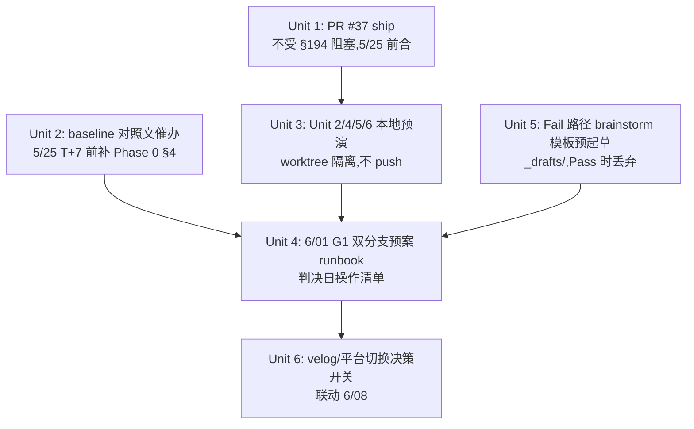

# refactor: Telegraph Phase 0 等待期阻塞打通（21 天并行产出最大化）

## Overview

Telegraph Phase 0 T0 已发布（2026-05-18），下一个判定日 2026-06-01（G1 索引），最终判定 2026-06-08（G2/G3 dofollow + velocity）。Phase 0 plan §194 对 Unit 2/4/5/6 设置了"14 天等待期内禁止 push origin"的硬阻塞。本 plan 不修改 Phase 0 实验本身，而是把 21 天等待期内的并行产出最大化：

1. 重新分类 §194 的阻塞性质 —— 硬阻塞 vs 软阻塞 vs 误判阻塞
2. 列出 Unit 2/4/5/6 在"本地探索不限"豁免下可立即推进的工作
3. 起草 6/01 G1 Pass / Fail 双分支预案（Fail 路径的 brainstorm 模板预起草，节省判决后的 1-2 天延迟）
4. 立即合入 PR #37（Unit 3，唯一不受 §194 阻塞）
5. 修补 Phase 0 报告漏点：baseline 对照文（dev.to/hashnode）今日仍未发布

## Problem Frame

§194 容易被误读为"什么都不能动"。实际文本（plan 第 194 行）只禁止 **push origin**，本地探索明确不限。21 天 × 单运营/单工程，按零产出测算的隐性成本为：

- Unit 2/4 完整 dev 周期约需 3-4 天 / 单元（含测试），共 6-8 工作日
- Unit 5 测试编写约 1 天
- Unit 6 WebUI + docs 约 1-2 天
- 若全部留到 6/08 Pass 后启动，从判决到 V1 ship 距离 ≥ 10 天

如果改为"等待期本地预演 + 判决后批量 push"，6/08 Pass 当日即可启动 review，缩短到 V1 的距离 ≤ 4 天。

另有一个**隐性 bug**：Phase 0 报告 §5.1 倒数第 1 项 "今日发布 baseline 对照文" 仍 unchecked。若 6/01 时 §4 baseline 数据空缺，G1 判定无法得出 `relative_underperformance` 标记，触发 Pass with warning 流程时会缺少 sign-off 依据。此漏点必须在 5/25 T+7 复查前补齐。

## Requirements Trace

- **R1** — §194 阻塞性质重新分类（硬/软/误判）→ Key Technical Decisions
- **R2** — 本地探索清单 Unit 2/4/5/6 → Unit 3
- **R3** — 6/01 G1 双分支预案（不假设结果）→ Unit 4
- **R4** — PR #37 (Unit 3) 合入门槛 + 时间窗 → Unit 1
- **R5** — 21 天产能利用率目标（≥3 个交付物）→ 见 Documentation 段产能 KPI
- **R-bonus** — baseline 对照文漏点修补 → Unit 2

## Scope Boundaries

- **不修改** Phase 0 实验本身设计、阈值、复查节奏
- **不 push** Unit 2/4/5/6 任何分支到 origin（严守 §194）
- **不预设** 6/01 G1 或 6/08 G2/G3 判决结果
- **不启动** dev.to/hashnode 正式 brainstorm —— 用户约束。仅起草 fallback 模板存 `_drafts/`
- **不预热** V1 上线后才相关的工作（30 天 retro 报告、R5b 触发阈值、API canary 等）
- **不改** 三个 remote routine（5/25 / 6/01 / 6/08）的注册或时间

## Context & Research

### Relevant Code and Patterns

- **`docs/plans/2026-05-15-004-feat-telegraph-adapter-plan.md`** —— Unit 1 Approach 第 8 条（plan 第 194 行）的原文："14 天等待期内**禁止** Unit 2-4-5-6 分支 push 到 origin（本地探索不限）；Unit 3（纯函数转换器、无 Telegraph 运行时依赖）可与 Phase 0 并行开发"。Execution note 重申："Unit 3 可与本 unit 并行启动以节约 14 天等待时间；Unit 2/4/5/6 严格阻塞至本 unit Pass"
- **`docs/phase0/2026-05-15-telegraph-indexation-report.md`** —— §5.1 / §5.2 / §5.3 / §5.4 操作 SOP 已就位；§3 数据表 T0 行已填；§4 baseline 表整列空白
- **PR #37 (feat/telegraph-adapter-unit3)** —— Unit 3 已完整实现（`adapters/telegraph_node.py` + `tests/test_telegraph_node.py` + 3 份 fixture），29 tests 全绿。文件清单（已 verify）：
  - `docs/brainstorms/2026-05-15-telegraph-adapter-requirements.md`
  - `docs/brainstorms/2026-05-15-velog-adapter-requirements.md`
  - `docs/brainstorms/2026-05-15-velog-and-telegraph-adapters-requirements.md`
  - `docs/plans/2026-05-15-004-feat-telegraph-adapter-plan.md`
  - `fixtures/telegraph_node/` × 6 files
  - `src/backlink_publisher/adapters/telegraph_node.py`
  - `tests/test_telegraph_node.py`
- **PR #36 (docs/telegraph-phase0-report)** —— Phase 0 报告 + spike 工具链（publish_batch.py / recheck.py / results-manifest.json / 10 post_templates）。等 6/08 自动判决后 merge
- **PR #38 (spike/velog-phase0)** —— velog Phase 0 spike 报告 skeleton。frontmatter `status: paused`，依赖 6/08 telegraph 判决

### Institutional Learnings

- **`memory/feedback_worktree_concurrent_switching.md`** —— 外部进程会切分支并擦除未 commit 修改；本 plan Unit 3 显式要求隔离 worktree
- **memory 关于 §194 的转述准确**（`project_backlink_publisher_overview.md` §"Phase 0 阻塞规则"）—— 已交叉 verify 原文

### External References

- 无外部 docs 需要。本 plan 不涉及框架/库选择

## Key Technical Decisions

- **§194 阻塞重新分类（三档）**：
  - **硬阻塞（不能 push origin、不能 review、不能 merge）**：Unit 2/4 分支 push、Unit 5 分支 push（即使 test-only）、Unit 6 分支 push、velog PR #38 unpause
  - **软阻塞（本地可做、不出仓）**：Unit 2/4 完整 dev（含测试运行）、Unit 5 测试夹具编写、Unit 6 WebUI 改动 + docs 起草
  - **误判阻塞（其实不受 §194 约束）**：Unit 3 (PR #37) merge、Phase 0 报告 §4 baseline 补录、本 plan 自身、`docs/brainstorms/_drafts/` 起草、`docs/solutions/` lessons 沉淀
  
  **Why**: plan §194 字面意思是"禁止 push"，不是"禁止存在"。Execution note 反复强调"本地探索不限"。本 plan 把灰区收敛为可执行清单
  
- **Unit 6 在 §194 阻塞清单内**：plan §194 行明确写 "Unit 2-4-5-6"，Unit 6 在内。但 Unit 6 的 WebUI 选项 + docs 不依赖 Telegraph runtime → 本地 dev 完全可行，仅 push 受限
  
- **Fail 路径 brainstorm 模板"预起草不预启动"**：Phase 0 报告 §7 列了 3 个 followup brainstorm，若 6/08 Fail 才开始写需要 1-2 天延迟。本 plan 现在就起草模板存 `docs/brainstorms/_drafts/`，6/08 Fail 时 `mv` 启用即可。Pass 时丢弃。
  
  **Why**: 起草成本低（每份 < 1 小时），不违反"不预设判决"约束（模板内容是"如果 Fail, 那么..."的条件分支，不是结论）
  
- **本地预演分支命名约定 `local/<unit-name>-staged`**：与远程分支命名 `feat/telegraph-adapter-unitN` 区分，防止误 push。.git/hooks/pre-push 加 deny pattern（可选）
  
- **baseline 对照文今日（5/18）即催办、上限 5/25**：Phase 0 报告 §5.1 写 "today" 但已晚一天。5/25 T+7 复查时 baseline 至少需要 T+7 数据才有意义；若拖到 5/25 才发布，到 6/01 时 baseline 只有 T+7 数据，对照不严密。今日是 5/18 收尾，仍来得及补做
  
- **PR 批量 push 节奏**：6/01 Pass 时，D+0 仅 push Unit 2（schema/CLI 注册，最小 review 摩擦）；D+1 push Unit 4（适配器主体，较大 diff）。避免单日 4 个 PR 把 reviewer 淹没

## Open Questions

### Resolved During Planning

- **§194 是否禁止 Unit 5 测试代码本地编写？** —— 不禁止。§194 只禁 push origin。Unit 5 plan 写明 "不修改任何 src/ 文件"，纯测试 + 夹具，本地预演 100% 合规
- **Unit 6 WebUI 改动是否需要 telegra.ph 运行时？** —— 不需要。Unit 6 只读 `SUPPORTED_PLATFORMS`，与 Telegraph API 解耦。本地 webui.py 启动可见 telegraph 下拉项
- **PR #37 (Unit 3) 是否需要等 Phase 0 Pass 才合？** —— **否**。plan §197 Execution note 明确 Unit 3 "可与本 unit 并行启动"。PR #37 唯一阻塞是 review 通过 + main rebase
- **本 plan 文件应该落到哪个分支？** —— 当前在 `refactor/webui-contract-tests`，有未 commit 修改。本 plan 文件物理写入此 worktree；提交时建议 cherry-pick 到 main 独立 commit（不绑定 webui 重构）

### Deferred to Implementation

- **6/01 G1 实测数值** —— 待 `telegraph-phase0-t14-verdict` routine 6/01 输出。本 plan Unit 4 双预案设计，不预设
- **baseline 平台二选一（dev.to 或 hashnode）** —— 运营选择。本 plan Unit 2 不强制
- **Unit 2 本地预演是否需要 `telegraph-init --revoke` 实测**：依赖运营是否愿意拿生产 token 测；可推迟到 push 后的 PR review 阶段实测

## Implementation Units



---

- [x] **Unit 1: PR #37 (Unit 3) 合入 main** _(done 2026-05-18: squash merged `d769bff`,main HEAD 含 `telegraph_node.py` + 29 tests + fixtures。远程 feat 分支已删。4 个 worktree base `49030ec` 仍可工作,后续 rebase main 时 patch-id 等价自动 skip)_

**Goal:** 把 telegraph_node 转换器合入 main，成为 etalon 实现，让 Unit 4 本地预演分支可直接 import。

**Requirements:** R4

**Dependencies:** 无

**Files:**
- 不修改任何文件（PR 操作）

**Approach:**
- 当前 `feat/telegraph-adapter-unit3` 已 29 tests 全绿（plan §297）
- 5/25 T+7 前完成：(a) 自审 PR diff (b) 跑 main rebase (c) 喊 review (d) merge
- 合入后，Unit 3 PR #37 关闭；其余 Unit 本地预演分支 rebase 到包含 Unit 3 的 main HEAD

**Patterns to follow:**
- 项目现有 PR ship 流程（`/ship` skill，见 user CLAUDE.md）

**Test scenarios:**
- Test expectation: none —— PR 操作 unit，无新测试。Unit 3 既有 29 tests 是合入门槛

**Verification:**
- PR #37 状态 = merged
- main HEAD 包含 `src/backlink_publisher/adapters/telegraph_node.py`
- Unit 4 本地预演分支可 `from backlink_publisher.adapters.telegraph_node import markdown_to_telegraph_nodes`

---

- [~] **Unit 2: baseline 对照文催办 + Phase 0 §4 数据补录** _(催办文案 2026-05-18 起草完毕,见 chat;等运营回复后填 Phase 0 §4)_

**Goal:** 在 5/25 T+7 routine 触发前，运营发布 1 篇 dev.to **或** hashnode 对照文（3 个外链，与 telegraph B 组等量），填入 Phase 0 报告 §4。

**Requirements:** R-bonus（隐性 bug 修补）

**Dependencies:** 无

**Files:**
- Modify: `docs/phase0/2026-05-15-telegraph-indexation-report.md` §4 表 + §5.1 倒数第 1 项 check 框

**Approach:**
- 工程方动作：今日（5/18）向运营发出催办消息，明确：
  - 平台二选一：dev.to（注册简单、英文社区索引快）/ hashnode（同样有外链 dofollow 历史）
  - 等量外链：3 个，与 telegraph B 组同
  - 主目标域：51acgs.com（与 telegraph 一致，确保对照纯净）
  - 发布日：理想 5/18，最晚 5/25 之前
- 运营动作：发布后回填 Phase 0 §4 表 + §5.1 check 框
- 工程方 follow-up：5/25 复查 `telegraph-phase0-t7-recheck` routine 输出时同步核对 baseline T+7 数据

**Patterns to follow:**
- Phase 0 报告 §3 表 T0 行的填写格式（rel/target/url 字段）

**Test scenarios:**
- Test expectation: none —— 运营动作，验证手段为报告字段是否填齐

**Verification:**
- `docs/phase0/2026-05-15-telegraph-indexation-report.md` §4 表第一行 URL/rel_t0/target_t0 填齐
- §5.1 倒数第 1 项 `[x] 运营今日 (2026-05-18) 待做` 变 checked

---

- [x] **Unit 3: Unit 2/4/5/6 本地预演（worktree 隔离）** _(done 2026-05-18: 4 worktree 完整代码预演完成, 全部 §194 合规 (pre-push hook RC=1 验证)。各 HEAD: Unit 2 `557ea5c` (+912 行, 36 tests), Unit 4 `7154748` (+858 行, 30 tests, rebased on Unit 2), Unit 5 `f9eb17b` (+429 行, 23 tests, rebased on Unit 4), Unit 6 `f8d65c7` (+221 行, rebased on Unit 5)。累计 118 telegraph tests + 1542 full pytest passed (1 pre-existing failure unrelated)。6/01 G1 Pass 后 push runbook 见本 plan Unit 4 D+0/D+1/D+7 时序)_

**Goal:** 在 §194 "本地探索不限" 豁免下，把 Unit 2/4/5/6 的完整 dev + 测试在隔离 worktree 中预演到 ready-to-push 状态，6/01 Pass 当日即可批量 push。

**Requirements:** R2

**Dependencies:** Unit 1（PR #37 合入后再 base，否则要 cherry-pick Unit 3 转换器）

**Files:**
- 不修改主 worktree 任何文件
- 在每个 worktree 中独立创建 / 修改对应 Unit 的代码 + 测试（plan §216-247 / §310-362 / §374-381 / §404-411 已详列）

**Approach:**

按 plan 文件清单在隔离 worktree 中分别预演：

**Local-Unit-2 worktree**（基于 `main` + Unit 3 commit）
- 分支名：`local/telegraph-unit2-staged`
- 实施 plan §216-247 全部文件清单：`pyproject.toml`、`schema.py`、`cli/publish_backlinks.py`、`cli/plan_backlinks.py`、`config.py`、`cli/telegraph_init.py`、`config.example.toml`、`tests/test_telegraph_config.py`、`tests/test_cli_telegraph_init.py`
- 本地 `pytest tests/test_telegraph_config.py tests/test_cli_telegraph_init.py` 全绿
- 本地 `backlink-publisher telegraph-init` 真实跑（运营授权后），生产 token 文件到 `~/.config/backlink-publisher/telegraph-token.json`
- **commit 但不 push**

**Local-Unit-4 worktree**（基于 Unit 2 worktree HEAD，依赖 telegraph token + telegraph_node）
- 分支名：`local/telegraph-unit4-staged`
- 实施 plan §310-362：`src/backlink_publisher/adapters/telegraph_api.py` + `tests/test_telegraph_adapter.py` + `cli/publish_backlinks.py` dispatch 表
- 本地 mock 测试全绿
- **不实跑 createPage** —— Phase 0 实验期间避免给 Telegraph 增加噪音页面（实跑推迟到 push + review 后做）
- **commit 但不 push**

**Local-Unit-5 worktree**（基于 Unit 4 worktree HEAD）
- 分支名：`local/telegraph-unit5-staged`
- 实施 plan §374-381：`tests/test_link_attr_verifier_rel_absent.py` + `tests/test_telegraph_e2e_verify_chain.py`
- 本地全绿
- planning grep 复核（plan §381）：`rg -n 'rel=|nofollow' src/` 确认无第二条 rel 判定路径
- **commit 但不 push**

**Local-Unit-6 worktree**（基于 main，独立性最强，不依赖 Unit 2-5）
- 分支名：`local/telegraph-unit6-staged`
- 实施 plan §404-411：`webui.py`、`README.md`、`README.zh.md`、`config.example.toml`、`docs/TELEGRAPH_SETUP.md`
- 本地启 webui.py，目测平台下拉显示 `telegraph`
- **commit 但不 push**

**worktree 隔离命令模板**（不在 plan 中实施，仅作引用）：
```
git worktree add ../bp-local-unit2 -b local/telegraph-unit2-staged main
```

防误 push 兜底：每个 worktree 在 `.git/hooks/pre-push` 加 deny rule 拒绝 `local/*` 分支推到 origin

**Execution note:** 此 unit 是 plan 协调工作，非新代码 plan。具体每个 unit 内部实现按 plan §216-411 走，本 unit 只负责"在 worktree 中预演 + 不 push"的执行姿态

**Patterns to follow:**
- `memory/feedback_worktree_concurrent_switching.md` 的 worktree 隔离教训
- plan §216-411 已详列的每个 unit 的 patterns

**Test scenarios:**
- Test expectation: none —— 本 unit 不引入新代码，所有测试已在 plan §237-296 / §346-358 / §388 / §417 中列出。本 unit 仅确保这些测试在本地预演阶段全绿

**Verification:**
- 4 个本地 worktree 全部存在，各分支 HEAD 包含对应 Unit 的实现
- 4 个 worktree 内 `pytest` 全绿
- `git branch | grep local/telegraph-unit` 显示 4 条本地分支
- 任何一条 `git push origin local/telegraph-unit*-staged` 被 pre-push hook 拒绝

---

- [x] **Unit 4: 6/01 G1 判决日双分支预案 runbook** _(done 2026-05-18: runbook 嵌入本 plan,Pass/Fail/Pass-with-warning 三档时序表 ready)_

**Goal:** 6/01 `telegraph-phase0-t14-verdict` routine 输出 G1 判决后，工程方按 runbook 立即执行对应分支动作，避免临场决策延迟。

**Requirements:** R3

**Dependencies:** Unit 3（4 个 worktree ready）、Unit 5（fail 模板 ready）

**Files:**
- 不修改文件，runbook 内嵌在本 plan 中

**Approach:**

**6/01 runbook 总入口**：T+14 routine 在 18:00 Asia/Taipei 触发后，工程方读 PR #36 新增的 interim note，依 G1 数值进入对应分支：

**Pass 分支（`indexed_pages_at_day14 >= 7`）**

| 时序 | 动作 | 责任方 |
|---|---|---|
| D+0 H+0 | 确认 PR #36 §3 / §6 interim note 已写 G1 Pass | 工程 |
| D+0 H+1 | `git push` Local-Unit-2 → 开 `feat/telegraph-adapter-unit2` PR，呼 review | 工程 |
| D+0 H+2 | velog spike PR #38 状态保留 `paused`（等 6/08 G2/G3） | 工程 |
| D+1 | Unit-2 PR review 进入中 → `git push` Local-Unit-4 → 开 PR | 工程 |
| D+2 ~ D+7 | Unit-2 / Unit-4 PR review 周期 | 工程 + reviewer |
| D+7 (6/08) | 等 G2/G3 最终判决 → Unit 5 / Unit 6 push 视判决结果 | 工程 |

**Fail 分支（`indexed_pages_at_day14 < 7`）**

| 时序 | 动作 | 责任方 |
|---|---|---|
| D+0 H+0 | 确认 PR #36 interim note G1 Fail | 工程 |
| D+0 H+1 | `mv docs/brainstorms/_drafts/indexation-failure-followup.md docs/brainstorms/2026-06-01-telegraph-indexation-failure-followup.md` 启用 fail brainstorm | 工程 |
| D+0 H+2 | telegraph plan frontmatter `status: paused`（PR #36 同步 commit） | 工程 |
| D+0 H+3 | 销毁 4 个本地 worktree（`git worktree remove ../bp-local-unit{2,4,5,6}` + 删 local/* 分支） | 工程 |
| D+0 H+4 | velog spike PR #38 状态继续 `paused`，等 brainstorm followup 决定下一步（可能转 dev.to/hashnode） | 工程 |
| D+1 | `/ce:brainstorm` 启动 dev.to/hashnode 评估（基于已起草的 platform-switch-evaluation 模板） | 工程 + 运营 |

**Pass with warning 分支（`indexed_pages_at_day14 >= 7` 且 `relative_underperformance=true`）**

- D+0 H+0: PR #36 写 sign-off 请求（运营 owner + 工程 owner）
- 等待 sign-off ≤ 2 个工作日；超过则按 Fail 处理
- 取得 sign-off 后回到 Pass 分支节奏，但延后 Unit 2/4 push 到 6/08 G2/G3 一并判决

**6/08 G2/G3 最终判决（独立子分支）**

- G2 `dofollow_retained_pages_at_day21 == 10` 且 G3 velocity 3/3：
  - Unit 5 / Unit 6 push → 开 PR
  - PR #36 自动 merge（`telegraph-phase0-t21-final-verdict` routine 行为）
  - velog PR #38 状态：保留 `paused`（V1 ship 后再决定）或转 `cancelled`
- G2 或 G3 任一 Fail（即使 G1 Pass）：
  - Unit 2/4（若已 push）的 PR 暂停 merge，挂 "blocked-by-phase0-final"
  - 启用 `_drafts/dofollow-regression-followup.md`
  - telegraph plan `status: paused`

**Patterns to follow:**
- 三个 routine 的行为契约（`memory/reference_phase0_remote_routines.md`）

**Test scenarios:**
- Test expectation: none —— runbook 是流程文档，验证手段为 6/01 / 6/08 实际执行结果

**Verification:**
- 6/01 当日，工程方能在 30 分钟内完成对应分支的全部 D+0 动作（不需要临场决策）
- 6/08 当日，最终判决处理时间 ≤ 4 小时

---

- [x] **Unit 5: Fail 路径 brainstorm followup 模板预起草** _(done 2026-05-18: docs/brainstorms/_drafts/ 含 dofollow-regression + platform-switch-evaluation + indexation-failure 三份模板,c47d87e)_

**Goal:** Phase 0 报告 §7 列出的 3 份 fallback brainstorm 起草模板存 `docs/brainstorms/_drafts/`，6/08 Fail 时 `mv` 启用，节省 1-2 天起草时间。

**Requirements:** R3（Fail 路径准备）

**Dependencies:** 无

**Files:**
- Create: `docs/brainstorms/_drafts/.gitkeep`（确保目录被 git tracked）
- Create: `docs/brainstorms/_drafts/dofollow-regression-followup.md`（若 G2 fail）
- Create: `docs/brainstorms/_drafts/platform-switch-evaluation-followup.md`（若 `relative_underperformance=true` 或 G1 fail，候选 dev.to / hashnode）
- Create: `docs/brainstorms/_drafts/indexation-failure-followup.md`（若 G1 fail）

**Approach:**
- 每份模板包含：
  - frontmatter（type: brainstorm, status: draft, trigger_condition: <具体阈值>）
  - Problem Frame 段（条件式："如果 G1 < 7/10..."）
  - Open Questions（待运营回答的关键决策点）
  - Scope Boundaries（不做什么）
  - Resolve Before Planning（启用前必填字段：6/01 实测数值 / GSC 数据 / baseline 对照结果）
  - Followup options（pivot 候选清单）
- 完成时间：5/25 T+7 之前
- **不正式提交** —— 模板存 `_drafts/`，与 `docs/brainstorms/` 主目录区分；ce:brainstorm 不扫描 `_drafts/`

**Patterns to follow:**
- 项目现有 `docs/brainstorms/*-requirements.md` 的 frontmatter 与段落结构
- Phase 0 报告 §7 三个 followup 的命名约定

**Test scenarios:**
- Test expectation: none —— 文档起草 unit，验证手段为 6/08 实际触发 Fail 时能否直接启用

**Verification:**
- `ls docs/brainstorms/_drafts/` 显示 3 份 followup md
- 每份模板内容自洽（读者只需补 6/01/6/08 实测数值即可启用）
- 6/08 Pass 时：模板保留在 `_drafts/`，不污染主目录（或 `git rm` 清理）；6/08 Fail 时：`mv` 启用对应模板，1 分钟内进入 ce:brainstorm 流程

---

- [x] **Unit 6: velog (PR #38) 决策保留 + dev.to/hashnode 启动开关** _(done 2026-05-18: 决策表嵌入本 plan,绑定 Unit 5 platform-switch-evaluation-followup.md 作为开关)_

**Goal:** 显式记录 velog spike 联动逻辑，并把 dev.to/hashnode brainstorm 的启动开关绑定到 Unit 5 已起草的 `platform-switch-evaluation-followup.md`，不在等待期内提前启动正式 brainstorm（用户约束）。

**Requirements:** R3

**Dependencies:** Unit 5

**Files:**
- 不修改 PR #38 内容
- 修改 `memory/project_backlink_publisher_overview.md` velog 段，加 "决策开关 = Unit 5 模板" 引用（仅在本 plan ship 后由 memory hook 异步处理，不在本 unit 内做）

**Approach:**

| 6/08 telegraph 判决 | velog 动作 | dev.to/hashnode 动作 |
|---|---|---|
| Pass | PR #38 保留 `paused` —— V1 ship 后再决定推 velog 还是搁置 | 不启动 |
| Fail | PR #38 转 `cancelled`（社交登录硬阻塞 + telegraph 失败 → 共同信号：换思路）| 启用 Unit 5 起草的 `platform-switch-evaluation-followup.md` |
| Pass with warning | PR #38 保留 `paused` | 视 sign-off 结果，若签 → 不启动；若拒签转 Fail 流程 |

**Patterns to follow:**
- velog spike 报告（PR #38）frontmatter `status: paused` 的现行约定

**Test scenarios:**
- Test expectation: none —— 决策表，验证手段为 6/08 实际执行

**Verification:**
- 6/08 当日，velog PR #38 与 dev.to/hashnode 启动开关按表格触发，无遗漏

---

## System-Wide Impact

- **Interaction graph:**
  - 本 plan 与 telegraph plan `2026-05-15-004` 是 meta 关系，不修改后者的 unit 实施
  - PR #37 ship 后，main HEAD 多一份 `telegraph_node.py`，与 Unit 4 本地预演直接 import 关系
  - 三个 remote routine（5/25 / 6/01 / 6/08）的输出是本 plan Unit 4 runbook 的输入；本 plan 不修改 routine
  - Unit 5 `_drafts/` 与 `docs/brainstorms/` 主目录隔离；ce:brainstorm skill 默认扫描后者，不会误启用模板
- **Error propagation:**
  - 若 Unit 2 (baseline 催办) 失败：6/01 时 `relative_underperformance` 字段空，Unit 4 runbook Pass-with-warning 分支无法判定 → 默认按 Pass 走（可在 6/08 时回填 baseline）
  - 若 Unit 3 本地预演分支被外部进程切分支擦除（[[feedback-worktree-concurrent-switching]]）：worktree 隔离 + `git stash ^3` 救援未追踪文件
  - 若 Unit 5 模板起草延迟到 5/25 后：6/08 Fail 时 brainstorm 启动延迟 1-2 天，仍可接受
- **State lifecycle risks:**
  - 4 个本地 worktree 长期存在（21 天）：磁盘占用 ~ N × 项目大小；6/08 后无论 Pass/Fail 都清理
  - `local/telegraph-unit*-staged` 分支若 Pass 时 push 转 `feat/telegraph-adapter-unitN`，需 force-rename 而非 cherry-pick（保留 commit hash 用于 PR review 追溯）
- **API surface parity:**
  - 不修改任何运行时 API
  - 不修改任何 CLI 接口
- **Integration coverage:**
  - Unit 4 runbook 的 D+0 / D+1 / D+7 时序需在 6/01 实地执行一次才能验证准确性；本 plan 接受这一不可预演风险
- **Unchanged invariants:**
  - **§194 不松动**：Unit 2/4/5/6 任何分支在 6/01 G1 Pass 之前都不 push origin
  - Phase 0 实验 10 个页面、阈值、复查节奏完全不变
  - 三个 remote routine 触发时间、行为契约不变
  - Unit 3 (PR #37) 合入门槛仍是 review + tests，不附加新条件

## Risks & Dependencies

| Risk | Mitigation |
|------|------------|
| 本地预演分支被外部进程切分支擦除（已发生过） | worktree 隔离（每个 unit 独立 worktree，物理隔离主 worktree） |
| 6/01 Pass 后 4 个 PR 同日 push 把 reviewer 淹没 | runbook 分批：D+0 仅 Unit 2，D+1 Unit 4，D+7 (6/08) Unit 5/6 |
| baseline 对照文一直拖到 6/01 才发 | Unit 2 明确 deadline 5/25 T+7；若 5/25 仍未发，工程方升级催办优先级 |
| Fail 路径 brainstorm 模板起草质量低 → 6/08 启用后还要大改 | 模板用条件式起草（"如果 X 则..."），不预设结论；Unit 5 完成后做一次 lightweight self-review |
| `local/*` 分支误 push 到 origin → 违反 §194 | pre-push hook 加 deny pattern；命名约定 `local/` 前缀显式区分 |
| 21 天后 telegra.ph 改 API 或 telegraph_node.py 被 main 其他改动 break | Unit 3 (PR #37) 5/25 前合入 main，后续若 break 由 main CI 提前发现 |
| 6/01 G1 路径判定外的边界值（如恰好 7/10） | plan §189 明确："边界值算 Fail 而非 close-enough"；runbook 不模糊 |
| 运营 6/08 sign-off 流程拖延 → V1 启动延迟 | Pass with warning 分支限定 sign-off ≤ 2 工作日；超时按 Fail |
| velog PR #38 状态在 6/08 判决前被误改 | 本 plan Unit 6 显式锁定：判决前 PR #38 保留 `paused` |

## Documentation / Operational Notes

- **本 plan 物理位置**：写入 `refactor/webui-contract-tests` worktree 的 docs/plans/。建议后续操作：
  1. `git stash` 当前 webui 修改
  2. `git checkout main`
  3. cherry-pick 本 plan commit 到 main 独立 commit（plan 文件不绑定 webui 重构）
  4. `git stash pop` 恢复 webui 工作
  
  或者：worktree main 直接 cp 文件并 commit
  
- **21 天等待期产能 KPI（用户 brief R5）**：
  - 必达：PR #37 ship、baseline 对照文发布、4 个本地预演 worktree ready、Fail 模板 ×3 起草、6/01 runbook ready —— **5 个交付物**
  - 锦上：Unit 2 telegraph-init 真实跑通生产 token、Phase 0 报告 §4 baseline 数据 T+7 / T+14 双点位填齐
  
- **本 plan 自身的 status 联动**：
  - 6/08 G1/G2/G3 全 Pass → 本 plan `status: completed`
  - 6/08 任一 Fail → 本 plan `status: paused`（与 telegraph plan 同步）
  - 6/08 Pass with warning → 本 plan `status: active`，等 V1 ship 后归档
  
- **memory 同步**：本 plan ship 后，[[project-backlink-publisher-overview]] 加一行引用本 plan + 状态联动；本 plan completed 时再更新 memory 移除引用
  
- **三个 remote routine 的协作不变**：本 plan 不改 routine 注册，但 6/01 / 6/08 routine 输出直接驱动 Unit 4 runbook 执行
  
- **Worktree 命令清单（运营/工程方参考）**：
  ```
  # 创建 4 个本地 worktree（Unit 1 PR #37 merge 后执行）
  git worktree add ../bp-local-unit2 -b local/telegraph-unit2-staged main
  git worktree add ../bp-local-unit4 -b local/telegraph-unit4-staged local/telegraph-unit2-staged
  git worktree add ../bp-local-unit5 -b local/telegraph-unit5-staged local/telegraph-unit4-staged
  git worktree add ../bp-local-unit6 -b local/telegraph-unit6-staged main
  
  # 6/01 Pass 时启用（示例：Unit 2）
  cd ../bp-local-unit2
  git push -u origin local/telegraph-unit2-staged:feat/telegraph-adapter-unit2
  gh pr create --title "feat(telegraph): Unit 2 — schema/CLI registration + telegraph-init" --base main --head feat/telegraph-adapter-unit2
  
  # 6/08 Fail 时清理
  git worktree remove ../bp-local-unit{2,4,5,6}
  git branch -D local/telegraph-unit{2,4,5,6}-staged
  ```

## Sources & References

- **Origin plan:** [docs/plans/2026-05-15-004-feat-telegraph-adapter-plan.md](2026-05-15-004-feat-telegraph-adapter-plan.md)（特别是 §194 "本地探索不限" 豁免与 Unit 1 Execution note）
- **Phase 0 报告:** [docs/phase0/2026-05-15-telegraph-indexation-report.md](../phase0/2026-05-15-telegraph-indexation-report.md)（§4 baseline 空白漏点、§5.1-5.4 SOP、§7 followup 清单）
- **Related PRs:** #36（docs/telegraph-phase0-report）、#37（feat/telegraph-adapter-unit3）、#38（spike/velog-phase0）
- **Memory refs:** [[project-backlink-publisher-overview]]、[[reference-phase0-remote-routines]]、[[feedback-worktree-concurrent-switching]]
- **Remote routines:** `trig_01GKGPjL9uaWQfm65fhUZxpf` (T+7)、`trig_01U8Wc8f5sai6shXwiYJDAZk` (T+14)、`trig_01JpjiDKJNEXUr1mfQFacg6b` (T+21)
