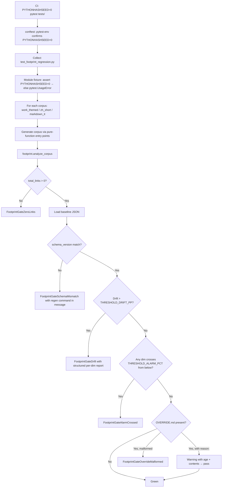
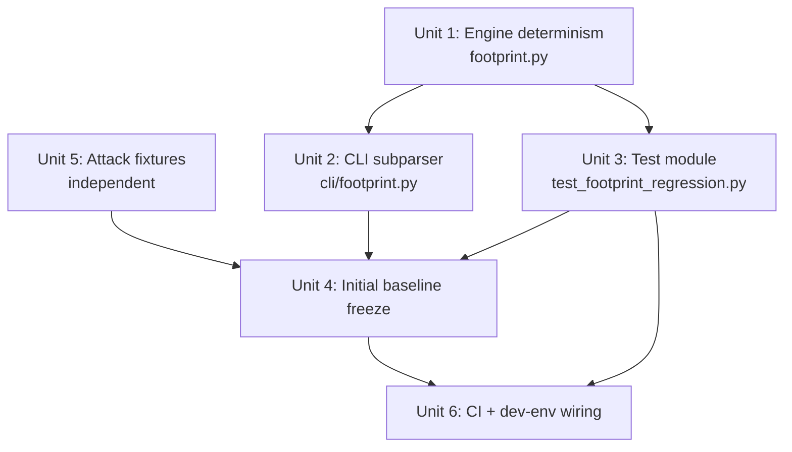

# feat: Footprint Regression Gate (Arm A of S2 Footprint Loop Closure)

## Overview

Convert the shipped `bp footprint` audit (R3-3) from a one-shot CLI tool into a permanent pytest CI gate that catches byte-level cluster-key drift on every PR. Three corpora (`work_themed`, `zh_short`, `markdown_it`) generate at runtime via pure-function entry points; each compared against a committed baseline JSON. Hard-blocking with a minimum-viable `OVERRIDE.md` break-glass. Includes determinism work on the `footprint` engine itself (lex-smallest tie-break, `SCHEMA_VERSION` constant) and adds the first argparse subparser in the project (`footprint baseline regenerate`).

Arm B (renderer self-vary) is explicitly out of scope — its PR will *redesign* this gate (per-dimension expected-range), not re-freeze it. The "redesign-not-refreeze" framing is enforced via a TODO comment in the test file (see Open Questions resolution).

## Problem Frame

`bp footprint` (`src/backlink_publisher/footprint.py` + `cli/footprint.py`) ships as a manual audit the operator forgets to run. Any future renderer change can silently re-introduce a SpamBrain cluster key (attribute order, exact `rel` string, target value, preceding character). This gate makes the audit run on every PR, so drift surfaces at code-review time instead of post-deploy.

See origin: `docs/brainstorms/2026-05-18-footprint-regression-gate-requirements.md` for the full threat model and the Round-4 ideation lineage (idea #1, S2 Footprint Loop Closure).

## Requirements Trace

Carried forward from origin (R1-R14, with R8/R9/R13 intentionally dropped/moved per Round-2 brainstorm decisions):

- **R1** — Pytest module `tests/test_footprint_regression.py` runs on every CI invocation.
- **R2** — Three corpora generated at runtime via pure-function entry points (no network, no disk, no autouse-mock interference).
- **R3** — Per-corpus comparison against `tests/baselines/footprint_concentration_{work_themed,zh_short,markdown_it}.json`.
- **R4** — Hard-block on drift / crossing-from-below alarm / schema mismatch / zero-links sanity; 4 distinct error classes (`FootprintGateDrift`, `FootprintGateAlarmCrossed`, `FootprintGateSchemaMismatch`, `FootprintGateZeroLinks`), plus a 5th `FootprintGateOverrideMalformed` added per Phase 1 flow analysis.
- **R5** — Hard-blocking with minimum-viable OVERRIDE.md escape.
- **R6** — Baseline JSON records: per-dimension `concentration_pct` (4 `LinkSignature` dimensions), `schema_version`, `reason`, `fixture_set_id`.
- **R7** — `footprint baseline regenerate [--path] --reason …` subcommand; sorted-keys + 2-space indent + trailing newline.
- **R10** — CI pins `PYTHONHASHSEED=0` at interpreter startup; module-level fixture in `tests/test_footprint_regression.py` raises `pytest.UsageError` if absent or non-zero.
- **R11** — Replace ALL `Counter.most_common(1)` call sites in `footprint.py` (5 sites) with lex-smallest tie-break; add module-level `SCHEMA_VERSION` constant.
- **R12** — Engine sanity check (`total_links > 0`) + 2 attack fixtures (multi-line `<a>`, missing-vs-empty `rel`).
- **R14** — Minimum-viable OVERRIDE.md break-glass (warn-and-pass on presence + `reason:` line; no expiry, no JSONL log, no field schema).

## Scope Boundaries

Carried forward from origin (verbatim categories):

**Future phases:**
- Arm B (renderer self-vary) — will redesign this gate, not refreeze it.
- No TTL on baselines.

**Orthogonal refactors (no coupling):**
- `webui.py` → `webui_app/` split (already landed at 19a459c).
- `config.py` decomposition (P1, queued).

**Not in this PR:**
- No behavioral change to the `footprint` CLI besides the new `baseline regenerate` subcommand. **Tied-dimension top-value flips that result from R11's lex-tie-break ARE expected user-visible changes** on any tied dimension (typically `preceding_char`) and are documented in the PR description; this is not a regression.
- Engine changes limited to (a) deterministic tie-breaking across all 5 `most_common(1)` call sites in `footprint.py` (R11), (b) `SCHEMA_VERSION` constant. Set of dimensions, cluster-key extraction logic, and `concentration_pct` formula are unchanged.
- `[footprint]` runtime config does not affect the gate. Gate runs in CI regardless.
- Gate measures footprint for synthetic fixtures only — operational anchor-profile drift in production is out of scope for Arm A.

**Off limits:** no live publishing, no scraping; entire corpus is locally generated.

## Context & Research

### Relevant Code and Patterns

- **`src/backlink_publisher/footprint.py`** — 4-dimension `LinkSignature` (frozen dataclass at line 38), `FootprintReport` (mutable dataclass at line 80, `concentration_pct()` method at line 112), `analyze_corpus()` at line 116, `format_report_markdown()` at line 139. All 5 `Counter.most_common(1)` call sites: lines 100 (`top_attr_order`), 103 (`top_rel_values`), 112 (`concentration_pct`), 178 (target_value lambda), 185 (preceding_char lambda).
- **`src/backlink_publisher/cli/footprint.py`** — flat argparse parser with `--input`, `--json`, `--alarm-pct`. No subparsers anywhere in the codebase — sibling CLI files (`plan_backlinks.py`, `validate_backlinks.py`, etc.) all use flat parsers. This PR adds the first subparser pattern in the project.
- **`src/backlink_publisher/work_themed_generator.py`** — `select_anchors(cfg, meta, *, seed, recent_texts) -> Anchors` at line 103; `render_work_themed_article(cfg, work_url, anchors, *, seed) -> dict` at line 184. Test helper `_cfg()` at `tests/test_work_themed_generator.py:38-56` is the reference pattern for building `ThreeUrlConfig`.
- **`src/backlink_publisher/markdown_utils.py`** — `render_zh_short_article(keyword, main_domain, main_anchor, secondary_links, style_seed=0) -> str` at line 170; `render_to_html(md) -> str` at line 34 backed by module-level `_mdit_instance` singleton at line 11; the singleton installs a `link_open` rule that adds `target="_blank" rel="noopener"` to every link.
- **`tests/conftest.py`** — 3 autouse fixtures: `_mock_publish_check_url`, `_mock_content_fetch`, `_disable_real_network` (pytest-socket). None touch footprint code paths. Reference test patterns: `tests/test_short_article_renderer.py:31-55`, `tests/test_gate_properties.py` (Hypothesis precedent).
- **`.github/workflows/ci.yml`** — single workflow, matrix on Python 3.11/3.12, runs `python -m pytest tests/ -v --tb=short --timeout=30`. No env vars currently pinned. CI smoke run at lines 53-67 pipes `fixtures/seed.jsonl → plan-backlinks → validate-backlinks → publish-backlinks` — subparser changes MUST preserve `cat … | footprint` flat invocation.
- **`pyproject.toml`** — `[tool.pytest.ini_options]` at lines 36-39 contains only `markers`. `pytest-env` is NOT currently a dev dep; this plan adds it.

### Institutional Learnings

- **`docs/solutions/test-failures/inverted-negative-assertion-enshrined-config-save-data-loss-2026-05-14.md`** — Baseline/golden-file tests are the exact failure mode this doc warns about. **Generate baselines AFTER R11 ships, never before.** Pair byte-diff assertions with positive shape claims (e.g., "tie-broken token is lex-smallest among ties") so a future engine regression that happens to match a stale baseline still fails.
- **`docs/solutions/test-failures/ci-test-isolation-failures-medium-brave-sleep-timeout-2026-05-13.md`** — Any new pytest CLI flag must land its supporting dep in `[dev]` in the same commit; unrecognized flags exit with code 4 *before any test runs*, looking like a runner misconfiguration. PYTHONHASHSEED does NOT propagate to subprocesses unless explicitly passed in `env=`.
- **`docs/solutions/logic-errors/language-matches-always-true-no-op-gate-2026-05-14.md`** — Characterization-first applies to R11: before flipping `Counter.most_common(1)` to lex-smallest, capture a current-engine example where Python's hash-order produces non-deterministic output across `PYTHONHASHSEED` values. That artifact proves the fix's intended diff and stops a future reader from refactoring tie-break out.
- **`docs/solutions/best-practices/document-review-catches-runtime-errors-at-plan-time-2026-05-14.md`** — Run document-review on this plan before `/ce:work` (already covered by the ce-plan workflow's Phase 5.3.8).
- **MEMORY `feedback_verify_repo_state_before_planning.md`** — Re-verified `footprint.py` symbol exports, `cli/footprint.py` argparse shape, and `tests/conftest.py` autouse fixture set during Phase 1 grounding (Unit 1 must re-verify at write-time).

### External References

Skipped per Phase 1.2 decision — local patterns are strong (45+ test files, existing footprint engine, working argparse precedents in sibling CLIs, Hypothesis already a dev dep). No new technology surface.

## Key Technical Decisions

- **`SCHEMA_VERSION` as module-level constant, not `FootprintReport` field** — keeps the dataclass shape unchanged, avoids serialization churn in existing `--json` output, gives the gate a single canonical import (`from backlink_publisher.footprint import SCHEMA_VERSION`). Starts at `SCHEMA_VERSION = 1`.
- **Argparse subparsers with optional default** — backwards-compat: existing `cat payloads.jsonl | footprint --json` must still work. Use `add_subparsers(dest="command")` without `required=True`; when `args.command is None`, fall through to the current audit code path unchanged. New subcommand `baseline regenerate` is the first subparser in the project — sets the pattern for future CLI evolution.
- **Pure-function corpus, not end-to-end** — call `work_themed_generator.select_anchors` + `render_work_themed_article` directly with stubbed `WorkMetadata` and frozen `recent_texts`; `markdown_utils.render_zh_short_article` and `render_to_html` direct; sidesteps `work_scraper.fetch_work_metadata` (network) and `anchor_profile` (disk). Synthetic state is a documented threat-model narrowing (see Scope Boundaries).
- **`pytest-env` for local-dev ergonomics** — adds `pytest-env` to `[dev]` extras; sets `PYTHONHASHSEED=0` via `[tool.pytest.ini_options].env`. Means `pytest tests/` works out of the box locally; R10's UsageError check becomes defense-in-depth rather than a UX wall. Required because there is no `Makefile`/`CONTRIBUTING.md`/README "Running tests" section to grep against. Confirmed with user 2026-05-18.
- **CI workflow env (belt + suspenders)** — also set `PYTHONHASHSEED: "0"` at the job level in `.github/workflows/ci.yml`. Cleaner than per-step prefixing and protects against future CI matrix expansion forgetting the env.
- **`_mdit_instance` reset via bare assignment, not monkeypatch** — `markdown_utils._mdit_instance = None` in the corpus-generation block; teardown NOT needed (subsequent tests inherit whatever the corpus run left, matching production behavior). Using `monkeypatch.setattr` would auto-restore the old instance, defeating the determinism reset for the next test session.
- **`fixture_set_id` auto-computed (sha256 of canonical fixture inputs), not manual** — impossible to forget; mismatches are loud (gate fails on next run); planning-time decision per origin's Deferred-to-Planning + Phase 1 flow analysis (G6.1-related). Per-corpus IDs (each corpus has its own fixture pool). **Canonical-input definition (load-bearing for cross-implementation agreement):** `fixture_set_id = hashlib.sha256(json.dumps(canonical_inputs, sort_keys=True, separators=(",", ":"), default=str).encode()).hexdigest()[:16]` where `canonical_inputs` is the literal Python structure passed to each corpus generator — for `work_themed`: `{"cfg_dict": dataclasses.asdict(cfg), "meta_dict": dataclasses.asdict(meta), "seed": seed, "recent_texts": recent_texts}`; for `zh_short`: `{"keyword": ..., "main_domain": ..., "main_anchor": ..., "secondary_links": ..., "style_seed": ...}`; for `markdown_it`: `{"md_inputs": [md_str_1, md_str_2, ...]}`. The gate verifies at test time that the baseline's `fixture_set_id` matches the live-computed hash; mismatch raises `FootprintGateSchemaMismatch` (same class as schema_version mismatch — both signal "your baseline was generated against a different setup, regenerate"). This is what makes "impossible to forget" actually true.
- **`FootprintGateOverrideMalformed` is a distinct error class** — per Phase 1 flow analysis G3.3, parallel to the 4 named in R4. Without it, an OVERRIDE.md lacking `reason:` fails the gate as a generic drift error, confusing the operator.
- **OVERRIDE.md is repo-state, not per-PR** — gate passes whenever the file is present anywhere in working tree, regardless of which PR added it. Consequence: a forgotten OVERRIDE.md silently disables the gate on every subsequent PR (G3.1). Mitigation: warning prints OVERRIDE age (`git log -1 --format=%cd`), surfacing "active for N days" in CI output.
- **Regen CLI refuses to run without `PYTHONHASHSEED=0`** (G2.1) — Python freezes seed at interpreter start, so the CLI cannot set it post-startup; it checks `os.environ.get("PYTHONHASHSEED") == "0"` and exits with a clear instruction (`PYTHONHASHSEED=0 footprint baseline regenerate …`) if not. Otherwise local-generated baselines may differ from CI-generated baselines on tied dimensions.
- **`--reason` denylist** (G2.3) — refuses `--reason` values matching `^(regen|regenerate|update|fix|bump|wip|.{0,15})$` (too short or generic); mechanical enforcement of success criterion #3 ("no rubber-stamp regenerate").
- **`--path all` writes atomically** (G6.3) — write each baseline to a `.tmp` file, rename all three on success. Prevents mixed-state confusion if the second of three corpora raises.
- **Initial baseline freeze is a distinct lifecycle event** (G4.1) — Arm A's landing PR is the only PR where baselines transition from absent to present. This is not a "regeneration"; the regen CLI handles both paths identically but the PR description / commit message should distinguish ("Initial Arm A baseline — SCHEMA_VERSION=1, deterministic tie-break per R11").

## Open Questions

### Resolved During Planning

- **CI integration: main pytest collection vs dedicated marker?** Resolved: standard pytest collection. Adds <3 seconds (per Dep #3 estimate) — well below noise. Marker would just add complexity.
- **`_mdit_instance` reset: monkeypatch vs bare assignment?** Resolved above — bare assignment.
- **`fixture_set_id`: auto-computed or manual?** Resolved above — auto-computed sha256.
- **`PYTHONHASHSEED` check scope** (G5.3): module-level fixture in `tests/test_footprint_regression.py` only. Avoids failing collection of unrelated test files like `tests/test_anchor_lang.py` when env is unset. The CI/pyproject env pin makes this defense-in-depth anyway.
- **Where does schema-mismatch guidance live** (G1.1)? Resolved: embedded in the `FootprintGateSchemaMismatch` error message itself (`Run: PYTHONHASHSEED=0 footprint baseline regenerate --path all --reason "<why>"`) + Arm A PR description. No new `CHANGELOG.md` file.
- **Dev-env ergonomics** (G5.1): pytest-env + pyproject `[tool.pytest.ini_options].env`. Confirmed with user.
- **Redesign-not-refreeze enforcement** (origin Deferred): TODO comment in `tests/test_footprint_regression.py` body (`# ARM_B_GATE_REDESIGN_REQUIRED — see docs/brainstorms/2026-05-18-footprint-regression-gate-requirements.md Key Decision #1`). Arm B's PR must remove the comment as part of its scope; this is enforced socially via the comment's discoverability in any Arm B work, not via CI check (CI check would couple to Arm B feature flags that don't exist yet).
- **Failure-message contract** (origin Deferred / G6 from flow analysis): structured per-tuple `(renderer_path, dimension, baseline_value, observed_value, delta, failure_mode)` sorted by largest delta first; rendered as a flat human-readable block, not a nested dict diff. Implementation pattern: build a `FailureReport` dataclass, format via `__str__`, attach to assertion message.

### Deferred to Implementation

- Exact `THRESHOLD_DRIFT_PP` and `THRESHOLD_ALARM_PCT` values per renderer path — measured by running `footprint.analyze_corpus` against current output during Unit 4 (initial baseline freeze). Seed proposal: 5pp / 95%. Validate before committing baselines.
- Specific `WorkMetadata` field values, anchor pools, target URLs, and markdown fixture inputs for each corpus — pick to maximize byte-level diversity without requiring live `work_scraper` data. Reference patterns in test files cited above.
- Exact `--reason` denylist regex (resolved as pattern shape; final regex may include project-specific terms).
- Exact CLI output format for the `baseline regenerate` stderr diff summary (resolved as "include before/after concentration_pct + top-value flips per dimension"; exact rendering deferred).
- Whether `--path` accepts comma-separated values (G6.1) — start with single + `all` only; add comma-list if friction surfaces during use.
- `--dry-run` mode (G6.2) — deferred; operator can use `git diff` post-regen for v1.

## High-Level Technical Design

> *This illustrates the intended approach and is directional guidance for review, not implementation specification. The implementing agent should treat it as context, not code to reproduce.*

**End-to-end gate flow (per PR):**



**CLI subparser shape:**

```
footprint                                    # default audit (cat in.jsonl | footprint --json) — unchanged
footprint baseline regenerate --path all --reason "Initial Arm A baseline"
footprint baseline regenerate --path work_themed --reason "Adjusted anchor pool size"
```

**Baseline JSON shape (per corpus):**

```
{
  "schema_version": 1,
  "fixture_set_id": "sha256:abc123...",
  "reason": "Initial Arm A baseline — SCHEMA_VERSION=1, deterministic tie-break per R11",
  "concentration_pct": {
    "attr_order": 100.0,
    "rel_value": 100.0,
    "target_value": 100.0,
    "preceding_char": 47.3
  },
  "top_values": {
    "attr_order": ["href", "target", "rel"],
    "rel_value": "noopener",
    "target_value": "_blank",
    "preceding_char": " "
  }
}
```

The `top_values` field (per flow analysis G4.2) makes tie-break flips visible in baseline diff — pure `concentration_pct` numbers would silently mask a tie-break flip that changed semantics but not percentages.

## Implementation Units



- [ ] **Unit 1: Engine determinism + SCHEMA_VERSION**

  **Goal:** Make `footprint.analyze_corpus` deterministic under `PYTHONHASHSEED` randomization; add canonical schema version.

  **Requirements:** R11.

  **Dependencies:** None.

  **Files:**
  - Modify: `src/backlink_publisher/footprint.py`
  - Test: `tests/test_footprint_engine.py` (new — covers tie-break + schema_version specifically; complements existing `tests/test_footprint_audit*.py` if present)

  **Approach:**
  - Add module-level `SCHEMA_VERSION = 1` constant near top of `footprint.py`.
  - Replace all 5 `Counter.most_common(1)` call sites (lines 100, 103, 112, 178, 185) with lex-smallest tie-break. The cleanest pattern: a small helper `_top_by_lex(counter)` that returns `min((-count, key) for key, count in counter.items())[1]` semantics — top by count desc, tie-break by key asc. For `attr_order_counts` (whose keys are `tuple[str, ...]`), Python's native tuple comparison handles it.
  - Update wrapper methods `top_attr_order(n)` / `top_rel_values(n)` (lines 100, 103) to use deterministic ordering across all returned positions, not just the top-1.

  **Execution note:** Characterization-first. Before flipping the tie-break, write a test that exhibits the current non-deterministic behavior — construct a Counter with tied counts and verify that running under different PYTHONHASHSEED values can produce different `most_common(1)` results. Use this as the failing test that the lex-smallest implementation flips green. Then add a Hypothesis property test (precedent: `tests/test_gate_properties.py`) asserting determinism across random Counter inputs.

  **Patterns to follow:**
  - `src/backlink_publisher/footprint.py` existing function shapes (pure functions, dataclasses).
  - `tests/test_gate_properties.py` for Hypothesis usage in this repo.

  **Test scenarios:**
  - Happy path: Counter with unique counts → top is correct.
  - Edge case: Counter with tied counts (e.g., `Counter({"b": 5, "a": 5, "c": 3})`) → top is `"a"` (lex-smallest of the tie group), regardless of insertion order.
  - Edge case: `attr_order` tuples tied (e.g., `Counter({("href", "rel"): 3, ("href", "target"): 3})`) → top is `("href", "rel")` via Python's native tuple comparison.
  - Edge case: empty Counter → caller's responsibility; current code raises IndexError, preserve that behavior.
  - Integration: `analyze_corpus` over identical input under `PYTHONHASHSEED=0` and `PYTHONHASHSEED=random` (via subprocess) produces byte-identical `concentration_pct` and `top_*` outputs.
  - Property (Hypothesis): for random Counter inputs, `top` is always the lex-smallest among those tied for max count.
  - Schema: `from backlink_publisher.footprint import SCHEMA_VERSION` succeeds; value is `1`.

  **Verification:**
  - All existing `footprint`-related tests still pass.
  - New determinism tests green.
  - `SCHEMA_VERSION` is importable as a module-level constant.

- [ ] **Unit 2: `footprint baseline regenerate` subcommand**

  **Goal:** Extend `cli/footprint.py` with the first argparse subparser layer in the project; add `baseline regenerate --path --reason` while preserving the existing flat `cat payloads.jsonl | footprint` invocation.

  **Requirements:** R7.

  **Dependencies:** Unit 1 (CLI imports `SCHEMA_VERSION` for baseline output).

  **Files:**
  - Modify: `src/backlink_publisher/cli/footprint.py`
  - Test: `tests/test_cli_footprint.py` (new or extended depending on what exists)

  **Approach:**
  - Refactor `main(argv=None)` to use `add_subparsers(dest="command")` WITHOUT `required=True`. When `args.command is None`, fall through to the current audit code path unchanged (backwards-compat with `cat | footprint`).
  - Add `baseline` subparser with `baseline regenerate` nested subcommand. Arguments: `--path` (choices: `work_themed`, `zh_short`, `markdown_it`, `all`; default `all`), `--reason` (required string).
  - `--reason` validator: refuse if matches `^(regen|regenerate|update|fix|bump|wip|.{0,15})$` (too short or generic). Print clear error and exit with non-zero code.
  - PYTHONHASHSEED guard: at command entry (BEFORE corpus generation), check `os.environ.get("PYTHONHASHSEED") == "0"`. If not, print `error: regenerate requires PYTHONHASHSEED=0. Run: PYTHONHASHSEED=0 footprint baseline regenerate ...` and exit with non-zero code.
  - The regen path imports corpus-generation helpers from `tests/test_footprint_regression.py` OR — cleaner — extracts shared corpus-gen helpers into a small module `src/backlink_publisher/footprint_corpus.py` that both Unit 2 and Unit 3 import. Pick during implementation based on coupling cost.
  - Output: `--path all` writes all three baselines atomically (all-or-nothing): each baseline goes to a `.tmp` file first, then ALL three renames happen only after every corpus generation succeeds. If any corpus generation raises mid-run, none of the `.tmp` files are renamed and no on-disk baseline is touched. (Note: this is per-file rename atomicity from `rename(2)`, sequenced — not transactional across files. The mitigation is "don't start renaming until all three are computed", which makes the partial-state window effectively zero.) Print to stderr a per-dimension before/after diff summary including top-value flips, then write the JSON with sorted keys, 2-space indent, trailing newline.

  **Patterns to follow:**
  - Existing `cli/footprint.py` flat parser shape (preserve idioms).
  - Sibling CLI argparse usage in `cli/plan_backlinks.py`, `cli/validate_backlinks.py` (project conventions).
  - `tests/test_cli_*` patterns for CLI argv testing.

  **Test scenarios:**
  - Happy path: `footprint baseline regenerate --path work_themed --reason "Reason that is long enough"` writes the baseline file with all R6 fields populated.
  - Happy path: `footprint baseline regenerate --path all --reason "..."` writes all 3 baselines atomically.
  - Backwards compat: invoking `footprint` with stdin and `--json` flag (no subcommand) still produces the audit JSON exactly as before — exit code 0, identical output shape.
  - Edge case: `--reason "regen"` → refused (matches denylist), non-zero exit.
  - Edge case: `--reason "short"` → refused (≤15 chars), non-zero exit.
  - Error path: PYTHONHASHSEED unset → refuses with message containing exact invocation, non-zero exit.
  - Error path: PYTHONHASHSEED set to non-zero value → refuses similarly.
  - Error path: write fails mid-`all` → no partial files left in place (atomic temp + rename verified).
  - Integration: regen writes baseline, then immediately reading the file and re-running regen produces a byte-identical second baseline (idempotence under no engine change).

  **Verification:**
  - All CLI tests pass.
  - Existing CI smoke pipeline (`cat fixtures/seed.jsonl | plan-backlinks | validate-backlinks | publish-backlinks` plus any existing `footprint` invocation) still works.

- [ ] **Unit 3: Test module `tests/test_footprint_regression.py`**

  **Goal:** Wire the gate itself — 3 corpus generators, baseline comparisons, env check, OVERRIDE detection, engine sanity check, named error classes.

  **Requirements:** R1, R2, R3, R4, R5, R10, R12 (sanity check half), R14.

  **Dependencies:** Unit 1 (imports `SCHEMA_VERSION`), Unit 2 (shares corpus-gen helpers if extracted).

  **Files:**
  - Create: `tests/test_footprint_regression.py`
  - Optionally create: `src/backlink_publisher/footprint_corpus.py` (shared corpus-gen helpers between Unit 2 and Unit 3 — implementer decides based on coupling cost)
  - No conftest.py changes — keep the PYTHONHASHSEED check module-local per G5.3 resolution.

  **Approach:**
  - `@pytest.fixture(scope="module", autouse=True)` in `tests/test_footprint_regression.py` asserts `os.environ.get("PYTHONHASHSEED") == "0"`; raises `pytest.UsageError` with exact invocation message if not. Scope="module" + autouse means: only fires when this test module is collected (other test files run unaffected); fires before any test in this module runs.
  - Define the 5 error classes (`FootprintGateDrift`, `FootprintGateAlarmCrossed`, `FootprintGateSchemaMismatch`, `FootprintGateZeroLinks`, `FootprintGateOverrideMalformed`) as plain Python exception classes near top of module.
  - For each of 3 corpora:
    - Pure-function corpus generator builds HTML payloads (uses the helper from Unit 2 if extracted).
    - For `markdown_it` corpus: `markdown_utils._mdit_instance = None` BEFORE generation (bare assignment, no monkeypatch).
    - Call `footprint.analyze_corpus(payloads)` → assert `total_links > 0` (else `FootprintGateZeroLinks`).
    - Load baseline JSON; assert `schema_version` matches `footprint.SCHEMA_VERSION` (else `FootprintGateSchemaMismatch` with regen invocation in message).
    - Compute drift per dimension; if any > `THRESHOLD_DRIFT_PP` raise `FootprintGateDrift` with structured per-dim report.
    - Crossing-from-below check per dimension where baseline < `THRESHOLD_ALARM_PCT` — raise `FootprintGateAlarmCrossed` if newly crossed.
  - OVERRIDE.md detection: at end of test, if `tests/baselines/footprint_concentration.OVERRIDE.md` exists and contains a `reason:` line, print warning in this exact format:
    ```
    ⚠ FOOTPRINT GATE OVERRIDDEN — active for {days_since} days (since {commit_date})
    File contents:
    {file_contents}
    ```
    where `commit_date` = `git log -1 --format=%cs -- tests/baselines/footprint_concentration.OVERRIDE.md` (ISO date) and `days_since` = `(today - commit_date).days`. Convert any pending gate failures to pass. If file exists but lacks `reason:`, raise `FootprintGateOverrideMalformed`.
  - Insert visible TODO comment near top of test body: `# ARM_B_GATE_REDESIGN_REQUIRED — see docs/brainstorms/2026-05-18-footprint-regression-gate-requirements.md Key Decision #1. When Arm B (renderer self-vary) lands, this point-baseline gate must be REPLACED with per-dimension expected-ranges, not just re-frozen.`
  - `FailureReport` dataclass (or similar) for structured per-tuple `(renderer_path, dimension, baseline_value, observed_value, delta, failure_mode)`. `__str__` renders as flat human-readable block sorted by largest delta first.

  **Test scenarios** (this unit's tests are tests-OF-the-gate, not tests-IN-the-gate — exercise the gate's own behavior):
  - Happy path: all 3 corpora generate; all baselines match; gate passes; no warning.
  - Error path: deliberately corrupt one baseline's `schema_version` → `FootprintGateSchemaMismatch` raised with message containing exact regen invocation.
  - Error path: bump one dimension's recorded baseline by > `THRESHOLD_DRIFT_PP` from the engine-computed value → `FootprintGateDrift` raised with structured per-dim report citing the specific dimension and delta.
  - Error path: simulate a baseline with `< THRESHOLD_ALARM_PCT` on a dimension that the engine now reports `>= THRESHOLD_ALARM_PCT` → `FootprintGateAlarmCrossed` raised.
  - Edge case (per R4 semantics): baseline already at/above `THRESHOLD_ALARM_PCT` on a dimension, engine reports drift `> THRESHOLD_DRIFT_PP` from baseline → `FootprintGateDrift` raised (NOT `FootprintGateAlarmCrossed` — already-high dimensions are exempt from the crossing-from-below check but remain drift-gated).
  - Edge case (per R4 semantics): baseline already at/above `THRESHOLD_ALARM_PCT`, engine reports drift within `THRESHOLD_DRIFT_PP` → gate passes (no failure raised).
  - Edge case: stub `analyze_corpus` to return `total_links=0` for one corpus → `FootprintGateZeroLinks` raised.
  - Edge case: drop `tests/baselines/footprint_concentration.OVERRIDE.md` with `reason: testing` → all assertions converted to warnings; test passes; warning output includes file contents and age.
  - Edge case: drop OVERRIDE.md without `reason:` line → `FootprintGateOverrideMalformed` raised.
  - Edge case: unset `PYTHONHASHSEED` in subprocess and run this test → `pytest.UsageError` raised at collection-time with exact invocation in message.
  - Integration: `markdown_utils._mdit_instance = None` before markdown_it corpus generation; subsequent calls within the same test reuse the freshly built singleton (state matches the brainstorm assumption).
  - Integration: pure-function corpus generation does NOT invoke `work_scraper.fetch_work_metadata` (verify via mock that would raise if called) and does NOT invoke `anchor_profile` IO (verify via patching `anchor_profile.load_profile` to raise).
  - Integration: error messages include all 4-tuple fields and are sorted by largest delta — a 2am operator copy-pasting the message into a search gets meaningful signal.

  **Verification:**
  - All gate behavior tests pass.
  - Gate test itself passes when run against committed baselines (verified in Unit 4).

- [ ] **Unit 4: Initial baseline freeze**

  **Goal:** Generate the 3 baselines under the new deterministic engine and commit them.

  **Requirements:** R6 (baseline shape), Dep #4 (threshold validation).

  **Dependencies:** Unit 1, Unit 2, Unit 3, Unit 5.

  **Files:**
  - Create: `tests/baselines/footprint_concentration_work_themed.json`
  - Create: `tests/baselines/footprint_concentration_zh_short.json`
  - Create: `tests/baselines/footprint_concentration_markdown_it.json`

  **Approach:**
  - Run `PYTHONHASHSEED=0 footprint baseline regenerate --path all --reason "Initial Arm A baseline — SCHEMA_VERSION=1, deterministic tie-break per R11"`.
  - Inspect the generated `concentration_pct` per dimension per corpus. Decide `THRESHOLD_DRIFT_PP` per renderer path based on observed natural variance — likely 5pp is a reasonable default for stable dimensions, but `preceding_char` (highest cardinality) may need more headroom. Decide `THRESHOLD_ALARM_PCT` — probably 95% is fine since the gate uses "crosses from below" semantics.
  - Set the chosen thresholds as module-level constants in `src/backlink_publisher/footprint.py` (alongside `SCHEMA_VERSION`). Names: `DEFAULT_THRESHOLD_DRIFT_PP`, `DEFAULT_THRESHOLD_ALARM_PCT`. The gate test imports them via `from backlink_publisher.footprint import DEFAULT_THRESHOLD_DRIFT_PP, DEFAULT_THRESHOLD_ALARM_PCT`. Per-renderer overrides (if Unit 4's measurement reveals one path needs different thresholds — likely `preceding_char` on `work_themed`) live as a dict at the same module level: `THRESHOLD_OVERRIDES: dict[tuple[str, str], tuple[float, float]] = {...}` keyed by `(corpus_name, dimension)`.
  - Verify the gate test passes locally with the committed baselines and chosen thresholds.

  **Execution note:** This unit is a one-time bootstrap. The baselines committed here are the immutable starting point of the gate's history; subsequent regeneration is a separate event. Take care: per institutional learnings, capture the baselines AFTER R11's tie-break ships, not before, to avoid enshrining hash-order-dependent state.

  **Patterns to follow:** N/A — this is config data, generated by Unit 2's CLI.

  **Test scenarios:** Test expectation: none — this is committed config-data, not behavior. (The gate test in Unit 3 will exercise it on every run.)

  **Verification:**
  - 3 baseline JSON files exist with all R6 fields populated.
  - `PYTHONHASHSEED=0 pytest tests/test_footprint_regression.py` is green.
  - Re-running the regen CLI produces byte-identical baselines (idempotence proof).

- [ ] **Unit 5: Attack fixtures**

  **Goal:** Two minimum-viable engine-attack HTML fragments per R12.

  **Requirements:** R12 (fixture half).

  **Dependencies:** None (independent of engine changes; the fixtures test the engine's CURRENT regex blind spots).

  **Files:**
  - Create: `tests/fixtures/footprint_attack/multi_line_anchor.html`
  - Create: `tests/fixtures/footprint_attack/missing_vs_empty_rel.html`

  **Approach:**
  - `multi_line_anchor.html`: a small HTML snippet containing one `<a>` tag whose attributes span multiple lines (e.g., `<a\n  href="..."\n  rel="..."\n  target="_blank">text</a>`). The current `_ATTR_RE` in `footprint.py` (line 61) does not match multi-line forms; this fixture documents the blind spot.
  - `missing_vs_empty_rel.html`: two `<a>` tags — one with `rel=""`, one with no `rel` attribute at all. The current `attr_dict.get('rel', '')` (line 72) collapses both into the same `rel_value_counts` bucket; this fixture documents that collapse.

  **Test scenarios:** Test expectation: none for the fixture files themselves; the gate test in Unit 3 references them via R12's sanity check pattern.

  **Verification:**
  - Files exist with valid HTML.

- [ ] **Unit 6: CI + dev-env wiring**

  **Goal:** Pin `PYTHONHASHSEED=0` everywhere; add `pytest-env` to `[dev]`.

  **Requirements:** R10.

  **Dependencies:** Unit 3 (no point pinning env if no test reads it).

  **Files:**
  - Modify: `.github/workflows/ci.yml`
  - Modify: `pyproject.toml`

  **Approach:**
  - In `pyproject.toml`:
    - Add `pytest-env` to `[project.optional-dependencies].dev` (alphabetically positioned).
    - Add `env = ["PYTHONHASHSEED=0"]` to `[tool.pytest.ini_options]` (which currently has only `markers`).
  - In `.github/workflows/ci.yml`:
    - Add `env: { PYTHONHASHSEED: "0" }` at the job level (cleaner than per-step prefixing; survives future step additions).

  **Patterns to follow:**
  - `pyproject.toml` existing `[project.optional-dependencies].dev` formatting.
  - `.github/workflows/ci.yml` matrix/env conventions.

  **Test scenarios:** Test expectation: none — config-only. CI run itself is the verification.

  **Verification:**
  - `pytest tests/` (with no env prefix) is green locally — pytest-env automatically sets `PYTHONHASHSEED=0`.
  - CI run green with the new env pinned.
  - Pre-existing CI smoke run still works (no env-related interference).

## System-Wide Impact

- **Interaction graph:** the gate test reads from `footprint.py` (engine), `work_themed_generator.py` + `markdown_utils.py` (renderers), `tests/baselines/*.json` (committed data), and `tests/baselines/footprint_concentration.OVERRIDE.md` (optional break-glass). The CLI subcommand reads from the same renderer surface and writes baseline JSONs. No other modules are touched directly.
- **Error propagation:** 5 named gate error classes surface as pytest assertion failures; each carries structured `(renderer_path, dimension, baseline_value, observed_value, delta, failure_mode)` context plus an actionable fix command in the message. `FootprintGateSchemaMismatch` embeds the exact regen invocation. `pytest.UsageError` for missing PYTHONHASHSEED is collection-time and unmistakable.
- **State lifecycle risks:**
  - Singleton pollution: `markdown_utils._mdit_instance` is module-global; tests-before-this-one may have populated it with a normal cached instance. The gate explicitly resets it before the markdown_it corpus (bare assignment, no teardown). Subsequent tests inherit the gate's freshly built instance — matches production behavior, intentional.
  - Baseline atomicity: `--path all` writes via temp+rename; partial states are impossible.
  - OVERRIDE.md staleness: forgotten OVERRIDE.md silently disables the gate. Mitigation is the warning's age display (`git log` derived).
- **API surface parity:** the `footprint` CLI's existing flat invocation (`cat … | footprint --json`) is preserved by making subparsers optional. The CI smoke pipeline (which uses other CLIs but illustrates the project's pipe-friendly contract) is unaffected.
- **Integration coverage:** Unit 3's integration scenarios verify (a) pure-function path does NOT touch `work_scraper`/`anchor_profile` (mocks that would raise if called), (b) `_mdit_instance` reset interacts correctly with subsequent calls, (c) end-to-end gate behavior across all 5 error classes.
- **Unchanged invariants:** existing `bp footprint` audit output shape is preserved (no new JSON fields in `--json` output); `concentration_pct` formula is unchanged; dimension set is unchanged; renderer outputs are unchanged (R11 tie-break may flip TOP-VALUE display on tied dimensions, but only in `format_report_markdown`, which is documented behavior change in PR description). `webui_app/` and `config.py` are untouched.

## Risks & Dependencies

| Risk | Mitigation |
|---|---|
| Enshrining a hash-order-dependent baseline (Learning #1) | Generate baselines AFTER R11 ships in Unit 1; Unit 4 explicitly notes the lifecycle ordering. Hypothesis property test in Unit 1 catches non-determinism before baselines exist. |
| R11 tie-break flips visible `top_value` strings in existing `bp footprint --json` output for tied dimensions | Documented in PR description and Scope Boundaries; explicit acknowledgment in the engine-change-allowlist. `top_values` field in baseline JSON makes future flips visible at gate-level too. |
| `pytest-env` adds a new dev dep that could fail to install or conflict | Battle-tested plugin (PyPI: pytest-env). Pinned via `[dev]`. CI matrix will catch install issues. Fallback: drop pyproject env, document `PYTHONHASHSEED=0 pytest` in README. |
| Forgotten OVERRIDE.md silently disables the gate (G3.1) | Warning prints age via `git log`; visible in every PR diff; success criterion #5 explicitly bounds occurrence rate (manual measurement). If pattern emerges, planning adds teeth (deferred to Arm B's gate redesign). |
| First-PR bootstrap is a distinct lifecycle the regen CLI doesn't differentiate (G4.1) | PR description spells it out; Unit 4 documents explicit `--reason "Initial Arm A baseline …"` so future archaeology distinguishes it from regular regen. |
| Threshold values inherited from brainstorm seed proposal (5pp / 95%) may be wrong for `preceding_char` (high cardinality) | Unit 4 measures natural variance against actual output before locking; deferred per-dimension thresholds explicitly. |
| Singleton-reset timing: a test that runs BEFORE the gate test populates `_mdit_instance`; the gate then resets it; tests AFTER the gate inherit the gate's instance | Explicit choice (Key Decisions). Matches production lazy-init behavior. Documented in test module comment. |
| Subparser addition breaks `cat … | footprint --json` invocation in CI smoke run | `add_subparsers(dest="command")` WITHOUT `required=True`; backwards-compat is a Unit 2 test scenario. |
| `PYTHONHASHSEED` not propagated to subprocess in tests | Avoid subprocess invocations of `footprint` from within the gate test; pure in-process calls only. If a future test needs subprocess, explicitly pass `env={"PYTHONHASHSEED": "0", ...}` (Learning #2). |

## Documentation / Operational Notes

- **PR description must document** (per Key Decisions + Risks):
  - "Initial Arm A baseline" framing for Unit 4's commit.
  - Tied-dimension top-value flips as intentional R11 consequence.
  - One-time `FootprintGateSchemaMismatch` for any operator on a long-lived branch from before this PR.
- **No new `CHANGELOG.md`** — embedded in error messages instead.
- **README does NOT require updating** for "Running tests" — pytest-env makes `pytest tests/` work out of the box.

## Sources & References

- **Origin document:** [docs/brainstorms/2026-05-18-footprint-regression-gate-requirements.md](../brainstorms/2026-05-18-footprint-regression-gate-requirements.md)
- Round-4 ideation: [docs/ideation/2026-05-18-round4-fresh-pass-ideation.md](../ideation/2026-05-18-round4-fresh-pass-ideation.md) (idea #1, S2 Footprint Loop Closure)
- Related shipped feature: R3-3 `bp footprint` (commit 482f83a)
- Relevant code: `src/backlink_publisher/footprint.py`, `src/backlink_publisher/cli/footprint.py`, `src/backlink_publisher/work_themed_generator.py`, `src/backlink_publisher/markdown_utils.py`
- Institutional learnings: `docs/solutions/test-failures/inverted-negative-assertion-enshrined-config-save-data-loss-2026-05-14.md`, `docs/solutions/test-failures/ci-test-isolation-failures-medium-brave-sleep-timeout-2026-05-13.md`, `docs/solutions/logic-errors/language-matches-always-true-no-op-gate-2026-05-14.md`
- MEMORY: `feedback_verify_repo_state_before_planning.md`
