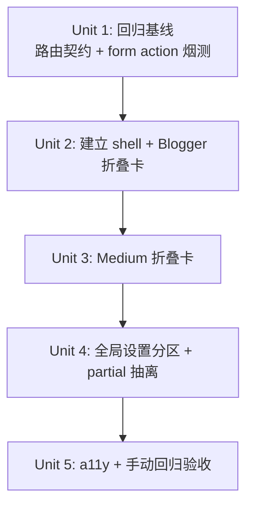

# Settings 页面渠道分组与折叠重构

## Overview

把当前 `/settings` 页面的 6 张平铺卡片重组为「发布渠道（独立可折叠卡片栈）」+「全局设置（常驻展开）」两个分区。Blogger / Medium 各成一张默认折叠卡，头部展示状态徽章；Blog ID 映射并入 Blogger 卡内部；SEO 锚文本与排程仍归底部全局区。

本次只解决「页面太长、配置触达成本高」的 UX 问题，**不**引入 ChannelRegistry 抽象、**不**做自动注册、**不**为 velog/telegra.ph 添加 Coming soon 占位卡——这些将在第 3 个真实 adapter 落地时由真实需求驱动（origin 文档 Key Decisions 节）。

## Problem Frame

`webui_app/templates/settings.html` 已增长到 674 行平铺模板，进入设置页需滚动两屏。继续接入 velog/telegra.ph 等新平台必然恶化。改版的 UX 痛点是「配置触达成本」，结构痛点是「模板膨胀且未抽象出可复用片段」。详见 origin 文档 Problem Frame 节。

## Requirements Trace

直接对齐 origin 文档 R1–R15：

- **R1, R3**：信息架构（顶部「发布渠道」分区 + Blog ID 映射入 Blogger 卡）→ Unit 2（建立 shell 时落地）
- **R2**：底部「全局设置」分区 → Unit 4
- **R4–R5**：默认折叠 + 头部展示规则 → Unit 2、Unit 3
- **R6**：状态徽章 2 态（ok/err），Medium 显示 2 个独立徽章 → Unit 2、Unit 3
- **R7**：独立 Collapse，**不**使用 `data-bs-parent`，允许多开 → Unit 2
- **R8**：用 `<button>` 包裹头部触发器，结构隔离表单冒泡 → Unit 2
- **R9–R10**：a11y（Tab/Enter/Space/ARIA）+ 焦点管理 → Unit 2（建立 pattern），Unit 3（沿用），Unit 5（手测）
- **R11–R13**：操作按钮反馈沿用现有 flash + Loading Overlay + 原生 `confirm()`，**不**引入新组件 → Unit 2、Unit 3（保留现有 form 不动）
- **R14**：渠道卡体抽到独立 partial，主模板用具名 `` → Unit 2、Unit 3
- **R15**：全局设置（SEO 锚文本、排程）也抽到 partial → Unit 4

Success Criteria（origin）→ Unit 1（建立回归基线）+ Unit 5（验收）：

- 任务交互 ≤ 2 次（点头部 + 点字段）
- 桌面 ≥1280×720 首屏 + 移动 375px 至少 1 张完整头部
- 10 个 POST 端点 + inline JS 句柄 100% 等价回归（已由 `tests/test_webui_route_contract.py` 覆盖）
- 键盘单独可达全流程

## Scope Boundaries

- **不**引入 ChannelRegistry / channel 自动发现机制
- **不**为 velog/telegra.ph 添加 Coming soon 占位卡
- **不**修改任何后端发布行为、路由 URL（路径本身不变，但 10 个渠道相关 POST 端点的 redirect 目标会追加 `#channel-<id>` fragment——这是非破坏性增强，不影响任何客户端，详见 Key Decisions）、`_settings_context()` 返回的 key
- **不**引入前端框架（继续 Bootstrap 5 + 原生 JS）
- **不**新增反馈组件（toast / Modal / inline error helper），保留 flash + Loading Overlay + `confirm()`
- **不**重构 Blogger OAuth 内部的 Google Cloud Console 教学文案（只是包裹进折叠卡）
- **不**统一 SEO 锚文本与 Blog ID 映射为「按目标域配置」总表（origin 显式承担此 inconsistency）

## Context & Research

### Relevant Code and Patterns

- `webui_app/templates/settings.html`（674 行，待重构）—— 当前 6 张卡片平铺
- `webui_app/templates/sites.html`（153 行）—— 较短模板，仍是单文件结构（无 include 先例）
- `webui_app/routes/settings_basic.py`（122 行）—— `/settings` GET + 4 个 POST 端点；`render_template('settings.html', **_settings_context(...))`
- `webui_app/helpers.py:495-528` `_settings_context()` —— 已扁平化返回 `flash / blogger_token / blogger_client_id / blog_ids / medium_token_set / medium_oauth_configured / all_targets / target_anchor_keywords / schedule_settings / config_path / callback_uri / ...`；partial 通过 ``（默认携带 context）即可直接访问
- `webui_app/routes/oauth.py`、`webui_app/routes/settings_basic.py` —— 所有 POST 路由 URL 保持不变
- `tests/test_webui_route_contract.py` —— 已覆盖 settings GET + 10 个 POST 端点的 status 码契约，**显式不断言 HTML 内容**（注释原话：「deliberately does NOT assert HTML content」），是为模板重构准备的回归网

### Institutional Learnings

- AGENTS.md「Monolith Budget」节：`monolith_budget.toml` 只跟踪 5 个 Python 源文件，**模板文件不在 SLOC ceiling 之内**——origin 文档之前用 "settings.html LOC 不增加" 作 success criterion 是误用；瘦身版已替换为行为指标，此 plan 不再设结构性 LOC 门
- AGENTS.md「Lessons capture」节：高价值经验事后可考虑 `/ce:compound` 提升到 `docs/solutions/`

### External References

无。Bootstrap 5 Collapse 已在 `settings.html` 内现有 navbar/alert dismissible 间接使用，本次只是把它用于卡片体；不需要外部研究。

## Key Technical Decisions

- **不是 accordion，是独立 Collapse 堆栈**。Bootstrap 5 的 Accordion 通过 `data-bs-parent` 强制 mutual exclusion——本次明确不用 `data-bs-parent`，保留 R7 「允许多开对照填写」。命名与文档全部使用「可折叠卡片栈 / Collapse」，避免 reviewer/实装人误套 accordion 行为。
- **头部触发器用独立 `<button type="button">`，结构隔离表单冒泡**。`<button data-bs-toggle="collapse" data-bs-target="#panel-X">` 作为 card-header 内的元素，**不**嵌套在 `<form>` 内；卡片体内部的 `<form>` submit 事件冒泡到 `document.addEventListener('submit', ...)`（Loading Overlay 全局监听器）路径完全不变。Origin 文档曾担忧 Bootstrap Collapse 头部按钮如果嵌在 `<form>` 内、其点击会冒泡触发全局 submit 监听器与 Loading Overlay；本设计把触发按钮放在 form 之外，从 DOM 结构上根除冒泡问题，比依赖 `stopPropagation()` 更可靠。
- **状态徽章降至 2 态（ok/err）**。`_settings_context()` 现有 flag 都是 binary（`blogger_token` / `medium_token_set` / `medium_oauth_configured`），三态 ok/warn/err 是 over-spec；warn 等真实中间态出现时再引入。
- **Medium 显示 2 个独立徽章，徽章文字本身带状态**（`OAuth ✓` / `OAuth ✗` + `Token ✓` / `Token ✗`，**不**仅靠颜色区分）。`medium_oauth_configured` 与 `medium_token_set` 在 helpers.py 中是独立 flag，证实 origin Outstanding Question [Affects R6] 的假设。状态用「文字标签 + 颜色 + 符号」三重冗余编码以满足 WCAG 1.4.1：色盲用户即使看不出红绿差，也能从 `✓`/`✗` 与文字本身判断状态。Blogger 单徽章同样：`已授权` / `未授权`（已是文字带状态）。
- **partial 命名采用 `_` 前缀 + 平铺，不开子目录**。项目当前 4 个模板都是平铺，无 `templates/<subdir>/` 先例。本次预计新增最多 4 个 partial：`_settings_channel_blogger.html`、`_settings_channel_medium.html`、`_settings_global_keywords.html`，以及 `_settings_global_schedule.html`（后者由 Unit 4 实装时按主模板剩余长度决定是否抽出——见 Deferred to Implementation）。若未来 partial 数量超过 ~10 个再考虑迁子目录。
- **保留所有 DOM id 与 anchor，并解决 deep-link 进入折叠卡问题**。`#blogger-blog-ids`、`#clientSecretInput`、`#mediumTokenInput`、`#oauthCredForm`、`#blogIdRows`、`#callbackUriDisplay`、`#copyBtn`、`#secretEye`、`#eyeIcon` 全部保留——现有 inline JS（`copyUri / toggleSecret / toggleToken / addRow / removeRow`）继续工作。`#blogger-blog-ids` 现在嵌在折叠面板 `#channel-blogger` 内部，浏览器无法直接 scroll-to-anchor 到 `display:none` 元素——必须由 JS 在 `DOMContentLoaded` + `hashchange` 上做「若 hash 指向折叠面板内部的 id，则先 `bootstrap.Collapse.getOrCreateInstance(panel).show()` 再 `scrollIntoView()`」处理。该 JS 由 Unit 2 实装（见 Unit 2 Approach）。
- **图标保持不变**。Blogger 头部仍用现有 `<i class="bi bi-google" style="color:#ea4335;">`，Medium 头部仍用 `<i class="bi bi-medium">`；不引入新图标集。
- **flash 消息后对应渠道卡自动展开**。当某 POST 端点 redirect 回 `/settings?flash_type=...&flash_msg=...` 时，附加 URL fragment `#channel-<id>`（如 `/settings/save-medium-token` 的 redirect 改为 `/settings?flash_type=success&flash_msg=Medium Token 已保存#channel-medium`）；Unit 2 增加的 deep-link JS 会自动展开对应折叠卡，让用户立刻看到状态变化、无需手动点开。涉及的路由文件：`webui_app/routes/settings_basic.py`（4 个 settings/* 端点：save_blog_ids、revoke_blogger、save_medium_token、clear_medium_token）+ `webui_app/routes/oauth.py`（6 个 oauth 端点：Blogger / Medium 各自的 oauth_start、oauth_callback、save_blogger_oauth / clear_medium_oauth）= **共 10 个渠道相关端点**。Global 设置端点（`/settings/save-target-keywords`、`/settings/schedule`）不加 fragment——它们在全局区，本就常驻可见。每个端点的**所有** redirect 行（包括 error 路径）均一致追加 fragment，以保证 flash 错误消息时同样触发自动展开。
- **回归网用现有路由契约测试，不新增专门的模板内容断言**。`tests/test_webui_route_contract.py` 的设计意图就是为模板重构准备；本次复用它作主要回归保障，再加少量「关键 form action URL 必须仍出现在 HTML 中」的轻量断言（Unit 1）。

## Open Questions

### Resolved During Planning

- **Bootstrap Collapse + 内部 form + 全局 submit 监听器是否冲突？**——不冲突。头部触发器是 `<button type="button">`（不在 form 内），Loading Overlay 在 `document` 级监听 submit，form 在 Collapse 面板内部 submit 时事件正常冒泡到 document。结构隔离已避免冒泡问题。
- **partial 文件命名约定？**——平铺前缀法：`webui_app/templates/_settings_channel_*.html` / `_settings_global_*.html`，无子目录。
- **Medium 的 OAuth 与 Token 是否真正独立？**——是。`_settings_context()` 中两个 flag 由不同 config 字段（`cfg.medium_integration_token` vs `medium_token_data + cfg.medium_oauth`）独立计算，可同时设、可同时空、可只设一个。R6 的「2 个独立徽章」设计成立。
- **status badge 数据组装位置？**——继续由 `_settings_context()` 暴露 binary flag；模板层通过 ` ok  err ` 等条件渲染。不引入 status_badges() 抽象。

### Deferred to Implementation

- 状态徽章在窄屏（<576px）下是否需要降级为彩色 dot——实装时观察布局拥挤度再定；origin Success Criteria 只要求移动端可见至少 1 张完整头部，未强制要求徽章保留文字。徽章已带 `✓`/`✗` 文字符号，即使在窄屏丢失颜色也可辨认状态。
- 是否给排程区也抽出独立 partial（`_settings_global_schedule.html`）——Unit 4 实装时根据剩余主模板长度判断；若不抽剩余 ~20 行排程块也可接受。
- a11y 焦点管理的具体实现：是否需要显式 JS 设置 `focus()`，还是 Bootstrap 5 Collapse 的默认行为已足够。需在 Unit 5 手测时验证。
- 渠道名是否包成 `<h3>` 加入语义大纲（让屏阅器可按 heading 跳转到具体渠道）：当前规划是 `<span>`，留待 Unit 5 手测时根据 VoiceOver 实际体验决定。优势是 a11y 提升；代价是 `<h3>` 在 `<button>` 内的 CSS 默认样式需要 reset。
- Bootstrap 版本固定：当前 settings.html 从 CDN 拉 `bootstrap@5.3.0`。未来 minor bump 可能改变 Collapse 内部行为；Unit 2 commit message 中记录当前版本作为参考；如需固定，独立 PR 处理。
- 整体视觉差异化（避免 generic Bootstrap card-stack 美感）：当前规划是 generic + 沿用现有 `--primary`/`--gradient` 变量。本项目是自用工具，generic-but-functional 可接受。如未来想加项目特性 touch（例如每个渠道卡左侧 brand 色 border），列入 follow-up。

## High-Level Technical Design

> *This illustrates the intended approach and is directional guidance for review, not implementation specification. The implementing agent should treat it as context, not code to reproduce.*

新主模板骨架（settings.html）的高层 DOM 形态：

```
<body>
  <nav>...</nav>
  <container>
     <alert> 

    <!-- 顶部分区：发布渠道 -->
    <h2>发布渠道</h2>
    <div class="channels">
      {# Blogger #}
      <div class="card channel-card">
        <div class="card-header">
          <button type="button"
                  class="channel-toggle"
                  data-bs-toggle="collapse"
                  data-bs-target="#channel-blogger"
                  aria-expanded="false"
                  aria-controls="channel-blogger">
            <i aria-hidden="true">{icon}</i>
            <span>Blogger</span>
            <span class="badges">
              <span class="badge ok">已授权 ✓</span>
              <span class="badge err">未授权 ✗</span>
              
            </span>
            <i class="chevron" aria-hidden="true">▶</i>
          </button>
        </div>
        <div id="channel-blogger" class="collapse">
          
        </div>
      </div>

      {# Medium —— 同上结构，2 个独立徽章 [OAuth ✓/✗] [Token ✓/✗] #}
      ...
    </div>

    <!-- 底部分区：全局设置 -->
    <h2>全局设置</h2>
    
    
    <div class="card"><config_path block — small enough to inline></div>

  </container>
  <!-- 现有 Loading Overlay + 现有 <script> 块全部原样保留 -->
</body>
```

partial 内部就是把 settings.html 当前对应卡片体（`<div class="card-body">...</div>`内容）原样剪贴过去。**所有 `<form>`、DOM id、inline JS 调用、flash 渲染逻辑保持原样**——只是把它从主模板里搬到 partial 文件里。

`_settings_context()` 返回的所有 key 通过 `` 默认携带 context 自动继承到 partial（Jinja `` 默认即 `with context`，无需显式声明；Unit 2 实施前的 Risks 表 smoke 测试会验证此假设）。

## Implementation Units



> **Unit 1 是持续验证门，不是一次性前置依赖**：`tests/test_webui_route_contract.py` 在 Unit 2、3、4 实施过程中**不修改**，但每个 Unit 完成后都必须继续全绿通过。Unit 5 同样作为最终回归 gate。

- [ ] **Unit 1: 回归基线 — 路由契约补强 + 关键 DOM 锚点烟测**

**Goal:** 在动模板之前，把 `tests/test_webui_route_contract.py` 对 `/settings` GET 的断言从「状态码 200」补强到「页面中仍含所有关键 form action URL 与 DOM id」，作为本次重构的回归网。

**Requirements:** Success Criteria — 10 个 POST 端点 + inline JS 句柄 100% 等价回归

**Dependencies:** 无

**Files:**
- Modify: `tests/test_webui_route_contract.py`

**Approach:**
- 在 `test_settings_get` 类型测试旁边新增 `test_settings_html_contract`，对 GET `/settings` 返回的 HTML body 断言以下子串均存在：
  - form action：`/settings/blogger/oauth-start`、`/settings/save-blogger-oauth`、`/settings/revoke-blogger`、`/settings/save-blog-ids`、`/settings/medium/oauth-start`、`/settings/save-medium-token`、`/settings/clear-medium-token`、`/settings/clear-medium-oauth`、`/settings/save-target-keywords`、`/settings/schedule`
  - DOM id（全部 9 个，与 System-Wide Impact「Unchanged invariants」对齐）：`id="oauthCredForm"`、`id="clientSecretInput"`、`id="mediumTokenInput"`、`id="blogger-blog-ids"`、`id="blogIdRows"`、`id="callbackUriDisplay"`、`id="copyBtn"`、`id="secretEye"`、`id="eyeIcon"`
  - inline JS handler 调用名：`copyUri(`、`toggleSecret(`、`toggleToken(`、`addRow(`、`removeRow(`
- 跑测，确认重构前基线全绿。
- **结构性断言**（防止 Unit 3 copy-paste 把 Blogger form 黏到 Medium partial 里）：用 `BeautifulSoup`（已是项目依赖 `beautifulsoup4>=4.12`，见 `pyproject.toml:17`）解析 `/settings` 响应，**拆为两个独立测试**以匹配 unit-by-unit 进度：
  - `test_blogger_forms_scoped_to_channel_panel`：所有 Blogger 相关 form action（`/settings/blogger/*`、`/settings/save-blogger-oauth`、`/settings/save-blog-ids`、`/settings/revoke-blogger`）都在 `#channel-blogger` 的后代 form 内
  - `test_medium_forms_scoped_to_channel_panel`：所有 Medium 相关 form action（`/settings/medium/*`、`/settings/save-medium-token`、`/settings/clear-medium-*`）都在 `#channel-medium` 的后代 form 内
  - 两个测试在 Unit 1 实施时均加 `pytest.mark.xfail(strict=False, reason='structural assertion requires Unit 2/3 partials')`（因 `#channel-blogger` / `#channel-medium` 都不存在）；**Unit 2 完成后去除 Blogger 测试的 xfail**；**Unit 3 完成后去除 Medium 测试的 xfail**。拆分确保每个 commit 的 CI 都能保持绿色，不会因 Unit 2 提前去 xfail 而 Medium 还未实装导致红色。
- 注意：字符串「存在」断言仅捕获删除；URL 修改（如 `/settings/blogger/oauth-start?broken` 子串仍匹配）由结构性断言互补——`<form action="/settings/blogger/oauth-start">` 找不到时整个 BeautifulSoup query 落空，自然 fail。

**Patterns to follow:**
- 紧邻现有 `test_webui_route_contract.py` 中 `/settings` GET 的测试位置（约 L162）
- 复用现有 `_isolated_config_dir` / `_isolated_webui_state` fixtures
- 风格：单一断言一个集合（`for url in URLS: assert url.encode() in resp.data`）

**Test scenarios:**
- Happy path：GET `/settings` 返回 200，HTML body 包含全部 10 个 form action URL → pass
- Happy path：GET `/settings` 返回 200，HTML body 包含全部 9 个关键 DOM id → pass
- Happy path：GET `/settings` 返回 200，HTML body 包含全部 5 个 inline JS handler 调用 → pass
- Edge case：缺任意一个 URL/id/handler 时此测试 fail（重构过程中如有遗漏，立即捕获）

**Verification:**
- `pytest tests/test_webui_route_contract.py -k settings -q` 全绿
- 该测试在 Unit 2–4 实施过程中**不修改**，且每个 Unit 完成后均能继续通过

---

- [ ] **Unit 2: 建立折叠卡 shell + 迁移 Blogger 卡到 partial**

**Goal:** 抽出第一个 partial `_settings_channel_blogger.html`、建立完整折叠卡 + 状态徽章 + a11y 头部触发器 pattern；用 Blogger 卡作端到端样本，证明 pattern 成立。Blog ID 映射卡（origin R3）从独立卡降级为 Blogger partial 内部的子 section。

**Requirements:** R1, R3, R4–R8, R9–R10, R14

**Dependencies:** Unit 1

**Files:**
- Create: `webui_app/templates/_settings_channel_blogger.html`
- Modify: `webui_app/templates/settings.html`
- Test: `tests/test_webui_route_contract.py`（仅运行 Unit 1 的 contract 测试验证；本 Unit **不**修改测试）

**Approach:**
- 在 `_settings_channel_blogger.html` 中放入「①Blogger OAuth 设置」卡的整个 `<div class="card-body">` 内容（包含 Google Cloud Console 教学块、Step 2 凭据表单、Google 登录按钮、撤销按钮），并把「②Blog ID 映射」卡的 `<div class="card-body">` 拼接进同一 partial 末尾作为子 section（保留 `id="blogger-blog-ids"` 作为 deep-link 锚点，但移到 partial 内部一个 `<div>` 上而不是外层 `<div class="card">` 上）。
- 在主 `settings.html` 中删除原 ① 和 ② 卡的完整 `<div class="card">...</div>` 块；用新 shell 替换：
  ```
  <h2>发布渠道</h2>
  <div class="channels">
    <div class="card channel-card">
      <div class="card-header p-0">
        <button type="button" class="btn channel-toggle w-100 text-start"
                data-bs-toggle="collapse" data-bs-target="#channel-blogger"
                aria-expanded="false" aria-controls="channel-blogger">
          {图标 + Blogger + 徽章 + chevron 的 inline 布局}
        </button>
      </div>
      <div id="channel-blogger" class="collapse">
        <div class="card-body">
          
        </div>
      </div>
    </div>
  </div>
  ```
- 状态徽章逻辑（基于 helpers.py 现有 flag）：
  ```
  
    <span class="badge ok">已授权 ✓</span>
  
    <span class="badge err">未授权 ✗</span>
  
  ```
- CSS：在主模板 `<style>` 顶部追加：
  ```css
  .channel-toggle {
      background: none; border: none; width: 100%;
      display: flex; align-items: center; gap: 0.5rem;
      padding: 14px 20px; text-align: left;
  }
  .channel-toggle .badges { margin-left: auto; display: flex; gap: 0.25rem; }
  .badge.ok { background: #dcfce7; color: #166534; }
  .badge.err { background: #fee2e2; color: #991b1b; }
  .chevron { transition: transform 180ms ease-out; }
  .channel-toggle[aria-expanded="true"] .chevron { transform: rotate(90deg); }
  @media (prefers-reduced-motion: reduce) {
      .chevron { transition: none; }
  }
  ```
  显式 flex 布局保证 Blogger（1 徽章）与 Medium（2 徽章）的 chevron x 位置一致（`.badges { margin-left: auto }` 把徽章组推到右、chevron 永远最右）；transition 与 prefers-reduced-motion 处理保证两个实装者产出一致的视觉感受。沿用 origin 已有的 `--primary` / `--gradient` 变量。
- **deep-link 进入折叠面板的 JS 处理**（解决 `#blogger-blog-ids` 嵌在折叠卡内导致 scroll-to-anchor 失效）：在主模板 `<script>` 内追加最小 JS：
  ```
  // on load + on hashchange, if the hash targets an id inside a collapsed panel,
  // expand its ancestor Collapse first, then scrollIntoView.
  function _openCollapseForHash() {
      const id = window.location.hash.slice(1);
      if (!id) return;
      const target = document.getElementById(id);
      if (!target) return;
      const panel = target.closest('.collapse');
      if (panel && !panel.classList.contains('show')) {
          bootstrap.Collapse.getOrCreateInstance(panel).show();
          // Re-scroll after expansion completes
          panel.addEventListener('shown.bs.collapse',
              () => target.scrollIntoView({block:'start'}), {once:true});
      }
  }
  document.addEventListener('DOMContentLoaded', _openCollapseForHash);
  window.addEventListener('hashchange', _openCollapseForHash);
  ```
- 关键约束：
  - `data-bs-target` 上**不**加 `data-bs-parent`（避免 accordion mutual exclusion，落地 R7）
  - 触发器是 `<button type="button">`，不嵌在任何 `<form>` 内（落地 R8）
  - 移植过程中**不修改任何 `<form>` 内部内容**——剪贴即可。注意当前 settings.html L172、L179 上的 Blogger OAuth 提交按钮使用 `<button type="submit" formaction="/settings/save-blogger-oauth">` 与 `<button type="submit" formaction="/settings/blogger/oauth-start">`（不是 `<form action>`）；这些 `formaction` 属性也必须随 form 一起搬到 `_settings_channel_blogger.html`，不能遗漏在主模板里
  - 保留所有 DOM id、JS handler 调用、flash 块

**Patterns to follow:**
- 当前 `settings.html` ① 卡片的「连接状态」徽章风格（`.badge-status.ok` / `.badge-status.err`）——可直接复用 CSS 类，或起新名 `.badge.ok` / `.badge.err` 与之并列；建议复用现有 `.badge-status` 以减少 CSS 增量
- `<details>` 在「SEO 锚文本」卡中的折叠模式（不是 Bootstrap Collapse，但语义上相近）——本次明确**不**复用 `<details>`，因为它的头部布局自由度不够装多个徽章与图标

**Test scenarios:**
- Happy path（Unit 1 contract 测试自动覆盖）：所有 form action URL / DOM id / JS handler 调用仍出现在 HTML 中
- Edge case：浏览器手测——单击头部 → 卡片展开；再次单击 → 卡片折叠；展开后 Blogger 卡内的「确认绑定」「使用 Google 帐号登入」「保存映射」「撤销现有授权」按钮全部正常提交（Loading Overlay 仍触发，因为它是 document 级 submit 监听器）
- Edge case：浏览器手测——`#blogger-blog-ids` deep-link（地址栏直接访问 `/settings#blogger-blog-ids`）仍能滚动到 Blog ID 映射子 section
- a11y scenario：键盘 Tab 聚焦到 Blogger 头部触发器 → Enter/Space 切换展开状态；screen reader 读出 "Blogger, 已授权, button, collapsed/expanded"

**Verification:**
- Unit 1 的 `test_webui_route_contract.py` 全套测试绿
- 手动启 `flask` dev server，访问 `/settings`：Blogger 卡默认折叠，单击头部展开后能完成 OAuth 凭据保存 + Google 登录 + 撤销三个操作
- HTML 中 `<button data-bs-toggle="collapse" data-bs-target="#channel-blogger" aria-expanded="false" aria-controls="channel-blogger">` 存在；`<div id="channel-blogger" class="collapse">` 存在；**不**含 `data-bs-parent` 属性

---

- [ ] **Unit 3: 迁移 Medium 卡到 partial**

**Goal:** 按 Unit 2 建立的 pattern 抽出 `_settings_channel_medium.html`，把 Medium 卡（含 OAuth 与 Integration Token 两条独立路径）改造为折叠卡，头部显示 2 个独立徽章。

**Requirements:** R1, R4–R8, R9–R10, R14；R6 的 Medium 双徽章规则

**Dependencies:** Unit 2（pattern 已建立）

**Files:**
- Create: `webui_app/templates/_settings_channel_medium.html`
- Modify: `webui_app/templates/settings.html`

**Approach:**
- 把当前 settings.html ③ 卡的 `<div class="card-body">` 整段内容（OAuth 表单 + Integration Token 表单 + 状态显示）剪贴到 `_settings_channel_medium.html`。
- 在主模板中替换为新 shell：
  ```
  <div class="card channel-card">
    <div class="card-header p-0">
      <button type="button" ...
              data-bs-target="#channel-medium"
              aria-controls="channel-medium">
        <i aria-hidden="true">{Medium icon}</i>
        <span>Medium</span>
        <span class="badges">
          
            <span class="badge ok">OAuth ✓</span>
          
            <span class="badge err">OAuth ✗</span>
          
          
            <span class="badge ok">Token ✓</span>
          
            <span class="badge err">Token ✗</span>
          
        </span>
        <i class="chevron" aria-hidden="true">▶</i>
      </button>
    </div>
    <div id="channel-medium" class="collapse">
      <div class="card-body">
        
      </div>
    </div>
  </div>
  ```
- 不修改 Medium partial 内部任何表单逻辑、不修改 `toggleToken()` JS。
- 渠道顺序：按字母顺序（Blogger → Medium），与 origin R1 一致。

**Patterns to follow:**
- Unit 2 在 Blogger 卡上确立的 shell pattern——直接照抄 `<button>` + Collapse + `<div class="card-body"></div>` 结构

**Test scenarios:**
- Happy path（Unit 1 contract 测试覆盖）：Medium 相关的 4 个 form action URL + `mediumTokenInput`/`eyeIcon` id + `toggleToken(` 调用 全部仍存在
- Edge case：手测——OAuth 已授权 + Token 已设 → 头部显示 `[OAuth ✓] [Token ✓]` 两个绿徽章；都未设 → `[OAuth ✗] [Token ✗]` 两个红徽章；只设其一 → 一绿一红。状态可仅凭文字（`✓`/`✗`）辨认，不依赖颜色（色盲安全）。
- Edge case：手测——点击「通过 Medium 授权」「保存 Token」「清除 Token」「清除 OAuth 授权」四个按钮均正常提交（Loading Overlay 触发）

**Verification:**
- Unit 1 测试套件全绿
- 浏览器手测：Medium 卡默认折叠，两个徽章状态正确反映 `medium_oauth_configured` / `medium_token_set` 当前值
- 多开验证：同时展开 Blogger + Medium 两张卡，互不影响（落实 R7）
- deep-link 验证（来自 Unit 2 的 JS）：直接访问 `/settings#blogger-blog-ids`，Blogger 卡自动展开 + 滚动到 Blog ID 子 section

---

- [ ] **Unit 4: 「全局设置」分区 + SEO 锚文本/排程抽 partial + 渠道 redirect fragment**

**Goal:** 建立底部「全局设置」分区标题；把 SEO 锚文本块（约 40 行）和排程块（约 25 行）抽到独立 partial；配置文件路径块体量小（~10 行）保留在主模板内 inline。同时给 10 个渠道相关 POST 端点的 redirect 目标追加 `#channel-<id>` fragment，让 OAuth/Token 保存后对应折叠卡自动展开（落实 design-lens 提出的「flash 消息与渠道状态对应」UX）。落实 origin R2、R15。

**Requirements:** R2, R15；附加：flash → 渠道卡自动展开

**Dependencies:** Unit 3（渠道部分已重构完，主模板剩余结构清晰）

**Files:**
- Create: `webui_app/templates/_settings_global_keywords.html`
- Create: `webui_app/templates/_settings_global_schedule.html`
- Modify: `webui_app/templates/settings.html`
- Modify: `webui_app/routes/settings_basic.py`（追加 `#channel-blogger` / `#channel-medium` fragment 到 4 个渠道相关 redirect：`save_blog_ids`、`revoke_blogger`、`save_medium_token`、`clear_medium_token`）
- Modify: `webui_app/routes/oauth.py`（追加 fragment 到 6 个 OAuth-related redirect：Blogger oauth_start / oauth_callback / save_blogger_oauth + Medium oauth_start / oauth_callback / clear_medium_oauth）

**Approach:**
- 在 Blogger / Medium 折叠卡之后插入 `<h2>全局设置</h2>` 分区标题。
- 把 settings.html「④b SEO 锚文本关键词池」卡的完整 `<div class="card">` 抽到 `_settings_global_keywords.html`（连卡片外壳一起搬，因为它不折叠、是常驻展开）。
- 把「⑤ 排程发布设定」卡的完整 `<div class="card">` 抽到 `_settings_global_schedule.html`。
- 「④ 配置文件位置」卡保留在主模板内 inline（约 13 行，不值得新增一个 partial 文件）。
- 主模板「全局设置」分区下顺序：`_settings_global_keywords.html` → `_settings_global_schedule.html` → inline 配置文件路径卡。
- **路由 redirect fragment**：把 8 个渠道相关 redirect 的目标 URL 末尾追加对应渠道 fragment。例如 `settings_basic.py:save_blog_ids` 中 `redirect('/settings?flash_type=success&flash_msg=Blog ID 映射已保存')` → `redirect('/settings?flash_type=success&flash_msg=Blog ID 映射已保存#channel-blogger')`。具体 8 个端点：
  - Blogger 相关 (`#channel-blogger`)：`save_blog_ids`、`revoke_blogger`（settings_basic.py）+ Blogger OAuth start/callback/save-oauth（oauth.py）= 5 个端点
  - Medium 相关 (`#channel-medium`)：`save_medium_token`、`clear_medium_token`（settings_basic.py）+ Medium OAuth start/callback/clear-oauth（oauth.py）= 5 个端点
  - **共 10 个渠道相关端点**。每个端点内**所有** `redirect(...)` 调用（含错误路径）均追加对应 fragment。
  - 全局端点 (`save_target_keywords`、`schedule_save`) **不**加 fragment（常驻可见）

**Patterns to follow:**
- Unit 2/3 的 `` 用法——同样不显式 `with context`，依赖 Jinja 默认 context 继承
- 现有「④b SEO 锚文本」卡内部 `<details>` 结构与 `target_anchor_keywords` 循环——一字不动剪贴

**Test scenarios:**
- Happy path（Unit 1 contract 测试覆盖）：`/settings/save-target-keywords` 与 `/settings/schedule` 两个 form action URL 仍出现在 HTML 中
- Edge case：手测——填写 SEO 关键词并保存 → flash 成功消息；改排程间隔并保存 → flash 成功消息
- Edge case：手测——`all_targets` 为空时 SEO 块仍显示「暂无已知 target 站」引导文案（保留现有 `` 分支）
- Integration scenario：保存 Medium Token → redirect 回 `/settings?...#channel-medium` → Medium 折叠卡自动展开 + 顶部 flash 显示「Medium Token 已保存」；Blogger 仍折叠
- Integration scenario：撤销 Blogger OAuth → redirect 回 `/settings?...#channel-blogger` → Blogger 折叠卡自动展开 + flash 显示「Blogger 授权已撤销」
- Integration scenario：保存 SEO 关键词 → redirect 不含 fragment → 落地后两张渠道卡仍折叠（全局区本就常驻可见，不需要展开提示）

**Verification:**
- Unit 1 测试套件全绿
- 浏览器手测：进入 `/settings` 时「全局设置」分区下三块内容（锚文本、排程、配置路径）常驻可见，**不折叠**
- 结构性 verification（替代具体 LOC 数字门——本项目的 monolith ceiling 不覆盖模板）：主模板 `settings.html` 中**不再含**任何 form action URL 的字面字符串（除已迁出的 partial 中外），即所有 `<form action="...">` 与 `<button formaction="...">` 都已由 4 个 partial 接管；用 `grep -cE '(form)?action="/settings/' webui_app/templates/settings.html` 应为 0（正则覆盖 `action="` 和 `formaction="` 两种写法）

---

- [ ] **Unit 5: a11y + 手动回归验收**

**Goal:** 完成键盘单独可达性与 screen reader 验收，跑全套回归清单，确认 origin Success Criteria 全部达成。

**Requirements:** R9–R10；origin Success Criteria 全部

**Dependencies:** Unit 2, Unit 3, Unit 4 全部完成

**Files:**
- 可能 Modify: `webui_app/templates/settings.html`（如手测发现 a11y 或视觉缺陷需补 CSS / JS focus 管理）
- 可能 Modify: 任一 partial（同上）

**Approach:**
- **键盘单独走完**：从浏览器地址栏聚焦开始，仅用 Tab/Shift+Tab/Enter/Space/方向键 完成：(1) 找到 Blogger 卡 → (2) 展开 → (3) 编辑 Blog ID → (4) 提交保存。整个流程不动鼠标。
- **Screen reader 验证**（macOS VoiceOver 或浏览器 DevTools 的 a11y 树）：每个折叠头部读出「{渠道名}, {徽章可见文字（如 'OAuth ✓' / '已授权 ✓'）}, button, collapsed/expanded」。徽章文字本身就是 button 的 accessible name 一部分，无需额外 aria-label。
- **Viewport 验证**：用浏览器 DevTools responsive 模式分别在 1280×720 桌面与 375×667 移动尺寸下截图，确认 origin Success Criteria 的可见性指标。
- **完整回归清单**（origin Success Criteria 第 3 条）：
  - `pytest tests/test_webui_route_contract.py -q` 全绿
  - 手动逐一触发 10 个 POST 端点 + 5 个 inline JS handler，对照 origin Success Criteria 表勾选
  - `#blogger-blog-ids` deep-link 仍工作
  - Loading Overlay 在每个 OAuth/保存提交时仍触发
- 如手测发现 a11y 缺陷（如焦点丢失、徽章未被读出），补最小修正：
  - 焦点丢失场景：在主模板 `<script>` 内追加最小 JS——`document.querySelectorAll('.channel-toggle').forEach(btn => btn.addEventListener('click', e => btn.focus()))`（如果 Bootstrap 5 默认行为已保留焦点则跳过此步，origin Outstanding Question 已明确）
  - 徽章未读：徽章是 `<button>` 的可见后代文字，应自动成为 button accessible name 的一部分；若 VoiceOver 仍未读出，最小修正是把徽章拎出 button 用 `<span role="status">` 并 `aria-describedby` 关联到 button

**Test scenarios:**
- a11y scenario：键盘单独完成「定位 Blogger → 展开 → 聚焦 Client ID 输入 → 提交确认绑定」全流程
- a11y scenario：VoiceOver 读出每个折叠头部时包含渠道名 + 徽章状态文本 + button/expanded 角色
- Regression scenario：10 个 POST 端点逐一手测成功（origin Success Criteria 逐项勾选）
- Viewport scenario：桌面 1280×720 首屏内可见「发布渠道」标题 + Blogger + Medium 完整折叠头部；移动 375px 首屏可见至少 1 张完整头部、第 2 张部分可见

**Verification:**
- origin 文档 Success Criteria 4 条全部满足
- `pytest tests/test_webui_route_contract.py -q` 全绿
- 键盘可达性走通；VoiceOver 输出符合预期
- 主模板 settings.html 的实际行数作为 commit message 中的观察数据点（无具体下限要求；本计划已放弃数字 LOC 门，因模板不在 monolith ceiling 内）

## System-Wide Impact

- **Interaction graph：** 仅影响 `settings.html` 单一模板渲染路径；所有路由处理器（`settings_basic.py`、`oauth.py`、`profiles.py`）零修改。`_settings_context()` 返回值不变。
- **Error propagation：** flash 消息机制不变（`?flash_type=...&flash_msg=...` query param → `` 块渲染）。各 POST 端点的成功/失败 redirect 全部走原路径。
- **State lifecycle risks：** 无。无后端状态变更、无 schema 变更、无新增缓存。
- **API surface parity：** 10 个 POST 端点 URL + 1 个 GET URL 全部不变；该项目无外部 API 消费者依赖 settings 页面 HTML 结构（这是 self-hosted 私用工具）。
- **Integration coverage：** `tests/test_webui_route_contract.py` 已覆盖关键交互；Unit 1 补强了「关键 form action URL + DOM id + JS handler 必须出现在 HTML 中」的弱内容断言，作为模板重构的回归网。
- **Unchanged invariants：**
  - 所有 settings 路由的**请求路径**保持不变（10 个 POST + 1 个 GET + 2 个 OAuth callback 的 URL 路径未改）
  - 10 个渠道相关 POST 端点的 **redirect Location 目标**追加 `#channel-<id>` fragment（非破坏性增强、对客户端透明，让 OAuth/Token 保存后对应折叠卡自动展开）；全局端点 redirect 不变
  - `_settings_context()` 返回的所有 context keys 与值类型保持不变
  - 所有现有 DOM id（`#oauthCredForm`、`#clientSecretInput`、`#mediumTokenInput`、`#blogger-blog-ids`、`#blogIdRows`、`#callbackUriDisplay`、`#copyBtn`、`#secretEye`、`#eyeIcon`）保持不变
  - 所有现有 inline JS 函数（`copyUri()`、`toggleSecret()`、`toggleToken()`、`addRow()`、`removeRow()`、`loadProfile()`、`saveProfilePrompt()`、Loading Overlay 全局 submit 监听器）保持不变
  - 渠道图标保持不变（Blogger `bi bi-google` + 现有红色；Medium `bi bi-medium` + 默认色）
  - flash 消息渲染、Loading Overlay UI、`<style>` 主题变量全部保持不变

## Risks & Dependencies

| Risk | Mitigation |
|------|------------|
| Bootstrap 5 Collapse 与卡片内部 form 的事件冲突未被预测到 | 头部触发器用独立 `<button type="button">`（不嵌在 form 内）从结构上隔离；Unit 2 完成后手测 OAuth/Token 三个 submit 流程 + Loading Overlay 触发，发现异常立刻在 Unit 2 内回滚或修正 |
| `#blogger-blog-ids` deep-link 因 Blog ID 块移入 Blogger partial 内部而失效 | Unit 2 中显式保留 `id="blogger-blog-ids"` 锚点；Unit 1 contract 测试已包含此 id 的存在断言；Unit 5 手测时用 `/settings#blogger-blog-ids` 验证滚动行为 |
| inline JS（`document.getElementById('clientSecretInput')` 等）因 DOM id 命名空间变化失效 | Key Decision 明确保留所有现有 DOM id；Unit 1 contract 测试断言关键 id 与 handler 调用仍出现 |
| 视觉回归：折叠头部在窄屏拥挤、徽章重叠、chevron 错位 | Unit 5 包含 1280×720 + 375×667 两个 viewport 的手测截图；若拥挤则在 Unit 5 内补最小 CSS（如 < 576px 时徽章降级为彩色 dot，已列入 Deferred to Implementation） |
| 测试不充分：route contract 测试只验证 GET 200 与 form action 存在，未捕获深层 a11y/UX 回归 | a11y 与 UX 由 Unit 5 的手测兜底；本项目无自动化 e2e/视觉回归基础设施，引入它超出本次 scope |
| 模板拆分后 `_settings_context()` 某 key 在 partial 中通过 `` 默认 context 不可见 | Jinja 默认 `` 携带父 context（`with context` 即默认行为，无需显式写）。Unit 2 实施前先做一次最小烟测：在主模板中加一个 throwaway ``、partial 内仅含 `{{ blogger_client_id }}{{ blog_ids|length }}`，访问 `/settings` 确认渲染正常后再继续；通过后删除 smoke partial。这样在动真格之前就把 Jinja 配置假设验证掉。|

## Documentation / Operational Notes

- **PR 策略：两个 PR**。
  - **PR #1：Unit 1**（路由契约补强 + 含 xfail 的结构断言）**先独立 merge**——它只动 `tests/test_webui_route_contract.py`，对生产代码零影响，且为后续重构提供回归保障。
  - **PR #2：Unit 2 + Unit 3 + Unit 4 + Unit 5**——在同一 feature branch 上各自原子 commit，**统一在 Unit 5 完成验收后才合 PR**。Unit 5 是这个 PR 的唯一 merge gate。
  - 理由：Unit 5 是唯一的 a11y / VoiceOver / 跨 viewport 验收门，若发现结构性 a11y 阻塞（如 Bootstrap Collapse 默认焦点行为在 Safari 上断裂、`<button>` 包裹导致内部 form input 焦点丢失等），可在同一 branch 上回退或调整 Unit 2-4 的具体实现而不影响 main。若选 atomic-per-unit-merge 模式，Unit 5 发现的问题需要追溯改前面已 merge 的 commit，回滚成本陡升。
- 无 migration、无 feature flag、无 rollout 风险——这是 self-hosted dev 工具的纯 UI 重构，部署后即生效。
- 重构完成后若想形成「下次接入第 3 个渠道 (velog 或 telegra.ph)」的快速指南，可在 partial 文件顶部加注释（如 `{# pattern: 复制 _settings_channel_medium.html 作为新渠道 partial 起点 #}`）；建议在 Unit 5 commit 中顺手加上。
- AGENTS.md「Lessons capture」节：若手测过程中遇到 Bootstrap 5 Collapse 嵌套 form 的非预期行为，事后可考虑 `/ce:compound` 提升为 `docs/solutions/ui-bugs/` 条目。

## Sources & References

- **Origin document:** [docs/brainstorms/2026-05-18-settings-channel-collapse-requirements.md](docs/brainstorms/2026-05-18-settings-channel-collapse-requirements.md)
- Related code:
  - `webui_app/templates/settings.html`（重构目标）
  - `webui_app/routes/settings_basic.py`（保持不变的路由）
  - `webui_app/helpers.py:495-528`（`_settings_context()`，不变）
  - `tests/test_webui_route_contract.py`（Unit 1 补强目标）
- Related brainstorms（未来扩展时再激活，本次仅作上下文参考，**不**作为本次依赖）：
  - `docs/brainstorms/2026-05-15-velog-and-telegraph-adapters-requirements.md`
  - `docs/brainstorms/2026-05-15-telegraph-adapter-requirements.md`
  - `docs/brainstorms/2026-05-15-velog-adapter-requirements.md`
- Related plans:
  - `docs/plans/2026-05-18-006-feat-monolith-sloc-ceiling-plan.md`（模板文件不在 ceiling 之内，仅作上下文）
