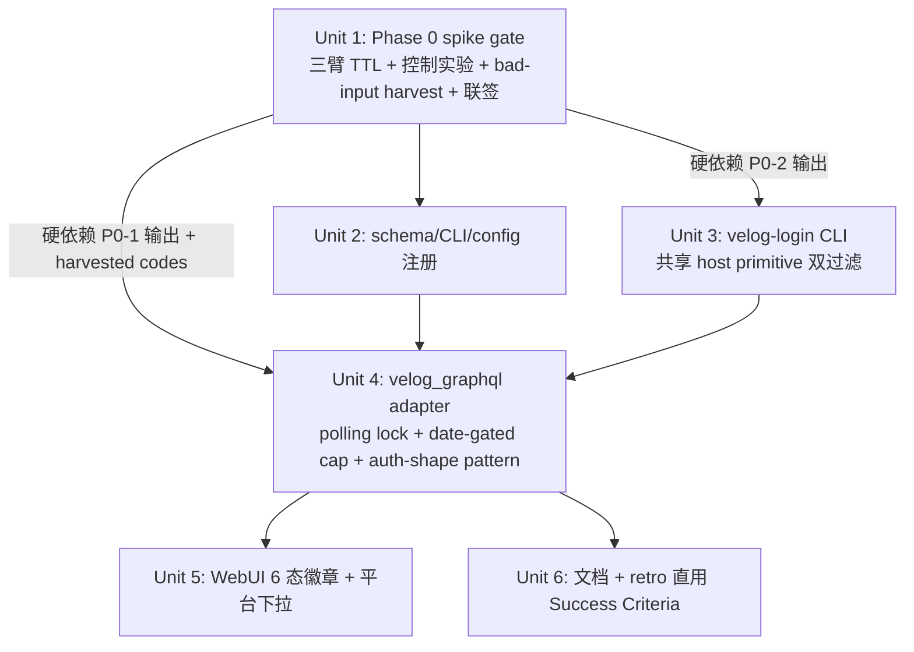

# feat: Velog 适配器（GraphQL writePost + 有头 Playwright 登录，含 Phase 0 可达性/语种前置门）

## Overview

把 `velog.io` 作为新发布平台接入。velog 没有官方 API：通过内部 `https://v3.velog.io/graphql` 的 `writePost` mutation 直发，鉴权用社交登录后由有头 Playwright 导出的 cookie / `storage_state`。复用现有 `verify_publish` + `link_attr_verifier` 后置校验链。

**四个独立时间窗，不混用：**

- **Phase 0 gate（spike，~1 人日 + 14 天等待）**：可达性 + idle TTL + 索引可行性 + 控制实验 + 联签。任一不达标 → 回 brainstorm 转 dev.to / hashnode
- **Phase 1（graduated implementation，14 天）**：Unit 2-7 落地；`_VELOG_DAILY_CAP_INITIAL = 5` 硬编码 + 模块常量 `UNLOCK_DATE_UTC`（merge 日 + 14 天）决定 effective cap；day-14 索引核对再 PR 翻 30
- **Phase 2（production）**：PR 翻 cap 到 30/天
- **T+30 retro**：直接用 Success Criteria 节作 checklist

接入完成后，运营者可用 `--platform velog` 跑通 `publish-backlinks` → `verify` 闭环，与 `blogger` / `medium` / `telegraph` 同框使用。

## Problem Frame

现有平台 `blogger` + `medium`（+ 已规划的 `telegraph`）覆盖度仍不足以分散外链来源风险。velog.io 候选理由：Markdown 原生、外链 dofollow、`v3.velog.io/graphql` introspection 通过、`writePost` schema 明确。

但 velog 的成立条件比 telegraph 复杂：没有官方 SLA / 内部 GraphQL 隐式约束（CSRF/Origin/UA）未实测 / cookie TTL 未知 / 内部 API + 批量自动发布的风控风险中-高 / velog 主要受众韩语开发者，与目标市场话题相关性需单独论证。V1 没有 fallback，因此所有结构性不确定性放进 Phase 0 spike 前置门。

(see origin: `docs/brainstorms/2026-05-15-velog-adapter-requirements.md`)

## Requirements Trace

**Platform Registration & Contract**
- **R1** — `SUPPORTED_PLATFORMS` 加 `"velog"`；CLI / schema / `publish_backlinks` 识别 → Unit 2
- **R2** — `AdapterResult` 字段对齐（`status` ∈ `{published, failed}`、`draft_url=""`、`platform="velog"`、`adapter="velog-graphql"`） → Unit 4
- **R3** — `verify_publish` 失败（无法 fetch / target 不在页面）→ `status="failed"` + `error`；`link_attr_verifier` 失败（rel/target 偏离）→ `status="published"` + `_provider_meta` 完整保留 + log.warn（与 `medium_api.py:189-205` 一致）。**两层 verifier 语义分立**：前者校验发布动作有效性，后者校验链接属性 → Unit 4

**Publishing & Authentication**
- **R8** — `writePost` mutation 发布；`velog-login` 子命令首次导出凭证 → Unit 3 + Unit 4
- **R10** — mutation 最小参数集（`title/body/tags=[]/is_markdown=true/is_temp=false/is_private=false`），**以 P0-1 实测为准** → Unit 1 + Unit 4
- **R11** — cookie/JWT 过期 → `DependencyError("velog cookie expired, run \`velog-login\` again")`；**不**自动重登 → Unit 4
- **R12** — checkpoint 已存在 `published_url` 的 row 跳过；不实现 `editPost` 自动覆盖 → 沿用现有 `checkpoint`，无新代码

**Credential Security**
- **R9** — 凭证持久化 `~/.config/backlink-publisher/velog-cookies.json`（0600 + Unit 4 加载时 `os.stat` 强校验，非 0600 → DependencyError） → Unit 2 + Unit 3
- **R16** — `velog-login` 导出 cookie / storage_state 时按 host 过滤：**共享规范化 primitive** `_velog_host_allowed(host)` = `host.lower().lstrip(".") == "velog.io"`；cookies + `storage_state.origins[]` 双覆盖 → Unit 3
- **R17** — 请求/响应日志脱敏 `Cookie`、`Authorization`、`access_token`、`refresh_token`；**所有日志 + Exception args 禁 f-string 拼接敏感字段** → Unit 4

**Operator UX**
- **R14** — 凭证缺失/过期错误信息含可复制修复命令 → Unit 3 + Unit 4
- **R15** — WebUI 平台下拉新增 `velog`；凭证未配置时显示提示语指向 `velog-login`；**不**做 in-webui 登录面板 → Unit 5

**Rate Limiting & Abuse Defense**
- **R18** — 单账号单日发布上限（V1 production 30，Phase 1 初始 5）、抖动 60-180s 随机、UA 与登录浏览器一致、专用账号 → Unit 4

## Scope Boundaries

**功能边界**
- **不做**自动 cookie 续期 / 自动重登 —— 过期一律 `velog-login`
- **不做**草稿态 / 私有发布 / 系列（`series_id`） —— V1 全部 `is_temp=false, is_private=false`
- **不做**`editPost` 自动覆盖 —— 内容修正需手动平台删除 + 重置 checkpoint
- **不做**in-webui 登录面板 —— 仅状态徽章 + 引导跑 CLI
- **不做**浏览器 fallback —— V1 仅 GraphQL；Phase 0 不通则回 brainstorm
- **不做**韩语翻译管道 —— P0-4 决定语种，V1 单语种
- **不做**`SUPPORTED_PLATFORMS` 动态发现 —— 静态 set（与 telegraph plan 对齐）
- **5xx 接受 fail-fast** —— `retry.py` 仅重试 429 / 连接错误

**部署/环境约束（**新增，关闭 review 暴露的 uid + 文件系统假设**）**
- **WebUI Flask 与 CLI 运行 uid 必须一致** —— Unit 4 / Unit 5 的 0600 文件读写依赖此假设；不同 uid 部署（Flask 跑 `www-data` + CLI 跑 `dex`）会触发 Unit 5 `permission_denied` 徽章引导运营修复，**不**支持作为正常拓扑
- **fcntl advisory lock 仅覆盖 local POSIX 文件系统**（ext4 / apfs / xfs / tmpfs）—— **不**支持 NFS / overlayfs / Docker bind mount 上的 `~/.config`；不支持 gunicorn `gevent` / `eventlet` worker class（仅 sync / thread workers）。若需 Docker 部署需把 `config_dir` 挂在 named volume（local driver）而非 bind-mount 宿主目录
- **跨机器并行发布不支持** —— 限频计数 per-machine；多机器分批跑会绕过 daily cap，运营需人工协调

## Context & Research

### Relevant Code and Patterns

**Adapter 契约与生命周期**
- `src/backlink_publisher/publishing/adapters/base.py` —— `AdapterResult` dataclass。velog 适配器返回此结构，`_provider_meta` 存 `post.id` / `url_slug` 用于 retro 抽样溯源（**不**作为 editPost 上游 —— editPost 已在 Scope Boundaries 排除）
- `src/backlink_publisher/publishing/registry.py` —— `Publisher` ABC + `register(platform, *publishers)`；新适配器 `register("velog", VelogGraphQLAdapter)`
- `src/backlink_publisher/publishing/adapters/medium_api.py` —— **velog API 路径最近邻**：`requests` POST + `_TransientHTTPError` + `retry_transient_call` + `DependencyError` / `ExternalServiceError` 二分。velog 复用形状，差异：(a) GraphQL `{query, variables}`；(b) HTTP 200 + `errors[]` 也算失败，需 adapter 内额外分流
- `src/backlink_publisher/publishing/adapters/link_attr_verifier.py` —— 返回 `blank_ratio` / `verification`，写入 `_provider_meta["link_attr_verification"]`
- `src/backlink_publisher/publishing/adapters/retry.py` —— `RETRYABLE_HTTP_STATUSES` + `retry_transient_call`；不动

**Playwright 有头登录与持久化**
- `src/backlink_publisher/publishing/adapters/medium_browser.py` —— 已在用 `playwright.sync_api`，但用 `launch_persistent_context`（整 profile）。**velog 不沿用**：用 `browser.new_context()` + 显式 `storage_state` / `cookies` 导出，可在写盘前过滤 host

**Config / CLI 注册**
- `src/backlink_publisher/schema.py:26` —— `SUPPORTED_PLATFORMS`
- `src/backlink_publisher/config/loader.py:125-130` —— Medium OAuth section 模式，velog `[velog]` 仿此
- `src/backlink_publisher/config/types.py` —— `Config` dataclass
- `src/backlink_publisher/cli/` —— 4 个子命令；新建 `velog_login.py`

**WebUI 集成（窄口径）**
- `docs/plans/2026-05-18-011-refactor-settings-channel-collapse-plan.md` —— settings 折叠卡骨架。Unit 5 接入；011 未 land 走 inline fallback
- `webui_app/helpers.py` `_settings_context()` —— 新增 `velog_status: Literal[6 states]` + `velog_cookies_path: str`
- 平台 dropdown 单源 `SUPPORTED_PLATFORMS`

**日志脱敏**
- `src/backlink_publisher/_util/logger.py` —— key-based redactor 扫 `extra` dict。**不**改 redactor 架构 —— adapter 内约束所有敏感数据走 `extra=dict(...)`；新增 lint/test 守护
- `tests/test_logger_redactor.py` —— 复用 sys.stderr 捕获 + JSON parse pattern

### Institutional Learnings

- "凭据缺失 → DependencyError；凭据无效 → ExternalServiceError" 二分语义沿用 blogger / medium 现行行为
- 浏览器自动化在生产承担 CAPTCHA / 风控 / 截图等额外路径；velog 走 GraphQL 直发后一次登录无浏览器路径，运营负担显著降低

### External References

未引入外部研究 —— 内部模式已强。GraphQL 错误处理与 schema 漂移监测在 Open Questions 中按需研究。

## Key Technical Decisions

- **`requests` + 手写 GraphQL payload**：medium_api 已走通同形状；引入 `gql` 收益与 6 字段 mutation 不成比例
- **TLS `verify=True` 非协商 + `HTTPS_PROXY` 启动告警**：JWT 是 crown jewel；proxy 不阻断（公司可信代理合法），由运营自决
- **GraphQL `HTTP-200-with-errors[]` 失败建模 + 两层 code 分类**：
  - 显式 auth set `{NOT_LOGGED_IN, UNAUTHENTICATED}` → DependencyError
  - **auth-shaped pattern match**（code 含 `UNAUTH/FORBIDDEN/SESSION/TOKEN/CSRF/EXPIRED` 子串）→ DependencyError + log.error("velog auth-shaped unknown code: <code>; verify mapping next release")
  - 其他 known codes（从 P0-1 deliberate-bad-input harvest 填充）→ ExternalServiceError
  - 未知 code → ExternalServiceError + **独立** log.error + `_provider_meta["unknown_extension_code"]`
- **`browser.new_context()` + 双过滤函数 + 共享 host normalize primitive**：cookies + storage_state.origins[] 都走 `_velog_host_allowed(host)`（`.lower().lstrip(".") == "velog.io"`，排除 `evilvelog.io` / `velog.io.attacker.tld` / `Velog.IO`）
- **凭证 0600 fail-closed**：加载时 `os.stat` 强校验非 0600 → DependencyError。与 stated threat model 一致；非 0600 = 同 uid 其他进程可读 = 模型破产
- **响应解析全 `.get()` 链式 + nil 防御**：`(data or {}).get("writePost") or {}` 形式；任一层缺失 → ExternalServiceError，**禁直链下标**
- **Verifier 分层语义（R3 修订）**：`verify_publish` 失败 → `status="failed"`；`verify_link_attributes` 失败 → 仅 warn + `_provider_meta` 完整保留 + status 不变 —— 与 medium_api 一致。Success Metrics dofollow 信号从 `_provider_meta` 取，与 status 解耦
- **Phase 1 graduated rollout 走代码常量 + 日期 gate（非 config）**：
  - `_VELOG_DAILY_CAP_INITIAL = 5`、`_VELOG_DAILY_CAP_PROD = 30`、`UNLOCK_DATE_UTC = datetime(YYYY, MM, DD)`（Unit 4 merge 时填写）
  - effective cap = `_VELOG_DAILY_CAP_PROD if datetime.utcnow() >= UNLOCK_DATE_UTC else _VELOG_DAILY_CAP_INITIAL`
  - 每次 publish 启动 log effective cap + unlock date
  - **不引入 `daily_cap_override` config 字段** —— review 暴露其与"硬编码常量"哲学冲突 + 缺 clamp + 7 天 timebox 与 Phase 1 14 天 timebox 不对齐 + 是 YAGNI 陷阱
  - 提前解锁或 cap 调整需 PR（diff 即解锁事件，可审计）
- **限频架构 fcntl polling lock + 文件 source of truth**：
  - **`fcntl.flock` 无 native timeout** —— 实现走 `LOCK_NB` + sleep loop（间隔 0.5s，总 60s 上限）+ 退出条件抛 `ExternalServiceError("velog rate-limit lock held > 60s; check stale process")`
  - in-memory `_LAST_PUBLISH_AT` 取消，重启从文件读 → 一致性优于进程缓存
  - lock 文件 + count 文件**均 0600**（umask 0o077）
  - 跨机器同步在 Deferred Work
- **日志脱敏走结构化 extra dict + Exception args 也禁 f-string + 测试守护**：
  - Exception 文案使用 placeholder + `_provider_meta` 携带细节（避免敏感数据进 args）
  - 例：`raise ExternalServiceError("velog response missing writePost.url", _meta={"errors": [...]})` 而非 f-string
  - tests/test_velog_no_raw_cookie_in_logs.py 覆盖 log records + 捕获 raise 的 exception args 双路径
- **`_KNOWN_EXTENSIONS_CODES` 设白名单 + 治理规则**：
  - 初始从 P0-1 **deliberate-bad-input harvest 子任务** 填充（不是仅成功路径）
  - 代码注释强制治理："**修改本集合需在 PR 描述附 (a) 生产 log 链接证明该 code 真实出现 (b) runbook 一行说明运营响应**。新增 = 关闭对该 code 的 schema-drift 监测"
  - lint test 断言 set 大小 = 文件头部常量 `_KNOWN_CODES_BASELINE_SIZE`；任何增量需同步改测试，触发 PR 评审对话
- **UA 模块常量、不持久化 per-login**：spike 实测一次写入；per-login 灵活性目前无 goal 支持
- **Phase 0 gate 是 plan Unit 1（三臂 TTL + 控制实验 + bad-input harvest + 联签）**

## Open Questions

### Resolved During Planning

- **HTTP 客户端**：`requests`
- **TLS**：`verify=True`；`HTTPS_PROXY` 启动 warn
- **mutation 最小参数集**：以 P0-1 实测为准；plan 默认 6 字段，P0-1 若需补 `url_slug` / `meta` 在 spike 报告归档后更新 Unit 4
- **凭证存储格式**：cookies-only vs storage_state 由 P0-2 决定；两种 schema 都过 R16 双过滤
- **R3 verifier 分层语义**：`verify_publish` 失败 → failed；`verify_link_attributes` 失败 → warn + status 不变
- **限频架构**：fcntl polling LOCK_NB + sleep loop + 文件 source of truth；跨机器在 Deferred Work
- **日志脱敏机制**：沿用 key-based redactor + 禁 f-string（log + Exception 双路径）+ 结构化测试
- **schema-drift V1 路径**：`_KNOWN_EXTENSIONS_CODES` 白名单（含 auth-shaped pattern match）+ 未知 code 独立 log.error；主动 introspection diff 在 Deferred Work
- **WebUI 6 态徽章**：`{fresh, ok, warn, err, cap_reached, permission_denied}` 覆盖运行期所有 observable，含跨 uid 部署 false-negative 修复路径
- **Phase 1 graduated rollout 强制机制**：`_VELOG_DAILY_CAP_INITIAL = 5` + `UNLOCK_DATE_UTC` 模块常量（**不**走 config override）
- **VelogConfig 字段集**：仅 `cookies_path`；删除 `username` 与 `daily_cap_override`

### Deferred to Implementation

- **[Affects Unit 3 / Unit 4]** P0-2 输出确定 JWT 实际位置 → 持久化 cookies-only vs storage_state
- **[Affects Unit 4]** P0-1 输出确定 mutation 必需 headers（CSRF / Origin / UA）+ deliberate-bad-input harvest 输出 known codes 集
- **[Affects Unit 3 schema]** 若 P0-1 发现 CSRF 是 session-derived，Unit 3 cookies 文件需同时持久化 CSRF token；Unit 4 加专属错误 mapping `DependencyError("CSRF token rotated, run velog-login")` —— 此处 Unit 3 Files 列双 schema
- **[Affects Unit 4]** P0-3 idle TTL 实测结果 → 填充 Unit 6 文档"X 小时无人值守"；若 P0-3 臂 C 发现设备指纹绑定 → 文档标注"换机器需重跑 velog-login"
- **[Affects Unit 4]** `_VELOG_UA` 常量取值：从 P0-1 浏览器 UA 抄录
- **[Affects Deferred Work]** 主动 introspection canary 是否启用 —— 30 天 retro 决定
- **[Affects Deferred Work]** 跨机器限频同步 —— 30 天 retro 评估多机场景频率
- **[Affects Deferred Work]** 限频后端从 fcntl 升级为 sqlite（uid-agnostic + filesystem-portable）的可行性

## High-Level Technical Design

> *本段阐述意图与边界，作为评审上下文，不作为实现规范。*

**适配器调用流水线（Unit 4）**

```
publish_backlinks  (existing dispatcher)
   │
   ▼  payload {id, title, content_markdown, target_url, ...}
VelogGraphQLAdapter.publish(payload, mode="publish", config)
   │
   ├─ load_velog_cookies(config.velog.cookies_path)
   │     ├─ FileNotFoundError → DependencyError("Run: backlink-publisher velog-login")
   │     └─ stat & 0o777 != 0o600 → DependencyError("file must be 0600; run: chmod 600 <path>")
   │
   ├─ effective_cap = _VELOG_DAILY_CAP_PROD if utcnow() >= UNLOCK_DATE_UTC else _VELOG_DAILY_CAP_INITIAL
   ├─ log.info("velog effective_cap=<N>, unlock_date=<UTC>")
   │
   ├─ acquire_lock(velog-rate-limit.lock, poll LOCK_NB, sleep 0.5s, timeout 60s)
   │     └─ timeout → ExternalServiceError("velog rate-limit lock held > 60s; check stale process")
   ├─ read count file (with UTC-rollover + corrupt-recovery)
   │     └─ count >= effective_cap → DependencyError("velog daily cap reached: <N>; retry after midnight UTC")
   ├─ sleep random.uniform(60, 180) - (now - last_publish_at)  if positive
   │
   ├─ requests.post(
   │     "https://v3.velog.io/graphql",
   │     json={"query": WRITE_POST_MUTATION, "variables": {6 fields}},
   │     cookies=loaded_cookies,
   │     headers={UA from spike, Origin, X-CSRF-Token if spike requires},
   │     verify=True,
   │     timeout=30,
   │  )
   │     └─ retry_transient_call on 429 / 5xx / ConnectionError
   │
   ├─ classify errors[]:
   │     ├─ code ∈ {NOT_LOGGED_IN, UNAUTHENTICATED} → DependencyError(remediation)
   │     ├─ code matches auth-shaped pattern (UNAUTH/FORBIDDEN/SESSION/TOKEN/CSRF/EXPIRED) → DependencyError + log.error
   │     ├─ code in _KNOWN_EXTENSIONS_CODES → ExternalServiceError
   │     └─ unknown code → ExternalServiceError + log.error + _provider_meta["unknown_extension_code"]
   │
   ├─ data = response_json.get("data") or {}
   ├─ write_post = data.get("writePost") or {}
   ├─ published_url = write_post.get("url", "")
   │     └─ if not published_url: ExternalServiceError (placeholder msg, errors in _meta)
   │
   ├─ verify_publish_result = verify_publish(published_url, target_url)
   │     └─ if not ok: AdapterResult(status="failed", error=verify_publish.error)
   ├─ link_attr_check = verify_link_attributes(published_url)
   │     └─ if verification != "ok": log.warn, status unchanged (与 medium_api 一致)
   │
   ├─ count_file.count += 1; count_file.last_publish_at = now; write atomic
   ├─ release_lock()
   │
   └─ return AdapterResult(
        status="published",
        adapter="velog-graphql",
        platform="velog",
        published_url=published_url,
        draft_url="",
        _provider_meta={"link_attr_verification": ..., "post_id": ..., "url_slug": ...},
      )
```

**`velog-login` 子命令流水（Unit 3）**

```
backlink-publisher velog-login
   │
   ├─ playwright.sync_api.sync_playwright()
   ├─ browser = chromium.launch(headless=False)            # 有头，显式让运营看登录窗
   ├─ context = browser.new_context()                       # 非 persistent profile
   ├─ page.goto("https://velog.io")
   ├─ [user solves social login in headed window]
   │
   ├─ wait_for_url(re.compile(r"https://velog\.io/(?!login|signup)"), timeout=300s)
   │     └─ fallback: probe "用户头像" / "写文章" 元素
   │     └─ both timeout → DependencyError("Login timeout; ensure 2FA/email confirm completed")
   │
   ├─ raw_cookies = context.cookies()
   ├─ raw_storage = context.storage_state()
   │
   ├─ filtered_cookies = _filter_velog_cookies(raw_cookies)        # uses _velog_host_allowed
   ├─ filtered_storage = _filter_velog_storage_state(raw_storage)  # 同 primitive 过 cookies + origins[]
   │
   ├─ schema = cookies-only or storage_state (per P0-2 decision)
   ├─ umask(0o077); write file; chmod(path, 0o600)
   │
   └─ print:
        "✔ velog cookies saved."
        "Run: backlink-publisher publish-backlinks --platform velog --dry-run targets.csv"
        "Or refresh your /settings page in the browser — the velog channel badge will turn green."
```

**WebUI 6 态徽章（Unit 5）**

```
/settings page (channel cards from 011 fold骨架, fallback 路径详见 Unit 5)
   ├── Blogger / Medium / Telegraph (existing)
   └── Velog 卡 (新)
         折叠头：[velog 图标] velog  [● badge: fresh/ok/warn/err/cap_reached/permission_denied]
         展开体：首行按 status 切换信息优先级
           ├── fresh         蓝 🆕 "Last configured just now."
           ├── ok            绿 ✓  "<N>/30 today available (Phase 1: <N>/5)"
           ├── warn          黄 ⚠  "Run: backlink-publisher velog-login" (JSON broken / cookies empty)
           ├── err           红 ✗  "Run: backlink-publisher velog-login"
           ├── cap_reached   灰 ⏸  "Today's cap reached; resets at midnight UTC"
           └── permission_denied 紫 🔒  "WebUI uid cannot read 0600 file; check uid alignment or chmod 640 + chown"

publish 表单：
   <select name="platform">
     blogger / medium / telegraph / velog    (单源 SUPPORTED_PLATFORMS)
   </select>
   if status ∈ {err, warn, cap_reached, permission_denied}: submit disabled + inline guide
```

## Implementation Units



---

- [ ] **Unit 1: Phase 0 spike — 可达性 / idle TTL / 索引 / 控制实验 / bad-input harvest / 语种 gate（non-code gate）**

**Goal:** 把 brainstorm 中所有结构性不确定性升级为可证伪实验，输出 Go/No-Go 决断 + 联签。No-Go 直接终止本 plan，回 brainstorm 转 dev.to / hashnode。

**Requirements:** R8、R9、R10、R11、R17、R18、Success Criteria

**Dependencies:** 无

**Files:**
- Create: `docs/spikes/2026-05-XX-velog-phase0.md`（含 P0-1..P0-6 全部数据 + P0-7 联签）

**Approach:**
- **P0-1：端到端最小 mutation 实测**：运营+工程联合在浏览器抓 cookie + 全部头部，`curl` 复现一次 `writePost(6 字段)` 成功发布并目视确认页面公开。**额外记录**所有必需 headers（UA / Origin / X-CSRF-*）+ schema 的 `errors[].extensions.code` 在成功路径上的取值
- **P0-1b：deliberate bad-input harvest（关键补充）**：用 P0-1 cookie 故意提交 4-5 类已知坏输入（缺 title / body 超长 / tags 含非法字符 / cookie 不全 / mutation 缺字段）；harvest 每类错误的 `errors[].extensions.code` 值；填入 `_KNOWN_EXTENSIONS_CODES` 集合的 baseline + runbook 一行说明运营响应
- **P0-2：JWT 存储位置确认**：Playwright 登录后同时 dump `context.cookies()` + `localStorage` + `context.storage_state()` 三份；记录 `access_token` / `refresh_token` 实际位置
- **P0-3：三臂 TTL 实测（关键升级，避免 refresh-on-use 假象）**
  - **臂 A（idle TTL，最重要）**：登录后零调用，wait 25h，发一次 mutation；失败说明 idle TTL < 24h → No-Go
  - **臂 B（活跃 TTL）**：登录后 1h / 6h / 24h / 72h 各发一次 mutation
  - **臂 C（跨设备/跨 UA）**：A 机导出 cookie 复制到 B 机（不同 IP / 不同 UA）发一次；失败说明 session 绑设备指纹 → 文档显式声明"换机器需重跑 velog-login"
- **P0-4：市场相关性论证 + 语种决断**：运营给出"用韩语 / 用英语 / 不接入"明确决断（书面）
- **P0-5：两阶段索引验证**：
  - **阶段 1（feasibility，14 天）**：发 5 篇真实 post 带目标站外链；day-14 核对 `site:velog.io/<user>/<slug>` 索引率 ≥ 70%
  - **阶段 2 在 Phase 1 实现中执行**：Unit 4 落地后由 `_VELOG_DAILY_CAP_INITIAL=5` + `UNLOCK_DATE_UTC` 强制 5 篇/天 14 天上限；day-14 核对索引率 ≥ 70% → PR 翻 cap 到 30
- **P0-5b：控制实验（0.5 人日）**：用 P0-1 cookie 在 60-180s 抖动窗口连发 5 篇 post，观察是否触发风控；产出"抖动窗口是否足够"的实测依据
- **P0-6 达标线**：P0-1 成功 + P0-1b harvest 至少 3 类 codes + P0-3 臂 A idle TTL ≥ 24h（**仅活跃 TTL ≥ 24h 不够**） + P0-5 阶段 1 ≥ 70% + P0-4 语种决断 + P0-5b 无明显风控信号
- **P0-7 Go/No-Go 联签**：spike 报告末尾由 **运营负责人 + 工程 lead 联签**；未签前 Unit 2-7 不允许启动

**Execution note:** 这是 gate，不是代码 unit。spike 报告未联签前，Unit 2-7 不允许启动。

**Test scenarios:** Test expectation: none — spike unit，输出为决断文档

**Verification:**
- `docs/spikes/2026-05-XX-velog-phase0.md` 含 P0-1..P0-5b + P0-7 联签全部数据
- 报告末尾明确 Go / No-Go + 联签；Go 时记录 idle TTL 反推批跑窗口上限 + 跨设备约束 + harvested codes baseline
- 若 No-Go：plan `status:` 改 `superseded`，回 brainstorm；后续 unit 不执行

---

- [ ] **Unit 2: schema / CLI / config 注册**

**Goal:** 项目静态层识别 `velog` 平台。

**Requirements:** R1、R9

**Dependencies:** Unit 1 Go

**Files:**
- Modify: `src/backlink_publisher/schema.py`（`SUPPORTED_PLATFORMS` 加 `"velog"`）
- Modify: `src/backlink_publisher/config/types.py`（新增 `VelogConfig` dataclass：**仅** `cookies_path: Path` —— **不**加 `username`、**不**加 `daily_cap_override`；`Config` 加 `velog: VelogConfig | None`）
- Modify: `src/backlink_publisher/config/loader.py`（解析 `[velog]` section）
- Modify: `src/backlink_publisher/cli/publish_backlinks.py`（`--platform` 选项接受 `velog`，沿用 schema 单源）
- Test: `tests/test_schema_supported_platforms.py`、`tests/test_config_roundtrip.py`（扩展覆盖 velog）

**Approach:**
- 与 telegraph plan Unit 2 在 schema.py 上有冲突可能 —— 后落地者合并 set
- `[velog]` 缺 `cookies_path` → 默认值 `~/.config/backlink-publisher/velog-cookies.json`
- 静态 set，不引入 dynamic 注册

**Patterns to follow:**
- `src/backlink_publisher/config/loader.py:125-130` medium oauth 加载模式

**Test scenarios:**
- Happy path: `--platform velog` 在 CLI 接受
- Happy path: `[velog].cookies_path = "/tmp/x.json"` → `config.velog.cookies_path == Path("/tmp/x.json")`
- Edge case: `[velog]` 缺失 → `config.velog.cookies_path` 取默认
- Edge case: `cookies_path` 为空字符串 → 清晰错误（非 silent 默认）
- Error path: schema 校验 `platform=invalid` → ValueError 列出 `velog` 在内
- Integration: `backlink-publisher --help` 列出 `velog`

**Verification:**
- `"velog" in SUPPORTED_PLATFORMS`
- 测试全绿
- `backlink-publisher publish-backlinks --platform velog --dry-run targets.csv` 不在 schema/CLI 层被拒

---

- [ ] **Unit 3: `velog-login` CLI 子命令（Playwright headed + 共享 host primitive + cookies/origins 双过滤 + 安全持久化）**

> **Amendment 2026-05-19 — see `docs/plans/2026-05-19-001-feat-settings-browser-binding-plan.md`.**
> `velog-login` is now a **transparent alias** for `bind-channel --channel velog`; the headed Playwright driver, host filter, and storage_state persistence all live in `src/backlink_publisher/cli/_bind/` (plan 2026-05-19-001 Units 1–3). This unit's implementation collapses to a 10-line alias `main()` that prepends `["--channel", "velog"]` and delegates. The shared `_velog_host_allowed` primitive moves to the recipe at `src/backlink_publisher/cli/_bind/recipes/velog.py`; tests for it follow the recipe.

**Goal:** 唯一凭证获取入口；强制 R16；产出 0600 文件供 adapter 读。

**Requirements:** R8、R9、R14、R16

**Dependencies:** Unit 1 Go（P0-2 输出决定写 cookies-only / storage_state；P0-1 输出决定是否同时持久化 CSRF token）

**Files:**
- Create: `src/backlink_publisher/cli/velog_login.py`
- Modify: `src/backlink_publisher/cli/__init__.py`（注册 entry）
- Test: `tests/test_velog_login_host_filter.py`（**纯函数测试** `_velog_host_allowed` + `_filter_velog_cookies` + `_filter_velog_storage_state`，不启动 Playwright）

**Approach:**
- `browser.new_context()`（不用 `launch_persistent_context`）
- `chromium.launch(headless=False)` —— 显式有头（非 headless 模式，让运营完成社交登录）
- 登录完成判定 **primary** `wait_for_url(re.compile(r"https://velog\.io/(?!login|signup)"), timeout=300_000)`；**fallback** 显式探测 "用户头像" / "写文章" 元素；双 timeout → `DependencyError("Login timeout; ensure 2FA/email confirm completed")`
- **共享规范化 primitive**：`_velog_host_allowed(host: str) -> bool` = `host.lower().lstrip(".") == "velog.io"`
- **双过滤函数**：
  - `_filter_velog_cookies(raw: list[dict]) -> list[dict]` 按 `cookie["domain"]` 校验
  - `_filter_velog_storage_state(raw: dict) -> dict` 过 `cookies[]` + `origins[]`（origins 按 `urllib.parse.urlparse(origin["origin"]).hostname` 校验）
- **文件 schema**（P0-2 决定，Files 列双 schema）：
  - cookies-only：`{"cookies": [...]}` 已过 `_filter_velog_cookies`
  - storage_state：`{"cookies": [...], "origins": [...]}` 双过滤
  - **P0-1 若发现 CSRF 是 session-derived**：上述任一 schema 附加 `"csrf_token": "<value>"`；adapter 读时检测有则用
- 写盘 `os.umask(0o077)` → write → `os.chmod(0o600)`
- 输出末尾两行（兼顾 CLI-first 与 WebUI-first 运营）：
  - `Run: backlink-publisher publish-backlinks --platform velog --dry-run targets.csv`
  - `Or refresh your /settings page in the browser — the velog channel badge will turn green.`

**Patterns to follow:**
- `src/backlink_publisher/publishing/adapters/medium_browser.py`（Playwright 启动 + DependencyError 文案）
- `src/backlink_publisher/cli/publish_backlinks.py`（argparse 结构 + `_util/logger`）

**Test scenarios:**

`_velog_host_allowed`：
- Happy: `"velog.io"` / `".velog.io"` / `"VELOG.IO"` → True
- Edge: `"evilvelog.io"` / `"velog.io.attacker.tld"` → False（前/后缀混淆）
- Edge: `""` / `None` → False（不抛异常）
- Edge: `"accounts.google.com"` / `"github.com"` → False

`_filter_velog_cookies`：
- Happy: `[velog.io, .velog.io, accounts.google.com]` → 2 条留 + 1 条丢
- Edge: cookie 缺 `domain` key → 防御性丢弃
- Edge: 空输入 → `[]`

`_filter_velog_storage_state`（**关键 P1 测试**）：
- Happy: `origins=[{origin:"https://velog.io",...}, {origin:"https://accounts.google.com", localStorage:[{name:"id_token", value:"eyJ..."}]}]` → 仅留 velog.io entry；Google entry 整段丢
- Edge: `origin:"https://Velog.IO"` → 留（大小写归一）
- Edge: `origin:"https://velog.io.attacker.com"` → 丢
- Edge: `origin` 字段非 URL → 防御性丢

文件 I/O：
- Error: 子目录不存在 → mkdir parent；写入失败 → DependencyError 带 path
- Error: Playwright 未安装 → `DependencyError("Run: playwright install chromium")`
- Integration: 实测权限 `0o600`
- Integration: **结构化反向断言**（取代 grep） —— 反序列化后 walk cookies + origins[]，断言所有 host 通过 `_velog_host_allowed`

**Verification:**
- `backlink-publisher velog-login --help` 显示
- 手动跑一次 → 完成社交登录 → 文件落盘 0600
- 结构化断言：json.load 后 walk 全部 cookies + origins[]，任何 host 不通过 `_velog_host_allowed` → 测试 fail

---

- [ ] **Unit 4: `velog_graphql.py` 适配器（GraphQL + retry + date-gated cap + polling lock + auth-shape pattern + 结构化日志）**

> **Amendment 2026-05-19 — see `docs/plans/2026-05-19-001-feat-settings-browser-binding-plan.md`.**
> 401/403 + 显式 `extensions.code` 命中 auth-shape pattern (UNAUTH/FORBIDDEN/SESSION/TOKEN/CSRF/EXPIRED) 时，**改 raise `AuthExpiredError(channel="velog", reason=...)`** —— 不再是 `DependencyError("velog cookie expired")`. `AuthExpiredError` 继承自 `DependencyError`（同 `exit_code=3`），所以本 Unit 既有的 `except DependencyError` 调用方仍能兜底；但 `publish_backlinks` 已为 `AuthExpiredError` 加专门 catch（plan 2026-05-19-001 Unit 6），会调用 `webui_store.channel_status.mark_expired("velog")` 并写入 `error_class="auth_expired"` 的 checkpoint row，让 `/settings` Velog 卡显示「已过期 ⚠」+「重新绑定」按钮。

**Goal:** 接入 `--platform velog`；实现 R8/R10/R11/R17/R18 全部行为。

**Requirements:** R2、R3、R8、R10、R11、R12、R14、R17、R18

**Dependencies:** Unit 1 Go（mutation 必需 headers + harvested codes baseline + idle TTL）、Unit 2（schema/config）、Unit 3（凭证文件结构）

**Files:**
- Create: `src/backlink_publisher/publishing/adapters/velog_graphql.py`
- Modify: `src/backlink_publisher/publishing/adapters/__init__.py`（导出 + `register("velog", VelogGraphQLAdapter)`）
- Modify: `src/backlink_publisher/_util/logger.py`（确认/补充 `_SENSITIVE_KEYS`：`cookie`、`cookies`、`authorization`、`access_token`、`refresh_token`、`set-cookie`、`storage_state`、`origins`、`csrf_token`）
- Test: `tests/test_adapter_velog_graphql.py`、`tests/test_logger_redactor.py`（扩展）、`tests/test_velog_no_raw_cookie_in_logs.py`（**新**，结构化日志断言）
- Test: `tests/test_velog_known_codes_governance.py`（**新**，lint test 锁定 `_KNOWN_EXTENSIONS_CODES` 集合大小 = `_KNOWN_CODES_BASELINE_SIZE`）

**Approach:**

*基础结构 + TLS*
- 整体镜像 `medium_api.MediumAPIAdapter`：`_TransientHTTPError` + `retry_transient_call`
- `requests.post(..., verify=True, timeout=30)` —— TLS 非协商；`HTTPS_PROXY` 启动 log.warn 不阻断
- `WRITE_POST_MUTATION` 模块常量；变量从 payload 组装
- `_VELOG_UA` 模块常量（值来自 P0-1）

*凭证加载（fail-closed）*
- `os.stat(path).st_mode & 0o777 == 0o600` 强校验，非 0600 → `DependencyError("velog-cookies.json must be 0600; run: chmod 600 <path>")`
- 文件 schema 按 `"origins" in data` 区分 cookies-only / storage_state；如有 `csrf_token` 字段读出

*Phase 1 graduated cap（代码强制，**关键 P0 修复**）*
- `_VELOG_DAILY_CAP_INITIAL = 5`、`_VELOG_DAILY_CAP_PROD = 30`、`_VELOG_JITTER_MIN_S = 60`、`_VELOG_JITTER_MAX_S = 180`
- `UNLOCK_DATE_UTC: datetime = datetime(YYYY, MM, DD, 0, 0, tzinfo=timezone.utc)` —— Unit 4 PR 落地时填入 merge 日 + 14 天
- `effective_cap()` 函数：`return _VELOG_DAILY_CAP_PROD if datetime.now(timezone.utc) >= UNLOCK_DATE_UTC else _VELOG_DAILY_CAP_INITIAL`
- 每次 publish 启动 log effective cap + unlock date
- 翻 cap 走 PR 改常量（diff 即解锁事件，可审计） —— **不**走 config override

*限频 fcntl polling lock + 文件 source of truth*
- 文件：`config.config_dir / "velog-rate-limit.json"` + lock `velog-rate-limit.lock`，**均 0600** + `umask 0o077` 创建
- count 文件 schema：`{"date_utc": "YYYY-MM-DD", "count": int, "last_publish_at": float}`，写盘 temp + `os.replace`
- 锁实现（`fcntl.flock` 无 native timeout，**polling 而非 signal.alarm**）：
  ```
  start = time.monotonic()
  while time.monotonic() - start < 60:
      try:
          fcntl.flock(fd, LOCK_EX | LOCK_NB)
          return  # acquired
      except BlockingIOError:
          time.sleep(0.5)
  raise ExternalServiceError("velog rate-limit lock held > 60s; check stale process")
  ```
- count file 读盘失败：FileNotFoundError → count=0；JSONDecodeError → log.warn + 重置；权限漂移 → log.warn 不阻断（cap 是辅助防御）
- UTC 跨日：读时 `today_utc != date_utc` → 重置
- `_publish_one` 前置序列：(a) acquire；(b) 读 count file + UTC 重置；(c) `count >= effective_cap()` → `DependencyError("velog daily cap reached: <N>; retry after midnight UTC")`；(d) `now - last_publish_at < random.uniform(jitter_min, jitter_max)` → sleep；(e) publish；(f) count+1 + last_publish_at=now atomic write；(g) release
- **跨机器同步在 Deferred Work** + Unit 6 文档标注

*GraphQL 错误分类（两层 + auth-shape pattern，**P1 修复**）*
- 检查 `response.json().get("errors")`
- 显式 auth set `_AUTH_CODES = {"NOT_LOGGED_IN", "UNAUTHENTICATED"}` → DependencyError
- **auth-shape pattern**：`code` 含 `UNAUTH`/`FORBIDDEN`/`SESSION`/`TOKEN`/`CSRF`/`EXPIRED` 任一子串 → DependencyError + log.error("velog auth-shaped unknown code: <code>; verify mapping in next release")
- `code in _KNOWN_EXTENSIONS_CODES` → ExternalServiceError + 标准 log
- 未知 code → ExternalServiceError + **独立** log.error + `_provider_meta["unknown_extension_code"]`

*`_KNOWN_EXTENSIONS_CODES` 治理（**P1 修复**）*
- 初始集从 Unit 1 P0-1b harvest 填充
- 顶部 doc-comment 强制治理：
  ```python
  # DO NOT add codes here without:
  #   (a) link to a production log line proving the code is real, AND
  #   (b) one-line runbook entry mapping it to operator action.
  # Adding to this set DISABLES the schema-drift canary for that code.
  _KNOWN_CODES_BASELINE_SIZE = <N from spike>
  _KNOWN_EXTENSIONS_CODES: set[str] = {...}
  assert len(_KNOWN_EXTENSIONS_CODES) == _KNOWN_CODES_BASELINE_SIZE, "any change requires PR review + test update"
  ```
- `tests/test_velog_known_codes_governance.py` 锁 size = baseline；增量需同步改测试，触发评审

*nil 防御性解析*
- 全 `.get()` 链式：`(response_json.get("data") or {}).get("writePost") or {}` + `.get("url", "")`
- 任一层缺失 → ExternalServiceError(**placeholder msg，errors detail 进 `_provider_meta`**，避免 f-string 拼 errors 进 args)

*Verifier 分层（R3 修订）*
- 发布成功后 `verify_publish(published_url, target_url)` 失败 → `AdapterResult(status="failed", error=verify_publish.error)`
- `verify_link_attributes(published_url)` 失败 → `_provider_meta["link_attr_verification"]` 完整保留 + log.warn + status 不变（与 medium_api 一致）
- Success Metrics dofollow 信号从 `_provider_meta` 取，与 status 解耦

*日志脱敏（**P1 修复 — 含 Exception args**）*
- 现有 key-based redactor 不改架构
- adapter 内**双约束**：
  - log call 所有敏感字段必须走 `extra=dict(...)`，禁 `f"...{cookies}..."`
  - **Exception 文案也禁 f-string 拼敏感数据**；改用 placeholder msg + sidecar `_meta` 字段，例：
    ```python
    err = ExternalServiceError("velog response missing writePost.url")
    err._meta = {"errors": response_json.get("errors")}
    raise err
    ```
    （cli/publish_backlinks.py 捕获时如需细节，从 `getattr(exc, "_meta", None)` 读，写入结构化 log 经 redactor）
- `tests/test_velog_no_raw_cookie_in_logs.py` 跑 happy + error path，**双断言**：(a) 所有 captured log records；(b) 所有 raised Exception 的 args；任一含明文 cookie value / JWT / Authorization 子串 → fail

**Patterns to follow:**
- `src/backlink_publisher/publishing/adapters/medium_api.py`（HTTP + retry shape）
- `src/backlink_publisher/publishing/adapters/link_attr_verifier.py`（`_provider_meta` 约定）
- `src/backlink_publisher/publishing/adapters/retry.py`（retry framework）

**Test scenarios:**
- Happy path: mock POST 返回 `{"data":{"writePost":{"url":"https://velog.io/@u/slug","id":"abc"}}}` → `AdapterResult(status="published", platform="velog", adapter="velog-graphql", published_url="https://velog.io/@u/slug", draft_url="")`
- Happy path: `_provider_meta["link_attr_verification"]` 填充
- Happy path: 启动 log 显示 effective cap + unlock date
- Edge case: `data.writePost.url` 为空 / `writePost` None / `data` None → 全部 ExternalServiceError（统一 placeholder msg）
- Edge case: `_provider_meta["unknown_extension_code"]` 被填充当未知 code 出现
- Edge case: link_attr_verifier verification="failed" → status 仍 `published` + `_provider_meta` 保留 + log.warn
- Edge case: verify_publish 失败 → `status="failed"` + error 字段
- Error path: HTTP 401 → ExternalServiceError
- Error path: HTTP 200 + `code:"NOT_LOGGED_IN"` → DependencyError 含 `Run: velog-login`
- Error path: HTTP 200 + `code:"SESSION_EXPIRED"` → **DependencyError**（auth-shape pattern 匹配 `EXPIRED`）+ log.error
- Error path: HTTP 200 + `code:"TOKEN_INVALID"` → **DependencyError**（pattern 匹配 `TOKEN`）+ log.error
- Error path: HTTP 200 + `code:"VALIDATION_ERROR"`（已在 _KNOWN）→ ExternalServiceError 标准 log
- Error path: HTTP 200 + `code:"FUTURE_NEW_CODE"`（未知）→ ExternalServiceError + 独立 log.error + `_provider_meta["unknown_extension_code"]="FUTURE_NEW_CODE"`
- Error path: 凭证文件不存在 → DependencyError 含 `Run: velog-login`
- Error path: 凭证文件权限 ≠ 0600 → DependencyError 含 `chmod 600 <path>`
- Error path: HTTP 429 + retry → 二次成功；HTTP 5xx → retry 3 次后 ExternalServiceError
- Edge case: 同 lock 文件下连续 publish 间隔 < 抖动 → 第二次 sleep（monkeypatch 时间）
- Edge case: 并发两进程 publish → 一个先持 lock + 写 count=1；另一个等到 release，读 count=1 + jitter + 发布 → count=2（总和 = 2）
- Edge case: cap 命中第 (cap+1) 次 → DependencyError；count 不增
- Edge case: count file 含昨日 date_utc → 重置 count=0
- Edge case: count file JSON 损坏 → log.warn + count=0 + 正常 publish
- Edge case: lock 60s 超时（其他进程卡死）→ ExternalServiceError
- Edge case: `HTTPS_PROXY` 环境变量存在 → 启动 log.warn 一次
- Edge case: `datetime.utcnow() < UNLOCK_DATE_UTC` → effective_cap = 5；`>= UNLOCK_DATE_UTC` → effective_cap = 30
- Integration: dispatch `publish_backlinks --platform velog` 命中 adapter，返回 JSONL 形状正确
- Integration: **结构化日志双断言**（log records + Exception args）经 redactor 后无明文凭证子串
- Integration: `tests/test_velog_known_codes_governance.py` 锁 set size

**Verification:**
- `pytest tests/test_adapter_velog_graphql.py tests/test_logger_redactor.py tests/test_velog_no_raw_cookie_in_logs.py tests/test_velog_known_codes_governance.py` 全绿
- 手动用 spike cookie 发一篇 → 页面公开 + 外链 dofollow（`verify_link_attributes` 实测）
- 结构化日志断言通过
- p95 单条 < 5s（不含 verify retry / jitter sleep）

---

- [ ] **Unit 5: WebUI 6 态徽章 + 平台下拉 + 跨 uid fallback 引导**

**Goal:** R15 窄口径接入；6 态徽章覆盖运行期所有 observable（含 uid 错配 false-negative 修复路径）。

**Requirements:** R15、R16（间接：状态文案不暴露 cookie 内容）

**Dependencies:** Unit 2、Unit 3、Unit 4。**plan 011 land 后** 走 partial 模式；**未 land** 走 inline fallback（**双 Files 路径都列出**，**不**被 011 单方面阻塞）

**Files:**
- **path A（011 已 land）**：
  - Create: `webui_app/templates/_settings_channel_velog.html`
  - Modify: `webui_app/templates/settings.html` 加 ``
- **path B（011 未 land）**：
  - Modify: `webui_app/templates/settings.html` 直接 inline `<section id="velog">`（最小口径，仅徽章 + 引导）；011 land 后再迁
- 共同：
  - Modify: `webui_app/helpers.py`（`_settings_context()` 新增 `velog_status: Literal["fresh","ok","warn","err","cap_reached","permission_denied"]` + `velog_cookies_path: str`；helper 内置 `try: os.stat + json.load → except PermissionError: "permission_denied"; except FileNotFoundError: "err"; except JSONDecodeError: "warn"` 完整 data flow）
- Test: `tests/test_webui_settings_velog_card.py`（covers 6 states + uid mismatch simulation + dropdown disabled rule）

**Approach:**

*6 态徽章*（**修复 review 暴露的 5 态遗漏**）

| 状态 | helper 判定 | 颜色 | icon | 文本 | 卡片首行 |
|---|---|---|---|---|---|
| `fresh` | 文件存在 + 0600 + mtime < 60s | 蓝 | 🆕 | `刚刚配置` | "Last configured just now." |
| `ok` | 文件存在 + 0600 + JSON OK + cap 未满 | 绿 | ✓ | `就绪` | `<N>/<cap> today available` |
| `warn` | 文件存在 + 0600 + (JSON 损坏 / 过滤后 cookies 空) | 黄 | ⚠ | `需修复` | `Run: backlink-publisher velog-login` |
| `err` | 文件不存在 | 红 | ✗ | `未配置` | `Run: backlink-publisher velog-login` |
| `cap_reached` | 文件存在 + 0600 + count >= effective_cap | 灰 | ⏸ | `今日 <cap>/<cap>` | `Resets at midnight UTC.` |
| **`permission_denied`** | helper 读文件 `PermissionError` | 紫 | 🔒 | `权限错配` | `WebUI uid cannot read 0600 file. Either align Flask & CLI uid, or:` 含两行命令 `chmod 640 <path>` + `chown <flask-uid>:<cli-gid> <path>`（**P0 修复 — 跨 uid false-negative**） |

*视觉与文案*
- **不**显示 cookie 内容 / 过期时间 / JWT TTL
- 时间感信号用"距上次成功发布 X 小时前"（来自 `velog-rate-limit.json.last_publish_at`）
- 折叠体首行按 status 切换信息优先级（err/warn 首行 `Run:`；ok 首行 cap 剩余；cap_reached 首行 reset 时间；permission_denied 首行修复路径）
- `Run:` / `chmod` / `chown` 命令使用现有 `copyUri` JS click-to-copy 按钮；Tab 聚焦、Enter 复制、`aria-live="polite"` 反馈

*A11y*
- 徽章除颜色外**必带 icon + text label**（色盲可见）
- 移动端断点继承 plan 011

*publish 表单 dropdown 规则（**P1 修复**）*
- dropdown 数据源 `SUPPORTED_PLATFORMS`
- 选 velog 时：客户端 JS 检查 `window.velog_status`（server render 注入）；若 ∈ `{err, warn, cap_reached, permission_denied}` → submit 按钮 disabled + 下方 inline 同卡文案引导
- velog 独有（blogger/medium OAuth 流程不同），PR description 说明不一致点

**Patterns to follow:**
- `docs/plans/2026-05-18-011-refactor-settings-channel-collapse-plan.md` R4-R8 折叠卡结构
- Blogger / Medium partial（011 land 后存在）

**Test scenarios:**
- Happy path: 6 个 status 各对应正确 badge class + 首行文案
- Edge case: `permission_denied`（mock `os.stat` 抛 PermissionError）→ 紫徽章 + chmod/chown 引导渲染
- Edge case: file 刚写出（mtime < 60s）→ `fresh`
- Edge case: cap 文件 count=cap → `cap_reached` 灰徽章
- Integration: GET `/settings` 200 + HTML 含 `id="velog-channel-card"` + 6 态 class
- Integration: publish 表单页 `<select>` 含 `<option value="velog">`
- Integration: 选 velog + status="err" → submit disabled + 引导（Playwright or test client）
- A11y: `aria-expanded`、`aria-controls`；徽章 6 态 icon + text label；复制按钮键盘可达 + `aria-live` 反馈

**Verification:**
- `pytest tests/test_webui_settings_velog_card.py` 全绿
- 浏览器手测：`/settings` 看到 velog 卡，6 态切换正确
- **跨 uid 手测**：`sudo -u www-data flask run` 启动 WebUI，CLI 以当前 uid 跑 `velog-login`；徽章应显 `permission_denied` 紫徽章 + 修复引导（**关键 P0 验证**）

---

- [ ] **Unit 6: 文档 + 30 天 retro 直接用 Success Criteria**

**Goal:** 运营不读代码用上 velog；30 天后直接对 Success Criteria 节做 retro。

**Requirements:** R14、Success Criteria

**Dependencies:** Unit 4 可跑通

**Files:**
- Create: `docs/operations/velog-login.md`（首登 + 失效处理 + 风控注意 + **多机器同步限制** + **跨 uid 部署限制** + **fcntl 文件系统限制** + Phase 1 graduated rollout 当前 cap + idle TTL 反推无人值守窗口 + 设备指纹绑定声明（如 P0-3 臂 C 发现））
- Modify: `README.md`（platform 矩阵表加 velog 行）
- Modify: `CHANGELOG.md`（feat: velog adapter）

**Approach:**
- velog-login.md 必含：
  - 首登步骤
  - "**当前 effective cap = X 篇/天**，unlock date = YYYY-MM-DD（之前为 5 篇/天 Phase 1）"
  - idle TTL 反推 "单次批跑无人值守上限 X 小时"
  - **多机器限制**："限频计数 per-machine；多机器分批跑会绕过 daily cap。需多机并行 → 人工协调或换专用账号"
  - **跨 uid 限制**："WebUI Flask 与 CLI 须同 uid；不同 uid 部署需手工 chmod 640 + chown 协调"
  - **fcntl 限制**："仅 local POSIX FS；不支持 NFS / overlayfs / Docker bind-mount；Docker 部署需 named volume"
  - P0-3 臂 C 设备指纹绑定标注（如发现）
- T+30 直接对 Success Criteria 4 项度量做 retro，**不**预建 retro template

**Test scenarios:** Test expectation: none — 纯文档

**Verification:**
- `docs/operations/velog-login.md` 含上述全部段落
- README platform 表含 velog
- 同事/运营按 velog-login.md 不查代码完成首登

## Deferred Work（不在 V1 范围；不占 Unit 编号）

- **schema-drift 主动 introspection canary**：V1 用 `_KNOWN_EXTENSIONS_CODES` 白名单 + 治理 + 未知 code log.error 作被动监控。30 天 retro 若观察到真实漂移（field 改名 / 类型变更未触发任何 errors[]），再拆独立小 plan：
  - **首选**：cron 跑 `__schema` introspection 比对 `tests/fixtures/velog_schema_baseline.json`；字段消失 / 类型变更告警
  - 选项 A（throwaway 试发）已否：velog 无 deletePost API，废文章成本高
- **跨机器限频同步**：V1 单机器 fcntl lockfile。多机器并行需引入 Redis / DynamoDB 等外部协调；代价远超 daily-cap 防御等级，30 天 retro 评估真实多机场景频率再上
- **限频后端升级为 sqlite**：sqlite 用 `busy_timeout` 文件锁，**uid-agnostic + 文件系统可移植**（NFS/overlayfs/bind-mount 都安全）。若 30 天 retro 显示 fcntl 边界场景多发，迁移到 sqlite + 600 + 共享 group 模式
- **per-domain 锚文本/Blog ID 总表**（跨平台）：与 settings-channel-collapse plan 一致，第 N 个新渠道证明值得做时再统一

## System-Wide Impact

- **Interaction graph:** `publish-backlinks` dispatch / `verify_publish` / `link_attr_verifier` / `_util/logger` redactor 各自扩展；checkpoint 不变；checkpoint key 仍 `(row.id, platform)`
- **Error propagation:** `DependencyError`（缺凭证 / 0600 漂移 / cap / cookie 过期 / auth-shape pattern）+ `ExternalServiceError`（服务端 / 未知 code）经 registry 抛到 `publish_backlinks` 顶层 → row `status="failed"` + `error`
- **State lifecycle risks:** velog daily rate-limit 状态文件 `velog-rate-limit.json` + lock 文件 `velog-rate-limit.lock` 是新增 stateful artifact —— 两者均 0600；UTC 跨日重置由读时戳；并发由 polling LOCK_NB lock 守护；stale lock > 60s = 运维异常。**已知 gap**：单机器单 lock，跨 uid 部署 / NFS / overlayfs / gevent worker 在 Scope Boundaries 显式排除
- **API surface parity:** WebUI 平台 dropdown 单源 `SUPPORTED_PLATFORMS`（R15），Unit 2 改 set 自动同步；publish-backlinks CLI / API row schema 沿 row.platform 同源
- **Integration coverage:** `tests/test_publish_verify_integration.py`（如存在则扩展）覆盖 mock GraphQL 成功 → checkpoint 写入 → verify_publish 通过整链
- **Unchanged invariants:** `AdapterResult` 字段集不变（`_provider_meta` 既有 dict）；`retry.py` + `link_attr_verifier.py` API 不动；`checkpoint.py` 不感知新平台；`SUPPORTED_PLATFORMS` 单源仍由 `schema.py` 控制

## Risks & Dependencies

| Risk | Mitigation |
|------|------------|
| velog 内部 GraphQL schema 漂移导致 Unit 4 静默失败 | `_KNOWN_EXTENSIONS_CODES` 白名单 + 治理 doc-comment + 未知 code 独立 log.error + nil 防御性解析（字段改名抛 ExternalServiceError）；30 天 retro 决定是否升 introspection diff |
| Phase 0 P0-3 token **idle** TTL 短于预期（< 24h）使无人值守破产 | Unit 1 P0-3 臂 A 专测 idle TTL（25h 零调用）；< 24h → No-Go |
| 限频 30/天 + 抖动 60-180s 不够账号被封 | 运营专用账号（接受封禁）；P0-5b 控制实验前置实测；Phase 1 强制 5/天 14 天观察；day-14 索引核对 + PR 翻 cap |
| **Phase 1 graduated rollout 形同虚设** | **代码强制**：`_VELOG_DAILY_CAP_INITIAL=5` 硬编码 + `UNLOCK_DATE_UTC` 模块常量；运营无法绕过；PR 翻 cap 留 audit trail |
| **跨 uid 部署导致徽章 false-negative + 运营反复重登** | Unit 5 加 `permission_denied` 6 态；Scope Boundaries 声明同 uid 假设；文档列 chmod/chown 修复路径 |
| **fcntl 在 NFS/overlayfs/bind-mount/gevent 静默 no-op 绕过限频** | Scope Boundaries 显式排除这些拓扑；Unit 6 文档标注；Deferred Work 留 sqlite 升级路径 |
| **fcntl 无 native timeout 导致死等** | Unit 4 用 polling LOCK_NB + 0.5s sleep + 60s 上限；超时抛 ExternalServiceError |
| 多机器/多进程绕过限频 | 单机 polling lock 守护并发；多机器同步在 Deferred Work；Unit 6 文档显式标注限制 |
| 社交 IdP cookie/storage 泄露到 `velog-cookies.json` | Unit 3 双过滤函数 + 共享 `_velog_host_allowed` 规范化；覆盖 cookies + origins[]；结构化反向断言取代 grep |
| Redactor key-based 不够，f-string 拼接漏过 | Unit 4 内禁 f-string 拼敏感字段于 log AND Exception args 双路径；`tests/test_velog_no_raw_cookie_in_logs.py` 结构化断言双覆盖 |
| **新 auth-shaped code 静默降级为 ExternalServiceError，运营看不到 `run velog-login` 引导** | Unit 4 两层 code 分类：显式 set + auth-shape pattern match（含 UNAUTH/FORBIDDEN/SESSION/TOKEN/CSRF/EXPIRED 子串）→ DependencyError + log.error |
| **`_KNOWN_EXTENSIONS_CODES` 长期治理腐蚀，canary 沦为噪声** | doc-comment 强制 PR 附 production log + runbook；`tests/test_velog_known_codes_governance.py` 锁 set size = baseline；增量需同步改测试 + 评审 |
| Phase 0 P0-5 小样本 5 篇/14 天与生产 30/天分布不一致 | P0-5 阶段 1（5 篇/14 天 feasibility） + Phase 1 graduated rollout（5/天 14 天生产代表性）+ day-14 索引核对 + PR 翻 cap |
| 与 telegraph plan Unit 2 在 `SUPPORTED_PLATFORMS` 上冲突 | 后落地者合并 set；Unit 2 Approach 注明 |
| Playwright `launch_persistent_context` vs `new_context` 选错写整 profile（含 IdP cookie） | Unit 3 Key Technical Decision 固定 `new_context` + 显式双过滤；review 盯紧 |
| Phase 0 P0-2 输出晚于 Unit 3 启动 | Unit 3 Dependencies + flowchart edge "硬依赖 P0-2 输出"；spike 未联签不启动 |
| TLS / proxy 拦截 | `verify=True` 非协商；`HTTPS_PROXY` 启动 log.warn |

## Documentation / Operational Notes

- **首登手册**：`docs/operations/velog-login.md`（Unit 6）—— 含截图位置、社交登录路径、cookie 文件位置、失效处理、**多机器限制 / 跨 uid 限制 / fcntl 限制**、当前 effective cap、idle TTL 反推无人值守窗口
- **CHANGELOG**：`feat: velog adapter via GraphQL writePost; CLI velog-login; WebUI channel card`
- **Runbook 注**：cookie 失效频率 + 限频命中频率 + permission_denied 徽章发生频率作为运营周报指标
- **回滚路径**：若严重风控/封号 → `schema.py` 把 `"velog"` 从 `SUPPORTED_PLATFORMS` 移除即可阻止新发；checkpoint 已发布行不受影响
- **Phase 1 → Phase 2 翻 cap 流程**：(a) day-14 核对索引率；(b) 改 `UNLOCK_DATE_UTC` 至当前或更早；(c) PR + commit "feat(velog): unlock production cap to 30/day"；(d) CHANGELOG 记录

## Success Metrics

- **Phase 0 gate:** P0-1 端到端 mutation 成功 + P0-1b harvest ≥ 3 类 codes + P0-3 **idle** TTL ≥ 24h（臂 A）+ P0-5 阶段 1 14 天索引率 ≥ 70% + P0-5b 60-180s 抖动控制实验无明显风控 + P0-4 运营语种决断 + P0-7 联签
- **Phase 1 gate（graduated rollout，代码强制）:** Unit 4 落地 +14 天，索引率仍 ≥ 70% → PR 翻 cap 到 30/天
- **T+30 retro:** 本平台发布页面 ≥ 70% 被 Google 索引、≥ 50% 在目标站 GSC referring URL、100% dofollow 抽样保持（dofollow 信号从 `_provider_meta` 取，与 status 解耦）
- **流水线正确性:** p95 单条 mutation → verify < 5s（不含 verify retry / jitter sleep）；cookie 失效错误信息一眼能看出修复命令
- **凭据安全（结构化断言取代 grep）:** Unit 3 测试断言 JSON 中 cookies + origins[] 全通过 `_velog_host_allowed`；Unit 4 测试断言 captured log records + Exception args 双路径经 redactor 后无明文凭证子串
- **uid 跨配置韧性（**新**）:** Unit 5 跨 uid 手测显示 `permission_denied` 紫徽章 + 修复引导（非伪 err）

## Alternative Approaches Considered

| 方案 | 否决理由 |
|---|---|
| 引入 `gql` / `httpx` 做类型化 GraphQL | 6 字段 mutation 不值得新增依赖 |
| `launch_persistent_context`（沿用 medium_browser） | 无法满足 R16 域名过滤；整 profile 含社交 IdP cookie |
| 浏览器 fallback 适配器（velog-browser 类比 medium-browser） | V1 仅 GraphQL；Phase 0 不通则回 brainstorm 转 dev.to/hashnode |
| 限频参数走 config 文件 | 运营误把上限调高的风险 > 硬编码改 PR 摩擦 |
| **`daily_cap_override` config 字段（review 中曾提）** | 与"硬编码常量"哲学冲突 + 缺 clamp + 7 天 timebox 与 Phase 1 14 天不对齐 + YAGNI 陷阱；改用 `UNLOCK_DATE_UTC` 模块常量 + PR 翻 cap |
| **`signal.alarm` 实现 fcntl 60s timeout** | 不 signal-safe 于 gunicorn worker / thread；改 polling LOCK_NB + sleep |
| daily 主动 introspection canary | 上线初期数据不足；先走白名单 + 治理 + 未知 code 警告；30 天 retro 决定升级 |
| 改 `SUPPORTED_PLATFORMS` 为 registry 动态发现 | rule of three，第 4 个平台还不到抽象触发；schema 单源静态 set 更直接 |
| **redactor 升级为 value-pattern regex** | 现有 key-based 沿用 + adapter 内禁 f-string + 结构化日志测试覆盖；redactor 改架构成本高于禁用约定 |
| **5 态徽章（无 permission_denied）** | review 暴露跨 uid 部署 false-negative；6 态含修复路径才闭环 |

## Sources & References

- **Origin document:** [docs/brainstorms/2026-05-15-velog-adapter-requirements.md](docs/brainstorms/2026-05-15-velog-adapter-requirements.md)
- **Sibling plan:** [docs/plans/2026-05-15-004-feat-telegraph-adapter-plan.md](docs/plans/2026-05-15-004-feat-telegraph-adapter-plan.md)
- **Prerequisite plan (WebUI 骨架):** [docs/plans/2026-05-18-011-refactor-settings-channel-collapse-plan.md](docs/plans/2026-05-18-011-refactor-settings-channel-collapse-plan.md)
- **Related code:**
  - `src/backlink_publisher/publishing/adapters/medium_api.py`（HTTP + retry shape）
  - `src/backlink_publisher/publishing/adapters/medium_browser.py`（Playwright shape）
  - `src/backlink_publisher/publishing/adapters/base.py`（AdapterResult）
  - `src/backlink_publisher/publishing/registry.py`（Publisher ABC + dispatch）
  - `src/backlink_publisher/publishing/adapters/link_attr_verifier.py`（rel/target 校验）
  - `src/backlink_publisher/publishing/adapters/retry.py`（重试 + RETRYABLE_HTTP_STATUSES）
  - `src/backlink_publisher/_util/logger.py`（key-based redactor + `_SENSITIVE_KEYS`）
  - `src/backlink_publisher/schema.py:26`（SUPPORTED_PLATFORMS）
