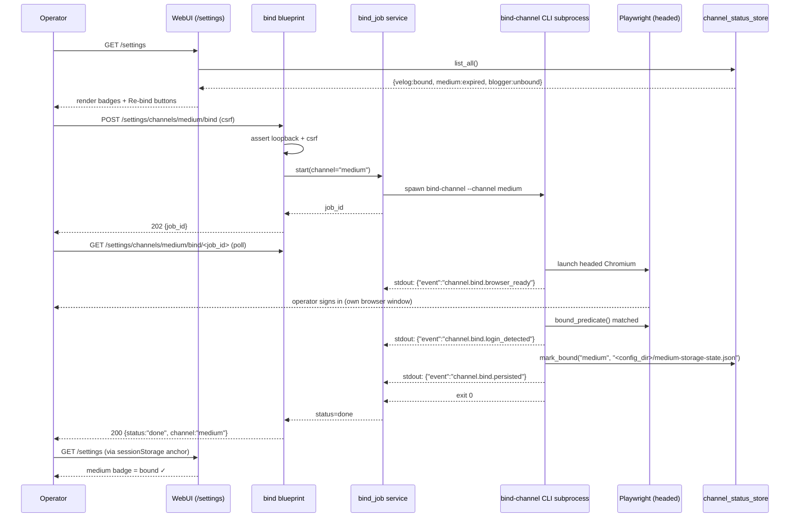
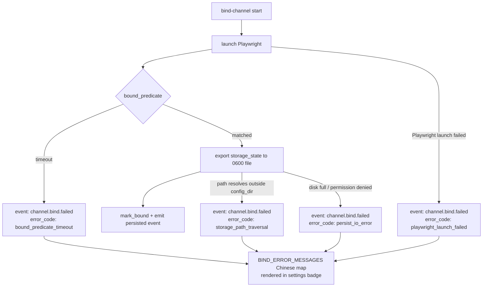
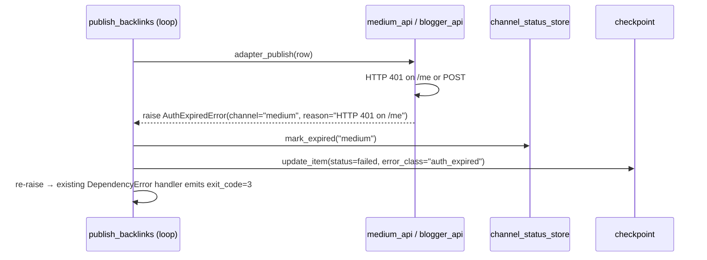

# feat: Browser-driven channel binding — Settings UI + bind-channel CLI + AuthExpiredError adapter wiring

## Overview

Add a **browser-driven binding mechanism** for the three publisher channels (velog / medium / blogger) so operators re-authenticate from the Settings page without hand-editing token files. The mechanism is split across:

- A new **`bind-channel`** CLI that launches a headed Playwright session, drives the channel-specific login recipe, and persists the resulting `storage_state` under `<config_dir>/<channel>-storage-state.json` (0600).
- A new **WebUI bind job** that the Settings page can trigger; it spawns `bind-channel` as a subprocess on the operator's machine, streams RECON events to the UI, and reaps orphan jobs.
- **Adapter error contract upgrade**: 401 from `medium_api` / `blogger_api` now raises `AuthExpiredError(channel=...)` (Unit 1's class), which `publish_backlinks` catches at the dispatch site and writes `mark_expired(channel)` into the status store before propagating.
- A `velog-login` **transparent alias** so plan-012's documented entry point keeps working but funnels into the same `bind-channel velog` machinery (no second implementation).

Unit 1 (foundation: `CHANNELS` frozenset + `AuthExpiredError` + `channel_status_store` + `reconcile_on_load`) shipped in commit `8fbf0b3` on `feat/settings-browser-binding`. This plan covers Units 2–7.

## Problem Frame

Today, channel re-authentication is per-channel ad-hoc:

- **Medium**: edit `[medium].integration_token` in `config.toml` or via Settings UI form (token expires; no signal of expiry until publish fails with HTTP 401 → `ExternalServiceError("Medium /me returned HTTP 401")`).
- **Blogger**: hand-delete `~/.config/backlink-publisher/blogger-token.json`, then run an unstated OAuth flow (also via Settings UI inline form).
- **Velog** (planned in plan-012): a not-yet-shipped `velog-login` CLI subcommand that opens Playwright headed.

Three observations make this worth unifying now:

1. **velog forces a headed Playwright pattern anyway** (no API; cookie + storage_state required). Once we have headed binding for one channel, generalizing to medium (integration token re-issue) and blogger (OAuth) is mostly recipe authoring, not new infrastructure.
2. **The operator has no "this channel is expired, click to re-bind" affordance.** 401s today bubble up as raw publish errors; the operator must read stderr to know to do something. `AuthExpiredError` + `channel_status_store` (Unit 1) gives the UI a state to bind to.
3. **plan-012 is about to land a one-off `velog-login` CLI.** Doing the unification *now* prevents a second implementation drifting; plan-012 Unit 3 becomes a thin alias rather than its own code path.

Unit 1 already shipped the contract layer (status store, error class, `CHANNELS` frozenset, reconcile-on-load). This plan ships the operator-facing surface: CLI, WebUI route, settings card, and the adapter wiring that turns a 401 into an `AuthExpiredError` and writes the status flip.

This plan does **not** define new product behavior beyond what Unit 1 already committed to: the channel set is fixed (`velog/medium/blogger`), the error semantics are fixed (`AuthExpiredError → exit_code=3`, status flip to `expired`, preserve `bound_at` for UX), and the storage convention is fixed (`<config_dir>/<channel>-storage-state.json`, 0600, must resolve inside `_config_dir()`).

### Origin

No upstream `docs/brainstorms/` requirements document exists. Unit 1's commit message + scaffolding established the contract. This plan extends from that contract using the planning bootstrap below.

#### Planning bootstrap

- **Intended behavior**: operator sees per-channel status badge in `/settings`; clicking "Re-bind" launches headed browser on the operator's machine; on completion, badge flips to `bound`. Publish-time 401 flips badge to `expired`.
- **Scope**: 3 channels only (`CHANNELS`). 1 binding mechanism (headed Playwright spawned from `bind-channel` CLI). 1 status store.
- **Non-goals**: no in-browser embedded sign-in (operator's own Chromium opens), no auto-refresh, no multi-machine sync of storage states, no headless mode for binding (verification publishes still run headless).
- **Success criteria**: from a clean clone, an operator can re-bind any channel from the Settings page; a publish 401 flips the badge without operator intervention; the Settings card faithfully reflects the on-disk reality after a server restart.

## Requirements Trace

**CLI & Driver Layer (Unit 2)**
- **R1** — A `bind-channel --channel <name>` CLI entry point exists; `<name>` is validated against `CHANNELS`; unknown name → `UsageError` (exit_code=1). → Unit 2
- **R2** — A headed Playwright driver opens the channel's login URL, waits for the recipe's "logged-in" predicate, exports `storage_state` to `<config_dir>/<channel>-storage-state.json` with mode `0600`, and writes `mark_bound(channel, path)`. → Unit 2
- **R3** — Three channel recipes (`velog`, `medium`, `blogger`) each declare: `login_url`, `bound_predicate` (callable on a `Page`), optional `cookie_host_filter` (defaults to "exact-match the channel's apex"). → Unit 2
- **R4** — An `EVENTS` frozenset enumerates the recon event names emitted on stdout as JSONL — minimally `{"channel.bind.start", "channel.bind.browser_ready", "channel.bind.login_detected", "channel.bind.persisted", "channel.bind.failed"}`. CLI and webui share the same constant. → Unit 2

**Alias (Unit 3)**
- **R5** — `velog-login` is a `pyproject.toml` `[project.scripts]` entry that calls into `cli.bind_channel:main` with `argv = ["--channel", "velog", *sys.argv[1:]]`. No new flags, no new behavior. → Unit 3
- **R6** — Removing the alias must not break plan-012 references — plan-012's amendment in Unit 7 documents the indirection. → Unit 3 + Unit 7

**WebUI Surface (Unit 4)**
- **R7** — A new `bind` Blueprint registers `POST /settings/channels/<channel>/bind` (start) and `GET /settings/channels/<channel>/bind/<job_id>` (poll/stream events). Both routes enforce `_check_csrf_or_abort()` and a **loopback-only assertion** that aborts 403 when `request.remote_addr ∉ _LOOPBACK_HOSTS`. → Unit 4
- **R8** — A `webui_app.services.bind_job` module owns the in-memory job registry: spawn subprocess, capture stdout JSONL, expose status (`pending`/`running`/`done`/`failed`), and clean up. Singleton per Flask app. → Unit 4
- **R9** — An **orphan reaper** runs at startup (called from `create_app`, same call site as `reconcile_on_load`): any job from a prior process (status `running` in any persisted slot) is demoted to `failed(reason="orphaned-on-restart")`. → Unit 4
- **R10** — `reconcile_on_load()` (already in Unit 1's `webui_store.channel_status`) is **wired** into `create_app` — Unit 1 shipped the function but not the call site. → Unit 4

**Settings UI (Unit 5)**
- **R11** — `settings.html` gains a per-channel "binding" subsection inside each existing channel-collapse card (plan-011 baseline). The subsection shows status badge (bound / expired / unbound), `bound_at` (rendered as `last bound at YYYY-MM-DD`), and a "Re-bind" button that POSTs to the bind start route. → Unit 5
- **R12** — Bind-job errors map from raw recon `error_code` to a Chinese operator-friendly message via a `BIND_ERROR_MESSAGES` dict (location: `webui_app/services/bind_job.py`, single source — settings card just renders). → Unit 5
- **R13** — The Settings page reopens to the right channel card after a bind completes by reading `sessionStorage["bind:lastChannel"]`, set when the operator clicks "Re-bind". → Unit 5
- **R14** — A11y: Re-bind button has `aria-label="重新绑定 {{channel}} 渠道"`; status badge has `role="status"` + `aria-live="polite"` so the badge transition is announced. → Unit 5

**Adapter Wiring (Unit 6)**
- **R15** — `medium_api.publish` 401 path raises `AuthExpiredError(channel="medium", reason="Medium /me HTTP 401")` instead of `ExternalServiceError("Medium /me returned HTTP 401")`. The 401 site on the publish POST also flips. → Unit 6
- **R16** — `blogger_api.publish` 401/403 path raises `AuthExpiredError(channel="blogger", reason=...)` instead of `ExternalServiceError("Blogger authentication failed...")`. → Unit 6
- **R17** — `publish_backlinks` adds a **catch site** for `AuthExpiredError` that:
  - calls `webui_store.channel_status.mark_expired(exc.channel)` once per row,
  - records `checkpoint.update_item(..., status="failed", error=str(exc), error_class="auth_expired")`,
  - then **re-raises** so the existing `DependencyError` catch one frame up (line 302) still produces `exit_code=3` for CLI users (telling them to re-bind).
  This catch site sits **before** the existing `except DependencyError` block so the more-specific handler runs first. → Unit 6

**Operational Documentation (Unit 7)**
- **R18** — `AGENTS.md` gets a "Binding a channel" section explaining the operator flow and the cross-cutting machinery (CLI / webui / status store / reconcile-on-load). → Unit 7
- **R19** — `docs/plans/2026-05-18-012-feat-velog-adapter-plan.md` (plan-012) gets an inline amendment block noting that its Unit 3 (`velog-login` CLI) is now shipped as an alias of `bind-channel`, and that plan-012 Unit 4's "DependencyError(velog cookie expired)" should be raised as `AuthExpiredError(channel="velog", reason="velog cookie expired")` for status-store integration. → Unit 7
- **R20** — `docs/solutions/` candidate entry capturing the "headed-browser subprocess on a Flask webui requires loopback assertion + CSRF + orphan reaper" lesson — flagged as a follow-up promotion task in Unit 7's docs but **not** committed here (promotion is rewriting per `AGENTS.md`). → Unit 7

## Scope Boundaries

- **Channel set is closed.** Adding a fourth channel is an explicit follow-up — it requires editing `CHANNELS` + shipping a new recipe + amending docs. This plan does not generalize the recipe shape further.
- **No in-WebUI sign-in panel.** Binding spawns the operator's own Chromium via Playwright; the operator's password never touches the WebUI process.
- **No headless binding.** Binding is always headed. Publish-time verification continues to run headless (existing behavior).
- **No multi-machine sync.** `storage_state` files are local. Multi-machine operators re-bind per machine.
- **No automatic re-bind.** `AuthExpiredError` flips status to `expired` and exits 3 — the operator must click "Re-bind".
- **No background bind jobs.** Bind jobs only run while the spawning HTTP request is held open by the operator's browser tab; the orphan reaper exists to clean up jobs whose parent request died (not to resume them).
- **No remote bind.** Loopback-only assertion is a hard 403, not a feature flag. Remote operators (rare) must SSH and run `bind-channel` directly.
- **No new console_scripts beyond `bind-channel` + `velog-login`.** No `medium-login` / `blogger-login` aliases — operators use `bind-channel --channel <name>` or the Settings page.
- **No persistence of in-flight bind job state.** Job registry is in-memory; the orphan reaper deals with restarts by demoting prior `running` rows, not by recovering them.
- **plan-012 Unit 1 (Phase 0 spike gate) is unchanged.** This plan does not pre-empt the velog adapter spike — `bind-channel velog` is just the login mechanism; the velog *adapter* (GraphQL publish path) still depends on plan-012's spike outcome.

## Context & Research

### Relevant Code and Patterns

**Unit 1 foundations (already landed, commit `8fbf0b3`):**
- `src/backlink_publisher/_util/errors.py` — `AuthExpiredError(DependencyError)` ctor validates `channel` against `CHANNELS`, holds `channel` + `reason`, `exit_code=3`.
- `src/backlink_publisher/cli/_bind/channels/__init__.py` — `CHANNELS: frozenset[str] = frozenset({"velog","medium","blogger"})`. Single authority for membership checks. Unit 2 will extend this module with `EVENTS` and `RECIPES`.
- `src/backlink_publisher/cli/_bind/__init__.py` — placeholder package docstring; Unit 2 lands `driver.py` + per-channel recipes here.
- `webui_store/channel_status.py` — `mark_bound` / `mark_expired` / `get_status` / `list_all` / `reconcile_on_load`. Path validation enforces `storage_state_path.resolve().relative_to(_config_dir())`.
- `tests/test_webui_store_pkg/test_channel_status*.py` — fixture pattern (`monkeypatch.setattr(channel_status_store, "path", fresh)`) shows the test-isolation contract.

**CLI conventions:**
- Each CLI subcommand is its own console_scripts entry — see `pyproject.toml [project.scripts]` lines 30–35. Unit 2 adds `bind-channel = "backlink_publisher.cli.bind_channel:main"`; Unit 3 adds `velog-login = "backlink_publisher.cli.velog_login:main"` (alias).
- Argparse + `if __name__ == "__main__"` pattern (see `cli/publish_backlinks.py`).
- `_util/errors.handle_error` translates `PipelineError` subclasses into `(stderr message, exit_code)`.

**WebUI conventions:**
- Blueprint per concern (`webui_app/routes/*.py`); registered in `webui_app/routes/__init__.py::register_blueprints`.
- CSRF: `_check_csrf_or_abort()` / `_ensure_csrf_token()` in `webui_app/helpers.py`. POST endpoints call `_check_csrf_or_abort()` first.
- Background work: subprocess pattern (see `webui_app/routes/checkpoint.py`, `batch.py`) uses `subprocess.run` with `sys.executable` (per #61 fix `162d402`).
- App factory: `webui_app/__init__.py::create_app` — Unit 4 wires `reconcile_on_load()` + orphan reaper here, in the `start_scheduler is True` branch (same gating as the scheduler so pytest doesn't trigger them).

**Settings UI conventions:**
- `webui_app/templates/settings.html` uses one Bootstrap collapse card per channel (plan-011 ref `5e147ad`). Card body includes a per-channel partial (`_settings_channel_blogger.html` / `_settings_channel_medium.html`); Unit 5 adds a `_settings_channel_<name>_binding.html` partial **inside** each existing card so the channel-collapse refactor stays intact.
- Flash pattern: query-string `flash_type` + `flash_msg`, rendered as a top alert in `settings.html`.

**Adapter conventions (Unit 6):**
- `medium_api.py:109-113` — 401 site for `/me` check.
- `medium_api.py:165-170` (approx) — POST 401 site (publish request).
- `blogger_api.py:168-173` — 401/403 site after `googleapiclient.errors.HttpError`.
- `publish_backlinks.py:302-303` — existing `except DependencyError` catch (one frame up).
- `publish_backlinks.py:296-329` — the dispatch try/except block where Unit 6 inserts the `AuthExpiredError` handler.

### Institutional Learnings

- **`docs/solutions/ui-bugs/webui-blocking-subprocess-and-missing-progress-feedback-2026-05-12.md`** — webui must not block on subprocess; use ThreadPoolExecutor or background queue + JSONL log file the UI polls. Direct guidance for Unit 4 (bind job).
- **PR #61 (`162d402`) `webui: subprocess CLI calls use sys.executable + src PYTHONPATH`** — when webui spawns CLI, always use `sys.executable` (`webui_app/helpers.py` precedent) so pytest / venv resolution stays consistent. Mirrored in Unit 4's subprocess invocation.
- **`feedback_invert_drift_check_when_invariant_becomes_dynamic.md`** — when a static frozenset becomes a registry-delegating function, module-level drift assertions can fail on import. `CHANNELS` is staying static here (3 hardcoded channels), so no inversion needed; if a future plan generalizes to registry-style, that memory applies.
- **`feedback_external_agent_concurrent_edits_in_shared_worktree.md`** — Unit 4 and Unit 5 both touch `webui_app/`; if the implementing agent uses `git add -A` across both worktrees, external WIP can contaminate commits. Use selective `git add` per unit.

### External References

External research **skipped**: Playwright headed-mode storage_state export is well-trodden (the spike at `docs/spikes/velog_login_dump.py` already demonstrates the pattern); Flask blueprint + CSRF is convention from existing routes; subprocess + JSONL log streaming follows the `webui-blocking-subprocess` solution. Local patterns dominate.

(The R9 platform-decoupling plan `docs/plans/2026-05-18-009-refactor-cli-extension-readiness-plan.md` is referenced but not relevant to binding — binding is a credential lifecycle layer, not a publish-platform extension.)

## Key Technical Decisions

- **`bind-channel <name>` is the single mechanism; `velog-login` is an alias, not a separate path.** *Rationale*: prevents two implementations drifting (plan-012 Unit 3 + this plan would otherwise both produce login CLIs). Operator UX cost = zero; one extra entry-point line in `pyproject.toml`.
- **`storage_state` (Playwright's full session export) is the canonical persistence shape, even for Medium (which currently uses integration tokens) and Blogger (which currently uses an OAuth refresh-token JSON).** *Rationale*: Unit 2's driver writes `storage_state.json`. Medium and Blogger recipes layer on top: medium recipe also writes `~/.config/backlink-publisher/medium-token.json` (current shape, untouched); blogger recipe also writes `blogger-token.json` (current shape, untouched). The status store's `storage_state_path` field points at the **Playwright** file as the sentinel for `reconcile_on_load` — if it goes missing, the channel is expired regardless of any token cache. This means Medium / Blogger keep their existing token files functional and binding just refreshes them.
- **EVENTS frozenset is the recon contract surface, not a JSON schema.** *Rationale*: each event line is `{"event": <member>, "ts": ISO, "channel": <name>, ...}`; payload fields are loose; consumer (webui) only matches on `event`. Avoids over-engineering for an internal CLI/UI handshake.
- **Bind job registry is in-memory + per-process.** *Rationale*: bind jobs only matter while the operator's tab is open. Persisting them creates restart-recovery complexity that exceeds operator value. The orphan reaper writes nothing to disk — it inspects any persistent slot (if added later) and demotes; for v1 it is effectively a no-op against the in-memory registry but **the call site exists** so future persistent registries are reaped on startup without further wiring.
- **Loopback assertion is enforced inline in the bind blueprint, separate from `_resolve_bind_host`.** *Rationale*: `_resolve_bind_host` decides *where Flask listens*. The bind route's assertion decides *who's allowed to spawn a browser on this machine*. Two distinct controls; conflating them creates a backdoor when `BACKLINK_PUBLISHER_ALLOW_NETWORK=1`. We **never** allow remote bind, regardless of network-exposure opt-in.
- **AuthExpiredError catch in `publish_backlinks` sits before the generic `DependencyError` catch.** *Rationale*: `AuthExpiredError` extends `DependencyError`; Python `except` order matters. Placing it first lets us run the `mark_expired` side effect, then let the inherited handler (or our explicit re-raise) deliver the `exit_code=3` semantics. Failing to order this correctly means status never flips.
- **Recipe is a `dataclass`, not a `Protocol`.** *Rationale*: 3 channels; the predicate is "wait for URL pattern X" or "wait for selector Y" — too small to justify Protocol abstraction. Dataclass instances live as values in a `RECIPES: dict[str, ChannelRecipe]` in `cli._bind.channels.__init__`. If a fourth channel ever needs imperative logic, *then* refactor to Protocol.
- **No new `Store` subclass for the bind-job registry.** *Rationale*: registry is in-memory; the existing `JsonStore` is for cross-process persistent state. Adding a registry store would force persistence we explicitly don't want.

## Open Questions

### Resolved During Planning

- **Q: Where does the bind subprocess write its event stream?** *A*: stdout JSONL, captured line-by-line by the webui via `subprocess.Popen` + `stdout.readline()` loop in a background thread. Stderr is captured to a sibling log file `<config_dir>/bind-jobs/<job_id>.stderr.log` for debugging. *(Rationale: matches `webui-blocking-subprocess` solution; stdout is the structured contract, stderr is the debug-only fallback.)*
- **Q: How does Unit 6's `mark_expired` interact with concurrent publishes flagging the same channel?** *A*: `JsonStore.update` is atomic under the existing `webui_store.base` semantics (read-modify-write via a single file write). Concurrent calls produce one final `expired` record either way — there is no path where status reverts to `bound` accidentally because `mark_expired` only sets `expired`.
- **Q: Should `velog-login --help` mention the alias?** *A*: Yes — `velog_login.main` prints a one-line "alias for `bind-channel --channel velog`" banner before delegating, so plan-012 readers don't trip. (Implemented in Unit 3.)
- **Q: Does Unit 6's adapter change break existing Medium/Blogger tests that assert `ExternalServiceError`?** *A*: Yes — adapter tests asserting the literal class on 401 will fail. Unit 6's test plan updates `tests/test_adapter_medium_api.py` and `tests/test_adapter_blogger_api.py` to expect `AuthExpiredError` on the 401 paths (preserved class assertion on non-401 paths).
- **Q: Does the orphan reaper need cross-process locking?** *A*: No — it runs once at `create_app` time, before any request thread starts. Single-call, single-thread.
- **Q: How does Settings UI know which channels exist?** *A*: it imports `CHANNELS` from `backlink_publisher.cli._bind.channels` (Unit 1) via `_settings_context()` in `webui_app/helpers.py` (Unit 5 adds `binding_channels=sorted(CHANNELS)` + `channel_statuses=channel_status.list_all()` to the context dict).

### Deferred to Implementation

- **Exact "bound" predicate per channel.** Each recipe needs a probe — for velog, the existing spike uses `await page.wait_for_url(re.compile(r"velog\.io/(?!auth)"))`; for medium, the apex `medium.com/` with a logged-in cookie; for blogger, presence of `accounts.google.com → blogger.com` redirect tail. Final selectors are tuned during implementation against the live login flows.
- **Subprocess timeout default.** 5 minutes is the working assumption; surface as `--timeout` flag in Unit 2 and adjust based on real headed-browser timings.
- **Whether the bind blueprint exposes SSE or just polling.** Polling at 1Hz is the safe default; SSE is a possible upgrade if the events feel laggy in practice — deferred to implementation.
- **Test scope for the Playwright driver.** Recipe-shape tests (pure predicates, host filters) are mandatory. Full headed-browser integration tests are deferred — they require a Playwright fixture that doesn't currently exist in this repo; consider a marker (`@pytest.mark.headed`) and CI opt-out.

## High-Level Technical Design

> *This illustrates the intended approach and is directional guidance for review, not implementation specification. The implementing agent should treat it as context, not code to reproduce.*

### Bind lifecycle (happy path)



### Failure paths surfaced as recon events



### Publish-time auth flip (Unit 6)



### Test scenario shape (recurring pattern across Units 2 / 4 / 6)

| Surface              | Happy             | Edge                             | Error             | Integration              |
|----------------------|-------------------|----------------------------------|-------------------|--------------------------|
| `bind-channel` CLI   | recipe completes  | channel="velog/../etc"           | predicate timeout | event stream order       |
| bind blueprint       | csrf + loopback   | remote IP → 403                  | missing csrf      | full job lifecycle       |
| AuthExpiredError flip| 401 → mark_expired| existing bound stays bound for other channel | non-401 unchanged | full publish_backlinks run |

## Implementation Units

- [x] **Unit 1: Foundation (shipped 2026-05-19, commit `8fbf0b3`)** — `AuthExpiredError`, `CHANNELS` frozenset, `channel_status_store`, `reconcile_on_load`. Out of scope for the rest of this plan; documented here as a completed prerequisite.

---

- [ ] **Unit 2: `bind-channel` CLI + Playwright headed driver + 3 channel recipes + `EVENTS` frozenset**

**Goal:** Ship the single binding CLI that drives a headed Playwright session per channel, emits RECON events on stdout, and writes `mark_bound` on success.

**Requirements:** R1, R2, R3, R4

**Dependencies:** Unit 1 (CHANNELS, AuthExpiredError, channel_status_store, mark_bound)

**Files:**
- Create: `src/backlink_publisher/cli/bind_channel.py` (argparse `main()`, top-level orchestration, event emit helpers, exit-code mapping)
- Create: `src/backlink_publisher/cli/_bind/driver.py` (Playwright headed launcher, generic recipe runner, storage_state writer with 0600 mode + path-resolves-inside-config-dir guard mirroring `_validate_storage_state_path`)
- Create: `src/backlink_publisher/cli/_bind/recipes/__init__.py` (exports `RECIPES: dict[str, ChannelRecipe]`)
- Create: `src/backlink_publisher/cli/_bind/recipes/velog.py`, `medium.py`, `blogger.py` (one `ChannelRecipe` instance each)
- Modify: `src/backlink_publisher/cli/_bind/channels/__init__.py` (add `EVENTS: frozenset[str] = frozenset({...})` alongside `CHANNELS`; export both)
- Modify: `pyproject.toml` (add `bind-channel = "backlink_publisher.cli.bind_channel:main"` under `[project.scripts]`)
- Test: `tests/test_bind_channel_cli.py` (argparse + channel validation + EVENTS membership + exit codes — no Playwright)
- Test: `tests/test_bind_channel_recipes.py` (recipe shape + host filter purity)
- Test: `tests/test_bind_channel_driver.py` (storage_state path-traversal rejection, 0600 mode assertion, event-emission ordering with a fake `Page`)

**Approach:**
- `ChannelRecipe` = `@dataclass(frozen=True)` with fields `login_url: str`, `bound_predicate: Callable[[Page], None]` (called inside `Page.expect_*`-style wait), `cookie_host_filter: Callable[[str], bool]` (default exact-apex match).
- `driver.run_bind(channel, recipe)` returns `BindResult(success: bool, error_code: str | None, storage_state_path: Path | None)`.
- The driver, **not** the recipe, writes the `storage_state` file — recipes are pure declarations.
- Stdout event helper: `_emit(event_name, **payload)` → `print(json.dumps({...}), flush=True)`. Validates `event_name in EVENTS` at emit time (fail-loud on typos).
- Exit-code mapping: 0 success; 1 usage (`UsageError`); 3 dependency-class failure (recipe timeout, Playwright not installed); 4 service-class (network during login); 5 unexpected. Maps via existing `handle_error` / `handle_unexpected_error`.

**Execution note:** Test-first for the event-emission contract (Unit 2's test_bind_channel_cli asserts the JSONL order with a recorded fake driver). Driver implementation lands next; recipes last.

**Technical design:** *(directional)* The recipe shape is intentionally narrow — a recipe is a triple `(url, predicate, host_filter)`. Anything that wants imperative login choreography (form-filling, multi-step) belongs in the headed browser session driven by the operator, not in code. If `medium` later needs an autofill of the integration-token field, that's a recipe-level Playwright `page.fill()` call inside `bound_predicate`'s preamble — not new infrastructure.

**Patterns to follow:**
- argparse + main entry: `src/backlink_publisher/cli/publish_backlinks.py`
- `dataclass(frozen=True)` config shape: `src/backlink_publisher/config/types.py::BloggerOAuthConfig`
- Path-traversal validation: `webui_store/channel_status.py::_validate_storage_state_path`
- spike reference (do not import from): `docs/spikes/velog_login_dump.py`

**Test scenarios:**
- Happy path: `bind-channel --channel medium`, fake driver emits the four events in order — assert stdout JSONL parses to `[start, browser_ready, login_detected, persisted]` and exit_code=0.
- Happy path: `mark_bound` is called with the correct `storage_state_path` after the persisted event.
- Edge case: `--channel ../etc/passwd` → `UsageError` (exit_code=1), no Playwright launch, no event emitted past `start`.
- Edge case: recipe's `cookie_host_filter("evilvelog.io")` returns `False` and `cookie_host_filter("velog.io")` returns `True` (per-channel filter purity).
- Edge case: `EVENTS` typo in `_emit("channel.bind.persistent")` raises `AssertionError` at emit time, not at consumer side.
- Error path: driver storage_state target resolves outside `_config_dir()` → emits `{event:"channel.bind.failed", error_code:"storage_path_traversal"}` and exits 3 without calling `mark_bound`.
- Error path: storage_state file written with mode != 0600 → fail-loud (`UsageError` after stat) — guards against umask drift.
- Error path: bound_predicate times out → `{error_code:"bound_predicate_timeout"}` emitted, exit_code=3.
- Integration: `bind-channel --channel velog` with `BACKLINK_PUBLISHER_CONFIG_DIR` pointing at tmp_path actually writes `<tmp>/velog-storage-state.json` with mode 0600 and `channel_status_store.get_status("velog")["status"] == "bound"`. (Uses a fake driver, not real Playwright.)

**Verification:**
- `bind-channel --channel medium --help` documents the channel choices from `CHANNELS`.
- A successful run leaves `<config_dir>/<channel>-storage-state.json` with mode 0600 and the corresponding `mark_bound` record.
- Failed runs leave **no** partial file (writes are atomic — write to tmp + `os.rename`).
- `EVENTS` and `CHANNELS` both exported from `cli._bind.channels`; importable from webui side without dragging Playwright as a transitive import (lazy-import Playwright inside `driver.py`).

---

- [ ] **Unit 3: `velog-login` alias transparent passthrough to `bind-channel`**

**Goal:** Honor plan-012's `velog-login` entry point without a second implementation; route to `bind-channel --channel velog`.

**Requirements:** R5, R6

**Dependencies:** Unit 2 (`bind_channel:main` must exist)

**Files:**
- Create: `src/backlink_publisher/cli/velog_login.py` (10-line alias `main()` that prepends `["--channel", "velog"]` and delegates)
- Modify: `pyproject.toml` (add `velog-login = "backlink_publisher.cli.velog_login:main"` under `[project.scripts]`)
- Test: `tests/test_velog_login_alias.py`

**Approach:**
- `velog_login.main` shape:
  - print a single-line banner to stderr: `velog-login is now an alias for: bind-channel --channel velog`
  - call `bind_channel_main(["--channel", "velog", *sys.argv[1:]])`
- Banner is informational only; does not change exit behavior.

**Execution note:** Plain delegation; no behavior of its own to test-first.

**Patterns to follow:**
- Existing console_scripts shape in `pyproject.toml [project.scripts]`.

**Test scenarios:**
- Happy path: invoking `velog_login.main(["--help"])` (monkeypatched argv) prints the banner to stderr and the underlying `bind_channel` help to stdout; exit_code=0.
- Happy path: extra flags (`velog-login --timeout 60`) pass through to `bind-channel --channel velog --timeout 60`.
- Edge case: `velog-login --channel medium` is rejected by `bind-channel`'s argparse as a duplicate argument (proves we are not silently overriding); the test asserts `SystemExit` with a non-zero exit_code.

**Verification:**
- `pip install -e .` then `which velog-login` resolves to the alias.
- `velog-login --help | head -1` shows the alias banner.

---

- [ ] **Unit 4: WebUI bind blueprint + `bind_job` service + CSRF blueprint-scope + loopback assertion + orphan reaper + reconcile-on-load wiring**

**Goal:** Provide the WebUI surface that lets `/settings` start a bind job and watch its events; ensure no remote actor can trigger a browser launch on the operator's machine; clean up jobs left running across restarts; finally wire Unit 1's `reconcile_on_load` into `create_app`.

**Requirements:** R7, R8, R9, R10

**Dependencies:** Unit 2 (subprocess target exists)

**Files:**
- Create: `webui_app/routes/bind.py` (Blueprint `bind`; routes `POST /settings/channels/<channel>/bind` + `GET /settings/channels/<channel>/bind/<job_id>`)
- Create: `webui_app/services/__init__.py` (package init)
- Create: `webui_app/services/bind_job.py` (`BindJobRegistry`, `BIND_ERROR_MESSAGES` dict, orphan reaper hook `reap_orphans()`)
- Modify: `webui_app/routes/__init__.py` (register the `bind` blueprint)
- Modify: `webui_app/__init__.py::create_app` (call `reconcile_on_load()` and `reap_orphans()` from the post-blueprint-registration block, gated by the same `start_scheduler` condition that already exists)
- Test: `tests/test_webui_bind_routes.py` (CSRF + loopback + job lifecycle with fake subprocess)
- Test: `tests/test_webui_bind_job_service.py` (registry semantics: spawn, status transitions, cleanup)
- Test: `tests/test_webui_app_factory_reconcile_wiring.py` (asserts `create_app` calls `reconcile_on_load` and `reap_orphans` exactly once, gated correctly under pytest)

**Approach:**
- `BindJobRegistry` is a singleton dict `{job_id: BindJob}` protected by a `threading.Lock`. `BindJob` = `dataclass` with `id`, `channel`, `status`, `started_at`, `proc: subprocess.Popen | None`, `events: list[dict]`.
- `start(channel)`:
  - validates `channel in CHANNELS` (else `UsageError → 400`)
  - mints `job_id = uuid4().hex`
  - spawns `[sys.executable, "-m", "backlink_publisher.cli.bind_channel", "--channel", channel]` with `cwd=` repo root and inherited `BACKLINK_PUBLISHER_CONFIG_DIR`
  - starts a daemon thread that reads stdout line-by-line, json-parses, appends to `events`, and on EOF sets terminal status (`done` if exit_code=0, else `failed`)
- `poll(job_id)`: returns `{status, events, error_message}` where `error_message` is `BIND_ERROR_MESSAGES.get(<last failed event's error_code>, <english fallback>)`.
- Loopback assertion: in the blueprint's `before_request` (Blueprint-scoped, not global): `abort(403)` when `request.remote_addr not in _LOOPBACK_HOSTS` (reuses `webui_app/helpers.py::_LOOPBACK_HOSTS`).
- CSRF: `_check_csrf_or_abort()` first thing in the POST handler (existing pattern).
- Orphan reaper (`reap_orphans()`): for v1, the registry is in-memory only and the function is a documented no-op that logs "no persistent bind-job state to reap" — **but the call site exists** in `create_app`, so a future persistent registry inherits reaping for free. (Documented in the function docstring.)
- `reconcile_on_load` wiring lives in the same `if start_scheduler:` block to mirror "real-runtime side effects don't fire under pytest".

**Execution note:** Test-first the CSRF + loopback assertions; behavioral wiring follows once the assertions hold.

**Patterns to follow:**
- Blueprint shape: `webui_app/routes/oauth.py`
- CSRF: `webui_app/routes/sites.py` lines 27–43
- Subprocess invocation: `webui_app/routes/checkpoint.py` (use `sys.executable`, PR #61 lesson)
- App factory gating: `webui_app/__init__.py::create_app` (the `start_scheduler` branch)

**Test scenarios:**
- Happy path: `POST /settings/channels/medium/bind` with valid CSRF from `127.0.0.1` returns `{job_id, status:"running"}` and the registry has one entry.
- Happy path: `GET /settings/channels/medium/bind/<job_id>` reflects events as they arrive (mock the subprocess with a script that prints the four EVENTS in order).
- Happy path: full job lifecycle reaches `status:"done"` and the events list contains all four EVENTS members.
- Edge case: `POST` with `request.remote_addr = "10.0.0.5"` (mocked) → `403`, no subprocess spawned.
- Edge case: `POST` without CSRF token → `403`, no subprocess spawned.
- Edge case: `POST /settings/channels/foo/bind` (channel ∉ `CHANNELS`) → `400`, no subprocess spawned.
- Error path: bind subprocess exits with `failed` event + non-zero exit_code → poll returns `status:"failed"` + `error_message` rendered from `BIND_ERROR_MESSAGES`.
- Error path: subprocess stdout closes mid-stream (kernel kill) → status transitions to `failed(reason="stream_closed_no_terminal_event")` after `proc.wait()` returns.
- Integration: `create_app(start_scheduler=True)` triggers `reconcile_on_load` (verified by pre-seeding a bound record whose `storage_state_path` doesn't exist → after factory call, status is `expired`).
- Integration: `create_app(start_scheduler=False)` (pytest default) does **not** call `reconcile_on_load` (verified by leaving a missing-file bound record `bound` after factory call).

**Verification:**
- `flask --app webui_app run` from a fresh clone with `BACKLINK_PUBLISHER_CONFIG_DIR` set: hitting `POST /settings/channels/medium/bind` from `curl 127.0.0.1` returns a `job_id`; from `curl <LAN-ip>` returns 403.
- `webui_app.routes.__init__.register_blueprints` lists the `bind` blueprint.
- Restart-time `reap_orphans` log line appears once per `create_app(start_scheduler=True)` call.

---

- [ ] **Unit 5: Settings UI binding section + Chinese error mapping + a11y + reopen-tab via sessionStorage**

**Goal:** Surface the channel-binding flow in `/settings` so an operator can read status and click Re-bind without leaving the page.

**Requirements:** R11, R12, R13, R14

**Dependencies:** Unit 4 (POST/GET endpoints)

**Files:**
- Modify: `webui_app/templates/settings.html` (add the binding subsection inside each existing channel card, after the OAuth/token form)
- Create: `webui_app/templates/_settings_channel_binding.html` (one shared partial parameterized by `{channel}`, included from each channel card)
- Modify: `webui_app/helpers.py::_settings_context` (add `binding_channels=sorted(CHANNELS)`, `channel_statuses=channel_status.list_all()`, `bind_error_messages=BIND_ERROR_MESSAGES`)
- Modify: `webui_app/services/bind_job.py` (Unit 4 created the dict; Unit 5 finalizes its keys based on the events Unit 2 emits)
- Create: `webui_app/static/js/bind_channel.js` (small front-end: POST to start, poll the GET endpoint at 1Hz, update badge + flash, write `sessionStorage["bind:lastChannel"]` on click)
- Modify: `webui_app/templates/settings.html` (read `sessionStorage["bind:lastChannel"]` in a top-of-page `<script>` and re-open the matching collapse + scroll into view)
- Test: `tests/test_settings_binding_partial.py` (renders the partial with each status; asserts a11y attributes + Chinese error strings appear; uses `flask.render_template_string` with a stub context)
- Test: `tests/test_bind_error_messages.py` (every event_code that `bind-channel` can emit maps to a Chinese message; no English fallbacks for known codes)

**Approach:**
- `_settings_channel_binding.html` renders:
  - badge with `role="status" aria-live="polite"` showing the localized status (绑定中 / 已绑定 / 已过期 / 未绑定)
  - if `bound_at` present, a small "上次绑定 YYYY-MM-DD" subtext
  - a "重新绑定 / 绑定" button with `aria-label="重新绑定 {{channel}} 渠道"` and `data-channel` data attribute consumed by `bind_channel.js`
- `bind_channel.js` is ~80 lines, no framework: `fetch(POST)` → on `{job_id}`, poll `GET /…/<job_id>` at 1Hz until `status ∈ {done, failed}`, update the DOM badge text + class. On any click, set `sessionStorage["bind:lastChannel"] = channel`. After the page loads, if that key exists, run `document.querySelector('#channel-' + channel + ' button.channel-toggle')?.click()` to reopen the card, then clear the key.
- `BIND_ERROR_MESSAGES` (in `services/bind_job.py`):
  - `"bound_predicate_timeout"` → "登录超时，请在 5 分钟内完成浏览器登录后重试"
  - `"playwright_launch_failed"` → "无法启动浏览器，请确认已安装 Playwright（运行 `playwright install chromium`）"
  - `"storage_path_traversal"` → "凭据路径校验失败（内部错误），请检查 BACKLINK_PUBLISHER_CONFIG_DIR 是否被异常覆盖"
  - `"persist_io_error"` → "无法写入凭据文件，请检查磁盘空间和权限"
  - `"stream_closed_no_terminal_event"` → "子进程意外退出，请查看 stderr 日志"

**Execution note:** Render-and-snapshot for the partial; the JS file is small enough that hand-testing in the browser is the verification path, not a JS test framework (none in this repo).

**Patterns to follow:**
- Channel card structure: existing `_settings_channel_blogger.html` / `_settings_channel_medium.html` (plan-011)
- Helper context dict: `webui_app/helpers.py::_settings_context`
- Flash pattern: query-string `flash_type` / `flash_msg`

**Test scenarios:**
- Happy path: with `channel_statuses={"medium": {"status":"bound","bound_at":"2026-05-19T10:00:00+00:00","storage_state_path":"..."}}`, the rendered partial shows "已绑定 ✓" badge + "上次绑定 2026-05-19" subtext.
- Happy path: with `channel_statuses={"medium": {"status":"expired", ...}}`, the badge shows "已过期 ⚠" + Re-bind button labeled "重新绑定".
- Edge case: `channel_statuses` missing a key → defaults to `unbound` (no KeyError; `get_status` handles it).
- Edge case: every member of `EVENTS` whose suffix is `failed` maps via a known `error_code` in `BIND_ERROR_MESSAGES` (the test imports both sets and asserts coverage of error codes Unit 2 may emit).
- Integration: rendering `settings.html` with the full context dict does not throw and contains all three channel cards plus the binding partial in each. (Uses Flask test client + a mock store.)
- A11y: rendered HTML contains `role="status"`, `aria-live="polite"`, and `aria-label` for every Re-bind button (string assertion).

**Verification:**
- Manual: in a running webui, click Re-bind on Medium → badge transitions "绑定中…" → "已绑定 ✓"; the Medium card stays open after the page reload.
- Manual: simulate a failed bind (point `bind-channel` at a recipe that always times out) → badge shows "已过期 ⚠" + Chinese error tooltip.

---

- [ ] **Unit 6: `medium_api` / `blogger_api` 401 → `AuthExpiredError` + `publish_backlinks` catch site**

**Goal:** Translate adapter-level auth failures into `AuthExpiredError` (Unit 1), flip the channel status to `expired` in the publish loop, and exit with code 3 (so the operator knows to re-bind).

**Requirements:** R15, R16, R17

**Dependencies:** Unit 1 (AuthExpiredError + channel_status_store), Unit 4 wired-or-not (Unit 6 does not block on Unit 4 — the status flip is a pure call to `mark_expired`, which works whether the webui is running or not).

**Files:**
- Modify: `src/backlink_publisher/publishing/adapters/medium_api.py` (two 401 sites: `/me` check + POST publish; each raises `AuthExpiredError(channel="medium", reason=...)`)
- Modify: `src/backlink_publisher/publishing/adapters/blogger_api.py` (401/403 site after `googleapiclient.errors.HttpError`; raises `AuthExpiredError(channel="blogger", reason=...)`)
- Modify: `src/backlink_publisher/cli/publish_backlinks.py` (insert `except AuthExpiredError as exc:` block immediately before the existing `except DependencyError as exc:` on line ~302; same insertion at the second dispatch site near line ~693)
- Modify: `tests/test_adapter_medium_api.py` (assertions on the 401 paths switch from `ExternalServiceError` to `AuthExpiredError`)
- Modify: `tests/test_adapter_blogger_api.py` (assertions on the 401/403 paths switch from `ExternalServiceError` to `AuthExpiredError`)
- Create: `tests/test_publish_backlinks_auth_expired_flip.py` (full loop: a mocked adapter raises `AuthExpiredError`; assert `channel_status_store.get_status("medium")["status"] == "expired"` after the row; assert checkpoint records `error_class="auth_expired"`; assert exit_code=3 propagates)

**Approach:**
- The handler insertion shape (illustrative, not literal):
  ```
  except AuthExpiredError as exc:
      from webui_store.channel_status import mark_expired
      mark_expired(exc.channel)
      checkpoint.update_item(run_id, item["id"], "failed",
                              error=str(exc),
                              error_class="auth_expired")
      publish_logger.error(...)
      raise  # rethrow → outer DependencyError handler emits exit_code=3
  ```
- Adapter ctor call shape: `AuthExpiredError(channel="medium", reason="Medium /me HTTP 401")`. The ctor validates `channel ∈ CHANNELS`, so passing a literal "medium" / "blogger" / "velog" works; misspellings fail loud at adapter test time.
- The Blogger 403 case (token revoked) is treated as auth-expired too — same `error_code=3` semantic.

**Execution note:** Test-first the publish_backlinks flip — write `test_publish_backlinks_auth_expired_flip.py` against a mock adapter that raises `AuthExpiredError`, watch it fail, then add the handler.

**Patterns to follow:**
- Adapter error shape: `src/backlink_publisher/publishing/adapters/medium_api.py:109-113`
- Existing publish_backlinks DependencyError handler: `src/backlink_publisher/cli/publish_backlinks.py:302-303`
- Checkpoint update shape: `publish_backlinks.py:307-313`

**Test scenarios:**
- Happy path: `medium_api.publish` against a 200 response returns normally (no change).
- Happy path: `blogger_api.publish` against a 200 response returns normally (no change).
- Error path (adapter): `medium_api` `/me` 401 → raises `AuthExpiredError(channel="medium", reason="...")`. (Previously: `ExternalServiceError`.)
- Error path (adapter): `medium_api` POST 401 (after a passing `/me`) → raises `AuthExpiredError(channel="medium", reason="...")`.
- Error path (adapter): `blogger_api` HttpError(status=401) → raises `AuthExpiredError(channel="blogger", reason="...")`.
- Error path (adapter): `blogger_api` HttpError(status=403) → raises `AuthExpiredError(channel="blogger", reason="...")` (token revoked treated as expired).
- Error path (adapter): `medium_api` 500 still raises `ExternalServiceError` (regression guard — non-auth errors unchanged).
- Integration: `publish_backlinks.main(["--rows", "<fixture with one medium row>"])` with the medium adapter mocked to raise `AuthExpiredError`:
  - exits with code 3
  - `channel_status_store.get_status("medium")["status"] == "expired"`
  - `bound_at` is preserved (Unit 1 invariant — `mark_expired` keeps it)
  - checkpoint shows `error_class="auth_expired"` on the row
- Integration: a row with `platform="medium"` raising `AuthExpiredError` does **not** flip `velog` or `blogger` status (isolation).

**Verification:**
- `pytest tests/test_adapter_medium_api.py tests/test_adapter_blogger_api.py tests/test_publish_backlinks_auth_expired_flip.py -q` is green.
- Live (with Medium token revoked): `publish-backlinks --platform medium ...` exits 3, prints `channel 'medium' credentials expired (Medium /me HTTP 401)` to stderr, and `channel-status.json` shows medium → expired.

---

- [ ] **Unit 7: Operational docs — AGENTS.md section + plan-012 amendment + solutions follow-up flag**

**Goal:** Land the operator-facing documentation and surface the boundary between this plan and plan-012 so neither agent re-implements what the other has.

**Requirements:** R18, R19, R20

**Dependencies:** Units 2, 4, 5, 6 (so the operator-facing flow they describe is real)

**Files:**
- Modify: `AGENTS.md` (add a "Binding a channel" section after "Adding a new publisher adapter")
- Modify: `docs/plans/2026-05-18-012-feat-velog-adapter-plan.md` (add an inline amendment block near plan-012 Unit 3 and Unit 4 noting the alias indirection and the `AuthExpiredError` upgrade)
- Modify: `README.md` (one paragraph: "If a publish fails with `channel 'X' credentials expired`, open Settings and click Re-bind on the affected channel.")
- Create: `docs/solutions/best-practices/` candidate stub commit-message draft (the actual `docs/solutions/` entry is **not** authored here; Unit 7 only flags the follow-up because `AGENTS.md` requires promotion to be a rewriting pass)
- Test: `tests/test_agents_md_has_binding_section.py` (existence-of-section grep test mirroring the pattern in `tests/test_no_monolith_regrowth.py` — minimal: `assert "Binding a channel" in AGENTS_MD_TEXT`)

**Approach:**
- AGENTS.md "Binding a channel" section covers:
  - The three channels and where their storage_state lands (`<config_dir>/<channel>-storage-state.json`, 0600)
  - The two entry points (`bind-channel --channel <name>` and `velog-login` alias)
  - The Settings UI flow (Re-bind button, badge meanings, sessionStorage reopen)
  - The publish-time flip semantic (401 → `AuthExpiredError` → `mark_expired` → exit 3)
  - The boundary that `bind-channel` is for **credential lifecycle** and is orthogonal to the publish-platform extension recipe (R9 plan)
- plan-012 amendment is two short blocks: one near plan-012 Unit 3 referencing this plan's Unit 3 alias; one near plan-012 Unit 4 saying the adapter must `raise AuthExpiredError(channel="velog", ...)` instead of the planned bare `DependencyError`. Marked as "Amendment 2026-05-19: see `2026-05-19-001-feat-settings-browser-binding-plan.md`".

**Execution note:** Documentation; no test-first. The grep test is a sanity guard, not a behavior assertion.

**Patterns to follow:**
- AGENTS.md section style: "Adding a new publisher adapter" (already in file)
- Plan amendment style: see the inline annotations already present in `docs/plans/2026-05-18-012-feat-velog-adapter-plan.md` (e.g. "**[Affects Unit 3 schema]**")

**Test scenarios:**
- Happy path: `tests/test_agents_md_has_binding_section.py` reads `AGENTS.md` and asserts both the section header "Binding a channel" and the substring `bind-channel --channel` are present.
- Test expectation: none for the README / plan-012 amendment — documentation-only changes with no behavioral surface.

**Verification:**
- `git diff AGENTS.md docs/plans/2026-05-18-012-feat-velog-adapter-plan.md README.md` review for clarity, accuracy against the shipped code, and no broken references.
- A new contributor can read the AGENTS.md section and answer: "How do I re-bind Medium?" and "What happens when a publish fails with HTTP 401?" without reading source code.

## System-Wide Impact

- **Interaction graph:**
  - `create_app` now invokes two new startup hooks (`reconcile_on_load`, `reap_orphans`). Both gated by `start_scheduler` so pytest unaffected. Failure in either hook must not crash `create_app` — wrap in `try/except` with a logged warning.
  - `publish_backlinks` gains a new exception class in its handler chain; the order (`AuthExpiredError` before `DependencyError`) is load-bearing.
  - `bind-channel` subprocess inherits `BACKLINK_PUBLISHER_CONFIG_DIR` — Unit 4's `BindJobRegistry.start` must propagate the env var explicitly (otherwise the bind writes to the operator's real config dir instead of the test's tmp dir).
- **Error propagation:**
  - Adapter `AuthExpiredError` → `publish_backlinks` (mark_expired + checkpoint) → existing `DependencyError` handler (`emit_error(..., exit_code=3)`) → CLI exit 3 → operator sees stderr.
  - Bind subprocess failure → `failed` event in JSONL → `BindJobRegistry` status `failed` → poll endpoint → Settings badge `expired` + Chinese error message.
- **State lifecycle risks:**
  - `mark_bound` happens in the `bind-channel` subprocess; if the subprocess is killed between writing the `storage_state` file and calling `mark_bound`, the file exists but status remains `unbound`/`expired`. Next `reconcile_on_load` does **not** repair this (it only demotes — never promotes). Acceptable for v1 because the operator can simply re-click "Re-bind"; the partial-write window is small (file already written) and re-binding is idempotent.
  - Concurrent binds for the same channel: registry does not prevent two `start(channel="medium")` calls; the second subprocess overwrites the first's `storage_state` file (atomic rename) and overwrites `mark_bound`. Last-writer-wins; safe but surprising. Mitigation: `bind_job` registry refuses `start()` while a job for the same channel is `running`.
  - `storage_state_path` references stale paths after `BACKLINK_PUBLISHER_CONFIG_DIR` changes: `reconcile_on_load` demotes to `expired` (Unit 1 behavior).
- **API surface parity:** `bind-channel` is the **only** new CLI surface; no other CLI entry points change. `velog-login` mirrors `bind-channel --channel velog` exactly.
- **Integration coverage:** Unit 4's `test_webui_app_factory_reconcile_wiring.py` is the cross-layer assertion — without it, Unit 1's `reconcile_on_load` could silently be never-called. Unit 6's `test_publish_backlinks_auth_expired_flip.py` is the cross-layer assertion across adapter + publish loop + status store.
- **Unchanged invariants:**
  - `webui_store/channel_status.py` API (mark_bound / mark_expired / get_status / list_all / reconcile_on_load) is **not** modified. Unit 1 froze the contract; this plan only adds callers.
  - `AuthExpiredError` ctor signature is unchanged from Unit 1.
  - Existing Medium / Blogger integration token + OAuth refresh flow is unchanged — `bind-channel medium` writes a new file (`medium-storage-state.json`) in addition to existing `medium-token.json`; the legacy file remains the source of truth for `medium_api.publish`. Status is what flips; token storage is unchanged.
  - `publish_backlinks` exit codes unchanged — `AuthExpiredError` inherits from `DependencyError` so exit_code=3 is preserved by the existing handler chain.
  - plan-012 Unit 1 (Phase 0 spike) is unchanged.

## Risks & Dependencies

| Risk | Likelihood | Impact | Mitigation |
|------|-----------|--------|------------|
| Headed Playwright unavailable in CI (no display) | High | Low — only blocks integration tests | Recipe shape + driver tests use a fake `Page`; full integration tests gated by `@pytest.mark.headed` and excluded from default `pytest` invocation |
| Operator opens bind URL from a remote browser via SSH port-forward | Low | High — would spawn a browser on the wrong machine | Loopback assertion is `request.remote_addr` based; SSH port-forward presents as 127.0.0.1 on the server side, so this is **inherently allowed**. Documented explicitly in AGENTS.md as a known limitation. Mitigation: the `BACKLINK_PUBLISHER_ALLOW_NETWORK=1` operator already opted into the network exposure |
| `mark_expired` import in `publish_backlinks` creates a cycle (publish → webui_store → ?) | Low | Medium | `webui_store` does not import from `backlink_publisher.publishing` (verified at planning time). Use the existing `from webui_store.channel_status import mark_expired` import shape inside the handler (lazy local import) to defend against future changes |
| Concurrent binds for the same channel race the storage_state file | Medium | Low | Atomic rename + registry refuses concurrent `start` per channel |
| Adapter 401 happens on a 401-meaning-rate-limit edge case (some APIs use 401 generically) | Low | Medium | `AuthExpiredError(reason=...)` always includes the HTTP context; operator can inspect; if a false flip becomes a real problem, narrow the adapter conditional (e.g. require `WWW-Authenticate` header presence) |
| Unit 6 breaks downstream consumers asserting on the literal exception class | Low | Low | Only the project's own tests assert on the class; `AuthExpiredError` is a `DependencyError` subclass so `except DependencyError` consumers are unaffected. Project tests updated in the same unit |
| `reconcile_on_load` wired in Unit 4 fires before `_isolate_user_dirs` in tests | Low | Medium | Gated by `start_scheduler`, which Unit 4's wiring respects; pytest leaves it off |
| Plan-011 channel-collapse refactor is mid-merge during Unit 5 | Already landed (`5e147ad`) | — | No active coordination needed |
| Plan-012 Unit 3 ships independently before Unit 3 here | Low | High — double implementation | Unit 7's amendment + Unit 3's banner are the contract. Coordinate with whoever picks up plan-012 |

## Documentation / Operational Notes

- Unit 7 covers AGENTS.md + plan-012 amendment + README one-liner.
- A `docs/solutions/` promotion candidate (the lesson: "headed-browser subprocess from a Flask webui requires loopback assertion + CSRF + orphan reaper + storage_state path locality") is **flagged as a follow-up** for `/ce:compound` after this plan lands. Not authored in Unit 7 (promotion is rewriting per AGENTS.md, not copy-paste).
- Operator onboarding: a first-time bind requires `playwright install chromium`. Unit 5's `BIND_ERROR_MESSAGES["playwright_launch_failed"]` references this incantation directly.
- Monitoring: `bind-channel` exit_code maps to `handle_error` standard codes (0/1/3/4/5). No new exit code added.
- Rollout: this is feature work in a single PR per unit; no flag. Order: Unit 2 → Unit 3 → Unit 4 → Unit 5 → Unit 6 → Unit 7. Units 2+3 can land independently of Units 4–7 (the CLI works on its own). Unit 6 should land after Unit 4 so `reconcile_on_load` is wired before adapters start flipping channels to `expired`.

## Sources & References

- **Origin document:** none (no upstream brainstorm; Unit 1's commit `8fbf0b3` + the user's multi-unit scope brief serve as the planning bootstrap)
- **Prerequisite (already shipped):** Unit 1 commit `8fbf0b33a9d99bcc7e43678d75d54a9fdccbf1f0` on `feat/settings-browser-binding`
- **Adjacent plan (coordinate via Unit 7 amendment):** `docs/plans/2026-05-18-012-feat-velog-adapter-plan.md`
- **Adjacent plan (settings-card scaffolding, already landed):** `docs/plans/2026-05-18-011-refactor-settings-channel-collapse-plan.md` (merged `5e147ad`)
- **Adjacent plan (CLI extension readiness, already landed):** `docs/plans/2026-05-18-009-refactor-cli-extension-readiness-plan.md` (merged `6ec7f77` / #68)
- **Spike code (do not import — reference only):** `docs/spikes/velog_login_dump.py`
- **Institutional learning:** `docs/solutions/ui-bugs/webui-blocking-subprocess-and-missing-progress-feedback-2026-05-12.md`
- **PR conventions:** PR #61 `162d402` (subprocess via `sys.executable`), `AGENTS.md`'s "Adding a new publisher adapter" recipe
- **Resume context:** worktree `bp-settings-browser-binding/`, branch `feat/settings-browser-binding`, `.venv/` ready, start at **Unit 2** in a fresh session
