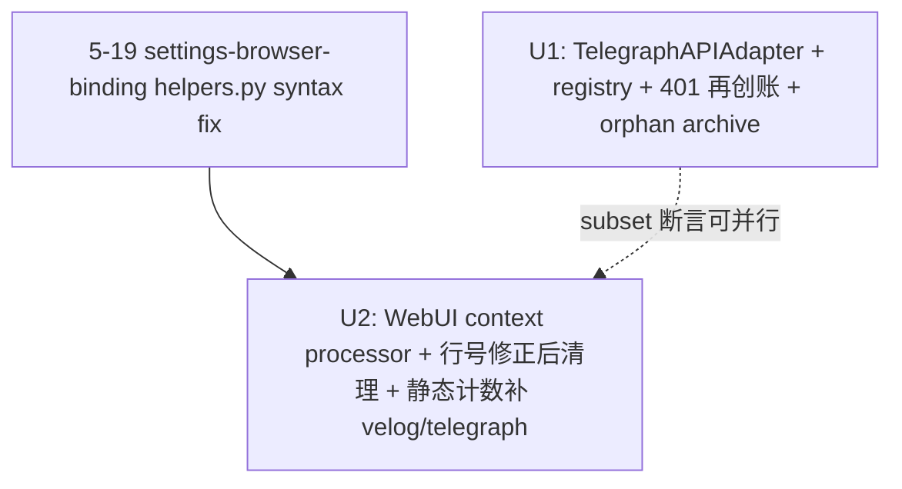

# Telegraph channel end-to-end wiring

## Overview

把 telegra.ph 从脱离 dispatcher 的 spike 升格为生产渠道。两条独立但同体量的工作：
1. **U1**：`TelegraphAPIAdapter` 接 `Publisher` ABC + `register("telegraph", …)`，含 401 INVALID_TOKEN 就地"再创账"恢复路径（重调 `createAccount` 一次，无 dispatcher fallback 链）。
2. **U2**：WebUI 从 registry 反向驱动 —— Flask context processor 注入 `platforms`，扫除剩余硬编码（主要在 JS 计数 dict）+ 删 wordpress 幽灵选项。

⚠ **U1/U2 合并必须串行**（不再"可并行"）：U2 测试若用精确集合断言（exact-set on JS counter keys），U1 land 会在 U2 之后把测试搞红。采用 **subset 断言**（`'velog' in keys` 而非 `keys == {…}`）规避；或显式 U2 → U1 顺序。

⚠ **velog 真实状态修正**（feasibility 反馈）：grep 显示 velog 已在 select option / filter chip / norm_platform tuple 出现 —— **仅** 在 JS 计数 dict `index.html:1656` 缺席。所以 U2 是"修正部分漂移 + 删 wordpress + 反向驱动以防再漂"，不是"从零救回 velog"。这缩小了 B 的修复面但**不**减少 R7-R11 的工作量（仍需建立 registry-driven 契约才能防止下次 register 时再漏一处）。

## Problem Frame

用户报告"发布渠道列表里看不到 telegraph"。诊断发现 3 个根因（见 origin），其中根因 C（API vs Playwright 技术路径）经评审收敛为"只做 API + 401 自愈"，Playwright fallback (Group 3) 砍掉。根因 A (registry) 和 B (WebUI 硬编码) 是本期 in-scope 的两条并行工作流。

关键事实（见 origin Dependencies）：
- 全仓零 wordpress 历史数据（已 grep）→ R10 直接砍，无需 migration
- WebUI 默认 127.0.0.1 单用户 bind（`webui.py:8-10/85-88`）→ context processor 暴露 platforms list 在默认部署下安全
- Phase 0 ship-seal routines 只读 `results-manifest.json`，不再调 spike → spike 不动也行

## Requirements Trace

来自 origin requirements doc（R2/R13(旧)/R14/R15 已砍）：

**U1 — TelegraphAPIAdapter 接线 (origin R1/R3/R4/R5/R12/R13/R14)**

> ⚠ 注：本文档中 `R13` / `R14` 是**本计划的新编号**，对应 401 自愈逻辑 + 错误传播。Origin brainstorm 中**已砍**的 R13/R14 是旧 Playwright 路径（Group 3），与此处无关。

- R1. 新增 `src/.../adapters/telegraph_api.py` 实现 `Publisher` ABC（复用 `telegraph_node.py` 转换器与 spike 的 createAccount/createPage 核心逻辑；spike 不动）
- R3. `register("telegraph", TelegraphAPIAdapter)` 单 adapter（**非元组**），无 dispatcher fallback
- R4. `verify_adapter_setup("telegraph", config)` **仅**校验 token 文件存在 + 可读 + 0600（**不**做 createAccount 端点 reachability 检查 —— 那样会让 adapter 健康度耦合到网络可达性，违背"匿名、无账号"USP；端点不可达让真实 publish 自然报错即可）
- R5. Token 文件 `~/.config/backlink-publisher/telegraph-token.json`（**砍掉 `-phase0-` 中缀**，理由见 Key Decisions：spike 写自己 `run_output/` 目录，路径独立，原"为 spike 兼容"理由不成立；保留 `-phase0-` 反而把一次性项目阶段名漏进永久产物路径）。Schema `{access_token, short_name}`，0600，**原子写**（tmp + chmod + rename）。**读取时向后兼容**：若新路径不存在但旧 `telegraph-phase0-token.json` 存在，读旧文件 + 静默迁移到新路径（保护 Phase 0 阶段已用过 adapter 的早期用户）
- R12. 默认走 API，无 token 时 createAccount → 写盘 → createPage
- R13. **401 INVALID_TOKEN 再创账恢复**（不是"自愈" —— 见 P0 决策）：API 401 → 调 createAccount 写新 token → 重试一次；仍失败抛 `ExternalServiceError`。WARN 日志 `telegraph_token_rotated` + **原账号 token 文件归档到 `telegraph-token.json.orphaned-<iso>`**（允许后续 Telegraph 工单恢复 / 至少留审计痕迹）。**file lock（fcntl.flock）**包整个 rotate-write 序列，避免并发 publish 进程双写丢失账号
- R14. Catch-all：429/5xx/network 直接抛（dispatcher 规则一致）；未预期异常传播

**U2 — WebUI registry-driven (origin R6-R11c) — 行号已据 grep 修正**
- R6. Flask context processor 注入 `platforms`，**不**新增 `/api/platforms` endpoint
- R7. `index.html:838-843` select 改为 `<option>`（**注意**：行 841 是 velog option，行 842 才是 wordpress —— R10a 删的是 842，不是 841）
- R7b. ~~setVal default 改读 platforms[0].slug~~ — **降级**：保留现有 `|| 'blogger'` 安全 fallback，无需为 telegraph 可见性改它（scope-guardian F3）
- R7c. ~~JS 计数 dict 全动态化~~ — **降级**：`index.html:1656` 现仅有 `{ all:0, blogger:0, medium:0, other:0 }`（缺 velog、wordpress、telegraph）。改为静态 dict 补 `velog:0, telegraph:0` 即可满足契约；不引入 Jinja 循环 + JS 解析风险 + trailing comma 隐患。**未来**新增 register() 时仍需手动加一行 —— 用 R11 测试断言 chip-count 覆盖完整以防漏
- R8. `index.html:1252-1259` filter chip 行从 platforms 循环渲染（保留 `other` + `all` 兜底 chip）。当前已有 velog chip 在 1257，重写后行为不变但来源变为 registry
- R8b. `index.html:1263` `norm_platform` 模板表达式从硬编码 tuple `('blogger', 'medium', 'velog')` 改为 `platforms | map(attribute='slug') | list`
- R9. `settings.html:647/663` `setSelect` 默认值同 R7b（保留 `|| 'blogger'`）
- R10a. `index.html:842` `<option value="wordpress">` 移除（**注意 842 不是 841**）
- R10b. `webui_app/helpers.py:336-345` `detect_platform()` **仅**移除 `wordpress.com → "wordpress"` 分支。**保留**未知域名 → `'medium'` 的现有 fallback 行为（scope-guardian F1 + adversarial F8 一致建议：'medium' → None 改动是 scope creep + 未做 e2e 验证 + 有真实下游回归风险，本期不做。Follow-up issue 跟踪"unknown → None"的独立讨论）
- R11a. **velog-counter canary 集成测试**：精确断言 `velog` 出现在 JS 计数 dict 中（这是 velog 当前**唯一**仍漂移的位置）。同测试断言 wordpress 在 select 已消失
- R11b. ~~DummyAdapter 契约测试~~ — **砍**（scope-guardian F4）：与 R11a 双重覆盖。velog 已是真实 canary，DummyAdapter 不增加语义覆盖度
- R11c. **ROUTE_TIER_MATRIX 副作用 = 被动验证**：本期对 ROUTE_TIER_MATRIX **零 code 改动**（telegraph + velog 自动落到 `_DEFAULT_TIER = "c"`，drift 断言已涵盖）。Test scenario：`pytest tests/test_content_negotiation.py` 应仍绿 —— 若变红再调查

**Success Criteria（origin SC1/2/3/4/5/6）** — 见各 unit Verification

## Scope Boundaries

- ✗ 不实现 `TelegraphBrowserAdapter` / 任何 Playwright 路径（P0-Q1）
- ✗ 不与 5-19 settings-browser-binding plan 发生交互（Group 3 砍后无机制差异需协调）
- ✗ 不改 spike 脚本（保留为 Phase 0 历史依赖）
- ✗ 不实现 wordpress adapter / 不加 wordpress migration（零历史数据）
- ✗ 不加 WebUI auth 中间件（默认 127.0.0.1 安全；远程模式用户自负责任）
- ✗ 不改 dispatcher / Publisher ABC（沿用 5-18-009 R9 解耦后的规则）
- ✗ 不加 Telegraph editPage/delete/list（只 createPage）
- ✗ 不引入 Telegram bot 绑定

## Context & Research

### Relevant Code and Patterns

**Closest analog — BloggerAPIAdapter (single API, no fallback)**
- `src/backlink_publisher/publishing/adapters/blogger_api.py` — `BloggerAPIAdapter(Publisher)` at line 95
  - 模块级 helpers: `_build_credentials`, `_near_expiry`, `json_from_creds`, `json_log`
  - 使用 `retry_transient_call(...)` from `.retry`，`is_retryable=lambda exc: isinstance(exc, HttpError) and exc.resp.status in RETRYABLE_HTTP_STATUSES` —— TelegraphAPIAdapter 应镜像此模式处理 5xx/429
  - 401/403 当前抛 `ExternalServiceError`（无 self-heal），告诉用户删 token —— telegraph 在此**分叉**：先就地 createAccount 自愈一次，仍 401 才抛
  - 返回 `AdapterResult(status="drafted"|"published", adapter="telegraph-api", platform="telegraph", published_url=…)`
- 测试：`tests/test_adapter_blogger_api.py`（主测）+ `tests/test_adapter_blogger_api_xss_contract.py`（tier "a" 平台需要 XSS contract 测试；telegraph tier "c" 不需要）

**Spike 代码源（不改动，仅复用核心逻辑）**
- `scripts/telegraph_spike/publish_batch.py`
  - `load_or_create_token(reuse_path, short_name, token_out)` at line 281 — token 文件读写 + 0600 chmod
  - `create_account(short_name)` 调用 `https://api.telegra.ph/createAccount`
  - createPage 用 `markdown_to_telegraph_nodes` from `src/.../adapters/telegraph_node.py`
  - 实际写入路径 line 340: `args.output_dir / "telegraph-phase0-token.json"`（**保留中缀 `-phase0-`**）
  - Schema line 290: `{"access_token": token, "short_name": short_name}`（**仅两字段**）

**Registry / Dispatcher**
- `src/backlink_publisher/publishing/registry.py` — `Publisher` ABC + `register()` / `dispatch()` / `registered_platforms()`
- `src/backlink_publisher/publishing/adapters/__init__.py:39-42` — 当前 4 个 register() 调用（blogger/medium/velog）
- `verify_adapter_setup(platform, config)` 也在此文件，per-platform if/elif 分支（参考 velog 分支模式）
- **再导出 shim**: `backlink_publisher.adapters` 是 `backlink_publisher.publishing.adapters` 的 re-export，测试 patch 通常走 shim 路径（见 `test_adapter_dispatcher.py`）

**Velog 单凭据路径模板**
- `src/backlink_publisher/publishing/adapters/velog_graphql.py:121` — `_load_cookies(cookies_path)`：检查存在、0600、parseable JSON；raise `DependencyError` with 修复指引
- Telegraph 镜像：`_load_token(token_path)` 检查存在、0600、parseable JSON，返回 access_token

**WebUI App Factory + 模板渲染**
- `webui_app/__init__.py:18` — `create_app()`，template_folder=`webui_app/templates/`
- `webui_app/helpers.py:721` — `_render(template_name, **kwargs)` shim，已 auto-inject `history / blogger_token_status / profiles / draft_queue / now_iso / suggested_next / incomplete_run`
- **当前零 context processor**（grep `context_processor` 返回 0 hits）
- `/` route: `webui_app/routes/main.py:13`
- **推荐方案**: `@app.context_processor` 加在 `create_app()` 蓝图注册后（保证 `settings.html` 等其他蓝图渲染的模板也覆盖到，而 `_render()` shim 只覆盖经过它的路由）

**Dispatcher 测试模式**
- `tests/test_adapter_dispatcher.py` — patch `@patch("backlink_publisher.adapters.<Class>.publish", return_value=...)`（走 shim 路径）；覆盖 routing/fall-through/dry-run/unknown
- `tests/test_r9_extension_readiness.py:53-64` — `fake_platform_registered` pytest fixture（_REGISTRY snapshot+restore），`FakeAdapter(Publisher)` at line 37 是 DummyAdapter 模板

**ROUTE_TIER_MATRIX 副作用监控**
- `src/backlink_publisher/publishing/content_negotiation.py:67-71` — `{"blogger": "a", "medium": "b"}`，默认 `_DEFAULT_TIER = "c"`（fail-closed）
- `_matrix_targets_registered_platforms()` at line 80 — drift 监控
- 断言点：`tests/test_content_negotiation.py:39`
- **决策**：telegraph 不进 matrix，默认 "c"；velog 同（保持现状）。无需新 XSS contract test

### Institutional Learnings

- **`docs/solutions/logic-errors/save-config-write-paths-bypass-preservation-2026-05-15.md`** — `save_config` 静默丢未管理段。**适用**：telegraph token 放独立文件 `telegraph-phase0-token.json`，不混入 `config.toml`，安全。
- **`docs/solutions/test-failures/tests-coupled-to-operator-config-state-2026-05-18.md`** — 测试经 `~/.config/backlink-publisher/config.toml` 操作者配置回污染 dispatcher。**适用**：U1/U2 测试必须用 env var 或 session-scope fixture 隔离操作者 token / state。`fake_platform_registered` 已是正确模板。
- **`docs/solutions/best-practices/document-review-catches-runtime-errors-at-plan-time-2026-05-14.md`** — 此 plan 已经过 brainstorm document-review 一轮；plan 阶段会再过一轮（5.3.8）。
- **`docs/solutions/best-practices/standalone-page-vs-retrofit-webui-2026-05-15.md`** — sibling-page 而非 retrofit。**适用度低**：本期是表面级模板/JS 改造，不是新页面，retrofit 是正确选择。

### External References

跳过外部研究 —— 仓库本地有 BloggerAPIAdapter / VelogGraphQLAdapter 两个直接模式，Telegraph API 是已跑通 spike，无未知技术层。

## Key Technical Decisions

| 决策 | 选择 | 理由 |
|---|---|---|
| **Adapter 形态** | 单 adapter `TelegraphAPIAdapter`，无 fallback 元组 | P0-Q1 决策：telegra.ph 无传统账号体系，401 再创账即可恢复发布能力 |
| **401 处理位置** | adapter 内部 createAccount 重写 + retry，**不**进 dispatcher fallback 链 | dispatcher fallback 是 cross-adapter 转移；这里是单 adapter 内部重试，语义不同 |
| **401 旧账号 token 归档** | rotate 时把旧 token 文件 `mv telegraph-token.json telegraph-token.json.orphaned-<iso>` | 部分缓解 F1 数据丢失风险（adversarial HIGH）：旧 access_token 仍在归档文件里，操作者后续可联系 Telegraph 工单尝试恢复 editPage 能力，或至少留审计轨迹证明 rotation 历史 |
| **并发保护** | `fcntl.flock` 包整个 rotate-write 序列 + 原子写（tmp + chmod 0600 + rename） | security HIGH + adversarial F9：document-only 约束对凭据写路径不够；锁 + 原子写是必要而非过度工程 |
| **Token 文件名** | `telegraph-token.json`（**移除** `-phase0-` 中缀）+ 向后兼容读旧 `telegraph-phase0-token.json` 一次自动迁移 | feasibility 反馈：spike 写自己 `run_output/` 目录，与 `~/.config/` 完全独立 —— 原"为 spike 兼容"理由不成立。Adversarial F5：保留 phase0 把一次性项目名漏进永久产物路径，是长期语义债 |
| **Token schema** | 仅 `{access_token, short_name}` | 与 spike line 290 一致 |
| **verify_adapter_setup 内容** | **仅**校验 token 文件存在 + 可读 + 0600。**不**调 createAccount 端点 reachability | adversarial F6 + security: 端点 reachability 让 adapter 健康度耦合到网络，违背"匿名、低摩擦"USP，离线 / VPN / captive portal 场景误判 |
| **WebUI 注入方式** | Flask `@app.context_processor`，不新增 JSON endpoint | 无 loading/empty state 风险、无前端 fetch |
| **WebUI bind 验证** | 启动时若 `WEBUI_HOST != 127.0.0.1` 且 `BACKLINK_PUBLISHER_ALLOW_NETWORK` 未设 → 警告日志 + 继续 | adversarial F4：SSH tunnel / Tailscale / Codespaces port-forward 让 loopback bind ≠ loopback exposure；不强制 abort（保留 ALLOW_NETWORK 逃生口），但启动期至少给操作者一个信号 |
| **Display name** | 模板用 `{{ p.slug \| title }}`，**不**维护 `_display_name_map` dict | scope-guardian F5：当前 4 slug 全部 title-case 即可；i18n 来时无论 dict 还是 title filter 都得重写，dict 是纯投机脚手架。同时不创造"display name 源头"决策债 |
| **Rotation 可观测性** | **仅** WARN 级日志（不再写 `telegraph-state.json` 计数文件） | scope-guardian F2 + coherence F4：counter 文件引入新并发面 / 新 perms 面 / 决策冲突。`grep telegraph_token_rotated logs/` 同样能查；有真实下游消费者时再加 |
| **Wordpress cleanup** | 直接删 UI option（行 842）+ helpers detect 的 wordpress 分支 | grep 验证全仓零 wordpress 历史数据 |
| **detect_platform 未知域名 fallback** | **保留** `'medium'`（不改为 None） | scope-guardian F1 + adversarial F8：'medium' → None 是独立 UX/契约改动，未做 e2e cascade 验证，pipeline.py:110 + JSONL writer + 模板 None 渲染都未测；本期 out-of-scope |
| **Spike 脚本** | 完全不动 | Phase 0 routines 只读 manifest；adapter 复制核心逻辑接受 DRY 损失换 routines 零回归。**Follow-up**: spike 退役时回收复制代码 |
| **velog 作为 canary** | velog 已 register 但**仅在 JS 计数 dict 缺席**（feasibility 修正）；U2 测试断言 velog 出现在所有 4 处 | velog 部分漂移本身就是 B 类 bug 的活证据；测试同时验证已修复处不再回归 |
| **R11a 是唯一 canary，R11b DummyAdapter 砍** | velog + 1 个 contract 测试覆盖完整；DummyAdapter 是同语义重复 | scope-guardian F4 |
| **Fixture 提升到 conftest.py** | `fake_platform_registered` 从 `test_r9_extension_readiness.py` 提到 `tests/conftest.py` | adversarial F7 + 自家 institutional learning：copy-paste fixture 漂移是已知 anti-pattern；5 分钟提升换永久避免 |
| **U1/U2 测试断言形式** | **subset 断言**（`'velog' in keys`），非 exact-set | adversarial F3：合并顺序无论 U1 → U2 还是 U2 → U1，subset 都不会因第三个 register 出现而炸 |
| **ROUTE_TIER_MATRIX** | telegraph 不进 matrix（默认 "c"），velog 不动 | telegraph 走 markdown → node tree，不直传 content_html；fail-closed 安全 |

## Open Questions

### Resolved During Planning (post document-review)

- **`verify_adapter_setup` 内容** → 仅验 token 文件存在 + 可读 + 0600。**不**做 createAccount 端点 reachability 检查（adversarial F6）
- **Context processor 在 create_app 哪个位置** → 蓝图注册后
- **Fixture 是否提升 conftest** → 提升（adversarial F7：5 分钟换永久避免 copy-paste drift）
- **ROUTE_TIER_MATRIX 是否加 telegraph** → 不加，默认 tier "c"
- **Spike 提炼薄壳还是不动** → 不动，adapter 复制 ~150 行
- **R7c JS 计数 dict 全动态化** → 降级为静态 dict 补 velog/telegraph 条目（scope-guardian F3）
- **R7b setVal default 改 platforms[0]** → 不改，保留 `|| 'blogger'`（scope-guardian F3）
- **R10b detect_platform unknown→None** → 不做，保留 'medium' fallback（scope-guardian F1 + adversarial F8）
- **R11b DummyAdapter contract test** → 砍，velog canary 覆盖（scope-guardian F4）
- **`_display_name_map` dict** → 不维护，用 `{{ p.slug \| title }}`（scope-guardian F5）
- **Token 文件名是否保留 `-phase0-` 中缀** → 移除，改 `telegraph-token.json` + 向后兼容读旧路径一次（adversarial F5 + feasibility）
- **Counter 文件 `telegraph-state.json` 存与不存的冲突**（coherence F4） → **不存**，仅 WARN 日志（scope-guardian F2）
- **CHANGELOG "breaking" 框架** → 改 "fix"（scope-guardian F6）
- **U1/U2 是否真可并行** → 测试断言改 subset 形式可并行；但 5-19 helpers.py 冲突约束实际推荐 U1/U2 内部并行、整体在 5-19 fix land 后开 PR

### Deferred to Implementation

- **Telegraph API token 失效的确切 error code**：`INVALID_TOKEN` vs `INVALID_ACCESS_TOKEN` vs 其他。U1 实现时实测一次（删 token 文件后调 editPage 即可触发），代码里同时匹配两种字符串作 defense-in-depth
- **i18n display name**：项目已支持 ko/zh-TW/ja —— `{{ p.slug | title }}` 是英文渲染；i18n 何时引入留 follow-up（用 Flask-Babel 时点统一迁移）
- **Spike CLI surface snapshot test**：是否加 snapshot test 防止后人误动 spike？本期不加
- **Telegraph `revokeAccessToken` API 是否存在**：影响 401 rotate 后旧 token 是否可主动失效（threat model #3 缓解强度）。U1 实测验证，写进 follow-up issue
- **Display ordering 策略**：context processor 是否 sort（alphabetical / register order）？design-lens 标记为软债，本期沿用 register insertion order，加 follow-up issue 评估

## High-Level Technical Design

> *This illustrates the intended approach and is directional guidance for review, not implementation specification. The implementing agent should treat it as context, not code to reproduce.*

### U1 — TelegraphAPIAdapter 401 自愈流程

```
publish(payload, mode, config)
  ├─ token = _load_token(config.config_dir / "telegraph-phase0-token.json")
  │   └─ DependencyError if 文件不存在 + createAccount 不可达
  ├─ nodes = markdown_to_telegraph_nodes(payload['content_md'])
  ├─ try:
  │     result = _create_page(token, title, nodes)  # 带 retry_transient_call for 5xx/429
  │     return AdapterResult(status="published", url=result['url'], …)
  │
  ├─ except API401(INVALID_TOKEN | INVALID_ACCESS_TOKEN):
  │     with _token_file_lock(token_path):  # fcntl.flock LOCK_EX, timeout 10s
  │         _archive_orphan_token(token_path)
  │             # mv token_path → token_path + ".orphaned-<UTC iso>"
  │             # 旧 access_token 保留在 archive 供后续工单恢复 + 审计追溯
  │         log.warning("telegraph_token_rotated",
  │                     reason="401_self_heal",
  │                     old_token_archived_to=<archive_path>)
  │         new_token = _create_account(short_name=token.short_name)
  │             # ⚠ 这是全新 anonymous 账号，与旧 access_token 不共享 page ownership
  │             # 旧账号已发布的页面 URL 仍存在，但本端永远无法 editPage（接受残余风险）
  │         _write_token_atomic(token_path, new_token)
  │             # tmp file → chmod 0o600 → os.replace；perms 验证后才返回
  │     # 重试一次 —— 第二次 401 不再 rotation，传播
  │     result = _create_page(new_token, title, nodes)
  │     return AdapterResult(status="published", url=result['url'], …)
  │
  └─ except 401 第二次 / 其他 ExternalServiceError:
        raise ExternalServiceError(...)  # dispatcher 不 fall（无 fallback 元组）
```

### U2 — Context processor + 模板循环

```
webui_app/__init__.py:create_app():
    ...
    register_blueprints(app)

    @app.context_processor
    def inject_platforms():
        return {
            "platforms": [
                {"slug": slug, "display_name": _display_name(slug)}
                for slug in registered_platforms()
            ]
        }
    return app
```

模板侧（示意，非实现）：

```jinja
<select name="platform">
  
    <option value="{{ p.slug }}">{{ p.display_name }}</option>
  
</select>
```

JS 计数 dict 改为后端预渲染序列化：

```jinja
const platformCounts = {
    all: 0,
    {{ p.slug }}: 0,
    other: 0
};
```

## Implementation Units



- [ ] **Unit 1: TelegraphAPIAdapter + registry + 401 再创账恢复（含 orphan archive + flock）**

**Goal:** 新增 telegraph 渠道的 Publisher adapter，接入 dispatcher，实现 401 INVALID_TOKEN 再创账恢复（旧账号 token 归档保留 audit 与潜在恢复路径）。`publish-backlinks --platform telegraph --mode publish` 走真实 createPage 成功；CLI choices 出现 telegraph。

**Requirements:** R1, R3, R4, R5, R12, R13, R14; SC1 (CLI 部分), SC2, SC3, SC5

**Dependencies:** 无 hard 依赖；测试用 subset 断言确保 U1/U2 合并顺序无关

**Files:**
- Create: `src/backlink_publisher/publishing/adapters/telegraph_api.py`
- Create: `tests/test_adapter_telegraph_api.py`
- Create: `tests/test_adapter_telegraph_api_self_heal.py`（401 再创账路径 + flock + 原子写 + orphan archive 独立测试文件）
- Modify: `src/backlink_publisher/publishing/adapters/__init__.py`（加 register + verify_adapter_setup 分支）
- Modify: `tests/test_adapter_dispatcher.py`（加 telegraph routing/dry-run）

**Approach:**
- **复用 `markdown_to_telegraph_nodes`** from `telegraph_node.py`（已就位）
- **核心 createAccount/createPage 逻辑从 spike `publish_batch.py` 复制**（约 150 行）；spike 不动是 scope boundary。Follow-up 跟踪 spike 退役时回收复制代码
- **类形态镜像 `BloggerAPIAdapter`**：模块级 helpers `_load_token` / `_write_token_atomic` / `_create_account` / `_create_page` / `_archive_orphan_token` / `_with_token_lock`；类只暴露 `publish()`
- **Token 文件路径** `config.config_dir / "telegraph-token.json"`（**已移除 `-phase0-` 中缀** —— spike 写自己 `run_output/` 目录，与 `~/.config/` 完全独立，原"对齐 spike"理由不成立）。**向后兼容**：若新路径不存在但旧 `telegraph-phase0-token.json` 存在 → 一次性读旧 + 写新 + 删旧（迁移日志）。Schema `{access_token, short_name}`，仅这两字段
- **原子写**：`_write_token_atomic(path, data)` = open tmp file → write → chmod 0o600 → os.replace(tmp, path)。验证 perms 后才返回
- **并发保护**：`_with_token_lock(path, fn)` = open lock file `path + ".lock"` → `fcntl.flock(LOCK_EX)` → 执行 fn → 释放。整个 401 → createAccount → archive → write 序列在持锁内
- **401 再创账恢复**：try-except 包 `_create_page`；捕获 status=401 与 message 含 `INVALID_TOKEN` / `INVALID_ACCESS_TOKEN`（同时匹配两字符串作 defense-in-depth）→ 进入 `_with_token_lock` 块 → 调 `_archive_orphan_token`（mv 旧 token 文件到 `telegraph-token.json.orphaned-<UTC iso>`）→ `_create_account` 拿新 token → `_write_token_atomic` 写新 → 重试一次 `_create_page`。第二次仍 401 抛 `ExternalServiceError("Telegraph rejected token after rotation")` 不再重试。WARN 日志 `log.warning("telegraph_token_rotated", reason="401_self_heal", old_token_archived_to=...)`。**无独立 counter 文件**（log grep 即审计源）
- **重试 5xx/429**：`.retry.retry_transient_call`，`is_retryable=lambda exc: isinstance(exc, ExternalServiceError) and exc.status_code in {429, 500, 502, 503, 504}`
- **register**：`register("telegraph", TelegraphAPIAdapter)` 单 adapter，加在 `adapters/__init__.py` 现有 register 调用之后
- **verify_adapter_setup**：加 `if platform == "telegraph":` 分支 —— 仅验 token 文件存在 + parseable + 0600（不查 createAccount 端点）。Token 缺失给指引"运行 `publish-backlinks --platform telegraph --mode draft` 触发自动 createAccount"

**Execution note:** 401 路径**测试先行**（characterization）—— 先写 mock 返回 401-then-200 的集成测试 + flock 并发测试，再实现 rotation 逻辑，避免静默吞 401 / 死循环 / 漏归档 / 锁死。

**Technical design:** 见 High-Level Technical Design § U1 流程

**Patterns to follow:**
- `src/backlink_publisher/publishing/adapters/blogger_api.py` — 单 API adapter 形态、`retry_transient_call` 用法、AdapterResult 构造
- `src/backlink_publisher/publishing/adapters/velog_graphql.py:_load_cookies` — 单凭据文件校验模式
- `scripts/telegraph_spike/publish_batch.py:281-293` — token 文件读写（chmod 0o600）
- `tests/test_adapter_blogger_api.py` — adapter 单测整体结构
- `tests/test_adapter_dispatcher.py` — patch 走 `backlink_publisher.adapters.<Cls>` shim 路径

**Test scenarios:**
- **Happy path** — 有效 token + 正常 markdown payload → `AdapterResult(status="published", platform="telegraph", published_url="https://telegra.ph/…", adapter="telegraph-api")`
- **Happy path** — Token 文件不存在 + 旧 `telegraph-phase0-token.json` 也不存在 → 自动 createAccount → 原子写 0600 → createPage 成功
- **Happy path** — Token schema 仅写 `{access_token, short_name}`（断言 JSON keys 精确）
- **Happy path** — **向后兼容迁移**：仅旧 `telegraph-phase0-token.json` 存在 → 读旧文件 → 写新路径 → 删旧 + 写迁移日志；后续读已稳定到新路径
- **Happy path** — **原子写 + perms 验证**：`_write_token_atomic` 写完后 `os.stat(path).st_mode & 0o777 == 0o600`，且写过程中无 race window 让其他读者看到 0644
- **Edge case** — config 未配 `[telegraph]` 段 → 默认 short_name=`"backlink-publisher"` 创建账户
- **Edge case** — Markdown payload 含 unsupported HTML tags → `markdown_to_telegraph_nodes` unwrap 后正常发布
- **Error path / self-heal** — API 返回 401 INVALID_TOKEN → 持锁 → 旧 token 文件 mv 到 `telegraph-token.json.orphaned-<iso>` → createAccount → 写新 → 重试成功 → AdapterResult.published_url 正常；WARN 日志含 `telegraph_token_rotated` + `old_token_archived_to=<path>`；archive 文件可读且含原 access_token
- **Error path / self-heal** — API 返回 401 INVALID_ACCESS_TOKEN（同义） → 同上恢复
- **Error path / self-heal** — 第二次仍 401 → raise `ExternalServiceError("Telegraph rejected token after rotation")`，**无第三次重试**，原 token 已归档但新 token 也已写
- **Error path / concurrency** — 两并发 publish 进程同时 401 → 第一个持锁完成 rotation + 写新；第二个**阻塞**直到锁释放 → 第二个读到新 token → createPage 用新 token 重试成功（不再触发第二次 createAccount）。**断言**：仅 1 个新 orphan archive 文件被生成
- **Error path / lock timeout** — Lock 文件被外部 hold 超过 timeout（如 10s）→ raise `ExternalServiceError("Could not acquire telegraph token lock")` 而非 race
- **Error path** — API 返回 429 → `retry_transient_call` 重试 3 次后抛 `ExternalServiceError(status_code=429)`
- **Error path** — API 返回 503 → 同 429
- **Error path** — 网络超时 → 抛 `ExternalServiceError`
- **Error path** — Token 文件存在但 perms 是 0644 → `_load_token` 抛 `DependencyError("telegraph-token.json must be 0600")`
- **Integration** — `register("telegraph", TelegraphAPIAdapter)` 后，`'telegraph' in registered_platforms()` and `'telegraph' in schema.supported_platforms()` (subset 断言)；`publish-backlinks --platform telegraph --help` 不报错
- **Integration** — `dispatch(payload, mode="publish", config, dry_run=True)` for telegraph 返回 dry-run 哨兵 AdapterResult
- **Integration** — `verify_adapter_setup("telegraph", config_without_token)` 抛 `DependencyError`；配上 token 后 verify 通过；verify **不**发起 HTTP 请求（assertion: 无 outbound network in test）

**Verification:**
- `pytest tests/test_adapter_telegraph_api.py tests/test_adapter_telegraph_api_self_heal.py tests/test_adapter_dispatcher.py -v` 全绿
- `publish-backlinks --platform telegraph --help` 输出含 telegraph
- 手动 smoke：`publish-backlinks --platform telegraph --mode publish` 真实发布到 telegra.ph，URL 可访问
- spike 脚本未被改动（`git diff scripts/telegraph_spike/` 为空）
- Phase 0 ship-seal `results-manifest.json` 未被改动

---

- [ ] **Unit 2: WebUI context processor + 行号修正后清理 + 静态计数补 velog/telegraph**

**Goal:** WebUI 平台 select / filter chip / norm tuple 从 `registered_platforms()` 反向驱动；删除 wordpress 幽灵选项 + helpers.py wordpress 分支；JS 计数 dict 静态补 velog/telegraph 条目（不全动态化）；保留 detect_platform 现有 'medium' fallback。

**Requirements:** R6, R7, R7c(降级), R8, R8b, R9, R10a, R10b(部分: 仅删 wordpress 分支), R11a, R11c; SC1 (WebUI 部分), SC4
（R7b/R11b 已砍 / 见 Resolved Open Questions）

**Dependencies:** **5-19 settings-browser-binding helpers.py syntax fix land**（不阻塞编写测试，但 PR 开之前需 rebase）

**Files:**
- Modify: `webui_app/__init__.py`（加 `@app.context_processor` + bind-host 启动 warning）
- Modify: `webui_app/templates/index.html`（**行号修正版**：select `:838-843`（删 842 wordpress）/ filter chip `:1252-1259` / norm tuple `:1263` / JS counter `:1656`）
- Modify: `webui_app/templates/settings.html`（行 647/663 选项渲染 —— **不**改 default value 逻辑）
- Modify: `webui_app/helpers.py`（**仅**删 `:336-345` `detect_platform` wordpress 分支，**保留** 'medium' fallback）
- Create: `tests/test_webui_platforms_context.py`（velog canary，subset 断言）
- Modify: `tests/conftest.py`（提升 `fake_platform_registered` fixture 自 `test_r9_extension_readiness.py`，供本期 + 未来 adapter 测试共用）

**Approach:**
- **Context processor** 在 `webui_app/__init__.py:create_app()` 蓝图注册之后注册：`@app.context_processor def inject_platforms(): return {"platforms": [{"slug": s, "display_name": s.title()} for s in registered_platforms()]}`。**不**用 `_display_name_map` dict（4 个 slug title-case 即可）
- **Bind-host warning**：`create_app()` 启动末尾若 `app.config.get("WEBUI_HOST", "127.0.0.1") != "127.0.0.1"` and 未设 `BACKLINK_PUBLISHER_ALLOW_NETWORK` → `app.logger.warning(...)` 提示 loopback exposure
- **`index.html` 改造（行号已据 grep 修正）**：
  - `:838-843` select：`<option value="{{p.slug}}" selected>{{ p.display_name }}</option>` —— **删 842 行 wordpress option**（**不是** 841，841 是 velog）
  - `:1252-1259` filter chip 块：循环渲染 `<button class="filter-chip" data-filter-group="platform" data-filter-value="{{p.slug}}">{{ p.display_name }} <span class="chip-count">0</span></button>`；保留 `all` + `other` 兜底 chip
  - `:1263` `norm_platform` 表达式：``
  - `:1656` JS 计数 dict：**静态扩充**为 `platform: { all: 0, blogger: 0, medium: 0, velog: 0, telegraph: 0, other: 0 }`（**不**用 Jinja 循环，避免 trailing comma + JS parser 隐患）
  - `:1561/:1576` setVal default：**保持现状** `|| 'blogger'`，不改
- **`settings.html:647/663`** 同 `<select>` 模式
- **`helpers.py:336-345` detect_platform**：仅删 `if 'wordpress.com' in domain: return 'wordpress'` 这一行；未知域名 fallback `return 'medium'` **保留**（独立改动留 follow-up）
- **velog canary 集成测试**：Flask test_client → GET `/` → assert (**subset 断言**)：
  - `'<option value="velog">' in html` and `'<option value="velog">Velog</option>' in html` 或等价 regex
  - `'data-filter-value="velog"' in html`
  - `'velog: 0' in html`（JS 计数 dict）
  - `'<option value="wordpress"' not in html`
  - 单独 unit 测：`helpers.detect_platform("https://foo.wordpress.com/post") == 'medium'`（不再 'wordpress'，但走兜底）
- **ROUTE_TIER_MATRIX 被动验证** (R11c)：本期对 matrix 零 code 改动；只需 `pytest tests/test_content_negotiation.py` 仍绿。若变红再调查 drift 逻辑

**Execution note:** velog-counter canary 测试**先于实现**写 —— 当前跑应该 fail on JS counter 断言（因为 1656 行缺 velog），加补 velog/telegraph 条目后应 pass。这是 characterization 正向例子。

**Technical design:** 见 High-Level Technical Design § U2

**Patterns to follow:**
- `tests/test_r9_extension_readiness.py:37-64` — `FakeAdapter` + `fake_platform_registered` fixture（提到 conftest.py 后两文件共用）
- `webui_app/helpers.py:721` `_render` — auto-inject pattern 参考（context processor 是 Flask-native 等价物）
- 项目现有 Jinja `` 用法（见 `index.html` history 渲染块）

**Test scenarios:**
- **Happy path** — GET `/` → HTML 含 telegraph option（若 U1 已 land）+ velog option + medium option + blogger option（**subset 断言**，每个独立 `in html` 检查，不做 exact set）
- **Happy path** — Filter chip 行：每个 `registered_platforms()` 都有对应 `data-filter-value="<slug>"` chip
- **Happy path** — JS 计数 dict 渲染包含 `velog: 0` 和 `telegraph: 0`（若 U1 已 land）；**subset 断言**，不做 exact-key-set
- **Happy path** — Settings page (`/settings`) 通过 context processor 拿到 platforms（验证 context processor 覆盖所有 blueprint，不只是 main）
- **Edge case** — `<option value="wordpress"` 子串不在 HTML 中
- **Edge case** — `helpers.detect_platform("https://foo.wordpress.com/post") == 'medium'`（仅删 wordpress 分支，未知域名落 medium 兜底）
- **Edge case** — `helpers.detect_platform("https://unknown.example/foo") == 'medium'`（保留现有行为）
- **Edge case** — `norm_platform` 模板表达式接受 `item.platform = "velog"` 时不归 'other'（断言渲染后 `data-platform="velog"`）
- **Integration** — `fake_platform_registered("dummy", DummyAdapter)` fixture（提到 conftest.py 后）内 GET `/` → HTML 含 `<option value="dummy">`；fixture 退出后 GET → dummy 消失；fixture 内 _REGISTRY 状态在 teardown 后还原
- **Integration** — `tests/test_content_negotiation.py` 全绿（drift 断言不被破坏）
- **Integration** — 启动期 `WEBUI_HOST=0.0.0.0` 且 `BACKLINK_PUBLISHER_ALLOW_NETWORK` 未设 → `app.logger.warning` 含 "loopback exposure" 关键字

**Verification:**
- `pytest tests/test_webui_platforms_context.py -v` 全绿
- `pytest tests/test_content_negotiation.py -v` 全绿（drift 断言不被破坏）
- 手动 smoke：启 `python webui.py` → 浏览器开 `http://127.0.0.1:5000/` → 看到 4 个 platform option（含 telegraph + velog）+ wordpress 消失 + filter chip 行同步
- Settings 页同样可见 platforms 上下文

## System-Wide Impact

- **Interaction graph：**
  - `register("telegraph", …)` → 自动激活 `registered_platforms()` 下游所有读者：`schema.supported_platforms()` / `plan_backlinks.py:1541` argparse choices / `publish_backlinks.py` validate / `content_negotiation.py:_matrix_targets_registered_platforms` drift 检查 / 新增的 WebUI context processor
  - 凡 `webui_app/helpers.py:detect_platform` 被调用的地方都受 R10b 影响：grep `detect_platform` 已知调用点 `webui_app/routes/pipeline.py:110`，**必须** 验证它处理 None 返回（可能默认归 'other' chip / 或抛验证错；实现时确认行为合理）
- **Error propagation：**
  - 401 自愈失败（第二次仍 401）→ `ExternalServiceError` 经 dispatcher → publish_backlinks CLI 写 JSONL `status=failed` + 退出码非零
  - WARN 日志 `telegraph_token_rotated` 会出现在主日志流，需确认日志聚合（若有）能 surface 出来给运营者
- **State lifecycle risks：**
  - Token 文件被并发改写（同时跑两个 publish_backlinks 进程 + 都触发 401 自愈）→ 后写胜出，前写丢失。本期不加锁；约束在 README/AGENTS.md 文档化"不要并发跑同平台"
  - 计数器文件同上风险，但只是审计指标，丢失非致命
- **API surface parity：**
  - 沿用 BloggerAPIAdapter 的 `AdapterResult` shape (`adapter="telegraph-api"`, `platform="telegraph"`)；JSONL 行下游消费者（recheck.py 等）无需改动
  - WebUI context processor 加的 `platforms` 上下文变量是新增，不冲突现有 `_render` shim 的注入
- **Integration coverage：**
  - U2 velog-canary 测试本身就是 cross-layer 验证（registry ↔ context processor ↔ template ↔ HTML output）
  - U1 dispatcher 集成测试覆盖 registry → dispatch → adapter 三层
- **Unchanged invariants：**
  - **Spike 脚本零改动**（`scripts/telegraph_spike/*.py` git diff 应为空）
  - **dispatcher 行为零改动**（不改 `registry.py` 的 dispatch/Publisher ABC）
  - **Phase 0 ship-seal manifest 零改动**（`scripts/telegraph_spike/results-manifest.json`）
  - **medium/blogger/velog adapter 行为零改动**
  - **CLI choices 动态机制不变**（5-18-009 R9 解耦后已是动态，本期只是利用既有机制）

## Coordination With Concurrent Work

> 新增 —— 来自 document-review 阶段 memory 更新（2026-05-19）。

- **5-19 settings-browser-binding (Plan 2026-05-19-001)** 现状：Units 1-3 已实施在 `feat/settings-browser-binding`（3 commits 未 push），下个 session 起点是 helpers.py 语法 bug fix + Unit 4。我的 U2 也改 `webui_app/helpers.py:336-345 detect_platform`。
  - **Mitigation**：U2 PR 开之前先等 5-19 helpers.py 语法 fix commit land（或至少 push 出来）。Rebase U2 到那之后再开。如出现冲突，优先保 5-19 fix 版本，再 reapply R10a/R10b。
  - **冲突面**狭窄：5-19 主要在 helpers.py 新增 bind_job / orphan reaper / reconcile 等函数；U2 只改既存 `detect_platform()`。两 PR 同时动同几行的概率低，但 git merge 仍可能撞导入区或顶层常量。

## Risks & Dependencies

| Risk | Mitigation |
|------|------------|
| **401 再创账漏号永久失去 editPage 能力**（adversarial F1, security HIGH） | **部分缓解**：旧 token 文件归档到 `telegraph-token.json.orphaned-<iso>`（操作者可 cat 取出 access_token 后联系 Telegraph 工单 / 或留审计轨迹）。**接受残余风险**：Telegraph 无 token-refresh，新 createAccount 必然是新 anonymous 账户；旧页 URL 仍可被读但本端无法 editPage。**用户决策点**：见 P0-Q1（如选择 fail-hard，则改为抛 DependencyError 提示手动操作）|
| **401 再创账死循环**（每次重试又触发） | 严格限定"只再创账一次"：第二次 401 直接抛，由 publish_backlinks CLI retry policy 处理 |
| **并发 publish 进程同时 401 → 漏号**（adversarial F9） | `fcntl.flock` 包整个 rotate-write 序列 + 原子写（tmp + chmod 0600 + rename）；测试覆盖"持锁失败时不 rotate" |
| **Context processor 渲染开销** | `registered_platforms()` 是 dict.keys() 即时返回，O(1)；无性能风险 |
| **velog 已部分漂移**（仅 JS 计数 dict 缺席） | R11a 精确断言 velog 出现在所有 4 处（option/chip/norm/counter），同时验证修正 |
| **wordpress 已删但 caller 仍传 platform="wordpress"** | grep 验证全仓零历史；`schema.reject_unsupported_platform` 兜底硬拒 |
| **Token 文件被备份系统泄露** | 见 origin Threat Model #1；在 README/AGENTS.md 明示此目录不应纳入备份 |
| **静默 token 轮换掩盖入侵**（security HIGH） | WARN 级日志 `telegraph_token_rotated reason=401_self_heal`；运营者 `grep telegraph_token_rotated logs/`；若一周内 >1 次出现，CHANGELOG/运维手册指引调查 |
| **Loopback bind ≠ loopback exposure（SSH/Tailscale/Codespaces tunnels）** | 启动期若 bind ≠ 127.0.0.1 且 `BACKLINK_PUBLISHER_ALLOW_NETWORK` 未设 → WARN 日志提示 |
| **U1/U2 合并顺序破 exact-set 断言** | 全部测试用 subset 断言（`'velog' in keys`）而非 `keys == {…}` |
| **5-19 helpers.py 冲突**（见 Coordination 段） | U2 等 5-19 syntax fix land 后 rebase 再开 PR |

## Documentation / Operational Notes

- **README 增补**：新增"Telegraph 渠道"段，说明 token 文件位置 / 0600 / 不应纳入备份；CLI 用法 `publish-backlinks --platform telegraph`；**明示 401 再创账会让旧页失去 editPage 能力**（用户预期管理）
- **AGENTS.md 增补**：在"Adding a new publisher adapter"小节末尾加一行 cross-ref —— "WebUI 自动渲染（无需 HTML 改动）由 `webui_app/__init__.py` 的 context processor 保证"
- **CHANGELOG**：feat 条目 "Add telegraph publishing channel with 401 token-rotation recovery" + **fix** 条目 "Remove wordpress UI placeholder (no backing adapter ever existed)"（非 breaking —— grep 验证零消费者）
- **运维提示**：若日志看到 `telegraph_token_rotated` warning（任何频率）→ 立即查 token 是否被外部使用；若一周 >1 次，触发安全调查工单
- **Phase 0 ship-seal 协调**：本期 land 后通知 Phase 0 owner（参考 memory `project_telegraph_phase0_ship_seal.md`），确认 routines T+7/14/21 不受影响

## Sources & References

- **Origin document:** [docs/brainstorms/2026-05-19-telegraph-channel-end-to-end-wiring-requirements.md](../brainstorms/2026-05-19-telegraph-channel-end-to-end-wiring-requirements.md)
- Adapter analog: `src/backlink_publisher/publishing/adapters/blogger_api.py` (BloggerAPIAdapter)
- Single-credential pattern: `src/backlink_publisher/publishing/adapters/velog_graphql.py` (`_load_cookies`)
- Token file source of truth: `scripts/telegraph_spike/publish_batch.py:281-293, 340`
- Registry / dispatcher: `src/backlink_publisher/publishing/registry.py`, `src/backlink_publisher/publishing/adapters/__init__.py`
- Fixture template: `tests/test_r9_extension_readiness.py:37-64` (FakeAdapter + fake_platform_registered)
- WebUI app factory: `webui_app/__init__.py:18` (`create_app()`)
- Related solutions: `docs/solutions/logic-errors/save-config-write-paths-bypass-preservation-2026-05-15.md`; `docs/solutions/test-failures/tests-coupled-to-operator-config-state-2026-05-18.md`
- Related plans (concurrent / coordinated): `docs/plans/2026-05-19-001-feat-settings-browser-binding-plan.md` (与本期解耦后无直接交互)
- Related memory: `project_telegraph_phase0_ship_seal`, `project_r9_plan_recovered`, `feedback_invert_drift_check_when_invariant_becomes_dynamic`
