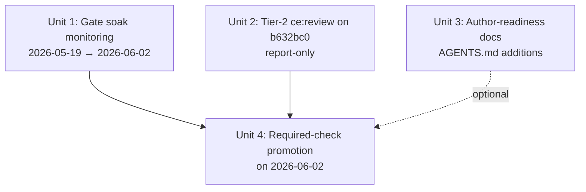

# feat: Plan Claims Gate — soak, Tier-2 review, required-check promotion

## Overview

PR #98 shipped the Plan-doc claims contract + merge-time HEAD-drift gate (merged `b632bc0` 2026-05-19 10:45 UTC). It landed as a **non-required** check by design, with a 14-day clean-soak window before promotion to a required status check on **2026-06-02**.

This plan tracks the four operational follow-ups that close the loop on that ship:

1. **Gate soak monitoring** — verify the gate runs cleanly for 14 days
2. **Tier-2 `/ce:review` report-only audit** on `b632bc0` — capture deferred findings now that the API rate limit reset
3. **Author-readiness docs** — make the 2026-05-20 cutoff visible to plan authors and codify the YAML-SHA-quoting convention
4. **Required-check promotion** on 2026-06-02 — flip branch protection contexts

A fifth concern — the four "sharp edges" documented in `9386568` — is captured as an appendix register, not an action item. They are explicitly conditional ("if you ever revisit refactoring") and require a real trigger signal before any work happens.

## Problem Frame

A merge-time gate that affects every PR has high blast radius. Promoting it to required-check too quickly risks turning every plan-doc PR into a CI outage; promoting too slowly leaves the contract unenforced and authors free to drift. PR #98 chose a fixed 14-day soak with explicit promotion date as the trade-off (D9).

Additional residual concerns from the ship:

- **API rate limit hit during ce:review autofix mode** in PR #98 forced a fall back to inline self-review. Only one P2 was applied (`9386568`). A clean Tier-2 report-only pass is owed.
- **The 2026-05-20 cutoff is now imminent (tomorrow).** Plan authors who don't know about the contract will trip the (still-non-required) gate and get yellow checks. After 2026-06-02 the same trip becomes a hard block.
- **The YAML SHA quoting trap** (PR #98 commit `3444cb6` — Python 3.11 CI flake when an all-digit short SHA gets int-coerced by PyYAML) is captured in private auto-memory but not in `AGENTS.md`. The next test fixture author has no signal.

## Requirements Trace

- R1 — Soak window 2026-05-19 → 2026-06-02 produces zero gate-implementation bugs that would cause false-positive PR blocks
- R2 — Tier-2 review on `b632bc0` produces a structured findings report; any P0/P1 findings landed before promotion
- R3 — Plan authors on or after 2026-05-20 know to include a `claims:` block (or `claims: {}` opt-out)
- R4 — YAML SHA quoting is codified as a repo convention in `AGENTS.md`, not just operator memory
- R5 — On 2026-06-02, branch protection `required_status_checks.contexts` includes the Plan Claims Gate check
- R6 — The four PR #98 "sharp edges" are recorded with explicit trigger conditions so they don't get re-discovered as new issues

## Scope Boundaries

- **Not** refactoring `cli/plan_check.py` proactively. The 4 sharp edges are recorded only; each has a trigger condition.
- **Not** writing a CI lint for YAML SHA quoting. Per scope-guardian principle, a one-line `AGENTS.md` convention plus the `feedback_pyyaml_int_coerces_all_digit_sha` auto-memory entry is sufficient signal. A lint rule for one historical bug is premature.
- **Not** retroactively adding `claims:` blocks to grandfathered (`< 2026-05-20`) plans. They are silently skipped by design (D15).
- **Not** changing the gate's exit-code contract or schema. Any schema bump goes through `SCHEMA_VERSION` (D14), not this plan.
- **Not** extending the soak window if it sees few plan-doc PRs. The 14-day fixed window was the trade-off chosen at ship; only a *real* false positive justifies pause.
- **Not** removing the radar workflow even after promotion. Radar covers *all* post-cutoff plans (already-merged drift), while the gate covers only PRs touching plan-docs (D19). They are complementary, not redundant.

## Context & Research

### Relevant Code and Patterns

- `.github/workflows/plan-claims-gate.yml` — per-PR gate; check name resolves at run time to `Plan Claims Gate / check` (workflow `name` / job `name`)
- `.github/workflows/plan-claims-radar.yml` — 09:00 UTC daily cron + `workflow_dispatch`; files a single rolling open issue
- `src/backlink_publisher/cli/plan_check.py` — schema + git resolution + CLI dispatch in one file (D1 flat-file precedent mirroring `cli/footprint.py`)
- `AGENTS.md` lines 139–202 — canonical operator doc for the contract; line 192 records the promotion deadline
- `monolith_budget.toml` — `cli/plan_check.py` pinned at ceiling 620 SLOC
- Branch-protection precedent: `phase0-seal/verify-head` (app_id 15368, contexts list) was promoted the same way after its own soak window

### Institutional Learnings

- `feedback_pyyaml_int_coerces_all_digit_sha` — bare YAML scalars that are all digits become Python `int`; ~5% of 7-char hex SHAs are all-digit. Single-quote SHA interpolations in test fixtures
- `feedback_fetch_head_in_common_gitdir` — linked worktrees keep `FETCH_HEAD` in `git rev-parse --git-common-dir`, not `.git/FETCH_HEAD`. Already addressed in `plan_check.py` via `--git-common-dir` resolution at ship
- `feedback_git_cat_file_exits_128_not_1` — git exits 128 (not 1) for missing paths; discriminate via stderr substring with `LC_ALL=C LANG=C` locale pinning. Already addressed in `plan_check.py`
- `feedback_gh_merge_delete_branch_egg_info_noise` — `gh pr merge --squash --delete-branch` can print alarming-looking warnings from a post-merge worktree switch; the merge itself succeeded. Verify state via `gh pr view <N> --json state`, not the stderr noise
- `feedback_brainstorm_review_defers_to_plan_grounding` — when promoting (Unit 4), don't accept review-time "simplification" suggestions that conflict with PR #98 plan-time grounding (`--json` flag, exit-code split 0/1/2/7/8, always-fetch posture). Those were validated decisions, not accidents.
- `reference_phase0_remote_routines` — precedent for cron-scheduled operational tasks; relevant for the 2026-06-02 promotion if we want a remote-trigger reminder

### External References

None required. This work is purely operational follow-up on already-shipped infrastructure.

## Key Technical Decisions

- **Promotion is a single deterministic operation, not a workflow change.** Unit 4 patches branch protection via `gh api`; no edits to `plan-claims-gate.yml`. The gate already works — promotion only flips the "required" bit.
  - Rationale: separates infrastructure (the gate) from policy (whether it blocks). Reversal is one `gh api` call.

- **Resolve the exact check context name from a live run at promotion time, not by guessing.** The check_run name GitHub uses depends on the workflow `name:` field and job `name:` field together (`Plan Claims Gate / check`). Take it literally from the most recent successful run.
  - Rationale: `phase0-seal/verify-head` was set this way and works. Format guessing has burned us before.

- **Tier-2 review output goes to a private memory artifact first**, then gets promoted only if anything P1+ surfaces.
  - Rationale: `/ce:review mode:report-only` produces structured findings; most are P2/P3 deferrals already pre-classified as such by the commit author. Public commit of a clean report is noise. If P0/P1 lands, the *fix* commit references the finding.

- **Author-readiness lives in `AGENTS.md` "Plan-doc claims contract" section + one new convention bullet, not a new doc.** The section already exists post-PR-#98.
  - Rationale: AGENTS.md is the canonical contributor entry point. Adding a sibling doc fragments the operator surface.

- **The YAML-SHA-quoting convention is recorded under the existing test-conventions area of `AGENTS.md`, not as a pre-commit hook.**
  - Rationale: One historical bug doesn't justify a lint rule. The auto-memory already catches the pattern. Visibility in `AGENTS.md` is sufficient signal for the next fixture author.

- **Sharp edges are recorded as an appendix with explicit trigger conditions, not units.** Each is a future-conditional, not a present task.
  - Rationale: Per "do not add features beyond what the task requires"; user explicitly framed these as "if you ever revisit refactoring." Recording protects against rediscovery as bugs; promoting to units would manufacture work.

- **This plan dogfoods a real `claims:` block** even though dated `2026-05-19` (grandfathered, skipped by `plan-check`).
  - Rationale: muscle memory for the next plan author. Costs nothing; demonstrates the schema. The grandfather check exits 0 before validation, so no risk.

## Open Questions

### Resolved During Planning

- **Where should the Tier-2 review report live if findings are clean?** Resolved: stays in private auto-memory as `project_pr98_tier2_review.md`. Only promote to `docs/solutions/` if a P0/P1 surfaces and the lesson is repeatable.
- **Should the soak window be extended if PR-doc traffic is low?** Resolved: no. The 14-day fixed window was D9's deliberate trade-off. Extension would be scope creep on a shipped decision.
- **Does the promotion need a brainstorm/RFC?** Resolved: no. Promotion was an explicit, dated commitment in PR #98 and AGENTS.md line 192. This plan is the operational landing.
- **Should we add `claims: {}` to the 4 already-shipped 2026-05-19 plans?** Resolved: no. They are grandfathered by date. Adding the field would suggest the cutoff is fuzzy when it's not.

### Deferred to Implementation

- **Exact check-context string at promotion time.** Will be read from a successful gate run via `gh run list --workflow=plan-claims-gate.yml --branch=main --status=success --limit=1` on the day of promotion. Don't pre-bake the name into this plan.
- **Whether soak window contains enough `have_plans=true` runs to be meaningful.** Will be assessed at end of soak. If fewer than ~3, document the data shortage explicitly in the promotion commit message rather than retroactively extending the window.
- **Whether any Tier-2 finding is severe enough to delay the 2026-06-02 promotion.** Decision lives in Unit 4 conditional check, based on Unit 2 output.

## Implementation Units

### Dependency graph



Unit 3 is operationally independent of Unit 4 but should land before 2026-05-20 (tomorrow) so author trips during soak are minimized.

---

- [ ] **Unit 1: Gate soak monitoring (2026-05-19 → 2026-06-02)**

**Goal:** Verify the gate produces zero false-positive PR blocks during the 14-day soak window.

**Requirements:** R1

**Dependencies:** None — starts immediately on plan acceptance.

**Files:**
- No code changes. Operational monitoring only.
- Output: a single soak-log entry per gate failure, recorded in private auto-memory as `project_pr98_gate_soak.md` (rolling log)

**Approach:**
- At end of each working day, query `gh run list --workflow=plan-claims-gate.yml --status=failure --created='>=2026-05-19'`
- For each failure, classify:
  - **True positive** — the touched plan-doc actually had drift; gate did its job
  - **False positive** — plan-doc was correct; gate misfired (bug)
  - **Environment** — checkout, install, or transient (re-run resolves it)
- Any false positive halts promotion until root-caused and fixed
- Also spot-check radar issue filings: `gh issue list --search "plan-claims drift radar"`

**Patterns to follow:**
- `reference_phase0_remote_routines` — cadence precedent. The Phase 0 soak used similar daily snapshots.

**Test scenarios:**
- Test expectation: none — this is operational monitoring, not a code unit. Verification is the soak-log content itself.

**Verification:**
- Soak-log file exists with one dated entry per gate failure across 14 days
- Zero entries classified as "false positive" by 2026-06-01
- If false positive count > 0, Unit 4 does not execute until fixed

---

- [ ] **Unit 2: Tier-2 `/ce:review` report-only audit on `b632bc0`**

**Goal:** Run the deferred Tier-2 review pass that PR #98 owed but couldn't complete due to subagent rate limit, capturing structured findings now that the limit reset.

**Requirements:** R2

**Dependencies:** None.

**Files:**
- Target commit: `b632bc0` (PR #98 squash-merge commit; diff = `b632bc0^..b632bc0`)
- Output: private auto-memory entry `project_pr98_tier2_review.md` (findings table by severity)
- If a P0/P1 lands: follow-up PR per finding, referenced from the auto-memory entry

**Approach:**
- Invoke `/ce:review` with `mode:report-only` against commit `b632bc0`
- The review covers the whole shipped diff: `cli/plan_check.py`, both workflows, AGENTS.md, monolith_budget.toml
- Carry forward the four already-known P2/P3 findings from commit `9386568` as already-triaged — flag duplicate raises so the reviewer doesn't re-discover them
- Classify each NEW finding as P0 (must fix before promotion) / P1 (must fix this week) / P2 (defer with trigger) / P3 (information only)
- Specifically watch for: gate false-positive vectors not yet seen in soak; radar idempotency edge cases; FETCH_HEAD freshness skew; subprocess-encoding/locale issues on non-Linux runners

**Execution note:** This unit is invoked via the `/ce:review` skill; do not re-implement review logic here.

**Patterns to follow:**
- PR #98 commit `9386568` shows the format for "already-triaged sharp edges" — mirror that classification when summarizing the new findings

**Test scenarios:**
- Test expectation: none — this is a review pass producing a findings document, not code. Any code that ships from a finding goes through its own review/test path.

**Verification:**
- A findings document exists with each item classified by severity
- Each P0/P1 has a linked fix PR (or explicit "won't fix — rationale" entry)
- The known four sharp edges are referenced as already-triaged, not duplicated

---

- [ ] **Unit 3: Author-readiness — AGENTS.md additions for cutoff visibility + YAML SHA quoting**

**Goal:** Two single-paragraph additions to `AGENTS.md` so authors discover the claims-block requirement and the YAML SHA quoting convention without needing memory access.

**Requirements:** R3, R4

**Dependencies:** None. Should land **before 2026-05-20** to minimize author trips during the non-required soak window.

**Files:**
- Modify: `AGENTS.md`
  - Add a one-line callout near the top of the "Plan-doc claims contract" section noting **the 2026-05-20 cutoff is in effect — plans dated on or after this MUST carry `claims:` (or explicit `claims: {}`)**
  - Add a new bullet under whichever section currently lists test-fixture conventions (locate via `grep -n "test fixture\|fixtures\|YAML\|pytest"`); content: **"YAML test fixtures: always single-quote SHA values. PyYAML int-coerces unquoted all-digit scalars; ~5% of 7-char short SHAs are all-digit and silently break tests on Python 3.11+. Precedent: PR #98 commit `3444cb6`."**

**Approach:**
- Read the current `AGENTS.md` Plan-doc-claims-contract section to find the most natural insertion point for the cutoff callout
- The YAML-SHA convention is a new bullet, not a new section
- Keep both additions concise — total diff under ~10 lines
- Commit message convention: `docs(agents): cutoff visibility + YAML SHA quoting convention`

**Execution note:** Pure docs change. No code, no tests, no schema. Confirm there is no in-progress `AGENTS.md` edit on a sibling worktree before committing (per `feedback_external_agent_concurrent_edits_in_shared_worktree`).

**Patterns to follow:**
- `AGENTS.md` lines 139–202 (existing claims-contract section) — match prose style, use the same code-fence + table conventions
- Existing AGENTS.md "Known traps" or convention lists for the SHA-quoting bullet placement

**Test scenarios:**
- Test expectation: none — doc-only change. The convention is operator-facing, not code-validated.

**Verification:**
- `grep -n "2026-05-20" AGENTS.md` returns the new cutoff callout
- `grep -n "single-quote SHA\|PyYAML.*int" AGENTS.md` returns the new convention bullet
- The diff lands before 2026-05-20 00:00 UTC

---

- [ ] **Unit 4: Required-check promotion on 2026-06-02**

**Goal:** Add `Plan Claims Gate / check` to `branch protection required_status_checks.contexts` on `main`, after confirming clean soak and no blocking Tier-2 findings.

**Requirements:** R5

**Dependencies:** Unit 1 (clean soak) **and** Unit 2 (no P0/P1 findings, or those fixes have landed).

**Files:**
- No source code changes
- Modify: `AGENTS.md` line 192 — change "Non-required at ship; promote to required after 14 days clean (D9)" to record the actual promotion date once flipped
- Optional: open a `docs/operations/` note documenting the promotion (only if any deviation from the original D9 trade-off occurred; otherwise the AGENTS.md edit is the sole record)

**Approach:**
1. **Gate preconditions:** re-verify Unit 1 soak-log = zero false positives; re-verify Unit 2 has no unfixed P0/P1
2. **Resolve the actual check context name:**
   - `gh run list --workflow=plan-claims-gate.yml --branch=main --status=success --limit=1 --json databaseId`
   - For that run id: `gh api repos/:owner/:repo/actions/runs/<id>/jobs --jq '.jobs[].name'`
   - The exact string GitHub uses for the check context is what goes into `contexts:` (precedent: `phase0-seal/verify-head`)
3. **Read current protection:** `gh api repos/:owner/:repo/branches/main/protection/required_status_checks`
4. **PATCH protection** with both contexts:
   ```
   gh api -X PATCH repos/:owner/:repo/branches/main/protection/required_status_checks \
     -f contexts[]="phase0-seal/verify-head" \
     -f contexts[]="<resolved-plan-claims-gate-context>"
   ```
5. **Verify the PATCH applied:** re-read `required_status_checks.contexts` and confirm both names present
6. **Smoke-test on a real PR:** the next open PR (or a dedicated empty-noop PR) should show the new check as required; confirm `gh pr view <N> --json statusCheckRollup` lists it
7. **Update `AGENTS.md` line 192** to record the actual promotion date and the resolved context name
8. **Update private memory** entry `project_plan_claims_gate_shipped.md` to reflect the new required state

**Execution note:** This is a branch-protection write — a hard-to-reverse action on shared infrastructure. Confirm with operator before step 4. Per `careful` mode default for prod changes: read the current state, propose the diff, then wait for explicit approval before issuing the PATCH.

**Patterns to follow:**
- The Phase 0 promotion (also a `gh api -X PATCH ...required_status_checks` operation) is the in-repo precedent — same shape

**Test scenarios:**
- *Integration:* After PATCH, `gh api repos/:owner/:repo/branches/main/protection/required_status_checks --jq '.contexts'` returns a list containing both `phase0-seal/verify-head` and the resolved gate context (specific contents, observable result)
- *Integration:* Opening a new PR with no plan-doc changes — the gate runs as a no-op (`have_plans=false`), check passes, PR is mergeable (no block from the new requirement when the gate is a no-op)
- *Integration:* Opening a noop test PR that touches a post-cutoff plan-doc with a broken `claims:` block — the gate fails, PR is blocked from merge until fixed (confirms the requirement bites correctly)

**Verification:**
- `gh api repos/:owner/:repo/branches/main/protection/required_status_checks --jq '.contexts | length'` returns 2 (or higher if other contexts existed)
- The next plan-doc PR after promotion correctly blocks on broken claims
- `AGENTS.md` reflects the promotion date

## High-Level Technical Design

> *This illustrates the intended approach and is directional guidance for review, not implementation specification. The implementing agent should treat it as context, not code to reproduce.*

The promotion is a single transactional branch-protection edit, gated by two preconditions:

```
                   ┌──────────────────────────────────────┐
                   │ Precondition gate (Unit 1 + Unit 2)  │
                   │                                      │
soak-log ─────────▶│  zero false-positives in 14 days?    │
ce:review report ─▶│  no unfixed P0/P1 findings?          │
                   │                                      │
                   └────────────────┬─────────────────────┘
                                    │ both = yes
                                    ▼
                   ┌──────────────────────────────────────┐
                   │ Resolve check-context name (D9)      │
                   │ gh run list + gh api .../jobs        │
                   └────────────────┬─────────────────────┘
                                    │
                                    ▼
                   ┌──────────────────────────────────────┐
                   │ gh api -X PATCH required_status...   │
                   │   contexts: [phase0-seal/verify-head │
                   │              <plan-claims-gate-ctx>] │
                   └────────────────┬─────────────────────┘
                                    │
                                    ▼
                   ┌──────────────────────────────────────┐
                   │ Verify + smoke + docs update         │
                   │ (read-back, noop PR, AGENTS.md L192) │
                   └──────────────────────────────────────┘
```

If either precondition fails, the promotion is deferred — the gate stays non-required and operationally identical. No code is touched in Unit 4; reversibility is one PATCH away.

## System-Wide Impact

- **Interaction graph:** After Unit 4, every PR with `base: main` runs the gate as a required check. PRs with no plan-doc changes pass as no-ops (`have_plans=false`); PRs touching plan-docs must satisfy schema + path-reachability + SHA-reachability against `origin/main`.
- **Error propagation:** Gate failure → PR cannot merge until the plan-doc is fixed (drift) or the underlying file/SHA exists (post-rebase). Authors see the `plan-check` exit-code message directly in the GHA run.
- **State lifecycle risks:** None for Unit 4 itself (the PATCH is atomic and reversible). The gate's existing risks (FETCH_HEAD staleness in CI, locale skew) are already mitigated in `plan_check.py`.
- **API surface parity:** None — the gate's CLI surface (`plan-check --json`, exit codes 0/1/2/7/8) is unchanged. Only branch protection changes.
- **Integration coverage:** Unit 4 verification PR is the integration test for the promoted requirement. Unit 1's daily soak monitoring exercises the gate against real PR traffic, not synthetic input.
- **Unchanged invariants:** The plan-claims schema (`SCHEMA_VERSION = 1`), the grandfather cutoff (`< 2026-05-20`), the exit-code contract, the radar's idempotent issue-rolling behavior, and `phase0-seal/verify-head` as an existing required check — all explicitly unchanged.

## Risks & Dependencies

| Risk | Mitigation |
|------|------------|
| Soak window sees fewer than ~3 `have_plans=true` runs — low statistical confidence | Unit 1 surfaces the count; if shortfall, document explicitly in the promotion commit rather than retroactively extending. Honors D9 trade-off. |
| Tier-2 review surfaces a P0 just before 2026-06-02 | Unit 4 step 1 enforces precondition. Promotion defers; gate stays non-required and operationally unchanged. Reversal risk: zero. |
| Resolved check-context name doesn't match what GitHub actually emits for the run | Unit 4 step 2 reads the name from a successful run via `gh api .../jobs`, not from the workflow file. Matches the `phase0-seal/verify-head` precedent. |
| Operator-opened issue with prefix `plan-claims drift radar:` could be matched by radar's gh issue search and edited | Already-documented sharp edge (a). Mitigation if it bites: filter search by `author:github-actions[bot]`. No fix needed unless signal fires. |
| Authors land plan-docs on 2026-05-20 without `claims:` blocks (gate non-required) | Unit 3 surfaces the cutoff in AGENTS.md before tomorrow. Yellow check is acceptable signal; doesn't block merge during soak. |
| `gh pr merge --delete-branch` egg-info stderr noise misclassified as merge failure during promotion-period PRs | Already-documented; verify via `gh pr view <N> --json state`. Operational hygiene only. |

## Documentation / Operational Notes

- **Unit 3 must land before 2026-05-20 00:00 UTC.** That window is ~6h from now (2026-05-19 18:31 +08:00 / 10:31 UTC). If Unit 3 misses the window, the cutoff still bites; the only consequence is the first 2026-05-20 PR author may not know about the contract.
- **Unit 4 timing:** schedule the PATCH for 2026-06-02 during US working hours (~14:00–16:00 UTC) so any unexpected breakage doesn't paint over an APAC operator's shift.
- **No rollback runbook needed.** Unit 4 reversal is a single PATCH removing the gate context from `contexts:`. The gate workflow continues running as informational.
- **Memory updates:** after Unit 4 completes, update `project_plan_claims_gate_shipped.md` with the promotion date, the resolved check-context name, and the soak result.

## Sources & References

- **Shipped plan:** `docs/plans/2026-05-19-009-feat-plan-claims-and-head-drift-gate-plan.md` (in `origin/main`)
- **Merge commit:** `b632bc0` (PR #98)
- **Last commit (sharp edges):** `9386568`
- **YAML SHA quoting fix:** `3444cb6`
- **Operator doc:** `AGENTS.md` "Plan-doc claims contract" section (lines 139–202 on `origin/main`)
- **Monolith budget entry:** `monolith_budget.toml` → `[files."src/backlink_publisher/cli/plan_check.py"]` (ceiling 620)
- **Auto-memory:** `project_plan_claims_gate_shipped.md`, `feedback_pyyaml_int_coerces_all_digit_sha`, `feedback_fetch_head_in_common_gitdir`, `feedback_git_cat_file_exits_128_not_1`, `feedback_gh_merge_delete_branch_egg_info_noise`, `feedback_brainstorm_review_defers_to_plan_grounding`, `reference_plan_check_cli`, `reference_phase0_remote_routines`

## Appendix: Sharp-Edges Register (no action required)

These four items were documented in PR #98 commit `9386568` as P2/P3 deferrals. Each has an explicit trigger condition; do **not** open a refactor PR unless the trigger fires.

| # | Edge | Trigger to act |
|---|---|---|
| 1 | `gh issue search` in `plan-claims-radar` may match operator-opened issues sharing the prefix `plan-claims drift radar:` and incorrectly edit them | A real operator-opened issue is edited by the radar. Mitigation pre-baked: add `author:github-actions[bot]` to the gh issue search query. ~5 minute fix when needed. |
| 2 | `_last_git_error` module-level state in `plan_check.py` should become a structured logger | The CLI grows a second consumer or a third subprocess wrapper. Until then, module-level state is fine. |
| 3 | `Optional[str]` vs `X \| None` style mixing in `plan_check.py` (Python 3.11+ allows both) | A formatter or style sweep happens repo-wide. Don't isolate-fix `plan_check.py` alone. |
| 4 | `plan-claims-gate.yml` `$touched` is unquoted in the `for` loop — safe today given the strict `YYYY-MM-DD-NNN-...md` naming convention, but brittle if the convention slips | An author proposes a plan filename with spaces or shell-metacharacters. Until then, the naming convention enforced by R11b/D17 protects this. |

The register exists so these don't get re-raised as bugs by future reviewers. Each is already-triaged tech debt with an explicit deferral rationale.
