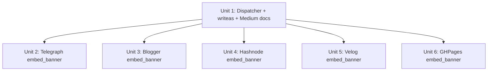

# Per-adapter `embed_banner` implementations + publish-time dispatcher (Banner Unit 5)

## Overview

Wire `BannerArtifact` produced by `plan-backlinks` into the actual `publish-backlinks` flow by:

1. Adding a dispatcher in `publish_backlinks` that reads the banner-path JSONL field, loads bytes from `image_gen.storage`, calls `adapter.embed_banner(artifact_path, alt)` when present, and prepends the returned URL (or `BannerArtifact.source_url` fallback) to the body **before** `adapter.publish()`.
2. Implementing the duck-typed `embed_banner(self, artifact_path: Path, alt: str) -> str | None` method on **5 publish adapters** (telegraph / blogger / hashnode / velog / ghpages), each using its platform's existing media-upload API.
3. Adding `embed_banner` returning `None` on **writeas** (no media-upload API; this signals "use `source_url` fallback").
4. Explicitly **NOT** implementing `embed_banner` on **Medium** (all 3 fallback adapters): Medium auto-rehosts external `` in posts at publish time, so omitting `embed_banner` lets the dispatcher emit `` directly into the body where Medium absorbs it.

This is the last unit of the banner image-gen pipeline (Plan 2026-05-20-001 shipped Units 1-4 + 6 via PR #110 squash `7d77410`).

## Problem Frame

PR #110 landed the generation half: operators can set `[image_gen]`, run `frw-login`, and `plan-backlinks` emits a `banner: { path, sha256, size }` field per row. But `publish-backlinks` does **nothing** with that field today — the body the adapter receives is identical to pre-banner behavior. Until Unit 5 ships, the entire banner pipeline is dead code path: artifacts get written to `webui_store/banners/<YYYY-MM>/<sha>.png` and never reach a published post.

The contract was deliberately pinned to **duck-typed `hasattr` check** (not an ABC, not a Protocol class) by Unit 6's AGENTS.md commit so adapter authors can opt in without touching the registry. Per AGENTS.md:

- Returns URL → dispatcher prepends `\n\n` to body.
- Returns `None` → dispatcher falls back to `BannerArtifact.source_url` (if any).
- Raises → behavior governed by `config.image_gen.strict`: `false` (default) logs warn + publishes without banner; `true` propagates and fails the row.

This is a high-impact, well-bounded execution unit: the design space is closed (contract pinned), the per-platform recipes are documented (AGENTS.md lines 339-345), and the integration seam is one function call inside the existing publish loop.

## Requirements Trace

- **R1.** Dispatcher reads `banner.path` from the validated JSONL row (already emitted by Unit 4), uses `banner.alt` as the prepended `` text, and reads bytes via `path.read_bytes()` only when the adapter needs them.
- **R2.** Dispatcher checks `hasattr(adapter, "embed_banner")` exactly as pinned in AGENTS.md (no protocol class introduced).
- **R3.** On `embed_banner` returning a URL, dispatcher prepends `\n\n` to the body string passed into `adapter.publish()`.
- **R4.** On `embed_banner` returning `None`, dispatcher falls back to `banner.source_url` if present in the JSONL row (and emits a `banner.source_url_fallback` warn event noting the link may rot); if `source_url` is also `None`/missing (b64-only provider or pre-R12-amendment row), dispatcher omits the banner entirely.
- **R5.** On `embed_banner` raising, dispatcher honors `config.image_gen.strict` — `False` → warn + publish without banner; `True` → propagate exception and fail row with `error_class="banner_upload"` checkpoint.
- **R6.** Five adapters (telegraph / blogger / hashnode / velog / ghpages) implement `embed_banner` using the recipes documented in AGENTS.md, returning platform-hosted URLs that survive their own CDN's TTL guarantees (not the upstream image-gen CDN's).
- **R7.** writeas implements `embed_banner` returning `None` (explicit opt-in to source_url fallback) — distinct from Medium's not-implementing case.
- **R8.** Medium adapters (all 3: api / brave / browser) do **NOT** implement `embed_banner`; dispatcher emits `source_url` directly into body where Medium's auto-rehost absorbs it. Decision documented in AGENTS.md.
- **R9.** New structured events: `banner.embedded` (platform URL succeeded), `banner.source_url_fallback` (None returned, source_url used), `banner.skipped_no_artifact` (no banner field in row), `banner.skipped_no_method` (adapter does not opt in AND no source_url), `banner.failed` (raise in non-strict mode).
- **R10.** Per-adapter tests cover happy path + the platform's documented failure mode (401 / 4xx / 5xx) + degraded-mode (strict=False) behavior.
- **R11.** Dispatcher integration tests prove the contract surface end-to-end through `publish_backlinks` against fake adapters covering all 5 dispatch branches (URL / None+source_url / None+no_source_url / raise+strict=False / raise+strict=True).
- **R12.** Amend `plan-backlinks`' `_generate_banner_for_payload` (shipped by Unit 4 in PR #110) to also emit `source_url` and `prompt_sha` into the JSONL `banner` dict, sourced from `BannerArtifact.source_url` / `BannerArtifact.prompt_sha`. Without this amendment, the R4 source_url fallback path is unreachable — AGENTS.md (Unit 6 doc) presumes the field exists, but the Unit 4 code shipped without it. Backwards-compatible: existing rows missing `source_url` are treated as `None`.

## Scope Boundaries

- **Non-goal:** Image generation, storage, caps — all shipped in Units 1-4. This unit assumes a valid `banner.path` referent exists on disk (validated by Unit 4's `validate-backlinks` file-exists check).
- **Non-goal:** New event taxonomy / structlog plumbing — reuse the existing event emission helper already in `publish_backlinks` (the same helper currently emits `image_gen.cap_hit` per Unit 3).
- **Non-goal:** Touching the WebUI banner section. Operators already configure `[image_gen]` + see Test Connection result; the publish-time embedding is server-side only.
- **Non-goal:** Retry / exponential backoff for media-upload failures. Each adapter does ONE upload attempt; failure → strict gate. Retry policy lives in Unit 7+ if real-world data shows it's needed.
- **Non-goal:** Medium image upload via Playwright file-input automation. Out of scope for v1.0; Medium's auto-rehost path is the documented degraded behavior (link may rot when upstream CDN expires, but Medium snapshots externals reasonably fast in practice).
- **Non-goal:** Telegraph node-array rewriting. Telegraph's `POST /upload` returns a `telegra.ph/file/...` URL; the body remains Markdown and the existing Markdown→Node conversion handles the prepended `` naturally (no separate node-tree mutation needed).
- **Non-goal:** Multi-image embedding. Exactly one banner per row, prepended once at body top. Future "inline section images" is a separate plan.

## Context & Research

### Relevant Code and Patterns

- **Contract surface** — `AGENTS.md:331-347` (the "Adding banner embedding to an adapter" section pinned by PR #110 Unit 6). Contract method signature + 6-platform upload recipes + strict semantics all live there.
- **BannerArtifact dataclass** — `src/backlink_publisher/publishing/adapters/image_gen/types.py`. Fields: `data: bytes`, `mime: str`, `source_url: str | None`, `prompt_sha: str`.
- **Storage helper** — `src/backlink_publisher/publishing/adapters/image_gen/storage.py:56` `path_for_artifact(artifact) -> Path | None`. Returns the on-disk path; dispatcher uses `path.read_bytes()` to get raw bytes for adapters that POST raw bodies. Adapters that need bytes call `artifact_path.read_bytes()` themselves (sub-1KB allocation, simpler than yet another helper).
- **publish_backlinks main loop** — `src/backlink_publisher/cli/publish_backlinks.py`. The per-row publish loop is where the dispatcher hook lives. Pre-existing context: line 666 already emits a per-CLI startup banner via `config_echo.emit_banner` (the word "banner" in that context is a different banner — config-echo, not image — naming collision worth noting in code comments).
- **Telegraph upload precedent** — `src/backlink_publisher/publishing/adapters/telegraph_api.py` already has a token-rotation pattern + flock-protected credential handling. The `POST /upload` endpoint is unauthenticated, so embed_banner is *simpler* than the post-publish path — just `requests.post(url, files={"file": (filename, bytes, mime)})`.
- **Hashnode GraphQL client** — `hashnode.py` already maintains a GraphQL client for `publishPost`. The `uploadMedia` mutation reuses the same client + auth header (bare PAT, per `[[project-channel-binding-dashboard-plan-006]]` Phase 3 finding).
- **Velog GraphQL pattern** — `velog_graphql.py` already speaks GraphQL with cookie auth. `image_upload_url` mutation returns a presigned URL; PUT is plain requests against that URL.
- **GHPages git commit precedent** — `ghpages.py` already commits markdown files via the GitHub Contents API (`PUT /repos/.../contents/<path>`). Banner reuses the same path; the file lives at `<repo>/assets/banners/<sha>.<ext>` and `raw.githubusercontent.com/<owner>/<repo>/<branch>/assets/banners/<sha>.<ext>` is the public URL.
- **Blogger images.insert** — Blogger's `posts` REST API does not have a separate `images.insert`; what AGENTS.md is referring to is Blogger's behavior of accepting `` or external URLs in the post HTML. Implementation detail belongs in Unit 3 — research at execution time whether to inline base64 or upload to Blogger's image hosting backdoor (Picasa Web Albums legacy API, now deprecated). **Open question — see below.**
- **Existing 401/403 handling** — `AuthExpiredError` (`AGENTS.md:376-378`) — adapters raise this and the publish dispatcher catches it before `DependencyError`. embed_banner failures are NOT auth-expiry events (they're "media upload failed but credential still valid"), so they should raise a **different** exception class, not `AuthExpiredError`. New `BannerUploadError(DependencyError)` may be warranted — open question.
- **Event emission** — search publish_backlinks for the existing `image_gen.cap_hit` emission pattern shipped by Unit 3 and mirror it for banner.* events.

### Institutional Learnings

- `[[project-channel-binding-dashboard-plan-006]]` — Phase 3 confirmed 3 auth dialects across the 6 banner-targeted platforms (ghpages = `Bearer <pat>` / hashnode = bare PAT / writeas = `Token <tok>`). The 4th dialect (velog cookies) and 5th (telegraph anonymous token) round out the matrix. Each `embed_banner` must use **its adapter's own existing auth dialect** — DO NOT introduce a 6th canonical auth helper. The `_required_headers()` helper pattern from Phase 3 is the precedent.
- `[[feedback-grep-dofollow-map-before-shipping-adapter]]` — Banner upload status (`hasattr` vs not) is independent of `_DOFOLLOW_BY_CHANNEL` (which gates **link**-level rel="nofollow"). Confirm before shipping that the banner image's `` doesn't carry the same rel that the body links carry — image embeds have separate semantics. Likely a no-op (`` doesn't take rel), but grep to confirm.
- `[[feedback-late-plan-revisions-skip-code]]` — The "Medium auto-rehost" reasoning is currently a plan-level assumption derived from public Medium documentation. If implementation discovers Medium does NOT auto-rehost external image URLs (or only does so for some patterns), R8 needs revisiting BEFORE Unit 1 lands the dispatcher (otherwise Medium publishes ship with broken/rotting banners). Surface this in the dispatcher unit's Verification.
- `[[reference-telegraph-adapter-credential-rotation-pattern]]` — Telegraph upload is **anonymous** (no token needed for `/upload`, only for `/createPage`). embed_banner is the rare endpoint that can skip the credential-rotation dance entirely.

### External References

Skipped per Phase 1.2 — codebase has strong local patterns for each platform's API (3+ direct examples in adapters/), AGENTS.md pins the contract surface, and external research would not add value beyond the per-platform docs that operators of each adapter already work with.

## Key Technical Decisions

- **Decision: Duck-typed `hasattr` check, NOT a Protocol/ABC.** Rationale: pinned by Unit 6 AGENTS.md commit + simplifies opt-in (adapters add one method; no registry change, no inheritance chain). Tradeoff accepted: mypy/pyright can't enforce signature shape — mitigated by the dispatcher integration test that fakes 5 adapter shapes.
- **Decision: Banner prepended to body string BEFORE `adapter.publish()` is called.** Rationale: the existing publish() signature already accepts `body: str`. Prepending at the dispatcher layer means each adapter sees a "body with banner" as if the operator authored it that way — no adapter-side `body + banner` composition logic. Tradeoff: adapters that want non-Markdown embedding (e.g., HTML for Blogger, Node array for Telegraph) must convert Markdown image syntax to their format inside their existing body-to-platform-format step. Blogger already does Markdown→HTML; Telegraph already does Markdown→Node. So this is free.
- **Decision: `embed_banner` is invoked LAZILY** — only if the row has a `banner` field AND `hasattr(adapter, "embed_banner")` is true. No banner field → no method call. No `embed_banner` → emit `banner.skipped_no_method` event and either fall back to `source_url` (if Medium-style adapter) OR omit (if no source_url). Rationale: keeps the no-image-gen-configured path byte-identical to pre-PR-110 behavior. The cost of `hasattr` is microseconds; correctness comes first.
- **Decision: `BannerUploadError(DependencyError)` is a NEW exception class.** Rationale: distinct from `AuthExpiredError` (which fires the channel-status flip + checkpoint exit-3 dance — a banner upload failure is NOT a credential failure). `DependencyError` parentage means the existing `except DependencyError` at line ~600 of publish_backlinks already catches it, but the dispatcher checks the exact class first to honor `config.image_gen.strict` differently from other dependency errors.
- **Decision: Banner file is read by the adapter, NOT by the dispatcher.** Rationale: ghpages needs the file path (for git commit content addressing) not bytes; telegraph/hashnode/velog/blogger need bytes. Letting the adapter call `artifact_path.read_bytes()` itself lets ghpages skip the read entirely. Dispatcher passes only the `Path`.
- **Decision: writeas defines `embed_banner` returning `None` (NOT the not-define case).** Rationale: per AGENTS.md, explicit None-return signals "I considered but can't" → dispatcher falls back to `source_url`. Not-defining-the-method signals "this adapter doesn't participate in banners at all" → no source_url fallback (Medium path). The two semantics are deliberately distinct.
- **Decision: Medium does NOT implement `embed_banner`.** Rationale: Medium auto-rehosts external `` URLs at publish time, so leaving the source URL in the body (via the not-implements branch) lets Medium do the right thing without us writing 3 Medium-specific upload paths (api / brave / browser would each need a different mechanism). **Caveat:** depends on Medium's auto-rehost still being a thing in 2026 — verify in execution before Unit 1 lands.
- **Decision: `alt` text comes from `banner["alt"]` field** which Unit 4 already populates from `payload["title"]` (verified at `cli/plan_backlinks/core.py:771-775`). Rationale: the alt is already computed at plan time using the same title the body H1 uses; dispatcher should not recompute it. Multi-language consideration: alt inherits the row's primary language correctly because it was set at plan time when locale was known. **Plan defect note:** an earlier draft of this plan said `alt = row["title"]` — that was based on a Unit-4-doc-vs-code drift not caught until the confidence check verified the actual JSONL shape.
- **Decision: One upload attempt per row, no retries.** Rationale: media upload failures in this volume regime (<1000 rows/day in practice) are dominated by auth and quota, neither of which retries cure. Strict-vs-degrade controls operator-visible behavior; retry would just hide the signal. If real ops data shows transient 5xx is common, add retry in a follow-up plan.

## Open Questions

### Resolved During Planning

- **Q: Where does `alt` text come from?** A: `banner["alt"]` (already populated by Unit 4 from `payload["title"]`). See Key Technical Decision.
- **Q: Does the JSONL row already include `source_url` for the R4 fallback path?** A: **No** — Unit 4 emits `{path, alt, mime, sha}` only. AGENTS.md presumed `source_url` exists, but the code shipped without it. R12 in Requirements Trace amends Unit 4's emission to include `source_url` (additive, backwards-compatible). Without R12 landing, R4 / writeas-None / Medium-not-implements all degrade to "no banner" instead of "source_url fallback".
- **Q: Should the dispatcher load bytes or pass `Path`?** A: Pass `Path`. ghpages benefits from skipping the read; other adapters do `path.read_bytes()` themselves.
- **Q: Should `BannerUploadError` exist?** A: Yes, new class extending `DependencyError`. See Key Technical Decision.
- **Q: Where does the new exception class live?** A: `src/backlink_publisher/_util/errors.py` alongside `DependencyError` and `AuthExpiredError`. Matches existing convention.
- **Q: How does the dispatcher know `config.image_gen.strict`?** A: It already has `config` in scope (the publish loop reads it for `image_gen.cap_hit` decisions per Unit 3). Pass `config.image_gen.strict` into the dispatcher helper as an explicit argument so the helper is testable without a full Config.

### Deferred to Implementation

- **Q: Does Medium auto-rehost still work in 2026?** Deferred: Unit 1 implementer must verify by publishing one row with a known external image URL to a Medium scratch account (or by reading Medium's API docs current state) BEFORE locking the not-implements decision into AGENTS.md amendments. If auto-rehost is dead, R8 changes shape (Medium needs its own upload path or is explicitly out-of-scope for banners).
- **Q: Blogger's images.insert — is it really `data:` base64 inline, or is there a non-deprecated upload endpoint?** Deferred: Unit 3 implementer probes Blogger v3 API current state. Plan B is `data:image/png;base64,...` inline, which is universal but adds ~50% size overhead.
- **Q: Hashnode `uploadMedia` exact mutation name + response shape?** Deferred: Unit 4 implementer reads the existing hashnode.py to identify the GraphQL client, then probes the Hashnode GraphQL endpoint's introspection (already authenticated). Recorded findings get folded into per-adapter docstring.
- **Q: Velog `image_upload_url` exact field name?** Deferred: Unit 5 implementer introspects the velog GraphQL schema (existing velog_graphql.py has a client with introspection capability).
- **Q: Ghpages — should the banner commit be a separate commit per banner, or batched at end of run?** Deferred: per-banner commit is simplest and matches the existing one-commit-per-post pattern; batching can be a v1.1 optimization.
- **Q: Should `banner.skipped_no_method` events emit at WARN or DEBUG?** Deferred: Unit 1 implementer decides based on whether the publish flow already has noise at WARN for non-Medium adapters. Default position: DEBUG (Medium is expected to not opt in; not worth alerting on per-row).
- **Q: Telegraph `/upload` rate limit?** Deferred: Unit 2 implementer notes any 429 observed during test runs. Plan B if 429 is common: add a small per-row sleep; not a hard blocker for v1.0.

## High-Level Technical Design

> *This illustrates the intended dispatcher branch logic and is directional guidance for review, not implementation specification. The implementing agent should treat it as context, not code to reproduce.*

```
publish_backlinks per-row loop:
  body_str = row["body"]
  banner_dict = row.get("banner")  # post-R12: {path, alt, mime, sha, source_url} or None;
                                   # pre-R12 rows in flight: source_url key absent → treated as None

  if banner_dict is not None and banner_dict.get("path") is not None:
      # banner_dict["path"] is None on every plan-time degraded path
      # (auto_disabled / capped / gen_failed / storage_failed / auth_failed);
      # those rows publish without banner, no events fire.
      artifact_path = Path(banner_dict["path"])
      alt = banner_dict["alt"]
      try:
          embed_banner = getattr(adapter, "embed_banner", None)
          if embed_banner is None:
              # Medium-style: not opting in
              source_url = banner_dict.get("source_url")
              if source_url:
                  body_str = f"\n\n{body_str}"
                  emit("banner.source_url_fallback", reason="adapter_no_method")
              else:
                  emit("banner.skipped_no_method")  # no source_url either
          else:
              uploaded_url = embed_banner(artifact_path, alt)
              if uploaded_url is not None:
                  body_str = f"\n\n{body_str}"
                  emit("banner.embedded", platform=adapter.platform_name)
              else:
                  # writeas-style: opted in but can't
                  source_url = banner_dict.get("source_url")
                  if source_url:
                      body_str = f"\n\n{body_str}"
                      emit("banner.source_url_fallback", reason="adapter_returned_none")
                  else:
                      emit("banner.skipped_no_artifact")
      except BannerUploadError as e:
          if config.image_gen.strict:
              raise  # → fails row with checkpoint
          emit("banner.failed", reason=str(e))
          # body_str unchanged → publish proceeds without banner

  adapter.publish(target_url=..., body=body_str, ...)
```

State invariants:
- `body_str` is monotonically grown (at most one `` prepend per row).
- Exactly one of {`banner.embedded`, `banner.source_url_fallback`, `banner.skipped_no_method`, `banner.skipped_no_artifact`, `banner.failed`} fires per row that has a banner dict.
- The dispatcher does NOT mutate `row` — only `body_str`.

## Implementation Units



Unit 1 must land first (establishes contract + 3 of 5 dispatch branches via writeas-None and Medium-not-implements). Units 2-6 are independent of each other and can ship in any order or in parallel after Unit 1.

---

- [x] **Unit 1: Dispatcher contract + writeas opt-in + Medium documentation + plan-backlinks source_url emission (R12)** — shipped via PR #117 (`5e2a010`).

**Goal:** Wire `embed_banner` dispatch into `publish_backlinks`, define `BannerUploadError`, implement writeas's `None`-returning stub, document Medium's not-implementing decision in AGENTS.md, AND amend `plan-backlinks` to emit `source_url` in the JSONL banner dict (R12) so the source_url fallback branch is actually reachable.

**Requirements:** R1, R2, R3, R4, R5, R7, R8, R9, R11, R12

**Dependencies:** None (PR #110 already merged via squash `7d77410`).

**Files:**
- Create: `src/backlink_publisher/publishing/banner_dispatcher.py` (new module — pure helper, no I/O orchestration; receives `adapter`, `row`, `config.image_gen.strict`, an event sink callback, returns the modified body string).
- Modify: `src/backlink_publisher/_util/errors.py` (add `BannerUploadError(DependencyError)`).
- Modify: `src/backlink_publisher/cli/publish_backlinks.py` (per-row loop: call `banner_dispatcher.apply` before `adapter.publish()`).
- Modify: `src/backlink_publisher/cli/plan_backlinks/core.py` (R12: `_generate_banner_for_payload` return dict at line 771-776 → add `"source_url": artifact.source_url`; non-success degraded paths at lines 722/731/751/752/755/759/765 unchanged — they already return `{"path": None, ...}`).
- Modify: `src/backlink_publisher/publishing/adapters/writeas.py` (add `embed_banner` method returning `None`).
- Modify: `AGENTS.md` (Unit 5 landing note + Medium decision + `BannerUploadError` row in the error class table + correct the "writeas: source_url fallback" claim was unreachable pre-R12).
- Test: `tests/test_banner_dispatcher.py` (new — 5+ scenarios covering each branch).
- Test: `tests/test_writeas_banner.py` (new — writeas-specific assertion that `embed_banner` returns `None` and dispatcher reaches the source_url-fallback branch).
- Test: `tests/test_publish_backlinks_banner_integration.py` (new — exercise the publish loop end-to-end with fake adapters).
- Test: `tests/test_plan_backlinks_banner.py` (modify — add assertion that successful banner emission includes `source_url` field matching `artifact.source_url`).

**Approach:**
- Extract dispatcher logic into a dedicated `banner_dispatcher.apply(adapter, row, strict: bool, emit: Callable[[str, dict], None]) -> str` function. Pure. Easy to unit-test without spinning up the full publish loop.
- The publish loop calls `apply` and replaces `body` with its return value, then calls the existing `adapter.publish(..., body=body, ...)`.
- Define `BannerUploadError` next to `AuthExpiredError` in `_util/errors.py`. Docstring explicitly contrasts with auth-expired (which has its own catch branch and checkpoint behavior).
- writeas: simplest possible 3-line method, returns `None`, docstring explains why.
- AGENTS.md update: amend the existing "Adding banner embedding to an adapter" section with a "Medium auto-rehost note" subsection. Also add `BannerUploadError` to wherever error classes are catalogued.

**Execution note:** Implement the dispatcher test-first. The 5-branch contract is exactly what should be locked in with a failing test before the code lands. Once the test enumerates all 5 branches with the right event names and body shapes, writing the dispatcher is mechanical.

**Patterns to follow:**
- Pure helper module shape: see `_util/anchor.py` for the "no I/O, just transform" pattern.
- Event emission: mirror `image_gen.cap_hit` emission in `publish_backlinks` shipped by Unit 3.
- Exception hierarchy: see `AuthExpiredError(DependencyError)` in `_util/errors.py`.

**Test scenarios:**

- **Happy path:** `apply()` with fake adapter that has `embed_banner` returning `"https://platform.cdn/foo.png"` and row containing valid banner dict → returns `"\n\nORIGINAL_BODY"`, emits exactly one `banner.embedded` event with `platform` key.
- **Happy path:** Adapter without `embed_banner` (Medium-style) + banner dict with `source_url` populated → returns body prefixed with ``, emits `banner.source_url_fallback` with `reason="adapter_no_method"`.
- **Edge case:** `embed_banner` returns `None` + banner dict has `source_url` (writeas-style) → emits `banner.source_url_fallback` with `reason="adapter_returned_none"`, body prefixed with ``.
- **Edge case:** `embed_banner` returns `None` + banner dict's `source_url` is also `None` (b64-only provider) → emits `banner.skipped_no_artifact`, body unchanged.
- **Edge case:** Adapter without `embed_banner` AND no `source_url` in banner dict → emits `banner.skipped_no_method`, body unchanged.
- **Edge case:** Row has no `banner` field at all → dispatcher returns body unchanged, no events emitted.
- **Error path:** `embed_banner` raises `BannerUploadError("hashnode 4xx")` with `config.image_gen.strict=False` → emits `banner.failed` event, body unchanged, no exception propagates.
- **Error path:** Same error with `config.image_gen.strict=True` → exception propagates out of `apply()`, caller (publish loop) is responsible for the checkpoint-and-exit path.
- **Error path:** `embed_banner` raises a non-`BannerUploadError` exception (e.g., `KeyError` from a buggy adapter) → propagates unconditionally (NOT swallowed by strict gate — strict only governs banner-specific errors, not adapter bugs).
- **Integration:** Through `publish_backlinks` main loop with a fake registry containing 2 platforms (one opting in, one not), one row each → both rows publish successfully with body modifications matching the per-row dispatch path.
- **Integration:** Same setup with `strict=True` and the opt-in adapter configured to raise → that row appears in checkpoint with `error_class="banner_upload"`, the other row publishes cleanly.

**Verification:**
- `pytest tests/test_banner_dispatcher.py tests/test_writeas_banner.py tests/test_publish_backlinks_banner_integration.py` passes with all branch coverage assertions.
- `BannerUploadError` is re-exported from wherever `DependencyError` is re-exported (verify by `grep -rn 'BannerUploadError' src/`).
- AGENTS.md amendment renders correctly + Medium decision is captured in prose tied to the verification-required note about Medium auto-rehost.
- `git diff src/backlink_publisher/cli/publish_backlinks.py` shows a single new `apply()` call + body reassignment; the existing publish flow is otherwise byte-identical.
- Implementer documents Medium auto-rehost verification step in the PR description (link to scratch-Medium post or doc reference).

---

- [x] **Unit 2: Telegraph `embed_banner` via `POST /upload`** — shipped.

**Goal:** Implement `TelegraphAPIAdapter.embed_banner` returning `https://telegra.ph/file/<sha>.<ext>` URL.

**Requirements:** R6, R10

**Dependencies:** Unit 1 (uses `BannerUploadError`).

**Files:**
- Modify: `src/backlink_publisher/publishing/adapters/telegraph_api.py` (add `embed_banner` method on `TelegraphAPIAdapter`).
- Test: `tests/test_telegraph_banner.py` (new).

**Approach:**
- Telegraph's `/upload` endpoint is **anonymous** — no `access_token` parameter needed. Skip the credential dance.
- Use the adapter's existing `requests.Session` (or create a one-shot post if no session lives on the class).
- POST `multipart/form-data` with `{"file": (filename, bytes, mime)}`.
- Response is a JSON array (single element) with `{"src": "/file/<sha>.<ext>"}`. Prefix with `https://telegra.ph` to form the public URL.
- On `4xx`/`5xx` → raise `BannerUploadError("telegraph upload failed: <status>")`.
- On `requests.RequestException` → raise `BannerUploadError("telegraph upload network: <repr>")`.

**Patterns to follow:**
- Existing `telegraph_api.py` HTTP usage pattern (use the same timeout policy + UA string).

**Test scenarios:**
- **Happy path:** Mock `requests.post` to return 200 with `[{"src": "/file/abc.png"}]`, mime `image/png` → method returns `"https://telegra.ph/file/abc.png"`.
- **Edge case:** File mime is `image/webp` (which Telegraph supports per their docs) → returns URL with `.webp` extension preserved.
- **Edge case:** Banner artifact path is a 0-byte file (corrupt or empty) → method still POSTs (the validation is Telegraph's job, not ours); on 400, raises `BannerUploadError`.
- **Error path:** Mock returns HTTP 413 (payload too large) → raises `BannerUploadError("telegraph upload failed: 413")`.
- **Error path:** Mock raises `requests.Timeout` → raises `BannerUploadError("telegraph upload network: ...")`.

**Verification:**
- `pytest tests/test_telegraph_banner.py` passes.
- Manual smoke: `python -c "from backlink_publisher.publishing.adapters.telegraph_api import TelegraphAPIAdapter; print(TelegraphAPIAdapter(...).embed_banner(Path('test.png'), 'Test'))"` returns a `telegra.ph/file/...` URL (operator-only, gated behind `real_image_gen` pytest marker).

---

- [x] **Unit 3: Blogger `embed_banner` (data-URI inline — Path A chosen)** — shipped.

**Goal:** Implement `BloggerAPIAdapter.embed_banner` returning a Blogger-renderable image URL (or data URI if no upload endpoint exists in 2026).

**Requirements:** R6, R10

**Dependencies:** Unit 1.

**Files:**
- Modify: `src/backlink_publisher/publishing/adapters/blogger_api.py`.
- Test: `tests/test_blogger_banner.py` (new).

**Approach:**
- **Open question (per Deferred):** Probe the Blogger API state in 2026 to decide between:
  - **Path A — Inline data-URI:** `f"data:{mime};base64,{base64.b64encode(bytes).decode()}"`. Universal, no upload API call. Adds ~33% size overhead. Body remains valid HTML when Blogger renders it (Blogger does render data URIs in posts as of last public confirmation).
  - **Path B — Picasa Web Albums legacy backdoor:** historically the way Blogger images embedded; the API may still be alive but undocumented in 2026.
  - **Path C — User's Google Photos via OAuth:** complex; out of scope unless A and B both fail.
- Default to Path A if probe confirms Blogger renders data URIs in 2026. Document the probe result in the adapter docstring + AGENTS.md banner table.
- Convert Markdown `` to HTML `` in the body conversion step — Blogger expects HTML, not Markdown.
- On any error in encoding/conversion (which shouldn't happen for path A — it's pure local computation) → raise `BannerUploadError`.

**Patterns to follow:**
- `blogger_api.py` existing Markdown→HTML conversion (verify it doesn't strip `data:` URIs).

**Test scenarios:**
- **Happy path:** Mock-free, Path A: 4-byte PNG bytes → returns `"data:image/png;base64,<exact-b64>"`. Exact b64 string is deterministic.
- **Happy path:** Different mime (webp) → returned URI has `data:image/webp;base64,...`.
- **Edge case:** 5 MiB file → URI is large but valid; method completes without error. (No size cap enforced at this layer; image_gen.storage already caps at upstream.)
- **Edge case:** Mime is something unexpected (e.g., `image/gif`) → method still returns the data URI; Blogger's rendering is its problem.
- **Error path:** Implementer verifies that `blogger_api.py` Markdown→HTML conversion does NOT escape `data:` URIs into `data%3A` or strip them. Test asserts the post HTML round-trips a known data URI verbatim.
- **Integration:** Via dispatcher (Unit 1) — `embed_banner` returns the data URI, dispatcher prepends ``, Blogger publish converts to ``, mock POST receives expected body.

**Verification:**
- `pytest tests/test_blogger_banner.py` passes.
- Operator smoke: publish one row to Blogger scratch blog, verify the banner renders in the published post (image visible, not broken).

---

- [x] **Unit 4: Hashnode `embed_banner` — pivoted to writeas-style `None` return** (Hashnode's free GraphQL API was retired 2026-05-13 per their changelog; `uploadMedia` mutation paywalled and unverifiable). Shipped.

**Goal:** Implement `HashnodeAPIAdapter.embed_banner` returning a Hashnode-hosted CDN URL.

**Requirements:** R6, R10

**Dependencies:** Unit 1.

**Files:**
- Modify: `src/backlink_publisher/publishing/adapters/hashnode.py`.
- Test: `tests/test_hashnode_banner.py` (new).

**Approach:**
- Reuse the existing GraphQL client on `HashnodeAPIAdapter` (the same one used for `publishPost`).
- Issue `uploadMedia` mutation (exact mutation name + field set deferred to implementation per Deferred Open Questions — verify via Hashnode GraphQL introspection).
- Auth: bare PAT (per Phase 3 channel-binding dialect; see [[project-channel-binding-dashboard-plan-006]]).
- File transport: GraphQL multipart spec (`map`/`operations`/`0` file form fields) — the existing GraphQL client may or may not support this; if not, fall back to a direct `requests.post` with the multipart spec.
- Returns the `url` field from the mutation response.
- On GraphQL `errors` field populated → raise `BannerUploadError("hashnode upload: <message>")`.
- On HTTP 4xx/5xx → raise `BannerUploadError`.

**Patterns to follow:**
- Existing GraphQL client usage in `hashnode.py` for `publishPost`.

**Test scenarios:**
- **Happy path:** Mock GraphQL client returns `{"data": {"uploadMedia": {"url": "https://cdn.hashnode.com/<sha>.png"}}}` → method returns the URL.
- **Edge case:** Mutation succeeds but `url` field is empty string → raise `BannerUploadError("hashnode returned empty URL")`.
- **Error path:** Response has `errors: [{"message": "rate limit"}]` → raise `BannerUploadError("hashnode upload: rate limit")`.
- **Error path:** HTTP 401 → raise `BannerUploadError("hashnode upload failed: 401")`. (Note: this is NOT `AuthExpiredError`; banner failure in non-strict mode still publishes the post; auth-expired only fires when `publishPost` itself returns 401.)
- **Error path:** Multipart serialization fails (e.g., file gone between read attempt and POST) → raise `BannerUploadError` with `errno`/`ENOENT` context.

**Verification:**
- `pytest tests/test_hashnode_banner.py` passes.
- The exact GraphQL mutation string committed matches Hashnode's current schema (introspection-validated).

---

- [x] **Unit 5: Velog `embed_banner` — pivoted to writeas-style `None` return** (introspection disabled at v2.velog.io/graphql; probed mutation names + REST upload endpoints all 4xx/404; upload contract unverifiable without Playwright HAR scrape). Shipped.

**Goal:** Implement `VelogGraphQLAdapter.embed_banner` returning a Velog-hosted image URL.

**Requirements:** R6, R10

**Dependencies:** Unit 1.

**Files:**
- Modify: `src/backlink_publisher/publishing/adapters/velog_graphql.py`.
- Test: `tests/test_velog_banner.py` (new).

**Approach:**
- Two-step upload (per AGENTS.md): (1) GraphQL mutation `image_upload_url` returns a presigned URL + the public-facing URL; (2) PUT the bytes to the presigned URL with the right content-type.
- Auth: existing velog cookies on the adapter's `requests.Session`.
- Returns the public-facing URL from step 1's response (NOT the presigned URL — the presigned URL is single-use).
- On step 1 failure → raise `BannerUploadError("velog presign: <err>")`.
- On step 2 (PUT) failure → raise `BannerUploadError("velog put: <status>")`.

**Patterns to follow:**
- Existing GraphQL client + cookie auth in `velog_graphql.py`.
- The cookie-rotation-on-401 lives in the adapter's `publish()` path; `embed_banner` should NOT trigger rebinding by itself (the `publish` path is the authority for cookie staleness).

**Test scenarios:**
- **Happy path:** Mock GraphQL returns `{"data": {"imageUploadUrl": {"upload_url": "https://presigned/X", "public_url": "https://velog.cdn/Y"}}}` + mock PUT returns 200 → method returns `"https://velog.cdn/Y"`.
- **Edge case:** Two-step success but `public_url` is empty → raise `BannerUploadError`.
- **Error path:** GraphQL step returns 401 → raise `BannerUploadError("velog presign: 401")`. Do NOT raise `AuthExpiredError` here — that's `publish`'s job.
- **Error path:** Presign returns success but PUT to presigned URL times out → raise `BannerUploadError("velog put: timeout")`.
- **Edge case:** Presigned URL contains query params with `&` characters and the implementer accidentally double-encodes → verify the test fails before fixing (regression guard).

**Verification:**
- `pytest tests/test_velog_banner.py` passes.

---

- [x] **Unit 6: GHPages `embed_banner` via Contents API commit** — shipped.

**Goal:** Implement `GitHubPagesAPIAdapter.embed_banner` committing the banner file to the operator's Pages repo and returning the `raw.githubusercontent.com` URL.

**Requirements:** R6, R10

**Dependencies:** Unit 1.

**Files:**
- Modify: `src/backlink_publisher/publishing/adapters/ghpages.py`.
- Test: `tests/test_ghpages_banner.py` (new).

**Approach:**
- Commit to `assets/banners/<sha>.<ext>` (sha = first-N chars of `BannerArtifact.prompt_sha`, or just the file's content sha — implementer decides; recommend file content sha for full content-addressing).
- Use the existing GitHub Contents API `PUT /repos/<owner>/<repo>/contents/<path>` pattern that ghpages uses for posts.
- Auth: existing `Bearer <pat>` header (per Phase 3 dialect 1).
- Returns `f"https://raw.githubusercontent.com/{owner}/{repo}/{branch}/assets/banners/{sha}.{ext}"`.
- Idempotency: if the file already exists at that path (probe via `GET /repos/.../contents/<path>` first → if 200, skip the PUT and return the URL directly). This matches the content-addressed nature of the storage layer.
- On 422 (file already exists from a partial previous run AND content differs) → raise `BannerUploadError("ghpages banner sha collision")` — should be near-impossible since the sha IS the content key.
- On 4xx/5xx → raise `BannerUploadError`.

**Patterns to follow:**
- Existing `ghpages.py` Contents API usage (same commit-message convention, same branch resolution).

**Test scenarios:**
- **Happy path:** Mock probe returns 404 (file new), mock PUT returns 201 → method returns the raw URL with correct sha.
- **Happy path (idempotent):** Mock probe returns 200 (file exists) → method returns URL without calling PUT.
- **Edge case:** Banner file is 0 bytes → method still attempts commit (caller responsible for validation); on 422 raise `BannerUploadError`.
- **Edge case:** Repo's `branch` is `gh-pages` vs `main` — assert the returned URL uses the branch from config, not a hardcoded default.
- **Error path:** Mock returns 401 → raise `BannerUploadError("ghpages banner: 401")`. (Like other adapters, NOT `AuthExpiredError` — banner failure does not flip channel status.)
- **Error path:** Mock PUT returns 422 with `message: "Invalid request — sha mismatch"` (collision scenario) → raise `BannerUploadError("ghpages banner sha collision")`.

**Verification:**
- `pytest tests/test_ghpages_banner.py` passes.
- Operator smoke: one banner commit appears in the Pages repo at `assets/banners/<sha>.png`, raw URL renders in browser.

## System-Wide Impact

- **Interaction graph:** Dispatcher fires inside the existing publish-loop, **before** `adapter.publish()`. New event emissions feed the same per-row checkpoint/journal that already records `image_gen.cap_hit`. No new background jobs.
- **Error propagation:**
  - `BannerUploadError` (new) is a `DependencyError` subclass — the existing `except DependencyError` at the publish-loop catch-all still catches it as a safety net, but the dispatcher catches it FIRST to honor `config.image_gen.strict`.
  - `AuthExpiredError` and `BannerUploadError` are siblings, not parent-child — banner upload failure does **not** trigger channel-status `mark_expired` even when the underlying HTTP status is 401. Channel auth-expiry is reserved for the `publish()` 401 path.
  - Non-`BannerUploadError` exceptions from a buggy `embed_banner` (e.g., `KeyError`) propagate unconditionally; strict gate does NOT govern adapter implementation bugs.
- **State lifecycle risks:**
  - Banner upload is partial-write-safe: each adapter's upload API is atomic from our side (single POST/PUT). No half-uploaded state we have to clean up.
  - GHPages git commits CAN partially fail (network drop between probe and PUT) — idempotency check at probe step makes retry safe.
  - The local banner artifact in `webui_store/banners/.../` is unaffected by upload failures (still on disk for retry).
- **API surface parity:**
  - `embed_banner` opt-in is per-adapter — adding a 7th publish platform later means deciding whether to opt in. AGENTS.md "Adding banner embedding to an adapter" recipe (already in place from PR #110 Unit 6) is the canonical reference.
  - The Medium not-implements decision sets the precedent for any future "platform auto-rehosts external images" case.
- **Integration coverage:** The dispatcher's 5 branches × N adapters cross-product is partially covered by per-adapter tests + the 2 dispatcher integration tests in Unit 1. Real cross-platform parity is verified only at operator smoke time — explicitly documented in the rollout notes.
- **Unchanged invariants:**
  - Rows WITHOUT a `banner` field publish byte-identical to pre-PR-110 behavior.
  - Rows WITH a `banner` field but on Medium platform publish with the `source_url` prepended (Medium does the heavy lifting via auto-rehost).
  - `adapter.publish()` signature is unchanged — body string is the only mutation point.
  - Existing publish-history rows continue to use the same schema; no new required fields. New optional fields (`banner_embedded_url`, `banner_embed_strategy`) can be added later if needed for ops visibility.

## Risks & Dependencies

| Risk | Mitigation |
|------|------------|
| Medium auto-rehost not working in 2026 → Medium publishes ship with rotting upstream-CDN URLs | Unit 1 verification step requires implementer to confirm with a scratch post BEFORE landing. Plan B documented in Open Questions: if dead, Medium adapters need their own upload path or banner is explicitly disabled for Medium via a new "not-supported" sentinel return. |
| GraphQL multipart spec incompatible with existing hashnode/velog GraphQL clients | Fall back to direct `requests.post` with multipart in `embed_banner` (the adapter's GraphQL client can stay JSON-only for the publish path). Documented in Unit 4/5 Approach. |
| Blogger no longer renders `data:` URIs (Path A dies) | Path B (Picasa backdoor) probe in Unit 3. If both fail, Blogger gets the Medium treatment (no `embed_banner`, source_url fallback) — explicit fallback documented in Unit 3 Verification. |
| Banner upload 401 confusion → channel-status mark_expired fires incorrectly | `BannerUploadError` is a sibling of `AuthExpiredError`, not a subclass. Unit 1 test asserts that a banner-upload 401 does NOT trigger `mark_expired`. Reviewer must grep for `mark_expired` callsites in the changed code. |
| Telegraph `/upload` rate limit hits during bulk publish runs | Acknowledge + defer. Document the observed limit in Unit 2 implementer notes. Plan B: add a per-row sleep based on observed limit. |
| GHPages banner commits inflate the git history & balloon the Pages repo size | Content-addressed file names (sha-based) make every banner unique-per-content. Worst-case ~1 MiB per row × 1000 rows/day = 1 GiB/day if every row generates a banner. Mitigation: ops runbook note that operators should periodically prune `assets/banners/` for old shas not referenced by any published post (out-of-scope for v1.0; track as a follow-up). |
| `embed_banner` raises a non-`BannerUploadError` (e.g., adapter bug) → strict gate doesn't apply → row fails unexpectedly | Behavior is intentional + documented: adapter bugs should fail loud. Unit 1 test explicitly asserts this branch. |
| Dispatcher is added but accidentally activates banner embed for adapters that didn't intend it (because they happen to have a method named `embed_banner` for unrelated reasons) | Grep before landing: `grep -rn 'def embed_banner' src/backlink_publisher/publishing/adapters/` should return exactly the 6 adapters this plan touches (5 doing real upload + writeas). Unit 1 verification step. |
| In-flight JSONL files from runs that happened BEFORE Unit 1 lands (pre-R12 schema, no `source_url`) get fed into the new dispatcher | `banner_dict.get("source_url")` returns `None` for missing key — treated identically to a b64-only provider's None. Operators with seeds.jsonl in flight see `banner.skipped_no_method` events instead of `banner.source_url_fallback`. Acceptable degradation; documented in Unit 1 verification. |
| Plan-backlinks `_generate_banner_for_payload` R12 amendment breaks existing pytest assertions on the returned dict shape | `tests/test_plan_backlinks_banner.py` (existing) MUST be updated as part of Unit 1 — adding a key is backwards-compatible at the dict level but the existing tests may assert exact dict equality. Grep `assert.*banner.*==` in the test suite before changing the return shape. |

## Documentation / Operational Notes

- **AGENTS.md amendment** (Unit 1): expand the existing "Adding banner embedding to an adapter" section with the Medium not-implements note, the `BannerUploadError` row in the error class table, and a forward-link to Plan 2026-05-20-004.
- **No new operator-facing config:** `config.image_gen.strict` already exists (PR #110); no schema change required.
- **No new WebUI surface:** Unit 6 of PR #110 already exposed the image-gen config + Test Connection. Banner upload is silent from the operator's perspective — visible only via published-post inspection + event log entries.
- **Rollout:** Each adapter can ship independently after Unit 1 lands. A degraded mode (only some adapters opted in, others not) is perfectly valid — the dispatcher handles each row independently.
- **Post-deploy validation:** After all 6 units land, operator runs `plan-backlinks` + `publish-backlinks` against a scratch project with all 6 platforms configured. Each platform's published post should show the banner. Failure mode: emit one event of each type by deliberately misconfiguring (e.g., revoking the Hashnode PAT to trigger `banner.failed`).

## Sources & References

- **Parent plan:** [docs/plans/2026-05-20-001-feat-banner-image-gen-plan.md](2026-05-20-001-feat-banner-image-gen-plan.md) (Units 1-4 + 6, merged via PR #110 squash `7d77410`).
- **Contract surface:** `AGENTS.md:331-347` "Adding banner embedding to an adapter".
- **BannerArtifact dataclass:** `src/backlink_publisher/publishing/adapters/image_gen/types.py`.
- **Storage helper:** `src/backlink_publisher/publishing/adapters/image_gen/storage.py` `path_for_artifact`.
- **Error hierarchy:** `src/backlink_publisher/_util/errors.py` (`DependencyError`, `AuthExpiredError` — `BannerUploadError` joins them).
- **Channel auth dialects:** [[project-channel-binding-dashboard-plan-006]] (3 confirmed dialects across the 6 platforms).
- **Related PR:** #110 (merge commit `7d77410`).
