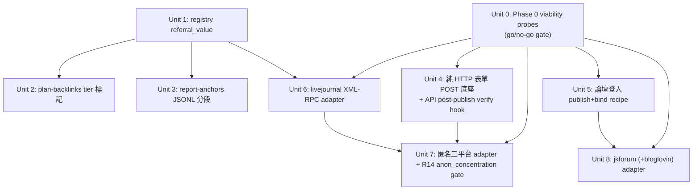

# feat: Dofollow 分層貫穿 + 6 平台擴充

## Overview

把 `dofollow` capability 信號（目前只被 WebUI 消費）貫穿進 planning（`plan-backlinks`）與 reporting（`report-anchors`），並新增 `referral_value`（high/low）子等級，形成三層分類軸。再建兩個新發布原型（純 HTTP 表單 POST 底座、論壇登入 recipe），最後按「dofollow 先行、nofollow 待證」混合策略批量接入 6 個平台（livejournal / txt.fyi / justpaste.it / teletype.in / bloglovin / jkforum）。

研究確認的關鍵事實：`plan_backlinks/core.py`、`report_anchors.py`、`footprint.py`、`anchor/profile.py` 目前 **import 任何 registry 的東西都沒有**——dofollow 信號到這四層是**全綠地接線**。`dofollow_status()` 的唯一消費者是 `webui_app/binding_status.py` 與 `helpers/contexts.py`。

## Problem Frame

工具唯一存在理由是 dofollow link equity（歷史：nofollow 平台 9 分鐘被 revert，見 origin + `docs/solutions/workflow-issues/grep-dofollow-map-before-shipping-adapter-2026-05-20.md`）。6 個新平台多數預判 nofollow，其中 txt.fyi/justpaste.it 更是匿名+無DA+無引流。操作者要全覆蓋但分層管理——故架構先讓 dofollow/referral 信號可見，平台按證據分批接入，避免為零價值平台預付成本。（see origin: docs/brainstorms/2026-05-25-dofollow-tiering-and-6-platform-expansion-requirements.md）

## Requirements Trace

- R1. registry dofollow 層級暴露成 plan/report 可消費信號；新增 `referral_value`（high/low）；真相源唯一（只讀不存）。
- R2. plan-backlinks 標記每行層級（Phase 1 observability，不改分配）；配額旋鈕 Phase 2 deferred。
- R3. report-anchors **JSONL path** 按層分段（+ nofollow-signal 桶內 referral high/low）；profile/alarm path 與 footprint 分段預設排除。
- R4. dofollow 兩階段實測迴路：`uncertain` 註冊 → canary 發布 → `link_attr_verifier` 實測 → amend `register()`。
- R5. 純 HTTP 表單 POST 共用底座（不起 Chrome），受反爬探測門控。
- R6. 論壇登入 browser recipe（含 `cookie_host_filter` 安全強制）。
- R7-R10. livejournal / 匿名三平台 / jkforum / bloglovin adapter（憑證安全 0o600+atomic_write）。
- R11. 全經 extension-readiness 路徑，不改 `cli/*.py`、`schema.py`。
- R12. 新 dofollow adapter 讀 `payload.seo.canonical_url`；匿名平台 canonical 抑制待決。
- R13. 零價值匿名平台預設 reject（待證後建）。
- R14. 匿名跨站去匿名化 gate（獨立 `anon_concentration` 模組，**非** footprint）。
- R15. plan-level threat model（憑證 at-rest / 去匿名化 / log 回顯）。

## Scope Boundaries

- 不建獨立分析儀表板；分層只到 JSONL-path 報表分段 + plan 標記。
- 不通用解驗證碼（jkforum 降級操作者輔助綁定）。
- `report-anchors --from-profile/alarm` 與 `footprint` 的**按層分段預設排除**（需 schema/輸入契約改動）。
- 「加第 4 個匿名平台 config 級」是觀察性 non-goal，非交付承諾。
- nofollow+無DA+無引流平台可被 reject。

## Context & Research

### Relevant Code and Patterns

- **registry**: `src/backlink_publisher/publishing/registry.py` — `_DOFOLLOW_BY_PLATFORM` / `_RATIONALE_BY_PLATFORM` 平行 dict（:152-153）、`_DofollowStatus` Literal（:142）、`register(*, dofollow, rationale=None)`（:156）、`dofollow_status()`（:222）。`referral_value` 鏡像此先例。
- **plan-backlinks**: `cli/plan_backlinks/_payload.py:46-257`（`_generate_payload`，row 含 `platform` @:240）；`core.py:336-357` 後置 enrichment loop（注 `metadata`，單點覆蓋三 scheduler 分支）。核心 monolith 上限 380（現 347，緊）→ 邏輯放 `_payload.py`（無上限）。
- **report-anchors**: `cli/_report_format.py:54-93`（`_build_report`，JSONL path，能讀 `platform`，無 monolith 上限）；`report_anchors.py` 上限 130（現 94，薄）。
- **anchor/profile**: `anchor/profile.py` — `ProfileEntry`（:74-97，無 `platform`）；`target_url`（:85-89）是 additive-field 無 version-bump 先例；`_PROFILE_SCHEMA_VERSION=1`（:39）；load 重建 @:176-186。
- **footprint**: `footprint.py` — `analyze_corpus(html_payloads: list[str])`（:151）、`FootprintReport`（:112-148，`concentration_pct`）、`SCHEMA_VERSION=1`（:37，改 shape 須 bump，gates regression baselines）。
- **API adapter ref**: `publishing/adapters/blogger_api.py`（`publish()` @:208；`_refresh_lock` fcntl @:34-67）。
- **CDP no-login**: `publishing/adapters/instant_web.py`（驅動真 Chrome，**非純 HTTP**——R5 須新模組）。
- **recipe pattern**: `browser_publish/recipes/velog.py`（+ `_velog_selectors.py` + `recipes/__init__.py` `RECIPES` dict @:13）；`BrowserPublishRecipe`（`_chrome_session_impl.py:294-308`）；`dispatcher.py:55-71` `for_channel`；import-ordering：recipe 模組須先於 `register()`。
- **credential**: `persistence/safe_write.py:11` `atomic_write(path, text, mode=0o600)`；`telegraph_api.py` 6-component rotation（`_token_path`/`_lock_path`/`_load_token`/`_write_token_atomic`/`_token_lock`/`_archive_orphan_token`）。
- **cookie_host_filter**: 屬 **bind** recipe（`cli/_bind/recipes/velog.py:131-136` `_velog_cookie_host_filter`），driver/chrome_backend 套用（`chrome_backend.py:112-132`，缺則 `ChromeLaunchError("recipe_missing_host_filter")`）。
- **http**: `http.py` — `get/post(url, data=, json=)`、Session+Retry(429/502/503/504)、`DEFAULT_TIMEOUT=15`。
- **link_attr_verifier**: `publishing/adapters/link_attr_verifier.py:25` `verify_link_attributes(url)`，唯一現存呼叫者是 `dispatcher.py:156-164`（browser path）；API adapter 今天不呼叫。
- **tests**: `tests/test_r9_extension_readiness.py`、`tests/test_adapter_dofollow_gate.py`（parametrized over `registered_platforms()`，nofollow 須 ≥80 字 rationale）、`tests/test_registry_dofollow_kwargs.py`；conftest 4 autouse fixture（sandbox config / URL pass / content pass / **socket block**——HTTP adapter 測試須 mock `backlink_publisher.http` 或用 `real_*` marker）；adapter 測試命名 `tests/test_adapter_<name>.py`。

### Institutional Learnings

- **grep dofollow gate**（`docs/solutions/workflow-issues/grep-dofollow-map-before-shipping-adapter-2026-05-20.md`）：register 驗 wiring 不驗 value；dofollow 判定 + entry 必同 PR，以 ≥2 篇渲染 HTML `rel` 證據背書。
- **probe-then-pivot**（`best-practices/probe-then-pivot-when-api-unverifiable-2026-05-20.md`）：API 不可驗證先 probe 再 pivot `None`-return——直接用於 XML-RPC / 匿名表單 / 論壇（corpus 無先例，spike-first）。
- **credential rotation 列舉全部 mutation site**（`best-practices/credential-rotation-tests-cover-bootstrap-race-2026-05-19.md`）：rotation+bootstrap+migration+rebind+cleanup 同類 race，各寫 `threading.Barrier` 測試，走單一 lock primitive。
- **Medium cookie taxonomy**（`best-practices/medium-httponly-auth-cookies-spike-3a-2026-05-19.md`）+ **stealth ladder**（`docs/spike-notes/2026-05-22-hashnode-stealth-runners/`）：Cloudflare 通道先做 login/logout cookie diff，再 patchright→stealth→undetected 階梯。
- **Playwright cross-origin SSO**（`logic-errors/playwright-framenavigated-orphaned-...-2026-05-19.md`）：論壇登入若跨 origin，監聽 `BrowserContext` 級 + URL-match + cookie-sanity + wall-clock floor。
- **no-op gate 陷阱**（`logic-errors/language-matches-always-true-no-op-gate-2026-05-14.md`）：驗證 gate 釘行為契約（known-trigger→非空 warnings），非 shape-only。
- **save_config bypass**（`logic-errors/save-config-write-paths-bypass-preservation-2026-05-15.md`）：新 config section 不在 `_SAVE_CONFIG_KNOWN_ROOTS` 會被靜默丟。

### External References

未做外部研究：架構工作（R1-R3）有強本地 pattern；6 平台的 API/反爬不確定性已收進 Phase 0 probe 單元（execution-time 研究），不在 plan 期解。

## Key Technical Decisions

- **`referral_value` 用 optional kwarg + 條件式 gate**（deepening 修正）：optional `referral_value=None` 預設保留（不破 6 個 `dofollow=True` register 呼叫，grandfather 為「未分類」）；**但**加條件式 `RegistryError`——當 `dofollow ∈ {False,"uncertain"}` 時 `referral_value` 必須是 `"high"`/`"low"`，否則 import 時拋錯（鏡像現有 `rationale` gate @registry.py:200-208）。**修正（doc-review feasibility，conf 0.95）：此 gate 會命中現有 3 個 `dofollow=False` 平台 `devto`/`notion`/`mastodon`（origin/main 確認；若分支含 hashnode 則 4 個）——它們無 `referral_value` → import 時 `RegistryError` → 整個測試套件在 collection 即掛。故必須在同 PR 為這 3-4 個既有 nofollow 平台補 `referral_value=`（operator 各自分類 high/low），不是「0 個既有呼叫受影響」。** 理由：referral_value 是 nofollow 平台 ship/reject 的**唯一決策依據**，optional-only 會重現 dofollow gate 之前的 silent-gap（None 分不清「評估為 low」vs「沒填」）。第 3 個 capability 才遷 `RegistryEntry` dataclass；**被推遲的具體成本是三處 snapshot fixture 三聯化**（conftest / dofollow-gate / dofollow-kwargs）。
- **匿名站 challenge 用獨立 `AntiBotChallengeError`，非 `DependencyError`**（deepening 修正）：匿名平台是**單 entry chain**（無 CDP fallback），challenge 若回 `DependencyError` 會在 loop 後被原樣 re-raise（registry.py:333-334），與「平台未配置」無法區分。改用 `AntiBotChallengeError(ExternalServiceError)`——propagate 不 fall-through，語義同 instant_web 的 `contentisblocked`（站點拒絕，非缺前置）。
- **R14 去匿名化 gate 不在 footprint.py，是 publish-time target-URL guard**（deepening 修正，兩 agent 共識）：`footprint.analyze_corpus(list[str])` 只測 HTML 錨點微結構（attr 順序 / rel / `target="_blank"` / 前導字元），**根本不存 href/canonical/anchor-text**，無法回答「同 money URL 跨 N 域」。硬塞會逼 `SCHEMA_VERSION` bump（gates regression baselines），與本 plan「footprint 不 bump」自相矛盾。改為獨立模組 `publishing/anon_concentration.py`（或 `cli/publish_backlinks` pre-dispatch guard），keyed on target URL × 匿名 tier 集合（用 Unit 1 tier 信號），數 prior/planned 發布次數，超閾告警。footprint.py 維持原樣不動。
- **canonical 對匿名平台硬預設關閉**（deepening 修正，fail-safe）：canonical 是比 backlink 更強的跨站關聯鍵；匿名平台預設**不輸出 canonical**，operator 須 per-platform 主動 opt-in（不是預設輸出 + 須記得關）。從 Deferred 升為 R12/R14 requirement。
- **tier 標記放 plan-backlinks `_payload.py` / enrichment loop，不放 core.py**：core.py monolith 上限只剩 ~33 SLOC。
- **report 分段只做 JSONL path**：`_report_format.py` 能讀 row `platform` 且無 monolith 上限；profile/footprint 分段需 schema/輸入契約改動 + SCHEMA_VERSION bump（gates regression baselines），預設排除。
- **R4 兩階段而非 pre-flight**：`verify_link_attributes` 需活頁 URL；首註冊必為 `uncertain`，canary 發布後 amend。並把 `verify_link_attributes` 呼叫從「只 browser dispatcher」擴到 API adapter publish 後（fire-and-forget，存 `_provider_meta`）。
- **純 HTTP 底座是新模組**：`instant_web.py` 是 CDP 變體；R5 走 `http.post(data=...)`。
- **cookie_host_filter 在 bind recipe**：jkforum 須同時做 publish recipe（`browser_publish/recipes/`）+ bind recipe（`cli/_bind/recipes/`，帶 host filter）。
- **dofollow-first 排序**：架構（Phase 1）+ livejournal（Phase 3 Unit 6）先跑通端到端；匿名群/論壇受 Phase 0 probe + R4 實測門控，零價值不建。

## Open Questions

### Resolved During Planning

- referral_value 存儲形態 → 平行 dict（同 dofollow 先例）。
- tier 標記注入點 → `_payload.py` row 構建 + `core.py` enrichment loop（避 core.py 上限）。
- report 分段範圍 → 僅 JSONL path。
- R4 順序矛盾 → 兩階段迴路（uncertain→canary→verify→amend）。

### Deferred to Implementation

- **[Phase 0 go/no-go]** livejournal XML-RPC 活否+接受新帳號+正文 dofollow；匿名三平台 raw POST 是否撞 Cloudflare；bloglovin 是否退役+archetype；jkforum 外鏈 ToS+刪帖後存活率+IP ban 連帶。
- ~~匿名平台是否抑制 canonical~~ **已定（deepening）：匿名平台 canonical 硬預設關閉**（fail-safe，升為 R12/R14 requirement）；operator 可 per-platform opt-in。
- `verify_link_attributes` 對 SPA（teletype.in）`total_anchors=0` 誤判——是否需 headless 渲染後測。
- Phase 2 分層配額旋鈕形態（config vs CLI flag）。
- 匿名底座抽象邊界（CSRF / 欄位名 / 返回 URL 解析差異）——三平台實測後收斂。

## Implementation Units

### Phase 1：Dofollow 分層架構（cross-cutting，先做；不依賴 Phase 0）

- [x] **Unit 1: registry 加 `referral_value` capability**

**Goal:** 在 registry 鏡像 dofollow 先例加 `referral_value`（high/low）平行 dict + accessor + `register()` optional kwarg，作為三層軸的真相源。

**Requirements:** R1

**Dependencies:** None

**Files:**
- Modify: `src/backlink_publisher/publishing/registry.py`
- Modify: `src/backlink_publisher/publishing/adapters/__init__.py`（**為現有 `dofollow=False` 平台補 `referral_value=`**：`devto`/`notion`/`mastodon`，否則 gate 炸 import；operator 各自分類 high/low）
- Modify: `tests/conftest.py`（`fake_platform_registered` snapshot/restore @:213-238 加新 dict）
- Modify: `tests/test_adapter_dofollow_gate.py`（red-path `_isolate_registry` @:112-130 加新 dict）
- Modify: `tests/test_registry_dofollow_kwargs.py`（snapshot @:55-66）
- Test: `tests/test_registry_referral_value.py`（新建，鏡像 `test_registry_dofollow_kwargs.py`）

**Approach:**
- 加 `_ReferralValue = Literal["high","low"]`（near :142）、`_REFERRAL_VALUE_BY_PLATFORM: dict[str,_ReferralValue] = {}`（near :153）。
- `register()` 加 keyword `referral_value: _ReferralValue | None = None`，賦值同 :209-214 區塊。
- **條件式 gate**：當 `dofollow ∈ {False,"uncertain"}` 而 `referral_value is None` → 拋 `RegistryError`（鏡像現有 `rationale` gate @:200-208，~4 行）。
- **同 PR 補既有 nofollow 平台**：`devto`/`notion`/`mastodon`（+ hashnode 若分支含）目前 `dofollow=False` 無 referral_value，gate 落地會炸；必須在同 PR 給它們補 `referral_value=`（devto/mastodon 偏 high——高 DA+引流；notion 偏 high——DA~75；operator 終裁）。
- 加 `referral_value(name) -> _ReferralValue | None` accessor（鏡像 `dofollow_status`）。
- **關鍵耦合**：三處 snapshot fixture 必須同步加 `_REFERRAL_VALUE_BY_PLATFORM`，否則跨測試洩漏（registry.py:145-151 註解明示）；條件式 gate 測試正是讓洩漏可偵測的東西。

**Patterns to follow:** `_DOFOLLOW_BY_PLATFORM` / `dofollow_status()` / `register()` 既有結構。

**Test scenarios:**
- Happy path：`register("x", Fake, dofollow=True, referral_value="high")` 後 `referral_value("x")=="high"`。
- Happy path：`dofollow=True` 省略 `referral_value=` → accessor 回 `None`（grandfather，不破現有 10 個 register 呼叫）。
- Error path（gate）：`register("x", Fake, dofollow=False, rationale=..., referral_value=None)` → `RegistryError`（條件式 gate 觸發）。
- Error path（gate red-path）：合成測試證明 gate 對 `dofollow="uncertain"` + 無 referral_value 也拋（鏡像 `TestSyntheticRedPaths`）。
- Integration（防 import 炸）：補完 devto/notion/mastodon referral_value 後，`import backlink_publisher.publishing.adapters` 成功、全套件 collection 不掛。
- Parametrized gate：每個 `registered_platforms()` 中 `dofollow_status() in (False,"uncertain")` 者 `referral_value(p) is not None`。
- Edge case：`referral_value("unregistered")` → `None`。
- Integration：跑現有 `test_adapter_dofollow_gate.py` 全綠（新 dict 不破 gate parametrize）。
- Integration：兩個測試前後 `_REFERRAL_VALUE_BY_PLATFORM` 經三處 fixture 還原乾淨（無洩漏）。

**Verification:** 新 accessor 可用；全測試套件綠（含 conftest 隔離）；`registered_platforms()` 不變。

---

- [x] **Unit 2: plan-backlinks 輸出標記層級（observability）**

**Goal:** 每個 payload row 帶 `metadata["dofollow_tier"]`（dofollow / nofollow-signal）+ `metadata["referral_value"]`，不改變分配（R2 Phase 1）。

**Requirements:** R2

**Dependencies:** Unit 1

**Files:**
- Modify: `src/backlink_publisher/cli/plan_backlinks/_payload.py`（row 構建近 :240 platform 處，或）
- Modify: `src/backlink_publisher/cli/plan_backlinks/core.py`（:336-357 enrichment loop，單點覆蓋三 scheduler 分支——首選）
- Test: `tests/test_plan_backlinks_dofollow_tier.py`（新建）

**Approach:**
- 在 enrichment loop 由 `payload["platform"]` 查 `registry.dofollow_status()` + `referral_value()`，映射成 `metadata["dofollow_tier"]`（`"uncertain"`→`"nofollow-signal"` 並標 `tier_pending=True`）。
- core.py 上限緊（347/380）→ 查詢/映射 helper 放 `_payload.py`，loop 內只調用。
- 純標記，**不改 platform 分配 / 不改 row 數**。

**Patterns to follow:** `core.py:339-351` 既有 `metadata["branded_pool"]` / `metadata["config_sha"]` 注入。

**Test scenarios:**
- Happy path：dofollow 平台 row → `metadata["dofollow_tier"]=="dofollow"`。
- Happy path：nofollow + referral_value="high" 平台 → `tier=="nofollow-signal"`, `referral_value=="high"`。
- Edge case：`dofollow="uncertain"` → `tier=="nofollow-signal"` + `tier_pending==True`。
- Edge case：三個 scheduler 分支（long_form / zh_short / work_themed）產出的 row 都帶標記（enrichment loop 單點覆蓋驗證）。
- Integration：標記後 row 數 / platform 分配與標記前**逐字節一致**（observability-only 不變式）。

**Verification:** 每 row 帶 tier 標記；分配不變；core.py 仍在 monolith 上限內（`radon raw -s`）。

---

- [x] **Unit 3: report-anchors JSONL path 按層分段**

**Goal:** `report-anchors` 的 JSONL path 輸出按 dofollow/nofollow-signal 分段，nofollow-signal 桶內再按 referral high/low 細分。

**Requirements:** R3

**Dependencies:** Unit 1（Unit 2 非必要——report 可直接由 row `platform` join，但 Unit 2 的標記讓報表與 plan 一致）

**Files:**
- Modify: `src/backlink_publisher/cli/_report_format.py`（`_build_report` :54-93 + `_markdown_table` :96 + `_json_output` :120）
- Test: `tests/test_report_anchors.py`（擴充）

**Approach:**
- `_build_report` 讀 `row.get("platform")`（或 `row["metadata"]["dofollow_tier"]`）→ `dofollow_status()`/`referral_value()` join，加第二分組維度。
- markdown / json 兩個 formatter 都加分段小計。邏輯放 `_report_format.py`（無 monolith 上限）；`report_anchors.py` 不動（保上限 + R11 不改 cli 的精神，雖 report_anchors 非平台 gate 但仍保薄）。
- profile/alarm path **不動**（scope 排除）。

**Patterns to follow:** `_build_report` 現有 `dict[main_domain → stats]` 結構。

**Test scenarios:**
- Happy path：混合 dofollow + nofollow-signal rows → 輸出含兩段小計 + 各層 URL/anchor 數。
- Happy path：nofollow-signal 段內 referral high vs low 細分正確。
- Edge case：全 dofollow rows → nofollow-signal 段為空但不報錯。
- Edge case：row 缺 `platform`（舊資料）→ 歸入 `unknown` 段不崩。
- Integration：JSON 與 markdown formatter 分段數字一致。

**Verification:** 報表能一眼區分三層；profile path 輸出不變；exit code 行為不變。

### Phase 2：新發布原型（架構底座；受 Phase 0 對應平台 probe 軟門控——≥1 下游平台 pass 才建，避免 dead 底座）

- [ ] **Unit 4: 純 HTTP 表單 POST 底座 + API adapter post-publish verify hook**

**Goal:** 新模組提供無登入、純 HTTP（`http.post`）表單發布的**共用 free-function helper**（非可繼承 base class）；新增 `AntiBotChallengeError`；並把 `verify_link_attributes` 從只 browser dispatcher 擴到 API/HTTP adapter 發布後（R4 實測迴路的程式面）。

**Requirements:** R4, R5

**Dependencies:** Phase 0 anon-trio raw-POST probe pass（≥1 平台無 Cloudflare/JS 挑戰）——避免為全 reject 的平台預付 helper 成本（scope review）。helper 形態可在 probe 後依實測收斂再硬化。

**Files:**
- Create: `src/backlink_publisher/publishing/adapters/http_form_post.py`（**free functions**：`fetch_form(url)`、`extract_hidden_fields(html, names)`、`submit_form(url, data)`(wraps http.post+retry)、`detect_challenge(response)`——**無 base class**）
- Modify: `src/backlink_publisher/_util/errors.py`（加 `AntiBotChallengeError(ExternalServiceError)`）
- Modify: `src/backlink_publisher/publishing/adapters/<api adapters>` 或共用 publish 後處理（fire-and-forget verify，存 `_provider_meta["link_attr_verification"]`）
- Test: `tests/test_adapter_http_form_post.py`（新建）

**Approach:**
- **不是 base class**（deepening Q1，鏡像 instant_web.py：兩個 no-login adapter 共用 transport helper 但各自 `publish()` 獨立，無 `NoLoginBase`）。提供 free functions；各平台是獨立 `Publisher` subclass，自己的 `publish()` composes helper 並 own CSRF/欄位/返回解析。teletype.in 若走 API 就不 import 表單 helper，不被硬塞進 form-POST 生命週期。
- post body HTML 由 `extract_publish_html(payload, platform)` 產生（content_negotiation 只渲染不抓網）。
- **反爬**：helper `detect_challenge()` 辨識 challenge（非預期 status / cf 標記）；adapter 命中時 raise `AntiBotChallengeError`（propagate，**不** fall-through）——匿名平台單 entry chain，`DependencyError` 會被原樣 re-raise 成「看似未配置」（deepening Q2）。語義同 instant_web `contentisblocked`→`ExternalServiceError`。
- verify hook：fire-and-forget，never raise（沿用 link_attr_verifier 契約）。
- 「抽 base class」決策移入 Open Questions，gated on rule-of-three（≥2 平台實際 ship 表單且證明共用生命週期才抽）。

**Execution note:** spike-first——corpus 無 anon-form-POST 先例（learnings #2 probe-then-pivot）；先對單一目標 probe raw POST 成功再寫 helper。

**Patterns to follow:** `instant_web.py`（helper-not-base 先例）；`blogger_api.py` publish 結構 + `retry.retry_transient_call`；`dispatcher.py:156-164` verify 呼叫 + `_provider_meta` 存法。

**Test scenarios:**
- Happy path：mock `http.post` 回成功 + 返回頁含 URL → 獨立 adapter composes helper → `AdapterResult(status="published", published_url=...)`。
- Edge case：返回頁無可解析 URL → `ExternalServiceError`。
- Error path：challenge/403 HTML → `AntiBotChallengeError`，且**斷言它與無憑證的 `DependencyError` 路徑可區分**（非混淆）。
- Error path：`http` 拋網路錯 → `ExternalServiceError`（不靜默吞）；challenge 的 raise message / log extra 不回顯 POST body。
- Integration：publish 成功後 `verify_link_attributes` 被呼叫且結果入 `_provider_meta`；verify 拋錯不影響 publish 成功。
- Edge case：conftest socket block 下測試用 mock `backlink_publisher.http`（非 real marker）。

**Verification:** helper 可被獨立 adapter composes（無繼承契約）；challenge 走 `AntiBotChallengeError`；verify 結果出現在 publish artifact `_provider_meta`。

---

- [ ] **Unit 5: 論壇登入 publish recipe + bind recipe（cookie_host_filter）**

**Goal:** 在現有 browser_publish/bind 機制上擴一個論壇型原型：登入持久化、選版面/發主題導航、新失敗模式降級；bind recipe 強制 `cookie_host_filter`。

**Requirements:** R6

**Dependencies:** Phase 0 jkforum 存活/ToS probe pass——避免為禁外鏈/刪帖的論壇預付 recipe 成本（scope review）；jkforum 實接在 Unit 8。

**Files:**
- Create: `src/backlink_publisher/publishing/browser_publish/recipes/jkforum.py` + `_jkforum_selectors.py`
- Create: `src/backlink_publisher/cli/_bind/recipes/jkforum.py`（含 `_jkforum_cookie_host_filter`）
- Modify: `src/backlink_publisher/publishing/browser_publish/recipes/__init__.py`（RECIPES 註冊，import 順序先於 adapter register）
- Modify: bind `CHANNELS` 註冊處（`cli/_bind/recipes/__init__.py`）
- Test: `tests/test_browser_publish_jkforum.py` + `tests/test_recipe_host_filter_registration.py`（擴充）

**Approach:**
- publish recipe：`jkforum_publish_flow(page, payload) -> str`，含選版/發帖導航；`BrowserPublishRecipe(channel="jkforum", compose_url=..., publish_flow=...)`。
- bind recipe：`cookie_host_filter` 是 **Python predicate 非 SQL LIKE**（deepening Q4）；必用 velog 形 `normalized == "jkforum.net" or normalized.endswith(".jkforum.net")`，**禁** substring/`in`（否則 `eviljkforum.net` / `jkforum.net.attacker.tld` 都中）；缺 filter 則 `chrome_backend` 拋 `ChromeLaunchError("recipe_missing_host_filter")`（fail-closed，已驗）。
- **SSO 主機集**（deepening Q4 under-capture）：論壇登入常落在 auth 子域或獨立 SSO 域；filter 只放 `*.jkforum.net` 可能漏掉 auth cookie → 瀏覽器看似登入成功但持久化 session 空。Phase 0 用 login/logout cookie diff **列舉登入實際落 cookie 的 registrable 域集**，filter 放這個枚舉集（若 SSO 是共用第三方則只放該特定 host）。
- 登入若跨 origin：監聽 `BrowserContext` 級 + URL-match + cookie-sanity + wall-clock floor（learnings #8）。
- **bind 成功須驗 session 非空**：persist 後斷言 storage_state 含 auth-shaped cookie（鏡像 velog bound-predicate cookie-name 檢查），否則 filter 太緊 = 靜默空 session。
- 驗證碼降級：偵測到 captcha → raise 明確錯誤，操作者輔助綁定路徑（不投入 captcha-solving）。
- 反爬若撞 Cloudflare：先 login/logout cookie diff 再決定 stealth ladder（learnings #6/#9）。

**Execution note:** spike-first——論壇自動化 corpus 無先例；selectors 放 leaf 模組（無 Playwright import，可 patch）。

**Patterns to follow:** `browser_publish/recipes/velog.py` + `_velog_selectors.py`；`cli/_bind/recipes/velog.py:131-136` host filter；`dispatcher.py:55-71` for_channel。

**Test scenarios:**
- Happy path：mock page，`jkforum_publish_flow` 走完導航回最終 URL → `AdapterResult`。
- Edge case：`RECIPES["jkforum"]` import 順序正確（register 前已註冊）。
- Error path：bind recipe 缺 `cookie_host_filter` → `ChromeLaunchError("recipe_missing_host_filter")`。
- Error path：偵測 captcha → 明確降級錯誤（非靜默成功）。
- Edge case（confusion-rejection，deepening Q4）：host filter 拒 `eviljkforum.net` 與 `jkforum.net.attacker.tld`，放行 `jkforum.net` 與 `*.jkforum.net`（鏡像 velog 威脅案例，非只測正向）。
- Integration：bind persist 後 storage_state 含 auth-shaped cookie（否則判 bind 失敗，防靜默空 session）。

**Verification:** `BrowserPublishDispatcher.for_channel("jkforum")` 可建；host filter 註冊測試綠。

### Phase 3：平台 adapter（dofollow 先行，nofollow 待證；受 Phase 0 + Unit 1/4/5 門控）

> **Phase 0 viability probes（go/no-go，本 Phase 第一個 planning 任務，execution-time）**：跑 4 組探測，產出決策 artifact 決定 Unit 6/7/8 各平台是否建。見 Deferred to Implementation。

- [ ] **Unit 6: livejournal XML-RPC adapter（dofollow keystone，端到端驗證）**

**Goal:** XML-RPC API adapter，作為驗證整條分層管線的 dofollow 端到端樣本；憑證安全存儲。

**Requirements:** R7, R4, R11, R12, R15

**Dependencies:** Unit 1（tier 信號）；Phase 0 livejournal liveness probe pass

**Files:**
- Create: `src/backlink_publisher/publishing/adapters/livejournal_api.py`
- Modify: `src/backlink_publisher/publishing/adapters/__init__.py`（一行 `register("livejournal", ...)`；可能 breach 720 上限→同 PR bump + ≥80 字 rationale）
- Modify: `config.example.toml` + `Config` loader（若需憑證 section；注意 `_SAVE_CONFIG_KNOWN_ROOTS`）
- Modify: `src/backlink_publisher/_util/logger.py`（補 scrubber `_SENSITIVE_KEYS`：`hpassword`/`auth_response`/`challenge`/`chal`/`cookie`/`storage_state`/`form_body`/`post_data`/`formhash`/`sid`；R15 cross-cutting）
- Modify: `pyproject.toml`（XML-RPC 若需 optional-dep）
- Modify: `monolith_budget.toml`（adapters/__init__.py 若 breach）
- Test: `tests/test_adapter_livejournal_api.py`（新建）

**Approach:**
- `publish()` 用 XML-RPC challenge-response（`getchallenge` → `MD5(challenge + MD5(password))`）。**修正（deepening）：無法「只存 challenge 衍生材料」**——每次呼叫都要用 `MD5(password)`（password-equivalent）重算 fresh response，`MD5(password)` 非 mitigation（是完整 authenticator + credential-stuffing 原語）。誠實 invariant：**password-equivalent secret 必持久化，threat-model 上等同明文**。憑證經 `safe_write.atomic_write(path, text, 0o600)` + post-write stat re-check（鏡像 telegraph_api.py:172/212，防 pre-existing 檔 group/world-readable）。
- **Phase 0 probe**：查 livejournal 是否有 OAuth / app-specific token 路徑——有則優先走（可撤銷 secret），是唯一真 mitigation，屬 go/no-go gate 非 deferred。
- **operator 須用拋棄式帳號**（password-equivalent 不可撤銷除非改密碼），記入 R15 + Operational Notes。
- lazy `load_config()` 於方法內（learnings #3），不 cache on `__init__`。
- 初註冊 `dofollow="uncertain"` + ≥80 字暫定 rationale（`_nofollow_rationales.py`），canary 發布 + `verify_link_attributes` 後 amend（R4）。
- 讀 `payload.seo.canonical_url`（R12，未帶不輸出）。
- 憑證 mutation 列舉 bootstrap+rotation 兩站點各寫 Barrier 測試（learnings #5）。

**Execution note:** test-first credential 路徑（401 rotation + bootstrap race 各一 `threading.Barrier` 測試）。

**Patterns to follow:** `blogger_api.py`（API + fcntl lock）；`telegraph_api.py` 6-component rotation；`extract_publish_html` + `retry_transient_call`。

**Test scenarios:**
- Happy path：mock XML-RPC 成功 → `AdapterResult(status="published", published_url=...)`。
- Error path：XML-RPC fault（401/auth）→ `AuthExpiredError`（propagate，operator 重綁）。
- Error path：缺憑證 → `DependencyError`（chain 落下一個）。
- Error path：網路/5xx → `ExternalServiceError`（retry 後 propagate）。
- Edge case：憑證檔權限 `0o600`，含 pre-existing 檔 stat re-check（telegraph 防的，plan 原只驗 create-time）。
- Error path（log leak，deepening Q2）：把含密碼的 XML-RPC fault 當 **`msg` f-string substring** log，斷言 stderr 無密碼——此測對現行 scrubber 會 fail，逼修（見 R15）。
- Integration：bootstrap vs rotation 並發（`threading.Barrier(2)`）不雙寫 / 不互擦。
- Integration：`register("livejournal", LivejournalAPIAdapter, dofollow="uncertain", rationale=...)` 後過 `test_adapter_dofollow_gate` + `test_r9_extension_readiness`（CLI/schema 0 diff）。

**Verification:** livejournal 發布跑通，tier 標記出現在 plan/report；canary URL 經 verify 得實測 dofollow 證據；`git diff --stat cli/ schema.py` 空。

---

- [ ] **Unit 7: 匿名三平台 adapter + R14 anon_concentration 去匿名化 gate**

**Goal:** txt.fyi / justpaste.it / teletype.in adapter（composes Unit 4 helper）；新增匿名跨站集中度 gate（獨立 `anon_concentration` 模組，非 footprint）。**只建 Phase 0 probe pass 且 R4 實測有 dofollow 或 referral=high 者**；零價值者按 R13 reject。

**Requirements:** R8, R5, R4, R13, R14, R12, R11, R15

**Dependencies:** Unit 4（HTTP helper）；Phase 0 anon-trio raw-POST probe pass（≥1 平台）；R4 實測值

**Files:**
- Create: `src/backlink_publisher/publishing/adapters/txt_fyi.py` / `justpaste_it.py` / `teletype_in.py`（獨立 `Publisher`，composes Unit 4 helper，own CSRF/欄位/返回解析）
- Modify: `src/backlink_publisher/publishing/adapters/__init__.py`（register 各平台 dofollow/referral + nofollow rationale）
- Modify: `src/backlink_publisher/publishing/adapters/_nofollow_rationales.py`（nofollow 平台 rationale）
- Create: `src/backlink_publisher/publishing/anon_concentration.py`（**獨立 de-anon guard，非 footprint**）—— publish-time，keyed on target URL × 匿名 tier 集；接於 `cli/publish_backlinks` pre-dispatch。**狀態檔（跨 run tally）= money-URL→匿名身份關聯地圖，本身高敏**：存 `_config_dir()` 內、`safe_write.atomic_write` `0o600`、operator 可清、有保留窗（不無限留）；資料源須明指（專用檔 vs 複用 event store）
- Test: `tests/test_adapter_txt_fyi.py` / `test_adapter_justpaste_it.py` / `test_adapter_teletype_in.py` / `tests/test_anon_concentration_guard.py`

**Approach:**
- 各 adapter 獨立 composes Unit 4 helper（非 subclass base）；覆寫 CSRF/欄位/返回解析。
- teletype.in 若 Phase 0 發現有 API 則走 API（否則同表單）。**若走 API/帳號 archetype，視同 Unit 6 憑證路徑**（`safe_write.atomic_write` `0o600` + stat re-check + bootstrap/rotation Barrier + lazy load_config + `_SAVE_CONFIG_KNOWN_ROOTS` caveat），不走 credential-less 表單路徑——Phase 0 anon-trio probe 須含此 go/no-go 分支（security review，防 teletype.in 落入 Unit 7 卻帶 token 無約束）。
- **R14 guard 是新模組非 footprint**（deepening Q3，兩 agent 共識）：`footprint.analyze_corpus` 只測 HTML 微結構不存 URL，無法回答跨域 money-URL；`anon_concentration.py` 用 Unit 1 tier 信號辨匿名平台，數同 target URL 已/將發布的匿名域數，超閾告警。footprint.py 不動（保 SCHEMA_VERSION）。
- **canonical 對匿名平台硬預設關閉**（deepening Q3 fail-safe）：匿名平台不輸出 canonical（**scope：僅匿名三平台，非所有 nofollow**）；operator per-platform opt-in；**若 opt-in，canonical_url 須作為第二關聯鍵餵進 guard**（同 canonical 跨域也觸發告警），否則最強關聯鍵繞過 guard。
- **guard 只 key URL（+ opt-in canonical）的局限**：anchor-text / 內容模板重用即使 URL 不同也是指紋——本 plan guard 固定 URL(+canonical)-only，anchor-text/模板指紋為 **operator-enforced + unverified，不在本 plan scope**（未來如需另起 requirement）。
- 零價值（nofollow+referral=low）→ 登 `_REJECTED_PLATFORMS`（R13），不建 adapter。

**Execution note:** spike-first probe raw POST；逐平台實測 dofollow/referral 後才 register。

**Patterns to follow:** Unit 4 helper；`_nofollow_rationales.py`；register dofollow gate（注意：**不**複用 `footprint.concentration_pct`——它無 URL 維度，見 Key Technical Decisions）。

**Test scenarios:**
- Happy path（per platform）：mock 成功 POST → published URL。
- Error path：challenge/403 → `AntiBotChallengeError`（propagate，不 fall-through；與 Unit 4 一致）。
- Edge case：register nofollow 平台缺 ≥80 字 rationale → `RegistryError`（gate 觸發）。
- Edge case：register nofollow 平台缺 `referral_value` → `RegistryError`（Unit 1 條件式 gate）。
- Happy path（R14）：同 target URL 出現在 ≥N 匿名域 → guard 告警。
- Edge case（R14）：不同 target URL 跨域 → guard 不誤報。
- Edge case（R14 局限）：不同 URL 但同 anchor-text 跨域 → 若 URL-only guard 則明確不攔（測試固化已知局限），由文件標 operator-enforced。
- Edge case（canonical）：匿名平台預設不輸出 canonical（驗發布 payload 無 canonical 痕跡）。
- Edge case（canonical opt-in 餵 guard）：operator opt-in canonical 後，同 canonical 跨匿名域 → guard 告警（canonical 作第二關聯鍵）。
- Integration（防 dead guard）：`anon_concentration` guard 確實在 `cli/publish_backlinks` pre-dispatch 被調用（非建了不接線）。
- Integration：通過平台過 `test_adapter_dofollow_gate` + `test_r9_extension_readiness`。

**Verification:** 通過 probe 的平台可發布；R14 gate 對重複 money-URL 告警；rejected 平台 `register()` 拋 `RegistryError`。

---

- [ ] **Unit 8: jkforum adapter（+ bloglovin，條件性）**

**Goal:** jkforum 經 Unit 5 論壇 recipe 接入；bloglovin 依 Phase 0 探測決定 archetype（API vs browser recipe）與是否建。

**Requirements:** R9, R10, R13, R11, R15

**Dependencies:** Unit 5（論壇 recipe）；Unit 1；Phase 0 jkforum ToS/存活 probe + bloglovin liveness probe

**Files:**
- Modify: `src/backlink_publisher/publishing/adapters/__init__.py`（`register("jkforum", BrowserPublishDispatcher.for_channel("jkforum"), dofollow=..., rationale=...)`）
- Create（條件）：`src/backlink_publisher/publishing/adapters/bloglovin_*.py` + bind/publish recipe（若 browser archetype）
- Modify: `_nofollow_rationales.py`
- Test: `tests/test_adapter_jkforum.py`（+ bloglovin 若建）

**Approach:**
- jkforum：register 走 Unit 5 recipe instance；憑證綁定複用 bind 流程 + cookie_host_filter（Unit 5 已建）。
- bloglovin：Phase 0 若判已退役/不接受新貼文 → 6 平台降為 5，記錄於 plan（origin「價值底線優先於數量」）。若仍活 → 按探測 archetype 建（API 走 atomic_write 0o600；browser 走 bind storage-state + host filter）。
- 零價值 → R13 reject。

**Execution note:** jkforum 受 ToS/存活探測門控——存活率（刪帖）而非驗證碼是真正 viability gate。

**Patterns to follow:** Unit 5 recipe；velog register（`for_channel` instance entry）；`blogger_api` / bind recipe（bloglovin 視 archetype）。

**Test scenarios:**
- Happy path：jkforum register 後 `for_channel("jkforum")` dispatch 可達；mock 發帖回 URL。
- Error path：登入過期 → `AuthExpiredError`（operator 重綁）。
- Edge case：register nofollow rationale ≥80 字。
- Edge case（bloglovin）：Phase 0 判退役 → 不 register，plan 記錄降為 5 平台。
- Integration：過 `test_adapter_dofollow_gate` + `test_r9_extension_readiness`。

**Verification:** jkforum 可發布或明確降級記錄；bloglovin 三態之一（建/reject/退役記錄）；CLI/schema 0 diff。

## System-Wide Impact

- **Interaction graph:** `register()` 簽名變更（加 optional kwarg）：6 個 `dofollow=True` 呼叫向後兼容不需改；**3-4 個 `dofollow=False` 呼叫（devto/notion/mastodon[/hashnode]）必改**（補 referral_value，否則 gate 炸 import）+ 3 個測試 snapshot fixture（必改）；`dofollow_status`/`referral_value` 新消費者 = plan_backlinks enrichment + _report_format。
- **Error propagation:** adapter 錯誤語義沿用 registry chain（`AuthExpiredError` propagate / `DependencyError` 落下一個 / `ExternalServiceError` propagate）；HTTP helper challenge → **`AntiBotChallengeError(ExternalServiceError)` propagate**（單 entry chain 下 `DependencyError` 會被 re-raise 成「看似未配置」，故不用它）；verify hook never raise。
- **State lifecycle risks:** 憑證 at-rest（0o600+atomic_write）；bootstrap vs rotation race（Barrier 測試）；ProfileEntry 不動（profile 分段排除）→ 無 schema 遷移風險。
- **API surface parity:** 三層軸須同時反映在 plan 標記與 report 分段（Unit 2+3 一致性）；WebUI 既有 dofollow 消費者不受影響（只讀新增 accessor 可選）。
- **Integration coverage:** register→gate→plan→report 端到端（Unit 6 livejournal 作活體驗證）；conftest socket block 對 HTTP adapter 測試的影響（mock http）。
- **Unchanged invariants:** `cli/*.py`、`schema.py` 0 diff（R11，`test_r9_extension_readiness` 鎖）；plan-backlinks platform 分配 / row 數不變（Unit 2 observability-only）；report profile/alarm path 輸出不變；footprint SCHEMA_VERSION 不 bump（footprint 分段排除）。

## Risks & Dependencies

| Risk | Mitigation |
|------|------------|
| livejournal XML-RPC 已退役 → dofollow keystone 消失 | Phase 0 go/no-go probe 前置；死則架構仍可由其他 probe-pass 平台驗證，或重估分層複雜度（origin 已記） |
| 匿名站撞 Cloudflare → 純 HTTP helper 失效 | Phase 0 curl probe 門控；challenge→`AntiBotChallengeError`（propagate，單 entry chain 不誤判未配置）；不假設 helper 覆蓋三平台 |
| 6 平台全 nofollow → 對 dofollow-only 任務淨負 | 混合策略：零價值 R13 reject 不預付成本；referral=high 才上 nofollow-signal |
| jkforum 外鏈被刪/ToS ban/IP 連帶 | Phase 0 存活率 probe（7 天）+ ToS 檢查；降級操作者輔助；footprint gate（R14） |
| 匿名跨站重複發布 = 操作者去匿名化指紋 | R14 `anon_concentration` 獨立 guard（非 footprint）+ canonical 匿名平台預設關閉 + anchor/排程變化（operator-enforced） |
| `anon_concentration` 狀態檔本身是 money-URL→匿名身份關聯地圖 | 存 `_config_dir()` 內、`atomic_write` `0o600`、有保留/清除策略、列入 R15 去匿名化資產（不只 mitigation） |
| adapters/__init__.py breach monolith 720 | 同 PR bump + ≥80 字 rationale；nofollow rationale 入 `_nofollow_rationales.py` |
| 新 register kwarg 跨測試洩漏 | 三處 snapshot fixture 同步（Unit 1 硬性） |
| 新 config section 被 save_config 靜默丟 | 用 raw-text-preserve walk，不擴 `_SAVE_CONFIG_KNOWN_ROOTS`（learnings #12） |

## Documentation / Operational Notes

- **AGENTS.md**「Adding a new publisher adapter」recipe 不變（6 平台正是其驗證案例）；若 register 加 referral_value kwarg，更新 recipe step 3 範例。
- **Threat Model（R15）**：三項記入 plan + 各 Unit approach。①憑證 at-rest：`0o600`+`atomic_write`+post-write stat re-check；livejournal 為 password-equivalent（不可撤銷→拋棄式帳號）。②去匿名化：`anon_concentration` guard + canonical 匿名平台預設關閉。**注意 guard 的狀態檔本身是 money-URL→匿名身份關聯地圖（去匿名化資產，非只 mitigation）**：`0o600`+`atomic_write`+保留窗+operator 可清。③log 洩 secret（deepening Q2）：`_util/logger.py` scrubber 是 **extra-dict-only + key-exact**——secret 絕不進 `msg` f-string；同 PR 補 `_SENSITIVE_KEYS`（`hpassword`/`auth_response`/`challenge`/`cookie`/`storage_state`/`form_body`/`formhash`/`sid` 等）；加 msg-substring negative 測試（現行 code 會 fail，逼修）。上線前 audit 新憑證檔權限。
- 每個平台 solved 後寫 `docs/solutions/` 條目（corpus 對 XML-RPC / anon-form-POST / 論壇 有 gap，learnings 明示）。
- canonical 抑制決策（R12/R14）須 operator 在 Phase 3 前拍板。

## Sources & References

- **Origin document:** [docs/brainstorms/2026-05-25-dofollow-tiering-and-6-platform-expansion-requirements.md](docs/brainstorms/2026-05-25-dofollow-tiering-and-6-platform-expansion-requirements.md)
- Related code: `publishing/registry.py`、`cli/plan_backlinks/`、`cli/_report_format.py`、`publishing/adapters/blogger_api.py`、`instant_web.py`、`browser_publish/recipes/velog.py`、`telegraph_api.py`、`persistence/safe_write.py`、`http.py`、`link_attr_verifier.py`
- Learnings: `docs/solutions/workflow-issues/grep-dofollow-map-before-shipping-adapter-2026-05-20.md`、`best-practices/probe-then-pivot-when-api-unverifiable-2026-05-20.md`、`best-practices/credential-rotation-tests-cover-bootstrap-race-2026-05-19.md`、`best-practices/medium-httponly-auth-cookies-spike-3a-2026-05-19.md`、`docs/spike-notes/2026-05-22-hashnode-stealth-runners/`
- Tests: `tests/test_r9_extension_readiness.py`、`tests/test_adapter_dofollow_gate.py`、`tests/test_registry_dofollow_kwargs.py`
