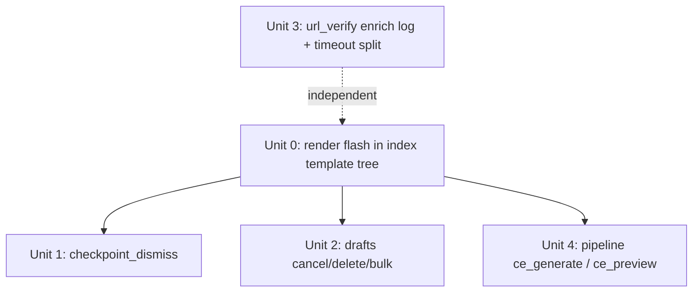

# fix: Close remaining WebUI false-success routes (UX honesty O1)

## Overview

Four WebUI routes catch a broad `Exception`, fall back to a safe default (or `pass`),
and then report success to the operator even though the underlying action silently
failed. This is the **same bug class** as the already-fixed PR #156 (`/ce:publish`
rendered "发布成功！" with zero URLs). The operator's view of "did it work?" is
untrustworthy in these paths.

This plan closes the four remaining instances. The fix is **honesty, not behavior
change**: surface the real failure (flash / logged event / differentiated reason)
instead of swallowing it. Where a swallow is *legitimately* benign (e.g. removing a
scheduler job that never existed), we keep the swallow but narrow it to the specific
benign exception so genuine failures stop hiding behind it.

This is item **O1** from `docs/ideation/2026-05-25-codebase-optimization-backlog.md`
(the doc's named "highest-leverage" theme). It compounds with the just-merged health
dashboard / projector work (PR #222) to make the operator's success signal trustworthy
end-to-end.

> **Document-review correction (2026-05-25):** the first draft assumed redirect-flash on
> `/` was visible and that `url_verify` had no logging. Both were wrong. The index
> template tree does **not** render `flash` at all (a latent bug — existing draft success
> messages are silently dropped), and `url_verify` already emits a throttled, host-hashed
> `_emit_recon`. The plan below fixes the flash-rendering gap as **Unit 0** (prerequisite)
> and narrows `url_verify` to enriching the existing log, not adding a new one.

## Problem Frame

The recurring pain class in this project — PR #156 false-success, velog
null-after-retry, the events projector silently dropping successes — is all "the
operator was told something succeeded when it didn't." Closing the remaining
false-success routes is the truest reading of the original request "讓這個服務更優質".

Origin: `docs/ideation/2026-05-25-codebase-optimization-backlog.md` → O1 (no
requirements doc; this is a bounded bug-class cleanup, planned direct).

## Requirements Trace

- R1. A swallowed delete/cancel/fetch failure must never render an unqualified success
  message to the operator.
- R2. Every genuinely-swallowed exception path must emit a diagnosable log event carrying
  the exception class (mirrors `sites.py` / `pipeline.py` convention), **without
  regressing existing privacy/throttle controls** (host stays hashed; rate caps stay).
- R3. Benign expected exceptions (scheduler job absent for an unscheduled draft, missing
  checkpoint on idempotent dismiss) must NOT be reported **to the operator as failures** —
  no error/warning banners, no false-negative spam. They MAY be logged at debug level for
  observability.
- R4. No change to the success-path behavior or response shape that existing tests and
  the frontend depend on (uniform JSON shape for `url_verify`; query-param flash redirects
  for drafts/checkpoint).
- R5. Surfaced failures must be **actually visible** to the operator — the feedback
  channel used by each route must render on its redirect/response target.

## Scope Boundaries

- **In scope:** the four named routes' error/fallback paths, plus the index-template
  flash-rendering gap that those routes depend on to be visible (Unit 0).
- **Out of scope (O2):** silent `except` in *adapters* (`medium_browser.py`,
  `linkedin_api.py`) — different backlog item, hot contention zone, deferred.
- **Out of scope (O3):** frontend `fetch().then(r.json())` content-type hardening — this
  plan does not change any response status code or shape (`url_verify` keeps its uniform
  JSON), so no frontend change is required. O3 remains a separate deferred item.
- **No new endpoints, no new dependencies, no schema changes.**

## Context & Research

### Relevant Code and Patterns

- **Canonical fix pattern — PR #156** (`eca5fd7`): surface a real multi-state outcome to
  the UI instead of an unconditional success banner; log on the failure path; add a
  regression test asserting the success string can never appear on a failure path.
- **Logger convention:** `from backlink_publisher._util.logger import plan_logger`, then
  `plan_logger.warn("<event>", reason=type(exc).__name__, ...)`. Live examples:
  `sites.py:157` (`tdk_fetch_failed`), `pipeline.py:196` (`json_parse_error`),
  `pipeline.py:265`.
- **Flash rendering gap (verified):** `index()` in `webui_app/routes/main.py:15-21` reads
  `flash_type`/`flash_msg` from `request.args` and passes a `flash` dict to `_render`, but
  **no template in the index tree (`index.html`, `_tab_*.html`) renders `flash`** — only
  `sites.html` and `settings.html` do. So every existing `redirect('/?...flash_...')` in
  `drafts.py` is silently dropped today. Unit 0 closes this.
- **Proven in-tree feedback channel:** `_render('index.html', error=...)` →
  `_tab_new.html:396 ` error-box. This is what `checkpoint_resume` and
  `ce_generate` already use and it *does* render.
- **`checkpoint_resume()`** in `checkpoint.py` is already correct — it refuses to persist a
  fake "published" row when exit 0 returns no URLs. Read its source as the in-file honesty
  reference (it was hardened by prior work; the source is the authority, not the plan doc).
- **Scheduler:** `webui_app/scheduler.py` uses APScheduler `BackgroundScheduler`.
  `_scheduler.remove_job(id)` raises `apscheduler.jobstores.base.JobLookupError` when the
  job is absent — the *expected* state for a `pending` draft that was never scheduled. The
  fix must preserve that benign case while surfacing real failures.
- **`url_verify` already logs (verified):** the `except Exception` block at
  `url_verify.py:181-185` already calls `_emit_recon("network_error", host=host_ascii)`.
  `_emit_recon(reason, host="")` (line 70) is **throttled** (`should_emit_recon`, 1/10s per
  session) and **host-hashed** (`_host_hash`, never raw host). The only gap is that the
  exception class is not captured.

### Institutional Learnings

- `feedback_fetch_json_must_guard_content_type` — relevant only if a route changes its
  response status/shape. This plan keeps `url_verify`'s uniform 200+JSON shape, so the
  frontend `resp.json()` callers are unaffected. N/A by design.
- `reference_webui_csrf_architecture` — WebUI route tests must seed `session['csrf_token']`
  or hit the global CSRF guard (403). The route-driving test files already do this; use
  them (see per-unit Files).
- `feedback_dead_code_audit_blind_spots` — most other broad catches in the codebase are
  *documented* cleanup paths (`# noqa: BLE001` with reasons). Do not touch those; only the
  four named genuinely-silent paths.

### External References

- None needed — fully grounded in repo patterns (PR #156, `plan_logger`, `_emit_recon`,
  APScheduler `JobLookupError`).

## Key Technical Decisions

- **Honesty over behavior change.** Each fix surfaces or logs the failure; none changes
  the success path. Minimizes blast radius; keeps existing success-path tests green (R4).
- **Fix the flash-rendering gap once, centrally (Unit 0).** Rather than rewrite every
  route off the (non-rendering) redirect-flash channel, add one flash-rendering block to
  the index template tree. This makes the codebase's existing assumption true, fixes the
  latent dropped-message bug for all draft routes, and lets Units 1/2 keep the natural
  POST-redirect-GET flow. (Chosen over per-route `_render(error=...)` rewrites, which would
  leave the latent bug unfixed and force draft routes off POST-redirect-GET.)
- **Operator-feedback severity rubric** (applies to all units, eliminates per-route
  guesswork):
  | Tier | When | Channel |
  |---|---|---|
  | `danger` | The operator's intended action did **not** happen; state unchanged | flash danger / `error=` |
  | `warning` | State **was** changed but a side-effect (scheduler job) may have leaked | flash warning |
  | log-only | The operator already sees a failure result; only diagnosability was missing | enriched `_emit_recon` |
- **Operator-facing copy convention:** Chinese, declarative, names the residual state
  (matches existing strings like "已加入草稿栏"). Exact strings are specified per-unit
  below, not left as placeholders.
- **`url_verify`: enrich the existing throttled+hashed log, do not add a new one.** Add
  the exception class to `_emit_recon` (new optional `exc_class` field) and pass
  `type(exc).__name__` from the except block. This preserves the host-hash privacy
  invariant and the 1/10s throttle (avoids the raw-host leak and the log-flood/DoS vector a
  bare `plan_logger.warn` would introduce). Keep the uniform JSON response shape (R4).
- **`url_verify`: ship the timeout reason-split.** Map `TimeoutError`/`socket.timeout` to a
  client-facing `reason="timeout"`; everything else stays `network_error`. `reason` is a
  closed enum already consumed by the frontend, so no internal detail leaks. This is the
  one operator-visible improvement in this route; deferring it would leave its UX unchanged.
- **`ce_generate`: detect corrupt input by form presence, not parsed result.** `'[]'` (the
  default) parses fine and is caught by the existing `if not urls` empty check, so the
  `except` only fires on genuinely malformed input. Distinguish "form supplied nothing /
  default" (legitimate fallback to stored urls) from "form supplied a non-empty value that
  failed to parse" (surface an error) by inspecting `request.form.get('urls_json')`, not the
  parse outcome.

## Open Questions

### Resolved During Planning

- *Should `url_verify` change its HTTP response on error?* No — keep uniform 200+JSON; only
  enrich the existing log + ship the closed-enum timeout reason.
- *Should the timeout split ship or defer?* Ship it (decided above).
- *Should removing the scheduler-job swallow break the cancel-pending flow?* No — narrow to
  `JobLookupError`.
- *Redirect-flash vs `_render(error=)` for the index page?* Fix flash rendering centrally
  (Unit 0); keep redirect-flash in the routes.

### Deferred to Implementation

- **Exact behavior of `backlink_publisher.checkpoint.delete()` on a missing run_id** — read
  it during Unit 1. A *benign* exception means the delete already effectively happened
  (resource already absent → idempotent dismiss → keep success). A *real failure* means the
  delete operation itself broke → surface danger. If `delete` is already idempotent, every
  exception reaching the handler is a real failure and all should surface.
- **`ce_preview` (`pipeline.py:~340`)** — already returns an error string (`"Invalid
  URLs"`), not a false success, so it is the weakest candidate. Decision: add a
  `plan_logger.warn` only (for parity/observability); do **not** expand to a template
  render. In scope but explicitly minimal.

## High-Level Technical Design

> *This illustrates the intended dependency shape and is directional guidance for review,
> not implementation specification.*

Unit 0 is a prerequisite for the redirect-flash visibility of Units 1, 2, and 4. Unit 3 is
independent (it uses the log channel, not flash) and may land in any order.

## Implementation Units

- [ ] **Unit 0: Render flash in the index template tree**

**Goal:** Make `flash` (already passed by `index()`) actually display on the index page, so
redirect-based failure feedback from Units 1/2/4 is visible — and fix the latent bug where
existing draft success messages are silently dropped.

**Requirements:** R5 (prerequisite for R1 visibility)

**Dependencies:** None (gates Units 1, 2, 4)

**Files:**
- Modify: `webui_app/templates/index.html` (or the appropriate shared layout/partial it
  includes) — add a Bootstrap alert block rendering `flash.type` → alert class and
  `flash.msg`, guarded by ``. Mirror how `settings.html` /
  `sites.html` already render `flash`.
- Test: `tests/test_webui_route_contract.py` or the index-rendering test (confirm which
  drives `GET /` with `flash_type`/`flash_msg` args; extend it)

**Approach:**
- Reuse the existing `settings.html` flash markup so styling/severity classes
  (success/info/warning/danger) are consistent across the app.
- Place it near the top of the main content area so it is seen before the operator acts.

**Patterns to follow:** `settings.html` / `sites.html` flash block; `main.py:15-21` already
constructs the `flash` dict.

**Test scenarios:**
- Happy path: `GET /?flash_type=success&flash_msg=已加入草稿栏` → response HTML contains the
  message in a success alert.
- Edge case: `GET /` (no flash args) → no alert block rendered (no empty alert).
- Error path: `GET /?flash_type=danger&flash_msg=...` → danger alert rendered.

**Verification:** A draft action that redirects with `flash_type=success` now shows the
message on the page; a `flash_type=danger` from Unit 1/2 is visible.

- [ ] **Unit 1: `checkpoint_dismiss` surfaces delete failure**

**Goal:** Stop redirecting as if dismiss worked when `_checkpoint_mod.delete` fails.

**Requirements:** R1, R2, R3

**Dependencies:** Unit 0 (for flash visibility)

**Files:**
- Modify: `webui_app/routes/checkpoint.py` (`checkpoint_dismiss`, ~line 84–93)
- Test: `tests/test_webui_checkpoint.py` (confirm it covers the dismiss route; else
  `tests/test_checkpoint.py`)

**Approach:**
- Read `backlink_publisher.checkpoint.delete` to classify its missing-run_id behavior
  (deferred question).
- Replace `except Exception: pass` with: on genuine failure, log
  `plan_logger.warn("checkpoint_dismiss_failed", run_id=run_id, reason=type(exc).__name__)`
  and `redirect("/?flash_type=danger&flash_msg=删除检查点失败，该检查点仍然存在")`. Treat a
  missing-checkpoint "not found" as benign (idempotent dismiss → keep the plain success
  redirect, optional debug log).

**Patterns to follow:** `plan_logger.warn` in `sites.py:157`; the honesty bar of
`checkpoint_resume` in the same file.

**Test scenarios:**
- Happy path: `delete` succeeds → redirect to `/` (no danger flash). Existing behavior
  preserved.
- Error path: `delete` raises a non-benign exception (monkeypatch `_checkpoint_mod.delete`
  to raise) → redirect carries `flash_type=danger`; a `checkpoint_dismiss_failed` log event
  is emitted with the exception class.
- Edge case (only if `delete` is NOT idempotent): missing run_id → benign, plain success
  redirect, no danger flash.

**Verification:** Dismissing a checkpoint whose delete fails now shows a danger flash
explaining the checkpoint is still present, instead of a silent clean home view.

- [ ] **Unit 2: drafts cancel/delete/bulk distinguish benign job-absence from real failure**

**Goal:** When scheduler job removal genuinely fails, warn the operator the scheduled job
may still fire — instead of "已取消排程 / 已删除" unconditionally.

**Requirements:** R1, R2, R3

**Dependencies:** Unit 0 (for flash visibility)

**Files:**
- Modify: `webui_app/routes/drafts.py` (`ce_draft_cancel` ~91–96, `ce_draft_delete`
  ~105–110, `_remove_job_silent` ~118–123 used by `bulk_delete`/`bulk_cancel`)
- Test: `tests/test_drafts_bulk_routes.py` (covers bulk + single routes)

**Approach:**
- Replace bare `except Exception: pass` with `except JobLookupError: pass` (benign — draft
  never scheduled, optional debug log) and a second `except Exception as exc:` that logs
  `plan_logger.warn("draft_job_remove_failed", item_id=item_id, reason=type(exc).__name__)`.
- Keep the store mutation (`update_item`/`delete_item`) — the danger is an *orphan job*, so
  the store should still reflect intent, but the redirect flash warns when removal failed:
  single-route `flash_type=warning&flash_msg=已删除，但排程任务可能仍会触发`.
- `_remove_job_silent` (bulk): return a bool (clean vs genuine-failure; `JobLookupError`
  counts as clean). Bulk routes tally genuine failures and, when `>0`, append a warning:
  `已处理 N 项，其中 M 项的排程任务可能仍会触发`. The per-item `draft_job_remove_failed`
  logs (carrying `item_id`) are the correlation handle; the operator's recovery path for an
  orphan job is the draft/history view (state this in the flash, not per-id in the banner).
- Import `from apscheduler.jobstores.base import JobLookupError`.

**Patterns to follow:** existing query-param flash redirects in the same file; the
`cancelled`/`scheduled` tally pattern already present in the bulk routes.

**Test scenarios:**
- Happy path (scheduled draft): `remove_job` succeeds → status reverts / item deleted,
  success flash unchanged.
- Edge case (pending draft, no job): `remove_job` raises `JobLookupError` → benign, success
  flash, no warning, no `draft_job_remove_failed` log.
- Error path: `remove_job` raises a generic `Exception` → store still mutated, redirect
  carries a warning flash, `draft_job_remove_failed` log emitted with exception class.
- Integration (bulk): mix of ids where one removal raises a generic Exception → bulk flash
  reports the genuine-failure count; `JobLookupError` items count clean.
- Regression (R4): existing happy-path tests for `ce_draft_cancel`/`ce_draft_delete`/bulk
  still pass unmodified (redirect target + success flash shape unchanged).

**Verification:** Cancelling/deleting an unscheduled draft is still silent-success;
cancelling one whose job removal truly fails now warns the operator the job may still run.

- [ ] **Unit 3: `url_verify` enriches the existing log with the exception class + timeout split**

**Goal:** Capture *why* a fetch failed (currently the exception class is lost) and tell the
operator timeout-vs-network — without regressing the host-hash or throttle controls.

**Requirements:** R2, R4

**Dependencies:** None (uses the log channel, not flash)

**Files:**
- Modify: `webui_app/routes/url_verify.py` (`_emit_recon` ~line 70 to accept an optional
  `exc_class`; the `except Exception as exc` block ~181–185 to pass it + map timeout)
- Test: `tests/test_webui_url_verify_routes.py` (the route-driving test that already seeds
  `session['csrf_token']` and patches the **canonical** path
  `backlink_publisher.content.fetch.verify_url_has_content`)

**Approach:**
- Add an optional `exc_class: str = ""` parameter to `_emit_recon`; include it in the
  `_logger.recon(...)` fields when present. Keep host hashing and the `should_emit_recon`
  throttle exactly as-is.
- In the except block, set `reason = "timeout" if isinstance(exc, (TimeoutError, socket.timeout)) else "network_error"`,
  then `_emit_recon(reason, host=host_ascii, exc_class=type(exc).__name__)`. Return the
  uniform failure tuple with that `reason`.
- Do **not** add a separate ungated `plan_logger.warn` (would leak raw host + bypass the
  throttle — the privacy/anti-flood controls are deliberate).
- The monkeypatch target is `backlink_publisher.content.fetch.verify_url_has_content`
  (canonical; the flat `content_fetch` alias was deleted in PR #124 — ignore any stale
  inline comment).

**Patterns to follow:** the existing `_emit_recon` / `_logger.recon` usage in this file.

**Test scenarios:**
- Error path: patch `verify_url_has_content` to raise a generic exception → response keeps
  the uniform shape with `ok=false, reason="network_error"`; `_emit_recon` is called with
  `exc_class` = the exception class and a hashed (not raw) host.
- Edge case (timeout split): raise `TimeoutError` → response `reason="timeout"`; log carries
  the exception class.
- Privacy/throttle guard: assert the emitted log field is `host_hash` (not raw host) and
  that a second call within the throttle window is suppressed (no double emit).
- Happy path (R4): successful verify still returns `ok=true` with title — unchanged.

**Verification:** A failing verify now leaves a diagnosable hashed-host log line with the
real exception class; the browser response shape is unchanged; timeouts are distinguishable
from generic network errors.

- [ ] **Unit 4: `ce_generate` surfaces corrupt input instead of silently using stale urls**

**Goal:** When the operator submits a non-empty `urls_json` that fails to parse, don't
silently generate against stale `stored_config` urls as if nothing was wrong.

**Requirements:** R1, R2

**Dependencies:** Unit 0 (the error renders via `_render(error=...)`, already in the index
tree, so Unit 0 is not strictly required for *this* unit's channel — but listed for the
optional flash path)

**Files:**
- Modify: `webui_app/routes/pipeline.py` (`ce_generate` ~135–141; `ce_preview` ~338–340 per
  deferred decision — `plan_logger.warn` only)
- Test: `tests/test_webui_publish_route.py` or the pipeline route test (confirm which drives
  `/ce:generate`; extend it)

**Approach:**
- Inspect `request.form.get('urls_json')`: if it is absent or the default `'[]'`, keep the
  current silent fallback to stored urls (legitimate). If it is present, non-empty, and
  `json.loads` raises, render `_render('index.html', error="连结格式无效，未使用旧数据", config=stored_config)`
  and log `plan_logger.warn("urls_json_parse_error", reason=type(exc).__name__)`.
- `ce_preview`: add `plan_logger.warn("preview_urls_parse_error", reason=type(exc).__name__)`
  before its existing `return "Invalid URLs"`; do not expand its scope.

**Patterns to follow:** `pipeline.py:196` already logs `json_parse_error`; the
`_render(..., error=...)` form used by `ce_generate`'s empty-urls branch.

**Test scenarios:**
- Happy path: valid `urls_json` → generates normally (unchanged).
- Edge case: empty / `'[]'` / absent form value with stored urls present → still falls back
  to stored urls silently (legitimate, unchanged).
- Error path: non-empty malformed `urls_json` (e.g. `'[not json'`) → renders the error,
  does NOT generate against stale urls, emits `urls_json_parse_error` log.

**Verification:** Submitting corrupt URL JSON no longer silently produces content for a
previous session's URLs.

## System-Wide Impact

- **Interaction graph:** Unit 0 touches a shared index template (read by every index
  render) — additive alert block, guarded by ``, low risk. The
  four route units are leaf POST handlers; the only shared helper changed is
  `_remove_job_silent` (Unit 2), used by the two bulk draft routes, both covered.
- **Error propagation:** failures travel to the operator via the now-rendered flash channel
  (Units 1/2) or `_render(error=...)` (Unit 4), and to logs via enriched `_emit_recon`
  (Unit 3) / `plan_logger.warn` (Units 1/2/4). No new exception types escape the handlers.
- **State lifecycle risks:** the orphan-job concern (Unit 2) is explicitly addressed — store
  mutation kept, operator warned. No partial-write risk introduced.
- **API surface parity:** `url_verify` JSON shape unchanged (R4); `reason` stays a closed
  enum (adds existing-style `"timeout"`); no frontend/contract update required.
- **Security/privacy:** Unit 3 keeps host hashed and throttle intact (no raw-host leak, no
  log-flood). Units 1/2 new log fields `run_id`/`item_id` are opaque internal identifiers
  with no embedded URL/domain/PII (confirm on read; if they ever encode operator targets,
  hash them as host is hashed). `_session_id()` must not be attached to the new log events.
- **Unchanged invariants:** success-path behavior of all routes; `url_verify` response
  shape/status; the documented benign-swallow for unscheduled drafts; `_emit_recon` throttle
  + host-hash contract.

## Risks & Dependencies

| Risk | Mitigation |
|------|------------|
| Removing the drafts swallow turns "cancel pending draft" into a false error | Narrow to `JobLookupError`; explicit edge-case test (Unit 2) |
| `checkpoint.delete` semantics on missing run_id unknown | Read it first (Unit 1 deferred question); branch benign vs genuine |
| Adding raw-host / ungated logging to `url_verify` regresses privacy + invites log-flood | Enrich the existing throttled+hashed `_emit_recon`; never add a bare `plan_logger.warn` here (Unit 3) |
| Surfaced failure not visible (flash dropped by index tree) | Unit 0 adds flash rendering centrally; gating dependency for Units 1/2 |
| Unit 0 alert block collides with existing markup / shows empty | Guard ``; reuse `settings.html` markup; explicit no-args test |
| New log fields carry operator targets/PII | `run_id`/`item_id` confirmed opaque; host hashed; `_session_id` excluded |
| Collision with concurrent multi-agent WIP | Isolated worktree off origin/main; the four route files + index template verified clean in canonical tree at plan time |

## Documentation / Operational Notes

- New events introduced: `checkpoint_dismiss_failed`, `draft_job_remove_failed`,
  `urls_json_parse_error`, `preview_urls_parse_error`, plus `exc_class` on the existing
  `url-verify.event` RECON line. These feed the same log stream the health-dashboard reads —
  no dashboard change required; worth noting for log-grep runbooks.
- Run `plan-check` after edits (today > 2026-05-20 → `claims: {}` opt-out required, already
  in frontmatter). Full suite must keep `PYTHONHASHSEED=0`.

## Sources & References

- **Origin:** `docs/ideation/2026-05-25-codebase-optimization-backlog.md` → O1
- Canonical pattern: PR #156 (`eca5fd7`) — false-success publish banner fix
- Logger pattern: `webui_app/routes/sites.py:157`, `webui_app/routes/pipeline.py:196`
- Flash gap: `webui_app/routes/main.py:15-21`; `settings.html` / `sites.html` flash markup
- `_emit_recon` (throttle + host-hash): `webui_app/routes/url_verify.py:70`
- Scheduler: `webui_app/scheduler.py`; APScheduler `JobLookupError`
- CSRF test seeding: `reference_webui_csrf_architecture`
- In-file honesty reference: `checkpoint_resume` source in `webui_app/routes/checkpoint.py`
