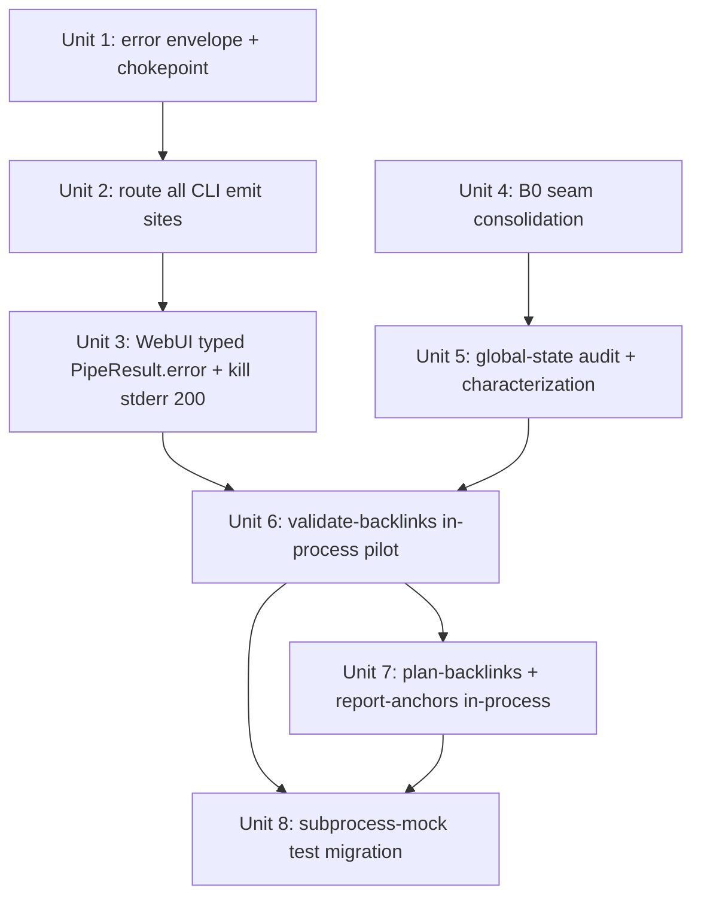

# Thin WebUI — Typed-Error Contract, then In-Process Pipeline

## Overview

Two sequenced phases behind the existing `PipelineAPI` seam:

- **Phase 1 (ships first, ~0 process-model risk):** give the CLI and WebUI a
  shared, schema-first **typed-error contract**. CLI fatal errors are emitted as
  a machine-readable envelope (carrying `error_class` + `exit_code` + message)
  *in addition to* the existing human-readable stderr text; the WebUI bridge
  deserializes it into a typed `PipeResult.error` instead of slicing
  `stderr[:200]`. Runs over the **existing subprocess transport** — no execution
  model change. Delivers the operator-visible win (real errors, not truncated
  banners).
- **Phase 2 (second):** move the read-only / low-risk data-pipeline CLIs
  (`validate-backlinks`, `plan-backlinks`, `report-anchors`) to **in-process**
  execution behind `PipelineAPI`, eliminating subprocess spawn for them.
  `publish-backlinks` and all login CLIs **stay subprocess** (credential +
  isolation reasons). `footprint` is **excluded** (no WebUI caller; `PYTHONHASHSEED`
  is interpreter-startup-only). With Phase 1's typed contract in place, "no
  behavior change" is defined by the typed result/error object plus
  byte-identical stdout *data*, not by raw free-text stderr.

## Problem Frame

The WebUI invokes data-pipeline CLIs via `webui_app/helpers/cli_runner.py:run_pipe`
→ `subprocess.run([sys.executable, '-m', <module>, ...])`. Failures cross as a
free-text stderr string; the WebUI then displays `stderr[:200]`
(`webui_app/routes/pipeline.py:320`), which is eaten by the 5-line `config_echo`
banner (~210 chars) so the real error (`AuthExpiredError`, `ContentRejectedError`,
…) is truncated away. `strip_cli_diagnostic_banner` exists solely to work around
this. Separately, the subprocess transport adds per-call spawn latency and forces
a stringly-typed contract that prevents CLI and WebUI from provably sharing one
validation path. The architecture this targets ("thin WebUI / services / adapters
/ schema-first") is ~70% adopted; this plan finishes the load-bearing remainder.
(See origin: `docs/brainstorms/2026-05-27-thin-webui-phase-b-in-process-pipeline-requirements.md`.)

## Requirements Trace

- **R1** (origin R1/R2). Define one result/error contract shared by CLI and
  WebUI; CLI emits typed errors; `PipelineAPI` deserializes to a typed
  `PipeResult.error`; operator sees the real error, not a truncated preview.
- **R2** (origin R3 — B0). Every caller of an in-scope CLI funnels through
  `PipelineAPI`, including the direct `subprocess.run` in `services/seo_viz.py`;
  `PipelineAPI` grows a `report-anchors` method.
- **R3** (origin R4). In-process scope = `validate-backlinks` (pilot), `plan-backlinks`,
  `report-anchors`. `equity-ledger` already in-process (parity only); `footprint`
  excluded.
- **R4** (origin R5). `publish-backlinks` stays subprocess.
- **R5** (origin R6). Login CLIs stay subprocess.
- **R6** (origin R7). In-process parity defined by typed result/error + byte-identical
  stdout data; `SystemExit`→`PipeResult` mapping mirrors CPython
  (int→code, `None`→0, string→1+stderr); golden corpus includes error-path inputs.
- **R7** (origin R8). Concurrency stays correct: the real hazard is the
  `BackgroundScheduler` thread (`scheduler.py:59`) racing Flask request threads
  over process-global `sys.stdout`/`sys.stdin` and shared mutable module state.
  (The CLI-internal `ThreadPoolExecutor` in `_check_row_reachability` writes no
  stdout, so it is not itself a capture hazard — see Key Decisions.) Pure-return
  core preferred.

## Scope Boundaries

- **`publish-backlinks` is NOT migrated in-process** (R4) and **login CLIs are NOT
  migrated** (R5) — both stay subprocess for credential-write + crash + SSRF
  isolation. Explicit non-goals.
- **`footprint` is excluded** — no WebUI caller; `PYTHONHASHSEED` is startup-only,
  so seed-stable iteration order cannot be reproduced in a live process.
- **Phase 1 does not touch the process model; Phase 2 does not redesign the data
  contract.** Sequenced, not interleaved.
- **Routes are not rewritten** — they keep calling `PipelineAPI`.
- **Not the `api/` vs `services/` boundary cleanup** — separate concern.
- The CLI's terminal/pipe contract (stdout JSONL data + exit codes for shell/CI)
  is unchanged; the typed-error envelope is additive on stderr.

## Context & Research

### Relevant Code and Patterns

- **Typed-error vocabulary**: `src/backlink_publisher/_util/errors.py` — hierarchy
  `PipelineError`(5) → `UsageError`(1) / `InputValidationError`(2) /
  `DependencyError`(3, incl. `AuthExpiredError`, `BannerUploadError`,
  `ContentRejectedError`) / `ExternalServiceError`(4) / `RegistryError`(5) /
  `InternalError`(5), each with a class-level `exit_code`. Chokepoints:
  `emit_error(message, exit_code=5)`, `handle_error(exc)`, `handle_unexpected_error(exc)`
  — all do `print(text, file=stderr); raise SystemExit(code)`. **No structured
  emission today.**
- **Error classification enum**: `ErrorClass` in
  `src/backlink_publisher/publishing/adapters/retry.py:31` (`transient`,
  `auth_expired`, `http_5xx`, `ssrf_blocked`, `unexpected`) + `classify_exception`.
  Already written into per-row publish JSONL via `cli/_publish_helpers.py:209-216`.
- **Schema**: `src/backlink_publisher/schema.py` — `validate_publish_payload`,
  `validate_output_payload`, `validate_input_payload[_strict]`; all return
  `list[str]`, never raise. WebUI does not call these directly today.
- **Banner**: `src/backlink_publisher/config_echo.py:178 emit_banner` (5 lines to
  stderr at every CLI entry); stripped by
  `webui_app/helpers/cli_runner.py:36 strip_cli_diagnostic_banner`.
- **Bridge + result**: `webui_app/api/pipeline_api.py` — `PipeResult` dataclass
  (`stdout`/`stderr`/`success`/`error: str|None`, `.stderr_cleaned`, `.rows`);
  `PipelineAPI.plan/validate/publish` call `run_pipe`. `run_pipe`
  (`cli_runner.py:111`) returns `{stdout, stderr}`, raises bare `Exception` on
  non-zero exit. Consumer: `webui_app/routes/pipeline.py:197-320` (the `stderr[:200]`
  at :320).
- **In-process engine-extraction precedent (Phase 2 template)**:
  `backlink_publisher.ledger.build_ledger(stale_days=...)` is consumed identically
  by `cli/equity_ledger.py:53-57` (CLI shell) and `webui_app/routes/equity_ledger.py:35-47`
  (route) — same pure engine, differ only in serialization. Docstrings: "no
  subprocess, no recomputation divergence." The engine is a **top-level package**
  (`ledger/aggregate.py` holds `build_ledger`, re-exported via `ledger/__init__.py`;
  import as `from backlink_publisher.ledger import build_ledger`). `anchor/`,
  `linkcheck/`, `content/` follow the same top-level-package convention — no engine
  lives under `cli/`. `ledger/aggregate.py` also does `import
  backlink_publisher.publishing.adapters` *inside the engine* so the registry is
  populated regardless of caller — extracted engines MUST replicate this or the
  in-process path mis-classifies on an empty registry.
- **stdin/stdout injection**: `src/backlink_publisher/_util/jsonl.py` —
  `read_jsonl(source=None→sys.stdin, strict=True)` (calls `emit_error`→`SystemExit`
  on malformed), `write_jsonl(dest=None→sys.stdout)`. Injectable via explicit
  `source`/`dest`.
- **Stray subprocess caller B0 must catch**: `webui_app/services/seo_viz.py`
  calls `report-anchors` via raw `subprocess.run` (bypasses `run_pipe`); it
  **ignores `returncode` entirely** and `json.loads(result.stdout)` regardless. So
  exit-6 (anchor alarm) only works because report-anchors writes stdout before
  exiting; a *real* failure would throw `JSONDecodeError` (latent bug). This is an
  accident to FIX on migration, not a contract to preserve. `report-anchors` also
  emits a **markdown table or a single JSON blob, not JSONL rows** — `PipeResult.rows`
  cannot parse it; `seo_viz` reads named JSON keys.
- **Concurrency surfaces**: `webui_app/scheduler.py:59` (`BackgroundScheduler`
  runs `publish-backlinks`), `webui.py` runs Flask threaded; `_util/logger.py`
  `set_log_level` mutates shared singletons; `content.fetch` cache;
  `config.load_config`; `_publish_helpers._check_row_reachability` spawns its own
  `ThreadPoolExecutor`.

### Institutional Learnings

- `docs/solutions/logic-errors/projector-silent-drop-status-vocabulary-drift-2026-05-26.md`
  — classifiers at an input seam must have a loud **QUARANTINE** branch; unknown
  shapes must never silently drop. Shapes R1's typed-error parser.
- `docs/solutions/integration-issues/dofollow-canary-verdict-dropped-at-publish-output-seam-2026-05-25.md`
  — the repo's recurring "missed one dispatch path" bug class; use a **single
  shared serialization chokepoint** and enumerate every emit site.
- `docs/solutions/logic-errors/argparse-choices-vs-usage-error-exit-clash-2026-05-20.md`
  — the 0–6 exit-code table is a doc contract, not `sys.exit()`-enforced;
  in-process bypasses the `SystemExit` translation layer, so the typed error must
  carry what the exit code used to. `errors.py` stays the single vocabulary.
- `docs/solutions/test-failures/tests-coupled-to-operator-config-state-2026-05-18.md`
  — the 4 autouse conftest fixtures; in-process CLIs share them directly, and any
  unmocked HTTP path silently yields empty output. Assert on payload, not exit code.
- `docs/solutions/best-practices/embed-banner-lazy-config-load-contract-2026-05-20.md`
  — lazy `load_config()` inside each call; never cache config on the `PipelineAPI`
  instance (would miss `BACKLINK_PUBLISHER_CONFIG_DIR` per-call overrides).
- `docs/solutions/best-practices/credential-rotation-tests-cover-bootstrap-race-2026-05-19.md`
  + `webui-blocking-subprocess-and-missing-progress-feedback-2026-05-12.md` —
  justification for keeping publish/login subprocess; and in-process runs on the
  Flask worker thread with no subprocess timeout (need bounded strategy).

### External References

- None. Strong local patterns (engine-extraction precedent, typed hierarchy,
  ErrorClass enum) make external research low-value.

## Key Technical Decisions

- **Typed-error transport over subprocess = additive stderr envelope through the
  `_util/errors.py` chokepoints.** Upgrade `emit_error` / `handle_error` /
  `handle_unexpected_error` to also emit a single machine-readable, sentinel-delimited
  JSON line to stderr (e.g. a `__BLP_ERR__ {…}` line) carrying `error_class`,
  `exit_code`, and `message`. Human-readable text is preserved, stdout stays pure
  data JSONL — so the CLI's shell/CI contract is unchanged. *Rationale:* lowest
  risk, single chokepoint (defends the "missed dispatch path" class), reuses the
  existing `exit_code` attrs + `ErrorClass` enum. *Rejected:* emitting errors as a
  stdout JSONL row (pollutes the data channel shell consumers parse); a separate
  IPC channel (over-engineered for a subprocess bridge).
- **Pin the typed-error envelope schema in one dependency-free module** imported
  by both CLI and WebUI, so the vocabulary cannot drift across the boundary
  (mirrors `events/kinds.py` discipline from the silent-drop lesson).
- **Parser has a QUARANTINE branch.** Unknown/missing envelope → a loud, explicit
  "unrecognized CLI error shape" typed result that still surfaces the raw
  (banner-stripped) stderr — never empty, never truncated.
- **Phase 2 uses engine extraction, not stdout monkeypatching.** Each in-scope
  CLI's core logic moves to a new pure module (ledger-style) callable with explicit
  `source`/`dest` (or returning rows), raising typed `errors.py` exceptions instead
  of touching `sys.stdout`/`SystemExit`. *Rationale:* the `ledger.build_ledger`
  precedent; pure-return is the only thread-safe answer because `redirect_stdout`
  swaps the **process-global** `sys.stdout`, which the `BackgroundScheduler` thread
  and concurrent Flask request threads share — two in-process calls would corrupt
  each other's capture. (Note: for the in-scope read-only CLIs the *intra-call*
  `ThreadPoolExecutor` in `_publish_helpers._check_row_reachability` only runs
  `check_url` and writes no stdout, so it is **not** itself a capture hazard — the
  cross-thread global swap is. Either way, a pure engine sidesteps both.) The thin
  CLI `main()` and the in-process `PipelineAPI` path both call the engine — single
  source of truth.
- **`PipelineAPI` lazy-loads config per call**, never at `__init__` (preserves
  `BACKLINK_PUBLISHER_CONFIG_DIR` test isolation and operator edits between calls).
- **`SystemExit`→`PipeResult` mapping mirrors CPython** (int→code, `None`→0,
  non-int/string→1 with string on stderr; `equity_ledger.py:49` raises
  `SystemExit(<string>)`). In-process callers wrap engine calls and any residual
  `read_jsonl(strict=True)` in `try/except SystemExit`.
- **Extracted engines land in NEW modules**, not the CLI shells — the four CLI
  files are near their `monolith_budget.toml` ceilings.

## Open Questions

### Resolved During Planning

- *Transport mechanism for Phase 1 typed errors?* → Additive sentinel-delimited
  JSON line on stderr via the `errors.py` chokepoints (see Key Decisions).
- *In-process injection mechanism?* → Engine extraction with explicit `source`/`dest`,
  per the `ledger.build_ledger` precedent — not `sys.stdin`/`sys.stdout` monkeypatching.
- *Does Phase 1 require touching every CLI main?* → The in-scope CLIs do **not**
  funnel fatal exits through `errors.py` today (`validate_backlinks.py` uses inline
  `print+SystemExit` at :141/:218-223). Unit 2 *establishes* the chokepoint as the
  sole fatal-exit path — a control-flow change, not a call-site swap — and the
  guard test asserts the *absence* of inline `raise SystemExit`/`file=sys.stderr`
  in those CLIs. argparse's own `SystemExit(2)` (bad flags) stays outside the
  chokepoint and is handled as a named fatal class (Unit 2).

### Deferred to Implementation

- Exact sentinel marker string and whether the envelope is one line vs a fenced
  block — decide when wiring `run_pipe`'s parser (must survive line-buffering).
- `report-anchors` exit-6-with-populated-stdout: choose `success-with-data` vs
  `failure-with-data` from **intent**, not the current `seo_viz` accident (which
  ignores returncode); document it; pick when implementing Unit 2/Unit 4.
- Per-call concurrency isolation mechanism (reset-per-call vs documented change)
  for each global surface — resolved by the Unit 5 audit against real code.
- Whether a bounded-execution/timeout wrapper is needed for the in-process Flask
  worker thread — decide from Unit 5 findings.
- Final mock-seam shape for the in-scope subprocess-mocking tests (partition by
  grep; most of the ~27 subprocess files are out of scope) — decide in Unit 8
  after the engine signatures exist.

## High-Level Technical Design

> *This illustrates the intended approach and is directional guidance for review,
> not implementation specification. The implementing agent should treat it as
> context, not code to reproduce.*

```
PHASE 1 — typed-error contract (subprocess UNCHANGED)
  CLI fatal error path                         WebUI bridge
  ─────────────────────                        ────────────
  raise PipelineError(exit_code, ...)          run_pipe captures stderr
        │                                            │
        ▼ errors.py chokepoint                       ▼ parse sentinel line
  stderr: human text                           PipeResult.error = TypedError(
        + "__BLP_ERR__ {error_class,                  error_class, exit_code, message)
           exit_code, message}"  ◄── shared ──►  unknown? → QUARANTINE (loud, raw stderr)
        (stdout data unchanged)                  routes/pipeline.py shows typed error
                                                 (delete stderr[:200])

PHASE 2 — in-process transport (read-only CLIs only)
  new engine module (pure)         ┌─ cli/<verb>.py thin shell: parse argv → engine → write_jsonl
  validate/plan/report-anchors ────┤
  returns rows / raises typed err  └─ PipelineAPI.<verb>(): lazy load_config → engine(source,dest)
                                        → PipeResult   [no subprocess spawn]
  publish-backlinks ───────────────────► PipelineAPI.publish(): run_pipe (subprocess, unchanged)
  login CLIs ──────────────────────────► subprocess (unchanged)
```

## Implementation Units



Phase 1 = Units 1–3 (ship independently). Phase 2 = Units 4–8.

- [x] **Unit 1: Typed-error envelope + shared chokepoint**

**Goal:** A dependency-free typed-error envelope (schema: `error_class`,
`exit_code`, `message`) and an additive machine-readable emission through the
`_util/errors.py` chokepoints, plus a parse helper.

**Requirements:** R1

**Dependencies:** None

**Files:**
- Create: `src/backlink_publisher/_util/error_envelope.py` (envelope dataclass +
  `serialize()` → sentinel line, `parse(stderr) -> Envelope | None`)
- Modify: `src/backlink_publisher/_util/errors.py` (`emit_error`/`handle_error`/
  `handle_unexpected_error` also emit the sentinel line; compose `exit_code` +
  classified `ErrorClass`)
- Test: `tests/test_error_envelope.py`

**Approach:**
- **Import-cycle guard (P0):** `ErrorClass` currently lives in
  `publishing/adapters/retry.py`, which imports `_util/errors.py` — so making the
  `errors.py` chokepoints call `classify_exception` creates
  `errors.py → retry.py → errors.py`. Resolve by moving the `ErrorClass` *enum*
  into the leaf `error_envelope.py` (or beside `errors.py`) and re-importing it in
  `retry.py`, OR by passing an already-classified `error_class` into the chokepoint.
  Do NOT import `classify_exception` into early-init `errors.py`.
- **Shared constructor for mode-convergence (P0):** expose
  `Envelope.from_exception(exc)` used by BOTH the stderr serializer (subprocess
  mode) and the in-process `PipelineAPI` path (Phase 2), so both modes build an
  *identical* `PipeResult.error` and differ only in transport — not two divergent
  error-builders the golden corpus would force you to reconcile.
- Chokepoints emit the human-readable text first (unchanged), then the sentinel
  line — so existing stderr-substring assertions still pass. Note `errors.py` is a
  *vocabulary*, not a control-flow gate: many fatal exits (e.g.
  `validate_backlinks.py`) do inline `print+SystemExit` and never call a chokepoint
  today — Unit 2 must *establish* the chokepoint as the sole fatal path.

**Patterns to follow:** `events/kinds.py` dependency-free enum discipline;
`ErrorClass`/`classify_exception` in `retry.py`.

**Test scenarios:**
- Happy path: `serialize(Envelope(auth_expired, 3, "msg"))` → a single line whose
  `parse()` round-trips to an equal Envelope.
- Happy path: `handle_error(AuthExpiredError(channel=...))` writes human text AND a
  sentinel line with `error_class="auth_expired"`, `exit_code=3`; raises `SystemExit(3)`.
- Edge: `parse(stderr_with_no_sentinel)` → `None` (drives QUARANTINE in Unit 3).
- Edge: stderr containing the config_echo banner + a sentinel line → `parse` finds
  the envelope regardless of banner position.
- Error path: `handle_unexpected_error(ValueError(...))` → `error_class="unexpected"`,
  `exit_code=5`.
- Edge: message containing newlines / the sentinel substring does not break parsing.

**Verification:** Round-trip and chokepoint tests pass; existing `errors.py` tests
still green (human text preserved).

- [x] **Unit 2: Route every CLI fatal-error emit site through the chokepoint**

**Goal:** All fatal-error exits in the in-scope CLIs go through the Unit 1
chokepoint so each emits the typed envelope — no direct `print(...,file=stderr)+SystemExit`.

**Requirements:** R1, R6

**Dependencies:** Unit 1

**Files:**
- Modify: `src/backlink_publisher/cli/validate_backlinks.py` (aggregated
  validation `SystemExit(2)`; `ExternalServiceError`→`SystemExit(4)`),
  `src/backlink_publisher/cli/publish_backlinks.py` (validation `SystemExit(2)`;
  the `_handle_auth_expired` / `_record_publish_failure` paths),
  `src/backlink_publisher/cli/report_anchors.py` (`SystemExit(_EXIT_CODE_ALARM)`),
  `src/backlink_publisher/cli/plan_check.py`, `src/backlink_publisher/cli/plan_backlinks/core.py`,
  `src/backlink_publisher/cli/equity_ledger.py` (`SystemExit(<string>)`)
- Test: `tests/test_cli_typed_error_emission.py` (parametrized across the CLIs)

**Approach:**
- **Sub-sequence to ship the load-bearing subset first:** *2a* = in-scope
  read-only CLIs `validate`/`plan`/`report-anchors` (what Phase 2 needs); *2b* =
  `publish`/`plan_check`/`equity-ledger` typed-error parity (lower urgency, more
  files, more monolith-budget exposure).
- Enumerate **four** fatal-exit classes (the "missed one dispatch path" lesson):
  (1) inline `print(...,file=stderr)+SystemExit` (validate :141/:218-223),
  (2) `emit_error`, (3) `handle_error`, (4) **argparse's own `SystemExit(2)`** on
  bad flags — argparse exits *outside* any chokepoint, so name it explicitly,
  give it an `error_class` (e.g. `usage`), and add it to the golden corpus; it
  collides with `InputValidationError`'s exit-2, so the WebUI must not mislabel it.
  Establish the chokepoint as the sole non-argparse fatal path.
- Per-row publish failures already carry `error_class` in stdout rows — a
  *different* (row-level, stdout-resident) contract from the process-fatal
  envelope; leave them, and Unit 3 renders both distinctly.
- Decide `report-anchors` exit-6 semantics from **intent** (not the seo_viz accident).
- Keep stdout output byte-identical; envelope is stderr-only.

**Patterns to follow:** existing `except SystemExit as exc: raise SystemExit(exc.code)`
guards in `validate_backlinks.py:108`, `publish_backlinks.py:69`.

**Test scenarios:**
- Happy path (per CLI): a known fatal error → stderr contains a parseable envelope
  with the expected `error_class`/`exit_code`; stdout unchanged vs a captured baseline.
- Edge: validate with N aggregated validation errors → single envelope,
  `exit_code=2`, message conveys the aggregate.
- Error path: `report-anchors` anchor-alarm → envelope with the documented
  exit-6 semantics AND stdout report still emitted.
- Error path: `equity-ledger` bad `--stale-days` (`SystemExit(<string>)`) → envelope
  `exit_code` mapped per CPython rule (string→1), message = the string.
- Edge: a CLI that exits 0 with data emits NO envelope (no false-positive error).

**Verification:** Every in-scope CLI's fatal paths emit a parseable envelope;
golden stdout unchanged; `tests/test_no_monolith_regrowth.py` still green (or
ceiling raised in-PR with rationale).

- [x] **Unit 3: WebUI consumes typed errors; delete `stderr[:200]`**

**Goal:** `run_pipe` / `PipeResult` parse the envelope into a typed
`PipeResult.error`; routes show the real error; QUARANTINE unknown shapes.

**Requirements:** R1, R6

**Dependencies:** Unit 1, Unit 2

**Files:**
- Modify: `webui_app/api/pipeline_api.py` (`PipeResult.error` becomes a typed
  structure — `error_class`/`exit_code`/`message`; `PipelineAPI.*` populate it via
  `error_envelope.parse`), `webui_app/helpers/cli_runner.py` (`run_pipe` surfaces
  the envelope from stderr on non-zero exit instead of a bare `Exception` string),
  `webui_app/routes/pipeline.py` (consume typed error; remove `stderr[:200]` at :320),
  `webui_app/routes/checkpoint.py` (parse the envelope from its own raw-subprocess
  stderr; remove the `[:200]`/`[:300]`/`[:500]` slices — these are obsolete once the
  typed error is available; keep its `returncode` 0/4/else branching, which Unit 4
  later moves behind `PipelineAPI`)
- Test: `tests/test_webui_typed_error_surfacing.py`, update
  `tests/test_webui_*pipeline*` consumers, `tests/test_webui_checkpoint.py`

**Approach:**
- Keep `PipeResult.error` backward-tolerant: a typed object whose `str()` yields
  the message, so existing string consumers don't break.
- QUARANTINE branch: envelope missing/unparseable → typed error flagged
  `error_class="unrecognized"` carrying the banner-stripped raw stderr (loud, never
  empty/truncated) — per the silent-drop lesson.
- Also surface per-row `error_class` from `PipeResult.rows` in the per-row UI.

**Patterns to follow:** `PipeResult.stderr_cleaned`/`.rows` derived-property style;
`strip_cli_diagnostic_banner` retained only for the QUARANTINE fallback text.

**Test scenarios:**
- Happy path: subprocess emits an `auth_expired`/exit-3 envelope → `PipeResult.error.error_class=="auth_expired"`,
  `success is False`; route renders the typed message, not a truncated banner.
- Integration: a real `validate-backlinks` invocation (subprocess, sandboxed) with
  a malformed payload → typed `InputValidationError`/exit-2 surfaces end-to-end.
- Edge (QUARANTINE): stderr with banner only, no envelope → `error_class=="unrecognized"`,
  message = banner-stripped stderr (non-empty); never the `(CLI exited without...)` truncation.
- Edge: success (exit 0) → `error is None`, `success is True`, rows parsed.
- Regression: a >200-char real error is shown in full (the `stderr[:200]` bug is gone).
- Edge (checkpoint): a `publish-backlinks --resume` failure surfaces the typed error
  full-length in the checkpoint route (no `[:200]`/`[:300]`/`[:500]` truncation),
  while the exit 0/4/else resume branching still routes correctly.

**Verification:** Operator sees full typed errors in the WebUI; no code path slices
`stderr[:200]`/`[:300]`/`[:500]` for pipeline CLIs (pipeline.py *and* checkpoint.py);
existing pipeline-route + checkpoint tests green.

- [x] **Unit 4: B0 — funnel all callers through `PipelineAPI`; add `report-anchors` method**

**Goal:** Single seam: no route/service calls `run_pipe`/`subprocess` for in-scope
CLIs directly; `PipelineAPI` gains `report_anchors()`. Still subprocess underneath
— pure plumbing, no behavior change.

**Requirements:** R2

**Dependencies:** None (independent of Phase 1; can run in parallel)

**Files:**
- Modify: `webui_app/services/seo_viz.py` (raw `subprocess.run(['report-anchors'…])`
  → `PipelineAPI.report_anchors()`; preserve the exit-6-keeps-stdout behavior),
  `webui_app/routes/pipeline.py`, `webui_app/routes/sites.py`, `webui_app/scheduler.py`
  (**both** jobs — `_process_queue_job` :59 and `_publish_draft_job` :106 — route
  their `run_pipe` calls through `PipelineAPI`), `webui_app/routes/checkpoint.py`
  (raw `subprocess.run` of `publish-backlinks --resume` → a `PipelineAPI` wrapper
  that preserves the `returncode` 0/4/else branching via the exit-code-carrying
  `PipeResult`), `webui_app/api/pipeline_api.py` (add `report_anchors()` and the
  publish/resume wrapper)
- Test: `tests/test_pipeline_api_seam.py`, update `tests/test_*seo_viz*`,
  `tests/test_webui_checkpoint.py`

**Approach:**
- `report_anchors()` mirrors the existing method shape (build cmd → `run_pipe` →
  `PipeResult`), but its result must retain stdout on exit-6 per the documented
  semantics from Unit 2.
- Grep every `run_pipe(` and `subprocess.run(` under `webui_app/` to confirm the
  full caller set before declaring B0 complete. **Verified full inventory** (a
  `run_pipe` grep alone misses the raw-`subprocess.run` callers):
  - **PipelineAPI (already clean):** `routes/pipeline.py`, `routes/batch.py`
    (plan→validate→publish chain — already routes through `PipelineAPI`, listed
    here for completeness).
  - **In-scope, must funnel:** `services/seo_viz.py` (raw `subprocess.run` of
    `report-anchors` — bypasses `run_pipe` *and* `PipelineAPI`; keeps stdout on
    exit-6), `routes/sites.py` (`run_pipe` of `plan-backlinks`).
  - **Publish-path — explicitly OUT of the in-process funnel (publish stays
    subprocess, R4), but must consume the Phase 1 typed-error contract:**
    `scheduler.py:59` (`_process_queue_job`, publish) **and** `scheduler.py:106`
    (`_publish_draft_job`, publish — the *second* scheduler job, easy to miss),
    plus `routes/checkpoint.py` (raw `subprocess.run` of `publish-backlinks
    --resume` via `_rewrite_cli_cmd`; it reads `result.returncode` 0/4/else for
    resume semantics). These keep subprocess but should route through a
    `PipelineAPI` method (e.g. a publish/resume wrapper) so exit-code + typed
    error reach them too — Phase 1 adds the exit-code-carrying envelope they need.

**Patterns to follow:** existing `PipelineAPI.plan/validate/publish` method shape.

**Test scenarios:**
- Happy path: `PipelineAPI.report_anchors(profile)` returns rows from a stubbed
  subprocess; exit-6 path returns rows + the typed alarm error (not discarded).
- Happy path: the publish/resume wrapper preserves `returncode` semantics —
  `checkpoint.py` still distinguishes exit 0 / 4 / else via the typed `PipeResult`
  (exit-code carried, not erased into a bare `Exception`).
- Integration: `seo_viz` route produces the same visualization data as before via
  the seam (characterize before/after).
- Edge: no route/service references `run_pipe`/`subprocess.run` for any pipeline
  CLI directly — a guard test greps `webui_app/` and asserts the only call sites
  are inside `pipeline_api.py`/`cli_runner.py` (covers seo_viz, both scheduler
  jobs, and checkpoint.py).

**Verification:** All pipeline-CLI invocations (in-scope *and* publish-path) go
through `PipelineAPI`; seo_viz output unchanged; checkpoint resume exit-code
branching preserved; guard test passes.

- [x] **Unit 5: Global-state audit + characterization lock (gates in-process)**

**Goal:** Enumerate every process-lifetime side effect the in-scope CLIs mutate,
decide per-call isolation, and capture a golden/characterization corpus of current
subprocess output so the in-process swap is provably behavior-neutral.

**Requirements:** R6, R7

**Dependencies:** Unit 4

**Files:**
- Create: `tests/test_pipeline_inprocess_characterization.py` (golden corpus:
  representative + error-path inputs for validate/plan/report-anchors, captured
  from the subprocess path), `docs/plans/notes/inprocess-global-state-audit.md`
  (audit findings + per-surface decision)
- Modify (if audit requires per-call reset): `webui_app/api/pipeline_api.py`
  (lazy `load_config()` per call), and document handling for `_util/logger.py`
  `set_log_level` singletons, `content.fetch` cache, the publish gate-banner
  sentinel, scheduler-thread vs request-thread race

**Approach:**
- Audit surfaces named in research: `config.load_config` memoization, `content.fetch`
  cache, platform `registry`, `set_log_level` logger singletons, gate-banner
  sentinel, CLI-internal `ThreadPoolExecutor`s. For each: reset-per-call, lock, or
  documented acceptable change.
- Capture golden corpus under the socket-block conftest fixture; parity is defined
  by typed result/error + stdout data (banner-normalized stderr), per R6.
- Decide whether a bounded/timeout wrapper is needed for the Flask-worker-thread
  in-process path.

**Execution note:** Characterization-first — capture current behavior before any
in-process code exists.

**Test scenarios:**
- Characterization: golden stdout (+ typed error) captured for each in-scope CLI
  across happy-path and error-path inputs; corpus committed.
- Concurrency (characterization): two concurrent subprocess invocations + a
  scheduler-thread publish produce non-interleaved output today (baseline to preserve).
- `Test expectation:` audit doc itself has no test; the golden corpus + the
  concurrency baseline are the testable artifacts.

**Verification:** Audit doc enumerates every surface with a decision; golden corpus
runs green against the current subprocess path and is ready to assert against the
in-process path in Unit 6.

- [x] **Unit 6: `validate-backlinks` in-process pilot (engine extraction)**

**Goal:** Extract `validate-backlinks` core into a pure engine; `PipelineAPI.validate()`
dispatches in-process; CLI shell calls the engine. Prove the pattern end-to-end
against the Unit 5 golden corpus.

**Requirements:** R3, R6, R7

**Dependencies:** Unit 3, Unit 5

**Files:**
- Create: `src/backlink_publisher/validate/engine.py` (or similar pure module) —
  `validate(rows, *, check_urls) -> result`, raising typed `errors.py` exceptions,
  no `sys.stdout`/`SystemExit`
- Modify: `src/backlink_publisher/cli/validate_backlinks.py` (thin shell: parse
  argv → engine → `write_jsonl`/envelope-on-error), `webui_app/api/pipeline_api.py`
  (`validate()` calls the engine in-process with lazy `load_config()`; `try/except
  SystemExit` guard around any residual `read_jsonl(strict=True)`)
- Test: `tests/test_validate_engine.py`, update `tests/test_validate_backlinks*`

**Approach:**
- Engine returns rows + structured outcome; both the CLI shell and `PipelineAPI`
  consume it, differing only in serialization (the `ledger/aggregate.py` precedent).
- **Engine must not mutate process globals.** `validate_backlinks.py:75-76` calls
  `set_log_level(...)` (a process-global logger-singleton mutation that would hit
  the concurrent scheduler thread) and emits the `config_echo` banner — both stay
  in the CLI *shell*, never the engine. Move the `import
  backlink_publisher.publishing.adapters` registry side-effect INTO the engine.
- **Preserve validate's config-failure tolerance:** `validate_backlinks.py:92-99`
  treats a failed `load_config()` as non-fatal (branded-pool fallback); the engine
  and `PipelineAPI.validate()` must keep it — a uniform strict lazy-`load_config()`
  would regress it.
- In-process path produces output that matches the Unit 5 golden corpus (typed
  result/error + byte-identical stdout data).
- Move mock.patch targets to follow the extracted function (the
  `feedback_mock_patch_paths_after_extraction` lesson).

**Execution note:** Assert in-process output equals the Unit 5 golden corpus.

**Patterns to follow:** `backlink_publisher.ledger.build_ledger` +
`cli/equity_ledger.py` / `routes/equity_ledger.py` split.

**Test scenarios:**
- Happy path: engine validates a good payload → same rows as subprocess golden.
- Error path: malformed payload → typed `InputValidationError` (exit-2 equivalent),
  surfaced via `PipeResult.error`; matches golden error.
- Integration: `PipelineAPI.validate()` in-process under the autouse fixtures
  (URL checks pass, sockets blocked) asserts on payload **content**.
- Error path (SSRF): a **separate `real_ssrf_check`-marked** test (opt-in, real
  path — autouse fixtures pass URL checks by default) asserts in-process SSRF
  rejection still fires; do not conflate the two into one test.
- Edge: empty input → same behavior as subprocess (no silent empty-output drop).
- Concurrency: two concurrent in-process `validate()` calls + a scheduler publish
  do not interleave output or corrupt shared state (asserts the Unit 5 decision).

**Verification:** No subprocess spawn for `validate-backlinks` from the WebUI;
in-process output matches golden corpus; latency drops; CLI shell still passes its
own tests.

- [x] **Unit 7: `plan-backlinks` + `report-anchors` in-process**

**Goal:** Apply the Unit 6 pattern to the remaining two in-scope CLIs.

**Requirements:** R3, R6, R7

**Dependencies:** Unit 6

**Files:**
- `plan-backlinks`: **extend the existing `cli/plan_backlinks/` package in place**
  — `core.py` already holds `_dispatch_row` plus extracted `_payload`/`_links`/
  `_templates` helpers. Extract the IO-free body of `main()` into a new
  `cli/plan_backlinks/_engine.py` returning `(rows, errors)`; both `main()` and
  `PipelineAPI.plan()` call it. Do NOT create a top-level `plan/` package — it
  would be the only engine importing *downward* into `cli/`.
- `report-anchors`: extract a sibling engine (pure helpers already in
  `cli/_report_format.py`). Engine models **both structural paths** (`--from-profile`
  → can exit-6 alarm; stdin-aggregate → NOTE to stderr, no alarm) and emits a
  **markdown/JSON document, not JSONL rows**.
- Modify: `webui_app/api/pipeline_api.py` (`plan()` / `report_anchors()` in-process)
- Test: `tests/test_plan_engine.py`, `tests/test_report_engine.py`, update existing
  CLI tests

**Approach:**
- Same engine-extraction split, placement following existing convention (extend
  `cli/plan_backlinks/` in place; sibling for report). `report-anchors` engine
  expresses the exit-6 alarm as a typed outcome (per Unit 2), not `SystemExit`.
- Move the `import publishing.adapters` registry side-effect into each engine.
- Respect `monolith_budget.toml` — extracted bodies in new modules; raise ceilings
  in-PR with rationale if a shell still exceeds.

**Test scenarios:**
- Happy path: plan engine produces same JSONL rows as subprocess golden.
- Happy path (report, both paths): `--from-profile` and stdin-aggregate each
  produce the same **document** (markdown/JSON blob) as golden — asserted as
  document equality, NOT via `PipeResult.rows`.
- Error path: report-anchors alarm (`--from-profile`) → typed outcome + stdout
  document still emitted; the stdin-aggregate path never alarms.
- Integration: `PipelineAPI.plan()` / `report_anchors()` in-process match golden;
  autouse socket-block enforced; SSRF via the opt-in marked test.
- Edge: plan with mixed valid/invalid work-urls → per-row statuses match subprocess.

**Verification:** No subprocess spawn for plan/report-anchors from the WebUI;
output matches golden corpus; budgets respected.

- [x] **Unit 8: Migrate subprocess-mocking tests to the in-process seam**

**Goal:** Re-point the **in-scope** subprocess-mocking tests (validate/plan/
report-anchors) at the engine/seam; the 5 `run_pipe`-mocking files redirect
cleanly; golden corpus runs under isolation.

**Requirements:** R3, R6

**Dependencies:** Unit 6, Unit 7

**Files:**
- Modify: the subprocess-mocking test files (mock the engine callable / `PipelineAPI`
  method instead of `subprocess.run`); `tests/conftest.py` if a shared in-process
  fixture helps
- Test: this unit *is* test work

**Approach:**
- **Partition first by grep, don't assume ~24.** ~27 files reference `subprocess`
  but most are OUT of scope (footprint, phase0_seal, browser_login, bind_job,
  medium/login, `python -m` entrypoints, prune-worktree). The true migration set —
  files mocking subprocess for validate/plan/report-anchors — is small; leave
  publish/login/footprint mocks untouched.
- The 5 `run_pipe`-mocking files redirect cleanly to the new seam.
- Some in-scope tests assert subprocess-specific behavior (silent-failure
  detection, the seo_viz exit-6 accident) and need rewriting against engine semantics.
- Confirm every in-process network call site is covered by an autouse mock and
  assert on payload content. mock.patch string targets are invisible to
  `py_compile`/CI style checks, so the full `PYTHONHASHSEED=0` suite is the only
  tripwire — load-bearing, not optional.

**Execution note:** Keep `publish`/login subprocess mocks intact — those paths
are unchanged.

**Test scenarios:**
- Full suite green with `PYTHONHASHSEED=0`.
- A representative migrated test mocks the engine (not subprocess) and still
  asserts the same behavior.
- Guard: no in-scope test mocks `subprocess.run` for validate/plan/report-anchors.

**Verification:** Full `pytest tests/` green; subprocess mocks remain only for
publish/login; golden corpus asserts in-process == prior subprocess output.

## System-Wide Impact

- **Interaction graph:** `routes/pipeline.py`, `routes/batch.py`, `routes/sites.py`,
  `services/seo_viz.py`, `scheduler.py` (both jobs), and `routes/checkpoint.py` all
  route through `PipelineAPI` after Unit 4. `_util/errors.py`
  chokepoints are touched by every CLI. The `BackgroundScheduler` thread is a
  first-class concurrency participant once publish-adjacent CLIs run in the process
  (publish itself stays subprocess, so the scheduler's publish run is unaffected).
- **Error propagation:** typed error flows CLI exception → envelope (stderr) →
  `run_pipe` → `PipeResult.error` (typed) → route. In-process: engine raises typed
  `errors.py` exception → `PipelineAPI` maps to the same `PipeResult.error`. Both
  modes converge on one vocabulary (the exit-code-clash lesson).
- **State lifecycle risks:** in-process shares `config`/`content.fetch` cache/logger
  singletons across the long-lived process — Unit 5 audit resolves per-call isolation.
  publish credential writes stay subprocess (no shared mutable auth state in the web process).
- **API surface parity:** the CLI terminal contract (stdout data + exit codes) is
  unchanged; the envelope is additive. `equity-ledger` already in-process — verify
  it adopts the same typed-error envelope for consistency.
- **Integration coverage:** golden corpus + concurrency tests (Units 5–7) prove
  cross-layer behavior mocks alone can't; SSRF/socket fixtures must still fire
  in-process.
- **Unchanged invariants:** `publish-backlinks` and login CLIs keep subprocess
  isolation; `footprint` untouched; `schema.py` `validate_*` signatures (`list[str]`)
  unchanged; the documented 0–6 exit-code table preserved (now also carried by the
  envelope). `tests/test_r9_extension_readiness.py` forbids editing `cli/*.py`/`schema.py`
  for platform changes — this plan touches them for error/engine reasons only, not
  platform lists.

## Risks & Dependencies

| Risk | Mitigation |
|------|------------|
| Envelope parsing collides with real stderr content (banner, multi-line errors) | Sentinel-delimited single line + `parse` tested against banner/newline/sentinel-in-message cases (Unit 1) |
| "Missed one dispatch path" — a CLI fatal exit bypasses the chokepoint | Unit 2 enumerates every emit site first; guard test asserts each fatal path emits an envelope |
| In-process shared global state races under scheduler + threaded Flask | Unit 5 audit + per-call isolation; pure-return engines (no `sys.stdout`); publish stays subprocess |
| In-process call blocks the Flask worker thread (no subprocess timeout) | Unit 5 decides a bounded/timeout strategy; only read-only CLIs migrate |
| Unmocked network path silently yields empty output in in-process tests | Unit 6/8 assert on payload content under autouse fixtures; audit every call site (test-isolation lesson) |
| Monolith budget regression from new code | Engines in new modules; raise ceilings in-PR with ≥80-char rationale if needed |
| ~24 subprocess-mocking tests break | Unit 8 dedicated migration; two-population plan; publish/login mocks untouched |
| Stale-base CI red (concurrent agents on main) | Rebase before each PR; `registry._AUTH_TYPE_BY_PLATFORM`/platform lists untouched here |

## Documentation / Operational Notes

- Update `webui_app/AGENTS.md` "Where to look" with the typed-error envelope + the
  in-process-vs-subprocess split rule (read-only → in-process; credential/browser
  → subprocess).
- Capture the in-process migration as a `docs/solutions/` entry once Unit 6 lands
  (first net-new in-process facade in the repo).
- No rollout/monitoring changes; no migrations; no feature flags. Each unit is an
  atomic PR; Phase 1 (Units 1–3) ships and delivers value before Phase 2 starts.

## Sources & References

- **Origin document:** [docs/brainstorms/2026-05-27-thin-webui-phase-b-in-process-pipeline-requirements.md](docs/brainstorms/2026-05-27-thin-webui-phase-b-in-process-pipeline-requirements.md)
- Related code: `webui_app/api/pipeline_api.py`, `webui_app/helpers/cli_runner.py`,
  `src/backlink_publisher/_util/errors.py`, `src/backlink_publisher/publishing/adapters/retry.py`,
  `src/backlink_publisher/ledger/` (package: `ledger/aggregate.py` engine + `ledger/__init__.py` re-export — the engine-extraction precedent),
  `src/backlink_publisher/_util/jsonl.py`, `webui_app/services/seo_viz.py`
- Institutional learnings: `docs/solutions/logic-errors/projector-silent-drop-status-vocabulary-drift-2026-05-26.md`,
  `docs/solutions/integration-issues/dofollow-canary-verdict-dropped-at-publish-output-seam-2026-05-25.md`,
  `docs/solutions/logic-errors/argparse-choices-vs-usage-error-exit-clash-2026-05-20.md`,
  `docs/solutions/test-failures/tests-coupled-to-operator-config-state-2026-05-18.md`,
  `docs/solutions/best-practices/embed-banner-lazy-config-load-contract-2026-05-20.md`
- Related: Plan 007 exit-code contract / PR #223 (exit_code=45 token-drift)
