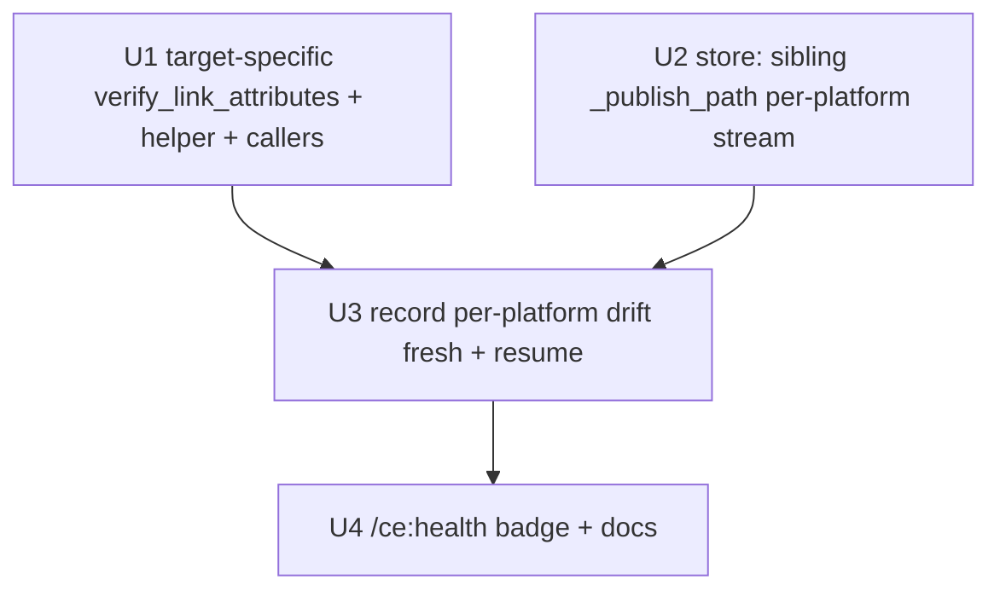

# feat: Canary Phase 2 — Advisory Forward-Path Drift (v1, minimal)

## Overview

The adapter-contract canary v1 (PR #268, merged `7bbaf11`) watches **decay** of
seeded evergreen posts but is blind to **forward publish-path drift** — a
platform that strips `rel`/mangles/removes the anchor on *new* publishes while
old posts stay intact. This plan closes that gap **advisory-only** and **with no
new fetch**: the adapters that already run `verify_link_attributes(published_url)`
at publish time get a **target-specific** verdict (today it is page-wide), and
`publish-backlinks`/`--resume` **record a per-platform forward-path drift signal**
(separate from evergreen decay) plus a loud WARNING and a `/ce:health` badge.

This is a deliberately **minimal v1**. Three things the brainstorm discussed are
**explicitly deferred** to a follow-up (see Scope Boundaries) after three review
passes converged on "ship the smallest useful slice first": `hard_skip`
gating/quarantine of real publishing (brainstorm R6/R7), and extending the
adapters that do **not** already compute the signal (blogger/ghpages/telegraph —
brainstorm R4 full-cohort coverage). v1 is detect-and-surface only.

> **Design history:** an earlier draft proposed a *new* `verify_published` fetch
> (review found it rebuilt detection adapters already do, worse — SSRF surface,
> blind to client-rendered `rel`, presence-gate hid href-rewrite). A second draft
> consumed the existing signal but over-built (nested store wiped by
> `record_verdict`, unbounded per-target growth, gating machinery, new fetches on
> non-computing adapters). This v1 keeps only the advisory spine. (see origin:
> `docs/brainstorms/2026-05-27-canary-phase2-publish-path-validation-requirements.md`)

## Problem Frame

`verify_link_attributes(url)` (`link_attr_verifier.py`) fetches the live page once
(against the **rendered** page for browser adapters) and returns page-wide
`{nofollow_anchors, nofollow_detected, ...}`. Adapters `medium_api`,
`medium_brave`, `medium_browser`, `velog_graphql`, the `http_form_post` family,
and `livejournal_api` (via `attach_link_verification`) stash it in
`_provider_meta['link_attr_verification']`; `to_publish_output` →
`carry_link_attr_verification` emits it on the output row. **Two gaps:**
(1) `nofollow_detected` is **page-wide** — `True` if *any* anchor on the page is
nofollow (footer/nav/share), not the operator's backlink, so it can't be used as
a per-target drift signal; (2) the verdict is emitted but **nothing records or
trends it** per platform.

## Requirements Trace

- R1. Make the adapter link-attr verdict **target-specific**: report whether the operator's own required backlink(s) carry `rel=nofollow`, are rewritten, or are missing — distinct from the page-wide `nofollow_detected`.
- R2. Derive **one per-platform forward-path verdict per publish** by OR-ing the target results across the row's required links, and record it — **no new fetch** (rides the verdict adapters already attach).
- R3. Keep the forward-path signal in a store stream **separate** from evergreen decay; neither stream may clear or overwrite the other (origin R3/R7, recording dimension).
- R4. Cover the adapters that **already compute** the signal (medium\*, velog, http_form_post family, livejournal). *(Extending blogger/ghpages/telegraph is deferred — Scope Boundaries.)*
- R5. Fail-safe: a `skipped` verdict (fetch error / draft) records **nothing** (`unverifiable`). A **readable** page where the operator's anchor is present-but-nofollow, rewritten, or **missing** is drift. Debounce with the existing N=2 threshold.
- R6. **Advisory only**: record the per-platform signal, emit a loud WARNING, and count it in the run epilogue. v1 does **not** gate/skip/quarantine real publishing.
- R7. Record on **both** the fresh (`publish_backlinks`) and `--resume` (`_resume`) publish paths, so resumed re-publishes aren't a blind spot.
- R8. Surface the per-platform forward-path state distinctly from evergreen decay on `/ce:health`.

## Scope Boundaries

- **No new fetch** — only consume the verdict adapters already compute; **no `verify_published` change, no new HTTP**.
- **Advisory only** — **no** `hard_skip`, **no** quarantine gating of real publishing, **no** `_canary_gate` change, **no** run-start snapshot. (Deferred follow-up: brainstorm R6/R7.)
- **Coverage limited** to adapters already computing the signal. **Deferred follow-up:** extend blogger/ghpages/telegraph — each needs a *new* post-publish fetch and must first resolve (a) ghpages serves **raw markdown** at the raw URL (no `<a>` tags) + Jekyll build-lag at the rendered URL, (b) telegraph attribute-stripping, (c) the **unguarded** `verify_link_attributes` fetch (`_http.get`, no SSRF guard — unlike `inspect_target_anchor`'s preflight opener) should be hardened before widening it to more adapters.
- **Per-platform** granularity (not per-target) — matches the brainstorm and avoids unbounded `canary-health.json` growth from high-cardinality `work_url`s.
- Not a replacement for v1 evergreen (`canary-targets` keeps watching decay); additive.
- Not a new CLI verb.

## Context & Research

> Grounded read-only against `origin/main` (`7bbaf11`) blobs. The local
> `backlink-publisher/` checkout is behind `origin/main` and dirty with unrelated
> concurrent WIP; **execution must branch off freshly-pulled `origin/main`** and
> must not touch others' WIP.

### Relevant Code and Patterns

- `publishing/adapters/link_attr_verifier.py` — `verify_link_attributes(url, *, timeout)` returns page-wide fields or `{verification: "skipped", reason}`. Pure tag helpers exist: `_tag_has_nofollow`, `_tag_href`, `_tag_rel`, `_rel_is_nofollow`, `_unwrap_interstitial`, `_canonicalize_for_match`, `_A_TAG_RE`. `inspect_target_anchor` (lines 181-269) shows the target-match loop to reuse. **Caveat:** `_http.get` here is **not** SSRF-guarded (out of scope for v1 since no new fetch is added).
- `publishing/adapters/base.py` — `carry_link_attr_verification(out, source)` copies `_provider_meta['link_attr_verification']` onto the output row, forwarding the whole dict (so new target fields ride along) on both fresh and resume emitters. `AdapterResult._provider_meta` carries it.
- Call sites already computing it: `medium_api.py:202`, `medium_brave.py:422`, `medium_browser.py:351`, `velog_graphql.py:698`, `http_form_post.py:211` (`attach_link_verification`), and `livejournal_api.py` (calls `attach_link_verification`). **`attach_link_verification` is the shared helper for the http_form_post family + livejournal — it must gain the `target_urls` parameter too.**
- `canary/store.py` — **`record_verdict._apply` does `current[platform] = {…6 keys…}` — it REPLACES the platform record.** Therefore the forward-path stream must be a **sibling top-level key** (e.g. `data["_publish_path"][platform]`), never nested under the platform record. Reuse the `_apply` debounce arithmetic (N=2/M=2); map verdicts to `STATUS_LINK_ALIVE`/`STATUS_DRIFT_CONFIRMED` (other strings no-op `_apply`). Atomic 0o600.
- `cli/publish_backlinks.py` (fresh loop, ~line 272 `outputs.append(result.to_publish_output(row, ts))`) and `cli/_resume.py` (`_run_resume`, calls `adapter_publish` then `_do_verify`/`checkpoint.update_item`) — **both** must record. `_resume` re-publishes fresh, so `result._provider_meta` is freshly computed there (it is not persisted across the checkpoint, but the re-publish recomputes it).
- Required-link source: `[lnk["url"] for lnk in row.get("links", []) if lnk.get("required")]` (the same list `_do_verify` reads) — kinds main_domain/target/category/detail, several per row — **not** the single top-level `target_url`.
- `cli/_publish_helpers.py` `_publish_epilogue` — add `publish_path_drift_count`.

### Institutional Learnings

- `[[feedback_grep_dofollow_map_before_shipping_adapter]]` / `_nofollow_rationales.py` documents the "R4 canary loop"; v1 automates its trend-recording half.
- `[[feedback_atomic_write_canonical_for_secrets]]` — store stays 0o600 via `safe_write.atomic_write`.
- `[[feedback_mock_patch_paths_after_extraction]]` — updating `verify_link_attributes`/`attach_link_verification` signatures means updating `mock.patch` targets in adapter tests.
- `[[feedback_invert_drift_check_when_invariant_becomes_dynamic]]` — fail-safe on `skipped`, debounce before flagging.
- Dropped-verdict seam lesson (v1 PR #222 class): the recorder must canonicalize the target identically to the matcher — mitigated here by recording **per platform** (key is the platform string, not a target URL), so no cross-component canonical-key divergence.

## Key Technical Decisions

- **Advisory-only v1, no new fetch, already-computing adapters only** (3-review convergence): smallest slice that detects + surfaces real forward-path drift; defers gating and new-fetch coverage.
- **Target-specific verdict** (page-wide gap): `verify_link_attributes` (and `attach_link_verification`) gain optional `target_urls`; when given, add `target_found`/`target_nofollow`/`target_rewritten` by matching the operator's canonicalized targets against anchors already parsed (reuse `inspect_target_anchor`'s loop). Page-wide fields preserved for existing consumers.
- **Per-platform verdict, OR over required links**: one verdict per publish — `drift` if **any** required target on a **readable** page is nofollow / rewritten / missing; `link-alive` if all present-and-dofollow; `unverifiable` (record nothing) if the verdict is `skipped`. Per-platform keeps the store bounded and sidesteps canonical-key divergence.
- **Sibling top-level store stream** (P0 fix): `data["_publish_path"][platform]` with its own debounce/re-arm — never nested under the platform record that `record_verdict` overwrites. Neither stream touches the other.
- **Missing-anchor-on-readable-page = drift** (not unverifiable): a stripped link is the strongest drift; only `skipped` fetches are `unverifiable`.

## Open Questions

### Resolved During Planning

- *New fetch or consume existing?* — Consume; and limit v1 to adapters that already compute it so "no new fetch" holds. (review-validated)
- *`nofollow_detected` usable directly?* — No, page-wide; make target-specific.
- *Nested or sibling store stream?* — **Sibling top-level** (`record_verdict` replaces the platform record — P0). 
- *Per-platform or per-target?* — Per-platform (bounded, matches brainstorm; OR over required links).
- *Resume coverage?* — Record on both fresh and `_resume` paths (R7).
- *Gating?* — Deferred; v1 is advisory-only.
- *`target_found=False` on a 200 page?* — Drift (link stripped), not unverifiable.

### Deferred to Implementation

- Exact target-field names/shape on the `verify_link_attributes` / `attach_link_verification` dict, and that `carry_link_attr_verification` forwards them unchanged on fresh + resume.
- How each call site reads the row's required-link list to pass as `target_urls` (the adapter has the payload).
- Telegraph already returns a populated `_provider_meta` (`anchors`/`utf8_bytes`/`downgrades`/`telegraph_path`) — *if* telegraph is ever added (deferred), merge into it, don't replace. (Not in v1.)
- `canary-health.json` layout for the sibling `_publish_path` stream + backward-compat defaults.

## High-Level Technical Design

> *Directional guidance for review, not implementation specification.*

```
adapter.publish(payload)                                  [EXISTING, already-computing adapters]
  └─ verify_link_attributes(url, target_urls=required links)   (U1: +target fields, no new fetch)
  └─ _provider_meta['link_attr_verification'] = verdict         [EXISTING carry]

publish-backlinks (fresh)  AND  _resume (_run_resume)         [BOTH record — R7]
  └─ result.to_publish_output(row) carries the verdict          [EXISTING]
  └─ U3: per-platform verdict = OR over required links:
         readable + (nofollow | rewritten | missing) → drift
         readable + all dofollow                     → link-alive
         skipped                                      → record nothing (unverifiable)
     record_publish_path_verdict(platform, drift|link-alive)    (U2: sibling _publish_path stream)
     loud WARN on drift; epilogue publish_path_drift_count
  └─ /ce:health reads the _publish_path stream, distinct badge  (U4)

NO gate change. NO hard_skip. (deferred follow-up)
```

## Implementation Units



- [ ] **Unit 1: Target-specific verdict + thread targets through existing callers**

**Goal:** Report whether the operator's own backlink(s) are nofollow/rewritten/missing, alongside the page-wide fields, with no extra fetch.

**Requirements:** R1

**Dependencies:** None

**Files:**
- Modify: `publishing/adapters/link_attr_verifier.py` (add optional `target_urls`; add `target_found`/`target_nofollow`/`target_rewritten`/`target_nofollow_urls` by matching canonicalized targets against parsed anchors, reusing the tag helpers + `inspect_target_anchor` loop)
- Modify: `publishing/adapters/http_form_post.py` `attach_link_verification` (thread `target_urls` through to `verify_link_attributes`) — covers http_form_post family **and** `livejournal_api`
- Modify call sites to pass required targets: `medium_api.py`, `medium_brave.py`, `medium_browser.py`, `velog_graphql.py`
- Test: `tests/test_link_attr_verifier.py` (extend)

**Approach:** keep page-wide return shape; add target fields only when `target_urls` given (`None` → output identical to today). A target reachable only via a rewritten/interstitial href → `target_found=True, target_rewritten=True`. Absent as an anchor → `target_found=False`.

**Patterns to follow:** `inspect_target_anchor` match loop (link_attr_verifier.py:181-269).

**Test scenarios:**
- Happy: target anchor dofollow → `target_found=True, target_nofollow=False`.
- Drift: target `rel=nofollow` → `target_nofollow=True` even when page-wide already True for unrelated links.
- Drift: target only via interstitial/rewritten href → `target_found=True, target_rewritten=True`.
- Drift: target absent as anchor (text only / stripped) → `target_found=False`.
- Edge: page has unrelated nofollow footer but target dofollow → page-wide `nofollow_detected=True` **but** `target_nofollow=False` (target-specificity proof).
- Edge: `target_urls=None` → identical to today (back-compat).
- Error: `verification="skipped"` → no target fields.

**Verification:** target fields isolate the operator's link from page-wide noise; page-wide consumers unaffected; all call sites (incl. `attach_link_verification`) pass the row targets.

- [ ] **Unit 2: Sibling per-platform forward-path stream in the store**

**Goal:** Record forward-path drift per platform in a stream the evergreen writer cannot wipe.

**Requirements:** R3

**Dependencies:** None (parallel to U1)

**Files:**
- Modify: `canary/store.py` (`record_publish_path_verdict(platform, status)`, `get_publish_path_health(platform)`, stored under a **sibling top-level** `_publish_path` key, not nested under the platform record; reuse `_apply` debounce)
- Test: `tests/test_canary_store.py` (extend)

**Approach:** `data["_publish_path"][platform] = {status, consecutive_failures, consecutive_oks, last_ok_at, last_drift_at}`. Map verdicts to `STATUS_LINK_ALIVE`/`STATUS_DRIFT_CONFIRMED` (others no-op `_apply`). Evergreen `record_verdict` writes `data[platform]` and is **untouched**; the two keyspaces are disjoint so neither overwrites the other.

**Patterns to follow:** existing `record_verdict` `_apply` closure + `_DEFAULT_RECORD` defaults.

**Test scenarios:**
- Happy: first `drift` for blogger → consecutive_failures=1.
- Edge: 2 consecutive `drift` → degraded; 2 `link-alive` → re-arm resets.
- Integration (P0 regression): call `record_verdict(blogger, link-alive)` then `get_publish_path_health(blogger)` — the forward-path record **survives** (evergreen write to `data["blogger"]` does not touch `data["_publish_path"]["blogger"]`), and vice versa.
- Edge: missing `_publish_path` key loads with defaults (no KeyError).
- Error: atomic 0o600 write preserved on simulated interruption.

**Verification:** streams are disjoint top-level keys; forward-path survives evergreen writes; file stays 0o600.

- [ ] **Unit 3: Record per-platform drift on fresh + resume paths (advisory)**

**Goal:** After each publish (fresh and resumed), compute one per-platform verdict from the carried target-specific signal and record it; loud WARN on drift; epilogue count. No gating.

**Requirements:** R2, R5, R6, R7

**Dependencies:** Units 1, 2

**Files:**
- Modify: `cli/publish_backlinks.py` (after `to_publish_output`, read `link_attr_verification`; OR over required links → one platform verdict; record; WARN on drift)
- Modify: `cli/_resume.py` (`_run_resume`: same recording after its `adapter_publish`)
- Modify: `cli/_publish_helpers.py` (`_publish_epilogue` gains `publish_path_drift_count`; optionally a small shared helper so fresh + resume stay identical)
- Test: `tests/test_publish_backlinks.py`, `tests/test_publish_resume.py` (extend)

**Approach:**
- Verdict reduction: on a **readable** verdict (`verification="ok"`), `drift` if any required link is `target_nofollow` OR `target_rewritten` OR (`target_found=False`); else `link-alive`. On `verification="skipped"` → record nothing (R5).
- Advisory: never changes exit code, never marks the post `_unverified` (the post published; only its link drifted). Record in **both** loops (R7).
- Extract a tiny shared `_record_publish_path(platform, verdict, required_links)` used by both call sites so they can't diverge.

**Test scenarios:**
- Happy: all-dofollow publish → link-alive recorded, no WARN.
- Drift (nofollow): → drift recorded, WARN names platform + offending link, exit code unchanged.
- Drift (stripped): readable 200, required link absent as anchor → drift (not unverifiable).
- Edge: `skipped` verdict → nothing recorded.
- Edge: multi-link row, one nofollow + one dofollow → platform verdict = drift (OR).
- Integration (R7): a row re-published via `--resume` records the forward-path verdict (not just the fresh loop).
- Edge: `--dry-run` → adapters don't verify → nothing recorded.

**Verification:** real nofollow/stripped publish surfaces as advisory drift on both paths without failing the run; skipped never false-positives; epilogue reports the count.

- [ ] **Unit 4: Surface on `/ce:health` + docs**

**Goal:** Show per-platform forward-path drift distinctly from evergreen decay; document v1 + the deferred follow-up.

**Requirements:** R8

**Dependencies:** Unit 2 (and 3 for live data)

**Files:**
- Modify: `webui_app/routes/health.py`, `webui_app/templates/health.html` (read `get_publish_path_health`; distinct badge)
- Modify: `AGENTS.md`; append to `docs/runbooks/2026-05-27-canary-targets-operations.md` (forward-path vs evergreen; note advisory-only + the deferred gating/coverage follow-up)
- Test: `tests/` health route test (extend the v1 canary-card test)

**Approach:** read the sibling `_publish_path` stream alongside the evergreen record; render both so the operator distinguishes "old post decayed" from "new publishes nofollowed."

**Test scenarios:**
- Happy: platform with forward-path drift shows a distinct badge from evergreen status.
- Edge: platform with no forward-path data shows neutral/"n/a" (no crash on missing key).

**Verification:** `/ce:health` renders the two states separately; docs updated.

## System-Wide Impact

- **Interaction graph:** already-computing adapters attach the verdict → carried on result → `publish_backlinks` **and** `_resume` record per-platform → `canary/store.py` sibling `_publish_path` stream → read by `/ce:health`. `canary-targets` (evergreen), `verify_published`, and `_canary_gate` are **untouched**.
- **Error propagation:** advisory — never raises, never changes exit code, never marks a post `_unverified`. `skipped` records nothing.
- **State lifecycle risks:** the P0 (evergreen `record_verdict` replacing the platform record) is avoided by the sibling top-level key; U2 has an explicit interleave regression test. Per-platform keying keeps the store bounded.
- **API surface parity:** `verify_link_attributes` + `attach_link_verification` gain an optional kwarg (back-compat); the `link_attr_verification` dict gains target fields forwarded verbatim by `carry_link_attr_verification` on fresh + resume. Update `mock.patch` targets in adapter tests.
- **Unchanged invariants:** evergreen `record_verdict`/`is_quarantined`/`canary-targets`; `_canary_gate`/`verify_published`/`_do_verify`; page-wide `nofollow_detected`/`blank_ratio`; exit-code contract; no publishing is gated/skipped in v1.

## Risks & Dependencies

| Risk | Mitigation |
|------|------------|
| Evergreen `record_verdict` replaces the platform record, wiping a nested stream (P0) | Forward-path is a **sibling top-level** `_publish_path` key; U2 interleave regression test |
| Page-wide `nofollow_detected` misused → false positives | Verdict keys off the **target-specific** fields only (U1) |
| Unbounded `canary-health.json` growth from high-cardinality targets | **Per-platform** recording (one key per platform), OR over the row's links |
| Status-vocab mismatch silently no-ops the debounce | U2 maps to `STATUS_LINK_ALIVE`/`STATUS_DRIFT_CONFIRMED`; test asserts degrade trips at N=2 |
| Resume re-publishes record nothing | U3 records on **both** `publish_backlinks` and `_resume` (R7) |
| Stripped link read as "unverifiable" → never flagged | Missing-anchor-on-readable-page is classified as **drift** (R5/U3) |
| Re-introducing a new fetch / SSRF surface / ghpages raw-markdown false drift | v1 covers **only** adapters already computing the signal; blogger/ghpages/telegraph + their fetch/SSRF/markdown issues are **deferred** |
| Local checkout behind+dirty | Branch off freshly-pulled `origin/main` `7bbaf11`; don't touch concurrent WIP |

## Documentation / Operational Notes

- AGENTS.md: publish records per-platform forward-path drift from the adapter link-attr verdict (advisory; no gating in v1).
- Runbook: append "forward-path drift vs evergreen decay" + explicitly note v1 is advisory-only and that gating + blogger/ghpages/telegraph coverage are a planned follow-up.
- Post-deploy: watch `publish-backlinks`/`--resume` logs for forward-path drift WARNs and `publish_path_drift_count`; healthy = none.

## Deferred Follow-up (not in this plan)

- **Gating/quarantine** (brainstorm R6/R7): a `publish_path_hard_skip` knob + run-start batch-admission snapshot in `_canary_gate`, once advisory data proves the signal and an operator wants suppression. Carries a denial-of-publishing trade-off (third-party-HTML-derived signal).
- **Full-cohort coverage** (brainstorm R4): extend blogger/ghpages/telegraph — each adds a *new* post-publish fetch; must first resolve ghpages raw-markdown/build-lag, telegraph attribute-stripping, and hardening `verify_link_attributes`' unguarded `_http.get` against SSRF before widening it.

## Sources & References

- **Origin document:** `docs/brainstorms/2026-05-27-canary-phase2-publish-path-validation-requirements.md`
- Canary v1: PR #268 (merged `7bbaf11`).
- Existing signal: `link_attr_verifier.verify_link_attributes`, `base.carry_link_attr_verification`/`AdapterResult._provider_meta`, `http_form_post.attach_link_verification`; call sites medium_api/medium_brave/medium_browser/velog_graphql/livejournal_api.
- Integration: `cli/publish_backlinks.py`, `cli/_resume.py`, `cli/_publish_helpers.py` (`_publish_epilogue`); `canary/store.py`.
