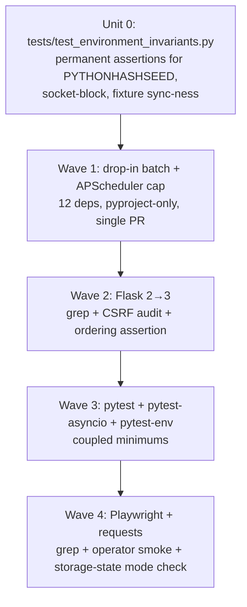

# refactor: Upgrade pyproject direct deps to latest stable

## Overview

Bump every `>=` direct dependency in `pyproject.toml` (runtime + dev) to the current latest stable floor, batched into **four sequenced PRs** ordered by blast radius (post-deepening pivot: Wave 5's one-line APScheduler cap was folded into Wave 1 — both are pyproject-only edits with zero source touch and no defensive reason to separate). The two exact-pinned deps (`radon==6.0.1`, `webwright==0.0.7`) are explicitly out of scope. The goal is to retire stale `>=2.0` / `>=1.0` floors that no longer reflect reality, lock out a known-dangerous major (`apscheduler==4.0` is still alpha), and absorb breaking changes deliberately rather than discovering them when a transitive resolves to a new major.

A single-PR "big-bang" alternative was considered and rejected for waves 2-4 (Flask 3, pytest framework, Playwright + requests) — see [Alternative Approaches Considered](#alternative-approaches-considered) for the comparison and the rationale.

## Problem Frame

The repo has been carrying loose `>=` floors that predate two years of upstream churn. Three concrete consequences:

1. **Hidden upgrade traps.** `flask>=2.0` permits Flask 3.x, which silently removed `before_first_request`, `FLASK_ENV`, `JSON_AS_ASCII`, `JSON_SORT_KEYS`, `session_cookie_name`, `send_file_max_age_default`, `propagate_exceptions`, and `templates_auto_reload`. We don't know whether we use any of these without a deliberate audit.
2. **No upper bound on dangerous majors.** `apscheduler>=3.10` would happily resolve `4.0.0a1` if a transitive forces a `pip install --upgrade`. APScheduler 4 is a ground-up async rewrite with an incompatible jobstore schema. We need an explicit `<4` cap.
3. **Coupled minimum-version traps.** `pytest-asyncio>=0.23` is now several years behind; the `0.23 → 1.1` jump requires `pytest>=8.4` as a hard floor. Bumping one without the other will dead-lock pip resolution or, worse, leave the suite running against deprecated event-loop semantics.

There is no related upstream brainstorm — this plan is initiated directly. The upgrade scope was tightened in conversation to: only the pyproject `direct` deps, leave the two exact pins alone.

## Requirements Trace

- **R1.** All `direct` deps in `[project] dependencies` and `[project.optional-dependencies] dev` (excluding `radon` and `webwright`) move to a current stable floor.
- **R2.** Every upgrade preserves green CI on the Python 3.11 + 3.12 matrix.
- **R3.** `PYTHONHASHSEED=0` continues to be injected via `pytest-env` so the footprint regression gate remains armed.
- **R4.** The `_global_csrf_guard` app-level `before_request` hook continues to fire before all blueprint handlers after the Flask 3 bump.
- **R5.** APScheduler 4.x (alpha) is excluded by an explicit upper bound; we stay on 3.x.
- **R6.** No SLOC rebaseline — `radon==6.0.1` does not move, so `monolith_budget.toml` (9 entries) and `tests/fixtures/sloc_canary.py:SLOC_CANARY_EXPECTED` are not touched.
- **R7.** Each wave is independently revertable as a single PR.

## Scope Boundaries

**In scope:**
- `[project] dependencies` (11 direct runtime deps — `tomli` is environment-marker-gated for `python_version<'3.11'` so never resolves under our `requires-python = ">=3.11"`, but the line still counts)
- `[project.optional-dependencies] dev` (8 dev deps minus `radon`, including the bare `requests` entry that overlaps the runtime `requests` — see Unit 4)
- `pyproject.toml` floor updates
- `.github/workflows/ci.yml` only if a Python matrix tweak is needed (none expected)

**Out of scope (explicit non-goals):**
- `radon==6.0.1` — bump is a separate plan (multi-file SLOC rebaseline)
- `webwright==0.0.7` — rapid-iteration upstream, manual changelog review owns this
- `dev-webwright` optional extra
- Transitive dep version pins (Werkzeug, urllib3, itsdangerous, blinker) — these float with their parents; we only bump direct floors
- Python 3.13 to the CI matrix (separate concern)
- Replacing any dep with an alternative library
- Cleaning up the unused `pytest-asyncio` declaration (decided to keep + bump defensively — see Open Questions)

## Context & Research

### Relevant Code and Patterns

- `backlink-publisher/pyproject.toml` — single source of truth for all floors; `[project]` runtime deps + `[project.optional-dependencies] dev` + `[tool.pytest.ini_options] env`.
- `backlink-publisher/webui_app/__init__.py:create_app()` — Flask app factory with `_global_csrf_guard` `before_request` hook (added PR #143). Cookie config: `SESSION_COOKIE_SECURE/HTTPONLY/SAMESITE`. **Sensitive to Flask 3 hook-ordering semantics.**
- `backlink-publisher/webui_app/scheduler.py` — APScheduler 3 `BackgroundScheduler` module-level singleton with `executors.pool.ThreadPoolExecutor`, `jobstores.base.JobLookupError`, started conditionally (skipped under pytest).
- `backlink-publisher/src/backlink_publisher/http.py` — shared `requests.Session` with `urllib3.util.retry.Retry(status_forcelist=(429,502,503,504))` and `HTTPAdapter`. Couples `requests` to `urllib3` directly.
- 33 playwright sites (sync API only) — top: `publishing/adapters/medium_browser.py`, `medium_auth.py`, `medium_liveness.py`, `publishing/browser_publish/dispatcher.py`, `publishing/browser_publish/_chrome_session_impl.py`, `cli/_bind/_driver_impl.py`, `cli/_bind/recipes/medium.py`. **`mock.patch` string targets pin import paths.**
- `backlink-publisher/tests/conftest.py` — 4 autouse fixtures (config-dir sandbox, URL pass, content fetch pass, socket block via `pytest-socket disable_socket(allow_unix_socket=True)`).
- `backlink-publisher/tests/fixtures/sloc_canary.py:SLOC_CANARY_EXPECTED` + `tests/test_no_monolith_regrowth.py` — pinned to `radon==6.0.1`, **untouched by this plan**.

### Institutional Learnings

- `docs/solutions/best-practices/app-level-csrf-guard-makes-blueprint-csrf-dead-code-2026-05-27.md` — `_global_csrf_guard` runs before blueprint `before_request`; any Flask major bump that re-orders hooks silently flips CSRF protection. Test factory must construct a fresh app per test.
- `docs/solutions/test-failures/del-os-environ-poisons-session-scoped-config-dir-fixture-2026-05-27.md` — 7 tests pass alone but fail in full suite due to session-scoped autouse pollution. **Any pytest bump must be validated with both isolated and full-suite runs.**
- `docs/solutions/test-failures/pyyaml-int-coerces-all-digit-sha-2026-05-20.md` — PyYAML int-coerces all-digit YAML scalars (5% of 7-char SHAs trip this). Bumping PyYAML must re-run `plan-claims-gate` fixtures.
- `docs/solutions/logic-errors/playwright-framenavigated-orphaned-during-cross-origin-sso-2026-05-19.md` — Page-ref drift during SSO; no automated coverage. Playwright bumps require manual smoke for medium/Google bind.
- `docs/solutions/logic-errors/argparse-choices-vs-usage-error-exit-clash-2026-05-20.md` — argparse exit-code drift across Python minors; CI shell smoke is the only tripwire.
- `docs/solutions/best-practices/extract-cli-epilogue-block-2026-05-26.md` — Reminder: bumping radon = re-measure all 9 monolith ceilings + `SLOC_CANARY_EXPECTED`. Confirms radon is out of scope here.

### External References

- [Flask 3.0 changelog](https://flask.palletsprojects.com/en/stable/changes/) — removed APIs list
- [APScheduler 4.0 status](https://github.com/agronholm/apscheduler/issues/465) — confirmed alpha, "do NOT use in production"
- [pytest 8.0 release notes](https://docs.pytest.org/en/stable/announce/release-8.0.0.html) — async autouse fixture warning
- [pytest-asyncio 1.0 migration](https://thinhdanggroup.github.io/pytest-asyncio-v1-migrate/) — `event_loop_policy` deprecation, pytest 8.4 floor
- [Playwright Python release notes](https://playwright.dev/python/docs/release-notes) — `page.accessibility` removal, `expose_binding(handle=...)` removal in 1.60, macOS 14 WebKit removed
- [requests 2.32 HISTORY](https://github.com/psf/requests/blob/main/HISTORY.md) — `_get_connection` → `get_connection_with_tls_context`, header typing tightened

## Key Technical Decisions

- **Sequence by blast radius for the risky waves; consolidate the trivial ones.** Waves 2-4 (Flask 3 audit, pytest framework, Playwright + requests) stay sequenced because each has a genuinely different review surface and risk profile (CSRF ordering, test-framework deprecations, credential-touching browser code). Wave 1 absorbs **all drop-ins plus the APScheduler `<4` cap** as one pyproject-only PR — folding the former Wave 5 in saves one ceremony PR without changing risk. Big-bang of waves 2-4 was rejected (see Alternative Approaches Considered). Rationale: attribution clarity matters where bug-hunting is expensive, but ceremony PRs that only edit one toml line are net cost.

- **Couple pytest + pytest-asyncio + pytest-env into a single PR.** pytest-asyncio's documented coupling to pytest is the load-bearing claim here. **Confidence caveat (E4 from deepening):** the plan cites the pytest-asyncio 1.0 migration guide; the exact 1.1 install_requires floor is verified at PR time by reading `pytest-asyncio==1.1.x` PyPI metadata. If the actual floor is weaker than `pytest>=8.4`, splitting Wave 3 is acceptable — but the default plan respects the coupling rather than fighting it.

- **Cap APScheduler at `<4` in Wave 1 even though we're not bumping the floor.** Without an upper bound, a future `pip install --upgrade` or transitive force could pull 4.0.0a1 (alpha, breaking). Rationale: the cap is free insurance; the alpha is explicitly labelled "do NOT use in production" upstream. Folded into Wave 1 because both are zero-source-touch pyproject edits.

- **Keep `pytest-asyncio` declared even though no `@pytest.mark.asyncio` markers exist in the tree.** Playwright may pull async indirectly; removing the dep is a separate decision needing its own grounding. **Deepening note (E4):** the defensive `asyncio_mode = "strict"` addition is acknowledged as configuration ahead of a consumer. The implementer at Wave 3 time should run `grep -rn "@pytest.mark.asyncio\|asyncio_default_fixture_loop_scope" tests/` to confirm zero hits and either (a) drop pytest-asyncio entirely as a follow-up PR scoped narrowly, or (b) keep the defensive config. The plan does not block on this decision — it's deferred to the implementer with evidence.

- **Audit Flask 3 removals by grep, not by changelog reading alone.** Eight specific symbols were removed (`before_first_request`, `FLASK_ENV`/`ENV`, `JSON_AS_ASCII`, `JSON_SORT_KEYS`, `session_cookie_name`, `send_file_max_age_default`, `propagate_exceptions`, `templates_auto_reload`). Rationale: a deterministic grep catches uses the changelog reader might gloss over.

- **No Werkzeug / urllib3 / itsdangerous floor pins.** They are transitive, float with their direct parents. Rationale: pinning transitives compounds maintenance cost and competes with `pip`'s resolver.

## Open Questions

### Resolved During Planning

- **Should `pytest-asyncio` be dropped since zero `@pytest.mark.asyncio` markers exist?** No — keep declared, add `asyncio_mode = "strict"` defensively. Dropping it is a separate scope decision.
- **Should `radon` move?** No — that's a multi-file SLOC rebaseline plan (`tests/fixtures/sloc_canary.py:SLOC_CANARY_EXPECTED` + 9 `monolith_budget.toml` ceilings). Explicit non-goal here.
- **Should we bump to Playwright 1.60 (latest) or 1.55 (one minor back)?** Plan targets `>=1.55` as floor; an implementer may pick the latest 1.x available at PR time, provided the two removed-API greps come back clean.
- **Should we cap Flask at `<4`?** Yes — `flask>=3.1,<4` to mirror the APScheduler defensive cap pattern.

### Deferred to Implementation

- **Exact final version each pip resolver picks.** The plan specifies floors; whichever sub-version `pip` resolves at PR time is acceptable provided the suite is green. **Each wave's PR description must include the output of `pip freeze | grep -E "<dep>"` for the bumped deps as a lock-file artifact**, so resolver state is captured per-PR and attribution can be reconstructed later (see O5 from deepening; lighter than introducing `pip-compile`/`uv lock` mid-campaign).
- **Whether any Flask 3 removed-API grep returns a hit.** If grep finds usage, the implementer adds the migration to the Wave 2 PR rather than escalating.
- **Whether pytest 8's async-autouse warning surfaces.** All 4 autouse fixtures are believed sync; verify at run time. If any are async, convert.
- **Whether `requests` 2.32 header-typing change touches any adapter.** Only matters if anyone subclassed `HTTPAdapter`; `src/backlink_publisher/http.py` uses `HTTPAdapter()` directly without subclass. Verify at code-touch time.
- **CI matrix tweak.** Plan assumes the current 3.11/3.12 matrix is preserved. If `google-auth-oauthlib>=1.4` requires `>=3.10` and CI is already on 3.11+, no action — but verify.
- **Real install_requires floor of pytest-asyncio 1.1.** Verified at Wave 3 PR time by reading the PyPI metadata; if the actual coupling is weaker than `pytest>=8.4`, the implementer may split pytest from pytest-asyncio.

## Alternative Approaches Considered

- **Single big-bang PR for all 19 deps.** Considered. **Rejected for waves 2-4** because: (a) Flask 3's `_global_csrf_guard` interaction is the highest-risk wave by the plan's own admission — bundling it with playwright/requests/pytest-framework bumps would defeat `git bisect` granularity when (not if) a CSRF subtlety surfaces in production; (b) Wave 4's operator manual smoke is a hard merge gate that physically requires sitting in front of a browser running medium SSO — bundling it into a 19-dep PR delays everything until the operator is available; (c) reviewer attention is finite — three distinct review surfaces (security/Flask, test framework, credential-handling) benefit from being three reviews, not one mega-review. **Accepted partially** by folding Waves 1 and 5 (both pyproject-only single-line edits) into one PR. Net: 4 PRs instead of 5, single-PR ceremony cost paid only for the genuinely risky bumps.

- **Generate a lockfile** (`pip-compile`, `uv lock`, or `poetry.lock`) **as part of this plan.** Considered. **Deferred** because introducing a lockfile mid-campaign would itself be a multi-PR migration (touches CI, contributor docs, `make setup`, all `bp-*/` worktrees). The plan addresses resolver drift with a lighter mitigation: each PR description captures `pip freeze` of bumped deps as an artifact. Migrating to a real lockfile is a follow-up plan.

- **Drop `pytest-asyncio` entirely** since zero `@pytest.mark.asyncio` markers exist. Considered. **Deferred to the Wave 3 implementer** with explicit evidence-gathering (grep at PR time). The plan's default is to retain + bump defensively; the implementer may pivot to drop if Wave 3 verification confirms zero downstream consumers.

- **Fold the APScheduler `<4` cap into Wave 1.** Adopted. The cap is a zero-source-touch pyproject edit with no technical dependency on any other wave; gating it behind 4 sequential PRs added 3-5 days of calendar time and 4 CI runs for no defensive benefit. The "lock the door last" framing was aesthetic.

## High-Level Technical Design

> *This table illustrates the intended upgrade landscape and is directional guidance for review, not implementation specification. The implementing agent should treat it as context, not version numbers to mechanically apply.*

**Verdict legend:**
- **drop-in** — bump the floor only; no source edits and no pyproject ini-options changes expected.
- **requires audit** — bump the floor + grep/audit specific symbols + apply migrations in the same PR if hits exist.
- **requires-code-change** — bump the floor + a non-source edit elsewhere in the PR (typically a `[tool.pytest.ini_options]` addition or pyproject metadata change), not necessarily a Python source edit.

| Dep | Current floor | Target floor | Wave | Verdict | Top risk |
|---|---|---|---|---|---|
| markdown-it-py | `>=3.0` | `>=4.2` | 1 | drop-in | none — single call site, idiomatic |
| google-api-python-client | `>=2.0` | `>=2.196` | 1 | drop-in | none — tiny surface |
| google-auth-oauthlib | `>=1.0` | `>=1.4` | 1 | drop-in | requires Py≥3.10 (already on 3.11+) |
| google-auth-httplib2 | `>=0.2` | `>=0.2` | 1 | drop-in | transitive helper |
| websocket-client | `>=1.6` | `>=1.9` | 1 | drop-in | single call site, factory-injected |
| beautifulsoup4 | `>=4.12` | `>=4.13` | 1 | drop-in | `html.parser` only, stdlib parser |
| pyyaml | `>=6.0` | `>=6.0.3` | 1 | drop-in | re-run plan-claims-gate fixtures |
| pytest-mock | (none) | `>=3.15` | 1 | drop-in | ~9 test sites only |
| pytest-timeout | (none) | `>=2.4` | 1 | drop-in | one test site |
| pytest-socket | (none) | `>=0.7` | 1 | drop-in | `disable_socket(allow_unix_socket=True)` kwarg must survive |
| hypothesis | `>=6.0` | `>=6.151` | 1 | drop-in | 3 test files, idiomatic |
| flask | `>=2.0` | `>=3.1,<4` | 2 | requires audit | 8 removed APIs to grep; `_global_csrf_guard` ordering |
| pytest | `>=7` | `>=8.4` | 3 | mostly drop-in | async autouse warning; full+isolated suite runs |
| pytest-asyncio | `>=0.23` | `>=1.1,<2` | 3 | requires-code-change | `event_loop_policy` deprecated; mode flip |
| pytest-env | `>=1.1` | `>=1.6` | 3 | drop-in | preserve `env = ["PYTHONHASHSEED=0"]` syntax |
| playwright | `>=1.40` | `>=1.55` | 4 | drop-in for our usage | grep removed APIs + manual SSO smoke |
| requests | `>=2.28` | `>=2.32.4` | 4 | drop-in | only if anyone subclasses `HTTPAdapter` (we don't) |
| apscheduler | `>=3.10` | `>=3.11,<4` | 1 | floor cap only | 4.0 alpha must be excluded |

Waves are sequential because each must land green before the next is attempted. Within a wave, the changes are atomic. **Unit 0 is a prerequisite** — it lands the permanent invariant tests *before* Wave 1, so every subsequent wave inherits a re-armed gate (instead of relying on throwaway introduce-then-revert checks).

## Implementation Units

- [ ] **Unit 0: Permanent environment-invariant test file**

**Goal:** Land `tests/test_environment_invariants.py` with permanent assertions for `PYTHONHASHSEED=0`, socket-block fixture activation, and conftest autouse-sync invariant. This file is the re-armed gate that every subsequent wave inherits — replaces the prior plan's "introduce-then-revert throwaway" pattern (O6 from deepening).

**Requirements:** R3 (pre-armed); supports R2 (CI gate strength)

**Dependencies:** none (prerequisite for Unit 1)

**Files:**
- Create: `backlink-publisher/tests/test_environment_invariants.py`

**Approach:**
- Add three permanent assertion tests:
  - `test_pythonhashseed_is_zero`: `assert os.environ.get("PYTHONHASHSEED") == "0"` — proves pytest-env injection is live across any framework bump.
  - `test_socket_block_is_armed`: attempt a non-loopback `socket.socket(...).connect()` and assert `pytest_socket.SocketBlockedError` (or `OSError`) raises — proves the autouse `disable_socket(allow_unix_socket=True)` fixture is active.
  - `test_conftest_autouse_fixtures_are_sync`: introspect `tests/conftest.py` via the pytest plugin manager / inspect.iscoroutinefunction to assert all 4 autouse fixtures are sync `def`, not `async def` — fails loudly under pytest 8 if anyone converts one without thinking.
- File should follow the existing test style; no imports of bumped deps yet.

**Patterns to follow:**
- Existing test files under `backlink-publisher/tests/` for file structure and assertion style.

**Test scenarios:**
- Happy path: `pytest tests/test_environment_invariants.py` exits 0 on Python 3.11 and 3.12 before any wave begins.
- Error path: deliberately set `PYTHONHASHSEED=1` and confirm `test_pythonhashseed_is_zero` fails (one-time local sanity check; do not commit).
- Edge case: confirm the file collects under `pytest --collect-only` and runs in <100ms (these are smoke tests, not behavioral tests).

**Verification:**
- File lands as a standalone PR (no pyproject changes).
- `pytest tests/test_environment_invariants.py` green.
- File is referenced from later units as the regression tripwire.

---

- [ ] **Unit 1: Wave 1 — Drop-in batch upgrade + APScheduler `<4` cap**

**Goal:** Bump 12 pyproject lines (11 drop-in deps + APScheduler upper-bound cap) in a single PR. Establish baseline that "the easy ones are done" so later waves are unambiguously attributable. Zero source-code edits expected.

**Requirements:** R1, R2, R3, R5, R6, R7

**Dependencies:** Unit 0 (environment invariants armed)

**Files:**
- Modify: `backlink-publisher/pyproject.toml` (lines under `[project] dependencies` and `[project.optional-dependencies] dev`, including the apscheduler upper-bound cap)
- Test: full `pytest tests/` run is the verification artifact — no new test file needed

**Approach:**
- Edit `pyproject.toml` to bump floors per the design table for Wave-1 rows (markdown-it-py, google-api-python-client, google-auth-oauthlib, google-auth-httplib2, websocket-client, beautifulsoup4, pyyaml, pytest-mock, pytest-timeout, pytest-socket, hypothesis) **plus** apply the `apscheduler>=3.11,<4` cap.
- **Per-dep changelog spot-check (E2 from deepening):** before pushing, the implementer fetches and skims the upstream release notes for each `Wave 1` dep that crosses a major or significant minor boundary. Specifically: `markdown-it-py 3.x → 4.x` (major — verify CommonMark renderer surface unchanged for our `MarkdownIt("commonmark").enable(["table", "strikethrough"])` usage) and `beautifulsoup4 4.12 → 4.13` (entity-decoding history — verify `BeautifulSoup(text, "html.parser")` outputs match). Drop verdict to "requires audit" in the design table if any non-trivial behavior change is found.
- `pip install -e ".[dev]"` in `backlink-publisher/.venv` to resolve.
- Capture `pip freeze | grep -iE "markdown-it-py|google-api|google-auth|playwright|requests|websocket-client|beautifulsoup4|flask|apscheduler|pyyaml|pytest|hypothesis|radon"` to the PR description (lock-file artifact per O5).
- Run full suite under `PYTHONHASHSEED=0` (handled by pytest-env).
- Re-run `plan-claims-gate` fixtures specifically to surface any PyYAML int-coercion regression on SHA scalars.

**Patterns to follow:**
- `docs/solutions/test-failures/pyyaml-int-coerces-all-digit-sha-2026-05-20.md` for PyYAML SHA fixture handling.

**Test scenarios:**
- Happy path: `pytest tests/` exits 0 on Python 3.11 and 3.12 (CI matrix) after the bump.
- Happy path: `pytest tests/ -m "not real_ssrf_check and not real_content_fetch and not real_browser_publish_smoke and not real_image_gen"` exits 0 (default suite, exercised by CI).
- Happy path: `pytest tests/test_environment_invariants.py` (from Unit 0) still green — proves PYTHONHASHSEED and socket-block survive the pytest-env bump.
- Edge case: `pytest tests/test_plan_check*.py tests/test_*claims*.py` (PyYAML-touching tests) exit 0 — proves no regression on the int-coercion trap.
- Edge case: APScheduler cap actively blocks 4.x — `pip install apscheduler==4.0.0a1 --dry-run` against the new pyproject fails resolution.
- Integration: `pytest tests/test_no_monolith_regrowth.py` still passes — proves radon untouched and SLOC canary intact.
- Integration: render a small CommonMark sample through `markdown-it-py 4.x` and confirm byte-identical output to the 3.x render of the same input (one-off spot check in the PR description, not committed test).

**Verification:**
- `pip list` shows the new floors resolved to a version ≥ each new floor; apscheduler resolves to a 3.x version (NOT 4.0.0a1).
- `pytest tests/` is green on 3.11 and 3.12.
- `git diff pyproject.toml` is the only file changed (no source code, no test code, no CI).
- PR description contains the `pip freeze` artifact for bumped deps.

---

- [ ] **Unit 2: Wave 2 — Flask 2 → 3 with `_global_csrf_guard` audit**

**Goal:** Move `flask` from `>=2.0` to `>=3.1,<4`, audit every removed-API site, preserve `_global_csrf_guard` `before_request` ordering.

**Requirements:** R1, R2, R4, R7

**Dependencies:** Unit 1 (green baseline)

**Files:**
- Modify: `backlink-publisher/pyproject.toml` (flask floor)
- Audit/modify: `backlink-publisher/webui_app/__init__.py` (`create_app()`, CSRF guard, cookie config)
- Audit: any file under `webui_app/` returned by the removed-API grep
- Test: `backlink-publisher/tests/test_webui_*.py` (full WebUI route + CSRF suite)

**Approach:**
- Grep the codebase (`src/ webui_app/ tests/`) for each of the **13 removed-or-changed Flask 3 surfaces** (8 originally enumerated + 4 added during deepening security review + 1 substring discriminator):
  - **Removed in Flask 3.x:** `before_first_request`, `FLASK_ENV` (Flask-side handling, not OS env-var reads), `\bENV\b` (config key), `JSON_AS_ASCII`, `JSON_SORT_KEYS`, `session_cookie_name`, `send_file_max_age_default`, `propagate_exceptions`, `templates_auto_reload`
  - **Removed earlier (Flask 2.x) but worth confirming gone:** `got_first_request`, `is_xhr` (Werkzeug 1 removal), `signal_request_started`
  - **Moved-to-provider in Flask 2.2 (may break sanitization subclasses):** `JSONEncoder`, `JSONDecoder` (now via `app.json` provider; subclasses of the old types silently lose effect)
- **Known allowlisted hit:** `webui_app/__init__.py` reads `os.environ.get('FLASK_ENV')` as a plain OS env var (to decide whether to warn about ephemeral SECRET_KEY). Flask 3 only removed *framework-side* `FLASK_ENV` handling (`app.env`); reading the env var directly is unaffected. This hit is acceptable; do not migrate it.
- For each non-allowlisted hit, replace with the Flask 3 equivalent in the same PR.
- Bump `flask>=3.1,<4` in `pyproject.toml`.
- Re-run full WebUI test suite. Pay special attention to CSRF tests — `_global_csrf_guard` must still fire before blueprint `before_request` hooks.
- Construct a fresh `app = create_app()` per test (per institutional learning) — confirm the test factory is not sharing config across tests.
- **Add a hook-ordering assertion (E3 from deepening):** in `tests/test_webui_csrf_ordering.py` (new file), construct an app, register a probe blueprint with its own `@bp.before_request` that *would* return a 200 response, and assert that the global `_global_csrf_guard` runs *first* on an unauthenticated POST (probe never gets to run, CSRF returns 403). Direct introspection alternative: `assert app.before_request_funcs[None][0].__name__ == "_global_csrf_guard"`.

**Patterns to follow:**
- `docs/solutions/best-practices/app-level-csrf-guard-makes-blueprint-csrf-dead-code-2026-05-27.md` for fresh-app-per-test discipline and CSRF ordering checks.

**Test scenarios:**
- Happy path: `pytest tests/test_webui_*.py` exits 0 — all 30+ Flask route files import and respond.
- Happy path: WebUI factory test creates app, mounts ~20 blueprints, returns 200 on a simple GET.
- Edge case: POST to any `/save-*` endpoint without `X-CSRFToken` header returns 403 — proves `_global_csrf_guard` still enforces before blueprint dispatch.
- Edge case: POST with valid `csrf_token` seeded in session succeeds — proves the guard reads session token correctly under Werkzeug 3.
- Edge case (E3): hook-ordering assertion — `app.before_request_funcs[None][0]` is `_global_csrf_guard`. Probe blueprint registered with its own `before_request` cannot fire on an unauthenticated POST because the global guard runs first.
- Edge case (O4): Set-Cookie regression — issue a GET that creates a session; assert the response `Set-Cookie` header contains `Secure`, `HttpOnly`, and `SameSite=Lax` (or whatever the current `webui_app/__init__.py` config dictates). Werkzeug 3 must not silently revert any of these to framework defaults.
- Edge case (O10): CSRF token round-trip — request N issues a CSRF token; request N+1 (same client session) validates the same token successfully. Proves itsdangerous signer change did not break cross-request token validity. Run against the post-bump Werkzeug/itsdangerous transitives.
- Error path: removed-API grep returns zero hits OR every hit has a Flask-3 equivalent applied in the same diff. If a hit exists without a migration, the PR is incomplete.
- Integration: end-to-end submit a publish queue entry via WebUI POST → confirm the request reaches the route handler and the response is the expected redirect/JSON. Proves `_global_csrf_guard` does not block legitimate authenticated POSTs.

**Verification:**
- `grep -rE "before_first_request|FLASK_ENV|\bENV\b|JSON_AS_ASCII|JSON_SORT_KEYS|session_cookie_name|send_file_max_age_default|propagate_exceptions|templates_auto_reload|got_first_request|is_xhr|signal_request_started|JSONEncoder|JSONDecoder" src/ webui_app/ tests/ --include="*.py"` returns either no hits or only allowlisted hits (the `webui_app/__init__.py` plain `os.environ.get('FLASK_ENV')` read, plus any hits inside comments/docstrings).
- New `tests/test_webui_csrf_ordering.py` asserts global guard is hook[0]; new test for `Set-Cookie` attributes and CSRF round-trip lands in the same PR.
- `pytest tests/test_webui_*.py tests/test_*csrf*.py` is green.
- `python webui.py` starts cleanly on port 8888 and the index page renders without exceptions.

---

- [ ] **Unit 3: Wave 3 — pytest 8 + pytest-asyncio 1.1 + pytest-env 1.6 (coupled)**

**Goal:** Move the three test-framework deps together. pytest-asyncio 1.1 requires pytest 8.4, so they ship in one PR.

**Requirements:** R1, R2, R3, R7

**Dependencies:** Unit 2 (Flask 3 baseline; isolates testing-framework changes from framework-app changes)

**Files:**
- Modify: `backlink-publisher/pyproject.toml` (`[project.optional-dependencies] dev` floors for pytest, pytest-asyncio, pytest-env; `[tool.pytest.ini_options]` for `asyncio_mode`)
- Audit: `backlink-publisher/tests/conftest.py` (4 autouse fixtures; confirm all sync)
- Audit: full `tests/` tree for any `event_loop_policy` fixture override (pytest-asyncio 1.x deprecated)

**Approach:**
- Edit `pyproject.toml`:
  - `pytest>=8.4`
  - `pytest-asyncio>=1.1,<2`
  - `pytest-env>=1.6`
  - Add `asyncio_mode = "strict"` to `[tool.pytest.ini_options]` (defensive — locks in current default behavior across the 0.23 → 1.1 jump).
- Verify the `env = ["PYTHONHASHSEED=0"]` list-of-strings syntax under `[tool.pytest.ini_options]` is still honored by pytest-env 1.6.
- Confirm all 4 conftest autouse fixtures are `def`, not `async def`. If any is async (none expected), convert to sync or restructure.
- Grep for `event_loop_policy` fixture overrides. None expected (we have no `@pytest.mark.asyncio` markers), but verify.
- Run BOTH `pytest tests/` (full) AND a sampling of `pytest tests/test_X.py` (isolated) to catch session-scoped pollution regressions per the `del-os-environ` learning.

**Patterns to follow:**
- `docs/solutions/test-failures/del-os-environ-poisons-session-scoped-config-dir-fixture-2026-05-27.md` for full-suite + isolated-run dual verification discipline.

**Test scenarios:**
- Happy path: `pytest tests/` exits 0 on Python 3.11 and 3.12.
- Happy path: `pytest tests/test_footprint_*.py` exits 0 — proves `PYTHONHASHSEED=0` injection survives the pytest-env bump.
- Edge case: `pytest tests/test_no_monolith_regrowth.py -k "R4"` (single test from canonical command) exits 0 — proves single-test invocation still picks up pytest-env config.
- Edge case: `pytest -m real_ssrf_check` and `pytest -m real_content_fetch` (opt-in markers) still discoverable — proves custom-marker registration intact under pytest 8.
- Edge case: 7 known-pollution-sensitive tests (e.g., those in `tests/test_config_*.py` that touch `BACKLINK_PUBLISHER_CONFIG_DIR`) pass in both full-suite AND isolated runs.
- Error path: `pytest --collect-only tests/` lists the same test count as before the bump (no silent collection drop from removed plugin hooks).
- Integration: introduce a throwaway `async def test_x()` decorated `@pytest.mark.asyncio` to confirm pytest-asyncio 1.1 still runs it under `strict` mode, then revert.

**Verification:**
- Both `pytest tests/` and `pytest tests/test_no_monolith_regrowth.py` exit 0.
- Test collection count is unchanged.
- `PYTHONHASHSEED=0` is observably set in the test process (verify by adding a one-off `assert os.environ['PYTHONHASHSEED'] == '0'` test, then revert).

---

- [ ] **Unit 4: Wave 4 — Playwright 1.55+ and requests 2.32.4**

**Goal:** Bump the two networking deps with non-trivial surface. Both are drop-in for our usage but each has one specific risk to grep.

**Requirements:** R1, R2, R7

**Dependencies:** Unit 3 (pytest baseline; Playwright tests run under pytest)

**Files:**
- Modify: `backlink-publisher/pyproject.toml` (playwright floor in `[project] dependencies`, requests floor in `[project] dependencies`, **and the bare `requests` entry in `[project.optional-dependencies] dev`** — bump both to the same floor or drop the dev duplicate; the implementer picks but must not leave the dev entry as a bare unpinned line after this wave)
- Audit: all 33 playwright sites for two removed APIs
- Audit: `backlink-publisher/src/backlink_publisher/http.py` (verify no `HTTPAdapter` subclassing)
- Test: `backlink-publisher/tests/test_medium_*.py`, `tests/test_bind_*.py`, `tests/test_chrome_*.py` (playwright-touching tests)

**Approach:**
- Bump `playwright>=1.55` and `requests>=2.32.4` in `pyproject.toml`.
- Grep `grep -rn "\.accessibility" src/ webui_app/ tests/` — Playwright 1.60 removed `page.accessibility`. Zero hits expected.
- Grep `grep -rn "expose_binding(" src/ webui_app/ tests/` — Playwright 1.60 removed `handle=` kwarg. If any hit uses `handle=`, migrate.
- Verify `src/backlink_publisher/http.py` uses `HTTPAdapter()` without subclassing (researcher confirmed yes).
- **Operator manual smoke (O3 from deepening) — named owner + checklist:** the PR author runs `bind-channel` against (a) `medium` (mandatory — primary SSO surface), plus (b) **2 additional representative platforms** sampled from the other 32 playwright sites, chosen by picking one direct-write platform and one token-paste platform (e.g., `velog` + `tumblr`). PR description must list which 3 channels were exercised. If the PR author lacks credentials for any sample, they must arrange with another team member to run the smoke; the PR does not merge without 3 confirmations.
- Verify `mock.patch` string targets in playwright-mocking tests still resolve (Playwright re-exports rarely move, but verify under the new minor).

**Patterns to follow:**
- `docs/solutions/logic-errors/playwright-framenavigated-orphaned-during-cross-origin-sso-2026-05-19.md` for manual SSO smoke discipline.
- MEMORY.md `[[feedback_playwright_pw_exit_on_context_manager]]` — manual `pw_cm.__exit__` pattern must still work.

**Test scenarios:**
- Happy path: `pytest tests/` exits 0 (full suite includes all playwright-mocking tests).
- Happy path: `pytest tests/test_medium_*.py tests/test_bind_*.py tests/test_chrome_*.py` exits 0 — proves the 33-site mock.patch surface is unbroken.
- Edge case: `grep -rn "page\.accessibility\|expose_binding(" src/ webui_app/ tests/` returns zero hits OR every hit has been migrated.
- Edge case: `requests.Session()` shared instance in `src/backlink_publisher/http.py` still constructs and `urllib3.util.retry.Retry(status_forcelist=(429,502,503,504))` still works — assert by a unit test that builds the session and inspects the adapter mount.
- Error path: opt-in `pytest -m real_browser_publish_smoke` — operator runs this manually, expects medium compose URL DOM to resolve under the new Playwright minor.
- Integration: operator runs `bind-channel --backend chrome --platform medium` plus **two additional representative platforms** (one direct-write, one token-paste) after the bump and confirms login session persists (no `framenavigated` orphan from cross-origin SSO). PR description lists the 3 channels exercised.
- Edge case (O9): after a successful `bind-channel` smoke, assert `stat -f "%A" ~/.config/backlink-publisher/storage-state-*.json` returns `600` (or `0o600` via Python `os.stat`). Storage-state JSON mode regression would be a real security issue; this check lands as a permanent test in `tests/test_environment_invariants.py` extending the file from Unit 0.

**Verification:**
- `pip list` shows playwright ≥ 1.55 and requests ≥ 2.32.4.
- Removed-API greps return zero hits.
- Full automated test suite green; operator-confirmed manual SSO smoke green.

---

*Unit 5 (Wave 5 — standalone APScheduler cap) was folded into Unit 1 during deepening — see [Alternative Approaches Considered](#alternative-approaches-considered). The APScheduler `<4` cap, its test scenarios (4.x resolution blocked, scheduler lifecycle unchanged), and its verification (3.x version resolved, `apscheduler==4.0.0a1` install fails) all land as part of Unit 1.*

## System-Wide Impact

- **Interaction graph:** Unit 0 lands a new test file with zero dependency impact. Wave 1 is pyproject-only (zero source touch) but the APScheduler `<4` cap pin lands here. Wave 2 touches Flask `before_request` ordering — affects every WebUI route + the `_global_csrf_guard`. Wave 3 touches every test via pytest framework upgrade. Wave 4 touches every playwright call site (33 files) plus the shared `requests.Session` in `src/backlink_publisher/http.py` (35 files).
- **Error propagation:** Flask 3 may surface `RuntimeError` instead of `AttributeError` for removed config keys — error paths must continue to propagate cleanly to the global error handler. pytest-asyncio 1.1 changes deprecation→warning vs. warning→error semantics; ensure no `filterwarnings = error` is in conftest that would convert new warnings into test failures.
- **State lifecycle risks:** APScheduler job store on disk should not be touched by Wave 1's cap (no version bump). However Wave 4's playwright source touches and any future module-path moves could break pickle-deserialization of stored jobs that reference moved import paths (O8 from deepening). Operational note: **before Wave 4 ships, the operator should drain the in-flight APScheduler jobstore** (either let pending jobs complete or `remove_job` them) so no stale pickled callable carries a pre-Wave-4 import path into the post-Wave-4 process. Flask 3 + Werkzeug 3 may slightly change session cookie serialization; existing sessions may re-issue on first request after deploy.
- **API surface parity:** CLI (`plan-backlinks`, `validate-backlinks`, etc.) is unaffected by all five waves. WebUI POST/PUT/PATCH/DELETE remain CSRF-gated after Wave 2.
- **Integration coverage:** No unit test proves operator-flow Playwright SSO behavior — Wave 4 explicitly requires manual operator smoke. No unit test proves end-to-end Flask cookie issuance after Wave 2; the WebUI test factory must construct a fresh app per test to surface this.
- **Unchanged invariants:** `radon==6.0.1`, `webwright==0.0.7`, `monolith_budget.toml` ceilings (9 entries), `tests/fixtures/sloc_canary.py:SLOC_CANARY_EXPECTED`, `PYTHONHASHSEED=0` injection, the 4 autouse conftest fixtures, `_global_csrf_guard` enforcement contract, the registry-driven adapter extension point in `publishing/adapters/__init__.py`, the Python 3.11+3.12 CI matrix.

## Risks & Dependencies

| Risk | Mitigation |
|---|---|
| Flask 3 silently changes `before_request` ordering and `_global_csrf_guard` no longer fires first | Wave 2 grep (expanded list) + explicit hook-ordering assertion in new `tests/test_webui_csrf_ordering.py` + `Set-Cookie` regression test + CSRF token round-trip test; fresh-app-per-test pattern |
| pytest 8 changes session-fixture finalization order, surfacing latent pollution | Wave 3 runs both full-suite and isolated subsets; full suite is the regression tripwire; `tests/test_environment_invariants.py` (Unit 0) re-arms socket-block + PYTHONHASHSEED gate |
| pytest-asyncio 0.23 → 1.1 `event_loop_policy` deprecation triggers test errors | Defensive `asyncio_mode = "strict"` in pyproject; Wave 3 implementer reverifies zero `@pytest.mark.asyncio` markers and may drop pytest-asyncio entirely as a narrow follow-up |
| Playwright 1.60 removed APIs (`page.accessibility`, `expose_binding(handle=...)`) | Wave 4 explicit grep; zero hits is the gate |
| PyYAML version bump trips int-coercion on SHA-string fixtures | Wave 1 re-runs plan-claims-gate fixtures specifically |
| APScheduler 4.0.0a1 leaks in via transitive pin | **Wave 1** explicit `<4` cap (formerly Wave 5; folded during deepening) |
| APScheduler jobstore holds pickled callables with stale import paths after Wave 4 source touches | Operational note: drain in-flight scheduler jobs before Wave 4 deploys; document jobstore location in PR |
| requests 2.32 header-typing tightening breaks an adapter that subclasses `HTTPAdapter` | Verified by researcher — `src/backlink_publisher/http.py` uses `HTTPAdapter()` directly without subclassing; revisit only if grep finds subclass |
| `mock.patch` string targets in 33 playwright sites silently miss after a Playwright internal import reshuffle | Full pytest run is the tripwire; coupled to Wave 4 PR scope |
| Wave 1 "drop-in" verdict is wrong for `markdown-it-py 3→4` or `bs4 4.12→4.13` (major+minor with historical entity-decoding drift) | Wave 1 approach adds explicit per-dep changelog spot-check + byte-identical CommonMark render comparison; verdict drops to "requires audit" if any non-trivial behavior change is found |
| Resolver picks different sub-versions across CI runs or across the multi-week wave window | Each wave's PR description captures `pip freeze` artifact of bumped deps for attribution reconstruction; lockfile migration (`pip-compile`/`uv lock`) deferred to follow-up plan |
| Wave 2 stalls on a subtle CSRF/Werkzeug interaction for >2 weeks | Operational note: if Wave 2 stalls past 14 days, split the chain — ship Wave 3 (pytest framework) against the Flask-2 baseline and revisit Wave 2 separately. The pytest bump does not depend on Flask 3 in any technical sense; only sequencing convenience. Capture the actual install_requires floor of pytest-asyncio 1.1 at split-time |
| `bp-*/` sibling worktrees with own `.venv`s resolve stale deps mid-campaign, causing false-positive CI failures or `pyproject.toml` merge conflicts | Each wave's PR description must instruct active-worktree owners to run `pip install -e ".[dev]"` against their per-worktree venv after rebase; freeze new `bp-*/` worktree creation during a 24-hour merge window of each risky wave (2-4) |
| Wave 4 operator manual smoke silently doesn't happen | Smoke is a hard merge gate; PR author runs `bind-channel` against `medium` + 2 representative platforms and lists the 3 channels in the PR description |
| Storage-state JSON mode regression to non-0o600 after Playwright bump | New permanent assertion test in `tests/test_environment_invariants.py` checks file mode after a smoke bind cycle |
| One wave lands red and blocks subsequent waves | Each wave is a single-PR atomic revert; sequencing is preserved by branch dependency, not by merge order |

## Documentation / Operational Notes

- After all 4 waves land, update `backlink-publisher/AGENTS.md` "Frequently load-bearing env vars" section if any new env var becomes required by a bumped dep (none expected).
- Update `backlink-publisher/CLAUDE.md` "Commands" table if `pip install -e ".[dev]"` semantics shift (none expected).
- No rollout / monitoring infrastructure to update — this is a dev-time / CI-time change with no production surface.
- **`bp-*/` worktree discipline (O2 from deepening):** during the multi-week campaign, each wave's PR description must include a one-liner: "Active `bp-*/` worktree owners: run `pip install -e \".[dev]\"` in your per-worktree venv after rebasing onto main." Recommend freezing new `bp-*/` worktree creation during a 24-hour merge window around each of waves 2-4 (the source-touching ones).
- **Wave 2 stall budget (O1 from deepening):** if Wave 2 has not merged 14 days after its first push, the chain splits — Wave 3 ships against the Flask-2 baseline and the Flask-3 audit becomes a separate ongoing thread. The technical coupling between Wave 2 and Wave 3 is convenience, not necessity. The implementer revalidates pytest-asyncio's actual `install_requires` floor at split-time.
- **Lockfile artifact discipline (O5 from deepening):** each wave's PR description must paste the output of `pip freeze | grep -iE "<wave-bumped-deps>"` so the resolved versions are captured per-PR. A real lockfile (`pip-compile`, `uv lock`) is a separate follow-up plan; this is the lightweight bridge.
- **APScheduler jobstore drain (O8 from deepening):** before Wave 4 deploys, operator drains the in-flight scheduler jobstore (either let pending jobs complete or `remove_job` them) so no pickled callable carries a pre-Wave-4 import path into the post-Wave-4 process.

## Sources & References

- **Origin document:** none — direct user request, scope refined in conversation.
- Related code:
  - `backlink-publisher/pyproject.toml`
  - `backlink-publisher/webui_app/__init__.py:create_app()` + `_global_csrf_guard`
  - `backlink-publisher/webui_app/scheduler.py`
  - `backlink-publisher/src/backlink_publisher/http.py`
  - `backlink-publisher/tests/conftest.py` (4 autouse fixtures)
  - `backlink-publisher/tests/fixtures/sloc_canary.py:SLOC_CANARY_EXPECTED`
- Institutional learnings:
  - `docs/solutions/best-practices/app-level-csrf-guard-makes-blueprint-csrf-dead-code-2026-05-27.md`
  - `docs/solutions/test-failures/del-os-environ-poisons-session-scoped-config-dir-fixture-2026-05-27.md`
  - `docs/solutions/test-failures/pyyaml-int-coerces-all-digit-sha-2026-05-20.md`
  - `docs/solutions/logic-errors/playwright-framenavigated-orphaned-during-cross-origin-sso-2026-05-19.md`
  - `docs/solutions/logic-errors/argparse-choices-vs-usage-error-exit-clash-2026-05-20.md`
  - `docs/solutions/best-practices/extract-cli-epilogue-block-2026-05-26.md`
- External docs:
  - Flask 3.0 changelog: https://flask.palletsprojects.com/en/stable/changes/
  - APScheduler 4.0 tracking: https://github.com/agronholm/apscheduler/issues/465
  - pytest 8.0 release notes: https://docs.pytest.org/en/stable/announce/release-8.0.0.html
  - pytest-asyncio 1.0 migration: https://thinhdanggroup.github.io/pytest-asyncio-v1-migrate/ (1.1 install_requires floor reverified at PR time via PyPI)
  - Playwright Python release notes: https://playwright.dev/python/docs/release-notes
  - requests HISTORY: https://github.com/psf/requests/blob/main/HISTORY.md
  - markdown-it-py 4.0 changelog: https://github.com/executablebooks/markdown-it-py/releases (added during deepening — verify CommonMark renderer surface)
  - beautifulsoup4 4.13 changelog: https://www.crummy.com/software/BeautifulSoup/bs4/CHANGELOG (added during deepening — verify `html.parser` entity-decoding stability)
