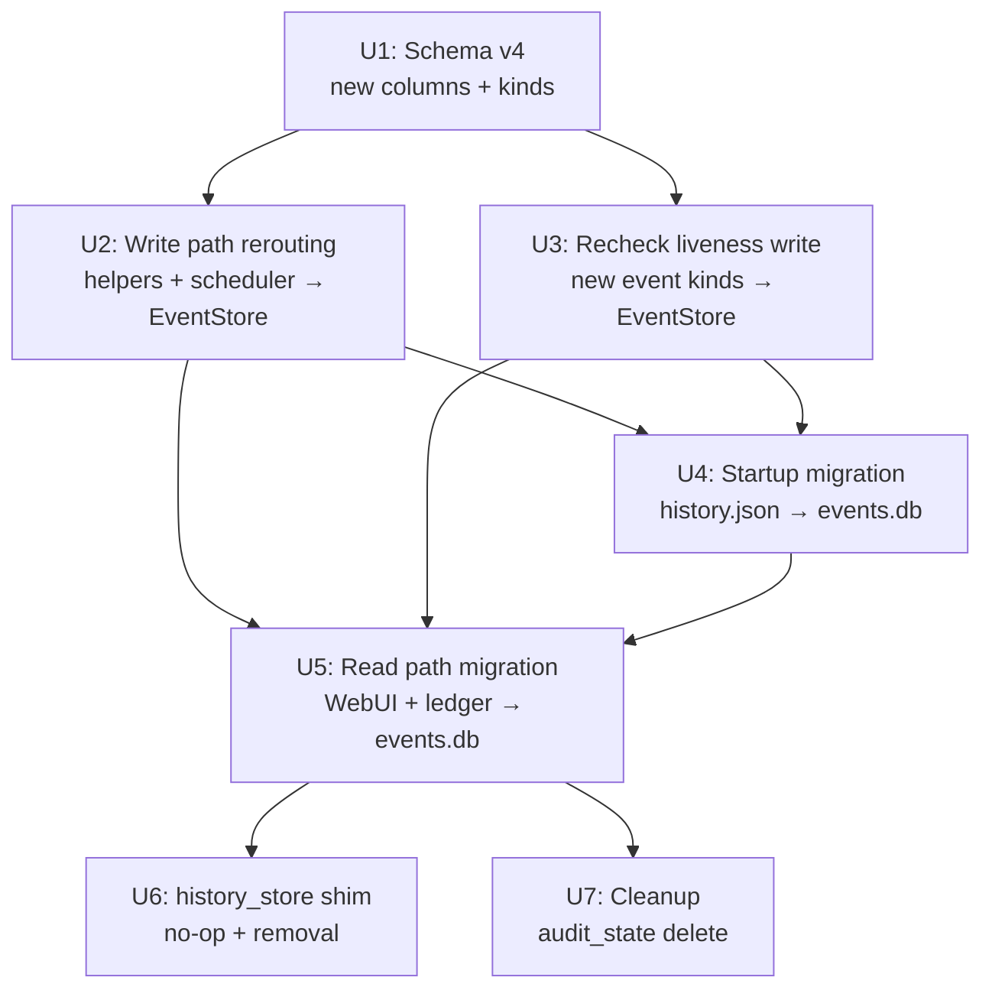

# refactor: Migrate history_store → events.db

## Overview

`publish-history.json` and `events.db` are two independent stores for the same publish data.
`audit_state` CLI exists solely to detect their divergence. This plan eliminates the dual-write
architecture by making events.db the single write target for all published backlink data, demoting
`history_store` to a no-op shim, and deleting `audit_state` once no divergence can occur.

Seven implementation units in dependency order. No operator intervention required.

## Problem Frame

Every publish write currently lands in both `webui_store/HistoryStore` (publish-history.json) and
`events.db` (via the projector that reads the JSON file post-write). The two stores drift whenever:
- the projector runs between writes and sees stale state
- the projector status classifier quarantines an unknown status string
- the JSON file is read/written concurrently

`audit_state` detects but never fixes this drift. Cutting the JSON write path eliminates the class
entirely. (see origin: docs/brainstorms/2026-05-28-history-store-events-db-migration-requirements.md)

## Requirements Trace

- **R1.** Pipeline ceases writing to `publish-history.json`; all publish results go to events.db
- **R2.** events.db captures `platform`, `verified_at`, `verify_error`, and a stable per-article ID
- **R3.** Recheck service writes liveness results to events.db (new event kinds)
- **R4.** WebUI history API and template contexts read from events.db
- **R5.** `ledger/sources.py` stops joining `history_store`
- **R6.** Startup one-time import of existing `publish-history.json` with dedup + sentinel
- **R7.** `history_store` retained as importable no-op shim; removed once all callers confirmed gone
- **R8/R9.** `audit_state` CLI, `audit/` module, tests, and `pyproject.toml` entry deleted

## Scope Boundaries

- `drafts_store`, `schedule_store`, `queue_store`, `profiles_store` NOT touched
- No manual operator migration steps — startup import is fully automatic
- CLI pipeline (`publish-backlinks` outside WebUI) continues working throughout
- `publish-history.json.migrated` left in place as operator safety net; auto-deletion out of scope

## Context & Research

### Relevant Code and Patterns

**Write paths to history_store (all must be rerouted — R1):**
- `webui_app/helpers/history.py` — `_push_history_per_row()` (line 98), `_push_history_single_failure()` (line 126), `_push_history_aggregate()` (line 153) — canonical write chokepoint
- `webui_app/scheduler.py` line 105 — `_push_history()` local function calls `_history_store.update()` directly, bypassing the helpers
- `webui_app/routes/batch.py` lines 121, 150, 167 — calls helpers
- `webui_app/routes/pipeline.py` lines 282, 300, 313 — calls helpers
- `webui_app/routes/checkpoint.py` lines 45, 60 — `_push_history_aggregate`

**Liveness write paths (R3):**
- `webui_app/services/recheck.py` — calls `history_store.update_item(item_id, verified_at=..., verify_error=...)`
- `webui_app/api/history_api.py` lines 154, 169 — `update_item()` for single + bulk recheck
- `webui_app/routes/equity_ledger.py` lines 90, 94 — `update_item()` on verify result

**Read paths to history_store (all must be migrated — R4/R5):**
- `webui_app/helpers/contexts.py` line 155 — `_g_cache('history', _history_store.load)` for `_calc_next_available()` scheduling
- `webui_app/helpers/contexts.py` line 414 — `_g_cache('history', _history_store.load)` for `_render()` template injection (`history`, `grouped_history` vars)
- `webui_app/api/history_api.py` lines 61, 94, 162 — `load()` + `get_item()`
- `src/backlink_publisher/ledger/sources.py` line 83 — `_load_history()` lazy import feeds equity ledger
- `webui.py` line 79 — module-level import for store-init side effect (no call)

**Direct `publish-history.json` readers (bypass `history_store`, handled by file-rename in U4):**
- `src/backlink_publisher/events/reconcile.py` line 149 — `_gather_flush_sources()` appends the history path to sources for `flush_for()` if the file exists; after U4 renames it to `.migrated`, the `if history.exists()` guard naturally skips it — no code change required
- `src/backlink_publisher/events/reconciler.py` line 250 — `_reconcile_history()` reads `publish-history.json` for a report-only cross-check; similarly gated by `if not history_path.exists(): return (0, 0)` — no code change required

**events.db write API:**
- `EventStore.append(kind, payload, *, run_id, target_url, host, article_id, ts_utc, conn)` — `src/backlink_publisher/events/store.py`
- `EventStore.add_article(article_dict, *, conn)` — returns `article_id`; `conn=` enables atomic article+event
- `EventStore()` — uses `_resolve_config_dir() / "events.db"` by default
- R9 required-field floor: missing floor field → quarantine; returns -1

**Schema migration pattern:** `maybe_upgrade_schema()` in `events/schema.py` — gates per-version via `current_schema_version()`; uses `ALTER TABLE ... ADD COLUMN ... DEFAULT NULL` guarded by `PRAGMA table_info` for idempotence

**One-shot startup hook pattern:** `webui_app/__init__.py` startup hooks block (lines 199-241): `channel_status.purge_removed_channel_credentials()` is the canonical sentinel-guarded one-time migration. Use this pattern for the startup history import.

**Event kind registration pattern:** `events/kinds.py` — add kind constant to `KINDS` frozenset and `REQUIRED_FIELDS` dict; CI gate (`test_events_kinds.py`) asserts every kind has a floor

**Projector extension pattern:** `events/_project_reducers.py` — each reducer: load cursor, diff state, emit event + optional article, save cursor, flush quarantines post-commit

### Institutional Learnings

- **WAL nested-connection deadlock** (`docs/solutions/logic-errors/projector-silent-drop-status-vocabulary-drift-2026-05-26.md`): Collecting pending DB writes in memory and flushing only after the enclosing transaction commits avoids `database is locked` errors. Apply to startup migration loop.
- **`_push_history_per_row` is the canonical write chokepoint** (`docs/solutions/best-practices/publish-history-helper-invariant-2026-05-20.md`): All history writes must flow through this helper; the `status="published" ⟹ url non-empty` invariant lives there and must survive rerouting.
- **Schema-extend before migrate** (`docs/solutions/logic-errors/save-config-write-paths-bypass-preservation-2026-05-15.md`): New columns must exist before the startup migration runs or source fields silently drop.
- **Missed dispatch path recreates divergence** (`docs/solutions/integration-issues/dofollow-canary-verdict-dropped-at-publish-output-seam-2026-05-25.md`): Audit ALL write paths before cut-over; a single missed path recreates the dual-store problem.
- **Negative-shape assertions enshrine bugs** (`docs/solutions/test-failures/negative-assertion-locks-in-bug-2026-05-15.md`): Every migrated write path needs a *positive* presence test asserting the row landed in events.db with expected values.
- **Startup migration needs idempotency guard** (`docs/solutions/best-practices/credential-rotation-tests-cover-bootstrap-race-2026-05-19.md`): Concurrent process starts can race; sentinel file + `INSERT OR IGNORE` dedup key prevents duplicate rows.

## Key Technical Decisions

- **`platform` as first-class `articles` column (not JSON-parsed):** `platform` is already in `payload_json` of `publish.confirmed` events, but SQL queries must not require JSON extraction for performance and legibility. Add `platform TEXT` column to `articles` table; projector and startup migration both populate it.

- **`verified_at`/`verify_error` as new event kinds + `articles` columns:** These are mutable state updated by the recheck service post-publish. Two new event kinds (`publish.verified`, `publish.verify_failed`) are appended when recheck runs; the projector updates the `articles` columns when it processes them. The events log remains append-only; the projection table is mutable (consistent with how the existing projector already does `INSERT OR REPLACE` on articles).

- **`article_id` replaces `item_id` as the stable recheck identifier:** The existing `item_id` is a UUID assigned by `history_store`. After migration all rows have `article_id` (auto-increment from `articles`). The startup migration does not preserve legacy UUIDs; WebUI recheck endpoints are updated to use `article_id`. Old UUIDs are internal WebUI state with no external contract.

- **Startup migration dedup key: SHA-256 over `(target_url, platform, published_at_raw)`:** Since `live_url = NULL` rows cannot be deduplicated via the UNIQUE constraint, a content-derived hash is the dedup key. This key is stored as a new `migration_dedup_key TEXT UNIQUE` column on `articles` (populated during migration, NULL for post-migration rows).

- **`status` derived from event kind, not stored:** After migration, `published` = latest event is `publish.confirmed`; `failed` = `publish.failed`. No `status` column. The WebUI derives display status from the event kind query.

- **Two-phase schema upgrade (v4):** Schema v4 adds the new columns (`platform`, `verified_at`, `verify_error`, `migration_dedup_key`) to `articles` and registers the two new event kinds. This runs before any migration or rerouted write.

## Open Questions

### Resolved During Planning

- **Schema extension strategy (deferred from brainstorm):** Hybrid — `platform`, `verified_at`, `verify_error` as columns on `articles` (simple read queries); new event kinds (`publish.verified`/`publish.verify_failed`) drive projector updates to those columns (event-sourced semantics preserved).
- **`item_id` continuity:** Use `article_id` as the new stable recheck ID; no legacy UUID column. Acceptable break since `item_id` is purely internal WebUI state.
- **NULL `live_url` dedup during migration:** Use `migration_dedup_key = sha256(target_url + "|" + platform + "|" + published_at_raw)` as the dedup mechanism; NULL `live_url` rows are still imported but deduplicated by content key.

### Deferred to Implementation

- **Exact SQL for `_calc_next_available()` replacement:** The current implementation reads `created_at` and `status` from history items to compute throttle timing. The implementing agent must determine which events.db table/column contains the equivalent `published_at_utc` per platform and whether the replacement query is semantically equivalent.
- **`_normalize_items()` in `history_api.py`:** This transforms raw history rows for the API response shape. The implementing agent must determine the equivalent transformation from events.db query results.
- **`_load_history()` lazy import pattern in `ledger/sources.py`:** Verify no other callers in `src/` (only `ledger/sources.py` expected) before removing the `history_store` import from `__init__.py`.
- **Template variable shape change:** `history` and `grouped_history` variables injected into all templates via `_render()`. The implementing agent must verify no template accesses history-item keys that don't survive in the events.db equivalent shape.

## High-Level Technical Design

> *This illustrates the intended approach and is directional guidance for review, not implementation specification. The implementing agent should treat it as context, not code to reproduce.*

**Before (dual-write):**
```
publish run
   ├── helpers/history.py ──► publish-history.json   (write 1)
   │                               │
   │                         projector runs ────────► events.db articles  (write 2, may drift)
   └── equity-ledger ──────► JOIN(events.db, history_store)  (dual read)

audit_state: diff(publish-history.json, events.db) → divergence report
```

**After (single-write):**
```
publish run
   └── helpers/history.py ──► EventStore.append()  ──► events.db events + articles  (single write)

recheck
   └── recheck.py ──────────► EventStore.append(publish.verified)  ──► events.db events + articles

WebUI / equity-ledger: read events.db only (no JOIN)

audit_state: DELETED (nothing to diff)

First boot after deploy:
   webui/__init__.py startup hook:
      └── sentinel check → import publish-history.json → INSERT OR IGNORE into events.db
                         → rename to .migrated
```

**Dependency graph:**



## Implementation Units

---

- [ ] **Unit 1: events.db schema v4 — new columns and event kinds**

**Goal:** Extend the articles table and event-kind registry to hold all data currently in history_store items; new event kinds for recheck liveness. All subsequent units depend on this.

**Requirements:** R2, R3

**Dependencies:** None

**Files:**
- Modify: `src/backlink_publisher/events/schema.py`
- Modify: `src/backlink_publisher/events/kinds.py`
- Modify: `src/backlink_publisher/events/store.py` (`add_article()` whitelist)
- Test: `tests/test_events_schema_v4.py` (new)
- Test: `tests/test_events_kinds.py` (update — new kind floor entries)

**Approach:**
- Bump schema version to 4 in `maybe_upgrade_schema()`
- Add four columns to `articles` via `ALTER TABLE ... ADD COLUMN ... DEFAULT NULL` (guarded by `PRAGMA table_info` for idempotence): `platform TEXT`, `verified_at TEXT`, `verify_error TEXT`, `migration_dedup_key TEXT`
- Add `UNIQUE INDEX IF NOT EXISTS idx_articles_migration_dedup ON articles(migration_dedup_key)` where NOT NULL (partial index: `WHERE migration_dedup_key IS NOT NULL`)
- Add two new event kinds: `publish.verified` (floor: `{"article_id"}`), `publish.verify_failed` (floor: `{"article_id", "error_message"}`)
- Update `KINDS` frozenset and `REQUIRED_FIELDS` dict in `kinds.py`
- Update `add_article()` accepted-keys whitelist in `store.py` to include `platform` and `migration_dedup_key`

**Patterns to follow:**
- `events/schema.py:maybe_upgrade_schema()` — existing per-version gate pattern
- `events/kinds.py:KINDS`, `REQUIRED_FIELDS` — existing kind registration
- `events/store.py:add_article()` — whitelist pattern at line 288

**Test scenarios:**
- Happy path: `EventStore()` on a v3 database runs `maybe_upgrade_schema()` and produces a v4 schema; `PRAGMA table_info(articles)` returns all four new columns
- Happy path: `add_article({"live_url": "...", "platform": "medium", ...})` stores `platform` in the column; subsequent `SELECT platform FROM articles WHERE live_url=?` returns it without JSON parsing
- Happy path: `EventStore.append("publish.verified", {"article_id": 1}, ...)` succeeds and appears in events table
- Happy path: `EventStore.append("publish.verify_failed", {"article_id": 1, "error_message": "timeout"}, ...)` succeeds
- Edge case: `maybe_upgrade_schema()` called twice on a v4 database is idempotent (no duplicate columns, no error)
- Edge case: `add_article({"live_url": None, "migration_dedup_key": "abc123", ...})` inserts; second call with same `migration_dedup_key` raises `IntegrityError` (dedup key is UNIQUE)
- Error path: `EventStore.append("publish.verified", {"platform": "x"})` — missing floor field `article_id` → quarantined (returns -1)

**Verification:**
- `pytest tests/test_events_schema_v4.py` passes
- `pytest tests/test_events_kinds.py` passes (new kind floor entries present)
- `python -m py_compile src/backlink_publisher/events/schema.py src/backlink_publisher/events/kinds.py` clean

---

- [ ] **Unit 2: Reroute all publish write paths from history_store to EventStore**

**Goal:** Every path that currently writes a history row to `publish-history.json` is rerouted to emit an event and optionally add/update an `articles` row. `publish-history.json` stops being written.

**Requirements:** R1

**Dependencies:** Unit 1

**Files:**
- Modify: `webui_app/helpers/history.py`
- Modify: `webui_app/scheduler.py` (line 104-114 direct bypass)
- Modify: `webui_app/routes/checkpoint.py` (calls `_push_history_aggregate`)
- Create: `src/backlink_publisher/events/publish_writer.py` (shared helper; see Approach)
- Test: `tests/test_events_publish_writer.py` (new)
- Test: `tests/test_webui_history_write_paths.py` (new)

**Approach:**
- Create `events/publish_writer.py` with a single `write_publish_result(row: dict, store: EventStore | None = None)` function. It maps a history-row dict to `EventStore.append(kind, payload, ...)` + `store.add_article(...)` within a single `conn=` transaction. Kind is determined by `row["status"]`: `published` → `publish.confirmed`, `failed` → `publish.failed`, `scheduled` → `draft.scheduled`, other → quarantine.
- The `status="published" ⟹ live_url non-empty` invariant from `_push_history_per_row` is enforced here before the write.
- Replace the body of `_push_history_per_row()`, `_push_history_single_failure()`, `_push_history_aggregate()` in `helpers/history.py` to call `write_publish_result()`. The function signatures stay the same so callers (batch.py, pipeline.py, checkpoint.py) are unchanged.
- Replace `webui_app/scheduler.py` line 104-114 (`_push_history()` local bypass) with the same `write_publish_result()` call.
- `EventStore` instance: instantiate lazily inside `publish_writer.py` (or accept as parameter for testability).
- After rerouting: `_history_store.update(...)` calls in the write helpers are removed; `publish-history.json` is no longer written by these paths.

**Patterns to follow:**
- `webui_app/helpers/history.py:_push_history_per_row()` — invariant and status-mapping logic to preserve
- `events/store.py:append()` + `add_article()` — transactional pair via shared `conn=`
- `events/_project_reducers.py` — how status strings are mapped to event kinds

**Test scenarios:**
- Happy path: `write_publish_result({"status": "published", "live_url": "https://x.com/...", "platform": "medium", ...})` → `events.db` has `publish.confirmed` event with `live_url` in payload; `articles` table has matching row with `platform="medium"`
- Happy path: `write_publish_result({"status": "failed", ...})` → `publish.failed` event in events.db; no `articles` row inserted
- Edge case: `write_publish_result({"status": "published", "live_url": None, ...})` → invariant violation → `publish.failed` emitted (not a silent drop)
- Edge case: Calling `write_publish_result()` twice with the same `live_url` → `articles.UNIQUE live_url` constraint handled; no duplicate; second call is idempotent
- Edge case: Unknown `status` string → quarantine path (not a silent drop)
- Integration: After `_push_history_per_row()` is called from a WebUI route stub, `publish-history.json` is NOT written; `events.db` has the event row
- Integration: `scheduler.py`'s `_publish_draft_job` completion path writes to events.db, not publish-history.json

**Verification:**
- `pytest tests/test_events_publish_writer.py` passes
- `pytest tests/test_webui_history_write_paths.py` passes
- `grep -rn "_history_store\.update\|history_store\.save\|publish-history\.json" webui_app/helpers/history.py webui_app/scheduler.py webui_app/routes/checkpoint.py` returns no matches (all write paths removed)

---

- [ ] **Unit 3: Recheck liveness writes via new event kinds**

**Goal:** The recheck service stops mutating `history_store` items and emits `publish.verified` / `publish.verify_failed` events to events.db instead. The projector processes these events and updates `articles.verified_at`/`verify_error`.

**Requirements:** R3

**Dependencies:** Unit 1

**Files:**
- Modify: `webui_app/services/recheck.py`
- Modify: `webui_app/api/history_api.py` (lines 154, 169)
- Modify: `webui_app/routes/equity_ledger.py` (lines 90, 94)
- Modify: `src/backlink_publisher/events/_project_reducers.py` (projector handles new kinds)
- Test: `tests/test_webui_recheck_events.py` (new)

**Approach:**
- In `recheck.py`, replace `history_store.update_item(item_id, verified_at=..., ...)` with `EventStore().append("publish.verified", {"article_id": article_id, "verified_at": ts, "live_url": url}, ...)` on success, and `append("publish.verify_failed", {"article_id": article_id, "error_message": ...}, ...)` on failure.
- The `article_id` parameter replaces `item_id` in the recheck API. `history_api.py` single/bulk recheck endpoints accept `article_id` (integer from `articles` table) instead of the old string UUID.
- In `_project_reducers.py`, add handling for the two new event kinds: when projector processes `publish.verified`, execute `UPDATE articles SET verified_at=?, verify_error=NULL WHERE article_id=?`; for `publish.verify_failed`, `UPDATE articles SET verify_error=?, verified_at=NULL WHERE article_id=?`.
- `equity_ledger.py` verify routes replace `history_store.update_item(item_id, ...)` with `EventStore().append(...)`.

**Patterns to follow:**
- `events/store.py:append()` — existing transactional write
- `events/_project_reducers.py` — how reducers do UPDATE vs INSERT

**Test scenarios:**
- Happy path: `recheck_one(article_id=5, live_url="https://...")` succeeds → `publish.verified` event in events.db with `article_id=5`; subsequent SELECT from `articles WHERE article_id=5` returns `verified_at` non-null, `verify_error` null
- Happy path: `recheck_one(article_id=5, live_url="...")` fails with timeout → `publish.verify_failed` event; `articles.verify_error` = error message
- Integration: After `flush_for(events_db_path, store)` processes a `publish.verified` event, `articles.verified_at` is updated
- Error path: `recheck_one` called with `article_id` that does not exist in `articles` → logged warning; no quarantine; graceful no-op
- Error path: Duplicate `publish.verified` for same `article_id` — projector UPDATE is idempotent (latest timestamp wins)

**Verification:**
- `pytest tests/test_webui_recheck_events.py` passes
- `pytest tests/test_events_projector_*.py` passes (projector handles new kinds)
- `grep -rn "history_store\.update_item" webui_app/services/recheck.py webui_app/api/history_api.py webui_app/routes/equity_ledger.py` returns no matches

---

- [ ] **Unit 4: Startup migration — import publish-history.json into events.db**

**Goal:** On first WebUI or CLI start after deployment, existing `publish-history.json` records are imported into events.db (dedup-safe, concurrency-safe). File is renamed to `.migrated` on success.

**Requirements:** R6

**Dependencies:** Units 1, 2, 3 (schema and write helpers must exist; migration uses `write_publish_result()`)

**Files:**
- Create: `src/backlink_publisher/events/history_migration.py`
- Modify: `webui_app/__init__.py` (add startup hook call)
- Test: `tests/test_events_history_migration.py` (new)

**Approach:**
- Create `run_history_migration(config_dir: Path) -> None` in `events/history_migration.py`.
- Sentinel check: if `config_dir / ".history-migration-done"` exists → return immediately.
- File lock: acquire an OS-level file lock on `config_dir / ".history-migration.lock"` before proceeding (prevents race between two simultaneous WebUI restarts).
- Read `publish-history.json` as a list of history-item dicts.
- For each item: compute `dedup_key = sha256(item["target_url"] + "|" + item.get("platform", "") + "|" + item.get("published_at", ""))`. Call `write_publish_result({...item, "migration_dedup_key": dedup_key})`. Items with unknown status → quarantine log, not crash.
- After all rows processed (collect quarantine writes in memory; flush after transaction):
  - Rename `publish-history.json` → `publish-history.json.migrated`
  - Write sentinel `config_dir / ".history-migration-done"`
- Call from `webui_app/__init__.py` startup hooks block alongside `purge_removed_channel_credentials()`.

**Patterns to follow:**
- `webui_app/__init__.py:purge_removed_channel_credentials()` — sentinel-guarded one-time startup hook pattern
- `events/publish_writer.py:write_publish_result()` — reuse for writing migrated rows
- WAL deadlock avoidance: batch quarantine writes, flush post-commit (see `projector-silent-drop` learning)

**Test scenarios:**
- Happy path: `run_history_migration(tmp_path)` with a 5-row JSON file → all 5 rows in events.db; `publish-history.json` renamed to `.migrated`; sentinel file created
- Happy path: Calling `run_history_migration` a second time → sentinel check fires; no duplicate rows; `.migrated` file untouched
- Edge case: `publish-history.json` does not exist → migration is no-op; no sentinel created; no error
- Edge case: Row with `live_url = None` (NULL-url publish) → imported with `migration_dedup_key` set; dedup key prevents duplicate on re-run
- Edge case: Row with unknown `status` value → quarantined; does not crash; remaining rows still imported
- Integration: Two `run_history_migration` calls in parallel (using `threading.Barrier(2)`) → exactly one completes the import; no duplicate events in events.db
- Integration: After migration, events.db `articles.platform` is populated for migrated rows; `articles.live_url` matches history-item `url` field

**Verification:**
- `pytest tests/test_events_history_migration.py` passes
- After running the migration against a real `publish-history.json` fixture, `SELECT COUNT(*) FROM articles WHERE migration_dedup_key IS NOT NULL` equals the fixture row count
- `grep -n "publish-history.json" src/backlink_publisher/events/history_migration.py` — path resolved via `config_dir` parameter, never hardcoded

---

- [ ] **Unit 5: Read path migration — WebUI API, template contexts, equity ledger**

**Goal:** Replace all `history_store.load()` / `history_store.get_item()` reads with events.db queries. After this unit, no functional code reads from `publish-history.json`.

**Requirements:** R4, R5

**Dependencies:** Units 2, 3, 4 (data in events.db; write paths already rerouted)

**Files:**
- Modify: `webui_app/api/history_api.py`
- Modify: `webui_app/helpers/contexts.py`
- Modify: `src/backlink_publisher/ledger/sources.py`
- Create: `src/backlink_publisher/events/history_query.py` (shared query helper)
- Modify: `webui_app/helpers/history.py` (remove remaining `_history_store.load()` call at line 64)
- Test: `tests/test_events_history_query.py` (new)
- Test: `tests/test_webui_history_api.py` (update)

**Approach:**
- Create `events/history_query.py` with `list_history(store: EventStore, limit: int = 100) -> list[dict]` and `get_history_item(store: EventStore, article_id: int) -> dict | None`. These encapsulate the `JOIN events + articles` query and return dicts shaped like the old history items (same keys: `id`, `live_url`, `platform`, `status`, `verified_at`, `verify_error`, `created_at`). `id` = `articles.article_id`.
- `webui_app/api/history_api.py`: replace `_history_store.load()` + `_history_store.get_item()` calls with `history_query.*`. `item_id` parameter in API endpoints becomes `article_id`.
- `webui_app/helpers/contexts.py` line 155: replace `_g_cache('history', _history_store.load)` with an events.db query that returns `(created_at, platform)` tuples for `_calc_next_available()` throttle logic. The implementing agent must verify the equivalent events.db column (`articles.published_at_utc` or event `ts_utc`).
- `webui_app/helpers/contexts.py` line 414: replace with `history_query.list_history(store)`. The `grouped_history` derived variable is rebuilt from the query result (same grouping logic).
- `ledger/sources.py`: replace `_load_history()` lazy import and `history_store.load()` call with a direct events.db query returning `LinkRecord`-compatible data including `history_item_id = articles.article_id`.
- `webui_app/helpers/history.py` line 64: the `_push_history_per_row` early-return path that calls `_history_store.load()` when `rows` is empty — remove or replace with no-op.

**Patterns to follow:**
- `ledger/sources.py:_load_history()` and `build_target_buckets()` — existing join shape to mirror
- `events/store.py:connect()` context manager — how to open a read-only query
- `webui_app/helpers/contexts.py:_g_cache()` — request-level caching pattern to preserve

**Test scenarios:**
- Happy path: `list_history(store)` after a publish via `write_publish_result` → returns a list with `id`, `live_url`, `platform`, `status`, `verified_at`, `created_at` keys
- Happy path: `get_history_item(store, article_id=5)` returns the expected dict; `get_history_item(store, 9999)` returns `None`
- Happy path: `HistoryAPI.list()` returns the same shape for a freshly migrated history as before migration (data fidelity)
- Happy path: `_calc_next_available()` returns a throttle-correct datetime after events.db read (semantic equivalence with old `history_store.load()` path)
- Integration: After a publish run, WebUI `/history` route renders the history list from events.db (verify by checking no `history_store.load()` call site is reached in a traced request)
- Integration: `build_target_buckets()` receives `history_item_id = articles.article_id` for each link record
- Error path: `list_history(store)` when events.db is empty → returns `[]` (not an exception)
- Edge case: History item with `verified_at = NULL` → `status` field in returned dict reflects `publish.unverified` or `publish.confirmed` kind

**Verification:**
- `pytest tests/test_events_history_query.py tests/test_webui_history_api.py` passes
- `grep -rn "_history_store\.load\|history_store\.get_item\|history_store\.load" webui_app/ src/` returns no matches outside the shim
- `pytest tests/test_equity_ledger.py tests/test_ledger*.py` passes with no `_load_history` references to `history_store`

---

- [ ] **Unit 6: history_store no-op shim and removal**

**Goal:** `history_store` module remains importable (`webui.py` import, R7 compatibility window) but all write and read calls are no-ops or thin stubs. Once confirmed no callers remain, module is removed.

**Requirements:** R7

**Dependencies:** Unit 5 (all read paths migrated; write paths migrated in U2/U3)

**Files:**
- Modify: `webui_store/history.py` — replace body with no-op stubs
- Modify: `webui_store/__init__.py` — retain `history_store` export; add deprecation note
- Modify: `webui.py` — remove line 79 module-level import (no functional purpose)
- Test: `tests/test_webui_store_history_shim.py` (new — confirm no-op shim does not crash)

**Approach:**
- `HistoryStore` methods become no-ops that log a deprecation warning: `load()` → `[]`, `update()` → `None`, `update_item()` → `False`, `get_item()` → `None`. This prevents breaking any stray caller that was not caught.
- The `_LazyStore` wrapping `HistoryStore` in `webui_store/__init__.py` stays; the shim just makes it safe to call without effect.
- Add a `# DEPRECATED: history_store is a no-op shim. Callers should use events/history_query.py` comment.
- Once a subsequent `grep -rn "history_store\." src/ webui_app/ tests/` search (at implementation time) confirms no live callers remain, `HistoryStore` and the `history_store` export can be fully removed.

**Test scenarios:**
- `history_store.load()` returns `[]` without reading any file
- `history_store.update_item("any-id", verified_at="...")` returns `False` without writing
- Importing `from webui_store import history_store` does not raise

**Verification:**
- `pytest tests/test_webui_store_history_shim.py` passes
- `grep -rn "history_store\." webui_app/ src/` returns only the shim definition and `webui_store/__init__.py` export — no live callers

---

- [ ] **Unit 7: Delete audit_state CLI, audit/ module, and associated tests**

**Goal:** Removes the divergence-detection tool that is made redundant by the migration. Cleans up pyproject.toml, test suite, and source tree.

**Requirements:** R8, R9

**Dependencies:** Unit 5 (all read/write paths migrated; divergence can no longer occur)

**Files:**
- Delete: `src/backlink_publisher/cli/audit_state.py`
- Delete: `src/backlink_publisher/audit/` (entire directory: `__init__.py`, `readers.py`, `diff.py`)
- Delete: `tests/test_cli_audit_state.py`
- Delete: `tests/test_audit_diff.py`
- Delete: `tests/test_audit_readers.py`
- Delete: `tests/test_audit_state_duplicate_detection.py`
- Modify: `pyproject.toml` — remove `audit-state` entry from `[project.scripts]` (line 47)
- Modify: `tests/test_cli_python_m_entrypoints.py` — remove `"audit-state"` dict entry (surgical single-line deletion)
- Modify: `src/backlink_publisher/__init__.py` — remove any audit import if present

**Approach:**
- Delete files and directories
- Verify `pyproject.toml` scripts list after edit: `audit-state` entry gone
- Verify `test_cli_python_m_entrypoints.py` passes after surgical removal of the `audit-state` dict entry (do not delete the whole file)
- `pip install -e ".[dev]"` after pyproject.toml edit to confirm no broken entry points

**Test scenarios:**
- Test expectation: none — this is a deletion unit; the passing test suite is the verification

**Verification:**
- `pytest tests/` passes with no reference to `audit_state` or `audit/`
- `python -m backlink_publisher.cli.audit_state` raises `ModuleNotFoundError` (module is gone)
- `pip show backlink-publisher | grep audit` returns empty
- `grep -rn "audit_state\|from backlink_publisher.audit" src/ tests/` returns no matches

## System-Wide Impact

- **Interaction graph:** All WebUI routes using `_render()` receive `history` and `grouped_history` from events.db after U5; the `_g_cache` key `'history'` will now point to the events.db read path. Flask's request-scoped cache works identically. The recheck service (`services/recheck.py`) stops mutating JSON files and emits events instead — the projector must be active for those events to be reflected.
- **Error propagation:** EventStore write errors (`OperationalError`) that previously silently fell back to a JSON write will now surface as publish failures or be caught by the existing `emit_attempt` never-raises contract. `publish_writer.py` must not swallow `IntegrityError` on duplicate `live_url` (idempotent path) but must not raise on concurrent duplicate (use `INSERT OR IGNORE`).
- **State lifecycle risks:** The startup migration (U4) is the most risky state transition. If the migration runs but events.db write fails mid-way, `publish-history.json` is not yet renamed — re-running the migration deduplicates correctly. If the rename succeeds but the sentinel write fails, the next start re-runs migration (idempotent). The dedup key prevents double insertion.
- **API surface parity:** The recheck API endpoint (`/api/recheck/<item_id>`) changes parameter semantics from string UUID to integer `article_id`. This is a WebUI-internal endpoint; no external contract. Frontend JavaScript that calls this endpoint must be updated to use `article_id` from the new events.db query results.
- **Integration coverage:** The equity ledger (`ledger/sources.py`) performs a 3-store join today. After migration it performs a 2-store join (events.db + anchor profiles). Existing `test_equity_ledger_*.py` suite must pass end-to-end to confirm the data shape is equivalent.
- **Unchanged invariants:** The `audit_state` CLI's `DivergenceRecord` types (`null_url_orphan`, `history_orphan`, `article_orphan`) document what can go wrong in the dual-store design. After migration these divergence classes are structurally eliminated (single store), not just suppressed.
- **projector / reconcile.py:** The projector is no longer needed for keeping history_store → events.db in sync. The `_project_history` reducer in `_project_reducers.py` has no source file to project from after migration. Consider whether to deactivate or remove the history reducer; at minimum it should no-op if `publish-history.json` is absent.

## Risks & Dependencies

| Risk | Mitigation |
|------|------------|
| `_project_history` reducer continues reading renamed `.migrated` file | Reducer should check file existence; `.migrated` extension means the file is not a live source. After U4, add a guard: `flush_for` skips sources whose path has `.migrated` suffix |
| Concurrent WebUI restarts race during startup migration | File lock + sentinel in `history_migration.py` (U4); `threading.Barrier(2)` test validates |
| Template rendering breaks due to changed `history` dict shape | `history_query.list_history()` must return items with identical keys to old history_store items. Verify via a data-shape parity test in U5 before removing old read path |
| `_calc_next_available()` throttle regression | This function reads `created_at` from history items for per-platform throttle calculation. The equivalent field in events.db is `articles.published_at_utc` (or event `ts_utc`). Verify semantic equivalence before cutting over — a throttle regression causes publish rate violations |
| equity ledger `history_item_id` changes type (string UUID → int article_id) | `LedgerRow.history_item_ids` accepts the new int value; the recheck URL in the WebUI that navigates to `/recheck/<id>` uses the new integer path. Verify no frontend JS hardcodes the UUID format assumption |
| `audit/readers.py` snapshot-copy logic for events.db used elsewhere | Grep for `from backlink_publisher.audit` and `audit_readers` before deletion; only `audit_state.py` is expected |

## Documentation / Operational Notes

- `AGENTS.md` known-trap list references `publish-history.json` as the operator-editable history file. After migration, operators should not edit this file (it's renamed to `.migrated`). Update the trap entry.
- `config.example.toml` has no reference to `publish-history.json` — no doc update needed there.
- `docs/brainstorms/2026-05-28-history-store-events-db-migration-requirements.md` — origin doc; no update needed.
- Monitoring: after shipping U2-U4, operators running `audit-state` will see zero divergences (single source). Once U7 ships, `audit-state` command returns `command not found`.

## Sources & References

- **Origin document:** [docs/brainstorms/2026-05-28-history-store-events-db-migration-requirements.md](docs/brainstorms/2026-05-28-history-store-events-db-migration-requirements.md)
- Related code: `src/backlink_publisher/events/` — EventStore, schema, kinds, projector, reducers
- Related code: `webui_app/helpers/history.py`, `webui_store/history.py`, `webui_app/api/history_api.py`
- Related code: `webui_app/__init__.py` startup hooks (lines 199-241) — sentinel pattern to follow
- Related solutions: `docs/solutions/logic-errors/projector-silent-drop-status-vocabulary-drift-2026-05-26.md`
- Related solutions: `docs/solutions/best-practices/publish-history-helper-invariant-2026-05-20.md`
- Related solutions: `docs/solutions/best-practices/credential-rotation-tests-cover-bootstrap-race-2026-05-19.md`
