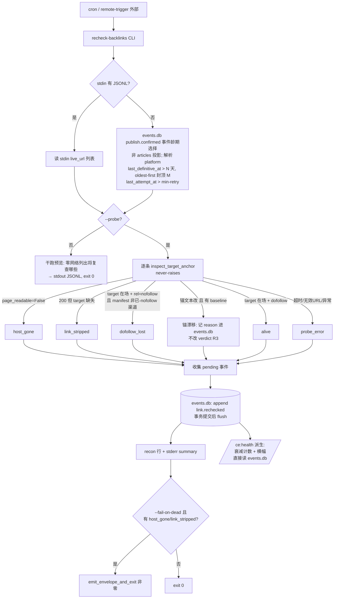
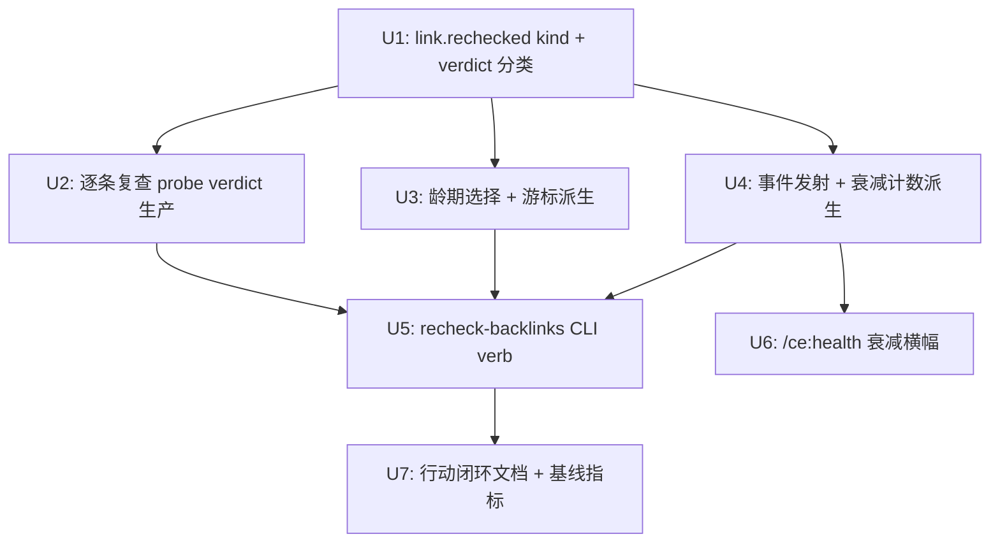

# feat: recheck-backlinks 存活复查闭环(可观测切片,与 plan-007 解耦)

## Overview

新增 CLI verb `recheck-backlinks`:对**已发布**的外链周期性再验证三类信号——存活性(liveness)、
可跟随性漂移(dofollow→nofollow)、链接/锚文本被删改——发出 events.db 生命周期时间序列,并在
`/ce:health` dashboard 暴露衰减计数 + 告警横幅。发布时 `verify_published` 只跑一次、之后永不复查,
本功能填补这个发布后盲区。

**关键架构决策(2026-05-29 用户拍板:解耦)**:复查的可观测价值——CLI 用 `EventStore.append` 写**自有**
生命周期 kind(`link.rechecked`),衰减计数/龄期游标从该时间序列**派生**,无需 schema bump、无需 projector、
**不碰 history_store**——其**输出**完全不依赖 plan-007(输入须从 append-only `publish.confirmed` 事件选,
非 articles 投影,见 D1)。(`suspected_dead` 派生延后到 fast-follow,见 D5。)

**诚实分解(product-review 修正,取代含糊的"~80% 价值")**——本版**交付**:(a) events.db 衰减时间序列;
(b) `/ce:health` 衰减横幅;(c) `--probe` CLI + 龄期复查。本版**不交付**:(d) **ledger liveness 列反映复查现状**
(origin R6)——ledger liveness 列今天源自 history_store,plan-007 正把它迁到 events.db articles 列;在 plan-007
之前回写 history_store 会制造双 writer(plan-007 U6 将其降级为 no-op),回写 articles 列又需 plan-007 未建的
schema v4 列。**代价(adversarial A6 / product P5)**:在 plan-007 落地前,operator 看 `/ce:health` 可能显示某链
`host_gone`,而 equity ledger 的 liveness 列仍显示 `live`——**两个分歧的存活真值**。本版以 runbook(U7)明确
**`/ce:health` 衰减计数为存活权威、ledger liveness 列仅发布时态**(死链分诊别信 ledger 列),直到 plan-007 R6
follow-up 收口。这是本仓库三周来一直在消灭的双源分歧类——本版明知是**临时**的、并显式标注其存续期与权威面,
以避免 operator 同时不信两个面。

## Problem Frame

过去三周迭代几乎全投在内部状态一致性(双存储漂移、saga 契约、dedup、reconciler)。但更上层的问题
没人盯:**发布出去的外链事后还活着、还可跟随吗?** 现状闭环已部分存在
(`webui_app/services/recheck.py` 能手动重抓重验),真正缺的是:**(1)** cron 驱动的批量周期复查(现仅
WebUI 手动触发);**(2)** 纵向衰减时间序列(复查结果不进 events.db,看不出某链接"何时从 live 变 dead");
**(3)** operator 可见性(dashboard 无衰减计数/告警)。SEO 真实收益 = *存活的 dofollow 集随时间的留存*,
而当前没有任何入口拥有这一维度。(see origin: docs/brainstorms/2026-05-29-backlink-lifecycle-closed-loop-requirements.md)

> **范围名实对齐**(承接 origin 的 document-review 修正):本版只验证链接**存活性与可跟随性**
> (live / followable),**不**测真正的 SEO 价值(是否被索引、是否传递权重)。索引检测需外部依赖
> (GSC / `site:` 抓取,踩 ToS),显式延后到后续版本。

## Requirements Trace

承接 origin 需求文档 R1–R14。本 plan 覆盖除 R6 外的全部;R6 显式延后(见 Scope Boundaries)。

- **R1** 新增复查 CLI verb,复用既有 liveness 原语(`verify_published` / `inspect_target_anchor`),
  不重造 liveness 逻辑 → U2 + U5
- **R2** 龄期选择 + 限速 + oldest-first(只查"距上次确定性检查 > N 天",最老优先,每次封顶 M) → U3
- **R3** 三类零外部依赖信号:liveness(载重)/ dofollow 漂移(仅落 events.db + dashboard)/ 锚文本删改(**best-effort**,仅落 events.db) → U2。**注(adversarial A7)**:锚漂移依赖 `articles.anchors_json` baseline,而该列仅 checkpoint confirmed 路径填充、history/早期行多为 `'[]'`——故锚漂移对**大部分语料惰性**(无 baseline → 跳过)。实现时测 `SELECT COUNT(*) FROM articles WHERE anchors_json != '[]'` 得实际覆盖率;若小众,Problem Frame/dashboard 不得宣称锚篡改全语料覆盖。
- **R4** never-raises 批处理 + 死链/抖动区分(确定性死链 → `failed`;网络/超时 → `unknown` 不推进游标) → U2 + U5
- **R5** events.db 生命周期 event kind,进 `KINDS` 白名单 + required-field floor,作时间序列 sink → U1 + U4
- **R6** 确定性死链**回写 ledger liveness 列** → **延后**(解耦决策;纠缠 plan-007 的 history_store→events.db 迁移)
- **R7** 复查绝不触发发布动作(不重发/不补偿/不创建内容) → U2/U5 设计约束
- **R8** `/ce:health` 衰减计数 + warning banner,直接读 events.db,无数据显示 0 而非报错 → U6
- **R9** CLI 结束向 stderr 输出 cron 友好 summary → U5
- **R10** 行动闭环说明(谁看横幅、cadence、看到衰减后做什么人工补救) → U7
- **R11** 选取模型:默认读 events.db `articles`(配 `--since`/`--host`/`--run-id`/`--limit`);有 stdin JSONL 时改读 stdin → U3 + U5
- **R12** 网络经显式 `--probe` 开启;不带 `--probe` = 零网络干跑清单预览 → U5
- **R13** 默认 exit 0(纯诊断);`--fail-on-dead` 触发集 = host_gone + link_stripped → U5 + U1
- **R14** 5 类判定:`alive` / `host_gone` / `link_stripped` / `dofollow_lost` / `probe_error` → U1 + U2

## Scope Boundaries (Non-Goals)

- **R6 — 确定性死链回写 ledger liveness 列** —— **本版显式延后**。衰减对 operator **可见**(events.db
  时间序列 + dashboard 横幅),但 ledger 的 liveness 列**不**由复查刷新,直到 plan-007 落地后的 follow-up。
  理由:ledger liveness 列今天来自 `history_store`,plan-007 正把它迁到 events.db articles 列;在 plan-007
  之前回写 history_store 会制造双 writer 冲突(plan-007 U6 将其降级为 no-op shim),回写 articles 列又需
  plan-007 U1 尚未建的 schema v4 列 + projector。
- **索引状态检测**(是否被 Google 索引 / 传递权重)—— 延后,需 GSC API 或 `site:` 抓取。
- **自动重发 / 替换链接 / 衰减处理队列** —— 本版只 observability + 如实记录,不自动补偿。
- **`suspected_dead` 派生信号** —— 延后到 fast-follow(用户拍板)。v1 保留游标保护(probe_error 不推进确定性游标,
  持续不可达链接保持可选),但不发 suspected_dead;待首轮 `--probe` 校准真实 probe_error 率 + 解决 M-cap 选择 lane
  后再加(adversarial:默认 cadence + M-cap 下它可能永不触发)。
- **新存储后端 / 新 ledger 列 / schema bump** —— 复用现有 events.db events 表,只加一个 event kind;**不** bump SCHEMA_VERSION。
- **第二套复查实现** —— 单一化到现有 liveness 原语,不建并行 rechecker。
- **N/M 外部可配置** —— v1 用内置默认,真有第二 cron profile 再外暴。
- **项目内 cron/scheduler 注册** —— 仓库内无 cron/RemoteTrigger 设施(仅 WebUI 内 APScheduler);本 CLI 设计为
  **无状态、外部调度**(operator 自行接 cron/launchd/remote-trigger)。
- **固定里程碑调度(T+1/7/30)** —— 本版用龄期扫描。

## Context & Research

### Relevant Code and Patterns

**CLI verb 骨架(镜像对象)**
- `src/backlink_publisher/cli/equity_ledger.py`(66 行)—— **主模板**:只读、events.db 聚合、JSONL→stdout、
  banner→stderr、成功 exit 0、post-parse 校验 via `emit_error(msg, exit_code=1)`。
- `src/backlink_publisher/cli/validate_backlinks.py:54-140` —— **网络门控模板**:flag 门控 URL reachability、
  catch `ExternalServiceError`→exit 4、`validate_logger.recon(...)` never-drop reconciliation line。
- `src/backlink_publisher/cli/report_anchors.py:93-98` —— `--fail-on-dead` 的 opt-in 非零模板:仅当 breach flag
  置位才 `emit_envelope_and_exit`,否则 fall through = exit 0。
- 新 verb 骨架共性:`argparse` 在 `main` 内 import;`import backlink_publisher.publishing.adapters  # noqa: F401`
  先填 registry;`cfg = load_config()` 后 `config_echo.emit_banner(cfg, "recheck-backlinks")`(→stderr,
  `config_echo.py:184`);stdin/stdout 用 `_util.jsonl.read_jsonl(fh, strict=False)` / `write_jsonl`。
- 退出码:`_util/errors.py` 0–6 表(class 属性),`tests/test_exit_code_contract.py:74-91` 是 contract 守门——
  **任何新 `PipelineError` 子类必须 pin 进 `EXIT_CODE_CONTRACT` 否则构建失败**。→ **不为死链新建异常类**,
  用 exit-0-default + `emit_envelope_and_exit(...)` 仅在 `--fail-on-dead` 时改退出码。

**Liveness / dofollow / anchor 原语(复用,不重造)**
- `src/backlink_publisher/publishing/adapters/link_attr_verifier.py:297` —— **`inspect_target_anchor(url,
  target_url, *, expected_marker=None, timeout=None) -> dict`**:复查首选原语。经 SSRF 防护 preflight opener
  抓取,返回 `{page_readable, marker_present, target_anchor_found, target_rel, target_is_nofollow, reason}`,
  读**目标锚自身的 rel**(非页级聚合)。一次调用即覆盖 host_gone(page_readable=False)/ link_stripped
  (target_anchor_found=False)/ dofollow_lost(target_is_nofollow=True)。
- `src/backlink_publisher/linkcheck/verify.py:72` —— `verify_published(url, title, required_link_urls,
  max_wait=30) -> VerificationResult(ok, reason)`:200 + 标题子串 + 链接在场;never-raises;SSL 关闭。
  可作 soft-404 旁证(标题不在场 → 页面非原页)。
- `src/backlink_publisher/publishing/registry.py` + `publishing/adapters/_nofollow_rationales.py` ——
  **per-channel dofollow 真值**(manifest Policy)。`registry.py:309` 注释记有"grep `_DOFOLLOW_BY_CHANNEL`
  before shipping"规则。已分类为 nofollow/None 的渠道(devto/mastodon/wpcom 等)的目标本就 nofollow,
  **不该报 `dofollow_lost`**——必须交叉核对此真值。
- `webui_app/services/recheck.py:70,142` —— `recheck_one`/`recheck_many` 是**纯函数无 Flask**,但只产 3 种
  结局、不区分 5 verdict、不调 link_attr_verifier。**本版不复用其 history_store 化的 mutation 形状**,只在
  概念上参照其 `verify_fn` 注入(`recheck.py:27-32`)以便测试可 mock。

**events.db 层**
- `src/backlink_publisher/events/kinds.py:55-72`(`KINDS` frozenset,14 kinds,无 `link.rechecked`)+
  `:101-116`(`REQUIRED_FIELDS` floor dict)—— kind 注册模式:声明 `Final` 常量、加进 `KINDS`、加 floor。
  **CLI 直接 `append` 不经 JSON-source projector,无需碰 Seam B(`STATUS_MAP`/`SOURCE_DEFAULT`)。**
- `src/backlink_publisher/events/store.py:169` —— `EventStore.append(kind, payload, *, run_id, target_url,
  host, article_id, ts_raw, ts_utc, conn, pending_quarantines) -> int`(quarantine 时返回 -1)。
  `target_url`/`host`/`article_id` 是 events 表一级列,可直接 `query` 过滤。`query(sql, params)` 仅 SELECT。
- `src/backlink_publisher/events/schema.py:15` —— `SCHEMA_VERSION = 3`;`articles` 列含 `anchors_json
  DEFAULT '[]'`、`target_urls_json DEFAULT '[]'`、`live_url UNIQUE`、`published_at_utc`、`host`、`run_id`。
  **本版不 bump schema、不加列。**

**`/ce:health` dashboard**
- `webui_app/routes/health.py:59` —— 路由是 **`/ce:health`**(非 `/health`),GET-only,**永不 500**
  (try/except → `_FALLBACK_HTML`)。`_reconciliation_gaps()`(`:37-56`)是横幅数据源模板:只读
  `EventStore().query("SELECT COUNT(*) ... WHERE failure_type=?")`,**任何错误 fail-open 到 `{}`**;
  经 `_g_cache("reconciliation_gaps", ...)`(`:151`)注入。
- `webui_app/health_metrics.py:171` —— `error_distribution`(GROUP BY over kind 过滤)是**衰减计数 helper
  的镜像对象**。
- `webui_app/templates/health.html:57-63` —— `` → `alert alert-warning`
  条件横幅,**精确复制此模式**。

**龄期游标(关键陷阱)**
- 今天"last checked"在 `history_store` 的 `verified_at`(本地 naive 时间),`recheck_one` 在**每个结局
  (含失败)都覆盖它**(`recheck.py:92,113,123`)。**无 `last_attempt_at` 字段。** 这是 origin `:193-194`
  标记的陷阱:`verified_at` 每次复查都前进,持续不可达的链接会被它"刷新"而逃过再选。
- **本版解法(解耦后天然可行)**:不碰 history_store 的 `verified_at`,游标改从 `link.rechecked` 事件时间
  序列派生——`last_definitive_at` = 该 target 上 verdict ∈ 确定性集(alive/host_gone/link_stripped/dofollow_lost)
  事件的 max(ts)(probe_error 不计 → 不推进龄期游标,守 D5);`last_attempt_at` = 全部事件 max(ts)(防 hammering)。

**anchors_json baseline**
- `articles.anchors_json` 仅 checkpoint reducer 的 confirmed 路径填充
  (`events/_project_reducers.py:141-149` via `extract_anchors`);history/drafts 源行与早期行为 DEFAULT `'[]'`
  (`publish.confirmed` floor 只 `{live_url}`)。**锚漂移检测须优雅降级**:`anchors_json` 为空 → 无 baseline
  → 跳过锚漂移判定(标 `anchor_baseline_missing`,**不**误判 link_stripped)。
- `target_url` 来自 `articles.target_urls_json`(每行单元素,`ledger/sources.py:8-11,104-117`)。

**cron / 调度**
- **仓库内无 cron/RemoteTrigger 设施**(仅 WebUI 内 APScheduler `webui_app/scheduler.py`,绑 WebUI 进程)。
  本 CLI 必须无状态 + 外部调度;每次运行龄期选择;默认 exit 0 不惊动 cron;`--fail-on-dead` 给 cron 选择告警。

### Institutional Learnings

- **Projector silent-drop / status-vocabulary drift**
  (`docs/solutions/logic-errors/projector-silent-drop-status-vocabulary-drift-2026-05-26.md`):未识别 verdict 必须
  **QUARANTINE(loud)**,绝不静默 `else`。**WAL 嵌套连接死锁**——绝不在循环内逐事件写 events.db;
  **收集 pending 事件、事务提交后再 flush**(直接塑造 U4 写路径)。
- **Dofollow verdict 在序列化 seam 被丢**
  (`docs/solutions/integration-issues/dofollow-canary-verdict-dropped-at-publish-output-seam-2026-05-25.md`):
  枚举每条 verdict 必须存活的 emit 路径,经单一 chokepoint,每路径写 present+absent 双向测试。
  `dofollow_lost` **必须读目标锚自身 rel,非页级 flag**(页级 `nofollow_detected` 对任意 footer/nav nofollow 误报)。
- **Negative-shape 断言会固化 bug**(`docs/solutions/test-failures/negative-assertion-locks-in-bug-2026-05-15.md`):
  每个"无异常/无错误"断言配一个**正向 present 断言**(verdict 确实落进 events.db)。
- **RECON 日志级别**(`docs/solutions/best-practices/recon-log-level-for-always-on-signals-2026-05-15.md`):
  每次运行必须出一行 `recon("recheck_reconciliation", checked=…, alive=…, …)`,绕过 `--log-level=WARN` 门控。
- **argparse `choices=` 退出 2 与 repo `UsageError`=1 冲突**
  (`docs/solutions/logic-errors/argparse-choices-vs-usage-error-exit-clash-2026-05-20.md`):闭集参数用 post-parse
  校验 + `UsageError`,不用 `choices=`。
- **advisory 网络退出码纯净性**(`docs/solutions/best-practices/embed-banner-lazy-config-load-contract-2026-05-20.md`):
  `probe_error` → 非致命,默认 exit 0;不与确定性死链 downgrade / `--fail-on-dead` 混为一谈。
- **publish-history helper 不变量 / 双 writer**
  (`docs/solutions/best-practices/publish-history-helper-invariant-2026-05-20.md`):择一权威存储、别绕 canonical
  helper 手搓 dict 进 history_store。**本版解耦后不写 history_store,天然规避。**
- **静默吞异常是本项目签名 bug 类**(`docs/solutions/correctness/adapter-silent-exceptions-resolution.md`):
  never-raises 批处理是巨型 `except` 边界,每个捕获的 probe 失败必须产**结构化 `probe_error` verdict + 日志行**,
  绝无 bare `except: pass`。
- **Medium liveness probe spike + probe-then-pivot**
  (`docs/solutions/best-practices/medium-liveness-probe-partial-spike-2026-05-19.md`、
  `.../probe-then-pivot-when-api-unverifiable-2026-05-20.md`):自动 headless probe 对 Cloudflare 渠道有
  windowed anti-bot 预算风险,probe IP 名声会污染同主机真实发布 → **`--probe` 默认关、probe 身份与发布主机
  隔离**;`None`(不可验证)是文档化契约值,非失败,对齐 `K 连续 unknown → suspected_dead`。

### External References

无。本功能完全建立在仓库内既有原语(`inspect_target_anchor`、`verify_published`、`EventStore`、health
read-only query 惯例)+ solution 文档之上;anti-bot/ToS 维度已由 medium-liveness-probe spike 文档覆盖。
故跳过外部研究。

## Key Technical Decisions

- **D1 — 解耦(精确化:输出零依赖,输入走 append-only 事件而非投影表)。** **输出**——自有 `link.rechecked`
  kind、纯 `EventStore.append`、衰减/游标全从该时间序列派生——确实零 plan-007 依赖:不 bump schema、不加 articles
  列、不写 history_store、不进 projector/Seam B。**输入**(adversarial A1 修正)——候选选择必须读 append-only 的
  `publish.confirmed` **事件**(plan-007 稳定),**不读 `articles` 投影表**:articles 由 projector 从 history_store
  喂养,plan-007 U2 正重接该写路径,从 articles 选会让"零依赖"在 plan-007 mid-flight 期失效。理由:用户拍板的
  排序策略——立即交付可观测价值,绕开未落地的 7-unit 迁移与双 writer 隐患。**轨迹守护**:若 plan-007 延期/缩范围,
  R6 ledger 回写 follow-up 无家可归、ledger liveness 列将长期陈旧(见 Risks 末行 + U7 触发条件)。
- **D2 — 单 kind `link.rechecked` 带 `verdict` 字段**(解 origin Deferred 问题"单 kind vs 双 kind")。
  floor = `{"verdict"}`;target 身份经 `append(target_url=…, host=…, article_id=…)` 落 events 一级列,可直接
  `query` 过滤聚合。与 plan-007 的 `publish.verified`/`publish.verify_failed` **不同名**,二者干净可分离。
- **D3 — 龄期游标从事件时间序列派生**(解 `verified_at` 覆盖陷阱):`last_definitive_at`(排除 probe_error)
  驱动 N 天再选;`last_attempt_at`(含全部)驱动 min-retry-floor 防 hammering。**probe_error 不推进确定性游标**
  → 持续不可达链接保持可选(v1 对"持续不可达"的载重保护;其上的 `suspected_dead` 浮现层延后到 fast-follow,D5)。
- **D4 — `inspect_target_anchor` 为单一共享 liveness 原语,CLI 与 recheck.py 同源(用户拍板:统一引擎,守 origin R1)**:
  一次调用覆盖 liveness + dofollow,读目标锚自身 rel(避页级误报),走 SSRF 防护 opener。**避免两套 liveness 引擎
  对同一 URL 矛盾判定**——`webui_app/services/recheck.py` 的 `verify_fn` 注入点改接此共享原语(U2),其既有
  3-结局(confirmed/downgraded/skipped)由 5-verdict 映射回(alive→confirmed;host_gone/link_stripped→downgraded;
  dofollow_lost→confirmed 带 note;probe_error→skipped),保持 WebUI 既有 mutation 契约不破。`verify_published`
  退为 soft-404 旁证。**TLS 姿态(security SEC2)**:
  `verify_published` 用 `CERT_NONE`(`verify.py:32-34`,关 TLS 校验)——这意味着证书过期/失配/被换(本身是
  域名接管/死链信号)会被当 `alive`、且 on-path 攻击者可伪造 200+title+link 制造假 `alive`。故**以 SSRF 防护的
  verifying preflight opener(`inspect_target_anchor` 路径)为 liveness 权威**,`verify_published` 仅作 advisory
  旁证;证书校验失败应作为信号(降级/reason)而非静默 `alive`。
- **D5 — 区分 unknown vs failed + 游标保护(suspected_dead 延后,用户拍板)**:确定性死链(host_gone/link_stripped)
  → `failed` 类;抖动/超时 → `probe_error`,**不推进确定性游标**(`last_definitive_at` 排除 probe_error),故持续
  不可达链接保持可选、不被"刷新"掩盖——这是 v1 的载重保护。**`suspected_dead`(K 连续 probe_error 派生)延后到
  fast-follow**:adversarial 指出在默认 cadence + M-cap 下持续不可达链接会被挤出每轮 M 名额、永远攒不够 K 次而
  "永不触发",且 K/D 是无实测数据的猜测;故等首轮 `--probe` 全量校准真实 probe_error 率 + 解决 M-cap 选择 lane
  后再加。v1 不发 suspected_dead。
- **D6 — `dofollow_lost` 是 advisory contract-drift 提示,非死亡**:不触发 `--fail-on-dead`(只 host_gone +
  link_stripped 触发,R13);交叉核对 manifest per-channel dofollow 真值(已 nofollow 渠道不报警);dashboard
  文案明确"需人工确认,可能 cloaking"。
- **D7 — never-raises + advisory 退出码**:默认 exit 0;不新建异常类(守 exit-code contract);`--fail-on-dead`
  经 `emit_envelope_and_exit` 改退出码。`probe_error` 非致命。
- **D8 — 内置默认 N=14 天 / M=50 条每轮 / min-retry=1 天**(scope-guardian P3,暂不外暴)。覆盖关系见 U3。

## Open Questions

### Resolved During Planning

- **plan-007 排序冲突** → 用户拍板**解耦**:本版只发可观测(自有 kind + dashboard),R6 ledger 回写延后。
- **单 kind vs 双 kind**(origin Deferred)→ 单 kind `link.rechecked` 带 `verdict`(D2),floor `{"verdict"}`。
- **`suspected_dead` 怎么标 + K/D 阈值**(origin Deferred)→ **整体延后到 fast-follow**(用户拍板,D5):v1 仅做游标
  保护(probe_error 不推进确定性游标);suspected_dead 设计(派生态、K/D、M-cap lane)待首轮 `--probe` 校准后定。
- **龄期游标来源 / unknown 不推进游标**(origin Deferred)→ 从事件时间序列派生 `last_definitive_at` vs
  `last_attempt_at`(D3),不碰 history_store `verified_at`。
- **锚漂移 baseline join + 早期行无 anchors_json**(origin Deferred)→ `target_url`(target_urls_json)+
  `anchors_json`;空 baseline → 跳过锚判定标 `anchor_baseline_missing`,不误判。
- **`link_attr_verifier` 误报 / "漂移待人工确认"**(origin Deferred)→ 用 `inspect_target_anchor`(目标锚 rel,
  非页级)+ 交叉核对 manifest dofollow 真值;dashboard 文案 advisory(D6)。
- **dashboard 衰减查询复用哪条读路径**(origin Deferred)→ 新 `health_metrics.decay_counts` helper 镜像
  `error_distribution`;route `_decay_counts()` fail-open 到 `{}`(U6)。

### Deferred to Implementation

- **`link.rechecked` payload floor 精确字段**:`{"verdict"}` 为 floor;`reason`/`target_rel`/`anchor_baseline_missing`
  为可选富化字段——实现时确认 floor 最小且每个 reader 只查注册字段。
- **`decay_counts` 的"latest verdict per target"SQL**:按 `target_url` 取 max(ts) 的那条 verdict 再 GROUP BY;
  实现时定窗口语义(全量 vs `window_days`)与 NULL/无复查记录的处理。
- **corpus cold-start backlog 消化**:首轮全部到期时,oldest-first + M 封顶天然分轮消化;实现时验证不会因
  M 太小让最老链接饿死(见 U3 覆盖math),必要时建议运维调 cron 频率而非外暴 N/M。
- **`inspect_target_anchor` 对任意活页(cloaking/客户端渲染/反爬)的真实误报率**:首轮 `--probe` 全量后据实测
  调 dashboard 文案强度;无既有数据,属新地。

## High-Level Technical Design

> *本节示意意图方向,供 review 校验,非实现规范。实现 agent 应视为上下文,而非照抄的代码。*

复查流(解耦后):cron → CLI 选链接(从 events.db 龄期派生)→ 逐条 `inspect_target_anchor`(never-raises)
→ 映射 5 verdict → 写自有 `link.rechecked` 事件(事务提交后 flush)→ dashboard 从事件派生衰减计数 + 横幅。
**注意与 origin mermaid 的差异**:`failed` **不再**回写 history_store(R6 延后);所有结果只进 events.db 时间序列。

**单元依赖图(非线性,U2/U3/U4 在 U1 后可并行,U5 fan-in):**

## Implementation Units

---

- [ ] **Unit 1: `link.rechecked` event kind + 5-verdict 分类基座**

**Goal:** 注册自有生命周期 event kind 与 5-verdict 分类/退出码映射,作为全功能的语义基座。**不** bump schema。

**Requirements:** R5, R13, R14

**Dependencies:** None

**Files:**
- Modify: `src/backlink_publisher/events/kinds.py`(加 `link.rechecked` 到 `KINDS` + `REQUIRED_FIELDS`)
- Create: `src/backlink_publisher/recheck/__init__.py`
- Create: `src/backlink_publisher/recheck/verdicts.py`(5 verdict 常量 + category 映射 + fail-on-dead 集)
- Test: `tests/test_events_kinds.py`(更新——新 kind floor 条目)
- Test: `tests/test_recheck_verdicts.py`(新)

**Approach:**
- `kinds.py`:声明 `LINK_RECHECKED: Final = "link.rechecked"`,加进 `KINDS` frozenset,加 `REQUIRED_FIELDS[LINK_RECHECKED] = frozenset({"verdict"})`。**不**碰 `STATUS_MAP`/`SOURCE_DEFAULT`(CLI 直接 append,非 JSON-source projector,无需 Seam B)。
- `verdicts.py`:定义 5 个 verdict 字符串常量 `ALIVE/HOST_GONE/LINK_STRIPPED/DOFOLLOW_LOST/PROBE_ERROR`;**仅两个
  载重集**(scope-review:避免单元素集过度形式化)——`DETERMINISTIC_DEAD = {HOST_GONE, LINK_STRIPPED}`
  (= `--fail-on-dead` 触发集,R13)与 `DEFINITIVE = {ALIVE, HOST_GONE, LINK_STRIPPED, DOFOLLOW_LOST}`(推进龄期
  游标的集,排除 probe_error,D3);**不**定义 `DEGRADED`/`UNKNOWN` 单元素集(无 v1 代码按集成员分支:dofollow_lost
  靠不在 fail-on-dead 集、probe_error 靠不在 DEFINITIVE 集即可表达)。提供 `is_deterministic_dead(verdict) -> bool`、
  `advances_age_cursor(verdict) -> bool`。verdicts.py 体量小(常量+两谓词),若实现时觉不值独立模块,可并入 probe.py
  作其顶部常量块(scope-review,可选)。

**Patterns to follow:**
- `events/kinds.py:38-51`(`Final` 常量声明)、`:55-72`(`KINDS`)、`:101-116`(`REQUIRED_FIELDS` floor)

**Test scenarios:**
- Happy path:`LINK_RECHECKED in KINDS` 且 `REQUIRED_FIELDS[LINK_RECHECKED] == frozenset({"verdict"})`
- Happy path(契约 gate):`test_events_kinds.py` 既有"每个 KIND 都有 floor"断言对新 kind 通过
- Happy path:`is_deterministic_dead("host_gone") is True`;`is_deterministic_dead("link_stripped") is True`;`is_deterministic_dead("dofollow_lost") is False`;`is_deterministic_dead("probe_error") is False`
- Happy path:`advances_age_cursor("alive"/"host_gone"/"link_stripped"/"dofollow_lost") is True`;`advances_age_cursor("probe_error") is False`(守 D3:抖动不推进游标)
- Edge case:5 个 verdict 常量两两不相等;`DETERMINISTIC_DEAD ⊂ DEFINITIVE`,`PROBE_ERROR ∉ DEFINITIVE`(probe_error 不推进游标),`DOFOLLOW_LOST ∉ DETERMINISTIC_DEAD`(不触发 fail-on-dead)

**Verification:**
- `pytest tests/test_events_kinds.py tests/test_recheck_verdicts.py` 通过
- `grep -n "SCHEMA_VERSION" src/backlink_publisher/events/schema.py` 仍为 `3`(确认未 bump)

---

- [ ] **Unit 2: 共享 liveness 原语 + 逐条复查 probe —— verdict 生产者**

**Goal:** 给定一条已发布链接记录,产出一个 5-verdict 之一的复查结果;never-raises。以 `inspect_target_anchor`
为**单一共享 liveness 原语**(liveness + dofollow),`anchors_json` baseline(锚漂移)。**并把
`webui_app/services/recheck.py` 的 `verify_fn` 改接此共享原语**(用户拍板:统一引擎,守 origin R1,杜绝两套
liveness 引擎对同一 URL 矛盾判定)。

**Requirements:** R1, R3, R4, R7

**Dependencies:** Unit 1

**Files:**
- Create: `src/backlink_publisher/recheck/probe.py`
- Modify: `webui_app/services/recheck.py`(`verify_fn` 注入点改接共享原语;5-verdict → 既有 3-结局映射)
- Test: `tests/test_recheck_probe.py`(新)
- Test: `tests/test_webui_recheck_service.py`(更新——WebUI 复查经共享原语后 3-结局契约不破)

**Approach:**
- `recheck_link(record: dict, *, probe: bool, inspect_fn=..., timeout: int = 10) -> dict`。`record` 携带
  `live_url`、`target_url`、`host`、`platform`/channel、`anchors_json`(baseline 锚文本)、`article_id`。
- `probe=False`:零网络,返回干跑预览 dict(`{live_url, host, channel, published_age_days, will_probe: True}`),不调网络。
- `probe=True`:调 `inspect_target_anchor(live_url, target_url, timeout=timeout)`,映射:
  - `page_readable is False` → `host_gone`
  - `page_readable, target_anchor_found is False` → `link_stripped`
  - `target_anchor_found, target_is_nofollow is True` → 交叉核对 manifest per-channel dofollow 真值:调
    `registry.dofollow_status(platform_name)`(返回 `True|False|"uncertain"|None`,见 `publishing/registry.py`)。
    **`platform_name` 必须由 U3 从 `publish.confirmed` 事件 payload 解析后随 record 传入**(adversarial A2:
    `articles` 无 platform 列、`dofollow_status` 按平台名 key——若 record 无 platform,交叉核对要么静默 no-op 让
    每个 nofollow 渠道误报、要么 KeyError)。若该 channel 本就 nofollow/uncertain/None → **不**报 `dofollow_lost`,
    记 `alive` 带 `expected_nofollow: True`;否则 → `dofollow_lost`
  - `target_anchor_found, dofollow` → `alive`;再做锚漂移:若 `anchors_json` 非空有 baseline 锚文本且活页锚文本
    已变 → 记 anchor drift(归入 `dofollow_lost` 类的 degraded 信号或独立 `reason`,**仅 events.db**,不改 R4 状态);
    若 `anchors_json == '[]'`/缺失 → 标 `anchor_baseline_missing: True`,**跳过**锚判定(不误判)
  - 抓取异常 / 超时 / 无效 URL / `inspect_target_anchor` 返回 skipped-sentinel → `probe_error`
- **never-raises**:整个函数包一层 try/except,任何未预期异常 → `probe_error` verdict + `log.warning`(结构化,
  绝无 bare `except: pass`)。
- **R7 约束**:本函数纯读 + 判定,绝不写任何 publish 侧状态、不重发。
- **共享原语 + recheck.py 统一(用户拍板)**:把 `inspect_target_anchor` 调用封一个 `probe_liveness(live_url,
  target_url, *, timeout) -> verdict_dict` 作**单一 liveness 引擎**。`recheck_link`(CLI 用)直接用它。同时把
  `webui_app/services/recheck.py` 的 `verify_fn` 注入点(`recheck.py:27-32` 的 lazy 间接)改为调
  `probe_liveness`,并加一个 5-verdict → 既有 3-结局的映射(alive→confirmed;host_gone/link_stripped→downgraded;
  dofollow_lost→confirmed 带 note;probe_error→skipped),使 WebUI 手动复查与 CLI **同一引擎、同一判定**,
  其既有 history_store mutation 契约(status/verify_error/verified_at)不破。这彻底消除两套 liveness 引擎对同一
  URL 给矛盾判定的隐患(origin R1)。

**Execution note:** 先写一个 happy-path + never-raises 的失败测试再实现(verdict 映射是载重逻辑)。

**Patterns to follow:**
- `publishing/adapters/link_attr_verifier.py:297`(`inspect_target_anchor` 签名与返回 dict 形状)
- `webui_app/services/recheck.py:27-32`(`verify_fn` lazy 注入便于 mock 的模式)
- `docs/solutions/correctness/adapter-silent-exceptions-resolution.md`(结构化 probe_error,非 bare except)

**Test scenarios:**
- Happy path:`page_readable=True, target_anchor_found=True, target_is_nofollow=False` → `alive`
- Happy path:`page_readable=False` → `host_gone`
- Happy path:200 + 目标锚缺失(`target_anchor_found=False`)→ `link_stripped`
- Happy path:目标在场 + `target_is_nofollow=True` 且 channel 非已-nofollow → `dofollow_lost`
- Edge case:目标 nofollow 但 manifest 该 channel 本就 nofollow/None → `alive` 带 `expected_nofollow`,**不**报 dofollow_lost(D6);**断言 platform 确被解析**(record 带真实 platform_name,非默认 None),否则交叉核对失效会误报
- Edge case:`anchors_json == '[]'`(无 baseline)→ 锚判定跳过,标 `anchor_baseline_missing`,verdict 不降级
- Edge case:有 baseline 且活页锚文本被改 → 记 anchor drift(reason 字段),verdict 仍 `alive`/degraded(R3:仅 events.db,不改 R4 状态)
- Error path:`inspect_target_anchor` 抛异常 → `probe_error` + 一行 `log.warning`,函数不抛
- Error path:超时 / 无效 URL → `probe_error`(非致命,D7)
- Edge case:`probe=False` → 返回干跑预览 dict,**断言零网络调用**(mock inspect_fn 断言未被调用)
- Integration:probe 结果绝不含任何 publish 侧写动作(断言无 history_store / 无重发调用,R7)
- Integration(引擎统一):recheck.py 的 `verify_fn` 经共享 `probe_liveness` 后,`recheck_one` 对 alive 仍产
  `confirmed`、对 host_gone/link_stripped 产 `downgraded`、对 probe_error 产 `skipped`——WebUI 既有 3-结局契约不破
- Integration(引擎统一):同一 live_url,CLI `recheck_link` 与 recheck.py `recheck_one` 走同一 `probe_liveness`
  → 不再可能给矛盾的存活判定(断言两者底层判定一致)

**Verification:**
- `pytest tests/test_recheck_probe.py tests/test_webui_recheck_service.py` 通过(每 verdict 正向 present 断言,非仅"无异常")
- `grep -n "except.*:\s*pass" src/backlink_publisher/recheck/probe.py` 无裸 pass
- `grep -n "verify_published" webui_app/services/recheck.py` —— verify_fn 默认已改接共享 `probe_liveness`(verify_published 仅作旁证)

---

- [ ] **Unit 3: 龄期选择 + 游标派生(events.db 时间序列驱动)**

**Goal:** 从 events.db 选出待复查链接:`last_definitive_at > N 天`、oldest-first、封顶 M;`last_attempt_at >
min-retry` 防 hammering。支持 stdin JSONL 覆盖(R11)。游标全从 `link.rechecked` 事件派生,不碰 history_store。

**Requirements:** R2, R11

**Dependencies:** Unit 1

**Files:**
- Create: `src/backlink_publisher/recheck/selection.py`
- Test: `tests/test_recheck_selection.py`(新)

**Approach:**
- `select_candidates(store, *, now, days=14, cap=50, min_retry_days=1, since=None, host=None, run_id=None,
  limit=None) -> list[dict]`:
  - **基集 = append-only `publish.confirmed` 事件**(每条携 `live_url`、`target_url`、`host`、`article_id`
    一级列 + payload 的 `platform`),**不读 `articles` 投影表**。**理由(adversarial A1/A2 修正)**:`articles`
    是只读投影,由 projector 喂养,plan-007 U2 正重接其写路径——若从 articles 选,本版的"零 plan-007 依赖"
    就不成立(输入与 plan-007 的 projector 共用)。而 `publish.confirmed` 事件是 append-only、plan-007 稳定的
    substrate,且其 payload 含 `platform`(`articles` 无 platform 列,dofollow 交叉核对需要它,见 U2)。
    按 `--since`/`--host`/`--run-id`/`--limit` 过滤。`anchors_json` baseline 仍从对应 `articles` 行取(有则用,
    无则降级,见 U2 锚漂移)。
  - **游标键 = `live_url`(探测单元),非 `target_url`**(feasibility F1 修正):一个 target 可有多个平台的
    `live_url`,`inspect_target_anchor(live_url, target_url)` 探测的是具体 `live_url`;按 live_url 派生游标避免
    "查一个 placement 推进整个 target 游标、其余 placement 被误 deselect"。`link.rechecked` 事件以
    `live_url`(或 `article_id`)落一级列供 GROUP BY。
  - 对每个 `live_url`,从 `link.rechecked` 事件派生 `last_definitive_at`(verdict ∈ `DEFINITIVE` 的 max ts)与
    `last_attempt_at`(全部事件 max ts)。
  - 资格 = `(last_definitive_at is None OR now - last_definitive_at > days)` **AND**
    `(last_attempt_at is None OR now - last_attempt_at > min_retry_days)`。
  - **排序(NULL 安全,adversarial A4 修正)**:`last_definitive_at` 升序,NULL(从未确定性检查)排最前;
    NULL 之间按 `COALESCE(published_at_utc, published_at_raw, article_id)` 升序兜底——**不能只靠
    `published_at_utc`**:history 投影行的 `published_at_utc` 常为 NULL(本地 naive 时间),否则冷启动 M-cap
    会任意截断而非最老优先,导致 NULL-时间戳行被饿死。`article_id` 单调递增 = 发布序,作最终兜底。封顶 `cap`(M)。
- `read_stdin_candidates(fh) -> list[dict] | None`:stdin 有 JSONL 时读 `live_url` 列表(或上游生成器子命令产出),
  返回同形 record;无 stdin 返回 None → 走 events.db 路径(R11,两路同一复查核心)。**信任边界(security SEC3)**:
  stdin 是**外部可控** URL 源——`read_stdin_candidates` 须拒绝非 http(s) scheme,且 stdin 候选必须走**与
  events.db 路径完全相同**的 `inspect_target_anchor`/SSRF 防护 opener(不另开 fetch 路径);发出的 `link.rechecked`
  事件标 `source: "stdin"` vs `"events"`,operator 可区分外部供链的判定。
- **覆盖math(写进 docstring + runbook)**:corpus C 条、阈值 N 天、cron 周期 P 天、每轮 M 条 →
  稳态每 N 天需复查 ~C 条,每 N 天能查 `M * (N/P)` 条。需 `M * (N/P) >= C` 否则最老链接饿死。默认
  N=14/M=50/P=1 → 700 条/14天容量;corpus > 700 时运维应调高 M 或 P(不外暴 N/M,守 D8)。

**Patterns to follow:**
- `ledger/sources.py:86-168`(headless events.db 读 + articles join + `target_urls_json` 解析)
- `events/store.py:320`(`query` SELECT-only)

**Test scenarios:**
- Happy path:3 条 articles,均无 `link.rechecked` 事件 → 全部入选(NULL 游标 = 从未查),按 `published_at_utc` 隐含最老优先
- Happy path:某 target 上次确定性检查在 20 天前(> N=14)→ 入选;在 5 天前 → 不入选
- Edge case:oldest-first——多条到期时返回顺序按 `last_definitive_at` 升序,NULL 最前
- Edge case(冷启动 NULL 安全,A4):语料半数 `published_at_utc IS NULL`(history 投影行)+ 无 `link.rechecked` 事件 → M-cap 仍**确定性**选最老(按 `COALESCE(published_at_utc, published_at_raw, article_id)`),NULL-时间戳行不被饿死
- Edge case:候选基集为 `publish.confirmed` 事件(非 articles 投影);断言每候选带解析出的 `platform`(供 U2 dofollow 交叉核对)
- Edge case:`cap=M` 截断——到期 100 条、M=50 → 只返 50 条最老的
- Edge case(守 D3):某 target 最近一条事件是 `probe_error`(3 天前),其 `last_definitive_at` 在 30 天前 →
  仍入选(probe_error 不推进确定性游标);但若 `last_attempt_at` 在 min-retry 内(今天刚 probe_error)→ 被
  min-retry floor 挡下(防同日 hammering)
- Edge case:`--host` / `--since` / `--run-id` / `--limit` 过滤各自生效
- Integration:stdin 有 JSONL → `read_stdin_candidates` 返回非 None,覆盖 events.db 选择路径
- Error path:events.db 为空 → 返回 `[]`(非异常)

**Verification:**
- `pytest tests/test_recheck_selection.py` 通过
- 覆盖math 在 `selection.py` docstring 中有注

---

- [ ] **Unit 4: 事件发射 + 衰减计数派生(events_io)**

**Goal:** 把复查结果作 `link.rechecked` 事件写 events.db(WAL 安全:收集后事务提交再 flush);提供从时间序列
派生衰减计数的只读查询。(`suspected_dead` 派生延后到 fast-follow,见 D5。)

**Requirements:** R5, R8(数据层)

**Dependencies:** Unit 1

**Files:**
- Create: `src/backlink_publisher/recheck/events_io.py`
- Test: `tests/test_recheck_events_io.py`(新)

**Approach:**
- `emit_recheck(store, results: list[dict]) -> int`:对每条结果 `EventStore.append("link.rechecked",
  {"verdict": v, "reason": ..., "anchor_baseline_missing": ...}, target_url=…, host=…, article_id=…)`。
  **WAL 安全**:在单个 `store.connect()` 事务内收集 `pending_quarantines`,**事务提交后 flush**——绝不在循环内
  逐条独立写连接(守 projector-silent-drop 的 WAL 死锁教训)。返回成功 append 数;quarantine(floor miss)返回 -1 计入。
- `derive_decay_counts(store, *, window_days=30, now) -> dict`:对每个 **live_url** 取 latest `link.rechecked`
  verdict(max ts),GROUP BY verdict 计数,返回 `{host_gone, link_stripped, dofollow_lost, alive, probe_error}`;
  无数据返回全 0。镜像 `health_metrics.error_distribution` 的 GROUP BY 模式。窗口语义(全量 vs `window_days`)
  实现时定;注意 window 边界:某链 40 天前 host_gone 后未再探,30 天窗口会让它跌出计数、看似"恢复"——窗口须含
  最新 verdict 不论龄期,或文案标注 recency。
- `derive_suspected_dead(...)` —— **v1 不实现(延后到 fast-follow,D5)**。游标保护(probe_error 不推进
  `last_definitive_at`)在 U3 已落地,是 v1 对"持续不可达"的载重防护;suspected_dead 仅是其上的浮现层,待首轮
  `--probe` 校准 K/D 与 M-cap lane 后再加。

**Patterns to follow:**
- `events/store.py:169`(`append`,`target_url`/`host`/`article_id` 一级列参数)
- `events/_project_reducers.py:52`(`store.connect()` 事务 + pending_quarantines flush-after-commit 模式)
- `webui_app/health_metrics.py:171`(`error_distribution` GROUP BY)
- `docs/solutions/logic-errors/projector-silent-drop-status-vocabulary-drift-2026-05-26.md`(WAL flush-after-commit)

**Test scenarios:**
- Happy path:`emit_recheck` 写 N 条结果 → events.db `link.rechecked` 事件 = N;`query` 回来每条带 `verdict` 且
  `target_url` 落一级列(**正向 present 断言**,非仅"无异常")
- Happy path:`derive_decay_counts` 在混合 verdict 上 GROUP 正确(每 target 取最新一条)
- Edge case:floor miss(payload 无 `verdict`)→ `append` 返回 -1 被 quarantine,**不**静默丢(loud)
- Edge case:events.db 空 → `derive_decay_counts` 全 0(非异常)
- Integration(WAL):并发/批量 `emit_recheck` 50 条不触发 `database is locked`(flush-after-commit 验证)

**Verification:**
- `pytest tests/test_recheck_events_io.py` 通过
- 事件写在事务提交后 flush(测试用大批量断言无 `OperationalError: database is locked`)

---

- [ ] **Unit 5: `recheck-backlinks` CLI verb(组装)**

**Goal:** 组装 U2/U3/U4 为一个无状态、cron 友好的 CLI verb。`--probe` 门控网络(无 = 干跑预览),默认 exit 0,
`--fail-on-dead` opt-in 非零,stderr summary + recon 行,stdout JSONL。

**Requirements:** R1, R4, R9, R11, R12, R13

**Dependencies:** Unit 2, Unit 3, Unit 4

**Files:**
- Create: `src/backlink_publisher/cli/recheck_backlinks.py`
- Modify: `pyproject.toml`(`[project.scripts]` 加 `recheck-backlinks = "backlink_publisher.cli.recheck_backlinks:main"`)
- Test: `tests/test_cli_recheck_backlinks.py`(新)
- Test: `tests/test_exit_code_contract.py`(更新——若新增任何退出路径需 pin;预期复用既有码,无新异常类)

**Approach:**
- `main(argv: list[str] | None = None) -> None`:`argparse` 在 `main` 内;`import
  backlink_publisher.publishing.adapters  # noqa: F401` 先填 registry;`cfg = load_config()` →
  `config_echo.emit_banner(cfg, "recheck-backlinks")`(→stderr)。
- Flags:`--probe`(网络开;缺省 = 干跑预览,R12)、`--fail-on-dead`(opt-in 非零,R13)、
  `--since`/`--host`/`--run-id`/`--limit`(R11 过滤)。**闭集参数用 post-parse 校验 + `UsageError`,不用
  `choices=`**(守 argparse-choices 教训)。
- 流程:`read_stdin_candidates(sys.stdin)` 或 `select_candidates(store, …)`(R11)→ 逐条 `recheck_link(rec,
  probe=args.probe)`(never-raises,U2)→ 若 `--probe`:`emit_recheck(store, results)`(U4)→ 每条结果
  `write_jsonl` 到 stdout → `recon("recheck_reconciliation", checked=…, alive=…, host_gone=…, link_stripped=…,
  dofollow_lost=…, probe_error=…)`(RECON 级)+ stderr summary(R9,cron 友好)。
- 退出码:默认 **exit 0**(纯诊断,D7);`--fail-on-dead` 且结果含 `host_gone`/`link_stripped` →
  `emit_envelope_and_exit(...)` 非零;`dofollow_lost`/`probe_error` **不**触发(R13)。**不新建异常类**——复用
  既有 0–6 表(守 exit-code contract)。
- **批处理时间上界(security SEC1)**:`--probe` 批是 never-raises 巨型边界,逐条 per-call timeout(默认 10s)
  **不**等于批总时长上界——M=50 条慢/tarpit 主机(oldest-first 恰是最可能死/慢的)+ 每条最多 5 跳重定向可累积
  到数分钟。须设**总批 wall-clock 预算**(monotonic budget,超时则剩余候选标 `probe_error`/skipped 并收尾),
  及**per-target timeout**(界定重定向链累积,非仅 per-attempt)。runbook(U7)记最坏运行时长(M × 有效 timeout ×
  max-redirects)供 operator 设 cron 间隔。
- **并发守护**:CLI 无状态外部调度,运行超时可能与下一次 cron 叠加——取 `config_dir` 下 flock/lockfile,
  重叠运行直接退出(避免叠加放大上面的运行时问题)。
- 干跑预览(无 `--probe`):零网络列出将复查哪些(live_url/host/发布龄期/条数,可按平台聚合),exit 0。

**Execution note:** 先写一个失败的 CLI contract 测试:`--probe` 缺省时零网络(mock 断言 inspect_fn 未调)+ 默认
exit 0 即便有死链。

**Patterns to follow:**
- `cli/equity_ledger.py`(只读骨架、banner→stderr、exit 0)
- `cli/validate_backlinks.py:54-140`(`--probe` 门控 + never-raises recon)
- `cli/report_anchors.py:93-98`(`--fail-on-dead` opt-in 非零)
- `_util/errors.py`(`emit_error`/`emit_envelope_and_exit`)+ `tests/test_exit_code_contract.py:74-91`
- `docs/solutions/best-practices/recon-log-level-for-always-on-signals-2026-05-15.md`(RECON 行)

**Test scenarios:**
- Happy path(R12):无 `--probe` → 干跑预览列出候选,**零网络**(mock 断言 inspect_fn 未调用),exit 0
- Happy path(R12):带 `--probe` → 逐条复查 + `emit_recheck` 写 events.db + 每条 JSONL 到 stdout
- Happy path(R13):默认(无 `--fail-on-dead`)即便有 `host_gone` 结果仍 **exit 0**
- Happy path(R13):`--fail-on-dead` + 结果含 `host_gone`/`link_stripped` → 非零退出
- Edge case(R13):`--fail-on-dead` 但只有 `dofollow_lost`/`probe_error`(无确定性死链)→ **exit 0**(D6/D7)
- Edge case(R4):批中一条 probe 抛异常 → 该条 `probe_error`,整批不中断,其余照常
- Edge case(R11):stdin 有 JSONL → 走 stdin 候选;无 stdin → 走 events.db 选择
- Edge case:`--host`/`--since`/`--limit` 过滤透传到 `select_candidates`
- Integration(R9):运行后 stderr 含 summary(checked/alive/unknown/dead 计数);RECON 行存在(`recon` 级)
- Error path:无效参数 → `UsageError` exit 1(非 argparse 的 exit 2)
- Contract:`tests/test_exit_code_contract.py` 仍绿(未引入未 pin 的新异常类)

**Verification:**
- `pytest tests/test_cli_recheck_backlinks.py tests/test_exit_code_contract.py` 通过
- `python -m backlink_publisher.cli.recheck_backlinks --help` 列出 `--probe`/`--fail-on-dead`/过滤 flags
- `recheck-backlinks` 出现在 `pip show -f backlink-publisher` 的 entry points;`grep -n "recheck-backlinks" pyproject.toml` 命中

---

- [ ] **Unit 6: `/ce:health` 衰减计数 + warning banner**

**Goal:** dashboard 暴露衰减计数(host_gone/link_stripped/dofollow_lost),任一 > 0 显示 warning banner;
直接读 events.db,无数据显示 0 而非报错;页面永不 500。(suspected_dead 延后到 fast-follow,D5——届时加为第 4 类。)

**Requirements:** R8

**Dependencies:** Unit 4

**Files:**
- Modify: `webui_app/health_metrics.py`(加 `decay_counts` helper)
- Modify: `webui_app/routes/health.py`(加 `_decay_counts()` fail-open + `_g_cache` 注入)
- Modify: `webui_app/templates/health.html`(加条件 `alert alert-warning` 横幅)
- Test: `tests/test_health_decay_counts.py`(新)
- Test: `tests/test_webui_health_route.py`(更新——横幅渲染/不渲染 + 永不 500)

**Approach:**
- `health_metrics.decay_counts(store=None, *, now=None, window_days=30) -> dict`:复用
  `recheck.events_io.derive_decay_counts`,返回 `{host_gone, link_stripped, dofollow_lost}`(suspected_dead 延后)。
  镜像 `error_distribution`(`:171`)的纯函数 + GROUP BY。
- `health.py`:`_decay_counts()` 仿 `_reconciliation_gaps()`(`:37-56`)——只读 query,**任何错误 fail-open 到
  `{}`**;经 `_g_cache("decay_counts", _decay_counts)` 注入 `_render("health.html", decay_counts=…)`。
- `health.html`:仿 `:57-63` reconciliation 横幅——**完整复制其模式,非仅条件壳**(design-review):
  - **严重度两层(design D2)**:`host_gone`/`link_stripped`(确定性死)为**主告警**
    (`alert-warning` 主体 + 警示 glyph `bi-exclamation-diamond-fill`);`dofollow_lost` 为**视觉次级 advisory**
    (独立子行、更轻样式),不与确定性死链同等视觉权重——否则真死链被软信号淹没/软信号被当实锤(plan 自身的
    `DETERMINISTIC_DEAD` vs advisory 语义模型本就要求分层)。
  - **下一步动作(design D1,镜像 reconciliation 横幅以 `Run <code>...</code> to diagnose` 收尾)**:横幅末尾给
    可执行排查提示,如 `<code>recheck-backlinks --probe --host=&lt;host&gt;</code>` + 指向 U7 runbook 章节;
    不做"只报数无出口"的死胡同横幅。
  - **固定 advisory 文案(design D3,不延后)**:dofollow_lost 文案措辞为**疑似非实锤**,如
    "N 条链接可能已失去 dofollow——需人工确认(verifier 可能被 cloaking)";**禁止**与 host_gone 同款裸计数
    `dofollow_lost: N` 的陈述式呈现。
  - **单复数 + 图标(design D4)**:复用 reconciliation 横幅的 per-count 单复数语法(count==1 时自然)与图标约定,
    不另起视觉处理。
  - 条件渲染:``。

**Patterns to follow:**
- `webui_app/routes/health.py:37-56`(`_reconciliation_gaps` fail-open)+ `:151`(`_g_cache` 注入)
- `webui_app/templates/health.html:57-63`(条件 `alert alert-warning` 横幅)
- `webui_app/health_metrics.py:171`(`error_distribution` GROUP BY)

**Test scenarios:**
- Happy path:events.db 有 2 host_gone + 1 dofollow_lost → `decay_counts` 返回对应计数
- Happy path:任一衰减 > 0 → `/ce:health` 渲染 `alert alert-warning` 横幅
- Edge case:全 0 衰减 → 横幅**不**渲染
- Edge case:**无任何复查数据** → `decay_counts` 全 0,`/ce:health` 显示 0 而非报错(R8)
- Edge case(D6/design D2-D3):dofollow_lost > 0 时横幅文案含 advisory/"需人工确认"措辞(断言文案,防误导),
  且 **dofollow_lost-only 时不渲染确定性死链的主告警样式**(断言次级 advisory 层);主告警含可执行排查 CTA
- Error path:`decay_counts` query 抛错 → `_decay_counts()` fail-open 到 `{}`,`/ce:health` 仍 200(永不 500)
- Integration:`emit_recheck` 写入后,`/ce:health` 横幅反映新衰减计数

**Verification:**
- `pytest tests/test_health_decay_counts.py tests/test_webui_health_route.py` 通过
- 手测:无复查数据时 `GET /ce:health` 返回 200 且衰减区显示 0

---

- [ ] **Unit 7: 行动闭环文档 + 基线指标(R10 + 成功判据)**

**Goal:** 写明 observability 之后的人工动作回路与可度量基线,使"看得见"不被误当成"已解决";显式记录延后的
R6(ledger 回写)为 plan-007 后的 follow-up。

**Requirements:** R10,成功判据(可度量基线)

**Dependencies:** Unit 5

**Files:**
- Create: `docs/operations/recheck-backlinks-runbook.md`
- Modify: `AGENTS.md`(CLI verb 清单加 `recheck-backlinks` + known-trap:`--probe` 默认关、advisory 退出、
  probe 身份与发布主机隔离)

**Approach:**
- runbook 写明(product P2:R10 的目的是"检出却无人行动=零回收价值",故须具体到 owner/cadence/收口):
  - **具名 owner 角色**(如"外链运维值班")+ **具体 cadence**(如每工作日早 review `/ce:health` 横幅),
    非泛泛"对齐外部 cron"。
  - 各 verdict 的**人工补救**:`host_gone`/`link_stripped` → 人工重发或移除该 target;`dofollow_lost` →
    人工核实(防 cloaking 误报)后决定接受或申诉。(`suspected_dead` 属 fast-follow,届时:调查持续不可达原因。)
  - **收口诚实(open-loop 警示)**:R6 延后期间**无补救状态存储**——operator 处理完一条死链后,events.db 无处
    标"已处理",横幅会持续显示同一衰减计数直到下次复查重探。runbook 须明说这一点,避免把"可见"误当"已闭环";
    并标注:轻量 ack/snooze 收口机制属 plan-007 后或显式追加范围(本版守 origin"不引入处理队列"非目标)。
- **可度量基线**(成功判据要求,product P3 修正):**plan/上线前须给出**(非延后到首轮事后定义):当前语料规模 C
  + 一个**估计死链率假设**;并**预先承诺一个可证伪的判定阈值**——例如"复查检出的确定性死链率显著高于构建期
  `stale`(按龄期)启发,或每月检出 ≥X 个 dofollow 退化"。**删除**初稿那条近乎恒真的"检出任何此前不可见死链即算
  有产出"(任何 probe 几乎必过、无法区分有价值闭环与噪声)。首轮 `--probe` 全量**验证或证伪**该估计,而非事后追认成功。
- runbook 显式标注两项 fast-follow:**(1) R6 ledger liveness 列回写延后** —— 当前衰减只在 events.db + dashboard
  可见,ledger liveness 列不由复查刷新,直到 plan-007(history_store→events.db 迁移)落地后的 follow-up;触发条件
  = plan-007 U1+U3 merge 后。**(2) suspected_dead 派生延后** —— 触发条件 = 首轮 `--probe` 全量校准真实 probe_error
  率 + 设计 probe_error-only 链接的独立选择 lane(避 M-cap 饿死)后。
- 覆盖math(承 U3):corpus × N × cron 周期 × M 的关系,cold-start backlog 消化建议。

**Test scenarios:**
- Test expectation: none —— 文档单元;通过 prose review 验证,无行为变更。

**Verification:**
- `recheck-backlinks-runbook.md` 含:具名 owner + cadence 的人工回路、open-loop 收口警示、可证伪基线指标、
  两项 fast-follow(R6 / suspected_dead)触发条件、双源分歧权威面(`/ce:health` 为存活权威)、覆盖math
- `AGENTS.md` CLI 清单含 `recheck-backlinks` 且 known-trap 节有 `--probe` 默认关条目

## System-Wide Impact

- **Interaction graph:** CLI 新增一个 events.db writer(`link.rechecked`),但**不**进 projector、**不**改 articles
  列、**不**写 history_store——与既有 publish 写路径、ledger、reconciler 正交。`/ce:health` 新增一个只读派生
  query(衰减计数),经现有 `_g_cache` 请求级缓存,与既有 health 聚合同模式。
- **Error propagation:** 复查 never-raises;单条 probe 失败 → `probe_error` verdict(非致命,exit 0)。
  events.db append 失败/floor miss → quarantine(-1,loud),不静默丢。`--fail-on-dead` 是唯一改退出码的路径。
- **State lifecycle risks:** 无新存储后端、无 schema bump、无 articles 列变更。`link.rechecked` 是 append-only
  时间序列;衰减计数是**派生读**,无可变状态。WAL 死锁经 flush-after-commit 规避(U4)。
- **API surface parity:** 新增一个 console-script(`recheck-backlinks`)。无既有 CLI/API 契约变更。退出码 slot
  进既有 0–6 表,无新异常类。
- **Integration coverage:** 跨层场景——`emit_recheck`(CLI/events 层)写入后 `/ce:health`(WebUI 层)派生横幅
  反映之(U6 integration 测试覆盖);龄期游标从事件时间序列派生(U3),probe_error 不推进确定性游标(跨 U2→U4→U3 语义)。
- **Unchanged invariants:** **不**改 `history_store` 及其 `status="published" ⟹ url 非空`不变量(本版不写它);
  **不**改 ledger liveness 列来源(仍 history_store,R6 延后);**不**改 `publish.confirmed` floor;**不**改
  `verify_published`/`inspect_target_anchor` 既有行为(只调用);SCHEMA_VERSION 仍 3。
- **plan-007 关系:** 本版与 plan-007 经**不同名 event kind**(`link.rechecked` vs `publish.verified`/
  `publish.verify_failed`)干净分离,无抢跑。plan-007 落地后,R6 ledger 回写 follow-up 可在其 articles 列 +
  projector 上叠加,届时考虑是否把 `link.rechecked` 的确定性死链也投影到 articles liveness 列。

## Risks & Dependencies

| Risk | Mitigation |
|------|------------|
| `inspect_target_anchor` 对 cloaking/客户端渲染/反爬活页 rel 误报 `dofollow_lost` | 读目标锚自身 rel(非页级 flag)+ 交叉核对 manifest per-channel dofollow 真值;dashboard 文案 advisory"需人工确认";`dofollow_lost` 不触发 `--fail-on-dead`(D6) |
| 自动 headless probe 触发 Cloudflare 渠道 windowed anti-bot,probe IP 污染同主机真实发布 | `--probe` 默认关、operator-gated;probe 身份与发布主机/cookies 隔离;龄期扫描 + M 封顶限速;runbook + AGENTS.md known-trap 记录(medium-liveness-probe spike) |
| 龄期游标被 probe_error 刷新,持续不可达链接逃过再选 | 游标从事件时间序列派生:`last_definitive_at` 排除 probe_error(D3),持续不可达链接保持可选;不复用 `recheck_one` 的 `verified_at`-on-everything 行为。(suspected_dead 浮现层延后,D5) |
| never-raises 批是巨型 except 边界,易静默吞 verdict | 每个捕获 → 结构化 `probe_error` + log.warning,无 bare `except: pass`;每 verdict 正向 present 测试(非仅"无异常");`grep` 守 bare pass |
| WAL 嵌套连接死锁丢事件 | 收集 pending、事务提交后 flush;批量 emit 测试断言无 `database is locked`(projector-silent-drop 教训) |
| `anchors_json` 早期行为空,锚漂移误判 link_stripped | 空 baseline → 跳过锚判定标 `anchor_baseline_missing`,不降级 verdict(U2) |
| 新 event kind 漏 floor → 契约 gate 红 | `REQUIRED_FIELDS[link.rechecked] = {"verdict"}`;`test_events_kinds.py` 既有 gate 自动覆盖(U1) |
| corpus 增长致最老链接饿死 | oldest-first + 覆盖math(`M*(N/P) >= C`);runbook 建议运维调 M/P 而非外暴 N/M(D8) |
| **依赖:plan-007(R6 follow-up)** | **输出**不依赖 plan-007;**输入**从 append-only `publish.confirmed` 事件选(非 articles 投影,D1/A1)以保持解耦。R6 ledger 回写延后到 plan-007 U1+U3 merge 后的 follow-up,runbook 记触发条件 |
| **轨迹:plan-007 延期/缩范围致 R6 follow-up 无家、ledger 长期陈旧** | runbook 明确 `/ce:health` 为存活权威、ledger liveness 列仅发布时态(A6/P5);若 plan-007 6 个月内未落地,应另立独立 follow-up 评估直接投影 `link.rechecked` 确定性死链到一个最小 liveness 读路径 |
| **临时双源存活分歧(dashboard 死 vs ledger 活)** | 明知临时、显式标注权威面(`/ce:health`)与存续期(至 plan-007 R6);runbook 指示死链分诊别信 ledger liveness 列 |

## Documentation / Operational Notes

- `docs/operations/recheck-backlinks-runbook.md`(U7 新建):人工动作回路、基线指标、R6 延后、覆盖math。
- `AGENTS.md`:CLI verb 清单 + known-trap(`--probe` 默认关、advisory 退出、probe 身份隔离)。
- 运维:本 CLI 无状态,由外部 cron/remote-trigger 驱动(仓库内无 scheduler 注册点);默认 exit 0 不惊动 cron,
  `--fail-on-dead` 给 cron 选择性告警。
- 监控:`/ce:health` 衰减横幅是 operator 主入口;首轮 `--probe` 全量建立死链率基线。

## Sources & References

- **Origin document:** [docs/brainstorms/2026-05-29-backlink-lifecycle-closed-loop-requirements.md](docs/brainstorms/2026-05-29-backlink-lifecycle-closed-loop-requirements.md)
- **Ideation:** docs/ideation/2026-05-29-round11-fresh-pass-ideation.md(#1 Backlink Survival Re-Probe,已并入 origin)
- **依赖/关联 plan:** docs/plans/2026-05-28-007-refactor-history-store-events-db-migration-plan.md(R6 follow-up 前置;本版与之经不同名 kind 解耦)
- Related code: `cli/equity_ledger.py`、`cli/validate_backlinks.py`、`cli/report_anchors.py`
- Related code: `publishing/adapters/link_attr_verifier.py:297`(`inspect_target_anchor`)、`linkcheck/verify.py:72`
- Related code: `events/kinds.py`、`events/store.py:169`、`events/_project_reducers.py:52`
- Related code: `webui_app/routes/health.py:37-63`、`webui_app/health_metrics.py:171`、`webui_app/templates/health.html:57-63`
- Related code: `webui_app/services/recheck.py:70,142`(概念参照,不复用其 mutation 形状)
- Related solutions: projector-silent-drop-status-vocabulary-drift-2026-05-26、dofollow-canary-verdict-dropped-at-publish-output-seam-2026-05-25、recon-log-level-for-always-on-signals-2026-05-15、argparse-choices-vs-usage-error-exit-clash-2026-05-20、medium-liveness-probe-partial-spike-2026-05-19、negative-assertion-locks-in-bug-2026-05-15、adapter-silent-exceptions-resolution
