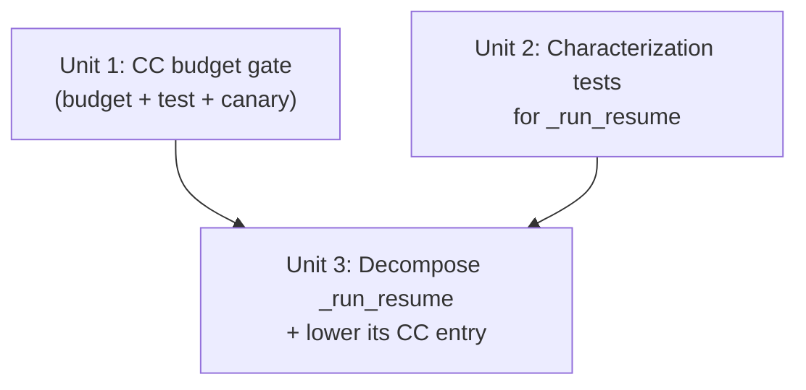

# Cyclomatic-Complexity Budget Gate + `_run_resume` Decomposition

## Overview

Add the one quality axis the repo does not yet gate: **per-function cyclomatic
complexity (CC)**. The monolith budget gates file SLOC and mypy gates types, but nothing
caps how convoluted a function is — so the three most complex functions in the repo
(CC 49–62) sit unguarded on the core publish path. This plan lands a `radon`-based CC
gate modeled on the existing `monolith_budget.toml` machinery, then decomposes the single
worst offender (`_run_resume`, CC 62) behind that gate.

Scope was deliberately narrowed during brainstorm + review (see origin): **gate +
decompose only `_run_resume`**. The other two F-rank functions (`_generate_payload` 50,
`publish.main` 49) are seeded/grandfathered and decomposed lazily when next touched.

## Problem Frame

Per origin (`docs/brainstorms/2026-05-29-cyclomatic-complexity-budget-requirements.md`):
the codebase is pristine on traditional metrics (all A-rank maintainability, ~0 dead code,
6575 tests, SLOC budget, plan-claims gate). The uncovered axis is CC, and the three F-rank
functions are on the highest-churn, highest-value publish path. The durable win is the
**gate** (cheap, compounding, prevents born-complex regressions); decomposing `_run_resume`
removes today's worst risk surface. CC is a proxy not a defect rate (origin caveat), which
is exactly why scope is gate-first + one decomposition rather than a metric-completionist
sweep.

## Requirements Trace

- R1. CC budget file keyed by `<file>::<radon fullname>`, gating Function + Method blocks (see origin R1).
- R2. Seed every function above the backstop at current CC — exactly the 6 E/F-rank blocks at backstop 30 (origin R2).
- R3. Enforcement = named set + high backstop (CC ≤ 30 for unlisted); seed floor = backstop + 1, no dead zone (origin R3).
- R4. Same-PR ceiling bump + ≥80-char rationale; CC gets its own seed convention, not SLOC's `round_up_to_10(+30)` (origin R4).
- R5. Gate runs as a blocking pytest test, not an orphaned `scripts/check_*.py` (origin R5).
- R6. Decompose `_run_resume` (CC 62) into a thin shell + testable units, each under the backstop; characterization tests first (origin R6).
- R7. `_generate_payload` (50) and `publish.main` (49) are seeded/grandfathered, **not** decomposed now — decomposed lazily when next touched (origin R7). Satisfied by the Unit 1 seed entries + the Scope Boundaries.
- R8. Behavior-preserving — no change to stdout JSONL, stderr, exit codes, or publish/resume semantics (origin R8).
- R9. Independently revertable units (origin R9).
- R10. Land the gate first (seeded at current CC), then decompose `_run_resume`, lowering its entry in the same PR (origin R10).

## Scope Boundaries

- **Not** decomposing `_generate_payload` or `publish.main` — seeded/grandfathered, lazy (origin).
- **Not** a low default-on-everything cap; unlisted functions only hit the CC-30 backstop.
- **Not** touching the ~24 D-rank functions (CC 21–30) — they sit under the backstop, unlisted.
- **Not** changing mypy status or the monolith SLOC budget.
- **No** functional/product behavior change — internal-quality + guardrail only.

## Context & Research

### Relevant Code and Patterns

- **`tests/test_no_monolith_regrowth.py`** — the structural template to adapt: loads a TOML
  budget at collection time, `@pytest.mark.parametrize`s over entries, has `_measure_*`
  with explicit `pytest.fail` on read/syntax errors, a schema test (int ceiling + ≥80-char
  rationale), a per-entry ceiling test, a synthetic-tmp red-path test, and a
  `test_radon_*_behavior_pinned` canary. **Adapt structure, not policy** — its
  `_measure_sloc` uses `radon.raw.analyze().sloc`; CC uses `radon.complexity.cc_visit()`.
- **`tests/fixtures/sloc_canary.py`** — the canary-fixture pattern to mirror as `cc_canary.py`.
- **`monolith_budget.toml`** — the rationale-style and same-PR-bump discipline to mirror.
- **`docs/solutions/best-practices/extract-cli-epilogue-block-2026-05-26.md`** — the
  *established decomposition pattern for this exact codebase*: extract self-contained blocks
  from a CLI `main()`, parameterize cleanly, raise `SystemExit` for exit codes, tighten the
  ceiling. `_run_resume`'s finalize block (lines ~394–441) is structurally identical to the
  `_publish_epilogue` that learning describes.
- **`src/backlink_publisher/cli/_resume.py::_run_resume`** — the decomposition target. It is
  a sequence of clear phases (see seam map below). It is **not** monolith-budget-monitored.

### Institutional Learnings

- `extract-cli-epilogue-block-2026-05-26.md` — extraction criteria (single entry point,
  fixed param set, no backward control-flow into loop state, reads counters by value).
- `document-review-catches-runtime-errors-at-plan-time-2026-05-14.md` and
  `brainstorm-review-defers-to-plan-grounding-2026-05-19.md` — process precedent: plan-time
  review + grounding before execution (already applied — this plan came through both).

### External References

- None. Internal tooling using `radon==6.0.1` (already a pinned dev dep), mirroring an
  in-repo pattern. External research skipped — strong local pattern, no new dependency.

## Key Technical Decisions

- **Separate `complexity_budget.toml` + `tests/test_no_complexity_regrowth.py`** (vs. folding
  into the monolith test/budget): the two have genuinely different data models — monolith is
  per-**file** SLOC keyed by `[files."path"]`; CC is per-**function** keyed by `path::fullname`
  *plus* a global backstop — and different radon APIs (`cc_visit` vs `raw.analyze`). The only
  shared logic is a trivial `src/`-tree `rglob`. A parallel file is more readable than one
  TOML with two incompatible table schemas. Tradeoff: ~5 lines of rglob/tomllib boilerplate
  duplicated (accepted; the adversarial reviewer's duplication concern is small at this size).
- **Key by `path::fullname`; gate `not isinstance(block, radon.visitors.Class)`** — i.e.
  Function + Method blocks, skipping Class-aggregate blocks. Verified: `cc_visit` returns
  methods as `Function` instances with `classname` set and `fullname="C.m"`, and classes as
  `Class` instances with `fullname="C"`. Skipping Class blocks avoids double-counting (a
  class's CC roughly aggregates its methods, already individually gated).
- **Backstop = CC 30** (top of radon's D rank — `cc_rank(30)="D"`, `cc_rank(31)="E"`; so "D/E
  boundary" loosely, precisely the D ceiling). At 30, exactly **6** blocks are above it (the
  E/F set); the ~24 D-rank functions sit safely under it. Seed floor = backstop + 1 = 31, so
  there is no un-gated over-backstop gap (the dead-zone bug fixed at brainstorm time).
- **Known limitation of the gate (accepted):** it measures per-function CC, not call-depth or
  total system complexity, so it cannot prevent metric-gaming — a CC-31 function can be split
  into a CC-20 shell + CC-11 helper that passes while adding indirection (Unit 3's own
  `_publish_one_item` extraction is a benign instance). This is the proxy limitation inherited
  from CC itself (origin: "CC is a proxy, not a defect rate"); the gate's value is catching
  *born-complex* monsters, not policing indirection. We accept it rather than add a call-graph guard.
- **CC ceiling convention = seed at exact current CC, zero headroom** (vs. SLOC's
  `round_up_to_10(current+30)`). CC values are small integers where a +30 headroom would be
  meaningless; a function pinned at its exact current CC cannot gain a branch without a
  same-PR bump + rationale. Stricter than SLOC headroom, appropriate for the metric.
- **Extract `_run_resume`'s phases within `_resume.py` (module-level helpers) or a new
  `_resume_helpers.py` sibling — NOT into `_publish_helpers.py`.** `_publish_helpers.py` is
  at 634/660 SLOC (26 headroom); a large extraction there would breach its monolith ceiling
  and drag an unrelated file into this PR. `_resume.py` is not budget-monitored, so
  co-locating helpers there is clean.
- **Tool = `radon` `cc_visit` / `cc_rank`** — already pinned at 6.0.1; CC verified
  byte-identical across Python 3.11/3.12 (and 3.14 spot check), so exact-value ceilings are
  safe across the CI matrix. The real drift vector is a radon bump, caught by the canary.

## Open Questions

### Resolved During Planning

- Gate model: separate budget file + test (decision above).
- Block keying + Class handling: `path::fullname`, skip `Class` blocks (verified via `cc_visit`).
- Backstop value: CC 30; seed set = the 6 E/F blocks; seed floor = 31.
- CC ceiling convention: exact current CC, no headroom.
- Extraction destination: within `_resume.py` / new sibling, not `_publish_helpers.py`.
- Gate posture: unlisted-over-backstop **hard-fails** (no advisory/UserWarning tier — unlike the
  monolith's >500-SLOC warning canary, which is informational). A born-complex new function
  should block, per R5's "blocking" intent.
- Extracted helpers must be module-level (gate sees only top-level `cc_visit` blocks).

### Deferred to Implementation

- Exact `_run_resume` extraction boundaries — which of the 7 phases (seam map below) become
  named helpers. Measure each extracted function's CC and iterate until the shell and every
  helper land ≤ 30. Depends on seeing real post-extraction CC; do not pre-commit a partition.
- Exact `cc_canary.py` expected CC value — hand-craft a deliberately-branchy function, then
  measure with `radon cc -s tests/fixtures/cc_canary.py` and pin the constant.
- Whether the finalize/no-op epilogue in `_run_resume` can share a helper with
  `_publish_epilogue` (the fresh path's epilogue) — assess during extraction; only unify if
  the union-output + exit-code logic is genuinely identical, else keep parallel.

## High-Level Technical Design

> *This illustrates the intended approach and is directional guidance for review, not
> implementation specification. The implementing agent should treat it as context, not code
> to reproduce.*

**Gate enforcement — two rules over one `cc_visit` pass per file:**

```
backstop = 30
budget   = load("complexity_budget.toml")        # { "path::fullname": {ceiling, rationale} }

for each src/**/*.py:
    for block in cc_visit(text):                   # TOP-LEVEL blocks only; nested defs
        if isinstance(block, Class):  continue     # live in block.closures (invisible) — so
                                                   # extracted helpers must be module-level
        # gate functions + methods only
        key = f"{relpath}::{block.fullname}"
        if key in budget:
            assert block.complexity <= budget[key].ceiling     # named: no regrowth
        else:
            assert block.complexity <= backstop                # unlisted: backstop cap
```
Plus: schema test (int ceiling, ≥80-char rationale), synthetic-tmp red-path tests for both
rules, and a radon-CC canary pinning `cc_canary.py`'s measured CC.

**`_run_resume` seam map (CC 62 → phases; directional, exact partition deferred):**

```
_run_resume(args)
 ├─ 1. load + setup         load_checkpoint / config / banner / dedup precondition /
 │                          acquire leases / verify_adapter_setup per platform
 ├─ 2. revalidate+reclass   loop: re-validate payloads, reclassify retro_lang/anchor   → helper -> (retro_lang, retro_anchor)
 ├─ 3. select to_process    filter pending/failed minus retro/policy-skip + 5xx warns  → helper -> list
 ├─ 4. no-op early return    nothing to process: emit done-union, project, exit 0       → helper
 ├─ 5. throttle precompute   resume_elapsed_skip_throttle from last medium done ts      → helper
 ├─ 6. publish loop          per-item: throttle, token-drift, dedup gate (skip/hold/
 │                           dispatch), publish (policy|adapter), exception cluster,
 │                           in-band error, verify, record_done, checkpoint update
 │                           (exception cluster -> helper; loop body may need a small
 │                            result enum to drive continue/return without shared mutable state)
 └─ 7. finalize              recon line, reload ckpt, project, build done-union,
                             write_jsonl, exit 0/4/5                                     → helper (cf. _publish_epilogue)
```

## Implementation Units



- [x] **Unit 1: CC budget gate (budget file + enforcement test + canary)** — shipped 2026-05-29 (7-block seed, 33 tests green)

**Goal:** Land a blocking CC gate, green on day one, seeded with the 6 E/F-rank functions and
a CC-30 backstop for everything else.

**Requirements:** R1, R2, R3, R4, R5

**Dependencies:** None (this is the keystone deliverable; satisfies the goal on its own).

**Files:**
- Create: `complexity_budget.toml`
- Create: `tests/test_no_complexity_regrowth.py`
- Create: `tests/fixtures/cc_canary.py`

**Approach:**
- Seed `complexity_budget.toml` with the 6 blocks at CC ≥ 31 at exact current CC. **Keys are
  FULL repo-relative paths** (`str(path.relative_to(repo_root))`, inherited from the monolith
  template's key construction) `::` the radon `fullname` — truncated keys silently miss the
  block and fall into the backstop branch, turning the gate red on day one:
  - `src/backlink_publisher/cli/_resume.py::_run_resume` (62)
  - `src/backlink_publisher/cli/plan_backlinks/_payload.py::_generate_payload` (50)
  - `src/backlink_publisher/cli/publish_backlinks.py::main` (49)
  - `src/backlink_publisher/events/_project_reducers.py::_project_checkpoint` (39)
  - `src/backlink_publisher/cli/plan_backlinks/_links.py::_build_links` (36)
  - `src/backlink_publisher/config/writer.py::save_config` (36)

  Each with a ≥80-char rationale (current shape + why it's high + settling expectation),
  mirroring monolith rationales.
- Adapt the monolith test structure (parametrize over budget keys, explicit `pytest.fail` on
  read/syntax error). Two enforcement rules per the design sketch. `BACKSTOP = 30` constant.
- `cc_canary.py`: hand-crafted branchy function; pin measured CC as `CC_CANARY_EXPECTED`.

**Patterns to follow:** `tests/test_no_monolith_regrowth.py`, `tests/fixtures/sloc_canary.py`,
`monolith_budget.toml` rationale voice.

**Test scenarios:**
- Happy: budget file parses and has ≥1 entry; every entry has int `ceiling` + str `rationale` ≥80 chars.
- Happy: each seeded function's current CC ≤ its budgeted ceiling (real-tree scan).
- Happy: every unlisted Function/Method block in `src/` has CC ≤ backstop (real-tree scan).
- Edge: a Class-aggregate block above the backstop does NOT fail the gate (Class blocks skipped).
- Edge: method vs module function with the same bare name are keyed distinctly by `fullname` (no collision).
- Error path (synthetic tmp): a seeded function whose CC exceeds its ceiling → `AssertionError` with the documented "exceeds ceiling" message.
- Error path (synthetic tmp): an unlisted function with CC > backstop → gate fails naming the function.
- Error path: a budget entry with <80-char rationale → schema test fails.
- Canary: `cc_visit(cc_canary.py)` of the target function == `CC_CANARY_EXPECTED` (radon-drift pin).

**Verification:** `pytest tests/test_no_complexity_regrowth.py` passes on the current tree;
deliberately bumping a seeded function or adding a CC-31 unlisted function turns it red.

- [x] **Unit 2: Characterization tests for `_run_resume`** — shipped 2026-05-29 (4 net-new P0 tests; existing resume suites unaffected)

**Goal:** Lock current `_run_resume` behavior with branch-level tests *before* any extraction,
so Unit 3 is provably behavior-preserving. This unit is the **safety net** for Unit 3 — it does
not own the decomposition (R6) or the behavior contract (R8); it makes regressions detectable.

**Requirements:** Provides the regression net for Unit 3's R6 + R8 (no production code here).

**Dependencies:** None (can run alongside Unit 1), but **not trivially small** — see sizing note.

**Files:**
- Audit baseline (existing): `tests/test_publish_backlinks_resume.py` (~24 tests, the largest),
  `tests/test_publish_backlinks_resume_revalidate.py`, `tests/test_token_revocation_midrun.py`,
  `tests/test_pipeline_inprocess_characterization.py`.
- Modify/Create: extend the above and/or add `tests/test_resume_characterization.py` (new) for
  the genuinely-missing branches.

**Approach:**
- First inventory the four baseline files for which `_run_resume` branches are already covered.
- **The four [P0] invariants below are net-new, not gap-fills** — a scan found no existing
  resume test pinning the in-band-`result.error`→never-`done` hazard, the verify-before-checkpoint
  single-source ordering, the AuthExpired "no later items processed" whole-run-abort, or the
  token-drift "no stranded `attempting` row". These are the load-bearing additions; size this
  unit as real test-authoring against a CC-62 function, not a quick audit-and-fill.
- No production code changes in this unit.

**Execution note:** Characterization-first — these tests must exist and pass against the
*current* `_run_resume` before Unit 3 begins.

**Patterns to follow:** existing resume tests; the 4 autouse network-mock conftest fixtures
(per AGENTS.md Test Patterns).

**Test scenarios:** *(each pins a System-Wide-Impact invariant so Unit 3 cannot regress it)*
- Happy: resume of an all-`done` checkpoint emits the done-union JSONL and exits 0 (no-op path, phase 4); `project_run_safe` called once before `mark_complete`.
- Happy: resume with `pending`/`failed` items dispatches, records `done`, exits 0.
- [P0] Error path: in-band `result.error` (returned, not raised) → `record_failure` + checkpoint `failed`, and the dedup key is asserted to be `failed`/absent, **never `done`** (the immutable-`done` hazard).
- [P0] Ordering: a successful item writes verify→`record_done(verify_ok)`→checkpoint `verified=verify_ok` from one verify call and one `completed_at`; an unverified success carries the `_unverified` suffix and counts toward exit 5, not success.
- [P0] Error path: `AuthExpiredError` → exit 3 + channel marked expired AND **no later items processed** (whole-run abort, not `continue`); `DependencyError` → exit 3 abort.
- [P0] Ordering: a `SystemExit`/revocation raised mid-loop leaves **no stranded `attempting`** dedup row for the current item (token-drift-before-gate).
- Edge: retro-language / retro-anchor reclassification persists the checkpoint AND excludes the item from `to_process` (phase 2 in-place mutation).
- Edge: dedup `skip` marks item done from recorded `live_url`; dedup `hold` leaves it for adjudication; both use the loop-resolved `platform` (key consistency).
- Error path: `BannerUploadError` / `ExternalServiceError` / generic `Exception` → `record_failure` + `continue` (run proceeds).
- Edge: multi-medium-item resume asserts the exact `_sleep_with_throttle` label sequence ("resume first Medium post" / "next Medium post" / none) — pins the carried throttle state + `item_idx` adjacency.
- Integration: still-unfinished → exit 4; unverified → exit 5; `project_run_safe` invoked once after checkpoint reload and before the exit on both the 0 and 5 branches.
- Integration: two-resume sequence — first leaves an item unverified; second (nothing new) re-emits it with `_unverified` suffix but exits 0, not 5 (transient-vs-persisted `unverified_ids`).

**Verification:** New + existing resume tests pass against unmodified `_resume.py`; every
invariant in System-Wide Impact has a corresponding failing-if-violated test before Unit 3 starts.

- [x] **Unit 3: Decompose `_run_resume` and lower its CC budget entry** — shipped 2026-05-29. Outcome beat the ~CC-41 prediction: shell **CC 62→9**, heaviest helper `_publish_one_resume_item` **CC 23** (under the 30 backstop) → no new entries, `_run_resume` entry **removed**. 33 resume tests green (behavior preserved).

**Goal:** Reduce `_run_resume`'s CC and tighten its `complexity_budget.toml` entry in the same
PR, behavior unchanged. **Success is falsifiable, not "removed":** extracting phases 2–5 +
no-op + finalize + the exception cluster (keeping the run-aborting arms in the shell) lands the
shell at **~CC 41 — still above the backstop** (measured during plan review). Reaching ≤ 30
requires also moving the whole per-item publish try/except into a `_publish_one_item` helper
(see Approach for how that reconciles with the abort-in-shell rule). So the committed target is:
**shell + every helper ≤ 30 and the entry removed, OR `_run_resume` lowered from 62 to a stated
N (≤ 41) with rationale** — never "left at 62". Start with a feasibility spike (one real
extraction pass, measure the shell) before committing; if ≤ 30 is unreachable without
compromising the SystemExit-placement invariant, land the lowered-entry outcome rather than
chasing the number.

**Requirements:** R6, R8, R9, R10

**Dependencies:** Unit 1 (gate must exist to re-check) AND Unit 2 (characterization safety net).

**Files:**
- Modify: `src/backlink_publisher/cli/_resume.py`
- Create (if needed): `src/backlink_publisher/cli/_resume_helpers.py`
- Modify: `complexity_budget.toml` (lower/remove the `_run_resume` entry; add entries for any
  extracted helper that must stay > backstop, with rationale)
- Test: rely on Unit 2's characterization tests + full suite (no new behavior to test)

**Approach:**
- Extract phases per the seam map, starting with the lowest-risk self-contained blocks
  (phase 2 revalidation, phase 3 selection, phase 4 no-op, phase 5 throttle, phase 7
  finalize) before the phase-6 publish loop. Follow the `extract-cli-epilogue` criteria
  (single entry point, fixed param set, counters read by value).
- **Loop-body control flow — follow the existing in-repo precedent, do not invent.** The
  verdict-returning pattern this codebase already uses for stateful loops is the right model:
  `_dedup_gate.gate(...)` returns a `(verdict, record)` tuple and the **loop shell** does the
  `continue`/fall-through; the helper computes intent only, and the mutable counters are
  incremented in the shell. (The CLI `gate()` returns the tuple; the underlying
  `store.gate_and_claim` returns the `GateDecision` frozen dataclass at
  `src/backlink_publisher/idempotency/store.py:158`, with `GateVerdict = Literal[...]` at
  `:154` — either shape is a valid model for the extracted loop-body helper.) The exception cluster has a direct precedent too:
  `_record_resume_failure` (`_resume.py:69`) performs side effects and returns `None`, leaving
  `continue` in the shell — mirror it.
- **Run-aborting exits: shell-by-default, helper-OK only with specific `except` types.** The
  `AuthExpiredError`/`DependencyError` arms (`emit_error(exit_code=3)`) and the terminal
  epilogue (`emit_envelope_and_exit`) raise `SystemExit` to abort the whole run. Because
  reaching shell ≤ 30 requires moving the per-item publish try/except into a `_publish_one_item`
  helper (per Goal), that helper MAY own the abort arms **provided it catches only specific
  exception types — never bare `except:` or `except BaseException`** — so the `SystemExit` that
  `emit_error` raises propagates cleanly out of the helper and out of the loop (the intended
  abort), and is not swallowed by a sibling per-item `except Exception` arm. The shell still
  authors the recoverable-vs-abort branch via the helper's returned verdict; only the abort
  `SystemExit` rides through. Lazy `from .. import checkpoint` is fine inside extracted helpers
  (established idiom). This reconciles the two constraints the plan review found in tension.
- **All extracted helpers MUST be module-level** (in `_resume.py` or `_resume_helpers.py`),
  never nested/inner functions. The gate iterates only top-level `cc_visit` blocks; radon holds
  a nested `def` as a `.closures` entry of its parent and does NOT fold its CC into the parent —
  so a nested helper's complexity escapes the gate entirely *and* fails to lower the shell's
  measured CC. The carried loop state (medium-throttle vars, `unverified_ids`, counters) must
  therefore be threaded as parameters / a small state object, not captured by a closure.
- Re-measure CC after each extraction; iterate toward the Goal's target.

**Execution note:** Behavior-preserving refactor — green Unit 2 + full suite is the gate, not
new feature tests. Begin with the feasibility spike named in the Goal.

**Test scenarios:**
- Integration: all Unit 2 characterization tests pass unchanged (byte-identical stdout JSONL, stderr, exit codes).
- Integration: the existing E2E pipeline (`seed.jsonl | plan | validate | publish`) is unaffected.
- Test expectation: no *new* behavioral tests — this unit is a behavior-preserving refactor proven by the Unit 2 net + the CC gate.

**Verification:** `radon cc -s src/backlink_publisher/cli/_resume.py` shows `_run_resume`
(and every new helper) ≤ 30; `tests/test_no_complexity_regrowth.py` passes with the
lowered/removed entry; full suite green.

## System-Wide Impact

- **Interaction graph:** `_run_resume` is called from `publish_backlinks.py::main` on the
  `--resume` path; it touches `checkpoint`, `_dedup_gate`, `_publish_helpers`, adapters,
  `events.project_run_safe`. Decomposition keeps these call sites; only internal structure changes.
- **API surface parity:** the gate is new CI surface; it does not change any runtime contract.
  CI picks up the new pytest file automatically (no `.github/workflows/ci.yml` edit needed).

### State-lifecycle invariants the extraction MUST preserve (verification targets)

These are the ordering/keying invariants in `_run_resume` that a behavior-preserving
extraction can silently break; each maps to a Unit 2 characterization test.

- **[P0] In-band returned error → `record_failure`, never `record_done`.** The dedup terminal
  is immutable: once a key is `done`, later `record_failure` is a no-op and enforce-mode `gate`
  returns `skip` forever, copying the recorded `live_url` into the checkpoint as a published
  URL. If extraction lets a *returned* (`result.error`, not raised) adapter error reach
  `record_done`, it seeds a permanent `done` for a post that never landed — re-publish is
  suppressed forever and stdout emits a fabricated success. This is the single worst failure mode.
- **[P0] Verify-before-checkpoint ordering + single source values.** `_record_publish_path` →
  `_do_verify` → `record_done(verify_ok=…)` → `checkpoint.update_item(done, verified=verify_ok)`
  must stay in order, and the dedup `verify_ok`, checkpoint `verified`, and `_unverified` stdout
  suffix must all derive from one verify call and one `completed_at` per item. Reordering verify
  after the checkpoint write reintroduces the old bug where unverified publishes count as successes.
- **[P0] `continue` vs `return` control flow + token-drift-before-gate.** Recoverable arms
  (Banner/ExternalService/generic exception, in-band error, dedup skip/hold) `continue`;
  the run-aborting arms (`AuthExpiredError`, `DependencyError`) `emit_error(exit_code=3)` then
  `return` — they must NOT fall through to the epilogue, recon line, projection, or union emit.
  `_check_token_drift` must stay strictly before the `gate()` claim so a mid-run revocation
  cannot strand a just-claimed `attempting` row.
- **[P1] Failure-write key/platform consistency.** Every `gate`/`record_intent`/`record_done`/
  `record_failure` for an item must use the same `platform = ckpt.get("platform") or
  row.get("platform","")`; a helper that re-derives platform from `item["platform"]` can orphan
  the dedup row. `record_failure` must not force-downgrade a `uncertain`/5xx-held key.
- **[P1] `project_run_safe(run_id)` placement.** Called exactly once on each terminal path —
  no-op resume (before `mark_complete`/exit 0) and main path (after the checkpoint reload, before
  `write_jsonl` and the exit 0/4/5 dispatch). Exit predicates must be computed from the reloaded
  `updated_ckpt["items"]`, not in-loop tallies. Projection is fail-safe and never changes the exit code.
- **[P1] Medium-throttle carried state.** `first_medium_in_resume`, `last_medium_success_idx`,
  and `resume_elapsed_skip_throttle` are loop-carried and cannot become helper-locals; the
  adjacency test uses `item_idx` = the `enumerate` index over `to_process` (re-indexing a filtered
  sublist inside a helper changes the observable `_sleep_with_throttle` sequence).
- **[P2] `unverified_ids` is this-run-only but re-emit ORs it with the persisted `verified` flag**
  (so prior-run unverified items keep the `_unverified` suffix on re-emit but do NOT re-trigger exit 5).
- **[P2] Retro-revalidation pre-pass** writes the checkpoint AND mutates the in-memory `item`
  dicts in place; `to_process` must observe the post-reclassification state.

- **Unchanged invariants:** stdout = clean JSONL, stderr = diagnostics, exit-code contract
  (0/2/3/4/5), and the monolith SLOC budget are all unchanged. `_publish_helpers.py` is
  deliberately left untouched to avoid its 634/660 ceiling (26 headroom).

## Risks & Dependencies

| Risk | Mitigation |
|------|------------|
| **[P0] Extraction mis-wires the in-band-error branch → immutable `done` dedup row for a post that never landed** (permanent re-publish suppression + fabricated stdout success) | Unit 2 pins it: a returned-error item asserts dedup key `failed`/absent, never `done`. Extraction keeps `record_failure`/`record_done` selection in the shell, not a helper that infers from `result.status` |
| Behavior regression elsewhere in `_run_resume` (highest blast radius on publish path) | Characterization tests first (Unit 2) cover every System-Wide-Impact invariant; behavior-preserving extraction follows the in-repo verdict-return precedent; independently revertable (Unit 3); gate + full suite green required |
| Extraction into `_publish_helpers.py` breaches its 622/660 ceiling | Decision: extract within `_resume.py` / new `_resume_helpers.py`, never `_publish_helpers.py` |
| `radon` version bump silently re-seeds CC values | `cc_canary.py` pin + `radon==6.0.1` already pinned; a bump fails the canary loudly |
| Backstop 30 accidentally catches in-flight work | Verified: exactly 6 blocks > 30 today, all seeded; D-rank (21–30) safe; SEC-6/fetch WIP in tree noted — re-run `radon cc --min E` at seed time |
| Phase-6 loop body resists clean extraction (shared mutable loop state) | Extract low-risk phases first; use a small result type for loop control; leave the loop body inline with a justified budget entry if a clean ≤30 split isn't found |

## Documentation / Operational Notes

- Add a short note to `AGENTS.md` Dev Commands (CC budget exists, how to re-seed) mirroring the
  monolith budget note — minor, can ride in Unit 1.
- Pre-existing unrelated failure flagged in origin: `test_settings_html_final_size` (channel-grouping WIP). Not in scope.

## Sources & References

- **Origin document:** [docs/brainstorms/2026-05-29-cyclomatic-complexity-budget-requirements.md](../brainstorms/2026-05-29-cyclomatic-complexity-budget-requirements.md)
- Pattern: `tests/test_no_monolith_regrowth.py`, `tests/fixtures/sloc_canary.py`, `monolith_budget.toml`
- Learning: `docs/solutions/best-practices/extract-cli-epilogue-block-2026-05-26.md`
- Decomposition target: `src/backlink_publisher/cli/_resume.py::_run_resume`
