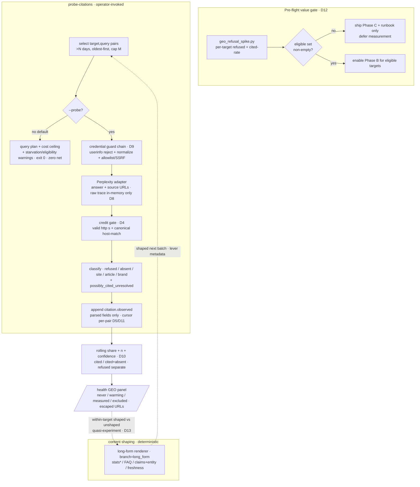
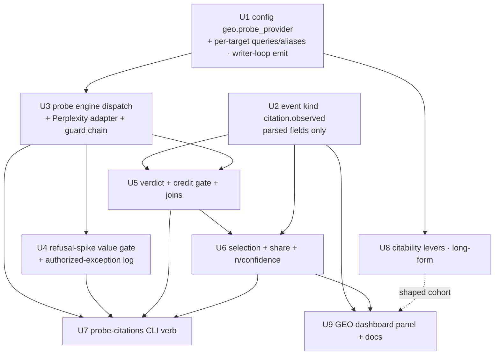

# feat: GEO/AI-citation closed loop (probe + citability shaping)

## Overview

Add the product's first capability to **measure and improve AI-search citation** of target
sites. Two halves:

1. **Measurement** — an operator-invoked CLI verb `probe-citations` that runs configured/derived
   queries through a pluggable AI-engine adapter (v1 = Perplexity, OpenAI-compatible endpoint),
   parses returned source URLs, classifies each result into citation signal tiers, computes a
   rolling-window **citation share**, and emits `citation.observed` events into `events.db`. A GEO
   panel in the health dashboard surfaces per-target share trends.
2. **Content shaping** — the long-form article renderer **deterministically/template-injects** four
   citability levers (quotable stats, FAQ blocks, self-contained claims + entity clarity, freshness
   dates) so published articles are more likely to be cited by answer engines.

The loop is **operator-driven, not auto-tuning**. It does *not* assert causation; instead it closes
via an explicit, honest **within-target quasi-experiment** — comparing the cited-rate of shaped vs
unshaped articles for the *same* target over the *same* window, only surfacing a lever signal when
both cohorts clear a minimum sample (D13). Absent that comparison the two halves are independent
capabilities sharing a dashboard, and the document says so.

## Problem Frame

The pipeline (plan→validate→publish) + anchor distribution + liveness recheck + equity ledger all
serve **classic PageRank backlinks only**. Nothing measures or optimizes whether a target site is
**cited in AI answers** — a surface that, per industry reporting, now handles ~12–18% of *English
informational* queries, where "brand mentions correlate ~3× more strongly with AI visibility than
backlinks" (see origin: Problem Frame).

> **Provenance & transferability caveat (review A6).** Both figures are inherited from the brainstorm's
> GEO landscape research and are **unsourced at plan time** and scoped to the *general English
> informational-query market*. This portfolio is adult/ACG and multilingual (en/ru/ko/zh) — segments
> mainstream answer engines actively suppress or that fall outside informational AI surfaces. **The
> value of this feature for this specific portfolio is therefore unproven**; validating it is precisely
> the job of the U4 pre-flight and the D12 feature-level value gate. Do not treat the headline stats as
> established fact for these targets.

This plan captures value the current architecture structurally cannot see, while reusing the recheck/
events/dashboard substrate rather than inventing new infrastructure.

## Requirements Trace

Carried from `docs/brainstorms/2026-05-29-geo-ai-citation-closed-loop-requirements.md`:

- **R1** Operator-invoked, cron-*compatible* (never default-wired) probe verb; reuse recheck's
  injectable `probe_fn` pattern; pluggable engine, v1 Perplexity only.
- **R2** Engine adapter contract (answer text + source URLs + raw trace); `[geo.probe_provider]`
  config reusing the `[llm.*]` *shape* + env precedence + `https://`-only `base_url`.
- **R3** Per-target queries auto-derived from `seed_keywords`/`topic`, operator-overridable in config.
- **R4** Age-based selection (`> N days`), oldest-first, cap M, documented coverage invariant.
- **R5** Three signal tiers: `site_cited` (north star) / `article_cited` / `brand_mentioned`, plus
  `refused` / `absent`.
- **R6** Rolling-window citation-share metric (not single-shot binary) for Perplexity non-determinism.
- **R7** Emit `citation.observed` to `events.db` time series; do **not** mutate equity ledger.
- **R8** Health dashboard GEO panel: per-target share (30d/90d), tier counts, refused rate.
- **R9** Long-form renderer injects 4 citability levers (en/ru/ko + opt-in LLM path).
- **R10** Stats lever requires a real data source; else degrade to non-numeric assertion + `WARN`.
- **R11** zh-CN short-form **and `work_themed`** paths exempt from thick shaping (zero-cost levers only).
- **R12** Operator-driven, not auto-tuning; publish path never consumes citation signals.
- **R13** Dashboard juxtaposes share + published count actionably, with a concrete decision rule (D13)
  and no causal claim.
- **R14** Attribution honesty: correlation, not causation; distinguish "not cited" vs "refused"; show
  sample size + low-confidence state (D10).
- **R15** Cost visibility; `--dry-run` zero-network preview; cap M.
- **R16** Exit-code contract; opt-in low-share alarm (suppressed below sample floor).
- **D6/D7** Adult-content refusal risk modeled — refusal-spike pre-flight + GEO-eligibility exclusion
  (D6), advisory exit purity (D7).

## Scope Boundaries

- ❌ v1 does **not** implement Gemini / ChatGPT engines (dispatch-by-name keeps the seam open; no
  registry ceremony until a 2nd engine lands — D1).
- ❌ No auto-tuning / auto-content-adjustment (operator-driven).
- ❌ No schema/JSON-LD injection (Medium/Blogger strip it).
- ❌ No AI-bot server-log analysis.
- ❌ No change to the zh-CN LLM-free short-form scheduler core (zero-cost levers only).
- ❌ Equity ledger columns are **not** updated by citation results (events.db + dashboard only).
- ❌ **No runtime LLM on any publish/plan/validate/cron-default path** (P0 convention, D0). The probe is
  an operator-invoked verb; content levers are deterministic.
- ❌ No `SCHEMA_VERSION` bump (direct append of one new kind only — D2).

## Context & Research

### Relevant Code and Patterns

- **CLI verb template:** `src/backlink_publisher/cli/equity_ledger.py` (read-only events.db
  aggregation, JSONL→stdout, banner→stderr, exit 0) and `cli/report_anchors.py` (the `exit 6`
  *advisory* alarm at `report_anchors.py:93-98`; `_EXIT_CODE_ALARM` in `_report_format.py`).
  `argparse` imported **inside** `main()`; registry import at module top. Register verb in
  `pyproject.toml:34-52 [project.scripts]`.
- **Structural twin (probe loop shape only):** `webui_app/services/recheck.py` — `VerifyFn` alias
  (`:24`), `_default_verify` lazy indirection for post-import patching (`:27-32`), `RecheckSummary`
  (`:35-48`), `recheck_one`/`recheck_many` (`:70`/`:142`). **Note (review F5): recheck does NOT append
  events** — it mutates history status. The direct `EventStore.append` precedent is
  `publishing/adapters/image_gen/caps.py:91-101` (with `conn=None` it quarantines immediately on a
  private connection; no `pending_quarantines` sink needed unless sharing a reducer conn). Blueprint
  plan: `docs/plans/2026-05-29-004-feat-recheck-backlinks-survival-loop-plan.md`.
- **Engine dispatch:** keep GEO engines separate from the publish registry (`publishing/registry.py`
  `register:279` mandates `dofollow=` + publish-specific kwargs — coupling unrelated contracts). v1 uses
  a **module-level dispatch-by-name** (dict literal), not a `register_probe()` ceremony (D1/SG1).
- **Events substrate:** `events/kinds.py` (`KINDS` `:55-72`, `Final` consts `:38-51`,
  `REQUIRED_FIELDS` floor `:101-116`); `events/store.py:169` `EventStore.append(...)` (indexed
  `target_url`/`host`/`article_id`; floor-miss → quarantine `-1`; **plain INSERT, no uniqueness** —
  `schema.py` events table has no UNIQUE column → see D11); `EventStore.query` `:320` (SELECT-only).
  Direct append, **bypass projector / Seam B** — no schema bump.
- **LLM provider + credential gate:** `config/parsers/llm.py` (three-state `:93-121`, `https`-only
  `:103-108`, env consts `:14-22`); `llm/http_guard.py` — **two distinct helpers**: `safe_post_json`
  (transport hardening: redirect-off, 3xx-reject, **64KB cap**, content-type) **and**
  `guard_llm_endpoint` (scheme → `is_allowlisted` → `_check_url_for_ssrf`). The existing
  `generate_backlink_text.py:607-641` shows the **full pre-call chain** the probe must reuse: reject URL
  userinfo → normalize base → `guard_llm_endpoint`. `api.perplexity.ai` is already in
  `_util/llm_allowlist.py`. Secret redaction: `llm/client.py:82-101 _redact_for_log` (applied to logs,
  **not** to `EventStore.append` — see D8). Provider class:
  `publishing/adapters/llm_anchor_provider.py` (`_post_chat_completions:197` uses `http_post`, returns a
  `Response`; `_extract_candidates:266`). Refusal-spike model: `scripts/llm_rejection_spike.py`
  (measures **generation** refusal — see D-level note for U4).
- **Config:** `config/loader.py` (`load_config:128`, llm parse `:194`, loose-perm warning `:272-305`);
  `config/parsers/target.py:15` (per-target list precedent); `config/types.py`
  (`LLMProviderConfig:80`, `Config:258`); **`config/writer.py:129-170` REGENERATES every `[targets.*]`
  block** emitting only `anchor_keywords`+`three_url` and adds emitted domains to `known_subsections`,
  which **defeats verbatim preservation for those subsections** (review F2). `_toml_utils.py:12`
  `_SAVE_CONFIG_KNOWN_ROOTS` includes `targets` (regenerated) and excludes `geo` (preserved verbatim).
- **Content renderer fork (R11 boundary):** `cli/plan_backlinks/_engine.py:115-151` `_dispatch_row` —
  `branch="long_form"` → `_generate_payload` (LEVER TARGET); `branch="zh_short"` (`:143`) and
  `branch="work_themed"` (`:127-131`, fires for **any** language with a `three_url` config — not
  zh-only) → EXEMPT. Long-form body: `_payload.py:142-251` (LLM article-gen branch `:144-164` falls
  back to template on exception; returns `content_markdown:275`). work_themed builder:
  `_work_themed.py` / `content/themed_gen.py`. zh zero-cost target: `_zh_short.py`.
- **Dashboard:** `webui_app/routes/health.py` (route `/ce:health` `:59`; `_reconciliation_gaps:37-56`
  read-only + fail-open + `_g_cache:151`; never-500 fallback `:147-162`); `health_metrics.py:171`
  `error_distribution` (GROUP-BY template); `templates/health.html:57-63` (advisory banner). **Confirm
  Jinja autoescape is on for health.html; untrusted source URLs must be escaped (D-level, U9).**
- **article_cited join:** `ledger/sources.py:86` `build_target_buckets` (events floor `:104-117`,
  history floor `:130-153`); `_util/url.py:180` `canonicalize_url` (**pure string normalization — no
  redirect resolution**, see D4/A5). `webui_store/history.py` `HistoryStore`.
- **Exit codes:** `_util/errors.py` (`emit_error`, `emit_envelope_and_exit`, typed `__BLP_ERR__`
  envelope); contract policed by `tests/test_exit_code_contract.py` (`:39`, fail-on-unpinned `:74`).

### Institutional Learnings

- **`no-runtime-llm-2026-05-15.md` (P0):** no LLM on publish/plan/validate/cron paths; operator-verb
  only; runnable with no LLM credential. Log an authorized exception (D0/U4).
- **`medium-liveness-probe-partial-spike-2-2026-05-19.md`:** windowed rate budgets; automated probes
  default-OFF until a full-window observation; isolate probe state (D0/U7).
- **`projector-silent-drop-status-vocabulary-drift-2026-05-26.md`:** unknown kinds quarantine, never
  silent-drop; defer quarantine writes past WAL commit (U2/U6).
- **`dofollow-canary-verdict-dropped-at-publish-output-seam-2026-05-25.md`:** carry the verdict through
  **one shared helper** at the last step of every emit path; present-and-absent test per path (U5/U6).
- **`probe-then-pivot-when-api-unverifiable-2026-05-20.md`:** verify the Perplexity response shape (and
  payload size — D-level F4) against a live endpoint before hardening the parser; pin with a test (U3).
- **`typed-error-envelope-over-stderr-truncation-2026-05-27.md`:** branch on error *class* via the
  `__BLP_ERR__` chokepoint; AST guard bans new bare `raise SystemExit(<nonzero>)` (U3/U7).
- **`argparse-choices-vs-usage-error-exit-clash-2026-05-20.md`:** closed-set args → post-parse
  `UsageError` (exit 1), never `choices=` (U7).
- **`save-config-write-paths-bypass-preservation-2026-05-15.md`:** known-root subsections are
  regenerated — emit per-target keys in the writer loop, not via a post-write merge; round-trip test
  (U1/F2).
- **`floating-point-tiebreak-anchor-scheduler-2026-05-15.md`:** `round(value, 6)` before comparing
  shares/boundaries; hypothesis test (U6).
- **`webui-false-success-resolution.md`:** never `ok:True` on failure; surface partial/failed probes
  honestly (U9).
- **`language-matches-always-true-no-op-gate-2026-05-14.md`:** pin behavior contracts not shapes —
  cited-input→tier AND uncited-input→none (U5 tests).
- **`grep-dofollow-map-before-shipping-adapter-2026-05-20.md`:** validate an engine is *worth* wiring
  before building — U4 is the value gate (D12).
- **`del-os-environ-poisons-...-2026-05-27.md` + `tests-coupled-to-operator-config-state-2026-05-18.md`:**
  `monkeypatch.setenv/delenv`; isolate config dir; marker-based opt-in real-network (all test sections).

### External References

External research deferred: strong local patterns + brainstorm GEO research. The exact Perplexity
citations-field shape **and response size** are an execution-time probe (probe-then-pivot), captured as
deferred-to-implementation, not a planning blocker.

## Key Technical Decisions

- **D0 — Admissibility (P0 reconciliation).** Operator-invoked verb, default `--dry-run` (zero network),
  requires explicit `[geo.probe_provider]` config + `--probe` to hit the network, **never** default-
  wired to cron, product fully runnable with no GEO credential (absent config → `DependencyError`/exit
  3; rest of tool unaffected). The GEO key is read from **`BACKLINK_GEO_*` env or `[geo.probe_provider]`
  only — no silent fallback to `BACKLINK_LLM_API_KEY`** (review C1: a fallback would let an LLM-keyed
  install probe without GEO config). Content levers are deterministic/templated. Authorized exception
  logged (U4). *Rationale:* satisfies the P0 convention while delivering the loop (user decision).
- **D1 — GEO engine separate from publish registry; dispatch-by-name, no registry ceremony for v1.**
  Module-level `dispatch_probe(engine_name, ...)` over a dict, not a `register_probe()`-populated
  registry. *Rationale:* publish `register()` mandates `dofollow=`; separation is correct, but a formal
  registry for one engine is speculative (review SG1) — any dispatch-by-name keeps the "add Gemini with
  zero architecture change" goal.
- **D2 — Direct event append, bypass projector; precedent is `image_gen/caps.py`.** Append
  `citation.observed` directly via `EventStore.append` (recheck supplies the *loop shape*, not the
  append — review F5); no projector/Seam-B/`SCHEMA_VERSION` change. *Rationale:* probe results are a new
  first-class source with no JSON-store predecessor.
- **D3 — Share = cited / (cited + absent); `refused` is a separate first-class rate.** *Rationale:*
  including refusals zeros adult sites structurally (D6); excluding them silently hides refusals.
  Denominator size therefore varies per target → always display alongside sample size n (D10).
- **D4 — Credit gate is asymmetric and acknowledged.** A source URL credits a tier only if it is a
  valid `http(s)` URL and host-matches (path-matches for article) after `canonicalize_url`; **no network
  fetch**. This prevents *inflation* from hallucinated URLs (the easy case) but `canonicalize_url` is
  pure string normalization with **no redirect resolution**, so redirect-wrapped / aggregator source
  URLs whose host is a redirector will fail host-match and *deflate* the metric (review A5). Mitigation:
  a third **`possibly_cited_unresolved`** bucket records wrapper/aggregator URLs (destination extracted
  from known redirector params/path where feasible) surfaced separately on the dashboard, so the
  operator sees uncertainty rather than a falsely-low share. *Rationale:* net-fetch is too costly/
  unsafe; honesty about the asymmetry beats a false-precision gate.
- **D5 — Cursor from the event time-series, advanced per-pair after durable append.** Avoids the
  `verified_at`-overwrite trap (recheck D3); mid-batch abort is safe (completed = durably-appended pairs
  cursored, rest oldest-first next run).
- **D6 — GEO-eligibility from the refusal-spike.** Per-target eligibility renders excluded targets as
  **"excluded: high refusal / never-cites this class of site"**, not 0% cited (review A2: exclude on
  *either* high refusal-rate *or* ≈0 cited-rate among answered probes — Perplexity answering-but-never-
  citing is equally worthless to the north star).
- **D7 — Advisory exit purity.** Default exit 0 even when nothing is cited; opt-in `--fail-on-low-share`
  raises the alarm exit, **suppressed for never-probed / warming-up / below-floor** targets. Mirrors
  anchor-alarm "detection not prevention" (R12).
- **D8 — Raw response trace is NOT persisted into events.** `EventStore.append` serializes the payload
  verbatim with no redaction (`store.py:240`); upstream error bodies can echo `Authorization`/`Bearer`/
  `api_key`, and answer/query text can carry PII (review S2). `raw_response` stays **in-memory for the
  run only**; the `citation.observed` payload persists only parsed, bounded fields (`verdict`, `engine`,
  `query`, credited/uncredited URLs, counts). If a trace must ever be persisted for debugging, it is
  routed through `_redact_for_log` + a hard size cap with a retention note. *Rationale:* prevent secret/
  PII at-rest leakage.
- **D9 — Reuse the full credential-protection chain before any Bearer-carrying call.** `safe_post_json`
  alone does **not** SSRF/allowlist-gate (review S1). The probe reuses
  `generate_backlink_text`'s chain: reject endpoint userinfo → normalize base (gated host == connected
  host) → `guard_llm_endpoint` (scheme → allowlist → SSRF) → only then POST with the key. *Rationale:*
  a hostile/misconfigured `base_url` would exfiltrate the operator's GEO key; https-only is insufficient.
- **D10 — Metric honesty: W and the min-sample floor are PLANNING decisions, not deferred.** At small
  per-window probe counts a share has no usable confidence interval (review A4). The dashboard displays
  every share **with its sample size n** and a **low-confidence badge** below the floor; the
  `--fail-on-low-share` alarm and the "measured" state only apply above the floor; trend lines are not
  drawn below a minimum number of windows. *Rationale:* presenting single-digit-n shares as a trend is
  sampling noise dressed as signal.
- **D11 — No write-time idempotency; rely on per-pair cursor + flock.** The events table has no
  uniqueness and a schema bump is forbidden, so write-time idempotency has no enforcement point (review
  F1). A transient failure **re-probes**, it does not re-append; the per-pair cursor (D5) advances only
  after durable append; `flock` prevents overlapping runs (review SG5). If at-least-once still occurs,
  the share query **dedups at read time** by `(target, query, run_id)`. *Rationale:* the stated
  invariant gets a real mechanism instead of a deferred shape.
- **D12 — Feature-level value gate (not just per-target).** U4's refusal-spike is a go/no-go for the
  *whole measurement half*: if the GEO-eligible target set is empty/near-empty (the realistic case for
  an adult/ACG portfolio — review A1), **ship only Phase C (deterministic levers) + the runbook and
  defer Phase B**. Phased Delivery encodes this branch. *Rationale:* don't build ~5 units of measurement
  infrastructure + a P0 exception for a metric with a near-empty domain.
- **D13 — Loop closure is a within-target quasi-experiment, not a juxtaposition.** The operator's
  decision rule: *per target, compare the cited-rate of shaped vs unshaped articles within the same
  rolling window; surface a lever signal only when both cohorts have ≥K articles and ≥W probes.* Below
  that, the dashboard shows the two halves as independent and makes **no** lever recommendation (review
  A3). *Rationale:* "actionable" + "no causal claim" are only reconcilable through a controlled
  comparison; otherwise relabel as two features — this keeps the honest middle.

## Open Questions

### Resolved During Planning

- Cron-driven vs operator-invoked? → Operator-invoked, off cron-default (D0).
- Credential fallback to the LLM key? → No; `BACKLINK_GEO_*`/config only (D0).
- Overload publish registry / build a registry? → Neither; dispatch-by-name (D1).
- New events schema/projector reducer? → No; direct append, new kind only (D2); precedent caps.py (F5).
- Does `refused` count against share? → No; separate rate (D3).
- Hallucinated URLs inflating the north star? → Credit gate (D4); plus the deflation risk + third
  bucket are acknowledged (D4/A5).
- What does an excluded adult target show? → "excluded," not 0% (D6); exclude on refusal **or** zero
  cited-rate (A2).
- Persist the raw trace? → No (D8).
- SSRF/credential exfil on the probe call? → Full guard chain reused (D9).
- Is the metric meaningful at small n? → Show n + low-confidence badge; floor-gate the alarm (D10).
- Idempotency mechanism? → Cursor + flock + read-time dedup; no write-time key (D11).
- Build the measurement half if the portfolio is adult? → Feature-level value gate (D12).
- How does the "loop" actually close? → Within-target shaped/unshaped quasi-experiment (D13).
- Levers via runtime LLM? → No; deterministic/templated (D0, R10/R11).

### Deferred to Implementation

- **Perplexity source-URL field path AND payload size** — verify against the live endpoint
  (probe-then-pivot). Any parse failure → structured `absent`/`parse_error`, never an exception. If
  `safe_post_json` is the chosen client, its 64KB cap may reject large citation responses (review F4) —
  either raise the cap for the probe path or catch the oversize `ValueError` → structured outcome.
- **HTTP client choice** — `safe_post_json` (tuple, raises on guard failures) vs `http_post` (Response,
  manual status mapping). Pick one in U3 and document the error mapping (review F3).
- **Refusal-phrase detection** is locale-dependent (en/ru/ko) — heuristic chosen against real responses.
- **Concrete N / M / W / min-sample floor / K / low-share threshold** — W, the floor, and K are bounded
  by D10/D13 (must yield a usable interval) and the coverage invariant `M * (N / P) >= C`.
- **Query auto-derivation algorithm** — heuristic finalized at implementation.
- **Redirector-param extraction list** for the `possibly_cited_unresolved` bucket (D4).

## High-Level Technical Design

> *This illustrates the intended approach and is directional guidance for review, not implementation
> specification. The implementing agent should treat it as context, not code to reproduce.*

## Implementation Units

### Phase A — Foundations

- [ ] **Unit 1: GEO config (`[geo.probe_provider]` + per-target queries/brand-aliases)**

**Goal:** Parse and expose GEO config without breaking no-credential installs or `save_config`.

**Requirements:** R2, R3, D0.

**Dependencies:** None.

**Files:**
- Create: `src/backlink_publisher/config/parsers/geo.py` (mirror `parsers/llm.py` shape)
- Modify: `src/backlink_publisher/config/parsers/target.py` (add `probe_queries`, `brand_aliases`)
- Modify: `src/backlink_publisher/config/types.py` (`GeoProbeConfig`; `Config` fields)
- Modify: `src/backlink_publisher/config/loader.py` (wire parser at the `:194` dispatch site)
- Modify: `src/backlink_publisher/config/writer.py` (emit `probe_queries`/`brand_aliases` inside the
  `[targets.*]` regeneration loop `:129-170`, threaded as `save_config` params like
  `target_anchor_keywords`)
- Test: `tests/test_config_geo_provider.py`, `tests/test_config_geo_targets.py`

**Approach:**
- Mirror `_parse_llm_anchor_provider`: env precedence (**`BACKLINK_GEO_*` only — no LLM-key fallback**,
  D0), three-state `None`/`{}`/non-empty, `base_url` must be `https://`, returns `GeoProbeConfig | None`.
- Per-target `probe_queries`/`brand_aliases` mirror `_parse_target_anchor_keywords` (tolerant skip+warn,
  domain key `rstrip("/")`).
- **`[geo.probe_provider]`** stays out of `_SAVE_CONFIG_KNOWN_ROOTS` → preserved verbatim. **Per-target
  keys live under the `targets` known root, which the writer REGENERATES** — so they are dropped unless
  emitted by the writer loop (review F2). Do **not** rely on a post-write merge helper (`_geo_merge.py`
  is dropped). The GEO `api_key` is **never a CLI flag**; confirm `load_config`'s loose-permission
  warning (`:272-305`) covers the GEO key path (review S4).

**Patterns to follow:** `config/parsers/llm.py`, `config/parsers/target.py:15`, `config/writer.py`
target loop, loader three-state handling `loader.py:201-228`.

**Test scenarios:**
- Happy path: full `[geo.probe_provider]` → populated `GeoProbeConfig`; per-target `probe_queries`
  parsed.
- Edge: section absent → `None`; `{}` → distinct outcome; missing required field with others present →
  `InputValidationError`; non-https `base_url` → `InputValidationError`; `BACKLINK_GEO_*` overrides TOML.
- Edge: a populated `BACKLINK_LLM_API_KEY` with **no** GEO config does **not** enable probing.
- Edge: malformed per-target query entry → skipped + WARN, valid entries kept.
- Integration: `save_config` → reload → `save_config` round trip preserves `[geo.*]`, the per-target
  `probe_queries`/`brand_aliases`, **and** every pre-existing section (assert each survives).
- Integration: `load_config()` with no GEO config and no GEO env succeeds (no-credential install).

**Verification:** Config loads with/without GEO; round-trip preserves all sections incl. per-target GEO
keys; non-https rejected; LLM key alone never enables probing.

- [ ] **Unit 2: `citation.observed` event kind (parsed fields only)**

**Goal:** Register the new kind through the events contract; persist only bounded, non-sensitive fields.

**Requirements:** R7, D2, D8.

**Dependencies:** None.

**Files:**
- Modify: `src/backlink_publisher/events/kinds.py` (`Final` const + `KINDS` + `REQUIRED_FIELDS` floor)
- Test: `tests/test_events_kinds.py` (extend), `tests/test_citation_event_append.py` (new)

**Approach:**
- Add `CITATION_OBSERVED: Final = "citation.observed"` to consts (`:38-51`) and `KINDS` (`:55-72`); do
  not rename later (Seam A). Floor (`:101-116`): `{"verdict", "engine", "query"}`.
- Append via `EventStore.append(...)` with `conn=None` (immediate, safe quarantine — precedent
  `image_gen/caps.py:91-101`). **Payload excludes `raw_response`** (D8) — only verdict, engine, query,
  credited/uncredited URLs, counts. No `STATUS_MAP`/projector/Seam-B/`SCHEMA_VERSION` change.

**Patterns to follow:** existing kind additions; `events/store.py:169`; `image_gen/caps.py:91-101`.

**Test scenarios:**
- Happy path: append with full parsed payload → row persisted, positive rowid.
- Edge: payload missing a floor key → quarantined, returns `-1`, no exception.
- Edge: every kind in `KINDS` has a `REQUIRED_FIELDS` entry (existing gate stays green).
- Security: no `Bearer`/`api_key` substring can appear in an appended row (raw trace excluded — D8).
- Integration: `EventStore.query` reads back citation rows filtered by `target_url`/`host`.

**Verification:** New kind passes the contract gate; rows append/query back; floor-miss quarantines;
no secret can land in a row.

### Phase B — Measurement core *(gated by D12 — build only if the eligible target set is non-empty)*

- [ ] **Unit 3: Probe engine dispatch + Perplexity adapter (+ credential guard chain)**

**Goal:** A dispatch-by-name engine seam and a v1 Perplexity adapter that gates the endpoint, never
raises mid-batch, and never persists secrets.

**Requirements:** R1, R2, D1, D9.

**Dependencies:** U1.

**Files:**
- Create: `src/backlink_publisher/geo/__init__.py`
- Create: `src/backlink_publisher/geo/engines.py` (`dispatch_probe(engine_name, query, cfg)` over a dict;
  `ProbeResult` dataclass: `answer_text` / `source_urls` / `raw_response` / `outcome`)
- Create: `src/backlink_publisher/geo/perplexity.py` (`probe_perplexity`)
- Test: `tests/test_geo_engine_dispatch.py`, `tests/test_geo_perplexity_adapter.py`

**Approach:**
- Dispatch-by-name (dict literal), not a registry ceremony (D1). Unknown engine → clear error.
- **Before any network call** (D9): reject endpoint userinfo → normalize base → `guard_llm_endpoint`
  (scheme → allowlist → SSRF). Then POST `{base}/chat/completions`. **Pick one HTTP helper** (review
  F3): document whether `safe_post_json` (map its `ValueError` redirect/content-type/**oversize**
  classes → structured `parse_error`/`absent`) or `http_post` (manual status mapping). Parse answer +
  citations field; **field path & response size verified during probe-then-pivot** (review F4); keep
  `raw_response` **in-memory only** (D8). Any parse failure → structured `absent`/`parse_error`, never
  raise. Route auth(4xx)→`DependencyError`, 429/5xx→transient/`ExternalServiceError`, declined→`refused`
  through the typed `__BLP_ERR__` chokepoint.

**Execution note:** Probe the live Perplexity endpoint first to confirm the citations field shape **and
typical payload size** before hardening the parser; pin with a fixture-backed test.

**Patterns to follow:** `generate_backlink_text.py:607-641` (guard chain),
`publishing/adapters/llm_anchor_provider.py:197,266`, `llm/http_guard.py`.

**Test scenarios:**
- Happy path: mocked 200 with citations → `ProbeResult` with parsed source URLs.
- Edge: 200 empty content → `absent`; malformed/missing citations → `parse_error`/`absent`, no raise;
  oversize body → structured outcome (not an unhandled `ValueError`).
- Error path: 4xx auth → `DependencyError`; 429/5xx → transient; refusal text → `refused`.
- Security: non-allowlisted or userinfo-bearing `base_url` is rejected **before** any request (no key
  sent); `raw_response` never leaves memory.
- Integration: adapter not called when network disabled (autouse socket guard holds).

**Verification:** Endpoint gated before send; all response shapes yield structured outcomes without
raising; no secret persisted/sent to a non-allowlisted host.

- [ ] **Unit 4: Refusal-spike value gate + authorized-exception log**

**Goal:** Decide go/no-go for the *whole measurement half* and per target, measuring **citation**
behavior (not generation), before any production probing.

**Requirements:** D6, D12, D0.

**Dependencies:** U1, U3.

**Files:**
- Create: `scripts/geo_refusal_spike.py`
- Create: `docs/solutions/best-practices/geo-probe-authorized-llm-exception-2026-05-29.md`
- Test: `tests/test_geo_refusal_spike.py`

**Approach:**
- Standalone script: a fixed set of query shapes per target → classify each as `refused` / `absent`
  (answered, no creditable cite) / `cited` → Markdown table + per-target rates + verdict + exit code.
  **Only the table/exit-code shape is shared with `llm_rejection_spike.py`; the semantics differ** — it
  measures **answer/citation** refusal, not content **generation** refusal (review A2). A target is
  **excluded** on high `refused` rate **OR** ≈0 `cited`-rate among answered probes (answering-but-never-
  citing is equally worthless). Aggregate verdict drives D12: empty eligible set → recommend Phase-C-
  only. Reuses the U3 adapter (+ guard chain).
- The exception doc records: operator-invoked, no required credential, off cron-default, deterministic
  levers, human-reviewed output.

**Patterns to follow:** `scripts/llm_rejection_spike.py` (structure only).

**Test scenarios:**
- Happy path: mixed mocked responses → correct refused/absent/cited counts + table.
- Edge: all-refused target → exclude, exit 1; answered-but-zero-cited target → also exclude.
- Edge: empty target query set → clear message, no crash; adapter raises → counted, never propagates.
- Edge: aggregate eligible set empty → verdict recommends Phase-C-only (D12).

**Verification:** Runs offline in tests; produces per-target refused/absent/cited + a feature-level go/
no-go; exception doc exists.

- [ ] **Unit 5: Verdict classifier + credit gate + article/brand joins**

**Goal:** Turn a `ProbeResult` into a tiered verdict with hallucination-resistant, asymmetry-aware
crediting.

**Requirements:** R5, R14, D3, D4.

**Dependencies:** U2, U3.

**Files:**
- Create: `src/backlink_publisher/geo/verdict.py` (classifier + credit gate + `ProbeSummary` +
  shared `carry_verdict` helper)
- Create: `src/backlink_publisher/geo/joins.py` (article-URL set + brand-alias matcher)
- Test: `tests/test_geo_verdict.py`, `tests/test_geo_credit_gate.py`, `tests/test_geo_joins.py`

**Approach:**
- **Precedence (single reported tier, review C5):** transport error / refusal phrasing → `refused`;
  else evaluate creditable URLs in priority `site_cited` > `article_cited`, and `brand_mentioned` as an
  independent text flag; non-empty answer with zero creditable URLs → `absent`. A URL matching both
  target and a published article reports `site_cited` (headline) but records the article match too.
- **Credit gate (D4):** valid `http(s)` + `canonicalize_url` host-match (path-match for article); **no
  net fetch**. Hallucinated URLs that merely string-contain the domain → not credited. Redirect-wrapped/
  aggregator URLs (host = redirector) → `possibly_cited_unresolved` bucket (extract destination from
  known redirector params/path where feasible), **not** silently dropped (review A5).
- **article_cited join:** published-article-URL set from `ledger/sources.py:86` (`publish.confirmed`
  floor preferred), canonicalized via `_util/url.py:180`.
- **brand_mentioned:** word-boundary/token match, locale-aware (Cyrillic/Hangul); raw substring
  forbidden; missing aliases → tier inert (warned at U7 dry-run).
- `carry_verdict` is the last step of every emit path; `round(share, 6)` before comparison.

**Patterns to follow:** `ledger/sources.py:86-153`; `_util/url.py:180`; dofollow-canary shared-carry
helper.

**Test scenarios:**
- Happy path: host-match → `site_cited`; published-article URL → `article_cited`; brand alias → flag.
- Edge (inflation): garbled URL string-containing the domain → not credited (recorded uncredited).
- Edge (deflation, A5): redirect-wrapper URL whose host is a redirector but destination = target →
  `possibly_cited_unresolved`, not dropped.
- Edge (join): article URL differing only by utm/trailing-slash/http→https → matches after
  canonicalization.
- Edge: brand="Ace" must NOT match "place"; missing alias list → inert, no false positive.
- Edge: known-cited input → tier AND known-uncited input → no tier (behavior contract); refusal
  phrasing → `refused`; URL matching both target and article → `site_cited` + article recorded.

**Verification:** Every tier fires on a true positive, silent on a true negative; inflation prevented;
deflation surfaced (not hidden).

- [ ] **Unit 6: Selection + rolling-window share (with sample size + confidence)**

**Goal:** Choose what to probe and compute the headline metric honestly, never presenting noise as
signal.

**Requirements:** R4, R6, D3, D5, D6, D10, D11.

**Dependencies:** U2, U5.

**Files:**
- Create: `src/backlink_publisher/geo/selection.py` (age-based pair selection + cursor)
- Create: `src/backlink_publisher/geo/share.py` (rolling-window share + n + state)
- Test: `tests/test_geo_selection.py`, `tests/test_geo_share.py`

**Approach:**
- Selection: `(target, query)` pairs whose last `citation.observed` is `> N days` old, oldest-first,
  cap M. Cursor derived from the event time series (D5). Surface worst-case re-probe cadence vs N
  (coverage invariant `M*(N/P) >= C`); flag starvation.
- Share (D3/D10): `cited / (cited + absent)` over a rolling window of W probes per target, **always
  paired with sample size n**; `refused` and `possibly_cited_unresolved` as independent rates. States:
  **never-probed**, **warming-up** (`< min-sample floor` → "insufficient data", never 0%), **measured**
  (≥ floor → may carry a low-confidence badge), **excluded** (D6). `round(.,6)`. W, floor are set per
  D10 (must yield a usable interval), not deferred.

**Patterns to follow:** recheck plan U3/U4; floating-point-tiebreak learning.

**Test scenarios:**
- Happy path: pairs older than N selected oldest-first, capped at M.
- Edge: first-ever probe → never-probed, no share, no alarm; `< floor` → warming-up "insufficient
  data", not 0%; two targets with very different n are not presented as directly comparable point
  estimates.
- Edge: refused-heavy target → share over cited+absent only; refused + unresolved rates separate;
  pre-marked excluded target → excluded state, not 0%.
- Edge: corpus larger than `M*(N/P)` → starvation flag; oldest pair never starved across runs.
- Edge: float shares from different arithmetic paths compare equal after `round(.,6)` (hypothesis).

**Verification:** Oldest-first, capped; share never misleads for unprobed/warming/excluded; small-n
shares flagged low-confidence; starvation visible.

- [ ] **Unit 7: `probe-citations` CLI verb (assembly)**

**Goal:** The operator-facing verb wiring selection → guard → probe → classify → emit, with strict
safety defaults.

**Requirements:** R1, R15, R16, D0, D5, D7, D11.

**Dependencies:** U3, U4, U5, U6.

**Files:**
- Create: `src/backlink_publisher/cli/probe_citations.py` (thin shell)
- Create: `src/backlink_publisher/geo/run.py` (pure kernel: `probe_one`/`probe_many` with injectable
  `probe_fn`, `ProbeSummary`)
- Modify: `pyproject.toml` (`[project.scripts]` add `probe-citations = ...`)
- Modify: `AGENTS.md` (CLI entrypoint table + known-trap note)
- Test: `tests/test_cli_probe_citations.py`, `tests/test_geo_run.py`

**Approach:**
- `--dry-run` is the **default**: print the selected query plan + estimated cost **ceiling** (upper
  bound, not forecast) + per-target starvation/eligibility/missing-brand-alias warnings; **zero
  network**; exit 0.
- `--probe` hits the network (requires GEO config; absent → `DependencyError`/exit 3). Per-pair: guard
  (D9) → probe → classify (U5) → append parsed fields (U2/D8) → advance cursor (D5). A transient failure
  **re-probes, not re-appends** (D11). Mid-batch abort on cost cap / wall-clock budget exits cleanly
  with **durably-appended** pairs cursored, rest untouched (never-raises). `flock` against overlapping
  runs; isolate probe state.
- Closed-set args (`--engine`, `--format`) validated post-parse via `UsageError` (exit 1), not
  `choices=`. stdout = JSONL summary; stderr = diagnostics + one `logger.recon(...)` per run. Default
  exit 0; opt-in `--fail-on-low-share` → advisory `exit 6` (anchor-alarm semantics), **suppressed for
  never/warming/below-floor** targets (D7/D10). No `--api-key` flag (S4).

**Execution note:** Add a failing test first for "`--dry-run` performs zero network and exits 0".

**Patterns to follow:** `cli/equity_ledger.py`, `cli/report_anchors.py:93-98`, recheck plan U5,
`extract-cli-epilogue-block` learning.

**Test scenarios:**
- Happy path (`--probe`, mocked): pairs probed, rows emitted, summary JSONL on stdout, recon on stderr,
  exit 0.
- Happy path (`--dry-run` default): plan + cost ceiling, **zero network**, exit 0.
- Edge: `--probe` with no GEO config → `DependencyError`/exit 3; `--engine bogus` → `UsageError`/exit 1.
- Edge: cost cap / wall-clock budget mid-batch → durably-appended pairs cursored, rest untouched, exit
  0, never-raises; a transient-failure pair re-probes next run without a double row (D11 read-time
  dedup if at-least-once).
- Edge: `--fail-on-low-share` with a measured above-floor low-share target → exit 6; only warming/below-
  floor targets → exit 0.
- Edge: overlapping run declined via flock; no `--api-key` flag exposed.

**Verification:** Default never touches the network; real probing only under `--probe` with config; exit
codes match the contract; no double-count on retry.

### Phase C — Content shaping *(scope gated by D12/A7)*

- [ ] **Unit 8: Citability levers in the long-form renderer**

**Goal:** Deterministically inject the four citability levers into long-form articles, with the stats
lever guarded against fabrication.

**Requirements:** R9, R10, R11, R13, D0.

**Dependencies:** U1.

**Files:**
- Modify: `src/backlink_publisher/cli/plan_backlinks/_payload.py` (body assembly `:142-251`,
  `branch="long_form"` only)
- Create: `src/backlink_publisher/cli/plan_backlinks/_citability.py` (lever builders + applied-lever
  metadata)
- Modify: `src/backlink_publisher/cli/plan_backlinks/_zh_short.py` (zero-cost levers only)
- Modify: `src/backlink_publisher/cli/plan_backlinks/_work_themed.py` (zero-cost levers only, or
  explicitly none — see R11 note)
- Modify: `src/backlink_publisher/cli/plan_backlinks/_engine.py` (record applied-lever metadata on the
  payload at the `_dispatch_row` seam)
- Test: `tests/test_citability_levers.py`, `tests/test_citability_stats_guard.py`,
  `tests/test_zh_short_exemption.py`, `tests/test_work_themed_exemption.py`

**Approach:**
- Levers are **template/deterministic** (no runtime LLM): ① quotable-stat paragraph **only** when the
  target config supplies a real data-source field; else degrade to a non-numeric assertion + **exactly
  one** `plan_logger.warn(...)` per article (R10/C6). The "no fabricated statistics" line in
  `llm/client.py:157` is **intent precedent only, not reusable code** (review F7) — the guard is a fresh
  deterministic config-field check. ② FAQ/direct-answer block keyed off topic/seed_keywords. ③ self-
  contained claim sentences naming the entity. ④ freshness line (explicit date).
- Apply all four on `branch="long_form"` only. `branch="zh_short"` and **`branch="work_themed"`** get
  **only** freshness + entity-clarity (R11). **Note:** `work_themed` fires for **any** language with a
  `three_url` config (not zh-only) — it is a separate builder (`_work_themed.py`), so it must be touched
  explicitly (review F6). Record applied levers per payload (metadata) for the D13 shaped/unshaped
  comparison.
- Reuse the `_emit_link_count_recon` recon idiom: one structured line per article on applied levers.

**Patterns to follow:** `_payload.py` body accretion; `_engine.py:115-151` branch fork.

**Test scenarios:**
- Happy path: long-form payload contains FAQ block, ≥1 entity-naming claim, a freshness date.
- Edge (stats guard): configured data source → numeric stat; none → non-numeric assertion + exactly one
  WARN, no fabricated number.
- Edge (exemption): zh-short payload has freshness + entity clarity but no FAQ/stats; within 150–200
  char envelope. work_themed payload likewise gets only zero-cost levers.
- Edge: applied-lever metadata recorded on shaped and exempt payloads.
- Integration: rendered `content_markdown` still passes validate-backlinks link-count/anchor checks.

**Verification:** Long-form carries levers; stats never fabricated; zh-short and work_themed unchanged
except zero-cost levers; lever metadata present.

### Phase D — Visibility & docs

- [ ] **Unit 9: GEO dashboard panel + runbook**

**Goal:** Make the loop observable and actionable without implying causation or inviting over-trust.

**Requirements:** R8, R12, R13, R14, D6, D10, D13.

**Dependencies:** U2, U6 (and U8 for shaped-cohort segmentation).

**Files:**
- Modify: `webui_app/routes/health.py` (`_geo_panel()` helper, cached + fail-open, into `_render`)
- Modify: `webui_app/health_metrics.py` (`geo_citation_share(store, *, window_days)` GROUP-BY helper)
- Modify: `webui_app/templates/health.html` (GEO panel block)
- Create: `docs/operations/geo-probe.md` (runbook: refusal-spike pre-flight → D12 go/no-go → enable →
  read panel → D13 decision rule → "how to read this without fooling yourself"), plus AGENTS.md known-
  trap entry + a falsifiable baseline metric
- Test: `tests/test_webui_health_geo_panel.py`

**Approach:**
- `_geo_panel()` mirrors `_reconciliation_gaps` (read-only `EventStore().query`, error → `{}`), via
  `_g_cache`. Metric helper mirrors `error_distribution` (`json_extract` verdict/engine/URLs, GROUP BY
  target, rolling 30d/90d).
- Panel renders per-target: share **with sample size n and a low-confidence badge below floor** (D10),
  with **never-probed / warming / measured / excluded / no-published-articles** states (never a
  misleading 0%); tier counts; refused + `possibly_cited_unresolved` rates; per-query hit/miss; and the
  **D13 shaped-vs-unshaped within-target comparison** (lever signal only when both cohorts clear K/W).
  Copy is **advisory / correlation-not-causation** (R14); no trend line below a minimum number of
  windows (D10). **Untrusted source URLs are HTML-escaped** (confirm Jinja autoescape on health.html)
  and only `http(s)` URLs render as links — `javascript:` etc. neutralized (review S3). Never 500s.
- Runbook includes the over-trust guard (review A8): minimum movement and minimum n before treating a
  share change as real.

**Patterns to follow:** `routes/health.py:37-56,147-162`; `health_metrics.py:171`;
`templates/health.html:57-63`; recheck plan U6 dashboard severity-tiering + advisory copy.

**Test scenarios:**
- Happy path: measured above-floor target renders trend + tier counts + n.
- Edge: never-probed / warming / excluded / no-published-articles / below-floor each render as their
  distinct state, not 0%; no trend line below minimum windows.
- Edge: events.db read error → panel fails open to empty, route still 200 (never-500 test).
- Security: a `citation.observed` row whose source URL contains an HTML/`javascript:` payload renders
  escaped/neutralized in the response body (XSS test).
- Edge: panel copy contains no causal claim; lever signal only shown when both cohorts clear K/W (D13).

**Verification:** `/ce:health` renders the GEO panel with honest states, escaped URLs, never 500s, no
causal claim, no lever signal below the comparison threshold.

## System-Wide Impact

- **Interaction graph:** New verb + new event kind + dashboard panel + renderer levers. The renderer
  change touches the existing `plan-backlinks` path — must not alter zh-short/work-themed output
  **beyond the zero-cost levers (R11)** or the 6–8-link / anchor contracts.
- **Error propagation:** Probe/parse/auth/rate-limit/guard failures flow through the typed `__BLP_ERR__`
  envelope by class; advisory failures never change the publish path or its exit codes (R12).
- **State lifecycle risks:** events.db WAL — defer any quarantine writes past the transaction commit;
  per-pair cursor advance only after durable append; **no write-time idempotency — transient failures
  re-probe, read-time dedup by `(target,query,run_id)` if at-least-once occurs** (D11).
- **API surface parity:** New `[project.scripts]` entry + AGENTS.md CLI table + exit-code contract
  (`tests/test_exit_code_contract.py` must stay green — do not add an unpinned exception class).
- **Security surface:** outbound HTTP carrying a Bearer key (guard chain D9); secret/PII at rest (raw
  trace excluded D8); untrusted URL rendering (escape S3); loose config perms + no key flag (S4).
- **Integration coverage:** "`--dry-run` zero network", "credit gate rejects hallucinated URLs / surfaces
  wrapped URLs", "guard chain rejects non-allowlisted base_url", "no secret in an event row", "levers
  don't break validate-backlinks", "health route never 500s + escapes URLs".
- **Unchanged invariants:** Equity ledger columns, projector/Seam-B, `SCHEMA_VERSION`, the zh-short/
  work_themed scheduler cores (beyond zero-cost levers), and no-credential installability.

## Risk Analysis & Mitigation

| Risk | Likelihood | Impact | Mitigation |
|---|---|---|---|
| Adult portfolio structurally never cited → north-star domain near-empty | High | High | Feature-level value gate (D12/U4): enumerate eligible targets, ship Phase-C-only if empty |
| Refusal-spike measures the wrong refusal (generation vs citation) | Med | High | U4 gates on refused-rate OR zero cited-rate-among-answered (D6/A2) |
| Citation share is statistical noise at small n | High | Med | W + floor are planning decisions; show n + low-confidence badge; floor-gate alarm + trend (D10) |
| Credit gate deflates for redirect-wrapped source URLs | Med | Med | `possibly_cited_unresolved` bucket + redirector extraction; surfaced separately (D4/A5) |
| GEO API key exfiltrated to a hostile base_url | Low | High | Full guard chain: userinfo-reject → normalize → allowlist/SSRF before send (D9) |
| Secret/PII persisted in events.db raw trace | Med | High | Raw trace in-memory only; payload = parsed fields; redact+cap if ever persisted (D8) |
| Stored-XSS via untrusted source URL in dashboard | Low | Med | HTML-escape + http(s)-only links; XSS test (S3) |
| Operator over-trusts a noisy dashboard | Med | Med | n + low-confidence badge; runbook "how to read this"; trend floor; risk surfaced (A8) |
| "Closed loop" can't attribute share to levers | Med | Med | D13 within-target shaped/unshaped quasi-experiment with K/W gate; else two independent features |
| P0 no-runtime-LLM violation | Low | High | D0 operator-invoked, default dry-run, off cron-default, no required credential, logged exception (U4) |
| Per-target GEO keys dropped by save_config | Med | Med | Emit in the writer `[targets.*]` loop; round-trip test (U1/F2) |
| events.db WAL deadlock on row-by-row writes | Med | High | `conn=None` immediate-quarantine append (caps.py precedent); defer shared-conn quarantine past commit |
| Perplexity response shape/size differs from assumption | Med | Med | probe-then-pivot; oversize→structured outcome; one HTTP helper chosen (U3/F3/F4) |
| Renderer levers break link/anchor contracts | Low | Med | Integration test: rendered output still passes validate-backlinks (U8) |
| Test suite network leakage / state pollution | Med | Med | Marker-based opt-in real-network; `monkeypatch` env; mock `time.sleep`; `PYTHONHASHSEED=0` |

## Phased Delivery

- **Phase A (U1–U2):** config + event kind — foundations, independently landable.
- **Phase B (U3–U7):** measurement core. **Run U4 first as the feature-level go/no-go (D12).** If the
  GEO-eligible target set is empty/near-empty, **stop after U4** — ship Phase C (deterministic levers) +
  the runbook and defer U5–U7.
- **Phase C (U8):** content shaping — depends only on U1, but **scope is gated by the U4 outcome (A7):**
  if the eligible set is viable, ship all four levers; if not, ship only the always-safe zero-cost
  levers (freshness, entity clarity) — which have independent SEO value — and defer FAQ/stats whose only
  justification is GEO citability.
- **Phase D (U9):** dashboard + runbook — depends on the event kind + share, plus U8 for cohort. Only
  meaningful once Phase B is built (skip if D12 descopes measurement).

## Documentation / Operational Notes

- New runbook `docs/operations/geo-probe.md` (incl. the over-trust "how to read this" section);
  AGENTS.md CLI table + known-trap entry; logged authorized exception
  (`docs/solutions/best-practices/geo-probe-authorized-llm-exception-2026-05-29.md`).
- Operational: `--probe` is operator-run only; never add it to a default cron. If later scheduled, keep
  default-OFF until a full rate-window observation (medium-liveness learning) and isolate probe state.
- New files start unbudgeted but follow thin-shell + pure-kernel decomposition; if a modified file
  approaches its `monolith_budget.toml` ceiling, bump it **in the same PR** with an ≥80-char rationale.

## Alternative Approaches Considered

- **Reuse the publish adapter registry for engines** — rejected (D1): publish `register()` mandates
  `dofollow=`/manifest.
- **Build a formal probe registry for v1's single engine** — rejected (D1/SG1): dispatch-by-name keeps
  the seam open without ceremony.
- **Route citation results through the events projector** — rejected (D2): no JSON predecessor; direct
  append (caps.py precedent).
- **Count `refused` against citation share** — rejected (D3): zeros adult targets, hides refusals.
- **Net-fetch each source URL before crediting** — rejected (D4): cost + cron-safety; host-match floor +
  `possibly_cited_unresolved` bucket instead.
- **Persist the raw response for debuggability** — rejected (D8): secret/PII at-rest risk; in-memory
  only.
- **`_geo_merge.py` post-write merge for per-target keys** — rejected (F2): known-root subsections are
  regenerated; emit in the writer loop instead.
- **Ship Phase B regardless of portfolio** — rejected (D12/A1): feature-level value gate first.
- **Dashboard juxtaposition as "the loop"** — rejected (D13/A3): a juxtaposition with a no-causation
  banner gives no decision rule; a within-target quasi-experiment does.
- **Runtime-LLM citability shaping** — rejected (D0): violates no-runtime-LLM; deterministic levers.

## Success Metrics

- For any **GEO-eligible** target with configured queries, the tool produces a rolling-window citation
  share **with sample size n** (or an explicit never/warming/excluded state) as an events.db time series.
- The U4 pre-flight produces a feature-level go/no-go and per-target eligibility before any production
  probe.
- Long-form articles measurably carry the four levers; the stats lever never fabricates a number.
- `--dry-run` (default) performs zero network; `--probe` only with explicit config; the guard chain
  rejects non-allowlisted base_urls; no secret lands in an event row; exit codes match the contract; the
  health route never 500s and escapes untrusted URLs; no panel copy makes a causal claim; lever signals
  appear only above the D13 comparison threshold.

## Sources & References

- **Origin document:** [docs/brainstorms/2026-05-29-geo-ai-citation-closed-loop-requirements.md](docs/brainstorms/2026-05-29-geo-ai-citation-closed-loop-requirements.md)
- Structural precedent: `docs/plans/2026-05-29-004-feat-recheck-backlinks-survival-loop-plan.md`
- Key code: `webui_app/services/recheck.py`, `publishing/adapters/image_gen/caps.py` (append precedent),
  `events/kinds.py`, `config/parsers/llm.py`, `config/writer.py`, `cli/generate_backlink_text.py:607-641`
  (guard chain), `llm/http_guard.py`, `cli/plan_backlinks/_payload.py`, `_engine.py`, `ledger/sources.py`,
  `_util/url.py`, `routes/health.py`
- Key learnings: `docs/solutions/best-practices/no-runtime-llm-2026-05-15.md`,
  `.../probe-then-pivot-when-api-unverifiable-2026-05-20.md`,
  `.../save-config-write-paths-bypass-preservation-2026-05-15.md`,
  `docs/solutions/logic-errors/projector-silent-drop-status-vocabulary-drift-2026-05-26.md`,
  `.../argparse-choices-vs-usage-error-exit-clash-2026-05-20.md`,
  `docs/solutions/integration-issues/dofollow-canary-verdict-dropped-at-publish-output-seam-2026-05-25.md`
