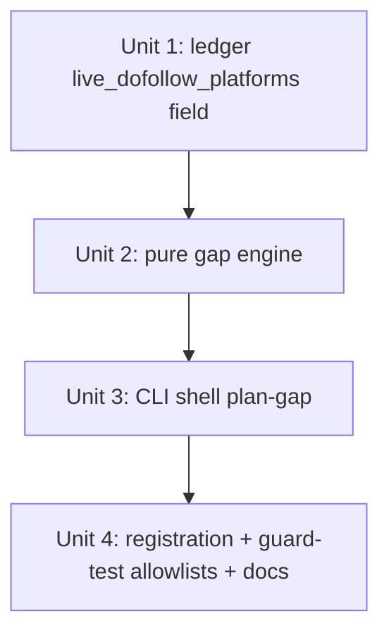

# feat: plan-gap — deficit-driven re-plan verb

## Overview

Add a standalone, read-only CLI verb `plan-gap` that closes the `plan → publish → blind` loop. It reads
`equity-ledger` JSONL on stdin and emits `plan-backlinks`-compatible seed JSONL on stdout, prioritizing
the targets with the largest live-dofollow deficit and fanning each out across the distinct active
dofollow platforms it does not already hold a **live-dofollow** link on. It is a pure transform (no store
writes, no network; read-only registry lookups only) and composes as
`equity-ledger | plan-gap | plan-backlinks`. A small prerequisite extends the ledger to expose the
per-target live-dofollow platform set the fan-out needs.

## Problem Frame

The operator runs `plan → validate → publish`, then goes blind: the next batch is hand-authored again
with no feedback from what landed. `equity-ledger` already knows the per-target deficit and sorts targets
weakest-first, but nothing turns that into the next plan (integration-verified: no ledger→seed bridge
exists). This is the biggest missing verb in the operator's loop. It is **distinct from the rejected
yield-weighted plan _selection_** — this is deficit-driven plan _generation_ from already-observed
liveness, no yield model. (see origin: docs/brainstorms/2026-05-29-deficit-driven-replan-requirements.md)

## Requirements Trace

- R1. Standalone read-only verb: equity-ledger JSONL stdin → plan-backlinks seed JSONL stdout; no store
  writes, no network; read-only registry access; `plan-backlinks` stays pure (no `--from-ledger`).
- R2. Emitted seeds are complete 6-field `INPUT_SCHEMA_FIELDS` rows (target_url + plan-gap-chosen platform
  + main_domain/language/url_mode/publish_mode); every field satisfies the downstream enum checks
  (`language ∈ SUPPORTED_LANGUAGES`, `url_mode ∈ {A,B,C}`, `publish_mode ∈ {draft,publish}`,
  `platform ∈ supported_platforms()`). No new seed schema; no extra keys.
- R3. `deficit = max(0, D[target] − live_dofollow)`; `--desired D` is **required** (no silent default) +
  optional per-target override map; zero-deficit targets omitted.
- R4. Channel-aware fan-out: `candidates = active-dofollow platforms − target's live-dofollow platforms`
  (R8's `live_dofollow_platforms`, NOT the broader `platforms`); emit `min(deficit, |candidates|)` seeds,
  one per distinct candidate platform → N distinct dedup keys. Empty candidate set ⇒ target omitted and
  named in the `channel_exhausted` list.
- R5. Stamp the liveness as-of basis (`liveness` + `liveness_verified_at`) on the **stderr run summary**
  (not per-seed) so the operator sees how fresh the deficit is.
- R6. Suppress targets whose row `liveness` is `stale`/`unverified` **and** `live_dofollow == 0` (deficit
  unverifiable); skip `failed` targets; a target with `live_dofollow > 0` stays eligible on its accurate
  deficit even if one link is stale. Plus a **freshness floor**: refuse to emit any target whose
  `liveness_verified_at` is older than `--stale-after N` days (default refuse). `--emit-stale` /
  `--include-failed` override. Every suppression is a loud, per-reason counted stderr signal — never a
  silent drop.
- R7. Shadow paths: zero-deficit / all-suppressed / empty-ledger input emit a stderr advisory and exit 0
  (not a failure); malformed JSON still exits 2; `None`/missing `live_dofollow` is coerced, never a crash.
- R8. Extend `LedgerRow` with `live_dofollow_platforms: list[str]` (platforms where the target has a
  `live` + `dofollow` link), populated and serialized, so R4 subtracts the correct set.
- R9. Fail-safe on an unrecognized `liveness` value: classify as SUPPRESSED with reason
  `unknown_liveness`, count it loudly, exit 0 — never `raise`/crash the pipe (a read-only advisory verb
  must not fail-hard on vocabulary drift).

## Scope Boundaries

- NOT yield-weighted plan selection (Round-11 D5, rejected — needs unobserved yield data).
- NOT a recheck/monitor; it consumes whatever liveness the ledger reports. **True convergence depends on
  the recheck loop (`docs/plans/2026-05-29-004-...`, currently `status: active`/unshipped).** Until that
  lands, plan-gap is a one-shot "fill the gap once" tool; the freshness floor (R6) prevents thrashing on a
  frozen ledger, and the operator can refresh liveness via the WebUI recheck service.
- NOT writing any store; NOT touching plan/validate engine internals; NOT adding `--from-ledger` to
  `plan-backlinks`.
- NOT choosing anchors/creative metadata (that stays `plan-backlinks`' job). plan-gap DOES choose
  `platform` (required for the deficit to close — `plan-backlinks` does not rotate platforms and the
  dedup key collapses same-platform/same-target seeds).

## Context & Research

### Relevant Code and Patterns

- **Closest analog (read-only JSONL verb):** `cli/equity_ledger.py:1-66` — stdout=JSONL / stderr=banner /
  exit-0 contract; primes the registry via the adapter side-effect import (`:15`); `main(argv=None)` with
  argparse inside; `config_echo.emit_banner` → stderr (`:57`); `write_jsonl` → stdout (`:60`);
  `if __name__ == "__main__"` guard (`:64`).
- **Stdin-read + canonicalize analog:** `cli/preflight_targets.py:23-26`.
- **JSONL helpers:** `_util/jsonl.py` — `read_jsonl(source=None, strict=True)` (`:17-73`; strict empty →
  exit 2; `strict=False` WARN-skips malformed at `:55-59` — NOT acceptable, would silently drop);
  `write_jsonl` (`:76-86`). `read_jsonl` accepts a `source` list, enabling buffer-then-parse.
- **Typed exits:** `_util/errors.py:208-228` `emit_error`; taxonomy `:8-170` (UsageError=1,
  InputValidationError=2, …). AST guard `tests/test_cli_typed_error_emission.py` (hardcoded
  `_IN_SCOPE_CLI_FILES`, `:35-44`) forbids bare `raise SystemExit(<nonzero>)`.
- **Seed shape:** `schema.py:10-17` `INPUT_SCHEMA_FIELDS`; downstream enum checks in `_schema_input.py:44-70`
  (validate does NOT reject unknown extra keys — `:25-125`). `bulk_input.py:101-129` `urls_to_seed_rows`
  is the canonical 6-key dict with silent defaults (platform="blogger", language="zh-CN", url_mode="A",
  publish_mode="draft") — plan-gap must NOT inherit these silently (see R2/R3 decisions).
- **Ledger output (stdin contract):** `ledger/model.py` `LedgerRow` — `target_url` (`:68`),
  `live_dofollow` (`:73`), `platforms` (any-link union, `:75`), `liveness` enum (`:80`,
  `LivenessStatus = Literal["failed","stale","live","unverified"]` `:15`, worst-status-wins via
  `worst_liveness` `:30-48`), `liveness_verified_at: str|None` (`:83`); `to_jsonl_dict` = `asdict` (`:90`)
  so values serialize verbatim. `ledger/aggregate.py:111-112` adds to `platforms` unconditionally;
  `:116-120` is the `status=="live"` + `cls=="dofollow"` branch (where R8 collects
  `live_dofollow_platforms`). `:150` pre-sorts ascending by `live_dofollow`.
- **Registry (fan-out set):** `publishing/_registry_manifest.py:77-93` `active_platforms()` (registry-based,
  visibility=="active", `sorted()` — NOT the credential-based `config_echo.active_platforms`);
  `publishing/registry.py:417-424` `dofollow_status(name)` → `Literal[True,False,"uncertain"]|None`.
  Active-dofollow set = `[p for p in active_platforms() if dofollow_status(p) is True]` (today exactly
  `{blogger, ghpages, medium, telegraph, velog}` = 5 — so `channel_exhausted` is the common case for D≥5).
- **Dedup key:** `idempotency/store.py:90-110` `DedupKey(platform, target_url, account="default")`;
  `__post_init__` canonicalizes `target_url` (`:107`). `account` is not a seed field (downstream applies
  `"default"`); distinctness comes from the per-platform fan-out.
- **Guard tests with hardcoded allowlists:** `tests/test_cli_python_m_entrypoints.py` (`_CLI_ONLY_MODULES`
  `:44-51`); `tests/test_cli_typed_error_emission.py` (`_IN_SCOPE_CLI_FILES` `:35-44`). New verb must be
  registered in both. WebUI dispatch map (if ever wired): `webui_app/helpers/cli_runner.py:90` `_CLI_MODULES`.

### Institutional Learnings

- **`docs/architecture/deterministic-planning-principle.md`** — pure engines MUST NOT touch
  stdout/stderr/SystemExit/stdin/network. Drives the engine/shell split.
- **`docs/solutions/logic-errors/projector-silent-drop-status-vocabulary-drift-2026-05-26.md`** — the
  silent-drop bug class. Drives: per-reason stderr counts, one classifier with EMIT / SUPPRESSED-reason /
  `unknown_liveness`-fail-safe outcomes (R9), opt-out flags. (Confirms R9: drift must not crash *or*
  silently drop.)
- **`docs/solutions/logic-errors/argparse-choices-vs-usage-error-exit-clash-2026-05-20.md`** — no argparse
  `choices=`; validate post-parse and raise `UsageError` (exit 1).
- **`docs/solutions/workflow-issues/grep-dofollow-map-before-shipping-adapter-2026-05-20.md`** — dofollow
  source of truth is `registry.dofollow_status()`; never hardcode a channel→dofollow map.
- **`docs/solutions/best-practices/no-runtime-llm-2026-05-15.md`** + `plan-time-url-validation-...md` —
  pure deterministic transform; pass the ledger's already-canonical `target_url` through verbatim; never
  fabricate a URL.

### External References

- None — strong local patterns (8+ existing CLI verbs, established JSONL-pipe conventions).

## Key Technical Decisions

- **Pure engine (`gap/engine.py`) + thin shell (`cli/plan_gap.py`)** — per the
  deterministic-planning-principle. Engine = pure `ledger-rows → (seed-rows, suppression_counts,
  liveness_meta)` transform (registry lookups allowed; no I/O); shell owns stdin/stdout/SystemExit/banner.
- **Subtract `live_dofollow_platforms`, not `platforms` (P0 fix, decision)** — `LedgerRow.platforms` is
  *any-link* (`aggregate.py:112`), so subtracting it would permanently retire a platform on which the
  target's link went nofollow/dead, making the deficit unclosable. R8 adds a `live_dofollow_platforms`
  field (collected at `aggregate.py:116-120`) so the candidate subtraction matches the live-dofollow
  currency the deficit is measured in. (see origin; document-review P0)
- **Channel-aware fan-out resolves the seed-collapse P0** — candidates exclude the target's live-dofollow
  platforms, so each emitted `(platform, "default", target_url)` is a distinct dedup key; saturated
  targets self-omit into a named `channel_exhausted` list.
- **Dofollow from the registry only** — `active_platforms() ∧ dofollow_status(p) is True`;
  `"uncertain"`/`None`/`False` excluded.
- **Fail-safe, not fail-hard, on unknown liveness (R9)** — a read-only advisory verb must not crash the
  pipe on vocabulary drift; unknown ⇒ suppress + loud `unknown_liveness` count + exit 0. `raise`/nonzero
  is reserved for malformed JSON (exit 2) and bad flags (exit 1).
- **`--desired` and `--language` are required** — no silent default that auto-links every weak page or
  silently emits zh-CN seeds for a ko/en campaign (multi-language is first-class here). Applied seed
  defaults (`url_mode`, `publish_mode`) are echoed on the stderr banner.
- **R5 stamp on the stderr summary, not per-seed** — keeps emitted seeds schema-clean / forward-compatible.
  (Note: validate does NOT reject extra keys; this is a hygiene choice, not a hard constraint.)
- **Empty/zero input is success** — shell buffers stdin; all-blank ⇒ advisory + exit 0 *without* calling
  `read_jsonl`; otherwise `read_jsonl(buffered, strict=True)` so malformed JSON still exits 2. (Never
  `strict=False` — it would silently drop malformed rows.)
- **Freshness floor** — given the recheck loop is unshipped, refuse targets older than `--stale-after N`
  days so a frozen ledger can't drive infinite re-proposal.

## Open Questions

### Resolved During Planning

- *Canonical-`target_url` match:* pass the ledger's already-canonical `target_url` through verbatim;
  `DedupKey.__post_init__` re-canonicalizes idempotently — no mismatch.
- *Account dedup dimension:* `account` defaults to `"default"` and is not a seed field; the fan-out's
  per-platform distinctness guarantees each emitted key is new.
- *Config home:* CLI flags — required `--desired D` + `--language`; `--desired-map`, `--stale-after N`,
  `--emit-stale`, `--include-failed`, `--url-mode`, `--publish-mode`.
- *Liveness vocabulary:* `to_jsonl_dict` emits the bare `LivenessStatus` literals `failed/stale/live/
  unverified` (`model.py:15,90`); `liveness_verified_at` is a separate ISO `str|None`. The classifier
  matches exactly these four; anything else ⇒ R9 `unknown_liveness`.
- *Seed-schema acceptance:* validate checks required+optional types + enums (`_schema_input.py:25-70`) and
  does NOT reject unknown keys; the 6-field dict is accepted, and plan-gap validates its campaign defaults
  against the same enums post-parse (UsageError on bad value).

### Deferred to Implementation

- Confirm `active_platforms() ⊆ supported_platforms()` so every fanned-out `platform` passes downstream
  re-validation (expected true; both registry-derived). If a gap exists, intersect with
  `supported_platforms()`.
- Measure the new files' SLOC after implementation; add `monolith_budget.toml` entries only if a file
  approaches the 500-SLOC warning canary (`test_no_monolith_regrowth.py:27`); if added, keep
  `ceiling − SLOC ≤ 50` headroom and a ≥80-char rationale.

## High-Level Technical Design

> *This illustrates the intended approach and is directional guidance for review, not implementation
> specification. The implementing agent should treat it as context, not code to reproduce.*

```
cli/plan_gap.py (shell — all I/O)             gap/engine.py (pure transform)
──────────────────────────────────           ──────────────────────────────────────────
parse argv; require --desired, --language
  (post-parse → UsageError exit 1; no choices=)
prime registry (adapter import)
load_config; emit_banner + echo applied
  seed defaults → stderr
lines = buffer(stdin)
  all-blank → advisory + exit 0
  else rows = read_jsonl(lines, strict=True)  ─►  plan_gap(rows, opts) -> (seeds, counts, liveness_meta):
    (malformed → exit 2)                            active_df = [p for p in active_platforms()
                                                                 if dofollow_status(p) is True]
                                                    for row (already weakest-first):
                                                      ld = row.live_dofollow or 0
                                                      classify(row.liveness, ld, opts):
                                                        live                          → eligible
                                                        stale/unverified & ld==0      → SUPPRESS (unless emit_stale)
                                                        failed                        → SKIP (unless include_failed)
                                                        verified_at older than floor  → SUPPRESS (unless emit_stale)
                                                        <unrecognized>                → SUPPRESS reason=unknown_liveness
                                                      D = desired_map.get(t, global_D)
                                                      deficit = max(0, D − ld)
                                                      cands = active_df − row.live_dofollow_platforms
                                                      emit min(deficit, |cands|) seeds, one per cand platform
                                                      (deficit>0 & no cands → channel_exhausted list += t)
write_jsonl(seeds) → stdout                   ◄─  return seeds, per-reason counts (+ named
RECON: per-reason counts + named                   channel_exhausted list), liveness as-of meta
  channel_exhausted list + as-of stamp → stderr
len(seeds)==0 → advisory; exit 0
```

## Implementation Units



- [ ] **Unit 1: Ledger `live_dofollow_platforms` field**

**Goal:** Extend `LedgerRow` with `live_dofollow_platforms: list[str]` (platforms where the target has a
`live` + `dofollow` link), populated in the aggregator and serialized via `to_jsonl_dict`.

**Requirements:** R8.

**Dependencies:** None.

**Files:**
- Modify: `src/backlink_publisher/ledger/model.py` (add field), `src/backlink_publisher/ledger/aggregate.py`
  (collect at the `status=="live"` + `cls=="dofollow"` branch, `:116-120`)
- Test: `tests/test_ledger_aggregate.py` (extend)

**Approach:** Collect the platform into a per-target set inside the existing live+dofollow branch (do not
reuse the unconditional `platforms.add`). Sort for determinism. Serialize via the existing `asdict`.

**Patterns to follow:** the existing `live_dofollow` counting branch in `aggregate.py:116-120`; the
`platforms` field shape in `model.py:75`.

**Test scenarios:**
- Happy path: target with live-dofollow links on `blogger` + `medium`, a nofollow link on `velog`, and a
  dead/failed link on `ghpages` → `live_dofollow_platforms == ["blogger","medium"]` (velog/ghpages
  excluded), while `platforms` still contains all four.
- Edge: target with zero live-dofollow links → `live_dofollow_platforms == []`.
- Edge: serialization — `to_jsonl_dict()` includes `live_dofollow_platforms` as a JSON list.

**Verification:** Aggregating a fixture with mixed link states yields the exact live-dofollow platform set
per target, distinct from `platforms`; the field round-trips through `to_jsonl_dict`.

- [ ] **Unit 2: Pure gap engine**

**Goal:** Pure `plan_gap(rows, opts) -> (seed_rows, suppression_counts, liveness_meta)`: classify liveness
(with the R9 fail-safe + R6 freshness floor), compute per-target deficit, channel-aware fan-out over
active dofollow platforms minus `live_dofollow_platforms`, return 6-field seed dicts + a per-reason counts
dict + the named `channel_exhausted` list + the as-of metadata for the shell to stamp. No
stdin/stdout/SystemExit/network.

**Requirements:** R2 (seed dict), R3 (deficit), R4 (fan-out), R5 (return as-of meta), R6 (classifier +
floor), R7 (None coercion), R9 (unknown fail-safe).

**Dependencies:** Unit 1.

**Files:**
- Create: `src/backlink_publisher/gap/__init__.py`, `src/backlink_publisher/gap/engine.py`
- Test: `tests/test_gap_engine.py`

**Approach:**
- Compute the active-dofollow set once: `[p for p in active_platforms() if dofollow_status(p) is True]`.
  Copy the pure-engine prohibition list into the module docstring.
- One classifier, explicit outcomes: EMIT (live, or `live_dofollow>0`) / SUPPRESSED-with-reason
  (`stale`/`unverified` when `live_dofollow==0`; beyond freshness floor; `failed`) / `unknown_liveness`
  (any unrecognized status — suppress + count, never raise).
- `D[target] = desired_map.get(target, global_D)`; `deficit = max(0, D − (live_dofollow or 0))`.
- `candidates = active_df − set(row["live_dofollow_platforms"])`; emit `min(deficit, len(candidates))`
  seeds in a deterministic platform order (active_platforms() is `sorted()`); preserve input weakest-first
  row order. `deficit>0 & no candidates` ⇒ append target to the `channel_exhausted` list.
- Seed dict = exactly the 6 `INPUT_SCHEMA_FIELDS`, no extra keys: `target_url` passthrough,
  `platform`=candidate, `main_domain`/`language`/`url_mode`/`publish_mode` from `opts`.
- `suppression_counts` is a fixed-key dict: `{suppressed_stale, suppressed_unverified, suppressed_stale_floor,
  failed, unknown_liveness, channel_exhausted, satisfied}` (counts) + a `channel_exhausted_targets` list.

**Patterns to follow:** `ledger/aggregate.py` (pure builder), `validate/engine.py` docstring (prohibition
list), `bulk_input.py:101-129` (the 6-key seed dict to match).

**Test scenarios:**
- Happy path: target `liveness=live`, `live_dofollow=2`, `D=5`, injected active-df set of 5 platforms,
  `live_dofollow_platforms=["blogger"]` → 3 seeds on 3 distinct non-blogger platforms; asserts the exact
  `suppression_counts` dict.
- Edge — cap at candidates: `deficit=5`, 2 candidates → 2 seeds + target in `channel_exhausted_targets`,
  `channel_exhausted=1`.
- Edge — nofollow/dead does NOT retire a platform: target nofollow-live on `velog` (velog ∈ `platforms`
  but ∉ `live_dofollow_platforms`) → velog IS a candidate (the P0 regression guard).
- Edge — zero deficit: `live_dofollow ≥ D` → omitted, `satisfied` counted.
- Edge — per-target override raises one target's D.
- Edge — `None`/missing `live_dofollow` coerced to 0.
- Suppression: `stale`/`unverified` with `live_dofollow==0` suppressed by default, emitted under
  `emit_stale`; `live_dofollow>0` + row `liveness=stale` stays eligible (not over-suppressed);
  `failed` skipped by default, included under `include_failed`.
- Freshness floor: `liveness_verified_at` older than `stale_after` → suppressed (`suppressed_stale_floor`),
  emitted under `emit_stale`.
- Error/fail-safe — unknown `liveness` value → suppressed with `unknown_liveness` count, NO raise.
- Dofollow filter: `False`/`"uncertain"`/`None` platforms never candidates.
- Determinism: identical input → identical ordered output (no `Random`/`Date`).

**Verification:** Given fixture ledger rows + an injected active-dofollow set, the engine returns the
expected distinct-platform seeds and an exact per-reason tally; pure (no I/O); the nofollow-platform
regression guard passes.

- [ ] **Unit 3: CLI shell `plan-gap`**

**Goal:** Thin I/O wrapper: parse argv (require `--desired`,`--language`; post-parse UsageError, no
`choices=`), prime registry, load config, emit banner + applied-defaults echo to stderr, buffer stdin
(all-blank ⇒ advisory + exit 0; else `read_jsonl(buffered, strict=True)`), call the engine, `write_jsonl`
seeds to stdout, emit per-reason RECON + named `channel_exhausted` list + liveness as-of stamp to stderr,
exit 0. Fatal exits via `emit_error`. `if __name__ == "__main__"` guard.

**Requirements:** R1, R2 (enum-validate defaults), R3 (`--desired` required), R5 (stamp), R6 (flags +
RECON + floor), R7 (empty/malformed), R9 (unknown count in RECON).

**Dependencies:** Unit 2.

**Files:**
- Create: `src/backlink_publisher/cli/plan_gap.py`
- Test: `tests/test_cli_plan_gap.py`

**Approach:**
- `main(argv=None)`; argparse inside; flags: required `--desired` (non-negative int) + `--language`
  (∈ SUPPORTED_LANGUAGES); optional `--desired-map`, `--stale-after`(int days, default refuse-when-older),
  `--emit-stale`, `--include-failed`, `--url-mode`(∈{A,B,C}), `--publish-mode`(∈{draft,publish}). Validate
  all closed-set/range values post-parse → `UsageError` (exit 1).
- Prime registry via `import backlink_publisher.publishing.adapters`. `config_echo.emit_banner` + a one-line
  echo of the applied seed defaults (language/url_mode/publish_mode) to stderr.
- Buffer stdin to a list; if every line is blank → advisory ("0 targets: empty ledger") + exit 0 without
  calling `read_jsonl`; else `read_jsonl(buffered, strict=True)` (malformed → exit 2).
- After the engine: `write_jsonl(seeds, sys.stdout)`; RECON one-liner to stderr with the per-reason counts,
  the named `channel_exhausted` targets, and the liveness as-of stamp. If `len(seeds)==0`, emit the
  "0 targets to re-plan: <breakdown>" advisory (exit 0) and note that downstream `plan-backlinks` exits 2
  on the empty stream (normal end of a satisfied pipe).

**Patterns to follow:** `cli/equity_ledger.py:1-66`, `cli/preflight_targets.py:23-26`,
`_util/errors.py:emit_error`.

**Test scenarios:**
- Happy path: sample equity-ledger JSONL (with `live_dofollow_platforms`) on stdin → expected seed JSONL
  on stdout, exit 0.
- Pure stdout: every stdout line `json.loads` cleanly; banner + RECON only on stderr.
- Error — missing `--desired` or `--language` → exit 1 UsageError with diagnostic.
- Error — `--desired -1` / non-int, or `--language xx` not in SUPPORTED_LANGUAGES → exit 1.
- Error — malformed JSON line on stdin → exit 2.
- Shadow — empty stdin / all-suppressed / all-satisfied → 0 stdout lines, stderr advisory, exit 0.
- Integration — `--emit-stale` flips a stale (live_dofollow==0) target from suppressed to emitted.
- RECON: per-reason counts + named `channel_exhausted` list + as-of stamp present and accurate on stderr;
  unknown-liveness row contributes to `unknown_liveness` count (no crash).

**Verification:** `printf '<ledger rows>' | plan-gap --desired N --language zh-CN` yields schema-valid seed
JSONL on stdout, accurate RECON on stderr, exit 0; missing required flags exit 1; malformed stdin exits 2;
a satisfied/empty input exits 0 with an advisory.

- [ ] **Unit 4: Registration, guard-test allowlists, manifests, and docs**

**Goal:** Wire the console script, register the verb in both hardcoded guard-test allowlists, and document
it.

**Requirements:** R1 (discoverability + guard coverage).

**Dependencies:** Units 1-3.

**Files:**
- Modify: `pyproject.toml` (`plan-gap = "backlink_publisher.cli.plan_gap:main"`)
- Modify: `tests/test_cli_python_m_entrypoints.py` (add `plan-gap` to `_CLI_ONLY_MODULES`, `:44-51`)
- Modify: `tests/test_cli_typed_error_emission.py` (add `cli/plan_gap.py` to `_IN_SCOPE_CLI_FILES`, `:35-44`)
- Modify: `AGENTS.md` (CLI entrypoints table row + `equity-ledger | plan-gap | plan-backlinks` note)
- Modify (conditional): `monolith_budget.toml` only if a new file approaches 500 SLOC (measure first)

**Approach:** Follow the `equity-ledger` registration line (`pyproject.toml:41`); re-install (`pip install
-e .`) for the console script. Adding to the two guard-test allowlists is what actually enforces the
`__main__` guard and the no-bare-`SystemExit` discipline for the new shell.

**Test scenarios:** The two guard tests now parametrize over `plan-gap` (the new entries) — this IS the
test coverage for this unit. No additional behavioral test (registration/docs only).

**Verification:** `plan-gap --help` resolves after re-install; `test_cli_python_m_entrypoints` and
`test_cli_typed_error_emission` pass with the new verb; AGENTS.md table lists it.

## System-Wide Impact

- **Interaction graph:** plan-gap is a new leaf producer feeding `plan-backlinks` via stdin; it reads the
  registry and consumes `equity-ledger` output. Unit 1 touches the shared `LedgerRow`/aggregator (read by
  `equity-ledger` CLI + WebUI + any ledger consumer) — additive field only, no behavior change to existing
  fields.
- **Error propagation:** fatal paths via `emit_error` typed envelopes (UsageError=1 bad/missing flags,
  InputValidationError=2 malformed stdin); unknown liveness is fail-safe (suppress+count+exit 0, R9).
- **State lifecycle risks:** none — no store writes, no network. Distinctness of emitted seeds is
  guaranteed by subtracting `live_dofollow_platforms`; downstream dedup is the idempotency backstop.
- **API surface parity:** emits the existing 6-field `INPUT_SCHEMA_FIELDS` shape; Unit 1 adds an additive
  ledger field consumed by `to_jsonl_dict` (existing consumers ignore unknown extra keys).
- **Integration coverage:** an `equity-ledger | plan-gap --desired N --language zh-CN | plan-backlinks
  --dry-run` smoke proves the emitted seeds validate downstream (recommended CI/manual smoke).
- **Unchanged invariants:** `plan-backlinks` stays a pure stdin-reading engine (no `--from-ledger`); the
  dedup key, registry, and existing `LedgerRow` fields are unmodified.

## Risks & Dependencies

| Risk | Mitigation |
|------|------------|
| Convergence depends on the unshipped recheck loop (plan-004, `status: active`) | Ship standalone as a one-shot tool; freshness floor (R6) blocks thrashing on a frozen ledger; document the dependency; operator can manually recheck via the WebUI. |
| Only 5 active dofollow channels → targets with D≥5 cannot fully close | `channel_exhausted` surfaced as a named target list (operator signal: register more dofollow platforms or accept the cap). |
| Fan-out subtracts the wrong set → unclosable deficit | Unit 1 adds `live_dofollow_platforms`; engine subtracts it (nofollow/dead platforms remain candidates). Regression test covers it. |
| Vocabulary drift in `liveness` | R9 fail-safe: `unknown_liveness` suppress+count+exit 0, never crash. |
| Silent zh-CN / draft seeds for a ko/en or publish campaign | `--language` required; applied `url_mode`/`publish_mode` echoed on stderr; values enum-validated. |
| Empty/satisfied input read as failure | Buffer-then-detect-empty ⇒ advisory + exit 0; only malformed JSON exits 2. |
| New file breaches SLOC ceiling | Engine/shell split keeps files small; add `monolith_budget` entries only if measured near 500 SLOC. |

## Sources & References

- **Origin document:** [docs/brainstorms/2026-05-29-deficit-driven-replan-requirements.md](docs/brainstorms/2026-05-29-deficit-driven-replan-requirements.md)
- Related code: `cli/equity_ledger.py`, `cli/preflight_targets.py`, `ledger/model.py`,
  `ledger/aggregate.py`, `publishing/_registry_manifest.py`, `publishing/registry.py`,
  `idempotency/store.py`, `bulk_input.py`, `schema.py`, `_schema_input.py`, `_util/jsonl.py`,
  `_util/errors.py`, `tests/test_cli_python_m_entrypoints.py`, `tests/test_cli_typed_error_emission.py`
- Architecture: `docs/architecture/deterministic-planning-principle.md`
- Related plan (liveness refresh dependency): `docs/plans/2026-05-29-004-feat-recheck-backlinks-survival-loop-plan.md`
