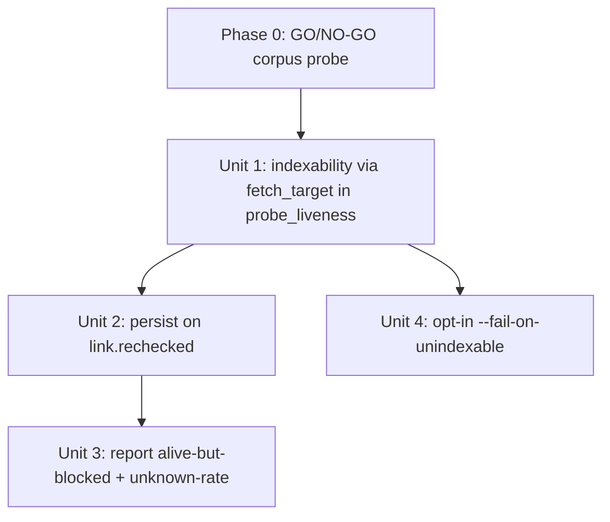

# feat: Source-Page Indexability Detection in Recheck (Detection-First Slice)

## Overview

Add an **orthogonal `indexability` axis** to the per-link backlink recheck path so the survival
loop also reports whether the third-party HOST page carrying our backlink is blocked from Google
indexing (`noindex` meta / `X-Robots-Tag` header). An `alive` dofollow link on a `noindex` page
passes **zero** equity — today the tool reports it as healthy. This is the project's signature
*silent false-success*, one tier up the value chain.

This plan covers the **detection-first slice** the brainstorm marked plan-ready: detect → persist
(additive) → surface in the recheck report → opt-in `--fail-on-unindexable` gate. Three things are
explicitly **gated follow-ons** (see Scope Boundaries): the robots.txt barrier (R3d), the WebUI
indexability *surfacing* (the WebUI already *computes* it), and the equity-ledger bridge (R7/R8).

**The single most important post-review change:** indexability is read from the existing
`content/_preflight_fetch.fetch_target` → `PreflightFacts.noindex` fact (the *same* fact
`cli/canary_targets.py` already consumes), not by plumbing headers through the anchor-capture
fetch. This makes R3a+R3b one already-computed field, makes recheck and canary a true single
source (no parallel detector to keep in sync), and avoids touching `_fetch_body_via_preflight`.

## Problem Frame

`recheck-backlinks` (`recheck/probe.py` `probe_liveness`) produces a 5-verdict liveness taxonomy
(`alive` / `host_gone` / `link_stripped` / `dofollow_lost` / `probe_error`) and writes
`link.rechecked` events. It stops at "the link is present and still dofollow." It never asks
"will Google index the page hosting this link?" — so a published, surviving, dofollow link on a
`noindex` page is reported all-green while passing zero equity.

Validated 2026-06-01 (`scripts/probe_indexability.py`): the operator's one real published page,
`redredchen02.livejournal.com/574.html`, is exactly this — HTTP 200 but `noindex,nofollow,noarchive`.
The barrier class is real (and `_meta_noindex` alone catches it). (See origin: `docs/brainstorms/2026-06-01-seo-outcome-indexability-loop-requirements.md`.)

## Requirements Trace

In scope (detection-first):
- R1. `probe_liveness` computes an `indexability` state for any page it successfully reads,
  recorded as orthogonal metadata on the probe output (mirroring `anchor_drift`); liveness verdict unchanged.
- R2. `indexability` ∈ `ok` / `blocked` / `unknown`; `blocked` requires a deterministic barrier;
  anything indeterminate is `unknown` (fail-open — never false-positive a barrier).
- R3a. `<meta name=robots|googlebot ...noindex|none>` — already computed in `PreflightFacts.noindex`.
- R3b. `X-Robots-Tag: noindex|none` header — already folded into `PreflightFacts.noindex` (and exposed as `.x_robots_tag`).
- R3e. UA-cloaking honesty caveat in surfaced copy ("contract-drift from what our UA sees, not a Googlebot guarantee").
- R4. CLI recheck and WebUI manual recheck **compute** indexability from one shared primitive (`probe_liveness`); surfacing parity is staged (see Key Decisions / Scope).
- R5. Persist `indexability` (+ closed-vocab `indexability_reason`) on the `link.rechecked` event payload, additively.
- R6. Recheck report surfaces `alive`-but-`blocked` distinctly from healthy `alive`.
- R6b. Recheck report shows per-channel `unknown`-rate so an all-`unknown` channel is visibly inert, not falsely green.
- R9. Opt-in `--fail-on-unindexable` gate (default off); confirmed `blocked` → non-zero exit; `unknown` never trips.

## Scope Boundaries

- **GO/NO-GO gate (Phase 0, before any unit).** Run `BACKLINK_PUBLISHER_CONFIG_DIR=<prod>
  python scripts/probe_indexability.py --from-events` against the operator's **real dofollow
  corpus** first. If the `blocked` rate is near-zero or the `unknown` rate is near-total on the
  dofollow channels, **descope**: ship only R6b (the per-channel `unknown` / "unverifiable"
  diagnostic) rather than the full slice. The slice is only worth building if real dofollow
  pages carry a detectable `noindex`. (Per multiple review findings + the brainstorm's own gate.)
- **R3d robots.txt — OUT (gated follow-on).** Weakest signal (crawl directive ≠ index directive),
  heaviest code (new module + fetch + parser + per-batch cache), and the only new SSRF surface.
  The one validated page is already caught by `_meta_noindex`. Build it only if the Phase-0 probe
  finds robots-blocked-but-not-meta-blocked dofollow pages, with the security invariants in the
  follow-on note below.
- **WebUI indexability *surfacing* — staged.** The WebUI already *computes* indexability (it shares
  `probe_liveness`), but its `VerificationResult(ok, reason)` adapter drops the field and the WebUI
  emits no `link.rechecked` event. Surfacing it requires widening `VerificationResult`/the history
  mutation (a 5-test-pinned contract) — a deliberate follow-on. R4 is scoped to *shared computation*
  here; CLI/events surface first.
- **R7/R8 equity-ledger bridge — OUT (gated follow-on).** The ledger reads history-store
  `verified_at`/`verify_error`, not `link.rechecked`; excluding `blocked` from `live_dofollow`
  needs a net-new ledger read-side bridge. Sequenced after the Phase-0 probe confirms a non-trivial barrier rate.
- **R3c canonical-away — DROPPED** (false-positive factory; the project's own Medium adapter sets cross-domain `canonicalUrl`).
- **Destination-decay — SPLIT OUT** to `docs/brainstorms/2026-06-01-destination-decay-monitor-requirements.md`.
- **No Google querying / no GSC** — detect barriers, never claim a page *is* indexed. No new liveness verdict value.

## Context & Research

### Relevant Code and Patterns

- `src/backlink_publisher/content/_preflight_fetch.py` — **`fetch_target(url, *, timeout) -> PreflightFacts`** is the detection seam. `PreflightFacts.noindex` is already `_meta_noindex(body) or (x_robots and _has_noindex_directive(x_robots))` (line ~240) — i.e. **R3a+R3b in one field**. Also exposes `.x_robots_tag` (capped at `_X_ROBOTS_MAX_LEN = 256`, untrusted/display-only), `.final_url`, `.status`. Body is the `_read_body_prefix` prefix that streams to `</h1>` (so `<head>` — which precedes `<body>` — is normally fully captured; the pathological case is a stray `<h1>` before `</head>` or late-injected meta — see the truncation guard in Key Decisions).
- `src/backlink_publisher/cli/canary_targets.py` — **already consumes `facts.noindex`** (`_classify` gates `link-alive` on `not noindex`; `_failed_checks` appends `"noindex"`). Routing recheck through the same `fetch_target` fact makes the two surfaces a **true single source** — the verifier-divergence guard (`[[project_verifier_divergence]]`) is satisfied by construction, not by a parity test over two detectors.
- `src/backlink_publisher/recheck/probe.py` — `probe_liveness(...)`; its out-dict already carries orthogonal metadata `anchor_drift` that **never changes `verdict`** (R3 precedent). Add `indexability` next to it the same way.
- `src/backlink_publisher/publishing/adapters/link_attr_verifier.py` — `inspect_target_anchor` (anchor `rel`) and `_fetch_body_via_preflight` (single internal caller). **Unchanged by this plan** — the route-through-`fetch_target` decision means no header plumbing here.
- `src/backlink_publisher/recheck/events_io.py` — `emit_recheck` is the **single** `link.rechecked` emit seam (no resume/WebUI emit path). `src/backlink_publisher/events/kinds.py` — `REQUIRED_FIELDS[LINK_RECHECKED] = frozenset({"verdict"})` (minimal floor; additive keys allowed; do NOT add to the floor).
- `src/backlink_publisher/cli/recheck_backlinks.py` (≈226 SLOC; not in `monolith_budget.toml`; soft warning only >500 SLOC — budget is not a real constraint here) — per-verdict summary rendering + the `--fail-on-dead` flag, which calls `emit_envelope_and_exit(class_name: str, exit_code: int, msg)` (a plain string + int; **no exception class to register**).
- `webui_app/services/recheck.py` — `_default_verify` **already calls `probe_liveness`** then collapses the out-dict to `VerificationResult(ok, reason)` (drops indexability); `recheck_one` persists only `status`/`verify_error`/`verified_at`. This is why WebUI *surfacing* is a staged follow-on.
- `scripts/probe_indexability.py` — prototype detector; **parsing-semantics reference only** for any future R3d (its transport fetches robots.txt with no SSRF guard — do NOT copy the transport).

### Institutional Learnings

- `docs/solutions/integration-issues/dofollow-canary-verdict-dropped-at-publish-output-seam-2026-05-25.md` — a computed verdict vanished at a serialization seam. Here the analogous risk is the **WebUI `VerificationResult` boundary** (it drops the field today) — hence the explicit staged-surfacing decision rather than a silent gap.
- `docs/solutions/logic-errors/projector-silent-drop-status-vocabulary-drift-2026-05-26.md` — the `link.rechecked` floor is `{"verdict"}`; adding `indexability` is purely additive, no KINDS/REQUIRED_FIELDS change. WAL rule: collect pending, flush after commit (the recheck loop already does).
- `docs/solutions/correctness/adapter-silent-exceptions-resolution.md` — a detection failure must not silently become `indexability=ok`; parse/read failure ⇒ `unknown`, inside the never-raise envelope.
- `docs/runbooks/2026-05-27-canary-targets-operations.md` §7 — "not an indexability oracle; necessary-not-sufficient; possible UA cloaking." Reuse verbatim for R3e.
- `docs/solutions/logic-errors/argparse-choices-vs-usage-error-exit-clash-2026-05-20.md` — closed-set flags avoid `choices=`, validate post-parse via `UsageError`; the 0–6 exit-code contract is the real constraint for R9.

## Key Technical Decisions

- **Read indexability from `fetch_target` / `PreflightFacts.noindex`, not from header-plumbing.** This is the central decision. It makes R3a+R3b one already-computed field, makes recheck a *true single source* with canary (no parallel detector), gives `final_url` for free, and leaves `_fetch_body_via_preflight`/`inspect_target_anchor` untouched. **Cost:** `probe_liveness` now issues a second fetch (anchor inspection + `fetch_target`), exactly as `canary_targets` already does. Accepted for correctness; one-fetch unification is a noted perf follow-on, not a slice concern.
- **Truncation guard.** `PreflightFacts.noindex` is computed on a body that streams to `</h1>`. `<head>` normally precedes `<body>`/`<h1>`, so robots meta is captured in the common case. For safety against a stray pre-`</head>` `<h1>`, treat **"`</head>` not seen in the captured prefix" ⇒ `indexability=unknown`**, never `ok`. **As shipped, the guard is recheck-only** (`head_complete` on `PreflightFacts`): `cli/canary_targets._classify` keys on `facts.noindex` alone and does NOT consult `head_complete`, so a truncated-head `noindex=False` page reads `unknown` in recheck but `link-alive` in canary. Both still read the *same* `noindex` fact — they diverge only on this edge. Propagating the guard into canary's pinned verdict ladder is a deliberate **follow-on**.
  - **Known residual blind spot (out of this slice):** the guard catches a *missing* `</head>`, not a `noindex` meta sitting in `<body>` beyond the `</h1>` stream cutoff — that page reads `head_complete=True` + `noindex=False` ⇒ false `ok`. Pre-existing in the shared `_meta_noindex`/canary detector (body-placed robots metas are non-conformant but Google honors them); closing it means extending the body stream/whole-prefix scan — a wider-blast-radius follow-on.
- **Orthogonal metadata, not a 6th verdict.** `indexability` is recorded on the probe out-dict like `anchor_drift`; liveness verdict untouched. It is advisory contract-drift, peer to `dofollow_lost` — so by default it does **not** trip `--fail-on-dead`; only the opt-in R9 flag acts on it.
- **Tri-state, fail-open.** `ok` / `blocked` / `unknown`. Unreadable page, parse failure, anti-bot, `</head>`-not-seen ⇒ `unknown` (distinct from `probe_error`; never a false `blocked`).
- **`indexability_reason` is a closed vocabulary** (`meta_noindex`, `x_robots`, later `robots_disallow`) — **never raw fetched bytes**. If a diagnostic substring is ever attached, cap it with the same `_X_ROBOTS_MAX_LEN` discipline before it reaches events.db / the report.
- **Additive events.** New `indexability` key (+ optional `indexability_reason`) on `link.rechecked`; no KINDS/floor edit.
- **Reuse the `--fail-on-dead` exit plumbing** for R9 — `emit_envelope_and_exit` takes a string + int (no new exception class); boolean flag, no `choices=`; respect the locked 0–6 contract.

## Open Questions

### Resolved During Planning
- Detection source: `fetch_target` / `PreflightFacts.noindex` (true single-source with canary; R3a+R3b free). No new parser, no `_fetch_body_via_preflight` change.
- WebUI routing (was deferred): **confirmed** — `_default_verify` already calls `probe_liveness`; the gap is the `VerificationResult` adapter dropping the field, addressed by staging WebUI surfacing.
- Event persistence: additive payload key; floor unchanged; single `emit_recheck` seam.
- Gate: opt-in `--fail-on-unindexable` via `emit_envelope_and_exit`; reuse `--fail-on-dead`'s exit code.

### Deferred to Implementation
- Truncation guard threshold: confirm `</head>` sentinel presence check is cheap on the existing prefix; pick the exact downgrade rule.
- R6b: exact per-channel `unknown`-rate threshold for the "indexability-unverifiable by simple fetch" flag.
- WebUI surfacing follow-on: widen `VerificationResult`/`VerifyFn` + history mutation additively to carry `indexability` (separate change; touches a pinned contract).
- R9: confirm `--fail-on-unindexable` reuses `--fail-on-dead`'s exit code vs a sibling within 0–6, and the precedence if both flags trip.

## High-Level Technical Design

> *Directional guidance for review, not implementation specification.*

```text
recheck-backlinks CLI            WebUI manual recheck (_default_verify)
        │                                   │  (both share probe_liveness — R4 compute)
        └──────────────┬────────────────────┘
                       ▼
         probe_liveness(live_url, target_url, …)
              ├─ inspect_target_anchor(...)   → liveness verdict (UNCHANGED)
              └─ fetch_target(live_url)        → PreflightFacts.noindex  ← R3a+R3b (one field,
                                                  .x_robots_tag, .final_url   same fact canary reads)
                       │
            indexability ∈ {ok, blocked, unknown}   (orthogonal metadata; verdict UNCHANGED)
            • noindex True                → blocked (reason meta_noindex | x_robots)
            • readable, </head> seen, no noindex → ok
            • not readable / </head> not seen / error → unknown   (fail-open)
                       │
   CLI path ──► emit_recheck ──► link.rechecked payload (ADDITIVE: indexability[, reason])  (R5)
                       │
   WebUI path ─► VerificationResult(ok, reason)  ✗ drops indexability today (staged follow-on)
                       ▼
   recheck report: alive·blocked count (R6) + per-channel unknown-rate (R6b) + UA-cloak caveat (R3e)
                       ▼
   [opt-in] --fail-on-unindexable: confirmed `blocked` → non-zero exit via emit_envelope_and_exit (R9)
```

Unit dependency graph:



## Implementation Units

> **Phase 0 (gate, not a code unit):** run the corpus probe (Scope Boundaries). Proceed to Unit 1
> only if real dofollow pages show a detectable `blocked` rate; otherwise ship R6b-only.
>
> **Phase 0 result (2026-06-01): GO.** `scripts/probe_indexability.py` against the real `events.db`
> corpus: the one genuinely-published dofollow page, `redredchen02.livejournal.com/574.html`, is
> HTTP 200 but `meta-robots: noindex,nofollow,noarchive` (in-scope R3a barrier), `unknown_rate=0%`.
> Other corpus rows flag `blocked` only via robots.txt (R3d, out of scope) on placeholder URLs.
> The in-scope `meta_noindex` barrier is real and deterministic on the operator's actual page →
> full detection-first slice built (Units 1–4), no R3d.

- [x] **Unit 1: Indexability via `fetch_target` in `probe_liveness` (R1, R2, R3a, R3b, R3e, R4-compute)**

**Goal:** `probe_liveness` returns a tri-state `indexability` read from `fetch_target(live_url)`'s
`PreflightFacts.noindex`; liveness verdict unchanged; same fact as canary (single source); shared by CLI + WebUI compute.

**Requirements:** R1, R2, R3a, R3b, R3e, R4 (compute)

**Dependencies:** Phase 0 gate

**Files:**
- Modify: `src/backlink_publisher/recheck/probe.py` (call `fetch_target`, map `.noindex`/readability to `indexability`+`indexability_reason`, add to out-dict next to `anchor_drift`; never change `verdict`)
- Possibly Modify: `src/backlink_publisher/content/_preflight_fetch.py` (only if the `</head>`-seen signal must be surfaced on `PreflightFacts` for the truncation guard)
- Test: `tests/test_recheck_probe.py`, and a parity assertion referencing `tests/test_cli_canary_targets.py` noindex cases

**Approach:**
- In `probe_liveness`, after the liveness verdict, call `fetch_target(live_url)` and map:
  `noindex=True` → `indexability="blocked"` (`reason` = `meta_noindex` or `x_robots` per which fired);
  readable + `</head>` seen + not noindex → `ok`; not readable / `</head>` not seen / any caught error → `unknown`.
- Keep entirely inside the never-raise envelope (any exception ⇒ `unknown`).
- Do **not** modify `_fetch_body_via_preflight` or `inspect_target_anchor`.
- Accept the second fetch (canary precedent); leave a comment pointing at the one-fetch unification follow-on.

**Patterns to follow:** `anchor_drift` orthogonal-metadata handling in `recheck/probe.py`; `canary_targets._classify` use of `facts.noindex`; `PreflightFacts` field discipline.

**Test scenarios:**
- Happy: page 200 + `<meta name=robots content=noindex>` → `blocked` (reason `meta_noindex`), verdict still `alive`.
- Happy: page 200, no meta, `X-Robots-Tag: noindex` → `blocked` (reason `x_robots`).
- Happy: page 200, clean head, `</head>` seen → `ok`, verdict `alive`.
- Edge (negative): `X-Robots-Tag: all` / `follow, index` / `none` → `ok` (presence alone never blocks; `none` is permission-reset, not a block).
- Edge (token guard): `content="all, noindex"` and `googlebot: noindex` → `blocked`; `content="noindexing"` → `ok`.
- Edge (truncation guard): captured prefix lacks `</head>` (stray pre-head `<h1>`) → `unknown`, never `ok`.
- Edge: meta present but page is `host_gone` (404) → verdict `host_gone`, `indexability="unknown"`.
- Error: `fetch_target` raises / unparseable → `indexability="unknown"`, never `blocked`, never raises.
- Integration (single-source): a page canary classifies via `facts.noindex` yields the same `indexability` from `probe_liveness`.

**Verification:** the 5 liveness verdicts are byte-identical on existing tests; `indexability` matches canary's `noindex` reading for the same URL; no `_fetch_body_via_preflight`/`inspect_target_anchor` change.

---

- [x] **Unit 2: Persist indexability on `link.rechecked` events (R5)**

**Goal:** `indexability` (+ closed-vocab `indexability_reason`) travels on the `link.rechecked`
payload, additively, no floor change.

**Requirements:** R5

**Dependencies:** Unit 1

**Files:**
- Modify: `src/backlink_publisher/recheck/events_io.py` (`emit_recheck` — copy `indexability`/`indexability_reason` from the probe result into the payload)
- Test: `tests/test_recheck_events_io.py`, `tests/test_events_kinds.py` (floor gate still green)

**Approach:**
- At the single `emit_recheck` seam, add the keys to the payload. Do **not** add to `REQUIRED_FIELDS`.
- `indexability_reason` is a closed-vocabulary token; never embed raw fetched bytes.

**Patterns to follow:** additive-floor rule from the projector-drift solution; the `carry_*` last-line discipline from the dropped-verdict solution (applied to the one seam).

**Test scenarios:**
- Happy: `blocked` probe → payload has `indexability="blocked"` + a closed-vocab `indexability_reason`.
- Happy: `ok` probe → payload `indexability="ok"`.
- Edge (absent vs false): `unknown` probe → payload carries `unknown`, asserted **not** silently `ok`.
- Edge (hygiene): a multi-KB upstream value never lands raw in the payload (reason is a fixed token).
- Integration: `test_events_kinds.py` floor gate still passes; an old reader ignoring the key still classifies the event.

**Verification:** the field is on every `link.rechecked` emit (one seam); floor/CI gates unchanged and green.

---

- [x] **Unit 3: Surface alive-but-blocked + per-channel unknown-rate in the recheck report (R6, R6b, R3e)**

**Goal:** the recheck summary distinguishes healthy `alive` from `alive`-but-`blocked` and reports
per-channel `unknown`-rate, with the UA-cloaking caveat.

**Requirements:** R6, R6b, R3e

**Dependencies:** Unit 2

**Files:**
- Modify: `src/backlink_publisher/cli/recheck_backlinks.py` (summary/report rendering)
- Test: `tests/test_cli_recheck_backlinks.py`

**Approach:**
- Add an `alive · blocked` count alongside existing per-verdict counts; never fold `blocked` into healthy `alive`.
- Compute per-channel `unknown` fraction; above a configurable threshold, flag the channel "indexability-unverifiable by simple fetch."
- Include the verbatim caveat (necessary-not-sufficient / possible UA cloaking / not an indexing guarantee).

**Patterns to follow:** existing recheck per-verdict summary rendering; canary runbook §7 caveat copy.

**Test scenarios:**
- Happy: 3 `alive·ok` + 2 `alive·blocked` → blocked count = 2, distinct from alive.
- Happy: channel with 4/5 `unknown` → unknown-rate 80% + the "unverifiable" flag.
- Edge: all `ok` → zero blocked, no false alarm.
- Edge: zero links for a channel → no divide-by-zero.
- Copy: the UA-cloaking caveat string appears in output.

**Verification:** report separates blocked from healthy and shows unknown-rate; default stdout stays clean JSONL per the output contract.

---

- [x] **Unit 4: Opt-in `--fail-on-unindexable` gate (R9)**

**Goal:** a default-off flag that exits non-zero on a confirmed `blocked` link, reusing the
`--fail-on-dead` plumbing and honoring the 0–6 contract.

**Requirements:** R9

**Dependencies:** Unit 1

**Files:**
- Modify: `src/backlink_publisher/cli/recheck_backlinks.py` (boolean flag → `emit_envelope_and_exit`)
- Test: `tests/test_cli_recheck_backlinks.py`, `tests/test_exit_code_contract.py` (if a code mapping is touched)

**Approach:**
- Add `--fail-on-unindexable` (boolean, no `choices=`), default off. When set and ≥1 link is confirmed `blocked`, exit non-zero via the same `emit_envelope_and_exit` call `--fail-on-dead` uses. `unknown` never trips. No new exception class.

**Patterns to follow:** the existing `--fail-on-dead` flow; `argparse-choices-vs-usage-error` solution.

**Test scenarios:**
- Happy: flag on + one `blocked` → non-zero exit (the reused code).
- Happy: flag on + only `ok`/`unknown` → exit 0.
- Edge: flag off + `blocked` present → exit 0 (default byte-identical to today).
- Edge: `unknown` with flag on → never trips.
- Integration: exit-code contract test still holds; no code outside 0–6.

**Verification:** default-off run unchanged; flag exits non-zero only on confirmed `blocked`.

## System-Wide Impact

- **Interaction graph:** `fetch_target` → `probe_liveness` out-dict → `emit_recheck` → `link.rechecked` payload → recheck report. One CLI emit seam (no fan-out). The WebUI path shares `probe_liveness` (compute) but drops the field at `VerificationResult` — staged surfacing, tracked, not silent.
- **Cross-surface parity:** recheck and `cli/canary_targets.py` now read the **same** `PreflightFacts.noindex` fact → single source by construction (verifier-divergence guard satisfied structurally, `[[project_verifier_divergence]]`).
- **Error propagation:** all detection inside the never-raise probe envelope; any failure / `</head>`-not-seen ⇒ `unknown`, never a false `blocked`.
- **Unchanged invariants:** the 5-verdict liveness taxonomy; `--fail-on-dead` semantics; `KINDS`/`REQUIRED_FIELDS`; the 0–6 exit-code contract; default-off run output; `_fetch_body_via_preflight`/`inspect_target_anchor`. Blast radius is additive.

## Risks & Dependencies

| Risk | Mitigation |
|------|------------|
| Body truncation (`</h1>` prefix) misses meta below the first h1 → false `ok` | `</head>`-not-seen ⇒ `unknown` downgrade; common case (head before body) is safe. **Recheck-only** (canary does not read `head_complete`); body-placed-meta-past-cutoff blind spot tracked as a follow-on (see Truncation guard) |
| Second fetch on the recheck path (anchor + `fetch_target`) doubles network on the recheck job | Accepted (canary precedent); recheck is a periodic survival job, not hot path; one-fetch unification noted as a perf follow-on |
| WebUI computes but never surfaces indexability → a second silent-drop seam | Made explicit: staged WebUI-surfacing follow-on (widen `VerificationResult`); R4 scoped to shared *compute* here |
| WebUI manual recheck (interactive) inherits the second fetch but discards the field until surfacing lands → pays latency for no surfaced value | Accepted as the cost of R4's "shared primitive" decision; the WebUI-surfacing follow-on should also decide whether to make the indexability fetch lazy on the interactive path |
| `unknown` silently reads as `ok` (silent false-success recursion) | Tri-state with explicit `unknown`; failure/`</head>`-not-seen ⇒ `unknown`; absent-vs-false persistence test |
| High `unknown`-rate on anti-bot channels (Medium/Datadome) makes the loop a no-op | Phase-0 gate sizes it first; R6b surfaces per-channel unknown-rate + "unverifiable" flag |
| Equity-loop / robots premise unvalidated for dofollow channels | R3d and R7/R8 are out of this slice and gated on the Phase-0 corpus probe |
| (Follow-on R3d only) robots fetch SSRF / cache poisoning / unbounded reason | When built: robots transport reuses `_PREFLIGHT_OPENER` + `_safe_ssrf_check` + post-fetch `final_url` re-check (do NOT copy the prototype's unguarded transport); cache keyed on (scheme,host,port), never persisted; reason is a closed token |

## Documentation / Operational Notes

- Update `README.md` recheck section + `AGENTS.md` with the `indexability` axis and `--fail-on-unindexable` once shipped.
- Add the UA-cloaking / "not an indexability oracle" caveat to operator copy (mirror `docs/runbooks/2026-05-27-canary-targets-operations.md` §7).
- Phase 0 (gate) and before any follow-on: `BACKLINK_PUBLISHER_CONFIG_DIR=<prod> python scripts/probe_indexability.py --from-events`.

## Sources & References

- **Origin document:** [docs/brainstorms/2026-06-01-seo-outcome-indexability-loop-requirements.md](../brainstorms/2026-06-01-seo-outcome-indexability-loop-requirements.md)
- Split companion: [docs/brainstorms/2026-06-01-destination-decay-monitor-requirements.md](../brainstorms/2026-06-01-destination-decay-monitor-requirements.md)
- Prototype detector (parsing-semantics reference only): `scripts/probe_indexability.py`
- Parent recheck plan: `docs/plans/2026-05-29-004-feat-recheck-backlinks-survival-loop-plan.md`
- Key solutions: `docs/solutions/integration-issues/dofollow-canary-verdict-dropped-at-publish-output-seam-2026-05-25.md`, `docs/solutions/logic-errors/projector-silent-drop-status-vocabulary-drift-2026-05-26.md`, `docs/solutions/logic-errors/argparse-choices-vs-usage-error-exit-clash-2026-05-20.md`
- Runbook caveat: `docs/runbooks/2026-05-27-canary-targets-operations.md` §7
