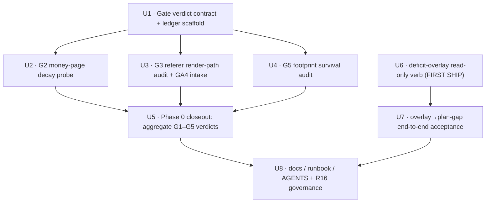

# Gate-first validation suite (G2/G3/G5) + Phase-1 deficit-overlay first ship

## Overview

The `docs/brainstorms/` backlog has ~60% of recent ideas stuck "ready for `/ce:plan`" but never
shipped. The 2026-06-01 consolidation roadmap (origin) collapsed 11 recent brainstorms into 4
Programs + 1 KILL and imposed a **gate-first** rule (R16): any "build a Phase 1–N machine"
brainstorm may not enter `/ce:plan` until its cheap falsification gate returns **GO**.

This plan delivers the two things the roadmap's *Next Steps* names as immediately plannable, because
neither is blocked by a gate:

1. **Phase 0 validation gates G2 / G3 / G5** — three cheap, read-only premise probes, each emitting a
   `GO` / `KILL` / `INCONCLUSIVE` / `BLOCKED` verdict + an evidence sample into a single verdict ledger
   (the first run per gate is a calibration pass that sets the threshold). (G1 and G4 already have plans
   `002`/`004`; this plan aggregates all five verdicts but only *produces* G2/G3/G5.)
2. **Phase 1 deficit-overlay** — the roadmap's designated **first ship** (`recheck → ledger`
   deficit-overlay). A read-only verb that discounts cron-detected dead links from `live_dofollow` so
   `plan-gap` finally plans replacements. No gate needed; ships independently and first.

Both deliverables are read-only by construction — they build no new pipeline, change no schema, and
write nothing to any store. They exist to *establish trust in signals* before any gated build-out
(remediation queue, GA4 attribution, GEO machine, channel discovery/orchestration) is planned.

## Problem Frame

Two distinct problems, joined by one principle (read-only signals before machines):

**Backlog problem (gates).** Multiple brainstorms want to "build Phase 1–3 machines" whose external
premises were never validated with a cheap probe. `entropy-budget-footprint-diversification` was
self-KILLED *after* drafting, because the operator's `<a>` bytes never reach the crawled page — the
exact cost of a missing front gate. Three premises remain unverified and gate downstream work:
- **G2** — do the operator's *own* money pages silently decay (`noindex`/404/soft-404/redirect) after
  publish, at a rate that justifies a destination-decay machine?
- **G3** — does *any* channel ever deliver a real referral session, and what fraction of our publish
  render paths preserve `referer` at all? (Most strip it via `rel="noopener noreferrer"`.)
- **G5** — is footprint's measured fingerprint concentration *actually detectable by a crawler*, or
  does it (like entropy-budget) measure operator bytes that never survive to the published page?

**Integration false-success (overlay).** The recheck **survival loop** (#310) writes authoritative
`link.rechecked` verdicts (`host_gone` / `link_stripped` / `dofollow_lost`) and *displays* them, but
the equity-ledger's liveness is **publish-time-clock only** (`ledger/aggregate.py:_link_liveness`) and
never reads `link.rechecked`. So a cron-detected dead link still counts as `live_dofollow`;
`gap/engine.py` computes `deficit = max(0, desired − live_dofollow)`; the falsely-live link cancels the
deficit; `plan-gap` emits **zero** replacement seeds. The operator's cron loop *sees* the death,
*shows* it, and cannot *act* on it without a manual WebUI click. This is the project's signature
false-success class at the integration layer (see origin: `recheck-ledger-liveness-writeback`).

## Requirements Trace

Gate suite (origin: `optimization-backlog-consolidation` R5–R11, R16; `destination-decay-monitor`):

- **RG-CONTRACT.** Every gate emits exactly one of `GO` / `KILL` / `INCONCLUSIVE` / `BLOCKED` (origin R11
  — four states; `BLOCKED` = Tier-2 credentials unavailable) plus an evidence sample; a probe that cannot
  confirm its premise returns `INCONCLUSIVE`, never `GO`; the first run per gate is a calibration pass
  (INCONCLUSIVE) that sets the threshold. Remote-derived evidence strings are capped + escaped before
  serialization. (consol. R10, R11)
- **RG2.** G2 (Tier-1 offline) — sample the operator's own money pages, classify
  `noindex`/404/soft-404/redirect, output the silent-decay rate. (consol. R6; destination-decay premise)
- **RG3.** G3 (Tier-2) — (a) audit every publish render path for `referer` preservation (the static audit
  alone can `KILL`); (b) intake the operator's GA4 referral-session evidence (GO-confirmation, not a
  prerequisite); credentials unavailable → `BLOCKED`. (consol. R7, R11)
- **RG5.** G5 — re-fetch a sample of *published* pages and measure whether footprint's pre-publish
  fingerprint dimensions survive into the live DOM; answer whether the orchestrator footprint-gate
  shares entropy-budget's dead premise. (consol. R9)
- **RG-LEDGER.** All five gate verdicts (G1–G5) + evidence land in one synthesis ledger under
  `docs/ideation/`; KILL blocks the downstream Program stage from being planned; INCONCLUSIVE must
  resample, never default to GO. (consol. R3, R10, R11)
- **RG-GOV.** Record the R16 governance rule and the `entropy-budget` KILL at the top of the ledger so
  the premise cannot be revived. (consol. R2, R16)

Deficit-overlay (origin: `recheck-ledger-liveness-writeback` R1–R8):

- **R1.** Read the latest `link.rechecked` verdict per link (keyed on canonical `live_url`,
  `article_id` fast path); `host_gone`/`link_stripped` → discount the link from its target's
  `live_dofollow`.
- **R2.** `dofollow_lost` discounts the link from the *dofollow* portion only (live but non-dofollow).
- **R3.** `probe_error` → ignored (no discount, re-probed); `alive` confirms live.
- **R4.** Recency wins: latest verdict per link governs; a newer `alive` restores the link.
- **R5.** Adjusted `live_dofollow` feeds `plan-gap`'s **existing** deficit math + fan-out, avoiding the
  dead platform — `gap/engine.py` unchanged.
- **R6.** Overlay is read-only and pure: mutates nothing (events.db, dedup.db, ledger, history_store,
  canary-health.json); no schema/projector change.
- **R7.** Positive-assertion acceptance: a deterministic-dead verdict newer than the last live signal
  increases the target's deficit by one and yields a replacement seed **on default flags (no
  `--include-failed`)**.
- **R8.** Recency + determinism: a later `alive` restores baseline; re-running on the same event set
  converges.

## Scope Boundaries

- **No gated build-out.** This plan ships *probes and one read-only overlay only*. No remediation /
  ack / snooze queue, no GA4/GSC integration code, no GEO machine, no channel discovery /
  orchestration. Those wait for their gate = GO (R16).
- **G2 builds no destination-decay machine.** Persisting receipts to a new `events.db` KIND and a
  `LedgerRow` field (former D1/D2) is the *post-GO* build-out — OUT here. The gate is the cheap
  offline probe only.
- **G1 and G4 gates are out** — already planned (`002-source-indexability-detection`,
  `004-geo-wave0-citation-probe-gate`). This plan reads their verdicts into the ledger but does not
  re-implement them.
- **G3 does not change render paths.** The audit *reports* which paths strip `referer`; the
  "change render path to preserve referrer vs. degrade attribution to `unattributable`" decision is
  deferred to post-G3 (consol. Deferred). `_format_anchor_html` is read, never edited.
- **No GA4/GSC code lands in-repo.** The referral half of G3 and any owned-site signal is produced by
  the operator's external tooling (`gsearch-radar`, `fetch_gsc_data.py` — operator skills, not project
  source); this plan only defines the evidence-intake format.
- **Overlay does no ledger writeback (R6-writeback-integration).** The equity-ledger's stored liveness stays
  publish-time-clock; the overlay is a transform feeding `plan-gap`, throwaway by design, retired when
  plan-007's ledger natively consumes recheck verdicts. Recorded as a deferred follow-up.
- **Overlay non-goals (carried):** replacement provenance / `decay_origin`, `suspected_dead`
  (K-consecutive `probe_error`), recheck coverage-deficit warning, `liveness_source` operator
  dimension, auto-publish — all OUT.
- **`entropy-budget` is not revived.** It stays KILLED.
- **Core `plan → validate → publish` pipeline is untouched.**

## Context & Research

### Relevant Code and Patterns

**Gate primitives (reuse, do not rebuild):**
- `content/_preflight_fetch.py:fetch_target(url, *, timeout) -> PreflightFacts` — the canonical
  fetch-and-classify routine; never raises, every failure becomes a `reason`. Fields include
  `noindex` (meta + `X-Robots-Tag`), `soft404`, `status`, `redirected`, `host_diff`, `head_closed`,
  `tls_unverified`. **G2 fetch primitive.**
- `recheck/indexability.py:classify_indexability(facts) -> (state, reason)` — pure tri-state
  `ok`/`blocked`/`unknown`. **G2 classifier.**
- `cli/preflight_targets.py` — closest read-only-verb precedent (dedupe targets, one `fetch_target`
  per distinct target, always exit 0). **Mirror for G2 probe.**
- `_util/markdown.py:_format_anchor_html(url, anchor, *, rel="noopener noreferrer")` — the **single**
  operator anchor builder. 3 call sites: `render_*` long-form (default `noreferrer` → strips) ,
  `render_zh_short_article` (default `noreferrer` → strips; enforced by `validate_zh_short_payload`),
  `content/themed_gen.py:205-212` (passes `rel="noopener"` → **referrer NOT stripped**). **G3 audit
  surface — enumerate exactly these three.**
- `publishing/adapters/link_attr_verifier.py:inspect_target_anchor(live_url, target, …)` → returns the
  deployed anchor's actual `rel`/found/text. **G5 + G3 live-page re-read seam.**
- `footprint.py` + `cli/footprint.py` — measure byte-level self-fingerprint (`attr_name_order`,
  `rel_value`, `target_value`, `preceding_char`) over **pre-publish** `plan-backlinks` output. `_report_to_json`
  emits `concentration_pct`. **G5 reads this, then checks survival in the live DOM.**
- `publishing/registry.py:_DOFOLLOW_BY_CHANNEL` — per-channel dofollow truth map (the symbol lives in
  the registry, **not** `webui_app/binding_status.py`). **Reuse for G5/overlay dofollow classification;
  do not re-derive.**

**Overlay seams:**
- `recheck/verdicts.py` — `ALIVE`/`HOST_GONE`/`LINK_STRIPPED`/`DOFOLLOW_LOST`/`PROBE_ERROR`;
  `DETERMINISTIC_DEAD={host_gone,link_stripped}`, `DEFINITIVE`, helpers `is_deterministic_dead`.
- `recheck/events_io.py:derive_decay_counts` — the existing latest-verdict-per-link read. **Reuse as a
  *shape template only* (group-latest-per-key): it keys on `article_id` (not `live_url`), filters
  `article_id IS NOT NULL`, and orders by `ts_utc` comparison with **no rowid tiebreaker**. The overlay
  must add the rowid tiebreak, the canonical-`live_url` keying, and a NULL-`article_id` path — it cannot
  be copied verbatim (see Unit 6).**
- `events/store.py:EventStore.query(sql, params)` (SELECT-only) + schema `events(id PK AUTOINCREMENT,
  ts_utc, kind, article_id, payload_json …)`; `articles(live_url UNIQUE, …)`. **`id` (rowid) is the
  reliable append-order key. `link.rechecked` events are written by `recheck/events_io.py:emit_recheck`,
  which lets `store.append` default `ts_utc` to `_now_iso_utc()` → recheck `ts_utc` is consistently
  tz-aware UTC (the naive-local writers are the `articles`/history projection, which the overlay does
  not order on). The real ordering risk is therefore same-`ts_utc` ties, not tz drift.**
- `ledger/aggregate.py:build_ledger` / `_link_liveness` / `live_dofollow` (`+ live_dofollow_platforms`,
  `+ liveness` worst-status-wins per target); `ledger/sources.py:build_target_buckets` (articles ⨝
  history_store ⨝ anchor store, keyed on `canonicalize_url`; `platform` lives on the **history** join).
  **`LedgerRow.to_jsonl_dict()` (`ledger/model.py`) emits only aggregated target-level fields
  (`live_dofollow` int, `live_dofollow_platforms` deduped set, `history_item_ids`, `liveness`) — NO
  per-link `article_id`/`live_url`/`platform`. So the overlay CANNOT map a recheck verdict to a row from
  the JSONL alone; it must re-join `events.db articles ⨝ history_store` to resolve
  `article_id → live_url → platform` (a slice of `build_target_buckets`). See Unit 6 — this is the
  overlay's real data source.**
- `cli/equity_ledger.py` (65 SLOC) — **the read-only-verb template to mirror** for `deficit-overlay`.
- `gap/engine.py:plan_gap(rows, opts, *, active_dofollow, now)` — pure; `deficit = max(0, desired −
  live_dofollow)`; fan-out over `active_dofollow_platforms()` minus already-live; failed/stale
  suppression with `--include-failed`. **Reads row fields purely → overlay adjusts rows upstream, engine
  unchanged.**
- CLI registration: `pyproject.toml [project.scripts]`; conventions: `_util/jsonl` read/write,
  `_util/errors:emit_error` (post-parse validation, **not** argparse `choices=`/`required=` — those
  exit 2 and clash with the exit-code contract), `config_echo` banner to stderr, read-only verbs
  always exit 0.

### Institutional Learnings

- `logic-errors/projector-silent-drop-status-vocabulary-drift-2026-05-26.md` — a silent `else` over a
  status vocabulary dropped successes. **→ Classify every verdict through an explicit 3-outcome
  registry (`known discount rule` | `ignore` | `INCONCLUSIVE`); never a binary live/dead with a silent
  fall-through.** Also: avoid a second write-connection while a WAL writer holds the lock (read-only
  query is safe).
- `integration-issues/dofollow-canary-verdict-dropped-at-publish-output-seam-2026-05-25.md` — a verdict
  was dropped because two serializers existed and one was unwired; and `verify_link_attributes` scans
  *every* `<a>` page-wide. **→ Enumerate every read path (fresh/resume/migrated); inspect the *target
  backlink's own* `rel`/`href`, never a page-wide nofollow flag (G3/G5).**
- `ux-honesty/webui-false-success-resolution.md` + `correctness/adapter-silent-exceptions-resolution.md`
  — false `ok:True` and bare `except: pass`. **→ A probe error becomes a visible `INCONCLUSIVE`, never a
  silent verdict; no unlogged swallow in any probe.**
- `best-practices/medium-liveness-probe-partial-spike-2-2026-05-19.md` — a partial clean sample is not
  a green flag. **→ Partial referral/decay/survival sample = INCONCLUSIVE, not GO; keep active probes
  one-shot/operator-triggered (Cloudflare IP-reputation caution).**
- `best-practices/recon-log-level-for-always-on-signals-2026-05-15.md` +
  `typed-error-envelope-over-stderr-truncation-2026-05-27.md` — **→ Emit verdicts + the discount delta
  via `recon(...)` / a typed envelope on stderr (data stays on stdout). Expect new stderr signals to
  break `stderr == ""` tests — invert them in the same commit.**
- `test-failures/negative-assertion-locks-in-bug-2026-05-15.md` — `assert X not in result` can enshrine
  a silent-drop. **→ Every "dead link not counted" assertion needs a positive complement ("live link
  IS counted", "unknown → INCONCLUSIVE"); use `hypothesis` for "gate returns a constant verdict for
  every input".**
- `test-failures/del-os-environ-poisons-session-scoped-config-dir-fixture-2026-05-27.md` — **→
  `monkeypatch` only, never mutate `os.environ`/global stores; keep `PYTHONHASHSEED=0`.**
- **events.db ordering is an unproven area** — no learning covers rowid-vs-`ts_utc` latest-per-key or
  tz normalization (`ts_utc` is a string queried by prefix). Treat as a spike (see Unit 6).

### External References

None gathered. The work is repo-grounded — read-only verbs and gate engines built over existing
primitives; no new external framework, API, or library is introduced. The new modules (`gates/`,
`cli/gate_probe.py`, `recheck/deficit_overlay.py`, `cli/deficit_overlay.py`) are new *project* surface
but reuse existing patterns and seams. The only external system (GA4/GSC) is deliberately kept *out of
repo* and handled by operator tooling.

## Key Technical Decisions

- **Gate-first, probe-not-machine** (operator decision 2026-06-01): each gate is a cheap read-only
  probe that emits a verdict; no Phase 1–N machine is built before its gate = GO.
- **One `gate-probe --gate {g2|g3|g5}` verb** dispatching to pure `gates/*` engines that share one
  verdict envelope — over three separate verbs. Rationale: least CLI surface, one shared verdict
  contract, tests target the pure engines via injected `fetch_fn`. (Alternative weighed below.)
- **Four verdict states `GO` / `KILL` / `INCONCLUSIVE` / `BLOCKED`** (per origin R11 — the roadmap
  mandates four, not three). `BLOCKED` is the *credential-unavailable* state for the Tier-2 gates
  (G3/G4): when the operator's GA4/GSC credentials are not configured at probe time, the gate returns
  `BLOCKED` (**not** INCONCLUSIVE), the dependent Program stage is *parked* (not shown as schedulable),
  and this is a Phase-0 entry prerequisite, not a deferred resample. Tier-1 offline gates (G2/G5) never
  return `BLOCKED`.
- **INCONCLUSIVE = the QUARANTINE-equivalent**: a probe that cannot confirm its premise (probe error,
  partial sample, unknown classification) returns INCONCLUSIVE, never GO. Maps the projector's
  three-outcome discipline onto gate verdicts. **First run is always a calibration pass** (see threshold
  decision below) → the first verdict per gate is INCONCLUSIVE by construction.
- **Thresholds are calibrated, not preset — and the machinery makes this explicit.** A gate's GO-vs-KILL
  is *defined* by comparing a measured rate against a threshold; with no threshold the only defensible
  verdict is INCONCLUSIVE. So the **first probe run is definitionally INCONCLUSIVE (calibration)**; the
  operator records the threshold + rationale into `gate-verdicts.md`; **GO/KILL is only reachable on the
  second run against the recorded threshold.** This removes the chicken-and-egg where "gates produce
  GO/KILL" is unreachable by the machinery.
- **Deficit-overlay = a new read-only verb between `equity-ledger` and `plan-gap`** with **zero edits to
  `gap/engine.py` or `plan_gap.py`** (preserves engine purity; inherits `as_of`). **But its real input is
  not the ledger JSONL alone:** the ledger row exposes only aggregated target-level fields, so the overlay
  re-joins `events.db articles ⨝ history_store` to resolve `article_id → live_url → platform` per link
  (a slice of `build_target_buckets`), applies the recheck verdicts at link granularity, then re-emits
  ledger-shaped rows with corrected `live_dofollow` / `live_dofollow_platforms` / `liveness`. "Reads
  rows, rewrites two fields" was the wrong framing — name the join.
- **Discount must preserve the count/set invariant and the liveness field, or `plan_gap` suppresses the
  seed:**
  - *Count-vs-set:* `live_dofollow` counts **per link**; `live_dofollow_platforms` is a **deduped set**.
    A target with two live-dofollow links on the *same* platform has `live_dofollow=2`,
    `platforms={p}`. The overlay must prune a platform from the set **only when its last surviving
    live-dofollow link on that platform dies**, not on the first — i.e. it needs per-`(target,platform)`
    live-link counts (another reason it needs the per-link join).
  - *Liveness suppression (corrects the "dissolves both P0s" claim):* representing dead as a discounted
    count dissolves the `failed`-suppression P0, **but `gap/engine.py:138` also suppresses any row with
    `liveness ∈ {stale, unverified} AND live_dofollow == 0` on default flags.** A target last verified
    past `stale_days`, once discounted to 0, lands in that branch and emits **zero** seeds — silently
    violating R7. The overlay must therefore also normalize the row's top-level `liveness` for a
    confirmed-dead-discounted target so the deficit is emitted on default flags (exact mechanism —
    recompute `liveness` from surviving links vs. set an explicit deficit signal — is a deferred
    implementation choice; the *requirement* that the seed emit on default flags is firm).
- **Latest-verdict-per-link keyed on canonical `live_url` (`article_id` fast path; NULL-`article_id`
  resolved via payload `live_url`); ordered `ts_utc` then `events.id` rowid as the deterministic
  tiebreaker for same-`ts_utc` ties.** The cited `derive_decay_counts` has *no* rowid tiebreak, so a
  same-second `alive` newer than a `host_gone` can be picked non-deterministically — re-introducing the
  false-success — unless the overlay adds the rowid tiebreak.
- **3-outcome verdict classification registry** (known verdict → discount rule | `alive`/`probe_error`
  → no discount | unknown verdict → INCONCLUSIVE/ignore, never silent `else`).
- **Inspect the target backlink's own `rel`/`href`, not a page-wide flag** (G3/G5) — reuse
  `inspect_target_anchor` + `publishing/registry.py:_DOFOLLOW_BY_CHANNEL`.
- **Untrusted-value discipline for all remote-derived evidence** (G2/G5): every remote string that enters
  the verdict envelope or the committed `gate-verdicts.md` (`X-Robots-Tag`, `final_url`, `target_rel`,
  `target_anchor_text`) is length-capped and Markdown/HTML-escaped (or rendered as a fenced literal)
  first. The ledger is a git-tracked decision surface an operator reads as trusted.
- **Verdict ledger = a concrete `docs/ideation/gate-verdicts.md` artifact now**, soft-folded into the
  arch-suite A2 `SYNTHESIS.md` when that ships (A2/U2 is unshipped today). Honors consol. R3 ("reuse
  the ideation ledger, don't build a new file system") without a hard blocking dependency.
- **G2 gate = offline `fetch_target` probe; GSC integration deferred** to the post-GO build-out.
  Resolves destination-decay's GSC-vs-offline blocker at the *gate* altitude (cheap first).

## Open Questions

### Resolved During Planning

- **Overlay seam (overlay doc deferred Q):** a standalone read-only verb in the pipe
  `equity-ledger | deficit-overlay | plan-gap` — chosen over a `plan-gap --dead-overlay` flag (entangles
  concerns, grows a near-budget file) and a wrapper script (breaks the JSONL-stage idiom).
- **G2 GSC vs offline (destination-decay blocker):** offline `fetch_target` probe for the gate; GSC is
  the authoritative *build-out* signal, deferred to post-GO.
- **Verdict-ledger location (consol. R3):** own `docs/ideation/gate-verdicts.md`, soft-fold to
  `SYNTHESIS.md` if A2 lands. Avoids depending on unshipped arch-suite U2.
- **Gate CLI shape:** one `gate-probe --gate` dispatcher verb (vs three verbs).
- **Overlay data source (corrected during review):** the ledger row carries only aggregated fields, so
  the overlay re-joins `events.db articles ⨝ history_store` to resolve `article_id → live_url → platform`
  per link — it is **not** a thin row-rewrite. Keyed on canonical `live_url` (`article_id` fast path;
  NULL-`article_id` via payload `live_url`).
- **Verdict states:** four — `GO`/`KILL`/`INCONCLUSIVE`/`BLOCKED` (origin R11), `BLOCKED` reserved for
  Tier-2 credential-unavailable (G3/G4).
- **Threshold chicken-and-egg:** first run is always a calibration pass → INCONCLUSIVE; threshold +
  rationale recorded in `gate-verdicts.md`; GO/KILL only on the second run.
- **G3 verdict resolvability:** the static render-path audit ALONE can reach `KILL` ("majority of paths
  strip `referer` → attribution structurally blind"); GA4 referral evidence is a GO-*confirmation*, not a
  verdict prerequisite; credential-unavailable → `BLOCKED`, not perpetual resample.
- **G5 saturation:** below a re-fetch success-rate floor the gate emits a *terminal* INCONCLUSIVE-`unmeasurable`
  (premise unverifiable by canary re-fetch — itself evidence against building the footprint-gate, like
  entropy-budget), instead of looping resample forever.

### Deferred to Implementation

- **Same-`ts_utc` tie ordering (the real, re-scoped uncertainty).** Recheck `ts_utc` is consistently
  tz-aware UTC (`emit_recheck` uses the store default), so the original "naive-local vs tz-aware" framing
  was a misdiagnosis. The residual risk is same-second ties, for which the cited `derive_decay_counts` has
  **no rowid tiebreak** — spike the `ORDER BY ts_utc, id` resolver against real events (and confirm no
  non-UTC `link.rechecked` rows exist) before trusting recency. **This spike is Unit 6's blocking first
  step** (see Unit 6 Execution note).
- **Overlay liveness-normalization mechanism** — *whether* the overlay rewrites the top-level `liveness`
  for a confirmed-dead-discounted target (recompute from surviving links vs. explicit deficit signal) is a
  deferred implementation choice; *that* the replacement seed must emit on default flags for stale/unverified
  targets is a firm requirement (R7), tested in Unit 7.
- **GO/KILL numeric thresholds per gate** (G2 silent-decay %, G3 referral-session count, G5 survival %)
  — calibrated from the first (INCONCLUSIVE) probe sample and recorded with rationale; do not preset
  (consol. Deferred).
- **Whether the overlay also surfaces the adjusted `live_dofollow` to the equity-ledger *display***
  (read-only) so the operator sees the discounted count, vs strictly feeding `plan-gap` (overlay R6 Q).
- **`gate-probe` flags** (`--sample-size`, `--since`) — derive from the first probe run, not pre-specced.

## High-Level Technical Design

> *This illustrates the intended approach and is directional guidance for review, not implementation
> specification. The implementing agent should treat it as context, not code to reproduce.*

Two independent pipes, both read-only. The overlay (Phase 1) ships first; the gates (Phase 0) run in
parallel and write verdicts into one ledger.

```
PHASE 1 — deficit-overlay (first ship, no gate dependency)

  equity-ledger ──rows──▶ deficit-overlay ──adjusted rows──▶ plan-gap ──seeds──▶ plan-backlinks
                              │  (read-only; gap/engine.py UNCHANGED)
                              ├─ REAL INPUT is not the row alone: re-join events.db articles ⨝ history
                              │     → article_id → live_url → platform  (per-link, the row lacks these)
                              ├─ latest verdict per link: ORDER BY ts_utc, events.id (rowid tiebreak)
                              ├─ classify (3-outcome): host_gone|link_stripped → discount link
                              │     dofollow_lost → discount dofollow portion ; alive|probe_error → keep
                              │     unknown → INCONCLUSIVE (surface, do not silently keep as live)
                              ├─ prune platform from set ONLY when its LAST live link on it dies
                              └─ normalize liveness so a discounted stale/unverified target still seeds

PHASE 0 — falsification gates (parallel, independent)

  gate-probe --gate g2 ─▶ fetch_target(own money pages)      ─┐   Tier-1 offline
  gate-probe --gate g3 ─▶ render-path audit (+ GA4 evidence) ─┼─▶ {GO|KILL|INCONCLUSIVE|BLOCKED}+evidence
  gate-probe --gate g5 ─▶ inspect_target_anchor(published)   ─┘   (BLOCKED = Tier-2 creds unavailable;
       (g1/g4 verdicts come from already-planned 002/004)          first run = calibration → INCONCLUSIVE)
                                                                          ▼
                                                       docs/ideation/gate-verdicts.md
                                                       (R16 rule + entropy-budget KILL recorded at top)
```

## Implementation Units



- [x] **Unit 1: Gate verdict contract + ledger scaffold** — shipped (`feat/gate-first-validation`, commit eef86e0e)

**Goal:** A shared four-state verdict envelope (`GO`/`KILL`/`INCONCLUSIVE`/`BLOCKED`, pure), with
length-cap + escape for remote-derived evidence; the `docs/ideation/gate-verdicts.md` ledger scaffold;
the R10 protocol (incl. first-run-is-calibration); and the R16 governance rule + `entropy-budget` KILL
recorded at the top of the ledger.

**Requirements:** RG-CONTRACT, RG-LEDGER, RG-GOV

**Dependencies:** None (Phase 0 foundation)

**Files:**
- Create: `src/backlink_publisher/gates/__init__.py`
- Create: `src/backlink_publisher/gates/verdict.py` (pure: four-state verdict enum, evidence record with
  untrusted-string capping/escaping, the protocol; reuse the typed-error-envelope discipline)
- Create: `docs/ideation/gate-verdicts.md` (the one-page 判決台帳; R16 rule + entropy KILL at top;
  rows for G1–G5 with `gate | tier | premise | verdict | rate/evidence | sample-n | date | downstream-blocked`)
- Test: `tests/test_gate_verdict_contract.py`

**Approach:**
- `verdict.py` exposes the four states and a constructor that *requires* an evidence sample for GO/KILL
  and forbids GO when the sample is empty/partial (INCONCLUSIVE instead). `BLOCKED` is constructible only
  for Tier-2 gates and carries the "credentials unavailable" reason. Pure, no I/O.
- The evidence record length-caps and Markdown/HTML-escapes (or fences) every remote-derived string
  (`X-Robots-Tag`, `final_url`, `target_rel`, `target_anchor_text`) before it can be serialized into the
  envelope or the committed ledger — the ledger is a trusted, git-tracked decision surface.
- The ledger header states: (a) it folds into arch-suite `SYNTHESIS.md` once A2 ships; (b) evidence rows
  carry aggregate rates/host-stripped identifiers, **never raw operator money-page URLs** (the
  no-operator-domain rule applies to `docs/ideation/`, not only `docs/solutions/`).

**Patterns to follow:** `_util/errors` typed envelope; `recheck/verdicts.py` (closed-vocabulary enum
shape); the existing `X-Robots-Tag` length-cap (`_X_ROBOTS_MAX_LEN`) untrusted-value discipline.

**Test scenarios:**
- Happy path: a verdict built with a non-empty evidence sample and `GO` round-trips to the envelope.
- Edge case: empty/partial evidence sample with `GO` requested → coerced to `INCONCLUSIVE`.
- Edge case: unknown/empty verdict string → rejected (closed vocabulary), not silently passed.
- Edge case: `BLOCKED` requested for a Tier-1 (offline) gate → rejected; allowed for Tier-2.
- Error path: a remote-derived evidence string containing Markdown/HTML/pipe/control chars is
  escaped/capped before serialization (assert the ledger row cannot be broken or injected).
- Property (`hypothesis`): for any evidence input, the constructor never yields `GO` when the sample is
  below the "confirmed" floor — guards against a tautological always-GO gate.

**Verification:** `gates/verdict.py` imports clean; the ledger renders with the R16 rule and the
`entropy-budget` KILL row present; constructor cannot emit GO without evidence, cannot emit BLOCKED for a
Tier-1 gate, and never serializes an unescaped remote string.

- [x] **Unit 2: G2 — money-page decay baseline probe** — shipped (commit eef86e0e)

**Goal:** `gate-probe --gate g2` samples the operator's own money pages, classifies each via the
existing `fetch_target`/`classify_indexability`, and emits the silent-decay rate + a `GO`/`KILL`/
`INCONCLUSIVE` verdict.

**Requirements:** RG2, RG-CONTRACT

**Dependencies:** Unit 1

**Files:**
- Create: `src/backlink_publisher/gates/g2_decay.py` (pure engine: facts → per-page classification →
  decay-rate verdict, with injectable `fetch_fn`)
- Create/Modify: `src/backlink_publisher/cli/gate_probe.py` (the dispatcher verb; `--gate g2` route)
- Modify: `pyproject.toml` (`[project.scripts]` → `gate-probe`)
- Test: `tests/test_gate_g2_decay.py`

**Approach:**
- Money-page URL set comes from config `[sites.*]` (`main_url`/`list_url`/`work_url`), not hardcoded.
  Evidence written to the committed ledger is **aggregate rate + host-stripped identifiers**; raw operator
  money-page URLs never enter `docs/ideation/` (the no-operator-domain rule applies there, not only
  `docs/solutions/`).
- Reuse `fetch_target` (never raises) + `classify_indexability`; do not write a new fetcher. All fetches
  route through the SSRF-guarded preflight opener (no new fetch path).
- Decay rate = fraction of sampled pages whose latest classification is `noindex`/`http_4xx`/`soft404`/
  off-host redirect. A probe error on a page contributes to INCONCLUSIVE, not to the decay numerator. G2
  is Tier-1 offline → never returns `BLOCKED`. First run is calibration → INCONCLUSIVE by construction.

**Execution note:** Inject `fetch_fn` in tests; behind `real_content_fetch`/`real_ssrf_check` for any
live run. One-shot, operator-triggered (IP-reputation caution).

**Patterns to follow:** `cli/preflight_targets.py` (dedupe, one fetch per distinct target, exit 0);
`cli/canary_targets.py:_classify`.

**Test scenarios:**
- Happy path: a sample where K of N pages classify `noindex`/404 → decay rate `K/N`, verdict reflects
  the (deferred) threshold contract via the Unit-1 constructor.
- Edge case: all pages `ok` → decay rate 0; verdict is the not-decayed branch (the premise is weak →
  the downstream decay machine stays unplanned).
- Error path: `fetch_target` returns a probe-error reason for some pages → those count toward
  INCONCLUSIVE, never silently toward GO or the decay rate.
- Edge case: empty money-page config → exit 0 with an explicit "no targets" diagnostic, not a crash.
- Determinism: same injected facts → same rate and verdict.

**Verification:** `… | gate-probe --gate g2` emits one verdict JSONL on stdout + a RECON line on stderr;
exit 0 even when all pages are dead.

- [x] **Unit 3: G3 — referer render-path audit + GA4 referral intake** — shipped (commit fdb77e60)

**Goal:** `gate-probe --gate g3` audits every operator render path for `referer` preservation
(deterministic, in-repo) and accepts operator-supplied GA4 referral evidence to finalize the verdict.

**Requirements:** RG3, RG-CONTRACT

**Dependencies:** Unit 1

**Files:**
- Create: `src/backlink_publisher/gates/g3_referer.py` (pure: enumerate the `_format_anchor_html` call
  sites → which strip `referer`; fold in operator referral evidence → verdict)
- Modify: `src/backlink_publisher/cli/gate_probe.py` (`--gate g3` route; typed `--referral-evidence` intake)
- Test: `tests/test_gate_g3_referer.py`

**Approach:**
- Render-path audit is **static**: enumerate the anchor render paths — long-form (`render_*`) and zh-short
  (`render_zh_short_article`, contract-enforced by `validate_zh_short_payload`) set
  `rel="noopener noreferrer"` (strip); `content/themed_gen.py` work-themed links set `rel="noopener"`
  (preserve). (Note: `_format_anchor_html` is invoked from ~5 literal call sites across `_util/markdown.py`
  and `content/themed_gen.py` plus the zh-short enforcement path — enumerate all, don't undercount to
  "three".) Output the preserved-fraction. **Do not modify `_format_anchor_html`** (`_util/markdown.py` is
  at 210/240 SLOC; the render-path change decision is deferred).
- GA4 half: zero GA4 code in-repo (confirmed). G3 is **Tier-2**: if GA4/GSC credentials are unavailable at
  probe time, the gate returns **`BLOCKED`** (not INCONCLUSIVE) and Program B is *parked*. The static audit
  alone can reach **`KILL`** when the majority of paths strip `referer` ("attribution structurally blind
  regardless of GA4") — so GA4 referral evidence is a GO-*confirmation*, **not** a verdict prerequisite,
  and G3 never stalls forever waiting on external evidence. The operator runs `gsearch-radar` externally
  and supplies the owned-site referral-session count + window via the typed `--referral-evidence` intake.
- `--referral-evidence` is **strictly typed** (integer session count + ISO window); anything else is
  rejected via `emit_error`. The raw pasted blob is never echoed into the verdict/ledger — only the parsed
  numeric fields are stored.

**Execution note:** The static audit needs no network; the referral-evidence intake (or its absence →
BLOCKED/static-KILL) gates the final verdict.

**Patterns to follow:** `_util/markdown.py:_format_anchor_html` call-site enumeration;
`integration-issues/dofollow-canary…` (inspect the target's own `rel`, not page-wide).

**Test scenarios:**
- Happy path: audit reports all anchor render paths with the correct strip/preserve split and the
  preserved-fraction.
- Edge case: GA4 credentials unavailable → verdict `BLOCKED` (Tier-2), Program B parked, **not**
  INCONCLUSIVE.
- Integration: majority-strip audit with no referral evidence → `KILL` on the static audit alone
  (attribution structurally blind), surfacing the "fix render path vs degrade to unattributable" deferred
  decision in the verdict note — proves G3 does not depend on external evidence to terminate.
- Happy path: valid referral evidence (>0 sessions) + preserving paths → GO-confirmation.
- Error path: malformed/over-long `--referral-evidence` → `emit_error` exit (typed validation), raw blob
  never stored.

**Verification:** `gate-probe --gate g3` resolves to KILL/BLOCKED/GO without ever hanging on missing
external evidence; the render-path audit table is on stdout; only parsed numeric referral fields persist.

- [x] **Unit 4: G5 — footprint survival audit** — shipped (commit e9ccf789)

**Goal:** `gate-probe --gate g5` re-fetches a sample of *published* pages and measures whether
footprint's pre-publish fingerprint dimensions survive into the live DOM — answering whether the
orchestrator footprint-gate shares entropy-budget's dead premise.

**Requirements:** RG5, RG-CONTRACT

**Dependencies:** Unit 1

**Files:**
- Create: `src/backlink_publisher/gates/g5_footprint_survival.py` (pure: for each sampled published
  link, compare the operator's pre-publish anchor dimensions against the live-DOM anchor → survival %)
- Modify: `src/backlink_publisher/cli/gate_probe.py` (`--gate g5` route)
- Test: `tests/test_gate_g5_footprint_survival.py`

**Approach:**
- Pre-publish dimensions come from `footprint.py` (`attr_name_order`/`rel_value`/`target_value`/
  `preceding_char`) over `plan-backlinks` output; live dimensions come from
  `inspect_target_anchor(live_url, target)` — **inspect the target backlink's own anchor, not a
  page-wide scan**.
- Survival % = fraction of sampled links whose operator fingerprint dimensions are still present in the
  live DOM. Low survival → footprint-gate is built on the same "operator bytes never reach the crawled
  page" premise that KILLed entropy-budget → KILL (recorded so the orchestrator footprint-gate stage is
  not planned).
- A re-fetch error contributes to INCONCLUSIVE, not to the survival numerator. **Saturation escape:** many
  published-page hosts are anti-bot / UA-cloaking / auth-walled, and `inspect_target_anchor` carries an
  honest UA-cloaking limitation, so a sample can be dominated by re-fetch failures. If the re-fetch
  *success rate* falls below a floor, the gate emits a **terminal INCONCLUSIVE-`unmeasurable`** (no endless
  resample) — which itself is evidence that the footprint-gate premise is unverifiable by canary re-fetch,
  arguing against building the machine (same conclusion as entropy-budget, reached differently). G5 is
  Tier-1 → never `BLOCKED`.

**Execution note:** Inject the inspector fn in tests; behind `real_content_fetch` for live runs;
one-shot/operator-triggered. Before committing to this probe shape, size what fraction of target channels
the verifier UA can actually fetch (the `unmeasurable` floor depends on it).

**Patterns to follow:** `publishing/adapters/link_attr_verifier.py:inspect_target_anchor` (honest
UA-cloaking limitation); `footprint.py` dimension keys; `publishing/registry.py:_DOFOLLOW_BY_CHANNEL`.

**Test scenarios:**
- Happy path: a sample where the operator `rel`/attr-order survives in M of N readable live DOMs →
  survival `M/N` and the corresponding verdict.
- Edge case: platform rewrote every anchor (operator bytes gone, pages readable) → survival 0 → KILL
  (premise dead, matches entropy-budget).
- Edge case (saturation): re-fetch success rate below the floor → terminal INCONCLUSIVE-`unmeasurable`,
  **not** an endless resample, recorded as "premise unverifiable by re-fetch".
- Error path: inspector returns `page_readable=False`/error for some links → not counted as "survived" or
  "not survived"; counts toward the unfetchable fraction.
- Determinism: same injected pre-publish + live dimensions → same survival % and verdict.

**Verification:** `gate-probe --gate g5` emits survival % + verdict; KILL references the entropy-budget
premise; an unfetchable-dominated sample terminates as INCONCLUSIVE-`unmeasurable` rather than looping.

- [x] **Unit 5: Phase 0 closeout — aggregate G1–G5 verdicts into the ledger** — ledger + integrity test shipped; verdict rows filled by the operator after running each `gate-probe` with real data

**Goal:** Write the G2/G3/G5 verdicts (and read G1/G4 verdicts from the already-planned 002/004 probes)
into `docs/ideation/gate-verdicts.md`, apply the R10 protocol (KILL blocks the downstream stage;
INCONCLUSIVE → resample), and confirm no gated build-out is planned before its gate = GO.

**Requirements:** RG-LEDGER, RG-GOV, RG-CONTRACT

**Dependencies:** Units 2, 3, 4 (+ existing G1/G4 verdicts)

**Files:**
- Modify: `docs/ideation/gate-verdicts.md` (fill the five rows + downstream-blocked column)
- Test: `tests/test_gate_verdicts_ledger.py` (assert the ledger has all five gates, the R16 rule, and
  no GO row without an evidence sample)

**Approach:**
- This is a documentation + protocol unit: each gate's machine verdict (from `gate-probe`) is **manually
  curated** by the operator into the Markdown ledger with its evidence sample. **G1/G4 are not machine-read
  from 002/004** — those plans emit their own verdicts and the operator transcribes the GO/KILL/INCONCLUSIVE/
  BLOCKED row (sidesteps any cross-plan output-format coupling).
- **Threshold calibration mechanism (resolves the chicken-and-egg):** each gate's first run is INCONCLUSIVE
  by construction; the operator reads the first sample's measured rate, sets the GO/KILL threshold **with a
  written rationale in the ledger row**, and only the *second* run against that recorded threshold can
  produce GO/KILL. The ledger makes the threshold + its basis explicit, not an implicit human call.
- The downstream-blocked column records, per Program stage: unblocked (gate=GO), blocked (KILL), parked
  (BLOCKED), or pending (INCONCLUSIVE → resample; or terminal INCONCLUSIVE-`unmeasurable` → premise
  unverifiable, treated as argues-against-build).

**Test scenarios:**
- Happy path: the ledger parses with five gate rows, each carrying a verdict, tier, and sample size.
- Edge case: a GO row with an empty evidence cell or no recorded threshold fails the test.
- Integration: a KILL or BLOCKED row's downstream Program stage is marked blocked/parked, not
  "ready for /ce:plan".
- Edge case: no committed ledger row contains a raw operator money-page URL (redaction check).

**Verification:** The ledger is a single readable decision surface; the R16 rule and entropy KILL are at
the top; every GO carries evidence + a recorded threshold; no operator domain leaks into `docs/ideation/`.

- [x] **Unit 6: deficit-overlay read-only verb (FIRST SHIP)** — ⚠️ satisfied elsewhere: built independently as plan 006 (`recheck-overlay` verb on branch `feat/recheck-overlay`), NOT in this worktree. That implementation carries a known stale/unverified-liveness P0 (this plan's review caught it); a separate session is fixing it via the `--emit-stale` recipe. Not rebuilt here to avoid collision.

**Goal:** A `deficit-overlay` read-only verb that resolves the latest `link.rechecked` verdict per link
(re-joining `events.db articles ⨝ history_store` for per-link `live_url`/`platform`), discounts
dead/dofollow-lost links from a target's `live_dofollow` / `live_dofollow_platforms` / `liveness`, and
re-emits ledger-shaped rows — writing nothing.

**Requirements:** R1, R2, R3, R4, R6

**Dependencies:** None (Phase 1; independent of all gates — ships first)

**Files:**
- Create: `src/backlink_publisher/recheck/deficit_overlay.py` (pure engine: ledger rows + per-link verdict
  map → adjusted rows; the 3-outcome verdict registry; count/set + liveness invariants)
- Create: `src/backlink_publisher/cli/deficit_overlay.py` (thin shell; mirror `cli/equity_ledger.py`)
- Modify: `pyproject.toml` (`[project.scripts]` → `deficit-overlay`)
- Test: `tests/test_cli_deficit_overlay.py`, `tests/test_recheck_deficit_overlay_engine.py`

**Approach:**
- **Real data source (corrected):** the ledger JSONL row carries only aggregated target-level fields
  (`live_dofollow` int, `live_dofollow_platforms` deduped set, `history_item_ids`, `liveness`) — **no
  per-link `article_id`/`live_url`/`platform`**. So the overlay re-joins `events.db articles ⨝
  history_store` (a slice of `build_target_buckets`) to resolve `article_id → live_url → platform` per
  link, applies verdicts at link granularity, then re-aggregates the row. `derive_decay_counts` is reused
  only as the *latest-verdict-per-key shape*, not the data join.
- **Latest verdict per link:** key on canonical `live_url` (`article_id` fast path; NULL-`article_id` via
  payload `live_url`); `ORDER BY ts_utc, events.id` so a same-`ts_utc` `alive` newer than a `host_gone`
  wins deterministically (the cited primitive has no rowid tiebreak).
- **3-outcome registry:** `host_gone`/`link_stripped` → discount the link from `live_dofollow`;
  `dofollow_lost` → discount the dofollow portion; `alive`/`probe_error` → no change; **unknown verdict →
  surface INCONCLUSIVE, do not silently keep counting** (projector silent-drop precedent).
- **Count/set invariant:** decrement `live_dofollow` per dead link, but prune a platform from
  `live_dofollow_platforms` **only when its last surviving live-dofollow link on that platform dies**
  (needs per-`(target,platform)` live-link counts from the join).
- **Liveness invariant (so the seed actually emits on default flags):** when a discount drives a target's
  `live_dofollow` to 0, also normalize the row's `liveness` so it does **not** land in `gap/engine.py:138`'s
  `stale`/`unverified` + `live_dofollow==0` suppression branch — otherwise R7 fails for stale/unverified
  targets. (Mechanism = recompute `liveness` from surviving links or set an explicit confirmed-deficit
  signal; decided at implementation, but the seed-on-default-flags outcome is required and tested in U7.)
- **Pure and read-only:** a single SELECT-only connection; never a second write connection while WAL is
  held; mutate nothing.

**Execution note:** **Blocking first step:** spike the latest-verdict resolver on a real `events.db` — verify
no non-UTC `link.rechecked` `ts_utc` exists (recheck writes tz-aware UTC, so the original tz-drift concern
is likely a non-issue) and that `ORDER BY ts_utc, id` breaks same-second ties correctly. If the spike finds
`ts_utc` unreliable, the documented fallback is rowid-only ordering. Phase 1 does not ship until the spike
result is recorded. Characterization-first.

**Patterns to follow:** `cli/equity_ledger.py` (65-line verb shape); `recheck/events_io.py:derive_decay_counts`
(latest-per-key shape only); `ledger/sources.py:build_target_buckets` (the real articles ⨝ history join);
`recheck/verdicts.py` (`DETERMINISTIC_DEAD`); `publishing/registry.py:_DOFOLLOW_BY_CHANNEL`.

**Test scenarios:**
- Happy path: a link with a latest `host_gone` verdict newer than its live signal → the target's
  `live_dofollow` drops by one; its platform leaves the set **iff** that was its last live link there.
- Count/set: a target with **two** live-dofollow links on **one** platform, one goes `host_gone` →
  `live_dofollow` 2→1 and the platform **stays** in `live_dofollow_platforms` (no premature prune).
- Stale-suppression (the corroborated P0): a discounted-to-0 target whose `liveness` is `stale` (and a
  second whose `liveness` is `unverified`) still yields a deficit the overlay surfaces such that U7's
  end-to-end emits a seed on default flags — assert `liveness` is normalized, not left to suppress.
- Happy path complement (positive): a link whose latest verdict is `alive` **stays** counted (guards the
  negative-assertion-locks-bug trap).
- Edge case: `dofollow_lost` discounts only the dofollow portion (link still live, not dofollow).
- Edge case: `probe_error` latest → no discount; `article_id` NULL → key on canonical `live_url`, verdict
  not dropped (the cited `derive_decay_counts` filters NULL `article_id` — this path needs the separate read).
- Recency (R4): a newer `alive` after a prior `host_gone` restores the count; same-`ts_utc` ties resolve by
  rowid.
- Error path: unknown verdict string → INCONCLUSIVE surfaced, link **not** silently treated as live.
- Purity (R6): after a run, events.db / dedup.db / ledger / history_store / canary-health.json are
  byte-identical (no writes).
- Determinism + property (`hypothesis`): re-running on the same event set converges; for any verdict mix
  the adjusted `live_dofollow` is never negative, never exceeds the original, and never less than the
  `live_dofollow_platforms` set size.

**Verification:** `equity-ledger | deficit-overlay` emits adjusted ledger JSONL on stdout, a RECON
"N links discounted" line on stderr, exit 0; no store changed; count/set/liveness invariants hold.

- [x] **Unit 7: overlay → plan-gap end-to-end acceptance** — satisfied by plan 006 on `feat/recheck-overlay` (includes a replan-loop integration test); see Unit 6 note.

**Goal:** Prove the closed loop: after a deterministic-dead recheck verdict, `equity-ledger |
deficit-overlay | plan-gap` increases the target's deficit by one and emits a replacement seed **on
default flags**, avoiding the dead platform — with `gap/engine.py` unchanged.

**Requirements:** R5, R7, R8

**Dependencies:** Unit 6

**Files:**
- Test: `tests/test_deficit_overlay_replan_integration.py`
- Modify (if needed): `src/backlink_publisher/cli/deficit_overlay.py` (only to surface the
  plan-gap-compatible row shape; no `gap/engine.py` edit)

**Approach:**
- The test builds its **own** real (tmp) `events.db` (`articles` row + a `link.rechecked host_gone` event
  newer than the link's publish-time live signal) and a hand-authored ledger fixture — it needs **no gate
  outputs**, which is why Phase 1 is genuinely independent of Phase 0. Run the full pipe; assert `plan-gap`
  emits a replacement seed for that target fanning to a *different* dofollow platform.
- This is the integration coverage mocks alone cannot prove (the deficit math, fan-out, and the
  stale/`failed` suppression branches all interact). Assert the seed appears **without** `--include-failed`
  AND **without** `--emit-stale` — the overlay must make the deficit emit on pure default flags, which is
  the corroborated P0 (a discounted-to-0 `stale`/`unverified` target must not be swallowed by
  `gap/engine.py:138`).

**Execution note:** Start from a failing end-to-end test for the closed-loop contract (a no-op overlay is
theater — R7).

**Patterns to follow:** `gap/engine.py:plan_gap` (deficit + fan-out + stale/failed suppression);
`tests/test_cli_recheck_backlinks.py`, `tests/test_recheck_events_io.py` (real events.db fixtures).

**Test scenarios:**
- Happy path (R7), `liveness='live'`: dead verdict → deficit +1 → exactly one replacement seed on default
  flags, to a platform other than the dead one.
- **Stale/unverified (R7, the corroborated P0):** the same closed loop where the target's `liveness` is
  `stale` (and a variant `unverified`) → a replacement seed **still** emits on default flags (no
  `--emit-stale`). Without the overlay's liveness normalization this is RED — the test must prove it green.
- Recency (R8): a later `alive` → deficit returns to baseline → no replacement seed.
- Integration: the dead platform is excluded from fan-out candidates; a target already at desired count
  (after discount) emits zero seeds.
- Negative-complement: a fully-live ledger through the overlay produces the *same* seeds as without the
  overlay (overlay is transparent when nothing is dead).

**Verification:** The end-to-end test goes red without the overlay and green with it, including the
stale/unverified cases on default flags; `gap/engine.py` diff is empty.

- [x] **Unit 8: Docs / runbook / AGENTS + R16 governance** — AGENTS.md CLI table + "Gate-first governance (R16)" section shipped. (No project `CLAUDE.md` on `main`; the canonical one lives on a separate tree and is intentionally not touched from here.)

**Goal:** Document the two new verbs, record the R16 governance rule, the R6-writeback-integration deferred
follow-up, and the `gate-verdicts.md` → `SYNTHESIS.md` fold ownership; update the runbook so re-planning
points at the overlay.

**Requirements:** RG-GOV, R6 (deferred follow-up record)

**Dependencies:** Units 5, 7

**Files:**
- Modify: `backlink-publisher/AGENTS.md` (CLI verb table → `gate-probe`, `deficit-overlay`; add the R16
  rule: "build-machine brainstorms may not enter `/ce:plan` before their gate = GO")
- Modify: `CLAUDE.md` (CLI entry table)
- Modify/Create: the recheck/re-plan runbook section (point re-planning at `deficit-overlay`; record the
  R6-writeback-integration ledger writeback via plan-007 as the follow-up that retires the overlay)

**Approach:** Documentation only; no behavior change. Records two named follow-ups so neither is orphaned:
(1) **R6-writeback-integration** — plan-007's ledger natively consumes recheck verdicts and retires this
overlay; (2) **ledger fold** — when arch-suite A2 ships `docs/ideation/SYNTHESIS.md`, the A2/plan-007 owner
folds `gate-verdicts.md` rows in and leaves a back-reference (this plan does not own that migration, but
names its owner so it is not lost).

**Test scenarios:** `Test expectation: none — pure documentation/config; no behavioral change.`

**Verification:** `gate-probe` and `deficit-overlay` appear in the AGENTS/CLAUDE CLI tables; the R16 rule
and the R6-writeback-integration retirement note are written; the runbook's dual-source note points at the overlay.

## System-Wide Impact

- **Interaction graph:** `deficit-overlay` sits between `equity-ledger` and `plan-gap` but its real input
  is `events.db articles ⨝ history_store` (re-joined SELECT-only for per-link `live_url`/`platform`), not
  the ledger row alone; it re-emits corrected ledger JSONL. Gates read config `[sites.*]` / `articles` and
  fetch the network via the SSRF-guarded `fetch_target` / `inspect_target_anchor` (no new fetch path). No
  callback, middleware, projector, or store write is touched.
- **Error propagation:** every probe/overlay failure resolves to INCONCLUSIVE/`unmeasurable`/`BLOCKED`
  (gates) or ignore-and-surface (overlay unknown verdict) — never a silent verdict or a false GO; no bare
  `except: pass`.
- **Trust boundary / data exposure:** gates fetch attacker-controlled third-party pages; every
  remote-derived string is length-capped + escaped before entering the verdict envelope or the committed
  `gate-verdicts.md`, and only aggregate/host-stripped identifiers (never raw operator money-page URLs)
  are written to `docs/ideation/`. `--referral-evidence` is strictly typed; the raw blob is never persisted.
- **State lifecycle risks:** none — both deliverables are pure/read-only. The only writes are to the
  `docs/ideation/gate-verdicts.md` document (not a runtime store), so there is no partial-write, cache,
  or duplicate-row risk. The overlay opens no second write connection while WAL is held.
- **API surface parity:** two new `[project.scripts]` verbs using post-parse `emit_error` validation
  (not argparse `choices=`/`required=`, to honor the 0–6 exit-code contract); both always exit 0. The
  plan carries an explicit `claims: {}` block (R11 opt-out) so `plan-check` exits 0.
- **Integration coverage:** the overlay → plan-gap → plan-backlinks closed loop (Unit 7) is the one
  behavior unit tests + mocks cannot prove; it requires a real tmp `events.db` + a hand-authored ledger
  fixture + a `plan-gap` run — and must cover the `stale`/`unverified` suppression branches, not only
  `liveness='live'`.
- **Unchanged invariants:** `gap/engine.py` deficit math + fan-out + suppression branches, `recheck`
  verdict taxonomy + probe, the equity-ledger's *stored* publish-time-clock liveness, and
  `_util/markdown.py:_format_anchor_html` are all explicitly **unchanged** — this work observes them, it
  does not alter them. (The overlay corrects `liveness` only on its *own re-emitted rows*, never in any
  store.)

## Risks & Dependencies

| Risk | Mitigation |
|------|------------|
| **Discounted-to-0 `stale`/`unverified` target hits `gap/engine.py:138` suppression → zero seeds → R7 violated** (corroborated P0; the "dissolves both P0s" claim only covered the `failed` branch) | Overlay normalizes the row's `liveness` for confirmed-dead-discounted targets so the deficit emits on default flags; U7 explicitly tests `stale` + `unverified` cases without `--emit-stale` |
| **Overlay framed as a thin row-rewrite but ledger row lacks per-link `article_id`/`live_url`/`platform`** (corroborated P1) | Overlay re-joins `events.db articles ⨝ history_store` (slice of `build_target_buckets`) for per-link resolution; Unit 6 names the real data source, not the JSONL row |
| **Count/set desync: `live_dofollow` counts per-link, `live_dofollow_platforms` is a dedup set** — pruning a platform on the first of N dead links is wrong | Prune a platform only when its last surviving live-dofollow link dies; per-`(target,platform)` live counts from the join; `hypothesis` invariant `live_dofollow ≥ |platforms|` |
| Same-`ts_utc` tie picks wrong "latest" (re-scoped: recheck `ts_utc` is consistently tz-aware UTC, so tz-drift is likely a non-issue; the real gap is no rowid tiebreak in `derive_decay_counts`) | Overlay adds `ORDER BY ts_utc, events.id`; Unit-6 **blocking** spike confirms no non-UTC rows + tie behavior; rowid-only fallback documented |
| **G5 saturates at INCONCLUSIVE on anti-bot/UA-cloaked channels** (re-fetch fails for most samples) → gate never resolves | Re-fetch success-rate floor → terminal INCONCLUSIVE-`unmeasurable` (premise unverifiable, argues against build); size fetchable fraction before committing to the probe |
| **G3 stalls forever waiting on operator-external GA4 evidence** | Static render-path audit alone can `KILL` (attribution structurally blind); GA4 is a GO-confirmation, not a prerequisite; credentials-unavailable → `BLOCKED` (parked), not perpetual resample |
| **Gate can't reach GO/KILL with thresholds deferred** (verdict is defined by a threshold) | First run is definitionally INCONCLUSIVE (calibration); threshold + rationale recorded in `gate-verdicts.md`; GO/KILL only on the second run |
| Remote DOM / X-Robots-Tag / operator domains written unescaped into the committed ledger | Length-cap + Markdown/HTML-escape all remote strings in the Unit-1 evidence record; aggregate/host-stripped identifiers only; no-operator-domain rule applies to `docs/ideation/` |
| Overlay silently keeps a dead link as live (re-introduced via a silent `else`) | 3-outcome registry with explicit unknown→INCONCLUSIVE; positive-complement assertions + `hypothesis` invariant (adjusted `live_dofollow` never exceeds original) |
| Tautological gate (always GO / always KILL) | Unit-1 constructor forbids GO without evidence; `hypothesis` "constant verdict for every input" test (negative-assertion-locks-bug precedent) |
| Active probing poisons shared Cloudflare IP reputation | One-shot, operator-triggered; partial sample = INCONCLUSIVE; inject `fetch_fn`/inspector in tests, real markers for live runs |
| `docs/ideation/SYNTHESIS.md` (arch-suite A2/U2) is unshipped | Define a concrete `gate-verdicts.md` now; soft-fold into `SYNTHESIS.md` if/when A2 lands (no hard dependency; fold owner named in Unit 8) |
| New RECON stderr signal breaks `assert stderr == ""` tests | Grep and invert those assertions in the same commit (recon-log learning) |
| Test pollution via `os.environ` / global stores poisoning autouse isolation fixtures | `monkeypatch` only; keep `PYTHONHASHSEED=0`; triage "passes in isolation, fails in suite" as polluter-not-victim |
| New verb / gate functions born above the CC backstop (30) | Keep functions ≤30 CC or add a same-PR `complexity_budget.toml` ceiling with ≥80-char rationale; new verb files are SLOC-unbudgeted (soft warning only) |

**Dependencies / prerequisites:**
- Existing #310 `link.rechecked` events, #313 `plan-gap`, and the `equity-ledger` read source (overlay).
- Operator GA4/GSC tooling (`gsearch-radar`) for the G3 referral evidence — external, not in-repo.
- G1/G4 verdicts come from the already-planned `002`/`004` probes (read into the ledger by Unit 5).

## Alternative Approaches Considered

- **Overlay as a `plan-gap --dead-overlay` flag** (medium coupling) — rejected: entangles two concerns in
  one CLI shell and grows a near-budget file; the standalone verb keeps `gap/engine.py` and `plan_gap.py`
  byte-unchanged.
- **Three separate gate verbs** (`gate-g2`, `gate-g3`, `gate-g5`) — rejected: three near-identical CLI
  shells; one `gate-probe --gate` dispatcher over shared pure engines is less surface and one contract.
- **R6-writeback-integration ledger writeback now** (the "proper" recheck→ledger fix) — rejected: carries two P0
  correctness gaps (plan-gap failed-suppression; cross-kind `publish.verified` revival) and a plan-007 U5
  dependency. The overlay is the interim throwaway for time-to-trust; R6-writeback-integration is the recorded follow-up
  that retires it.
- **GSC integration for G2 now** — rejected: external OAuth dependency at the *gate* altitude; the cheap
  offline `fetch_target` probe answers the premise; GSC is the post-GO build-out signal.

## Phased Delivery

### Phase 1 — deficit-overlay (ships first, no gate dependency)
- Units 6 → 7. The roadmap's designated "第一個 ship": the cheapest spine piece, zero-blocking, and
  itself a validation that the deficit is real.

### Phase 0 — falsification gates (parallel, independent of Phase 1)
- Unit 1 → {Units 2, 3, 4} → Unit 5. Produces the G2/G3/G5 verdicts and the aggregated ledger; unblocks
  (only on GO) the Program A/B/C build-outs that are otherwise barred by R16.

### Closeout
- Unit 8. Docs/runbook/AGENTS + the R16 governance rule + the R6-writeback-integration deferred record.

> Phase 0 and Phase 1 are independent and may run concurrently; the overlay should land first regardless
> of gate progress.

## Documentation / Operational Notes

- AGENTS.md + CLAUDE.md CLI tables gain `gate-probe` and `deficit-overlay`.
- AGENTS.md gains the R16 governance rule (build-machine brainstorms gated behind gate=GO).
- Runbook: re-planning now points at `equity-ledger | deficit-overlay | plan-gap`; the equity-ledger's
  own liveness stays publish-time-clock until R6-writeback-integration (plan-007) lands and retires the overlay.
- `docs/ideation/gate-verdicts.md` is the single decision surface for all five gate verdicts.

## Sources & References

- **Origin document:** [docs/brainstorms/2026-06-01-optimization-backlog-consolidation-requirements.md](docs/brainstorms/2026-06-01-optimization-backlog-consolidation-requirements.md)
- Overlay source: [docs/brainstorms/2026-06-01-recheck-ledger-liveness-writeback-requirements.md](docs/brainstorms/2026-06-01-recheck-ledger-liveness-writeback-requirements.md)
- G2 source: [docs/brainstorms/2026-06-01-destination-decay-monitor-requirements.md](docs/brainstorms/2026-06-01-destination-decay-monitor-requirements.md)
- G3 source: `2026-06-01-per-channel-realized-value-scorecard-requirements.md` (referral half)
- G5 source: `2026-06-01-backlink-auto-operations-orchestrator-requirements.md` (footprint-gate) +
  `2026-06-01-entropy-budget-footprint-diversification-requirements.md` (KILLED premise)
- Already-planned gate plans (verdicts read, not re-implemented):
  `docs/plans/2026-06-01-002-feat-source-indexability-detection-plan.md` (G1),
  `docs/plans/2026-06-01-004-feat-geo-wave0-citation-probe-gate-plan.md` (G4)
- Related code: `gap/engine.py:plan_gap`, `ledger/aggregate.py:_link_liveness`,
  `ledger/sources.py:build_target_buckets`, `ledger/model.py:LedgerRow.to_jsonl_dict`,
  `recheck/events_io.py:derive_decay_counts`/`emit_recheck`, `content/_preflight_fetch.py:fetch_target`,
  `_util/markdown.py:_format_anchor_html`, `publishing/registry.py:_DOFOLLOW_BY_CHANNEL`,
  `cli/equity_ledger.py`
- Reused learnings: `docs/solutions/logic-errors/projector-silent-drop-status-vocabulary-drift-2026-05-26.md`,
  `docs/solutions/test-failures/negative-assertion-locks-in-bug-2026-05-15.md`,
  `docs/solutions/best-practices/medium-liveness-probe-partial-spike-2-2026-05-19.md`
