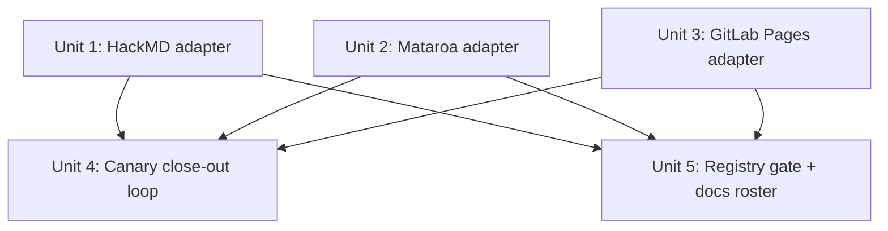

# feat: Add Wave 1 dofollow channels (GitLab Pages, HackMD, Mataroa)

## Overview

Add three new publishing channels surfaced and probed in the 2026-06-01 discovery
run (`docs/discovery/2026-06-01-run.md`): **GitLab Pages**, **HackMD**, and
**Mataroa**. All three offer free public posting with dofollow outbound links
confirmed on third-party posts. HackMD and Mataroa map almost drop-in onto the
existing `devto` token-REST adapter archetype; GitLab Pages reuses the `ghpages`
repository-file-commit archetype with a real wrinkle (GitLab Pages requires a CI
`pages` job — there is no auto-Jekyll).

Each new channel is one `register()` line plus a manifest and adapter, per the
R9 extension recipe — **no `cli/*.py` or `schema.py` edits** (the schema layer
already delegates to `registered_platforms()`; verified in `schema.py:47`).

**Delivered value on merge (be honest):** this plan ships adapter *capability*, not
live backlinks. On merge, HackMD/Mataroa are `"uncertain"` (excluded from the dofollow
cohort until the canary flip), GitLab Pages needs an operator-precreated `pages` CI
job, and all three have zero publish quota. So merge-day production backlinks = **0**
until two follow-ons land (quota wiring + the canary flip). Whether that is an
acceptable definition of done — vs carrying at least one channel all the way to a
live, quota-allocated, canary-confirmed backlink in this effort — is a scope decision
flagged in Open Questions.

## Problem Frame

The operator wants more dofollow backlink channels wired into the publisher
(see origin: `docs/discovery/2026-06-01-run.md`). The discovery run probed 14
candidates → 7 GO / 7 NO-GO. This plan executes **Wave 1 only** — the three
highest-leverage GOs that deliver *real dofollow* (PageRank-passing) at low
adapter cost. Wave 2 (Qiita/Zenn — nofollow + high JP referral) and Wave 3
(Read the Docs, notes.io) are deferred.

The discovery run's honesty note governs: dofollow was confirmed on *other users'*
posts (third-party live check). "Live channel" = registered + publishable + **our**
post dofollow-canary-confirmed — not that our link is indexed and passing equity.
So HackMD/Mataroa ship `dofollow="uncertain"` and graduate to `True` only after an
our-pipeline canary, exactly like the existing `hashnode`/`substack`/`hatena`
discipline.

## Requirements Trace

- R1. Add GitLab Pages as a channel reusing the `ghpages` file-commit archetype;
  ship `dofollow="uncertain"` + `referral_value="high"` (rel is operator-controlled,
  but `*.gitlab.io` indexation is partial + publish is async → our-post canary gates
  the flip to `True`, symmetric with R2/R3). (origin: discovery run, Tier GO-reuse)
- R2. Add HackMD as a token-REST adapter (`POST https://api.hackmd.io/v1/notes`,
  Bearer, `readPermission=guest`); ship `dofollow="uncertain"`, `referral_value="high"`,
  canary-pending. (origin: discovery run, Tier GO-new-light)
- R3. Add Mataroa as a token-REST adapter (`POST https://mataroa.blog/api/posts/`,
  Bearer); ship `dofollow="uncertain"`, `referral_value="high"`, canary-pending.
  (origin: discovery run, Tier GO-new-light)
- R4. Each non-`True` register carries a `_R[...]` rationale ≥80 chars and a
  `referral_value` (gate enforced by `tests/test_adapter_dofollow_gate.py`).
- R5. Token credentials persisted via `safe_write.atomic_write` at `0o600`.
- R6. The `uncertain → seeded canary → verify → amend-to-True` loop is a *tracked*
  closing step with a kill/keep deadline, not fire-and-forget (the
  livejournal/txtfyi close-out pattern; see `docs/plans/2026-05-29-001-feat-livejournal-canary-closeout-plan.md`).
- R7. New channels flow through `plan-backlinks` / `report-anchors` registry-generically
  — no per-platform reporting code.
- R8. No `cli/*.py` / `schema.py` edits (`tests/test_r9_extension_readiness.py`).
- R9. **No credential leakage.** No adapter logs, raises, or embeds in
  `DependencyError`/`ExternalServiceError` messages the raw `PRIVATE-TOKEN`/Bearer
  value or full `Authorization` header; error-body capture (`resp.text[:N]`, inherited
  from devto/ghpages) is scrubbed of header echoes. Each adapter's test asserts the
  token string never appears in captured stderr/exception text on 401/403/422 paths.
- R10. **`0o600` is enforced, not assumed.** R5 covers the *write* path; additionally
  each `load_*_token` (or `available()`) checks the token file mode and warns/refuses
  when group/world-readable (mirrors the CLAUDE.md pre-#140 `0644` hazard). Prefer the
  least-privilege GitLab token (project-scoped/deploy token) over a full `api`-scope
  user PAT where the Repository Files write allows it.

## Scope Boundaries

- **Wave 1 only** — Qiita, Zenn, Read the Docs, notes.io are explicitly deferred.
- **No publish-quota / proportion wiring** — a newly registered channel appears in
  argparse choices and the throttle layer immediately (System-Wide Impact), but has
  **zero allocated publish quota/proportion** until a named follow-on assigns it. So
  it is *registered*, not *idle in code* yet *inactive in production*. "Publishes
  end-to-end" (a manual/dry-run publish works) ≠ "is used in production" (the
  scheduler routes traffic to it).
- **No live-verify endpoints required** — offline-readiness + dry-run is the bar
  for Wave 1; per-adapter `_verify_live()` (HackMD `/me`, Mataroa, GitLab `/user`)
  is an optional follow-on, mirroring the platforms still on `unverifiable_live`.
- **No amend-to-True in this PR for HackMD/Mataroa** — they ship `"uncertain"`;
  the flip happens after a real canary (R6 wires the *mechanism*, not the verdict).
- Does not change the dofollow/referral taxonomy or the value gate.

## Context & Research

### Relevant Code and Patterns

- **Token-REST archetype (HackMD, Mataroa):** `src/backlink_publisher/publishing/adapters/devto_api.py`
  — `_required_headers`, `_load_api_key`, `_build_article_payload`, `available()`,
  `publish()` with `retry_transient_call`, 401/422/non-JSON handling, `mode="draft"`
  sentinel. HackMD/Mataroa use `Authorization: Bearer <token>` (NOT devto's `api-key`).
- **File-commit archetype (GitLab Pages):** `src/backlink_publisher/publishing/adapters/ghpages.py`
  — `_slugify`, `_build_markdown_body` (Jekyll front-matter), `_render_target_path`,
  `_put_contents`, the 422→sha-retry idempotent-overwrite, `_published_url`,
  `retry_transient_call`. GitLab equivalent: Repository Files API
  `POST/PUT /projects/:id/repository/files/:path?branch=` (POST creates, PUT updates).
- **Register + manifest:** `src/backlink_publisher/publishing/adapters/__init__.py`
  (register() calls + `_SETUP_CHECKS` + `verify_adapter_setup` offline branches);
  `src/backlink_publisher/publishing/_manifests.py` (`GHPAGES_MANIFEST`,
  `DEVTO_MANIFEST` as templates — `UiMeta`/`BindDescriptor`/`Policy`).
- **Rationale store:** `src/backlink_publisher/publishing/_nofollow_rationales.py`
  (`_R` dict; ≥80-char entries).
- **Config token loaders:** `src/backlink_publisher/config/tokens.py`
  (`load_ghpages_token:154`, `load_devto_token:188`) + `src/backlink_publisher/config/types.py`
  (`devto_token_path:484`; `Config.ghpages` section for the GitLab config analogue).
- **dofollow terminology (one meaning, three spellings):** `dofollow=<v>` is the
  `register()` argument (`True` / `False` / `"uncertain"`); `dofollow_status(platform)`
  is the runtime query returning that same `v`; "the dofollow cohort" = platforms where
  `dofollow_status(p) is True`. So `dofollow="uncertain"` at register time ⇒
  `dofollow_status(p)=="uncertain"` ⇒ **excluded** from the cohort until flipped to `True`.
- **Canary close-out:** `src/backlink_publisher/cli/canary_targets.py` — cohort is
  `registered_platforms() where dofollow_status(p) is True` (`:200`). `"uncertain"`
  platforms are **not** in the evergreen cohort until flipped.
- **Schema is generic:** `src/backlink_publisher/schema.py:47` — `supported_platforms()`
  delegates to `registered_platforms()`. Confirms R8 (no schema edit).

### Institutional Learnings

- `docs/plans/2026-05-29-001-feat-livejournal-canary-closeout-plan.md` — the
  `uncertain → canary → amend` close-out pattern to mirror for R6.
- `docs/solutions/dofollow-platform-shortlist.md` — **does not exist yet** (verified
  2026-06-01); Unit 5 *creates* it as the dofollow shortlist of record. GitLab Pages
  added on ship; HackMD/Mataroa added when their canary confirms (not before).
- Discovery honesty note: third-party dofollow ≠ our-link equity (origin doc).

### External References

External research skipped — the codebase has ≥3 direct archetype examples
(devto, ghpages, notion, hatena) and the API shapes are documented in the
discovery run's per-candidate evidence. API field names (HackMD `publishLink`,
Mataroa response `url`/`slug`) are confirmed at implementation against a live call.

## Key Technical Decisions

- **GitLab Pages = sibling adapter (`GitLabPagesAPIAdapter`) reusing extracted
  helpers, NOT in-place generalization of `GitHubPagesAPIAdapter`.** Rationale
  (verified against GitLab docs 2026): GitLab's publish semantics genuinely diverge
  on **four** axes, each of which would leak into a shared base —
  1. **Auth header is `PRIVATE-TOKEN: <pat>`**, not `Authorization: Bearer` (PAT
     scope `api`).
  2. **Create vs update is two verbs:** `POST /projects/:id/repository/files/:path`
     creates, `PUT` updates. Duplicate-create → **HTTP 400 + body `"A file with this
     name already exists"`**. Idempotency = `POST → on-400-marker → PUT` (replaces
     GitHub's `PUT→422-sha→GET-sha→PUT`). `:id` and `:file_path` are `%2F`-encoded;
     send `encoding="base64"`.
  3. **No auto-build.** GitLab Pages serves nothing without a CI job **named exactly
     `pages`** that emits a `public/` artifact — no auto-Jekyll even with `_config.yml`.
     v1 posture = **commit pre-rendered static HTML directly under `public/…`**
     (e.g. `public/<slug>/index.html`); committing to `_posts/` is meaningless here.
  4. **Async + per-commit pipeline.** The API write returns the instant the commit
     lands, but the URL goes live only after the `pages` pipeline finishes; every
     default-branch commit fires a pipeline (CI minutes). `published_url` is predicted,
     with a longer settle window than GitHub's build-bot.
  So: lift host-agnostic helpers (`_slugify`, front-matter/body builder, the
  401/403/429 retry split) from `ghpages`, implement `GitLabPagesAPIAdapter` as a
  sibling. (origin R1 said "generalize" — this honors the intent while respecting the
  divergence.)
  - **Re-tier (corrects the discovery framing):** despite the discovery run's
    "GO-reuse / lowest cost / build first" label, GitLab is by these four axes the
    *heaviest* of the three adapters. HackMD and Mataroa are the true drop-ins
    (one auth swap, one body shape). Sequence GitLab **after** them so the cheap path
    is validated first; treat it as its own higher-risk track. The "low adapter cost"
    rating assumed git-push archetype reuse — that assumption does not survive the
    `public/`-tree + CI-job + async-pipeline reality.
- **HackMD/Mataroa ship `dofollow="uncertain"` not `True`.** Third-party check =
  dofollow, but our-pipeline canary is pending — matches `hashnode`/`substack`/`hatena`.
- **GitLab Pages also ships `dofollow="uncertain"` (symmetric canary gate — decided
  2026-06-01).** The `rel` is operator-controlled (dofollow by construction), BUT
  `*.gitlab.io` indexation is only "partial" per the discovery run, the publish is
  async (false-positive canary window), and a shared free subdomain carries
  search-trust risk. So GitLab gets the **same** discipline as HackMD/Mataroa: ship
  `"uncertain"` + rationale + `referral_value="high"`, stay **out** of the evergreen
  cohort, and flip to `True` only after an our-post canary confirms the served page is
  `index,follow` and the link survives. (Rejected: shipping `True` eagerly — it put
  the weakest-indexation channel in the cohort with no proof, asymmetric with the two
  confirmed-dofollow channels held at uncertain.)
- **Bearer auth for both new REST adapters** — centralize in each adapter's
  `_required_headers` (the devto comment warns this is easy to get wrong).
- **Monolith budget watch is `adapters/__init__.py`, not `ghpages.py`** — the
  register() additions + imports grow `__init__.py` (the file with the ceiling in
  `monolith_budget.toml`). If it exceeds, raise the ceiling in this PR with a
  ≥80-char rationale.

## Open Questions

### Resolved During Planning

- GitLab adapter approach: sibling reusing extracted helpers (see Key Decisions).
- **dofollow declarations (revised 2026-06-01): all three ship `dofollow="uncertain"`
  + rationale + `referral_value="high"`** and flip to `True` only after an our-post
  canary — symmetric gate (see Key Decisions). No channel ships pre-confirmed.
- **Definition of done = capability-only (decided 2026-06-01):** this PR ships adapters
  + the enforcement gate; live backlinks come from two named follow-ons (quota wiring +
  the canary flip). The deadline-enforcement test prevents the `"uncertain"` rot.
- Config pattern: per-channel token loader in `config/tokens.py` + `*_token_path`
  in `config/types.py`; GitLab also gets a `[gitlabpages]` config section mirroring
  `[ghpages]` **across 6 config files** (see Unit 3).
- No schema/CLI edits needed (schema delegates to the registry).

### Deferred to Implementation

- Exact response field names: HackMD note `publishLink` vs `id`→URL composition;
  Mataroa response `url`/`slug` shape — confirm against a live/mocked call.
- GitLab Pages **unique-domain** case: when enabled (opt-in), the URL is
  `<flattened-project>-<6char-id>.gitlab.io` and the 6-char id is not derivable
  offline — hence the `pages_base_url` config override. Confirm whether to read it
  from the GitLab Pages settings API instead, or require the operator to set it.
- Whether the adapter should **auto-seed a minimal `pages` `.gitlab-ci.yml`** on
  first publish when absent, or hard-require the operator to pre-create it (v1 leans
  require-and-document; auto-seed is a convenience follow-on).
- Whether to extract ghpages helpers into a new `_file_commit_common.py` or import
  them directly from `ghpages` (decide when touching the code — keep it minimal).
- Settings UI: token-paste channels currently let operators edit JSON directly
  (like ghpages today); whether to add a per-channel settings card template is a
  minor follow-on, not a Wave 1 blocker.

## High-Level Technical Design

> *This illustrates the intended approach and is directional guidance for review,
> not implementation specification. The implementing agent should treat it as
> context, not code to reproduce.*

Per-channel touchpoints (same five seams for every channel; "—" = not needed):

| Seam | HackMD | Mataroa | GitLab Pages |
|---|---|---|---|
| Adapter file | new `hackmd_api.py` (devto clone) | new `mataroa_api.py` (devto clone) | new `gitlabpages.py` (ghpages sibling) |
| Config | `load_hackmd_token` + `hackmd_token_path` | `load_mataroa_token` + `mataroa_token_path` | `[gitlabpages]` section + token loader/path |
| `register()` | `dofollow="uncertain"` + rationale + `referral_value="high"` | same | **same** (`dofollow="uncertain"` + rationale + `referral_value="high"`) |
| Manifest | `HACKMD_MANIFEST` (token-paste) | `MATAROA_MANIFEST` (token-paste) | `GITLABPAGES_MANIFEST` (token-paste) |
| verify/setup | `_SETUP_CHECKS["hackmd"]` | `_SETUP_CHECKS["mataroa"]` | `_SETUP_CHECKS["gitlabpages"]` |
| Canary | `"uncertain"` → R6 amend loop | `"uncertain"` → R6 amend loop | **`"uncertain"` → R6 amend loop** (out of cohort until our-post canary flips it) |

## Implementation Units

- [ ] **Unit 1: HackMD adapter (token-REST, devto clone)**

**Goal:** Publish to HackMD via `POST https://api.hackmd.io/v1/notes` (Bearer,
`readPermission=guest`); register as `dofollow="uncertain"`, `referral_value="high"`.

**Requirements:** R2, R4, R5, R7, R8

**Dependencies:** None

**Files:**
- Create: `src/backlink_publisher/publishing/adapters/hackmd_api.py`
- Modify: `src/backlink_publisher/publishing/adapters/__init__.py` (import + register + `_SETUP_CHECKS`)
- Modify: `src/backlink_publisher/publishing/_manifests.py` (`HACKMD_MANIFEST`)
- Modify: `src/backlink_publisher/publishing/_nofollow_rationales.py` (`_R["hackmd"]` ≥80 chars)
- Modify: `src/backlink_publisher/config/tokens.py` (`load_hackmd_token`), `src/backlink_publisher/config/types.py` (`hackmd_token_path`)
- Test: `tests/test_hackmd_adapter.py`

**Approach:**
- Clone `devto_api.py`; swap auth to `Authorization: Bearer <token>`; body
  `{content: <markdown>, readPermission: "guest", writePermission: "owner"}`.
- Published URL from the note's `publishLink` (fallback: compose from returned id).
- `available()` = token file exists with non-empty token. Token JSON `{"token": "..."}`.
- `mode="draft"` → sentinel `AdapterResult(status="drafted")`, no API call.

**Patterns to follow:** `devto_api.py` (structure), `ghpages.py:_load_token` (loud
DependencyError at entry), `_SETUP_CHECKS["devto"]` / `["notion"]` (offline check).

**Test scenarios:**
- Happy path: valid token + payload → POST 201 with `publishLink` → `AdapterResult(status="published", published_url=<link>)`.
- Happy path: published URL fallback when `publishLink` absent but id present.
- Edge case: `mode="draft"` → drafted sentinel, **no** HTTP call (assert via mocked transport not called).
- Error path: missing/empty token → `DependencyError` at entry (no HTTP call).
- Error path: 401 → `ExternalServiceError` (token rejected message).
- Error path: 422 validation → `ExternalServiceError` surfacing the API error body.
- Error path: non-JSON 200 → `ExternalServiceError`.
- Edge case: 429 retried via `retry_transient_call`; 500 not silently swallowed.
- Integration: `register("hackmd", ...)` makes `dofollow_status("hackmd")=="uncertain"`, `referral_value("hackmd")=="high"`, `dofollow_rationale("hackmd")` ≥80 chars.

**Verification:** `pytest tests/test_hackmd_adapter.py` green; `hackmd` appears in
`registered_platforms()`; offline `verify_adapter_setup("hackmd", ...)` raises a
clear DependencyError when unbound and passes when the token file exists.

- [ ] **Unit 2: Mataroa adapter (token-REST, devto clone)**

**Goal:** Publish to Mataroa via `POST https://mataroa.blog/api/posts/` (Bearer);
register `dofollow="uncertain"`, `referral_value="high"`.

**Requirements:** R3, R4, R5, R7, R8

**Dependencies:** None (parallel with Unit 1)

**Files:**
- Create: `src/backlink_publisher/publishing/adapters/mataroa_api.py`
- Modify: `__init__.py` (import + register + `_SETUP_CHECKS`)
- Modify: `_manifests.py` (`MATAROA_MANIFEST`)
- Modify: `_nofollow_rationales.py` (`_R["mataroa"]` ≥80 chars)
- Modify: `config/tokens.py` (`load_mataroa_token`), `config/types.py` (`mataroa_token_path`)
- Test: `tests/test_mataroa_adapter.py`

**Approach:**
- Same devto-clone shape as Unit 1; body `{title, body: <markdown>}`.
- Published URL from the response `url` field (fallback: compose from `slug`).
- Token JSON `{"token": "..."}` (Mataroa "API key" in account settings).

**Patterns to follow:** Unit 1 (HackMD) once landed; `devto_api.py`.

**Test scenarios:**
- Happy path: POST 200 returns `{ok:true, url, slug}` → `published_url=<url>`.
- Happy path: published URL composed from `slug` when `url` absent.
- Edge case: `mode="draft"` → drafted sentinel, no HTTP call.
- Error path: missing token → `DependencyError`; 401 → `ExternalServiceError`.
- Error path: `{ok:false}` / 4xx body → `ExternalServiceError` with message.
- Error path: non-JSON → `ExternalServiceError`.
- Integration: registry reflects `dofollow="uncertain"`, `referral_value="high"`, rationale ≥80.

**Verification:** `pytest tests/test_mataroa_adapter.py` green; `mataroa` in
`registered_platforms()`; offline verify behaves like Unit 1.

- [ ] **Unit 3: GitLab Pages adapter (ghpages sibling, Repository Files API)**

**Goal:** Commit a post file to a GitLab Pages-enabled project via
`POST/PUT /projects/:id/repository/files/:path` (`PRIVATE-TOKEN` PAT); register
`dofollow="uncertain"` + rationale + `referral_value="high"` (symmetric canary gate —
flip to `True` after an our-post `index,follow` canary). Document the `pages` CI precondition.

**Requirements:** R1, R4, R5, R7, R8, R9, R10

**Dependencies:** None (parallel with Units 1–2)

**Files:**
- Create: `src/backlink_publisher/publishing/adapters/gitlabpages.py` (`GitLabPagesAPIAdapter`)
- Optional create: `src/backlink_publisher/publishing/adapters/_file_commit_common.py`
  (only if extracting `_slugify`/front-matter helpers is cleaner than importing from `ghpages`)
- Modify: `__init__.py` (import + register + `_SETUP_CHECKS`)
- Modify: `_manifests.py` (`GITLABPAGES_MANIFEST`), `_nofollow_rationales.py` (`_R["gitlabpages"]` ≥80 chars — rel is operator-controlled but indexation/async pending)
- Modify (the `[gitlabpages]` section is wired across **6 config files**, like
  `[ghpages]` — not 2; an implementer who edits only tokens.py + types.py ships a
  section that never parses and never round-trips):
  - `config/types.py` — `GitlabPagesConfig` dataclass + `gitlabpages: GitlabPagesConfig | None`
    field on `Config` + `gitlabpages_token_path` property. Fields: project id/path
    (`%2F`-encoded), branch, `public/` target-path template, optional `pages_base_url`
    override (unique-domain case).
  - `config/tokens.py` — `load_gitlabpages_token`.
  - `config/loader.py` — parse the `gitlabpages` TOML table into `GitlabPagesConfig`
    (mirror the ghpages branch ~loader.py:338).
  - `config/writer.py` — `_emit_gitlabpages_section` + a `gitlabpages_config=` `save_config` param.
  - `config/_toml_utils.py` — add `"gitlabpages"` to `_SAVE_CONFIG_KNOWN_ROOTS`.
- Test: `tests/test_gitlabpages_adapter.py`; extend `tests/test_save_config_section_taxonomy_canary.py` (the witness that fires if section taxonomy regresses)
- Docs: `config.example.toml` (`[gitlabpages]` example + the minimal static `pages` `.gitlab-ci.yml` job in a comment)

**Approach (verified against GitLab Repository Files API + Pages docs, 2026):**
- Auth: `PRIVATE-TOKEN: <pat>` header (PAT scope `api`) — **not** Bearer.
- Target path: commit pre-rendered **static HTML into `public/<slug>/index.html`**
  (v1 static-HTML posture) — reuse ghpages's `_slugify` + body builder, but the file
  lands under `public/`, not `_posts/`.
- Write: `create_or_update` = `POST /projects/:id/repository/files/:file_path?branch=`
  with `encoding="base64"`, `content`, `commit_message`; on **400 + `"A file with
  this name already exists"`** re-issue as `PUT` (mirror ghpages's `_ShaRequired`
  sentinel but key off the 400 message). Treat a no-op-commit 400 (byte-identical
  re-publish) as success/skip, not error.
- `available()` = `[gitlabpages]` config present (project ref) + token file exists;
  its DependencyError message must name the **`pages` CI-job precondition** loudly.
- Published URL: three-case computation — (a) project named `<namespace>.gitlab.io`
  → root; (b) `pages_base_url` override set (unique-domain — the 6-char id is not
  derivable offline) → use it; (c) default → `https://<namespace>.gitlab.io/<project>/<in-public path>`.
- Retry split: 401 = auth-fixable, 403 = scope/forbidden, 429 = rate-limit-retry
  (do not conflate — same discipline as ghpages).
- **Precondition (document loudly):** the target project must already contain a `pages`
  CI job emitting `public/`; the adapter does not create `.gitlab-ci.yml` (whether it
  should auto-seed one is a Deferred question). Publish is async — `published_url` is
  predicted, live only after the pipeline runs.

**Execution note:** Start with a failing publish test against a mocked Repository
Files API exercising the POST-create → 400-marker → PUT-update path before wiring
the real call.

**Patterns to follow:** `ghpages.py` (publish skeleton, draft skip, `_load_token`
loud-fail, retry split), `Config.ghpages` for the config analogue.

**Test scenarios:**
- Happy path: new file → POST 201 → `AdapterResult(status="published", published_url=<pages-url under public/>)`.
- Edge case: existing file → POST 400 `"A file with this name already exists"` → PUT update → published.
- Edge case: byte-identical re-publish → no-op-commit 400 → treated as success/skip (not raised).
- Edge case: `mode="draft"` → drafted sentinel, no commit.
- Error path: missing `[gitlabpages]` config or token → `DependencyError` naming the `pages` CI precondition.
- Error path: 401 → `ExternalServiceError` (PAT rejected); 403 → scope/forbidden message (not auth-expired).
- Edge case: 429 retried via `retry_transient_call`.
- Edge case: published-URL computed for all three cases — namespace-root project, `pages_base_url` override, default `<namespace>.gitlab.io/<project>`.
- Integration: `dofollow_status("gitlabpages") == "uncertain"`, `referral_value("gitlabpages") == "high"`, `dofollow_rationale("gitlabpages")` ≥80 chars; `gitlabpages` in `registered_platforms()` and **absent** from the dofollow cohort until flipped.

**Verification:** `pytest tests/test_gitlabpages_adapter.py` green; offline verify
raises a clear DependencyError naming the config + token + `pages` CI-job precondition.

- [ ] **Unit 4: Canary close-out loop wiring (uncertain → True)**

**Goal:** Make the `uncertain → seeded canary → verify → amend-to-True` loop a
*tracked, enforced* closing step for **all three** channels (HackMD, Mataroa, GitLab
Pages — all ship `"uncertain"` per the symmetric-gate decision). GitLab's canary
additionally checks the `*.gitlab.io` page is `index,follow` (not noindex'd as a
low-trust subdomain) before its flip.

**Requirements:** R6

**Dependencies:** Units 1–3

**Files:**
- Modify: `config.example.toml` (`[canary.gitlabpages]`, and documented `[canary.hackmd]`/`[canary.mataroa]` once flipped)
- Create: `docs/discovery/canary-pending.md` (tracking artifact: per-channel canary
  status + kill/keep deadline — N publish cycles or a date)
- Test: `tests/test_cli_canary_targets.py` (extend) or `tests/test_canary_advisory_gate.py`

**Approach:**
- No new canary *application code* — `canary_targets.py` auto-includes a platform once
  `dofollow_status` is `True`. The deliverables are: (a) a `[canary.gitlabpages]` config
  entry; (b) the documented amend procedure (publish our post →
  `verify_link_attributes`/`inspect_target_anchor` confirms dofollow → flip
  `register()` from `"uncertain"` to `True`, drop rationale + `referral_value`); and
  (c) the tracking artifact + **an enforcement gate**.
- **Enforcement gate (closes the P0 rot risk).** A markdown deadline that nothing
  reads is fire-and-forget — the codebase already has 8+ platforms stuck in
  `"uncertain"` (two reached retirement still uncertain). So add a **test that reads
  `docs/discovery/canary-pending.md` per-channel deadlines and FAILS once a deadline
  passes while the platform is still `dofollow="uncertain"`**. That converts "tracked"
  from aspiration to a machine-enforced kill/keep.
- **Honest precedent note.** The livejournal close-out plan
  (`2026-05-29-001`) flipped verdict→registry **atomically in one PR** specifically to
  avoid "a window where the verdict is known but the registry still shows uncertain."
  This plan deliberately *defers* the flip (ship `"uncertain"`, flip later) — the
  opposite posture. That is acceptable **only** with the enforcement gate above; the
  whole-loop-in-this-PR alternative is a live scope decision (see Open Questions).
- GitLab Pages now follows the **same** path (ships `"uncertain"`, out of the cohort
  until its our-post canary confirms `index,follow` + surviving dofollow on `*.gitlab.io`).
  No channel ships pre-confirmed; the enforcement gate covers all three uniformly.

**Patterns to follow:** `docs/plans/2026-05-29-001-feat-livejournal-canary-closeout-plan.md`
(atomic-closure precedent); `canary_targets.py` cohort selection (`:200`).

**Test scenarios:**
- Integration: a platform flipped `"uncertain"`→`True` (simulated fixture) appears in
  the `canary-targets` dofollow cohort; `"uncertain"` does not.
- Edge case: `[canary.gitlabpages]` configured → `canary-targets --platform gitlabpages`
  classifies `not-configured` vs `link-alive`/`advisory` correctly (exit 0).
- Error path (enforcement gate): a `canary-pending.md` entry whose deadline has passed
  while the platform is still `"uncertain"` → the deadline test FAILS; a not-yet-due or
  already-flipped entry → passes.
- Invariant: after flip to `True`, the dofollow-gate test no longer requires a
  rationale/referral_value for that platform.

**Verification:** `canary-targets --platform gitlabpages` runs advisory (exit 0); the
deadline-enforcement test is green for in-window entries and red for overdue-still-uncertain
ones; docs describe the flip.

- [ ] **Unit 5: Registry gate, extension-readiness, and docs roster**

**Goal:** Prove the three additions satisfy the dofollow gate + R9 no-edit guarantee,
and update the roster/shortlist docs.

**Requirements:** R4, R7, R8

**Dependencies:** Units 1–3

**Files:**
- Verify (no edit expected): `tests/test_adapter_dofollow_gate.py`, `tests/test_registry_referral_value.py`, `tests/test_r9_extension_readiness.py`
- Create: `docs/solutions/dofollow-platform-shortlist.md` (new file — add GitLab Pages
  now; note HackMD/Mataroa as canary-pending). Do **not** cite it as pre-existing.
- Modify: `AGENTS.md` roster count / channel list (verify current count first — the
  live registry reports **18** registered platforms as of 2026-06-01; → 21 after this PR)
- Modify (**expected, not conditional**): `monolith_budget.toml` — `adapters/__init__.py`
  is at SLOC 584 against a 600 ceiling; +3 register blocks/imports/`_SETUP_CHECKS`
  (~25–35 SLOC) breaches it. Raise the ceiling in this PR with a ≥80-char rationale.
- Test: extend `tests/test_r9_extension_readiness.py` coverage only if a gap is found
  (the existing fake-platform test already proves the generic path)

**Approach:**
- Run the gate suite; confirm all three declare valid dofollow + (for the two
  uncertain) rationale ≥80 + referral_value.
- Confirm `plan-backlinks`/`report-anchors` pick up the new platforms with zero
  per-platform code (registry-generic) — a spot check, not new code.
- Update docs; bump the roster count.

**Test scenarios:**
- Integration: `test_adapter_dofollow_gate` passes for `hackmd`, `mataroa`, `gitlabpages`.
- Integration: `test_r9_extension_readiness` still green (no cli/schema edits crept in).
- Test expectation: docs/roster changes are non-behavioral — covered by the gate tests above.

**Verification:** Full `pytest tests/` green; `git diff --stat` shows **no** changes
under `cli/` or `schema.py`; roster + shortlist reflect the three channels.

## System-Wide Impact

- **Interaction graph:** `register()` additions flow automatically into argparse
  `choices`, `schema.validate_publish_payload`, throttle gating, the tier matrix,
  `plan-backlinks` enrichment, and `report-anchors` bucketing — all read the registry
  dynamically. No call-site edits.
- **Error propagation:** adapters raise `DependencyError` (falls through the chain) vs
  `ExternalServiceError` (propagates) per the registry contract — mirror devto/ghpages exactly.
- **State lifecycle risks:** token files written via `safe_write.atomic_write` at
  `0o600` (R5); GitLab create-vs-update must be idempotent (overwrite, not duplicate).
- **API surface parity:** WebUI settings render channels from the manifest
  (`UiMeta`/`BindDescriptor`); token-paste channels are operator-JSON-editable today
  like ghpages — a settings card is an optional follow-on, not a Wave 1 blocker.
- **Integration coverage:** the canary cohort gate (`dofollow_status is True`) means
  **all three** new channels are *intentionally* outside the evergreen canary until
  their our-post canary flips them to `True` — Unit 4 makes that flip a tracked,
  deadline-enforced step.
- **Unchanged invariants:** the dofollow/referral taxonomy, the value gate, and the
  exit-code contract are untouched. `ghpages.py`'s GitHub-specific logic stays intact
  (GitLab is a sibling, not a refactor of ghpages).

## Risks & Dependencies

| Risk | Mitigation |
|------|------------|
| GitLab Pages needs a pre-existing `pages` CI job → silent "published but not served" | Document the precondition loudly in `available()`/setup docs; ship the minimal static `pages` `.gitlab-ci.yml`; commit into `public/`; `published_url` is predicted (async — live only after the pipeline runs). |
| GitLab no-op re-publish (byte-identical) returns 400 like a real failure | Treat the no-op-commit 400 as success/skip, distinct from the "already exists" 400 (which routes to PUT) and other 400s (raise). |
| GitLab per-commit pipeline burns CI minutes at publish scale | Acknowledged; single-file Files-API write per post is v1. Multi-file single-commit via the Commits API is a future batching optimization, not Wave 1. |
| Mataroa later tightens nofollow/noindex policy | Unit 4 canary close-out + kill/keep deadline catches drift; ships `"uncertain"` so no false dofollow claim. |
| Claiming dofollow on third-party evidence only | Ship `"uncertain"`; flip to `True` only after our-pipeline canary (R6). |
| GitLab create-vs-update duplicates a post | Idempotent overwrite test (POST→400→PUT); mirror ghpages's single-retry discipline. |
| `adapters/__init__.py` exceeds its monolith ceiling | Raise ceiling in the same PR with ≥80-char rationale (project discipline). |
| HackMD/Mataroa API field names differ from assumed | Deferred-to-implementation; confirm against a live/mocked call before finalizing published-URL. |
| Credential leakage via logs / error bodies (inherited `resp.text[:N]` capture) | R9: scrub header echoes; per-adapter test asserts no token in stderr/exception on 401/403/422. |
| GitLab `api`-scope PAT is over-broad (repo write, not just Pages) → large blast radius if leaked | R10: prefer a project-scoped/deploy token; document rotation/revocation in the runbook. |
| Operator-hand-created token files land `0644` (world-readable secrets) | R10: `load_*_token`/`available()` checks file mode and warns/refuses on group/world-readable. |
| `published_url` echoed from external API → SSRF if re-fetched unvalidated | Validate echoed URL (https + allowlisted channel host) before persist/refetch; route canary re-fetch through the SSRF-guarded preflight opener, not raw `http.get`. |

## Documentation / Operational Notes

- Update `config.example.toml` with `[gitlabpages]` + `[canary.gitlabpages]` and
  token-file shapes for all three.
- Update `docs/solutions/dofollow-platform-shortlist.md` and the `AGENTS.md` roster.
- Operator runbook: bind each channel (token JSON `0o600`), publish a canary post,
  confirm dofollow, then flip HackMD/Mataroa to `True`.

## Sources & References

- **Origin document:** [docs/discovery/2026-06-01-run.md](docs/discovery/2026-06-01-run.md)
- Dedup ledger: `docs/notes/retired-platforms/2026-06-01-discovery-batch.md`
- Architecture brainstorm: `docs/brainstorms/2026-06-01-channel-discovery-funnel-requirements.md`
- Archetypes: `publishing/adapters/devto_api.py`, `publishing/adapters/ghpages.py`
- Canary pattern: `docs/plans/2026-05-29-001-feat-livejournal-canary-closeout-plan.md`
- Gate tests: `tests/test_adapter_dofollow_gate.py`, `tests/test_r9_extension_readiness.py`
