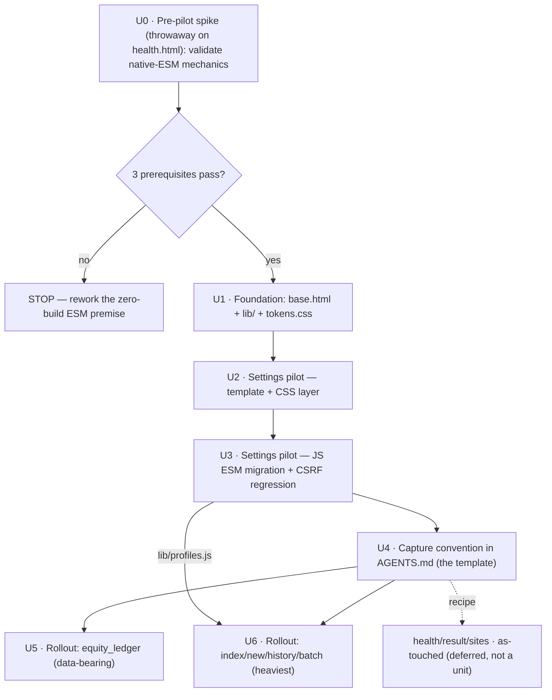

# refactor: WebUI Frontend Maintainability — Foundation + Settings Pilot + Rollout

## Overview

`webui_app/` is a live single-operator console: Flask + Jinja2 server-render, hand-written
vanilla JS, Bootstrap 5.3 via CDN, **zero build**. As features grew, the frontend rotted in four
ways: (1) JS monolith + global leakage — `settings_main.js` (509 lines) and `index_main.js` are
bare top-level scripts whose functions auto-attach to `window`, which is the *only* reason ~37 inline
`on*` handlers and 4 inline `<script>` blocks work; (2) no base layout — 6 page templates each
re-declare `<html><head>` + Bootstrap CDN links; (3) ~15 copy-pasted `_settings_*` partials;
(4) two CSS files hardcoding the same colors/spacing with no single source.

This plan establishes a **foundation** (Jinja `base.html` + native ES-module `lib/` layer + CSS
custom-property token source), proves it end-to-end on the **settings page pilot** (the heaviest,
four-layer page), captures the resulting pattern as an **AGENTS.md recipe**, then **rolls it out page
by page** — each page independently shippable, no big bang. The hard constraint is preserved
throughout: **no Node/bundler/transpiler, no JS framework, deployment stays "double-click → run"**.

The real work is **not** counting lines — it is migrating the inline `on*`/inline-`<script>` handlers
(which depend on global function leakage) into module-scoped `addEventListener`, because under ES
module scope those handlers would otherwise `ReferenceError`. That migration, plus internalizing
cross-script `window.__*` calls (e.g. `window.__rewireBulkSelect`), is the load-bearing change.

## Problem Frame

The console is actively used; correctness and zero-regression matter more than elegance. The
maintainability tax shows up every time a feature is added: a change to one global function can
silently break an unrelated inline handler, there is no module boundary to reason within, and adding
a page means copy-pasting an entire existing page's `<head>` and scripts. The operator chose the
lowest-long-term-cost fix that keeps the no-build deployment: browser-native ES modules + a shared
lib layer + design tokens + written conventions. (See origin:
`docs/brainstorms/2026-06-01-webui-frontend-maintainability-refactor-requirements.md`.)

This plan is **gate-exempt** under the 2026-06-01 optimization-backlog consolidation's R16 rule
(refactors are explicitly not subject to the falsification-gate gate): it builds no new "machine",
so it needs no Phase-0 GO verdict to proceed. (Note: the consolidation's "Phase 0 gates" are an
*orthogonal* framework — this plan's own **Phase 1/2/3 delivery** structure below, Foundation →
Convention → Rollout, is unrelated to those gates and is not held to them.)

## Requirements Trace

- **R1.** Shared JS lib layer (`static/js/lib/`) holding the currently-globalized/duplicated cross-page
  primitives: guarded fetch (`fetchJson`), DOM/event helpers, CSRF-token read, escaping (`esc`), **and the
  7 profile/editor functions duplicated verbatim across `settings_main.js` and `index_main.js`**
  (`toggleEditor`, `markDirty`, `saveEdit`, `cancelEdit`, `loadProfile`, `loadBatchProfile`,
  `saveProfilePrompt`) → `lib/profiles.js`. Page scripts consume via native ESM `import` — no more
  cross-script calls through `window`.
- **R2.** Extract the *genuinely* shared primitives of `bind_channel.js` and `channel-binding.js`
  (CSRF-meta read, `fetchJson` wrapper, badge render) into lib; **keep the two flows separate** by
  default (async poll vs sync verify-with-delegation) — do not force-merge into one bind+poll module.
- **R3.** Introduce a base Jinja layout (`base.html`) owning `<html><head>`, Bootstrap/Icons CDN, CSRF
  meta, and module bootstrap; existing pages `` it, no longer repeating `<head>`.
- **R4.** Introduce CSS custom properties (palette/spacing/elevation tokens) as a single source consumed
  by `index.css` and `settings.css`; split oversized CSS by concern.
- **R5.** Refactor the settings page end-to-end across all four layers as the **reference template**:
  split `settings_main.js` (509 lines) into ESM modules importing from `lib/`; `settings.html`
  `` base; parameterize copy-pasted `_settings_*` partials with Jinja macros;
  `settings.css` consumes shared tokens.
- **R6.** Pilot must **100% preserve** settings behavior (channel binding, LLM integration, scheduling,
  keywords, diagnostics) — **zero regression** — and **explicitly preserve the bind-flow security
  controls**: `_check_csrf_or_abort` (accepts form field `csrf_token` **or** `X-CSRFToken` header,
  either), `_check_bind_origin_or_abort`, `_refuse_when_allow_network`, missing/bad token → 403.
  Verification = (a) enumerate + update the existing template-structure pytest; (b) one CSRF 403
  regression assertion (state-changing POST returns 403 when both transports missing/invalid, holds
  before and after); (c) manual interaction walkthrough.
- **R7.** Pilot yields a documentable, copyable pattern (the "template").
- **R8.** After the pilot is verified, replicate the pattern to the pages with a **real pain point** —
  the index family (`index/new/history/batch`: 509-line monolith, global leakage, the duplicated profile
  functions) and `equity_ledger` (data-island inline script). The genuinely-trivial head-only pages
  (`health`, `result`, `sites`) are migrated **opportunistically as each is next touched**, following the
  AGENTS.md recipe — not in a dedicated migration pass. **Each page independently shippable, no big bang.**
  (Scope decision 2026-06-01: foundation+pilot+recipe satisfies the maintainability goal; trivial pages
  buy only de-duplicated `<head>` and are deferred to avoid net-new test surface for no churn relief.)
- **R9.** Write the target structure, module/file naming conventions, and the "how to add a page /
  channel card" recipe into `AGENTS.md` to prevent re-rot.

### Requirements → Units matrix

| Req | Content | Satisfied by |
|---|---|---|
| R1 | Shared JS lib layer (incl. `lib/profiles.js`) | U1 (create lib + `profiles.js` shell), U3 (settings consume + populate profiles), U6 (index consume) |
| R2 | Extract bind/verify primitives (keep flows separate) | U1 (lib), U3 (migrate) |
| R3 | Base Jinja layout | U1 (create), U2/U5/U6 (adopt); trivial pages as-touched |
| R4 | CSS tokens | U1 (tokens.css), U2/U5/U6 (consume) |
| R5 | Settings end-to-end pilot | U2 (template+CSS), U3 (JS) |
| R6 | Preserve behavior + security | U3 (assertions + CSRF regression) |
| R7 | Documentable pattern | U4 |
| R8 | Rollout high-value pages (equity_ledger, index family); trivial pages as-touched | U5 (equity_ledger), U6 (index family); health/result/sites opportunistic |
| R9 | AGENTS.md recipe | U4 |

## Scope Boundaries

- **No** Node/npm/bundler/transpiler — browser-native ES modules only.
- **No** JS framework (React/Vue/Alpine/htmx); Bootstrap 5.3 stays via CDN.
- **No** change to Flask routes / Python API contracts / the server-render model.
- **No** JS test framework this round (JS interaction verified manually). But the **existing pytest
  template-structure assertions are in scope** — this change *breaks* them and they must be updated in
  the same change (R6). A JS test framework is a separate later follow-up.
- **Not** a visual redesign — appearance stays unchanged ("look & feel" is not the driver). This plan
  also explicitly does **not** adjudicate the conflicting sister doc
  `2026-06-01-webui-operator-console-modernization` (HTMX/Alpine + dark redesign); that visual/
  interaction layer is deliberately out and would stack *on top* of this foundation later.
- **No** CDN → self-hosted Bootstrap migration (that is a performance/stability driver, not selected).
- **No** behavioral change to any route handler, store, or adapter — this is a template/static-asset
  refactor only.

## Context & Research

### Relevant Code and Patterns

**Templates (server-render surface):**
- `webui_app/templates/settings.html` — pilot page; head at lines 1–11 duplicates DOCTYPE/`<head>`/
  Bootstrap CDN/`<meta name="csrf-token">`/`settings.css`; bootstrap at L357
  (`window.__settingsBootstrap`); script tags L358–362 (`fetch_json.js`, `settings_main.js`,
  `bind_channel.js` defer, `channel-binding.js` defer). **Pilot target.**
- 6 page templates own a full `<head>`: `settings.html`, `index.html`, `equity_ledger.html`,
  `health.html`, `sites.html`, `result.html`. **All migrate to `` (R3/R8).**
- ~15 `_settings_*` partials + `_channel_card_macro.html`, `_tab_new/history/batch.html`,
  `_shared_config_selects.html`. The binding partials (`_settings_binding_token`, `_..._token_fields`,
  `_..._userpass`, `_..._paste_blob`, `_..._anon`, `_settings_channel_*`) repeat the
  `<input type="hidden" name="csrf_token" value="{{ csrf_token or '' }}">` idiom and card scaffolding —
  **Jinja-macro parameterization target (R5).**
- Inline-handler hotspots (the real work), **attributed by owning unit** and **re-derive
  mechanically before starting** (`grep -rE 'on(click|change|input|submit|keyup|keydown|blur|focus)='`
  — the counts below are a floor, not exhaustive):
  - **Settings pilot (U3):** `_settings_llm_integration.html` (10 `on*`), `_settings_channel_blogger.html`
    (7), `_settings_channel_medium.html` (2), `_settings_diagnostics.html` (`previewGeneration()`),
    `_settings_banner.html` (`testImageGenConnection()`), `_settings_channel_token_paste.html` +
    `settings.html:312` (`onclick="return confirm(...)"`), inline `<script>` in
    `_settings_channel_velog.html` (**`runVelogLogin` — defined HERE, not in `settings_main.js`**).
  - **Index rollout (U6):** `_tab_new.html` (**7**, incl. a server-interpolated `onclick="… += '{{ anchor }},'"`),
    `_tab_history.html` (8 — **all `onclick/onsubmit="return confirm(...)"` submit/delete guards**),
    `_tab_batch.html` (1), inline `<script>` in `index.html`.
  - **Static rollout (U5):** inline `<script>` in `equity_ledger.html`.
- **Two distinct inline-handler classes** (the uniform "`on*` → `data-action` + `addEventListener`" recipe
  is not one-size-fits-all): (a) **global-function-leak** handlers (call `settings_main.js`/`index_main.js`
  functions — these `ReferenceError`/silent-fail under ESM, the load-bearing migration); (b)
  **`return confirm(...)` submit/click guards** (call the browser built-in — they will NOT `ReferenceError`,
  but their inline `return false` **cancels native form submission**; converting to `addEventListener`
  requires `(e) => { if (!confirm(msg)) e.preventDefault(); }`, or the guarded delete/publish fires
  unconditionally). Count and migrate the two classes separately.

**JS (the global-leak surface):**
- `static/js/settings_main.js` (509 lines, bare top-level) and `static/js/index_main.js` — functions
  leak to `window`; `index_main.js` defines + calls `window.__rewireBulkSelect` (L199/L269) — a
  **cross-script `window` call that must be internalized** under ESM.
- `static/js/fetch_json.js` — the `fetchJson` guarded-fetch + CSRF read primitive (loaded first on both
  pages). **Promote into `lib/api.js` (R1).**
- `static/js/bind_channel.js` — settings `.bind-channel-btn`: **async** (POST → job_id → exponential
  backoff poll + `sessionStorage` card memory).
- `static/js/channel-binding.js` — dashboard card macro: **sync** verify (`/api/<channel>/verify` +
  `AbortController` + debounce) that **delegates the bind action back via `bindBtn.click()`**. The two
  share *only* the CSRF-meta read + fetch wrapper (R2 — keep separate, share primitives).
- IIFE-wrapped already (lower risk): `mode_toggle.js`, `url_derive.js`, `channel-binding.js`,
  `fetch_json.js`.

**Bootstrap-data + CSRF mechanism:**
- `window.__settingsBootstrap` (settings.html L357) / `window.__indexBootstrap` (index.html L128) +
  `window.__batchTabHint` (index L145) — server → client data, read once at script top
  (`settings_main.js` L194/L247; `index_main.js` L6/L48/L163). **Single documented bootstrap-in seam.**
- `<meta name="csrf-token" content="{{ csrf_token }}">` present in index/equity_ledger/health/settings
  heads; partials also emit hidden form `csrf_token`. Server `_check_csrf_or_abort` accepts **either**
  transport — lib helper must keep "either" (R6, do not narrow).

**Existing pytest that this change breaks / must coordinate with (load-bearing for test scenarios):**
- `tests/test_webui_settings_template_split.py`: `test_settings_main_js_served` (asserts
  `/static/js/settings_main.js` 200 — **breaks when `settings_main.js` is deleted in U3 and replaced by
  `settings.js`; update the path**); `test_settings_bootstrap_var_present` (asserts
  `window.__settingsBootstrap` with `plans_list`/`profiles` — **keep the var to stay green**);
  `test_settings_page_links_to_css` (`css/settings.css` in body — keep via base/page);
  `test_settings_page_has_no_inline_style`; `test_settings_no_jinja_interpolation_in_page` (**must NOT
  reintroduce inline Jinja `_plansData`/`_PROFILES` during macro extraction — stays green**);
  `test_settings_html_final_size` (settings.html ≤400 lines — shrinks further after `extends`);
  section-present tests (LLM/diagnostics/banner — must still render after macro-parameterization).
  **Caveat (the template-split suite runs with `CSRF_ENABLED=False`):** these render tests do **not**
  exercise the CSRF-403 path, so they cannot catch a macro that emits an empty `csrf_token` — that needs
  a separate CSRF-enabled assertion (see Unit 2 / the macro-CSRF risk).
- `tests/test_settings_dashboard_rendering.py`: `test_javascript_loaded` (asserts
  `/static/js/channel-binding.js` in body — **update to the new module path**);
  `test_csrf_meta_present` (asserts `<meta name="csrf-token">` — **base.html must emit it**); card/
  verify/bind/tier server-render tests (must remain after `extends`).
- `tests/test_webui_index_template_structure.py`: partial-include, tab-pane, flash, Korean-option,
  XSS-escape tests (must remain after index `extends base`).

### Institutional Learnings

- `docs/solutions/` has no frontend-ESM-specific learning (this is the first such refactor). The
  transferable disciplines: **negative-assertion-locks-in-bug** (`test-failures/...2026-05-15`) — every
  "X removed" assertion needs a positive complement ("the behavior still works"); and the project's
  CSRF guard hardening (`webui_app/__init__.py` `_global_csrf_guard`, PR #143) is the server-side
  enforcement this refactor must not weaken on the client.

### External References

None gathered — browser-native ES modules in a zero-build Flask `static/` is well-trodden and
in-repo patterns (IIFE modules, `url_for('static')` loading) already exist. No new framework, library,
or external API is introduced (Scope Boundaries).

## Key Technical Decisions

- **Native ESM, zero build, keep Bootstrap CDN** (operator decision): preserves "double-click → run";
  no CI/Node burden. Page entries load as `<script type="module" src="{{ url_for('static',
  filename='js/<page>.js') }}">`; intra-`lib/` imports use browser-resolved relative paths
  (`./lib/api.js`). **Load-order invariant (do not break):** Bootstrap's bundle stays a **non-`defer`,
  non-`module` classic `<script>` in the base `<head>`** — that synchronous head execution is what
  guarantees `window.bootstrap` is defined *before* any deferred page module runs (ES modules execute in
  the defer phase, strictly after a synchronous head script). Adding `defer`/`type=module` to the
  Bootstrap tag, or moving it to body-bottom, silently inverts this guarantee. Module code that needs it
  reads `window.bootstrap`. (Resolves Deferred Q [R3].)
- **Settings-first single-page pilot**: heaviest, four-layer page → doing it is both proof and
  template; every page is independently shippable so risk is minimal and the effort is stoppable at any
  page boundary.
- **Keep `window.__settingsBootstrap` / `window.__indexBootstrap` as the single documented
  bootstrap-in seam**, read **once** at the module entry, never used for cross-module calls. Chosen over
  a `<script type="application/json">` data island because it keeps the existing
  `test_settings_bootstrap_var_present` assertion green and is lower-risk; the data-island form is a
  recorded optional follow-up. (Resolves Deferred Q [R1].)
- **bind/verify stay two modules sharing lib primitives** (R2): extract only CSRF-read + `fetchJson` +
  badge render into `lib/`; do not merge the async-poll and sync-verify flows. Whether to further unify
  is left deferred (Q-R2).
- **CSS tokens by duplication audit**: promote only values that are *actually* duplicated across
  `index.css`/`settings.css` (colors, spacing, radius, elevation) into a `:root` token source
  (`static/css/tokens.css`); both files consume via `var(--…)`. The concrete token list is derived from
  reading the two CSS files in Unit 1 (method fixed here, exact values are an implementation detail).
- **CSRF helper preserves the dual-transport contract**: `lib/api.js` reads the CSRF token from
  `<meta name="csrf-token">` and continues to send it via whichever transport each flow already uses
  (hidden form field for form POSTs, `X-CSRFToken` header for fetch) — it must not narrow the
  server-accepted "either" contract. **`readCsrf()` reads the meta at call time, not into a module-level
  const** (matching today's per-request read in `settings_main.js`/`index_main.js`/velog; the
  `channel-binding.js`/`url_derive.js` load-time-const pattern is *not* the one to generalize). Caching
  at load would send a stale token if the server rotates it mid-session → silent 403 on the fetch
  transport only.
- **Inline handlers → module-scoped `addEventListener` at module init**, and **all cross-script globals
  internalized**: `window.__rewireBulkSelect`; `window.urlDerive` (consumed by an index inline script
  behind an `if (!window.urlDerive) return` guard → **silent no-op**, not a `ReferenceError`);
  `window.fetchJson`; and **`runVelogLogin`** — which is defined in the `_settings_channel_velog.html`
  inline `<script>` (**not** `settings_main.js`) and reached **cross-module** by `channel-binding.js`
  via a bare `if (typeof runVelogLogin === 'function')` global probe (with an `else → '{_error: not
  available}'` branch). The instant `runVelogLogin` becomes module-scoped, that probe goes false and the
  **velog dashboard-card Bind silently breaks** — another silent-fail path, coupled by *function name*,
  not by the `.bind-channel-btn` DOM contract. This global-internalization is the migration's load-bearing
  risk and is treated as the main work, not a side effect of file-splitting.
- **`data-action` values are static literals only, and untrusted text never reaches `innerHTML`**
  (security): the inline-`on*` → `data-action` migration must not relocate interpolated runtime values
  into an HTML-attribute or `innerHTML` context. The sink set is **not just one line** — in
  `settings_main.js` the **untrusted** LLM-provider model id `m` (verbatim from the provider's `/models`
  response, `routes/llm.py`) is interpolated by raw `innerHTML` at line 140 (`onclick="selectLlmModel('${m}')"`)
  **and** as link text (`>${m}<`), and `data.message` (132/146), `data.error` (498), exception text
  (149/502), `data.configured_model` (494) are all interpolated with **no escaping**. Migrating only the
  `onclick` leaves the text/message sinks live. **Rule:** every interpolation of provider model ids /
  `data.message` / `data.error` / exception text goes through `textContent` or the escaping helper, never
  raw `innerHTML`; per-item runtime data rides via `el.dataset.x = value` (DOM-API escaped); `data-action`
  stays a fixed string. **Positive metric** (alongside "no inline `on*`"): *no untrusted `${…}` reaches
  `innerHTML` in `settings.js`*.
- **`bind_channel.js` ↔ `channel-binding.js` coupling is a DOM contract, not an import**: `channel-binding`
  fires a synthetic `bindBtn.click()` on `.bind-channel-btn`, which `bind_channel` has wired. Under ESM,
  preserve the `.bind-channel-btn` selector and ensure the synthetic click still reaches `bind_channel`'s
  handler (direct listener, or a `document`-level delegated listener the synthetic click bubbles to).
- **Binding macros must take `csrf_token` as an explicit parameter** (P0 correctness): `csrf_token` is a
  Flask **`@context_processor` value**, not a Jinja global. Today the binding partials work because they
  are pulled in via `` (which inherits caller context). **Jinja macros do NOT inherit
  context-processor vars** unless imported `with context`. The cited precedent `_channel_card_macro.html`
  is imported *without* context and never emits `csrf_token` — so following it naively makes every
  macro-rendered binding form emit `value=""` → server `_check_csrf_or_abort` rejects the empty token →
  **403 on every bind/save/credential POST**. The render tests run with `CSRF_ENABLED=False` and cannot
  catch this. **Decision:** pass `csrf_token` as a required macro parameter at every call site (preferred
  over `import … with context`, which is fragile), and add a **CSRF-enabled** render assertion that a
  macro-rendered binding card's hidden `csrf_token` input is non-empty.
- **One shared escape helper using the 5-char superset** (security): the two flows being merged escape
  differently — `channel-binding.js` `escapeHtml` covers 4 chars (`& < > "`), `equity_ledger`'s `esc()`
  covers **5** (`& < > " '`, incl. single-quote → `&#39;`). The `lib/dom.js` escape primitive must use the
  **5-char superset** so neither consumer is weakened. `renderBadge` is a **badge-only** helper; it is
  **not** a drop-in for `equity_ledger`'s multi-cell `<td>` row assembly — expose a standalone `esc()` in
  `lib/dom.js` for that, and have `equity.js` call `esc()`, not `renderBadge`.
- **Static-asset cache-busting during rollout** (operational correctness): there is no `?v=` /
  `SEND_FILE_MAX_AGE` override today, so an operator's long-lived browser session can serve a **stale**
  classic `settings_main.js`/`index_main.js` against freshly-served module-bearing HTML (or a cached
  classic HTML requesting a now-deleted `settings_main.js` 200-from-cache) → a **silently half-wired
  page**, no console error, and the dev's fresh-browser walkthrough passes while the operator is broken.
  Add a per-deploy asset version (`url_for('static', …, v=ASSET_VERSION)`) in `base.html`, and require the
  acceptance walkthrough to run **after a hard refresh**.
- **`window.__indexBootstrap` + `window.__batchTabHint` = index's two-bootstrap-in exception**: the
  single-bootstrap-in pattern has one documented exception (index, two scripts; `equity_ledger` adds a
  third seam). The base `page_data` block is built in U1 to support **multiple** bootstrap-in scripts, so
  no later unit must edit base to add the capability.
- **R2 "keep flows separate" is the requirement; Q-R2 is a post-rollout follow-up, not a per-unit gate**:
  the default implementation keeps `bind_channel`/`channel-binding` separate (sharing only lib
  primitives). Whether to unify further (Q-R2) is revisited only after rollout and does not affect this
  plan.
- **"Independently shippable" holds only when no `base.html` change is required**: pages are independently
  shippable *except* when a unit must add a `base.html` block — and any such unit must re-run the **full
  accumulated** structure suite for **every already-migrated page** in the same commit (a hard rule, not
  just a mitigation). Pre-building the multi-bootstrap `page_data` block in U1 minimizes later base edits.

## Open Questions

### Resolved During Planning

- **[R1] Bootstrap-data seam:** keep `window.__settingsBootstrap`/`window.__indexBootstrap`, read once
  at module entry (data-island deferred). Coordinates with the existing pytest.
- **[R3] Native module + relative import under Flask static:** `type="module"` entry via
  `url_for('static', …)`; relative `./lib/*.js` imports; Bootstrap classic bundle in base `<head>`;
  module entries are `defer`-by-default. **Validated by a gating pre-pilot spike (Unit 0) on the simplest
  page (`health.html`, genuine zero-JS/zero-POST) BEFORE the settings pilot — not folded into it; all three
  prerequisites must pass or the no-build ESM premise is reworked before Unit 1.**
- **[R2] Shared bind/verify seam:** extract CSRF-read + `fetchJson` + badge primitives only; keep the
  two flow modules separate.
- **[R8] Rollout scope + order:** pilot settings first (U1–U3) + recipe (U4); then proactively migrate
  only the **high-value pages** — `equity_ledger` (U5) and the index family (U6), independent of each
  other. The trivial head-only pages (`health`/`result`/`sites`) migrate **as-touched** via the recipe,
  not in a dedicated pass (scope decision 2026-06-01).

### Deferred to Implementation

- **[R4] Exact token list** — depends on the concrete color/spacing duplication audit of the two CSS
  files (method resolved; values deferred).
- **[R2, Q-R2] Whether to further unify bind/verify** beyond shared primitives — revisit only if the
  rollout surfaces real shared logic; default stays separate.
- **[R1] Data-island vs global** as the eventual bootstrap form — optional follow-up after the no-build
  ESM pattern is proven across pages.
- **Per-partial macro signatures** for the `_settings_*` binding partials — the exact macro parameter
  set falls out of reading each partial during the pilot.

## High-Level Technical Design

> *This illustrates the intended approach and is directional guidance for review, not implementation
> specification. The implementing agent should treat it as context, not code to reproduce.*

Layering (target end-state), and the two data seams that must not regress:

```
 base.html  ── owns <head> / Bootstrap+Icons CDN / <meta csrf-token> / Bootstrap classic <script>
   │            +  for the per-page ESM entry
   │  
   ▼
 page templates: settings.html · index.html · health.html · equity_ledger.html · sites.html · result.html
   │  each declares ONE  <script type="module" src="{{ url_for('static','js/<page>.js') }}">
   │  + bootstrap-in  <script>window.__<page>Bootstrap = {{ … | tojson }}</script>
   │    (usually one; index is the exception — TWO: __indexBootstrap + __batchTabHint;
   │     equity_ledger introduces __equityLedgerBootstrap. base page_data block allows multiple)
   ▼
 page entry ESM:  settings.js · index.js · …      (≤ ~200 lines each)
   │  import { fetchJson, readCsrf } from './lib/api.js'
   │  import { on, qs, renderBadge } from './lib/dom.js'
   │  reads window.__<page>Bootstrap ONCE at top; wires addEventListener at init
   ▼
 shared lib  static/js/lib/
   • api.js      — fetchJson (guarded) + readCsrf(<meta>, per-call) + dual-transport send
   • dom.js      — qs/on/delegate + esc() (5-char) + renderBadge
   • profiles.js — the 7 profile/editor fns dedup'd from settings_main.js + index_main.js
   • (bind_channel.js / channel-binding.js stay separate, both import api.js+dom.js)

 CSS:  tokens.css ( :root --color-* / --space-* / --radius-* )  ──►  index.css · settings.css  (var(--…))

 DATA SEAMS (must stay green):
   ① bootstrap-in : window.__settingsBootstrap {plans_list, profiles}  (single read at entry)
   ② CSRF         : <meta name="csrf-token">  +  hidden form csrf_token   (server accepts EITHER)
```

Inline-handler migration (per template, the load-bearing step):

```
 BEFORE (works only via window global leak):
   _settings_channel_velog.html inline <script>: function runVelogLogin(e){…}   // → window
   <button onclick="runVelogLogin()">…       channel-binding.js: if (typeof runVelogLogin==='function') …  // cross-module probe

 AFTER (module scope):
   <button data-action="velog-login">…        settings.js: on('[data-action=velog-login]','click', runVelogLogin)
   inline <script> removed                     channel-binding's velog branch dispatches a DOM event settings.js listens for
                                               (replace the typeof-global probe — it would silently fail)
```

## Implementation Units



- [ ] **Unit 0: Pre-pilot spike — validate native-ESM mechanics (throwaway, gating)**

**Goal:** Cheaply confirm-or-falsify the three load-bearing native-ESM unknowns **before** any foundation
investment, on the simplest possible page, using throwaway scaffolding that is reverted afterward. This
exists because all three unknowns were deferred while the pilot targets the heaviest page (settings, 509
lines) — discovering "native ESM doesn't resolve under Flask `static/`" there would be the most expensive
place to learn it. (See origin Key Decision "预试点 spike".)

**Requirements:** De-risks R3 (and therefore R1/R5); produces no shipped behavior itself.

**Dependencies:** None (this is the first gate)

**Files:**
- Modify (TEMPORARY, reverted at unit end): `webui_app/templates/health.html` — the genuine zero-JS /
  zero-POST page (per research; `sites.html` is NOT inert — it has two CSRF POSTs, so health is the cleaner
  host). Temporarily add one `<script type="module" src="{{ url_for('static', filename='js/_spike.js') }}">`,
  one inline `window.__spikeBootstrap = {{ {'ok': true} | tojson }}`, keeping the existing classic Bootstrap
  bundle in `<head>` non-defer.
- Create (TEMPORARY, deleted at unit end): `webui_app/static/js/_spike.js` (a no-op module that
  `import`s from a relative `./lib/dom.js` stub, reads `window.__spikeBootstrap` once at top, and writes a
  visible/console marker) + a minimal throwaway `webui_app/static/js/lib/dom.js` stub if `lib/` doesn't yet
  exist.
- Test: none — throwaway spike (see Test scenarios).

**Approach:**
- Validate in a REAL browser after a hard refresh (not pytest — this is about browser module semantics):
  1. **Resolution** — `_spike.js` loads with a JS content-type and its relative `./lib/dom.js` import
     resolves under Flask's `/static/` route (if relative specifiers fail, the spike records whether an
     import-map injected in the draft `<head>` or absolute `url_for` paths is needed).
  2. **Load order** — the classic non-defer Bootstrap head bundle executes before the deferred module, so a
     module reading `window.bootstrap` sees it defined (confirms the HLD load-order invariant on a live page).
  3. **Bootstrap-in seam** — `window.__spikeBootstrap` set by the inline classic `<script>` is readable once
     at the module's top (confirms the read-once data seam that R1/Unit 6 depend on).
- Record PASS/FAIL per prerequisite in the commit message / a short note. **Then revert all spike
  scaffolding** — restore `health.html` to its original bytes and delete `_spike.js` (and the stub if it was
  throwaway). health's real migration is Unit 5; the foundation `lib/` is built for real in Unit 1.

**Execution note:** Manual, browser-driven validation spike — its output is a GO/NO-GO signal for Unit 1,
not shipped code. Do NOT proceed to Unit 1 until all three prerequisites pass; on failure, escalate the
premise (import-map, absolute paths, or revisit the no-build decision) before investing further.

**Patterns to follow:** `url_for('static', …)` asset loading; the HLD load-order invariant (Bootstrap
classic non-defer/non-module in head); the `window.__settingsBootstrap` read-once seam shape.

**Test scenarios:**
- Test expectation: none — throwaway spike validated by manual browser observation (module resolves,
  load-order holds, bootstrap-in readable); findings recorded in the commit note; all scaffolding reverted
  so the repo diff for `health.html` is empty at unit end. Non-feature-bearing by design.

**Verification:** all three prerequisites observed PASS in a real browser after a hard refresh; `git diff`
on `health.html` is clean (spike fully reverted); `_spike.js` removed; a PASS/FAIL note recorded. If any
prerequisite fails, Unit 1 does not start.

- [x] **Unit 1: Foundation — base.html + lib/ skeleton + CSS token source**

**Goal:** Create the Jinja base layout, the `static/js/lib/` ESM primitives, and the CSS token source —
the shared substrate every page will consume. No page is wired yet (validated when settings extends it
in Unit 2).

**Requirements:** R1, R3, R4

**Dependencies:** Unit 0 (the spike's three prerequisites must have passed)

**Files:**
- Create: `webui_app/templates/base.html` (owns DOCTYPE/`<head>`, Bootstrap+Icons CDN, Bootstrap classic
  `<script>`, `<meta name="csrf-token">`, blocks: `title`, `head_extra`, `content`, `page_module`)
- Create: `webui_app/static/js/lib/api.js` (`fetchJson` guarded fetch + `readCsrf()` from `<meta>` +
  dual-transport send — lifted from `fetch_json.js`)
- Create: `webui_app/static/js/lib/dom.js` (qs/on/delegate event helpers + standalone `esc()` (5-char
  superset) + `renderBadge`)
- Create: `webui_app/static/js/lib/profiles.js` (**shell now**, populated in U3) — destination for the 7
  profile/editor functions duplicated across `settings_main.js` + `index_main.js`; created in U1 so the
  U3→U6 consumers share one source
- Create: `webui_app/static/css/tokens.css` (`:root` custom properties from the index/settings
  duplication audit)
- Test: `tests/test_webui_base_layout.py`

**Approach:**
- `base.html` carries the csrf meta and the **classic, non-`defer`, non-`module`** Bootstrap bundle in
  `<head>` so module entries (added per page) can rely on `window.bootstrap`. Blocks are **additive and
  default-empty** (`title`, `head_extra`, `content`, `page_data`, `page_module`) so that adding a block
  later (during rollout) cannot alter already-migrated pages; `page_data` supports **multiple**
  bootstrap-in `<script>` tags per page (index needs two — see Unit 6).
- `lib/api.js` preserves the dual-transport CSRF contract (`readCsrf()` reads `<meta>` **at call time**,
  not cached into a module const; caller chooses header vs form field). `lib/dom.js` holds the
  event-delegation helper that replaces inline `on*`, a standalone **`esc()`** escaping helper, and a
  badge-only **`renderBadge`** (which escapes via `esc()`). **`esc()` uses the 5-char superset
  `& < > " '`** (matching `equity_ledger`'s stricter `esc()`, **not** `channel-binding.js`'s 4-char
  `escapeHtml` which omits single-quote) so no consumer is weakened; `settings_main.js` (no escaping
  today) routing through it is an *upgrade*, and `equity.js` calls `esc()` directly for its `<td>` row
  assembly (`renderBadge` is not a table-assembler).
- `tokens.css` is derived by reading `index.css` + `settings.css` and promoting actually-duplicated
  color/spacing/radius values; no page consumes it yet.

**Patterns to follow:** existing IIFE modules (`fetch_json.js`, `url_derive.js`) for module shape;
`equity_ledger.html`'s `esc()` (5-char) as the stricter escaping contract for `lib/dom.js esc()` (not the
4-char `channel-binding.js:55 escapeHtml`); `url_for('static', …)` asset loading.

**Test scenarios:**
- Happy path: `GET /static/js/lib/api.js` and `…/lib/dom.js` return 200 `javascript`; `GET
  /static/css/tokens.css` returns 200 `text/css`.
- Edge case: rendering a throwaway child template that `` produces exactly one
  `<head>`, exactly one `<meta name="csrf-token">`, and the Bootstrap CDN links.
- Edge case (load-order invariant): the base Bootstrap `<script>` carries **neither `defer` nor
  `type="module"`** (asserts the `window.bootstrap`-before-modules guarantee as a structural contract).
- Integration: the base `page_module` block, when filled, emits a single `<script type="module">` and no
  duplicate Bootstrap script.
- Security (JS, **mandatory** `node`-level check — pytest cannot run JS): `esc("'\"<>&")` →
  `&#39;&quot;&lt;&gt;&amp;` (asserts the **single-quote** is escaped, the gap that would silently
  weaken `equity_ledger` if the 4-char helper were adopted); `renderBadge('')`
  yields escaped, inert output. These are the *new shared rendering primitives* and must not rely on a
  manual walkthrough.

**Verification:** lib assets and tokens.css serve 200; a child-of-base renders one head with exactly one
csrf meta and a classic (non-defer/non-module) Bootstrap tag; `renderBadge` escapes its input; no page
behavior changed yet.

- [x] **Unit 2: Settings pilot — template + CSS layer**

> **Execution finding (2026-06-01):** the `_settings_*` binding partials are NOT copy-pasted — they are
> distinct auth forms (`_settings_channel_binding` 160L browser-flow, `_settings_binding_token` 56L,
> `_settings_binding_userpass` 75L) **already reused via `` + ``**, which
> inherits the `csrf_token` context value. Converting these to macros would add the P0 macro-CSRF risk for
> **zero** real de-duplication, so the macro conversion was **skipped** — the include-with-context pattern
> already satisfies R5's parameterization intent. Implemented: `extends base` (head/csrf-meta now
> base-owned) + `settings.css` consumes `tokens.css`, legacy JS kept intact (atomic boundary). Added a
> CSRF-enabled regression proving the binding form's hidden `csrf_token` stays non-empty post-`extends`.
> The macro-CSRF rule + the include-with-context pattern are documented in the U4 AGENTS recipe for anyone
> who *does* introduce a binding macro later. 65 frontend tests green.

**Goal:** `settings.html` ``; parameterize the copy-pasted `_settings_*` binding
partials with Jinja macros; `settings.css` consumes shared tokens. Update the existing template-split
pytest to the new structure.

**Requirements:** R5, R6 (template half), R3, R4

**Dependencies:** Unit 1

**Files:**
- Modify: `webui_app/templates/settings.html` (drop own `<head>`; ``; declare the
  `page_module` block + the `window.__settingsBootstrap` script)
- Modify: the duplicated `_settings_*` binding partials (`_settings_binding_token.html`,
  `_..._token_fields.html`, `_..._userpass.html`, `_..._paste_blob.html`, `_..._anon.html`,
  `_settings_channel_binding.html`) → driven by a parameterized macro (e.g. in a new
  `_settings_binding_macros.html`)
- Modify: `webui_app/static/css/settings.css` (consume `var(--…)` tokens; split by concern if oversized)
- Modify: `tests/test_webui_settings_template_split.py` (keep `window.__settingsBootstrap` +
  `css/settings.css` assertions; confirm ≤400-line cap still holds; section-present tests still pass)
- Test: `tests/test_webui_settings_template_split.py` (updated)

**Approach:**
- **Atomic-boundary invariant (do not break the page mid-pilot):** U2 changes **only** the head
  (→ base), the partial macros, and the CSS tokens. It **must keep the existing
  `<script src='settings_main.js'>` + `fetch_json.js` tags and all inline `on*` handlers intact** — the
  settings page must be **fully interactive at the U2 commit**. The script-tag swap to `settings.js`
  (module) and the inline-handler removal happen atomically in **U3**. (Without this, switching the
  script tag in U2 ships a page whose `settings.js` does not yet exist — a broken commit.)
- After `extends`, `settings.html` shrinks (no `<head>`); the csrf meta now comes from base — assert it
  is present **with the legacy `settings_main.js` still active** so `settings_main.js`'s CSRF read keeps
  working (`test_csrf_meta_present`, which Unit 3 also depends on, stays green).
- Macro-parameterize the hidden-`csrf_token`-input + binding-card scaffolding repeated across the
  binding partials; each partial calls the macro with its channel-specific params. **The macro MUST take
  `csrf_token` as an explicit required parameter** (Jinja macros do not inherit the `@context_processor`
  `csrf_token` that the current `` partials rely on — see the macro-CSRF Key Decision); the
  cited `_channel_card_macro.html` precedent never emits `csrf_token`, so do not copy its context-free
  import blindly. Server-rendered output for each channel must be byte-equivalent in the structural
  assertions (cards, buttons, tiers), **and the hidden `csrf_token` value must be non-empty under
  `CSRF_ENABLED=True`**.
- `settings.css` references tokens; **no visual change** (token values equal the prior hardcoded ones).

**Execution note:** Characterization-first — run the existing settings template-structure suite green
*before* editing, so any regression is attributable to this change.

**Patterns to follow:** `_channel_card_macro.html` (existing macro pattern); `test_settings_dashboard_
rendering.py` server-render assertions as the regression net.

**Test scenarios:**
- Happy path: `GET /settings` 200; `window.__settingsBootstrap` present with `plans_list`+`profiles`;
  `css/settings.css` linked; exactly one `<head>` (from base).
- Edge case: each channel binding card still renders (verify button, bind button where bindable) after
  macro parameterization — the dashboard-rendering suite stays green.
- Error/security path (macro CSRF, **CSRF_ENABLED=True**): a macro-rendered binding card's hidden
  `csrf_token` input is **non-empty** and equals the session token (the default template-split suite runs
  `CSRF_ENABLED=False` and cannot catch an empty token → 403 trap). A new CSRF-enabled assertion covers it.
- Edge case: `settings.html` line count ≤ 400 (now well under, post-`extends`).
- Edge case: no inline `<style>` introduced; sections (LLM / diagnostics / banner) still render.
- Edge case (atomic boundary): settings page still references the legacy `settings_main.js` +
  `fetch_json.js` and is fully interactive at U2 (only structure changed; no module swap yet).
- Integration: exactly one `<meta name="csrf-token">` present (now base-owned) — `test_csrf_meta_present`
  green with legacy JS still active.

**Verification:** settings renders identically (server output) under base layout and stays fully
interactive on the legacy JS; the updated template-split suite passes; appearance unchanged.

- [x] **Unit 3: Settings pilot — JS ESM migration + CSRF 403 regression**

> **Execution findings (2026-06-01):**
> 1. **The 7 profile/editor fns were DEAD in `settings_main.js`** — never called by any settings template
>    (they live in `_shared_config_selects.html` / `_tab_new.html`, both **index-only**). So the
>    `cancelEdit` JSON.parse drift needed **no reconciliation** — settings' dead copies were simply
>    dropped; `settings.js` defines none of them. `lib/profiles.js` is populated in **U6** from index's
>    live copies (single consumer; the "shared dedup" framing was based on dead duplication here).
> 2. **`bind_channel.js` uses `window.fetchJson`**, so `fetch_json.js` is **kept** on the settings page
>    (and `bind_channel.js`/`channel-binding.js` stay classic — only the velog probe changed). Converting
>    those two to lib-importing modules is deferred polish; the load-bearing goals (new ESM entry, zero
>    inline `on*`, velog DOM-event, per-call CSRF, XSS-fixed sinks) are met.
> Implemented: `settings.js` ESM entry (14 fns + 2 IIFEs + 4 lifecycle listeners, all via `data-action`
> delegation); all ~19 inline `on*` → `data-action`/`data-confirm`; velog inline `<script>` removed +
> `channel-binding.js` dispatches a `velog:login` CustomEvent; full XSS sink set rebuilt via
> `createElement`/`textContent`/`esc()` (incl. the untrusted `/models` ids → `dataset`+`textContent`);
> `readCsrf()` per-call. Deleted `settings_main.js`. Tests: zero-inline-handler metric + CSRF-403
> regression + repointed the 3 settings_main-referencing tests. 67 frontend tests green.

**Goal:** Split `settings_main.js` (509) into a `settings.js` ESM entry (≤~200 lines) + feature modules
importing `lib/`; remove all settings-page inline `on*` handlers and the inline `<script>`
(`runVelogLogin`) → module `addEventListener`; refactor `bind_channel.js` + `channel-binding.js` to
import the shared lib primitives (kept separate, R2); preserve the CSRF dual-transport security
controls. This is the load-bearing unit.

**Requirements:** R1, R2, R5, R6 (behavior + security half), R7

**Dependencies:** Unit 2

**Files:**
- Create: `webui_app/static/js/settings.js` (ESM entry: reads `window.__settingsBootstrap` once, wires
  `addEventListener` at init)
- Create: feature modules as needed (e.g. `static/js/settings/llm.js`, `…/diagnostics.js`,
  `…/scheduling.js`) importing `lib/api.js` + `lib/dom.js`
- Populate: `webui_app/static/js/lib/profiles.js` — move the 7 duplicated profile/editor functions here
  from `settings_main.js`; `settings.js` imports them (index.js will too, in U6). This dedup is the
  **deliberate U3↔U6 coupling** the lib layer exists to create (R1).
- Modify: `webui_app/static/js/bind_channel.js`, `webui_app/static/js/channel-binding.js` (import shared
  lib primitives; keep flows separate)
- Delete: `webui_app/static/js/settings_main.js` (settings-only — safe to delete in U3)
- **Do NOT delete** `webui_app/static/js/fetch_json.js` here — `index.html` still loads it until **U6**.
  `lib/api.js` is a **copy/port**, not a move; `fetch_json.js` co-exists during rollout and is physically
  deleted in U6 after index stops referencing it (retire-by-dereference, delete-after-last-consumer).
- Modify: `_settings_*` templates (replace `on*` attrs with `data-action` hooks; remove inline
  `<script>` in `_settings_channel_velog.html`)
- Modify: `tests/test_settings_dashboard_rendering.py` (`test_javascript_loaded` → new
  `channel-binding` module path)
- Test: `tests/test_settings_dashboard_rendering.py` (updated) + a CSRF 403 regression test (new or
  into `tests/test_webui_settings_template_split.py`)

**Approach:**
- The entry module reads bootstrap data once, then binds events via `lib/dom.js` delegation — every
  former inline `on*` becomes a `data-action` + `addEventListener`. Verify **no remaining `window.fn`
  cross-call** on the settings page.
- **Attribute-injection guard (security):** when migrating the LLM-model dropdown (`settings_main.js:140`,
  `onclick="selectLlmModel('${m}')"` built by `innerHTML` with an untrusted provider model name `m`),
  build the migrated node with `document.createElement` + `textContent`/`el.dataset` — `data-action` is a
  static literal, the model value rides in `dataset` (auto-escaped). Never interpolate runtime data into
  an `innerHTML` template or a `data-action` literal. **Migrate the full sink set, not just line 140**:
  the `${m}` link text, `data.message`/`data.error`/exception text/`data.configured_model` all go through
  `textContent`/`esc()` (see the data-action Key Decision). Positive metric: *no untrusted `${…}` reaches
  `innerHTML` in `settings.js`*.
- **velog cross-module coupling (silent-fail):** `runVelogLogin` is defined in the
  `_settings_channel_velog.html` inline `<script>` and reached by `channel-binding.js` via a bare
  `typeof runVelogLogin === 'function'` global probe. Moving it into `settings.js` module scope makes that
  probe false → **velog dashboard-card Bind silently breaks**. Replace the probe with a DOM-event dispatch
  (`channel-binding` fires an event the `settings.js` velog listener handles), and add velog
  dashboard-bind to the manual walkthrough as an explicit silent-fail item.
- **`return confirm(...)` guards are a separate class:** the settings-page inline `on*` that are
  `onclick="return confirm(...)"` (e.g. `settings.html:312`, `_settings_channel_token_paste.html:84`) call
  the browser built-in and rely on `return false` to **cancel** the action — convert to
  `(e) => { if (!confirm(msg)) e.preventDefault(); }`, not a plain `addEventListener`, or the guarded
  action fires unconditionally.
- `bind_channel` (async poll + `sessionStorage`) and `channel-binding` (sync verify + `AbortController`
  + debounce) both `import` CSRF-read + `fetchJson` from `lib/api.js` — the only thing they truly shared —
  and otherwise stay independent. Their cross-module link is a **DOM contract, not an import**:
  `channel-binding` fires a synthetic `bindBtn.click()` on `.bind-channel-btn` that `bind_channel` has
  wired. Preserve the `.bind-channel-btn` selector and ensure the synthetic click still reaches
  `bind_channel`'s handler (direct or `document`-delegated, since a synthetic click bubbles).
- **Security preservation:** the lib CSRF helper reads `<meta>` **at call time** (no stale module-const)
  and sends the token via the same transport each flow used (form field for form POSTs, `X-CSRFToken`
  header for fetch); the server's "either" acceptance is not narrowed. No bind-flow guard
  (`_check_bind_origin_or_abort`, `_refuse_when_allow_network`) is touched.

**Execution note:** Add the CSRF 403 regression assertion **first** (it must pass before *and* after);
then migrate the JS. JS interaction is verified manually (no JS test framework this round).

**Patterns to follow:** existing IIFE modules for guarded-fetch shape; the
negative-assertion-locks-in-bug learning (pair every "inline handler removed" check with a "the action
still fires" check — here via the manual walkthrough + the server-render button assertions).

**Test scenarios:**
- Happy path (server-render): `GET /settings` references the new `settings.js` module and the
  `channel-binding` module path; `settings_main.js` no longer referenced.
- Edge case (structure): settings page source contains no inline `on*` handler and no inline `<script>`
  block (positive metric per Success Criteria).
- Error/security path (CSRF regression, R6): a state-changing settings POST (e.g. a bind/save route)
  returns **403** when **both** the form `csrf_token` field and the `X-CSRFToken` header are
  missing/invalid — asserted to hold identically before and after the refactor.
- Edge case (security): a POST with a valid token via the form field **only** succeeds; a POST with a
  valid token via the `X-CSRFToken` header **only** succeeds (the dual-transport contract is preserved,
  not narrowed).
- Error/security path (token staleness, fetch transport): a fetch-based POST (e.g.
  `/settings/test-llm-connection`, `/api/velog/login`) sends `X-CSRFToken` and succeeds; updating the
  `<meta>` content is reflected on the next call (proves `readCsrf()` is per-call, not a frozen
  load-time const). The current single-page-load dual-transport test does not catch this.
- Error/security path (XSS, the adversarial analogue of the server-side flash-escape test): a stubbed
  `/models` response (or `data.message`) containing `">` renders as inert
  text, not live markup — verified via `node`-level check or a documented adversarial manual step (JS,
  so out of pytest reach).
- Integration (manual walkthrough, documented): channel binding (async poll resumes a card via
  `sessionStorage`), dashboard verify (AbortController/debounce) → **synthetic-click bind delegation
  across the two ESM modules**, **velog dashboard-card Bind** (the silent-fail path — formerly the
  `typeof runVelogLogin` probe), LLM save, scheduling, keywords, diagnostics all function with zero
  regression. **Run after a hard refresh** (defeats stale-cache half-wiring).

**Verification:** settings page works end-to-end with zero inline handlers and no `window.__*` cross
calls; CSRF 403 regression holds; the dashboard-rendering suite passes; `settings.js` ≤ ~200 lines.

- [x] **Unit 4: Capture the convention in AGENTS.md (R9)** — added the "Frontend conventions — zero-build native ES modules" section (layer map, add-a-page + add-a-channel-card recipes, 6 anti-rot rules incl. the macro-CSRF param rule). CLAUDE.md skipped (workspace-root, out of worktree scope; AGENTS.md is authoritative).

**Goal:** Document the proven pilot pattern as the project recipe so future pages/cards follow it and the
architecture cannot silently re-rot.

**Requirements:** R7, R9

**Dependencies:** Unit 3

**Files:**
- Modify: `backlink-publisher/AGENTS.md` (new "WebUI frontend conventions" section: base-layout +
  `lib/` ESM + tokens structure; module/file naming; the "add a page" recipe extends base + declares a
  `page_module` + bootstrap-in script(s); the "add a channel card" recipe uses the binding macro and
  `data-action` hooks, never inline `on*`). **Must-encode anti-rot rules:** (1) binding macros take
  `csrf_token` as an explicit parameter (macros don't inherit the context-processor value); (2) no
  cross-script `window.*` globals — modules `import` from `lib/`; (3) no untrusted `${…}` into
  `innerHTML` — use `esc()`/`textContent`; (4) Bootstrap stays a classic non-`defer` head script;
  (5) bump the static-asset version on any JS/CSS change.
- Modify (compat): `CLAUDE.md` WebUI section pointer if the structure note needs a one-line update

**Approach:** Documentation only; encodes the pilot as the template (R7) and the anti-rot rules
(no inline `on*`, no `<head>` duplication, no cross-script `window` calls).

**Test scenarios:** `Test expectation: none — pure documentation; no behavioral change.`

**Verification:** AGENTS.md describes the target structure, naming, and both recipes; a new page can be
added by following it without copy-pasting an existing page.

- [x] **Unit 5: Rollout — `equity_ledger` (data-bearing page)** — extends base; inline data island → `window.__equityLedgerBootstrap` seam; `equity.js` ESM (imports lib `esc()` 5-char + `readCsrf()` per-call, replacing the page's local `esc`/CSRF const). One head, one csrf-meta. Repointed the `const ROWS` route test to the seam + added an extends-base structural test. 76 frontend tests green. (health/result/sites deferred as-touched per scope decision.)

**Goal:** Migrate `equity_ledger.html` to base + ESM — the one rollout page with a real pain point (a Jinja
`tojson` data island + an `esc()` XSS engine inside an inline `<script>`). The genuinely-trivial head-only
pages (`health`, `result`, `sites`) are **NOT** in this unit — they migrate opportunistically as-touched
(scope decision; see R8 and the as-touched note below).

**Requirements:** R3, R4, R8

**Dependencies:** Unit 4

**Files:**
- Modify: `webui_app/templates/equity_ledger.html` — its inline `<script>` (L66-95) embeds
  `{{ rows|tojson }}` + `EXACT_THRESHOLD` + `STALE_DAYS` and a sort/render/`esc()` engine. Externalizing it
  to a module **severs Jinja context**, so introduce a read-once
  `window.__equityLedgerBootstrap = {rows, exact_match_threshold, stale_days}` seam (mirroring
  `__settingsBootstrap`); ``; drop own `<head>`
- Create: `webui_app/static/js/equity.js` (ESM; consumes `__equityLedgerBootstrap`; **uses `lib/dom.js`
  `esc()` (5-char) for its `<td>` row assembly — not `renderBadge`**, which is badge-only)
- Modify: `webui_app/static/css/` reference to consume tokens where applicable
- Test: `tests/` — `equity_ledger` structure assertion, `test_equity_csrf_meta_present`, XSS-escape
  regression

**Approach:**
- Keep `equity_ledger`'s CSRF-meta read **null-safe** (`(… || {}).content || ''`) so a future base change
  that drops the meta degrades rather than throwing.
- **As-touched migration of `health`/`result`/`sites` (deferred, not this unit):** each is migrated the
  next time it is functionally edited, following the AGENTS.md recipe (Unit 4) — ``,
  drop own `<head>`. **Carry the per-page checks with them when migrated:** an exactly-one-`<meta
  csrf-token>` assertion for each, and — critically — a **CSRF 403 regression for `sites.html`**, which is
  **NOT inert** (it has two state-changing CSRF POSTs, `/sites/save-three-url` + `/sites/run`, that depend
  on the `csrf_token` surviving `extends`). `health` is the genuine zero-JS/zero-POST page; verify
  `result.html`'s POST status when it is migrated.

**Patterns to follow:** Unit 2/3 pilot template; the `__settingsBootstrap` read-once seam; the AGENTS.md
recipe (Unit 4).

**Test scenarios:**
- Happy path: `GET /equity-ledger` 200 under base with **exactly one** `<head>` and exactly one
  `<meta name="csrf-token">` (positive + "not zero / not two" negative assertion).
- Edge case: inline `<script>` removed → `ROWS`/threshold/`stale_days` flow via
  `window.__equityLedgerBootstrap`; the page renders and sorts identically.
- Error path (XSS): a row field containing `` renders inert (the `esc()`
  5-char invariant preserved through `lib/dom.js`), mirroring the index flash-escape test.
- (As-touched, when `sites.html` is later migrated) Error/security path: POST `/sites/save-three-url` +
  `/sites/run` with valid token → 2xx/redirect, missing/invalid → **403**, holding before/after `extends`.

**Verification:** `equity_ledger` renders under base with no `<head>` duplication, one csrf-meta, identical
data/sort/escape behavior; the as-touched recipe (incl. the `sites.html` CSRF regression) is documented in
AGENTS.md for the deferred trivial pages.

- [x] **Unit 6: Rollout — index/new/history/batch (heaviest remaining)**

> **Execution findings (2026-06-01):**
> 1. **`cancelEdit` JSON.parse is correct in the `data-original` form.** The old inline
>    `cancelEdit(idx, {{ content|tojson }})` evaluated tojson as a JS *value* (latent bug for non-JSON
>    markdown). Storing `data-original='{{ content|tojson }}'` (the JSON *string*) + `JSON.parse(dataset.original)`
>    actually round-trips correctly — the migration fixed the latent bug while keeping index's JSON.parse.
> 2. **`fetch_json.js` is NOT deleted** (the plan's U6 premise was false): settings' classic `bind_channel.js`
>    still loads `window.fetchJson`. Only the index reference was dropped (index.js imports lib/api). `fetch_json.js`
>    stays as a file until bind_channel is itself modularized (deferred polish).
> Implemented: index.html extends base (two seams `__indexBootstrap`+`__batchTabHint`); `index.js` ESM entry
> internalizes all 3 cross-script globals (`__rewireBulkSelect` → module var, `urlDerive`/`fetchJson` → imports);
> `lib/profiles.js` populated (factory, the 7 fns from index's live copies); `url_derive.js`+`mode_toggle.js`
> ESM-ified (IIFE → exports); ~16 tab handlers → `data-action`/`data-confirm` (incl. `{{ anchor }}`→`data-tag`);
> deleted `index_main.js`. Repointed 6 obsolete tests (index_main/fetch_json/mode_toggle script-order +
> settings inline-handler-name contract + the `?v=` cache-bust src) and added `test_webui_base_layout.py` to
> the security-toggle mutation-gate allowlist. **Full suite: 7664 pass, 6 skipped, 0 fail.**

**Goal:** Migrate the index page family to base + ESM: `index_main.js` → `index.js` entry + lib imports;
internalize `window.__rewireBulkSelect`; ESM-ify `mode_toggle.js`/`url_derive.js`; remove inline `on*`
in `_tab_new/history/batch.html`; keep `window.__indexBootstrap`/`window.__batchTabHint` as the
read-once seams.

**Requirements:** R1, R3, R4, R8

**Dependencies:** Unit 3 (`lib/profiles.js` populated) + Unit 4 (recipe). Independent of Unit 5
(equity_ledger) — U5 and U6 can land in either order.

**Files:**
- Modify: `webui_app/templates/index.html` (``; `page_module`; keep **both** bootstrap-in
  scripts — `window.__indexBootstrap` **and** `window.__batchTabHint` (L128/L145); convert the inline
  `<script>` that consumes `window.urlDerive` (L147-166) into the module)
- Modify: `_tab_new.html` (**7** `on*`, incl. a **server-interpolated** `onclick="… += '{{ anchor }},'"`
  → carry `{{ anchor }}` via `data-tag` (Jinja-autoescaped) read from `el.dataset`), `_tab_history.html`
  (8 `on*` — **all `return confirm(...)` submit/delete guards**, use the `if(!confirm())e.preventDefault()`
  conversion, not a plain listener), `_tab_batch.html` (1 `on*`) → `data-action` + module `addEventListener`
- Create: `webui_app/static/js/index.js` (ESM entry; internalizes **all** cross-script globals —
  `window.__rewireBulkSelect`, `window.urlDerive`, `window.fetchJson`; **imports the 7 profile/editor
  functions from `lib/profiles.js`** — delete `index_main.js`'s duplicate copies, do not re-copy them);
  modify `mode_toggle.js`
  (reads `window.__batchTabHint` + `window.bootstrap.Tab` — both must resolve under ESM: `__batchTabHint`
  is set by an inline classic `<script>` that runs before the deferred module, `window.bootstrap` by the
  classic head bundle), `url_derive.js` to ESM importing `lib/`
- Delete: `webui_app/static/js/index_main.js` and — now that index no longer references it —
  `webui_app/static/js/fetch_json.js` (the U3-deferred deletion; index was its last consumer)
- Modify: `webui_app/static/css/index.css` (consume tokens)
- Modify: `tests/test_webui_index_template_structure.py` (re-run/adjust after `extends`; partial-include,
  tab-pane, flash, Korean, XSS-escape assertions stay green) + add `test_index_csrf_meta_present`

**Approach:** The index page has the most inline handlers and **three** cross-script globals (not one):
`window.__rewireBulkSelect` (would `ReferenceError`), `window.urlDerive` (consumed at index L149 behind
`if (!window.urlDerive) return` — under ESM this **silently no-ops**, killing paste-to-derive with no
error signal — the more dangerous case), and `window.fetchJson`. Internalize all three into `index.js`.
Bootstrap-in vars stay as the documented read-once seams; **index is the documented two-bootstrap-in
exception** (the HLD diagram's "ONE bootstrap-in" is the common case). Appearance unchanged.

**Execution note:** Characterization-first — confirm `test_webui_index_template_structure.py` is green
before editing; it is the regression net for the partial-include + flash + XSS-escape invariants.

**Patterns to follow:** Unit 3 ESM migration; AGENTS.md recipe.

**Test scenarios:**
- Happy path: `GET /` 200 under base; all three tab panes render; partials still ``d;
  `index.js` module referenced, `index_main.js` and `fetch_json.js` not.
- Edge case: no inline `on*` handlers remain in `_tab_*`; no `window.__rewireBulkSelect` / `window.urlDerive`
  / `window.fetchJson` globals remain (all internalized).
- Edge case (per-page CSRF): index emits exactly one `<meta name="csrf-token">` (base-owned).
- Error path (XSS-escape invariant): flash message HTML-escape assertion stays green
  (`` not present).
- Edge case: Korean language option + flash success/danger blocks still render; **both** bootstrap-in
  scripts (`__indexBootstrap`, `__batchTabHint`) present.
- Integration (manual, **after hard refresh**): new/history/batch tab switching, bulk-select rewire, mode
  toggle, **batch-tab auto-activation** (`__batchTabHint` read by `mode_toggle`), and **paste-to-derive**
  (formerly `window.urlDerive.bindPasteInput`) all fire — paste-to-derive is an **explicit** item because
  its `if (!window.urlDerive) return` guard makes failure silent, not loud.

**Verification:** index family works under base + ESM with no inline handlers and no cross-script
globals; the index-structure suite passes; appearance unchanged.

## System-Wide Impact

- **Interaction graph:** purely a template + static-asset refactor. No Flask route, `webui_app/routes/*`,
  `webui_app/api/*`, store, or adapter changes. The only server-observable surface is rendered HTML and
  served static files. The base layout becomes the single owner of `<head>`/CDN/csrf-meta for every page.
- **Error propagation:** unchanged server-side. Client-side, guarded `fetchJson` error handling is
  centralized in `lib/api.js` (previously duplicated) — same behavior, one implementation.
- **State lifecycle risks:** none server-side (no store writes). Client: `sessionStorage` card memory
  (`bind_channel`) and `AbortController`/debounce (`channel-binding`) are preserved as-is; the ESM split
  must not drop them (covered by the manual walkthrough).
- **API surface parity:** the CSRF dual-transport contract (form field `csrf_token` **or** `X-CSRFToken`
  header) is preserved on the client; `readCsrf()` reads the meta per-call (no stale load-time const); the
  server `_global_csrf_guard` / `_check_csrf_or_abort` enforcement is untouched. Each migrated page emits
  **exactly one** base-owned csrf-meta (per-page positive + "not zero/not two" assertions in U5/U6).
  The plan carries a `claims:` block for the `plan-check` gate.
- **Integration coverage:** pytest cannot prove live JS interaction (no JS test framework this round).
  **Crucially, the new client-side data-handling regressions this refactor can introduce — attribute
  injection via `data-action`, escape-charset merge in `esc()`/`renderBadge`, and CSRF-token staleness —
  are invisible to *both* server-render pytest *and* an "appearance-unchanged" walkthrough** (a malicious
  payload only manifests under adversarial input). So "appearance unchanged + token values equal" is
  **not sufficient** for the security claim. The verification floor is therefore split:
  - **Server-side pytest (mandatory):** template structure; the CSRF 403 regression; the macro non-empty
    `csrf_token` (`CSRF_ENABLED=True`); the `sites.html` POST 403 regression.
  - **Mandatory `node`-level harness** (not optional, no JS framework needed) for the new shared
    primitives: `esc()` single-quote escaping, `renderBadge` inert output, `readCsrf()` per-call (not
    cached) behavior.
  - **A written, repeatable adversarial walkthrough checklist** (explicit inputs + expected-inert
    outputs), run **after a hard refresh**, covering the silent-fail paths: velog dashboard-bind,
    paste-to-derive, synthetic-click bind delegation, batch-tab auto-activation, and an ``
    payload in an LLM model name / equity row.
- **Unchanged invariants:** Flask routes, Python API contracts, the server-render model, all route
  handlers/stores/adapters, and the page **appearance** are explicitly unchanged — this refactor
  reorganizes templates and static assets only. Bootstrap stays 5.3 via CDN; deployment stays no-build.

## Risks & Dependencies

| Risk | Mitigation |
|------|------------|
| Inline `on*`/inline-`<script>` handlers `ReferenceError` under ESM scope (the central risk) | Treated as the main work (Units 3/6): every `on*` → `data-action` + module `addEventListener`; positive complement checks (button renders **and** action fires via manual walkthrough); migrate page-by-page |
| Cross-script global call `window.__rewireBulkSelect` breaks when `index_main.js` becomes a module | Internalize it into the `index.js` module (Unit 6); assert no such global remains |
| Existing template-structure pytest goes red (`settings_main.js`/`channel-binding.js` paths, `≤400` lines, bootstrap var) | Enumerated up-front (Context & Research); updated in the same unit that breaks them (R6); characterization-first so regressions are attributable |
| Silent visual regression from CSS tokenization | Token values equal the prior hardcoded values (appearance unchanged is a Scope Boundary); no redesign; diff is `var(--…)` substitution only |
| CSRF security control silently narrowed during JS refactor | Dedicated CSRF 403 regression test (both-transport-missing → 403) + dual-transport-success assertions; server guards untouched |
| Native module + relative import path resolution under Flask `static/` misbehaves | Resolved approach (`url_for` entry + relative `./lib/*` imports + Bootstrap **non-defer/non-module classic** in head — asserted as a U1 structural contract); **gating throwaway spike (Unit 0) on `health.html` validates resolution + load-order + bootstrap-in BEFORE the pilot — fail → rework the premise, not discover it on the 509-line page** |
| Big-bang regression risk | Each page is an independent, separately-committed migration (R8); pilot proves the pattern before any rollout |
| **`data-action` migration relocates an unescaped runtime value** (LLM model name, `data.message`) from JS-string/Jinja context into HTML-attribute/`innerHTML` context → new DOM-XSS sink | `data-action` is a static literal; per-item runtime data rides via `el.dataset`/`textContent` (DOM-API escaped), never interpolated `innerHTML`; `renderBadge` escapes by default; adversarial XSS test scenario in U1/U3/U5 |
| **CSRF token frozen at module load** (the two merged files read it at different lifecycles) → stale token on fetch transport after server rotation → silent 403 | `readCsrf()` reads `<meta>` per-call, never a module const; U3 staleness + header-transport assertion |
| **Retiring shared `fetch_json.js` while a consumer (index) is un-migrated** → 404 → `window.fetchJson` undefined → index fetch broken | Retire-by-dereference: `lib/api.js` is a copy; `fetch_json.js` co-exists and is deleted **only in U6** after index's last reference is gone (the risk is realized only at U6 — U4 is docs-only and U5's pages don't use `fetchJson`); `settings_main.js` (settings-only) is the only safe-in-U3 deletion |
| **Cross-script globals fail silently under ESM** — `window.urlDerive` (consumer `if (!window.urlDerive) return`) and **`runVelogLogin`** (consumer `if (typeof runVelogLogin==='function')`) no-op with no `ReferenceError` | Enumerate ALL cross-script globals (`__rewireBulkSelect`, `urlDerive`, `fetchJson`, `runVelogLogin`); paste-to-derive **and velog dashboard-bind** are explicit walkthrough items since failure is silent |
| **P0 — Jinja macro emits empty `csrf_token`** (macros don't inherit the `@context_processor` value) → 403 on every bind/save POST; render tests run `CSRF_ENABLED=False` and miss it | Pass `csrf_token` as an explicit macro parameter; add a `CSRF_ENABLED=True` assertion that macro-rendered cards carry a non-empty token (U2) |
| **`sites.html` mis-classed as inert** — it has two CSRF form POSTs; its token must survive `extends` | Reclassify as state-changing; CSRF-enabled 403 regression for `/sites/save-three-url` + `/sites/run` (U5); re-verify `result.html` POST status at migration |
| **Inline-handler inventory undercounted / `return confirm()` cancellation dropped** — uniform `addEventListener` recipe fires guarded deletes unconditionally; omitted templates break silently | Re-derive the inventory by grep before starting; migrate `return confirm()` guards with `if(!confirm())e.preventDefault()`; assert zero inline `on*` per migrated page |
| **Escape-charset regression** — merging `escapeHtml` (4-char) and `esc()` (5-char) into one helper could drop single-quote escaping | `lib/dom.js esc()` uses the 5-char superset; mandatory node-level test asserts `'`→`&#39;` |
| **Stale browser cache serves old classic JS against new module HTML** (no cache-busting) → silently half-wired page; dev's fresh browser passes | Per-deploy `?v=ASSET_VERSION` on static refs in base.html; run acceptance walkthrough after a hard refresh |
| **base.html is a shared mutable dependency**, not frozen after U1 — a later rollout unit adding a block could regress already-migrated pages | Keep base blocks **additive + default-empty** (pre-build the multi-bootstrap `page_data` block in U1); every U5/U6 unit that touches base.html re-runs the **full accumulated** already-migrated structure suites (hard rule, not just its own page's) |

**Dependencies / prerequisites:**
- Browser-native ESM support (all evergreen browsers since 2018 — sufficient for an internal tool).
- The existing `_global_csrf_guard` (PR #143) server enforcement remains the source of truth; this plan
  only preserves the client's token transports.
- No external/system dependency; no new package, framework, or build tool.

## Alternative Approaches Considered

- **Adopt HTMX/Alpine + a visual redesign** (the sister `operator-console-modernization` doc) — out of
  scope here by operator decision; that interaction/visual layer would stack *on top* of this no-build
  foundation later, and conflicts (framework vs none, redesign vs appearance-unchanged) are not
  adjudicated in this plan.
- **`<script type="application/json">` data island for bootstrap data** — rejected for now: keeping
  `window.__settingsBootstrap`/`__indexBootstrap` preserves the existing pytest and is lower-risk;
  data-island recorded as an optional follow-up.
- **Merge `bind_channel` + `channel-binding` into one bind+poll module** — rejected (R2): the flows are
  genuinely different (async poll vs sync verify-with-delegation); only the primitives are shared.
- **Self-host Bootstrap / add a bundler** — rejected: out of scope; the no-build CDN model is not the
  maintainability bottleneck.
- **Full proactive rollout of all pages (incl. health/result/sites)** — rejected (scope decision
  2026-06-01): foundation+pilot+recipe satisfies the maintainability goal; the trivial head-only pages buy
  only de-duplicated `<head>` and add net-new per-page test surface for zero churn relief. Deferred to
  as-touched migration via the AGENTS.md recipe.
- **Copy the 7 duplicated profile/editor functions into each page entry** — rejected (decision
  2026-06-01): perpetuates the exact duplication the refactor exists to kill (R1). Chosen instead:
  `lib/profiles.js` imported by both `settings.js` and `index.js` — accepting the deliberate U3↔U6
  ordering coupling (lib shell created in U1, populated in U3, consumed in U6).

## Phased Delivery

### Phase 1 — Foundation + Pilot (proof + template)
- **Unit 0 (gating spike, throwaway on `health.html`) →** Unit 1 → Unit 2 → Unit 3. Unit 0 first de-risks the three native-ESM unknowns (resolution under `url_for`, load order vs Bootstrap, bootstrap-in seam) before any foundation investment — fail → stop and rework the premise. Then Unit 1–3 establish base/lib/tokens and prove them on the heaviest page with zero
  regression and a CSRF regression net.

### Phase 2 — Convention
- Unit 4. Freezes the proven pattern into AGENTS.md before any rollout.

### Phase 3 — Rollout (high-value pages only; trivial pages as-touched)
- Unit 5 (`equity_ledger`, data-bearing) and Unit 6 (index family) are **independent** (both depend on
  U3/U4) and ship in either order. The trivial head-only pages (`health`/`result`/`sites`) are **not a
  unit** — they migrate opportunistically when next touched, following the AGENTS.md recipe (carrying the
  per-page csrf-meta check, and the `sites.html` CSRF-403 regression). **base.html is a shared dependency,
  not frozen after U1** — any unit that adds a base block must keep it additive/default-empty and re-run
  the already-migrated pages' structure suites (accumulating) as a regression net, so a base change can't
  silently regress an earlier page.

## Documentation / Operational Notes

- AGENTS.md gains the WebUI frontend conventions + "add a page / channel card" recipe (Unit 4); CLAUDE.md
  WebUI note updated if the structural description changes.
- **Static-asset cache-busting (new operational step):** add a per-deploy `?v=ASSET_VERSION` to
  `base.html`'s `url_for('static', …)` refs so an operator's long-lived session can't serve stale classic
  JS against new module HTML; the acceptance walkthrough runs after a hard refresh. Deploy stays no-build
  ("double-click → run"); this is the one added rollout discipline.
- **CSP follow-up (recorded, out of scope):** removing all inline scripts/handlers is the prerequisite for
  a `Content-Security-Policy` that drops `script-src 'unsafe-inline'` — a real XSS-hardening payoff this
  refactor unlocks. No CSP exists today (so its absence is not a regression); note as a deferred follow-up.
- A JS test framework (to cover interaction without manual walkthroughs) is a recorded separate
  follow-up, intentionally out of this round; the **mandatory `node`-level harness** for `esc()`/
  `renderBadge`/`readCsrf()` (above) is the minimal interim.

## Sources & References

- **Origin document:** [docs/brainstorms/2026-06-01-webui-frontend-maintainability-refactor-requirements.md](docs/brainstorms/2026-06-01-webui-frontend-maintainability-refactor-requirements.md)
- Sister doc (out of scope, would stack on top): `docs/brainstorms/2026-06-01-webui-operator-console-modernization-requirements.md`
- Related code: `webui_app/templates/{base(new),settings,index,health,equity_ledger,sites,result}.html`,
  `webui_app/templates/_settings_*`, `webui_app/static/js/{settings_main,index_main,fetch_json,bind_channel,channel-binding,mode_toggle,url_derive}.js`,
  `webui_app/static/css/{settings,index}.css`, `webui_app/__init__.py` (`_global_csrf_guard`)
- Existing pytest to update: `tests/test_webui_settings_template_split.py`,
  `tests/test_settings_dashboard_rendering.py`, `tests/test_webui_index_template_structure.py`
- Reused learning: `docs/solutions/test-failures/negative-assertion-locks-in-bug-2026-05-15.md`
