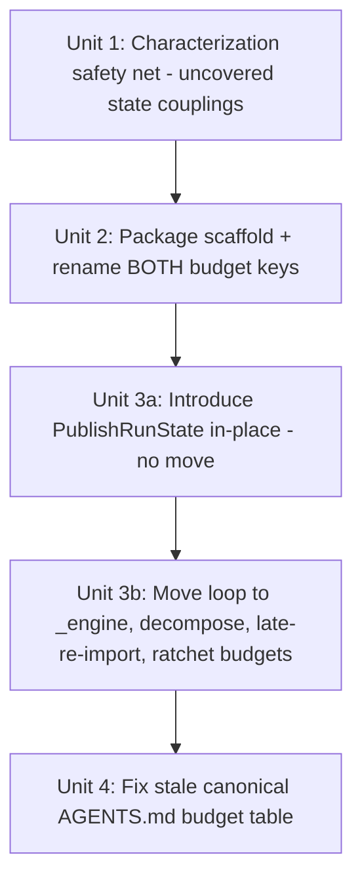

# refactor: Decompose publish_backlinks.py into a package without breaking mock seams

## Overview

`cli/publish_backlinks.py` is a single ~370-line stateful `main()` at **361/370 SLOC** (headroom 9 — the tightest CLI file vs its `monolith_budget.toml` ceiling) and **`main` is CC 49** (a named `complexity_budget.toml` entry, ceiling 49). The next change to it breaches the SLOC gate.

Decompose it into a `cli/publish_backlinks/` **package** — mirroring the proven `cli/plan_backlinks/` precedent — with a thin `__init__.py` shell (the patched namespace) and an `_engine.py` holding the per-row publish loop **decomposed into sub-helpers** driven by a `PublishRunState` dataclass. This relieves *both* budget gates with healthy headroom while keeping behavior byte-identical.

Two binding constraints, both confirmed against live code by the document-review pass:
1. **187 mock-seam `@patch` sites** (190 raw across **16 files**) bound to the `backlink_publisher.cli.publish_backlinks` namespace.
2. **The complexity gate** — `main` is CC 49; a naive single `run_publish_loop` would be born-complex (>30 backstop) and hard-fail CI. The extraction MUST decompose, not just relocate.

The seams are preserved via the **late-re-import pattern the `plan_backlinks` precedent actually uses** (the engine re-reads the seam name from the package namespace at call time) — **not** dependency injection (which has no in-repo precedent) and **not** patch-site migration.

## Problem Frame

`publish_backlinks.main()` orchestrates the fresh publish pipeline: arg-parse → row-validation loop → pre-publish setup (enforce-precondition / force-manifest / lease-acquire / adapter-verify / checkpoint-create) → per-row publish loop → epilogue. It is the publish **entry point** (high blast radius). Three hard constraints make a naive extraction unsafe:

1. **Mock seams (verified counts).** Tests patch these at the `cli.publish_backlinks` namespace — `verify_adapter_setup` (92×, setup-phase), `adapter_publish` (92×, loop), `_acquire_publish_leases` (2×, setup), `publish_with_policy` (1×, loop), `policy_enabled` (1×, loop), `checkpoint.create_checkpoint` (1×, setup, module-attribute), `_handle_auth_expired` (1×, loop) — **7 distinct symbols across 16 files**. (NOT patched at this namespace, contrary to an earlier draft: `check_url` — not even imported here; the real reachability seam is `linkcheck._check_url_once`. `_check_row_reachability` — only *directly called* in tests, 0 patches. `main` — 0 patches; those are direct `main([...])` invocations.) Because the seams are `from … import X`-bound into the namespace, moving a CALL to one of them into a different module makes the existing `@patch("…publish_backlinks.X")` stop intercepting it — unless the engine re-reads the name from the package namespace at call time (the chosen mechanism, D1).
2. **Complexity gate.** `main` is **CC 49** with `complexity_budget.toml::"cli/publish_backlinks.py::main"` (ceiling 49). `tests/test_no_complexity_regrowth.py` holds every unlisted function to a CC-30 backstop ("a born-complex new function hard-fails CI"). The package rename orphans the `::main` key (gate fail), and a monolithic extracted loop lands ~CC 32+ (gate fail). The extraction therefore must (a) rename the budget key and (b) decompose the loop into sub-CC-30 helpers — mirroring how `plan_backlinks/_engine.py` shipped `plan_rows` (CC 17) + `_dispatch_row` (CC 9), not one monolith.
3. **Threaded state.** The loop threads ~10 mutable counters (`success_count`, `fail_count`, `skipped_unreachable_count`, `skipped_quarantined_count`, `publish_path_drift_count`, `dedup_skip_count`, `dedup_hold_count`, `last_medium_success_idx`) plus `outputs`, `canary_warned`, `ts`, `initial_token_revs`, `banner_emit` **by reference**, and `run_id` **by value-rebinding** (reassigned 6× from helper return values; set to `None` on checkpoint failure — `_record_publish_failure` returns the possibly-nulled run_id). `run_id` is NOT a by-reference mutation and must be threaded as an explicit field that each rebinding site reassigns.

## Requirements Trace

- **R1.** Both budget gates pass with healthy headroom, updated **in the same PR** (Units 2+3 land together): `monolith_budget.toml` path renamed (`cli/publish_backlinks.py` → `cli/publish_backlinks/__init__.py`) + ceiling `round_up_to_10(new_SLOC+30)`; `complexity_budget.toml` `::main` key renamed and any new born-complex helper either decomposed ≤30 or given a named entry with ≥80-char rationale.
- **R2.** All 187 module-level `@patch` sites keep firing — proven by the 16 patching test files (23 referencing) passing unchanged (the patch suite is the behavioral tripwire).
- **R3.** Behavior byte-identical: exit codes, fresh-path output-row shapes, recon/counter semantics, dedup skip/hold verdicts, canary + reachability skips, the 6 exception arms (including **`AuthExpiredError` still skipping the epilogue** — see R3a), dry-run, and the load-bearing token-drift ordering (current `publish_backlinks.py:269-278`). Full suite green.
- **R3a.** The `AuthExpiredError` arm currently does `_handle_auth_expired(...); return`, returning from `main()` and SKIPPING `_publish_epilogue`. After the loop moves into the engine, a bare `return` would only exit the engine and `main()` would fall through to the epilogue — a silent behavior change. The extraction must signal auth-abort to `main()` (e.g. a `PublishRunState.auth_aborted` flag / sentinel) and guard the epilogue call.
- **R4.** The `publish-backlinks` console entry point (`pyproject.toml:39` → `…cli.publish_backlinks:main`) and the `python -m backlink_publisher.cli.publish_backlinks` form both keep working (package needs a `__main__.py` forwarder).
- **R5.** *(Side benefit, not a driver.)* The per-row helpers become independently testable. Behavior parity is fully covered by R2/R3; do not add bespoke test surface beyond what parity needs.

## Scope Boundaries

- **Not** touching the resume path (`cli/_resume.py`) — separate module with its own seams; its `_ResumeLoopState` is a *template to mirror*, not a target.
- **Not** changing output-row shapes, nor the two parallel emitters (`base.py::to_publish_output` fresh / `_resume.py::item_to_publish_output` resume). Preserve the documented asymmetry (checkpoint does not persist `_provider_meta`).
- **Not** changing dedup / checkpoint / canary / lease / reliability-policy behavior or the terminal-status vocabulary (`done` / `*_unverified` / failed).
- **Not** migrating the 187 patch sites to new module paths (the late-re-import mechanism makes migration unnecessary).
- **Not** touching `cli/_publish_helpers.py` (already split; near its own ceiling).
- No new product behavior; no CLI-flag changes.

## Context & Research

### Relevant Code and Patterns

- **Package template (proven):** `cli/plan_backlinks/` — `__init__.py` (thin re-export hub), `core.py` (shell), `_engine.py` (`plan_rows(...) -> PlanOutcome` kernel **decomposed into sub-helpers** `_dispatch_row` etc., each ≤ CC 30), `__main__.py` (`from . import main; raise SystemExit(main() or 0)` forwarder). **Seam handling: `_engine.py` re-reads patched names from the package namespace via a late (in-function) import** (e.g. `from backlink_publisher.cli.plan_backlinks import _scheduler_enabled_for` inside the function body) — this is the proven, zero-migration mechanism this plan adopts. (An earlier draft mis-cited this as dependency injection; it is not.)
- **State-object template:** `cli/_resume.py::_ResumeLoopState` — a plain `@dataclass` of loop counters threaded by reference into the module-level helper `_publish_one_resume_item(state, …)` and mutated in place. Models the `PublishRunState` by-reference fields. NOTE: `_resume.py` imports its seams at module level and tests patch `…cli._resume.adapter_publish` directly (co-location, not DI) — so it models the *dataclass*, not the seam mechanism.
- **Direct predecessor on this file:** the epilogue was extracted to `_publish_helpers.py::_publish_epilogue(...)` (pass-by-value counters, raises `SystemExit`).
- **Entry point:** `pyproject.toml:39` → `publish-backlinks = "backlink_publisher.cli.publish_backlinks:main"`; live `if __name__ == "__main__"` guard must become a `__main__.py` forwarder.

### Institutional Learnings (docs/solutions/)

- `best-practices/extract-cli-epilogue-block-2026-05-26.md` — predecessor refactor on this file; counter-threading + budget-ratchet discipline.
- `test-failures/ci-test-isolation-failures-medium-brave-sleep-timeout-2026-05-13.md` — the exact module-level patch targets + the seam mechanism ("patch the module-level reference").
- `integration-issues/dofollow-canary-verdict-dropped-at-publish-output-seam-2026-05-25.md` — "missed one dispatch path"; the two parallel output emitters; checkpoint omits `_provider_meta`.
- `logic-errors/projector-silent-drop-status-vocabulary-drift-2026-05-26.md` — terminal-status vocabulary must not drift loop → epilogue → `events.project_run_safe`.
- `test-failures/tests-coupled-to-operator-config-state-2026-05-18.md` (+ `del-os-environ-poisons-session-scoped-config-dir-fixture-2026-05-27.md`) — isolate with sandbox config + `monkeypatch.setenv`; "exit 0 + empty stdout is a routing-divergence smell."
- `logic-errors/python-m-needs-main-module-after-package-split-2026-05-19.md` — package conversion REQUIRES a `__main__.py`.

### Budget Mechanics (two gates — both confirmed against the test files)

- **SLOC gate** (`tests/test_no_monolith_regrowth.py` + `monolith_budget.toml`): publish_backlinks ceiling 370, live SLOC 361 (hr 9). Rule `0 ≤ ceiling - SLOC ≤ 50`, `ceiling = round_up_to_10(SLOC+30)`. New files <500 SLOC need no entry (warning-only canary at 500). The monitored path is a plain string key — `cli/publish_backlinks/__init__.py` works fine as a path. Keep `_engine.py` < 500.
- **Complexity gate** (`tests/test_no_complexity_regrowth.py` + `complexity_budget.toml`): named entries keyed `<relpath>::<fullname>` + a CC-30 global backstop ("born-complex new function hard-fails CI"). `cli/publish_backlinks.py::main` is entry CC 49. **This gate was missing from the earlier draft** and is the source of the P0 below.
- `radon==6.0.1` pinned; do not bump.

### The seam inventory (verified against the live test corpus)

| Group | Symbols | Handling |
|---|---|---|
| **Setup-phase seams** (called in `main()` shell, not loop) | `verify_adapter_setup` (92×), `_acquire_publish_leases` (2×), `checkpoint.create_checkpoint` (1×) | Stay called in the `__init__` shell. The patches target `__init__` namespace attributes (for `checkpoint`, the module object) → preserved with no DI, no migration. |
| **Loop-called seams** (move into `_engine`) | `adapter_publish` (92×), `policy_enabled` (1×), `publish_with_policy` (1×), `_handle_auth_expired` (1×) + the loop's `checkpoint.update_item` / `checkpoint.POLICY_SKIP` (currently unpatched) | Preserved via **late re-import** from the package namespace at call time (D1). `checkpoint` MUST be imported in `_engine` as a module (`from .. import checkpoint`) so its attribute patches stay visible on the shared singleton. |
| **Non-seam collaborators** (0 patch sites — call directly from `_engine`) | `gate_with_force`, `record_done`, `record_failure`, `_canary_gate`, `_publish_epilogue`, `_record_publish_path`, `_record_publish_failure`, `_do_verify` (its inner `verify_published` seam is bound in `_publish_helpers`, a different module — safe), `_build_failure_row`, `_build_skip_row`, `_try_update_ckpt_failed`, `_medium_throttle_sleep`, `_check_row_reachability` | Import from their real modules. |

## Key Technical Decisions

- **D1 — Package + late-re-import seam binding (THE fork).** Convert to a `publish_backlinks/` package; `__init__.py` is the patched namespace (imports/re-exports the 7 seam symbols, holds `main()`). The loop-called seams in `_engine` are resolved by a **late (in-function) import from the package namespace** at call time — exactly the proven `plan_backlinks/_engine.py` pattern — so every existing `@patch("…publish_backlinks.X")` keeps firing with **zero patch migration**. *Rejected:* (a) sibling-module + direct import — breaks the namespace patches; (b) dependency injection — no in-repo precedent, extra machinery (the earlier draft's mistake); (c) migrating 187 patch sites — unnecessary churn.
- **D2 — `PublishRunState` plain `@dataclass`.** By-reference fields mirror `_ResumeLoopState`; `run_id` is an explicit field that each of its 6 rebinding sites reassigns (value-threaded, not in-place mutation); add an `auth_aborted: bool` field for R3a.
- **D3 — `main()` shell + setup-phase seam calls stay in `__init__.py`.** Setup-phase seams need nothing extra (their patches target the `__init__` namespace they are called from).
- **D4 — Characterization-first.** Lock behavior before the move; the existing 187 patches + a focused characterization file targeting the *uncovered* multi-row state couplings are the tripwire.
- **D5 — The extraction is DECOMPOSITION, not relocation.** Split the loop into sub-CC-30 helpers (e.g. `_publish_one_row(...)` + a thin driver), mirroring `plan_backlinks`'s `_dispatch_row`, so no helper exceeds the CC-30 backstop. Measure each with `radon cc`; if one must exceed 30, add a `complexity_budget.toml` entry in the same PR.
- **D6 — Package form over sibling-module.** A single sibling `_publish_loop.py` would also clear the SLOC gate, but D5 requires *multiple* cohesive sub-helpers + `PublishRunState`; a package (`_engine.py` housing them, `__init__` shell) gives the cleaner home and namespace symmetry with `plan_backlinks`. The cost (a `__main__.py` forwarder; the `python -m` breakage risk class) is mitigated in Unit 2.

## Open Questions

### Resolved During Planning
- **Seam mechanism?** Late re-import from the package namespace (D1), not DI — corrected per document-review against the actual `plan_backlinks` precedent.
- **Where does `main()` live?** `__init__.py` (D3).
- **Is the loop a single function?** No — decompose to clear the CC-30 backstop (D5).
- **Are `check_url` / `_check_row_reachability` seams here?** No — verified 0 patches at this namespace; `_check_row_reachability` is a direct-call non-seam, `check_url` is bound in `linkcheck`.

### Deferred to Implementation
- Exact `PublishRunState` field set + the sub-helper boundary (`_publish_one_row` signature) — derive from the live loop at extraction time.
- Measured CC of each extracted helper (decide decompose-further vs named-entry per D5).
- Precise post-extraction SLOC of `__init__.py` (measure with radon; expected ~151 → ceiling ~190) and thus the exact ratcheted SLOC ceiling.

## High-Level Technical Design

> *This illustrates the intended approach and is directional guidance for review, not implementation specification.*

```
cli/publish_backlinks/
  __init__.py    # PATCHED NAMESPACE: imports the 7 seam symbols + holds main()
                 #   main(): parse -> _validate_all_rows -> pre-publish setup [setup-phase
                 #   seam calls live HERE] -> state = PublishRunState(...) ->
                 #   run_publish_loop(rows, args, config, state) ->
                 #   if not state.auth_aborted: _publish_epilogue(...)   # R3a guard
  _engine.py     # run_publish_loop(...) -> drives _publish_one_row(...) per row
                 #   _publish_one_row(...): the per-row body, <= CC 30 (D5)
                 #   PublishRunState dataclass (by-ref counters; run_id value-rebound; auth_aborted)
  __main__.py    # from . import main; raise SystemExit(main() or 0)
```

Seam binding (late re-import — the proven pattern, NOT DI):

```
# tests do:  @patch("backlink_publisher.cli.publish_backlinks.adapter_publish")
# _engine._publish_one_row(), at CALL TIME, re-reads the name from the package namespace:
#     from backlink_publisher.cli.publish_backlinks import adapter_publish   # lazy, in-function
#     result = adapter_publish(...)                                          # sees the mock
# checkpoint is imported as a module so attribute patches stay visible:
#     from .. import checkpoint;  checkpoint.update_item(...)
# run_id rebinding stays explicit (value-threaded, NOT by-reference):
#     state.run_id = _record_publish_failure(..., state.run_id, ...)
# auth-abort signals main() to skip the epilogue:
#     except AuthExpiredError: ...; state.auth_aborted = True; return   # main() guards on it
```

## Implementation Units



- [ ] **Unit 1: Characterization net for the UNCOVERED state couplings**

**Goal:** Pin the behaviors the existing 187-patch suite does NOT already cover — the multi-row, cross-iteration state couplings that the extraction actually risks.

**Requirements:** R3, R3a

**Dependencies:** None

**Files:** Create `tests/test_publish_backlinks_characterization.py`

**Approach:** Sandbox config (`monkeypatch.setenv`, never bare `os.environ`/`del`); existing module-level patches. Target the gaps, not duplication of existing single-row tests.

**Execution note:** Characterization-first — write green against current `main()` before Units 2-3.

**Patterns to follow:** `tests/test_publish_backlinks.py`; `tests-coupled-to-operator-config-state-2026-05-18.md`.

**Test scenarios:**
- Integration (R3a, currently UNTESTED): `AuthExpiredError` mid-run → `_handle_auth_expired` fires AND **no epilogue recon line is emitted** (pin the epilogue-skip explicitly).
- Integration (currently UNTESTED): `checkpoint.update_item` raises on row N → `run_id` becomes `None`, and row N+1 attempts NO checkpoint update (pins the `run_id` value-rebinding).
- Edge case: `last_medium_success_idx` throttle adjacency carried across ≥3 mixed success/skip rows.
- Edge case: append-then-mutate adjacency — a verified-failed row gets `outputs[-1]["status"] += "_unverified"` on the correct row.
- Edge case: empty / all-skipped input → exit 0 with recon summary (the "exit 0 + empty stdout = smell" pin).
- Happy path + dry-run: assert the exact output-row shapes (the parity baseline).

**Verification:** New file green against unmodified `main()`; full publish suite (16 patching files) green; the auth-epilogue and run_id-null scenarios are NEW coverage (confirm no existing test already asserts them).

- [ ] **Unit 2: Convert to `publish_backlinks/` package scaffold + rename BOTH budget keys (no behavior change)**

**Goal:** Establish the package namespace + `__main__.py` + update BOTH budget files' paths, with `main()` and all seam call-sites intact in `__init__.py`. Proves the namespace preserves the 187 patches before extraction.

**Requirements:** R2, R4, R1 (path renames)

**Dependencies:** Unit 1

**Files:**
- Create `cli/publish_backlinks/__init__.py` (former module body verbatim), `cli/publish_backlinks/__main__.py`
- Delete `cli/publish_backlinks.py`
- Modify `monolith_budget.toml` (path → `cli/publish_backlinks/__init__.py`; ceiling unchanged this unit) AND `complexity_budget.toml` (key → `cli/publish_backlinks/__init__.py::main`; ceiling 49 unchanged this unit)

**Approach:** Move verbatim into `__init__.py` so seam symbols stay in the same logical namespace; add `__main__.py` mirroring `plan_backlinks`; drop the old `__main__` guard; mirror the `# noqa: F401 re-exported for tests` convention.

**Execution note:** Pure relocation. The win is *proof* (via both gates + the patch tripwire) that the package namespace keeps patches firing.

**Patterns to follow:** `cli/plan_backlinks/__init__.py` + `__main__.py`; `python-m-needs-main-module-...`.

**Test scenarios:**
- Integration: all 16 patching test files + the Unit 1 file pass unchanged (187 patches still fire).
- Integration: `python -m backlink_publisher.cli.publish_backlinks --help` works; console entry imports `…cli.publish_backlinks:main`.
- `Test expectation: no new behavioral tests` — structural relocation.

**Verification:** Full suite green; `-m` form + console entry work; **both** `test_no_monolith_regrowth` and `test_no_complexity_regrowth` green (paths renamed, ceilings unchanged).

- [ ] **Unit 3a: Introduce `PublishRunState` threaded through the IN-PLACE loop (no module move)**

**Goal:** De-risk the stateful rewrite separately from the namespace move. Replace the ~14 loop locals with a `PublishRunState` instance, mutated by reference (counters) / reassigned (`run_id`), plus `auth_aborted` — all still inside `__init__.py`'s `main()`.

**Requirements:** R3, R3a (state plumbing)

**Dependencies:** Unit 2

**Files:** Modify `cli/publish_backlinks/__init__.py`; Create `cli/publish_backlinks/_engine.py` (just `PublishRunState` for now) or define inline then move in 3b.

**Approach:** Mirror `_ResumeLoopState`. `run_id` rebinding sites become `state.run_id = …`. The `AuthExpiredError` arm sets `state.auth_aborted = True` and the epilogue call is guarded. No code leaves `__init__` yet → bisectable: if the suite reddens, the cause is the state rewrite alone.

**Execution note:** Characterization-first — Unit 1 + the 187-patch suite are the tripwire.

**Patterns to follow:** `cli/_resume.py::_ResumeLoopState` + `_publish_one_resume_item`.

**Test scenarios:**
- Integration: full publish suite + Unit 1 green (behavior identical with state object in place).
- Edge case: the Unit 1 run_id-null and auth-epilogue scenarios still pass (now exercising `state.run_id` / `state.auth_aborted`).

**Verification:** Suite green; SLOC roughly unchanged (state object adds a little); both budget gates green.

- [ ] **Unit 3b: Move the state-threaded loop into `_engine.py`, decompose, late-re-import seams, ratchet budgets**

**Goal:** Physically move the loop into `_engine.py` as `run_publish_loop` + sub-CC-30 `_publish_one_row` helper(s), with loop-called seams resolved by late re-import; relieve both gates.

**Requirements:** R1, R2, R3, R5

**Dependencies:** Unit 3a

**Files:**
- Modify `cli/publish_backlinks/_engine.py` (`run_publish_loop`, `_publish_one_row`, finalize `PublishRunState`)
- Modify `cli/publish_backlinks/__init__.py` (`main()` becomes the thin shell + guarded epilogue)
- Modify `monolith_budget.toml` (ratchet `__init__.py` ceiling to `round_up_to_10(new_SLOC+30)`, rationale ≥80 chars) AND `complexity_budget.toml` (remove the now-thin `::main` entry or re-measure it; add a `_engine.py::run_publish_loop` / `_publish_one_row` entry only if a helper measures >30 after decomposition)

**Approach:** Loop-called seams via late (in-function) import from the package namespace (D1); `checkpoint` imported as a module; non-seam collaborators imported directly. Decompose so each helper ≤ CC 30 (D5). Preserve byte-identical row shapes, status vocabulary, the 6 arms, token-drift ordering, dry-run, and the R3a epilogue-skip.

**Execution note:** Characterization-first; highest-risk unit. Re-run the 187-patch tripwire AND `radon cc` on every new helper BEFORE ratcheting budgets.

**Technical design:** *(directional — see High-Level Technical Design; late re-import + sub-helper decomposition.)*

**Patterns to follow:** `plan_backlinks/_engine.py` (kernel + `_dispatch_row` decomposition + in-function seam re-import); `_resume.py` state threading.

**Test scenarios:**
- Integration (primary acceptance): full Unit 1 set + all 16 patching files pass unchanged — the late-re-import preserves every `@patch("…publish_backlinks.X")`. 
- Error path: a patched `adapter_publish` raising `ExternalServiceError` → failed row + `state.fail_count` increments exactly as before (proves the seam fires through the moved helper).
- Edge case: multi-row `run_id`-null-then-next-row and `last_medium_success_idx` carry (re-assert Unit 1 through the moved code).
- Integration: `AuthExpiredError` → `state.auth_aborted` → epilogue skipped (R3a through the moved code).

**Verification:** `__init__.py` SLOC ~151 (measure); both ceilings ratcheted with headroom in [0,50] and every helper ≤ CC 30 (or budgeted); `_engine.py` < 500 SLOC; full suite (8000+) green; 187-patch tripwire green.

- [ ] **Unit 4: Fix the stale CANONICAL AGENTS.md monolith-budget table**

**Goal:** Correct the budget table (claims "6 source files" / `cli/publish_backlinks.py | 730`; live gate tracks ~14 files + the post-refactor path/ceiling).

**Requirements:** R1 (doc parity)

**Dependencies:** Unit 3b

**Files:** Modify the **canonical** `backlink-publisher/AGENTS.md` (NOT a worktree stale copy — per CLAUDE.md the canonical lives at `backlink-publisher/AGENTS.md`).

**Approach:** Align prose with `monolith_budget.toml` + `complexity_budget.toml`; note the TOML+tests are authoritative.

**Test expectation: none -- documentation-only change.**

**Verification:** Table matches the live monitored sets; no test impact.

## System-Wide Impact

- **Interaction graph:** `main()` (shell) → setup-phase seams (in-namespace) → `run_publish_loop` → `_publish_one_row` (late-re-import loop seams + direct non-seam calls) → guarded `_publish_epilogue` → `events.project_run_safe`.
- **Error propagation:** the 6 exception arms preserve exit-code mapping; `AuthExpiredError` must skip the epilogue (R3a); `DependencyError`'s `emit_error` raises `SystemExit` (NoReturn) and propagates safely through the engine frame. Do not widen/collapse `except` clauses.
- **State lifecycle risks:** `run_id` value-rebinding (6 sites) is the subtlest trap — a missed reassignment leaves a stale run_id writing to a dead run; pinned by the Unit 1 run_id-null scenario. Lease acquire/release (atexit) + token-drift abort ordering survive the state move. Resume path untouched.
- **API surface parity:** fresh vs resume emitters stay separate; fresh row shapes byte-identical. Console entry + `-m` unchanged.
- **Integration coverage:** the 187-patch suite + Unit 1's new state-coupling scenarios are the cross-layer proof; re-run after each unit.
- **Unchanged invariants:** terminal-status vocabulary; `status="published" ⟹ non-empty url`; checkpoint omits `_provider_meta`; dedup/canary/lease behavior.

## Risks & Dependencies

| Risk | Mitigation |
|------|------------|
| Complexity gate hard-fails (orphaned `::main` key on rename; born-complex extracted loop) — P0 | Unit 2 renames the key; Unit 3b decomposes to ≤ CC 30 (D5) and re-measures with radon before ratcheting; both gates in every unit's verification. |
| A loop-called seam patch silently stops firing after the move | Late re-import re-reads the package-namespace name at call time (D1, proven by `plan_backlinks`); Unit 3a defers the move so Unit 2 first proves the namespace; the 187-patch suite is a hard tripwire after every unit. |
| `AuthExpiredError` epilogue now runs on abort (silent behavior change) — R3a | `state.auth_aborted` + guarded epilogue; Unit 1 adds the (currently missing) epilogue-skip characterization. |
| `run_id` value-rebinding mis-threaded → writes to a dead run | Explicit `state.run_id = …` at all 6 sites; Unit 1 pins checkpoint-fail-then-next-row. |
| `python -m` breaks silently (empty `__main__.py`) | Unit 2 adds the forwarder + a `-m --help` smoke scenario. |
| SLOC ratchet target (~151 → ceiling ~190) is an estimate | Measure with radon in Unit 3b before setting the ceiling (must land in [SLOC, SLOC+50]). |
| Implementer collides with an existing branch / stale baseline | `refactor/publish-backlinks-decompose` already exists — it is THIS planning worktree (expected, not prior art). Base off current `origin/main`; re-measure `_publish_helpers.py` rather than trusting any cited figure. |

## Sources & References

- Origin: direct technical-planning request (no upstream `ce:brainstorm` doc — bounded refactor).
- Templates: `cli/plan_backlinks/` (package + late-re-import + `_dispatch_row` decomposition), `cli/_resume.py::_ResumeLoopState`.
- Gates: `tests/test_no_monolith_regrowth.py` + `monolith_budget.toml`; `tests/test_no_complexity_regrowth.py` + `complexity_budget.toml`.
- Entry point: `pyproject.toml:39`.
- Learnings: the six docs/solutions entries listed under Context.
- Document-review (2026-06-02) corrected: the complexity gate (P0), the seam mechanism (late-re-import not DI), the verified seam inventory, R3a (auth-epilogue), and run_id semantics.
- Related merged PRs (this session): #372 adapters, #379 generate_backlink_text, #381 _publish_helpers.
